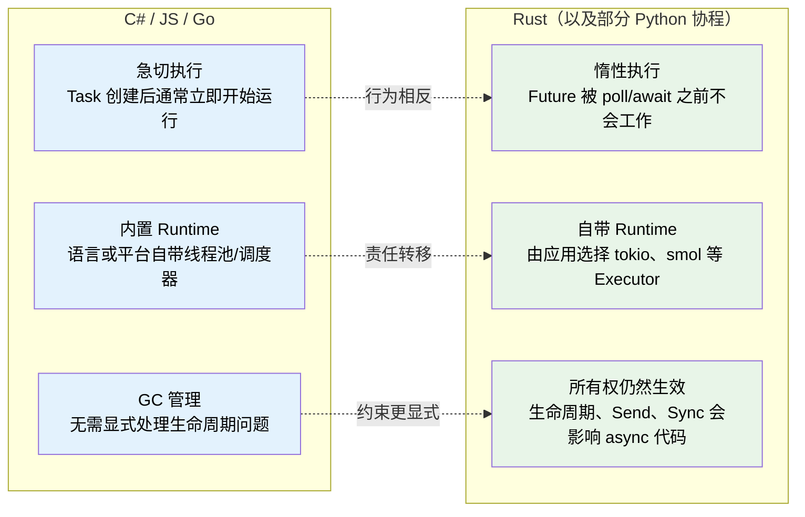
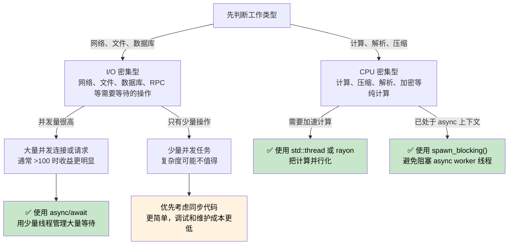

# 1. 为什么 Rust 的异步（async）与众不同 🟢

> **你将学到什么：**
> - 为什么 Rust 没有内置异步 Runtime，以及这如何影响你的代码结构
> - Rust 异步的三个核心特性：惰性执行、自带 Runtime、零成本抽象
> - 什么场景适合使用 async，什么场景反而应该坚持同步或多线程
> - Rust 异步模型与 C#、Go、Python、JavaScript 的关键差异

## 根本区别

很多语言把 `async/await` 背后的机制隐藏了起来。C# 有 CLR 线程池，JavaScript 有事件循环，Go 把 goroutine 调度器内置进 Runtime，Python 有 `asyncio` 事件循环。

**Rust 默认什么都不提供。**

Rust 没有内置异步 Runtime，没有默认线程池，也没有语言级事件循环。`async` 关键字本质上是一种编译策略：编译器把函数转换成实现了 `Future` trait 的状态机（state machine）。这个状态机不会自己前进，必须由某个外部组件——也就是 *Executor*（执行器）——不断地 `poll` 它。

### Rust 异步的三个关键属性



> \* Python 协程和 Rust Future 一样具有惰性：创建协程对象本身不会执行代码，必须 await 或调度后才会运行。不过 Python 仍然由 GC 管理对象生命周期，也没有 Rust 这种所有权和借用检查。

### 没有内置 Runtime

```rust
// ============================================================
// 核心概念：Rust 没有内置 Runtime —— async fn 调用只是创建一个惰性 Future
// ============================================================
// async fn 是一种编译期转换：编译器将它展开为一个实现了 Future trait 的状态机结构体。
// 调用 async fn 不会执行函数体，只是构造了一个代表"将来要完成的计算"的值。
// 只有显式地 .await 或通过 Executor::block_on 驱动，状态机才会被推进。

// ↓ 声明一个异步函数，返回类型实际是 impl Future<Output = String>
async fn fetch_data() -> String {
    "hello".to_string()  // 这行代码在被 poll 之前不会执行
}

fn main() {
    // ↓ 调用 async fn 并不运行函数体，只是创建一个 Future 值
    // → future 是栈上的一个状态机结构，包含 resume 所需的所有局部变量
    let future = fetch_data();

    // ⚠️ 注意：此时 future 仅仅是一个值，函数体一行都没跑过。
    // 因为没有 Executor 来调 poll()，也没有 .await 表达式来驱动它。

    // ↓ 丢弃 Future 等价于取消操作 —— 函数体从未被真正执行
    // → 这就是 Rust 异步的"取消"语义：丢弃 = 停止 poll = 取消
    drop(future);
}
```

对比 C#，`Task` 通常是急切启动的：

```csharp
// C# 中调用 async 方法通常会立即开始执行，返回的 Task 表示一个正在进行中的操作。
// 这与 Rust 的惰性 Future 形成根本对比。
async Task<string> FetchData() => "hello";

var task = FetchData();     // ← 工作已经被启动，可能在线程池中运行
var result = await task;    // ← await 仅仅是等待已完成的工作，取出结果
```

### Lazy Future 与 Eager Task

这是学习 Rust 异步时最重要的心智转变：

|  | C# / JavaScript | Python | Go | Rust |
|---|---|---|---|---|
| **创建** | `Task` 通常立即开始执行 | 协程对象是**惰性**的，必须 await 或调度 | goroutine 立即启动 | `Future` 在被 poll 前不做任何事 |
| **丢弃** | 分离的 Task 通常继续运行 | 未 await 的协程被 GC 回收，可能产生警告 | goroutine 一直运行到返回 | 丢弃 Future 即取消它 |
| **Runtime** | 语言或 VM 内置 | `asyncio` 事件循环，需要显式启动 | 编译进二进制的 M:N 调度器 | 应用自行选择，如 tokio、smol |
| **调度** | 自动交由线程池或事件循环 | 事件循环 + `await` / `create_task()` | 自动调度 | 显式使用 `spawn`、`block_on` 或 `.await` |
| **取消** | 通常依赖 `CancellationToken` 等协作机制 | `Task.cancel()` 协作取消，抛出 `CancelledError` | 通常通过 `context.Context` 协作取消 | 丢弃 Future 即立即停止继续 poll |

```rust
// ============================================================
// 核心概念：要真正运行 Future，必须把它交给 Executor 来驱动
// ============================================================
// #[tokio::main] 是一个属性宏，它会：
//   1. 创建一个 tokio Runtime（包含线程池、I/O 事件循环、任务队列）
//   2. 将 async main 转化为一个顶级任务丢给 Runtime 执行
//   3. Runtime 循环 poll 这个任务直到它返回 Ready
// 这实际上是 #7 行中 "block_on" 模式的生产级版本。

#[tokio::main]  // → 展开后创建 Runtime 并以 block_on(fetch_data()) 的方式调用
async fn main() {
    // ↓ .await 是驱动 Future 的语法糖：
    //   编译器在此处生成 poll 循环，每次 poll 返回 Pending 就把控制权交还给 Executor
    // → 直到 Future 返回 Ready("hello")，result 才被赋值为 "hello"
    let result = fetch_data().await;
    println!("{result}");
}
```

### 何时使用 async，何时不使用



**经验法则**：async 适合 I/O 密集型并发——也就是大量任务大部分时间都在等待外部事件。它不适合直接提升 CPU 计算速度。如果你有 10,000 个网络连接，async 极具价值；如果你在压缩文件、解析大 JSON 或跑数值计算，应该优先考虑 `rayon` 或原生线程。

### async 也可能更慢

async 不是免费的。对于低并发工作负载，同步代码往往更简单，甚至可能更快：

| 成本 | 原因 |
|------|-----|
| **状态机开销** | 每个 `.await` 点都会让编译器生成新的状态；深层嵌套 Future 会产生庞大复杂的状态机类型 |
| **动态分发开销** | `Box<dyn Future>` 引入虚函数调用的间接性，减少编译期内联优化的机会 |
| **上下文切换开销** | 协作式调度也有成本；Executor 需要维护任务队列、Waker 列表和 I/O 事件注册 |
| **编译时间增长** | async 代码生成的类型更复杂，编译器需要做更多工作来展开、类型检查和优化 |
| **调试难度增加** | 栈追踪会穿过状态机和 Runtime 内部层，阅读起来比同步调用栈困难得多（见第 12 章） |

**基准测试建议**：如果并发 I/O 操作少于 10 个，不要默认上 async。先做性能画像。在现代 Linux 上，为少量连接使用 `std::thread::spawn` 往往完全够用，而且代码更直接、更容易调试。

### 练习：什么时候应该使用 async？

<details>
<summary>🏋️ 练习（点击展开）</summary>

判断下面场景是否适合 async，并说明原因：

1. 一个 Web 服务器需要处理 10,000 个并发 WebSocket 连接
2. 一个 CLI 工具只负责压缩单个大文件
3. 一个服务需要同时查询 5 个数据库，然后合并结果
4. 一个游戏引擎需要以 60 FPS 运行物理模拟

<details>
<summary>🔑 参考答案</summary>

1. **适合 async**：I/O 密集型且并发量极大。每个连接大部分时间都在等待数据；如果为每个连接分配一个 OS 线程，会浪费大量栈空间（默认每线程约 2-8MB）。
2. **不适合 async，用同步/线程**：这是 CPU 密集型单任务。async 只会增加状态机和调度开销，并不加速计算；并行压缩可以考虑 `rayon`。
3. **适合 async**：这是多个独立 I/O 等待。可以用 `tokio::join!` 同时发起 5 个查询，将总等待时间从串行累加降到最慢查询的延迟。
4. **不适合 async，用同步/线程**：这是 CPU 密集型且延迟敏感的工作。async 的协作式调度可能引入帧抖动（一个任务不让出，其他任务就得等）。

</details>
</details>

> **关键要点：为什么 Rust async 不同**
> - Rust Future 是**惰性**的：只有被 Executor poll，才会真正推进
> - Rust **没有内置 Runtime**：你需要选择或构建 Runtime
> - `async` 是一种**零成本编译策略**：它把代码转换成状态机，而不是引入 GC 或隐藏线程
> - async 适合 **I/O 密集型并发**；CPU 密集型工作应优先使用线程或 `rayon`

> **另请参阅：** [第 2 章 — Future trait](ch02-the-future-trait.md) 解释异步的核心 trait，[第 7 章 — Executor 与 Runtime](ch07-executors-and-runtimes.md) 讨论 Runtime 选择策略

***
