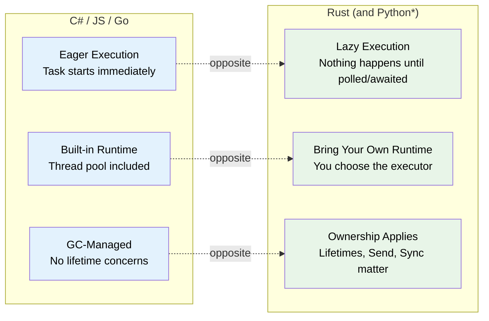
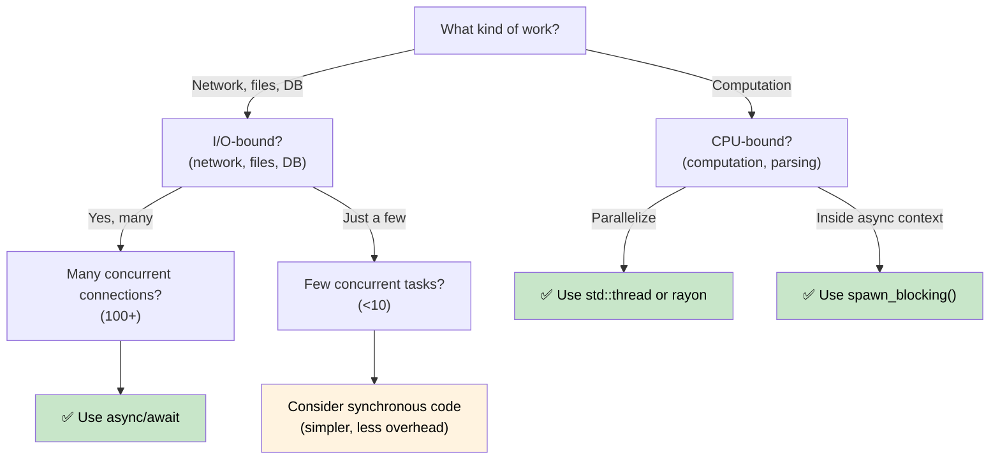

# 1. 为什么异步在 Rust 🟢 中有所不同

> **您将学到什么：**
> - 为什么 Rust 没有内置的异步Runtime（以及这对您意味着什么）
> - 三个关键属性：延迟执行、无Runtime、零成本抽象
> - 当异步是正确的工具时（以及当它速度较慢时）
> - Rust 的模型与 C#、Go、Python 和 JavaScript 的比较

## 根本区别

大多数带有 `async/await` 的语言都隐藏了机制。 C#有CLR线程池。 JavaScript 有事件循环。 Go 在Runtime中内置了 goroutine 和调度程序。 Python有`asyncio`。

**Rust什么都没有。**

没有内置的Runtime，没有线程池，没有事件循环。 `async`关键字是一种零成本编译策略——它将您的函数转换为实现`Future`trait的状态机。其他人（*执行器*）必须推动该状态机前进。

### Rust 异步的三个关键属性



> \* Python 协程像 Rust Future一样是惰性的——它们在等待或安排之前不会执行。然而，Python仍然使用GC并且没有所有权/生命周期问题。

### 无内置 Runtime

```rust
// 这可以编译，但什么也不做：
async fn fetch_data() -> String {
    "hello".to_string()
}

fn main() {
    let future = fetch_data(); // 创建 Future，但不执行它
    // Future 只是一个位于栈上的结构体
    // 没有输出，没有副作用，什么也没有发生
    drop(future); // 默默地放弃——工作从未开始
}
```

与 C# 比较，其中 `Task` 急切地开始：
```csharp
// C# 会立即开始执行：
async Task<string> FetchData() => "hello";

var task = FetchData(); // 已经running!
var result = await task; // 只需等待完成即可
```

### Lazy Future 与 Eager Tasks

这是最重要的心理转变：

|  | C# / JavaScript | Python | Go | Rust |
|---|---|---|---|---|
| **创建** | `Task`立即开始执行 | 协程是**惰性** — 返回一个对象，在等待或计划之前不会运行 | Goroutine 立即启动 | `Future` 在轮询之前不执行任何操作 |
| **掉落** | 分离的任务继续运行 | 未等待的协程被垃圾收集（带有警告） | Goroutine 运行直到返回 | 删除 Future 即可取消 |
| **Runtime** | 内置于语言/VM 中 | `asyncio` 事件循环（必须显式启动） | 内置于二进制文件中（M:N 调度程序） | 您选择（tokio、smol等） |
| **日程安排** | 自动（线程池） | 事件循环 + `await` 或 `create_task()` | 自动（GMP 调度程序） | 显式（`spawn`，`block_on`） |
| **消除** | `CancellationToken`（合作） | `Task.cancel()`（合作，加薪`CancelledError`） | `context.Context`（合作） | 放弃Future（立即） |

```rust
// 要真正运行 Future，你需要一个执行器：
#[tokio::main]
async fn main() {
    let result = fetch_data().await; // 现在它执行
    println!("{result}");
}
```

### 何时使用异步（以及何时不使用）



**经验法则**：异步用于 I/O 并发（在等待时同时执行许多操作），而不是 CPU 并行（使一件事更快）。如果您有 10,000 个网络连接，异步就会大放异彩。如果您要处理数字，请使用 `rayon` 或操作系统线程。

### 当异步可能*慢*时

异步不是免费的。对于低并发工作负载，同步代码的性能优于异步代码：

| 成本 | 为什么 |
|------|-----|
| **状态机开销** | 每个`.await`添加一个枚举变体；深度嵌套的 future 产生大型、复杂的状态机 |
| **动态调度** | `Box<dyn Future>` 添加间接并杀死内联 |
| **Context切换** | 协作调度仍然有成本——执行器必须管理任务队列、Waker和 I/O 注册 |
| **编译时间** | 异步代码生成更复杂的类型，减慢编译速度 |
| **可调试性** | 通过状态机的栈跟踪更难读取（参见第 12 章） |

**基准测试指南**：如果并发 I/O 操作少于 10 个，则在提交异步之前进行分析。每个连接一个简单的 `std::thread::spawn` 可以在现代 Linux 上扩展到数百个线程。

### 练习：什么时候会使用异步？

<details>
<summary>🏋️锻炼（点击展开）</summary>

对于每个场景，确定异步是否合适并解释原因：

1. 处理 10,000 个并发 WebSocket 连接的 Web 服务器
2. 压缩单个大文件的 CLI 工具
3. 查询 5 个不同数据库并合并结果的服务
4. 以 60 FPS 运行物理模拟的游戏引擎

<details>
<summary>🔑解决方案</summary>

1. **异步** — I/O 限制，具有大量并发性。每个连接花费大部分时间等待数据。线程需要 10K 栈。
2. **Sync/线程** — CPU 限制、单任务。异步增加了开销，但没有任何好处。使用`rayon`进行并行压缩。
3. **异步** — 五个并发 I/O 等待。 `tokio::join!` 同时运行所有五个查询。
4. **Sync/线程** — CPU 限制，延迟敏感。异步的协作调度可能会引入帧抖动。

</details>
</details>

> **关键要点 - 为什么异步不同**
> - Rust Future 是**懒**的——它们在被执行器轮询之前什么都不做
> - **没有内置 Runtime** - 您选择（或构建）自己的Runtime
> - 异步是一种产生状态机的**零成本编译策略**
> - 异步在**I/O 绑定并发**方面表现出色；对于 CPU 密集型工作，请使用线程或人造丝

> **另请参阅：** [第 2 章 — Future trait](ch02-the-future-trait.md) 用于使这一切正常工作的 trait，[第 7 章 — 执行器和 Runtime](ch07-executors-and-runtimes.md) 用于选择 Runtime

***


