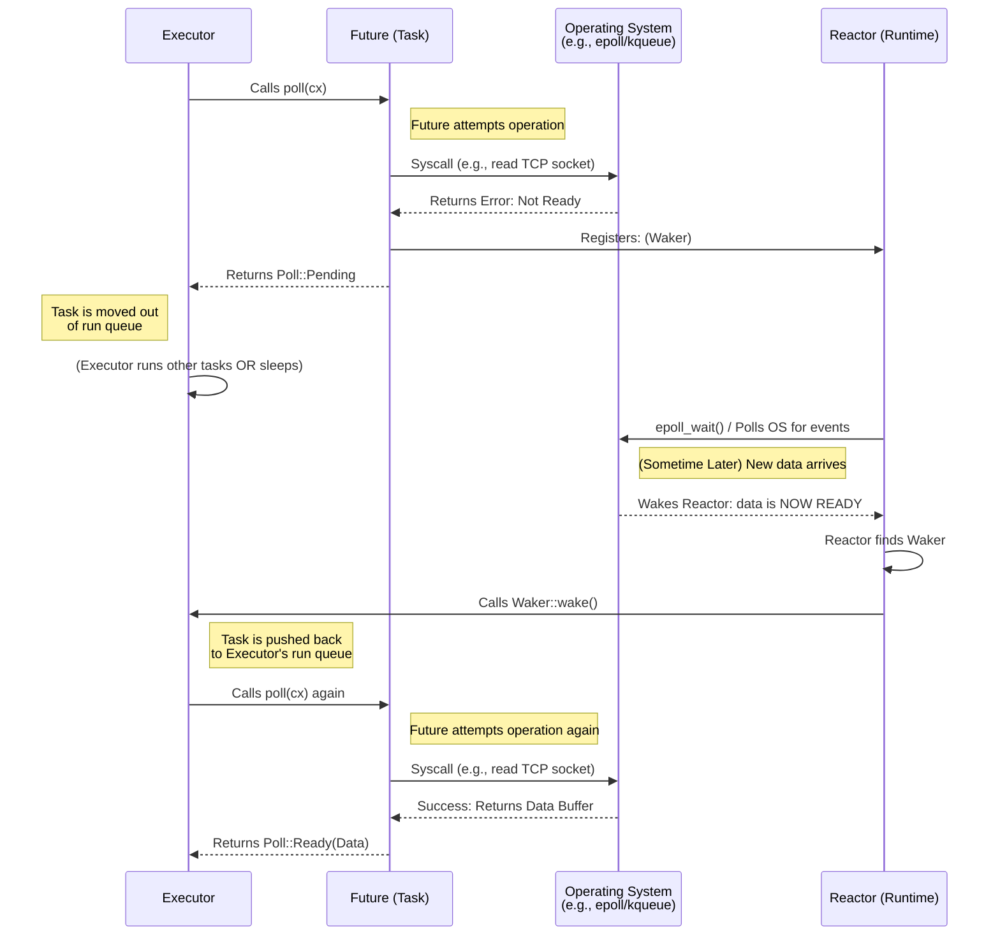

# 2. Future trait🟡

> **您将学到什么：**
> - `Future` trait：`Output`、`poll()`、`Context`、`Waker`
> - Waker如何告诉执行器“再次轮询我”
> - 契约：永远不要调用 `wake()` = 你的程序默默地挂起
> - 亲手实现真实的Future (`Delay`)

## Future 的解剖

异步 Rust 中的所有内容最终都实现了这个trait：

```rust
pub trait Future {
    type Output;

    fn poll(self: Pin<&mut Self>, cx: &mut Context<'_>) -> Poll<Self::Output>;
}

pub enum Poll<T> {
    Ready(T),   // Future 已完成，产生值 T
    Pending,    // Future 尚未就绪，稍后再唤醒我
}
```

就是这样。 `Future` 是任何可以*轮询*的东西——问“你完成了吗？” - 并回答“是的，这就是结果”或“还没有，当我准备好时我会叫醒你。”

### 输出，poll()，Context，Waker



让我们分解每一部分：

```rust
use std::future::Future;
use std::pin::Pin;
use std::task::{Context, Poll};

// 立即返回 42 的Future
struct Ready42;

impl Future for Ready42 {
    type Output = i32; // Future 最终产生的值类型

    fn poll(self: Pin<&mut Self>, _cx: &mut Context<'_>) -> Poll<i32> {
        Poll::Ready(42) // 时刻准备着——无需等待
    }
}
```

**组件**：
- **`Output`** — future 完成时产生的值类型
- **`poll()`** — 由执行器调用来检查进度；返回 `Ready(value)` 或 `Pending`
- **`Pin<&mut Self>`** — 确保Future 不会在内存中移动（我们将在第 4 章中介绍原因）
- **`Context`** — 携带 `Waker`，因此 future 可以在准备好取得进展时向执行器发出信号

### Waker合约

`Waker`是回调机制。当 future 返回 `Pending` 时，它 *必须* 安排稍后调用 `waker.wake()` - 否则执行器将永远不会再次轮询它并且程序会挂起。

```rust
use std::task::{Context, Poll, Waker};
use std::pin::Pin;
use std::future::Future;
use std::sync::{Arc, Mutex};
use std::thread;
use std::time::Duration;

/// 延迟后完成的Future（玩具实现）
struct Delay {
    completed: Arc<Mutex<bool>>,
    waker_stored: Arc<Mutex<Option<Waker>>>,
    duration: Duration,
    started: bool,
}

impl Delay {
    fn new(duration: Duration) -> Self {
        Delay {
            completed: Arc::new(Mutex::new(false)),
            waker_stored: Arc::new(Mutex::new(None)),
            duration,
            started: false,
        }
    }
}

impl Future for Delay {
    type Output = ();

    fn poll(mut self: Pin<&mut Self>, cx: &mut Context<'_>) -> Poll<()> {
        // 存储唤醒之前检查是否已完成
        if *self.completed.lock().unwrap() {
            return Poll::Ready(());
        }

        // 存储Waker - 执行器可以在每次轮询中传递一个新的Waker
        *self.waker_stored.lock().unwrap() = Some(cx.waker().clone());

        // 在第一次轮询时启动后台计时器
        if !self.started {
            self.started = true;
            let completed = Arc::clone(&self.completed);
            let waker = Arc::clone(&self.waker_stored);
            let duration = self.duration;

            thread::spawn(move || {
                thread::sleep(duration);
                *completed.lock().unwrap() = true;

                // 关键：唤醒执行器，让它再次轮询我们
                if let Some(w) = waker.lock().unwrap().take() {
                    w.wake(); // “嘿执行器，我准备好了——投票给我again!”
                }
            });
        }

        // 存储唤醒后仔细检查完成情况（处理竞争条件）
        if *self.completed.lock().unwrap() {
            return Poll::Ready(());
        }

        Poll::Pending // 还没有完成
    }
}
```

> **关键见解**：在 C# 中，TaskScheduler 自动处理唤醒。
> 在 Rust 中，**你**（或者你使用的I/O库）负责调用
> `waker.wake()`。忘记它，你的程序就会默默地挂起。

### 练习：实现 CountdownFuture

<details>
<summary>🏋️锻炼（点击展开）</summary>

**挑战**：实现一个从 N 到 0 倒数的 `CountdownFuture`，每次轮询时打印当前计数。当达到 0 时，以 `Ready("Liftoff!")` 结束。

*提示*：Future 需要存储当前计数并在每次轮询时递减。请记住始终重新注册 Waker！

<details>
<summary>🔑解决方案</summary>

```rust
use std::future::Future;
use std::pin::Pin;
use std::task::{Context, Poll};

struct CountdownFuture {
    count: u32,
}

impl CountdownFuture {
    fn new(start: u32) -> Self {
        CountdownFuture { count: start }
    }
}

impl Future for CountdownFuture {
    type Output = &'static str;

    fn poll(mut self: Pin<&mut Self>, cx: &mut Context<'_>) -> Poll<Self::Output> {
        if self.count == 0 {
            println!("Liftoff!");
            Poll::Ready("Liftoff!")
        } else {
            println!("{}...", self.count);
            self.count -= 1;
            cx.waker().wake_by_ref(); // 立即安排重新投票
            Poll::Pending
        }
    }
}
```

**关键要点**：这个Future每次计数都会轮询一次。每次返回`Pending`时，它都会立即唤醒自己以再次轮询。在生产中，您可以使用计时器而不是忙轮询。

</details>
</details>

> **关键要点 — Future trait**
> - `Future::poll()` 返回 `Poll::Ready(value)` 或 `Poll::Pending`
> - future 必须在返回 `Pending` 之前注册 `Waker` — 执行器使用它来知道何时重新轮询
> - `Pin<&mut Self>` 保证Future 不会在内存中移动（自引用状态机需要 - 参见第 4 章）
> - 异步 Rust 中的所有内容 — `async fn`、`.await`、组合器 — 均基于此 trait 构建

> **另请参阅：** [第 3 章 — Poll 的工作原理](ch03-how-poll-works.md) 用于执行程序循环，[第 6 章 — 手工构建 Future](ch06-building-futures-by-hand.md) 用于更复杂的实现

***


