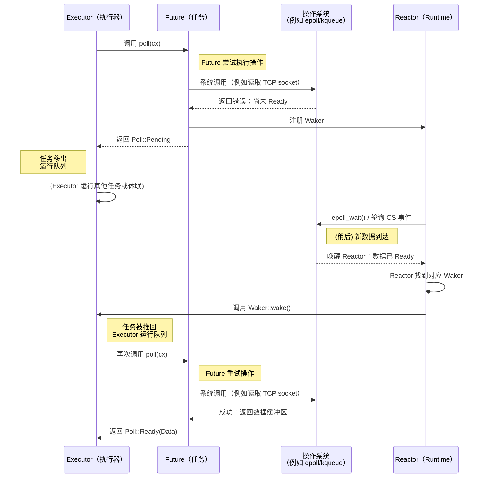

# 2. Future trait 🟡

> **你将学到什么：**
> - `Future` trait 的组成部分：`Output`、`poll()`、`Context`、`Waker`
> - Waker 如何告知执行器（executor）"再次轮询我"
> - 核心契约：一旦忘记调用 `wake()`，你的程序就会静默挂起
> - 手写实现一个真实的 Future（`Delay`）

## Future 的解剖

异步（async）Rust 中的一切最终都实现了这个 trait：

```rust
// ============================================================
// Future trait：所有异步计算的统一抽象
// ============================================================
// Future 代表"尚未就绪的异步计算"。整个 Rust 异步生态系统 ——
// async fn、.await、tokio::spawn、各种组合器 —— 最终都建立在这个
// 只有两个成员的 trait 之上。
//
// poll() 的设计遵循"尽力推进"哲学：
//   每次调用都会尽可能推进计算，直到遇到阻塞点或完成。
//   如果无法继续，就注册 Waker 并返回 Pending，等待外部事件唤醒。

pub trait Future {
    // ↓ 关联类型：声明 Future 完成后产出的值类型
    // → 对于 async fn foo() -> String，Output 就是 String
    type Output;

    // ↓ 核心方法：执行器调用它来推动 Future 前进
    //   self: Pin<&mut Self> ——   固定引用，防止 Future 在 poll 中间被移动
    //                              （自引用状态机（state machine）需要这个保证，详见第 4 章）
    //   cx: &mut Context<'_>   —— 携带 Waker，用于注册"我准备好了"的回调
    fn poll(self: Pin<&mut Self>, cx: &mut Context<'_>) -> Poll<Self::Output>;
}

// ↓ Poll 是一个标准库枚举，只有两个变体
pub enum Poll<T> {
    Ready(T),   // → 计算已完成，包含结果值 T
    Pending,    // → 计算尚未就绪，已注册 Waker，等待被唤醒
}
```

就是这样。`Future` 是可以被*轮询*的任何事物——对它发问"你完成了吗？"——然后它回答"是的，这是结果"或"还没有，我准备好时会叫醒你"。

### Output、poll()、Context、Waker



让我们逐一拆解每个组件：

```rust
// ============================================================
// 最简单的 Future 实现 —— 立即就绪，演示 trait 的基本结构
// ============================================================
// 这个例子展示了 Future trait 的最小实现骨架：
//   1. 定义一个 struct（它代表状态机的存储空间）
//   2. 指定关联类型 Output（它代表最终结果类型）
//   3. 实现 poll() 方法（它定义状态机的行为）
//
// Ready42 是最简单的状态机：它只有一个状态 —— "已完成"。
// 真实的状态机（如 async fn 生成的代码）会在不同 .await 点之间切换状态。

// ↓ 导入 Future trait 和相关类型 —— 编写 Future 实现必须用到的三个模块
use std::future::Future;   // → Future trait 本身
use std::pin::Pin;         // → Pin 类型，用于固定自引用结构的指针
use std::task::{Context, Poll};  // → Context（携带 Waker）和 Poll 枚举

// ↓ 这个结构体不需要任何字段，因为它的结果值是硬编码的
struct Ready42;

impl Future for Ready42 {
    // ↓ Future 完成时产出一个 i32 值
    type Output = i32;

    // ↓ poll() 签名解读：
    //   self: Pin<&mut Self>   已经在调用前被 Pin 固定，保证不移位
    //   _cx: &mut Context<'_>  标注 _ 前缀表示此 Future 不需要注册 Waker
    //                          因为它是即时完成的，永远不会返回 Pending
    fn poll(self: Pin<&mut Self>, _cx: &mut Context<'_>) -> Poll<i32> {
        // → 直接返回 Ready —— 这个 Future 在第一次 poll 时即告完成
        Poll::Ready(42)
    }
}
```

**各组件简介**：
- **`Output`** — Future 完成时产出的值的类型。对于 `async fn foo() -> String`，`Output` 就是 `String`。
- **`poll()`** — 由执行器调用来检查进度的方法；返回 `Ready(value)` 表示完成，返回 `Pending` 表示还需要等待。
- **`Pin<&mut Self>`** — 保证 Future 在内存中不会被移动。自引用的状态机类型需要这个保证（详见第 4 章）。
- **`Context`** — 携带 `Waker`，让 Future 可以在准备好继续推进时向执行器发送信号。

### Waker 契约

`Waker` 是回调机制。当 Future 返回 `Pending` 时，它**必须**安排稍后调用 `waker.wake()`——否则执行器永远不会再次轮询它，程序就会卡死。

```rust
// ============================================================
// Delay：一个利用后台线程 + Waker 的 Future 实现
// ============================================================
// 核心概念：当 poll() 发现条件不满足时，不是自旋等待，而是：
//   1. 保存 Waker → 注册"条件满足时叫我"的意图
//   2. 返回 Pending → 让出 CPU，允许执行器处理其他任务
//   3. 外部线程在条件满足时调用 waker.wake() → 执行器被通知重新调度此任务
//
// 设计要点：
//   - Arc<Mutex<bool>>      → 多线程间共享完成标志
//   - Arc<Mutex<Option<Waker>>> → 安全地跨线程传递 Waker
//   - started 字段          → 防止重复创建后台线程
//   - 双重检查模式           → 避免 Waker 注册和条件满足之间的竞态窗口

use std::task::{Context, Poll, Waker};
use std::pin::Pin;
use std::future::Future;
use std::sync::{Arc, Mutex};
use std::thread;
use std::time::Duration;

/// 一个在指定延迟后完成的 Future（演示用实现，生产级代码应使用 tokio::time::sleep）
struct Delay {
    // ↓ 完成标志：后台线程设置此标志为 true 表示期限已到
    completed: Arc<Mutex<bool>>,
    // ↓ Waker 暂存槽：poll() 时将 waker 克隆存入此处，后台线程用它唤醒执行器
    waker_stored: Arc<Mutex<Option<Waker>>>,
    // ↓ 等待时长
    duration: Duration,
    // ↓ 是否已经启动过后台线程（确保只 spawn 一次）
    started: bool,
}

impl Delay {
    fn new(duration: Duration) -> Self {
        Delay {
            completed: Arc::new(Mutex::new(false)),
            waker_stored: Arc::new(Mutex::new(None)),
            duration,
            started: false,
        }
    }
}

impl Future for Delay {
    type Output = ();

    fn poll(mut self: Pin<&mut Self>, cx: &mut Context<'_>) -> Poll<()> {
        // ═══ 阶段 1：检查是否已经完成 ═══
        // ⚠️ 注意：这个检查必须在存储 Waker 之前进行，
        // 因为如果已经完成，直接返回 Ready 即可，无需注册唤醒通知。
        if *self.completed.lock().unwrap() {
            return Poll::Ready(());
        }

        // ═══ 阶段 2：注册 Waker ═══
        // ↓ 从 Context 中克隆 Waker 并保存——执行器可能在每次 poll 时传入新的 Waker
        // → cx.waker() 返回当前任务的 Waker 引用
        // → .clone() 创建 Waker 的引用计数副本（Waker 内部是 Arc，克隆成本很低）
        // → 存入 waker_stored，供后台线程完成延迟后使用
        *self.waker_stored.lock().unwrap() = Some(cx.waker().clone());

        // ═══ 阶段 3：首次轮询时启动后台计时器 ═══
        if !self.started {
            self.started = true;

            // ↓ 克隆 Arc 引用，转移所有权到闭包中（不复制底层数据）
            let completed = Arc::clone(&self.completed);
            let waker = Arc::clone(&self.waker_stored);
            let duration = self.duration;

            // ↓ spawn 一个新线程，在其中阻塞等待指定时长
            thread::spawn(move || {
                thread::sleep(duration);  // ← 阻塞等待（演示用，生产环境请用 timer API）

                // ↓ 设置完成标志
                *completed.lock().unwrap() = true;

                // ⚠️ 关键：取出保存的 Waker 并调用 wake()
                // → wake() 将任务重新放入执行器的就绪队列
                // → 如果忘记这一步，程序将永远不会再 poll 这个 Future，导致死等
                if let Some(w) = waker.lock().unwrap().take() {
                    w.wake(); // → "嘿执行器，我准备好了——请再次轮询我!"
                }
            });
        }

        // ═══ 阶段 4：存储 Waker 后再次检查（竞态防护） ═══
        // ⚠️ 注意：阶段 2 和线程完成之间可能存在竞态 ——
        // 后台线程可能在存储 Waker 之前就已经设置了 completed 标志。
        // 如果不做这个二次检查，Future 将永远停留在 Pending。
        if *self.completed.lock().unwrap() {
            return Poll::Ready(());
        }

        // → 所有条件都不满足，返回 Pending 并将控制权交还给执行器
        Poll::Pending
    }
}
```

> **关键洞察**：在 C# 中，TaskScheduler 自动处理唤醒。在 Rust 中，**你**（或你使用的 I/O 库）负责调用 `waker.wake()`。忘记调用它，你的程序就会静默挂起，没有任何错误提示。

### 练习：实现 CountdownFuture

<details>
<summary>🏋️ 练习（点击展开）</summary>

**挑战**：实现一个从 N 倒数到 0 的 `CountdownFuture`，每次被 poll 时打印当前计数值。当到达 0 时，以 `Ready("Liftoff!")` 完成。

*提示*：Future 需要在 struct 中存储当前计数值，并在每次 poll 时递减。记住始终重新注册 Waker！

<details>
<summary>🔑 参考答案</summary>

```rust
// ============================================================
// CountdownFuture：演示 poll() 中的状态演进
// ============================================================
// 核心概念：每次 poll() 调用只推进一步，然后返回 Pending 或 Ready。
//   这种"逐步推进"的模式是 Rust 异步状态机的本质。
//
// 设计要点：
//   - count 字段跟踪当前状态（还剩几步）
//   - 每次 poll 递减 count，类似于一个简单的状态转移
//   - cx.waker().wake_by_ref() 立即重新调度 —— 这让执行器马上再次 poll
//
// ⚠️ 注意：这个实现使用"立即唤醒"的方式模拟忙轮询，生产环境应使用
// 定时器或 I/O 等待来驱动状态转移，避免空转浪费 CPU。

use std::future::Future;
use std::pin::Pin;
use std::task::{Context, Poll};

struct CountdownFuture {
    count: u32,  // → 当前剩余计数，每个 poll 周期减 1
}

impl CountdownFuture {
    fn new(start: u32) -> Self {
        CountdownFuture { count: start }
    }
}

impl Future for CountdownFuture {
    // ↓ 完成后返回一个字符串切片
    type Output = &'static str;

    fn poll(mut self: Pin<&mut Self>, cx: &mut Context<'_>) -> Poll<Self::Output> {
        if self.count == 0 {
            // → 计数归零，返回最终结果
            println!("Liftoff!");
            Poll::Ready("Liftoff!")
        } else {
            // → 还没完成：打印当前计数，递减，注册唤醒
            println!("{}...", self.count);
            self.count -= 1;

            // ↓ 立即唤醒自己，让执行器在下一轮循环中再次 poll
            // → wake_by_ref() 不消耗 Waker，可以多次调用
            cx.waker().wake_by_ref();

            Poll::Pending
        }
    }
}
```

**关键点**：这个 Future 每次计数需要一次 poll。每次返回 `Pending` 时，它会立刻唤醒自己以立即被再次轮询。在生产环境中，你应该使用定时器而不是忙轮询。

</details>
</details>

> **关键要点 — Future trait**
> - `Future::poll()` 返回 `Poll::Ready(value)` 或 `Poll::Pending`
> - Future 必须在返回 `Pending` 之前注册 `Waker`——执行器依赖它来知道何时重新轮询
> - `Pin<&mut Self>` 保证 Future 在内存中不会被移动（自引用状态机有此要求——详见第 4 章）
> - 异步 Rust 中的一切——`async fn`、`.await`、各种组合器——都建立在这个 trait 之上

> **另请参阅：** [第 3 章 — Poll 的工作原理](ch03-how-poll-works.md) 了解执行器轮询循环，[第 6 章 — 手工构造 Future](ch06-building-futures-by-hand.md) 学习更复杂的实现

***
