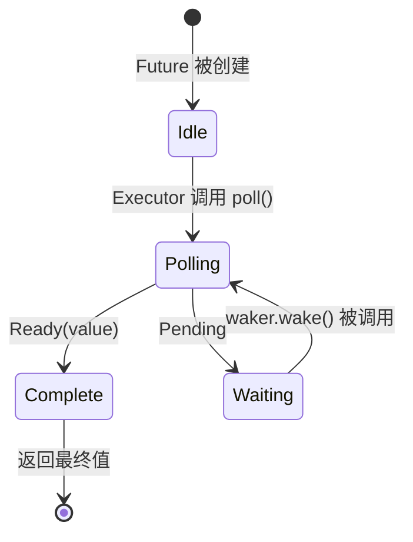

# 3. Poll 的工作原理 🟡

> **你将学到什么：**
> - 执行器（executor）的轮询循环：轮询 → Pending → 唤醒 → 再次轮询
> - 如何从零构建一个最小执行器
> - 虚假唤醒规则及其为何重要
> - 实用工具函数：`poll_fn()` 和 `yield_now()`

## 轮询状态机（state machine）

执行器运行一个循环：轮询 Future，如果返回 `Pending`，就把它停放起来直到其 Waker 被触发，然后再次轮询。这与内核按时间片抢占调度 OS 线程的方式有本质不同。



> **重要提醒**：当 Future 处于 *Waiting* 状态时，它**必须**已经向某个 I/O 事件源注册了 Waker。没注册 = 永远挂起，无人知晓。

### 最小执行器

为了揭开执行器的神秘面纱，让我们从零构建一个最简单、最直观的执行器：

```rust
// ===========================================================
// 核心概念：执行器 = 一个无限循环 + poll() 调用
// ===========================================================
// 这段代码演示了执行器的本质：它就是一个在 loop 中不断调用 poll() 的循环。
// 与 OS 线程调度的根本区别：
//   - OS 线程：内核抢占式调度，线程被动地获得/失去 CPU
//   - Rust async：协作式调度，Future 自己决定何时让出控制权（返回 Pending）
//
// 结构拆解：
//   1. RawWakerVTable     → 定义 Waker 的虚函数表（四元组）
//   2. RawWaker + Waker   → 将虚函数表包装为安全的 Waker 对象
//   3. Context::from_waker → 将 Waker 包装为 Context（传给 poll 的参数）
//   4. Pin::new_unchecked  → 固定 Future 在栈上，保证它不会移动
//   5. loop + match poll() → 忙循环直到 Future 完成

use std::future::Future;
use std::task::{Context, Poll, RawWaker, RawWakerVTable, Waker};
use std::pin::Pin;

/// 最简单的执行器：忙循环轮询直到 Ready
///
/// 这个函数接收任意 Future，阻塞调用线程直到它完成，
/// 然后返回 Future 的产出值。它的行为类似于 tokio::runtime::Runtime.block_on。
fn block_on<F: Future>(mut future: F) -> F::Output {
    // ═══ 步骤 1：将 Future 固定在栈上 ═══
    // ↓ Pin 保证 future 被 poll 期间不会发生内存移动。
    //   SAFETY：一旦 Pin 创建后，`future` 变量不再被移动 ——
    //   后续所有访问都通过 Pin<&mut F> 进行，直到函数返回。
    let mut future = unsafe { Pin::new_unchecked(&mut future) };

    // ═══ 步骤 2：构造一个空操作 Waker ═══
    // 这个 Waker 什么都不做：当 Future 调用 wake() 时，它被静默忽略。
    // 这意味着执行器只能靠忙循环反复 poll，而不是等待事件就绪。
    // 真正的执行器（tokio 等）会用 epoll/kqueue 实现 Waker，
    // 使线程可以在无事可做时进入休眠。

    fn noop_raw_waker() -> RawWaker {
        // ↓ 四个 no_op 闭包是 RawWakerVTable 虚函数表的实现：
        //   clone → 克隆时返回同样的空操作 Waker
        //   wake  → 唤醒时什么都不做（因此执行器只能忙循环反复 poll）
        //   wake_by_ref → 同上
        //   drop  → 析构时什么都不做
        fn no_op(_: *const ()) {}
        fn clone(_: *const ()) -> RawWaker { noop_raw_waker() }

        // ↓ 构造虚函数表（VTable），所有四个方法都是空操作
        let vtable = &RawWakerVTable::new(clone, no_op, no_op, no_op);

        // ↓ 用空数据指针和虚函数表创建一个 RawWaker
        // → RawWaker 是 Waker 的底层不安全表示
        RawWaker::new(std::ptr::null(), vtable)
    }

    // ↓ SAFETY: noop_raw_waker() 返回的 RawWaker 带有正确的虚函数表，
    //   因此可以安全地通过 from_raw 转换为安全的 Waker。
    let waker = unsafe { Waker::from_raw(noop_raw_waker()) };

    // ↓ 用构造好的 Waker 创建 Context，留给 poll() 调用时传入
    let mut cx = Context::from_waker(&waker);

    // ═══ 步骤 3：核心轮询循环 ═══
    // 这是每个执行器的灵魂：不断 poll，直到 Future 完成。
    loop {
        // ↓ as_mut() 在 Pin<&mut F> 上工作，返回一个可以 poll 的新 Pin 引用
        match future.as_mut().poll(&mut cx) {
            // → Future 完成：解包 Ready 变体，拿出结果值，退出循环
            Poll::Ready(value) => return value,

            // → Future 尚未就绪：
            //   由于 Waker 是空操作，不会有外部事件唤醒我们，
            //   所以这里只能 yield 让出 CPU，然后下一轮循环中立刻重试。
            //   真正的执行器会用 epoll_wait / kevent 等系统调用让线程在这里挂起，
            //   直到有 I/O 事件触发 Waker 才被唤醒。
            Poll::Pending => {
                std::thread::yield_now(); // → 把 CPU 让给其他 OS 线程
            }
        }
    }
}

// ============================================================
// 使用演示：将 block_on 应用到 async 块上
// ============================================================
fn main() {
    // ↓ async 块创建了一个匿名的 Future，它打印消息后返回 42
    // → block_on 将这个 Future 驱动至完成，拿到结果
    let result = block_on(async {
        println!("Hello from our mini executor!");
        42  // → 这是 async 块的返回值，也是 Future::Output
    });
    println!("Got: {result}");  // → 打印 "Got: 42"
}
```

> **不要在生产中使用这个执行器！** 它会忙循环，浪费 CPU。真正的执行器（tokio、smol）使用 `epoll`/`kqueue`/`io_uring` 等系统调用来在无事可做时进入休眠。但这已经展示了核心思想：执行器不过是一个不断调用 `poll()` 的循环。

### 唤醒通知

真正的执行器是事件驱动的。当所有 Future 都处于 `Pending` 状态时，执行器就睡觉。Waker 是其"中断"机制：

```rust
// ============================================================
// 真实执行器主循环的概念模型
// ============================================================
// 这段伪代码展示了事件驱动执行器的两层结构：
//   1. poll 层：轮询所有已唤醒的任务（借助 Waker 机制）
//   2. wait 层：当没有任务可运行时，阻塞在 OS I/O 事件源上
//
// 关键 API 映射：
//   - tasks.get_woken_task()  → 从就绪队列取出下一个被唤醒的任务
//   - task.poll()             → 驱动 Future 状态机前进一步
//   - tasks.wait_for_events() → 借助 epoll/kqueue 阻塞，直到有 I/O 事件或 Waker 触发

fn executor_loop(tasks: &mut TaskQueue) {
    loop {
        // ═══ 阶段 1：处理所有已唤醒任务 ═══
        // ↓ 循环取出就绪队列中的每个任务
        while let Some(task) = tasks.get_woken_task() {
            // ↓ 调用 poll() 尝试推进任务
            match task.poll() {
                // → 任务完成：取出结果，清理任务资源
                Poll::Ready(result) => task.complete(result),

                // → 任务未完成：任务保留在队列中，等待被 Waker 重新唤醒
                //   Future 内部已通过 cx.waker() 注册了唤醒通知
                Poll::Pending => { /* 任务留在队列中，等待 Waker 触发 */ }
            }
        }

        // ═══ 阶段 2：阻塞等待 I/O 事件 ═══
        // ↓ 当运行队列为空时，通过 OS I/O 多路复用机制阻塞当前线程
        //   这可能是 epoll_wait（Linux）、kevent（macOS/BSD）或 IOCP（Windows）
        // → 线程进入睡眠，不消耗 CPU，直到有网络包到达、文件就绪等事件
        tasks.wait_for_events(); // 阻塞直到 I/O 事件或 Waker 触发
    }
}
```

### 虚假唤醒

即使 Future 的 I/O 尚未就绪，它也可能被轮询。这被称为"虚假唤醒"。Future 必须正确处理这种情形：

```rust
// ============================================================
// 虚假唤醒：poll() 可能在任何时机被调用，不能假设 I/O 已就绪
// ============================================================
// 核心概念：poll() 的调用次数和时机是不确定的。执行器可能因为以下原因
// 提前 poll 一个 Future：
//   - 多个 Waker 被注册（例如多路复用场景）
//   - 批量唤醒优化（执行器无论原因地唤醒一组任务）
//   - 内部维护逻辑（如 tokio 的定时器 tick 触发）
//
// 因此，poll() 的实现必须始终遵循"检查 - 注册 - 再检查"的模式。

impl Future for MyFuture {
    type Output = Data;

    fn poll(self: Pin<&mut Self>, cx: &mut Context<'_>) -> Poll<Data> {
        // ═══ ✅ 正确做法：始终重新检查实际状态 ═══
        // ↓ 第一步：尝试读取数据，不假设被唤醒就意味着数据已就绪
        // → try_read_data() 应该是非阻塞的立刻返回操作
        if let Some(data) = self.try_read_data() {
            // → 数据已可用，直接返回 Ready
            Poll::Ready(data)
        } else {
            // → 数据尚不可用，重新注册 Waker（Waker 实例可能已变化）
            // ⚠️ 注意：即使之前注册过也要重新注册——每次 poll 都可能传入新的 Waker
            self.register_waker(cx.waker());
            Poll::Pending
        }

        // ═══ ❌ 错误做法：假设被唤醒就意味着数据已就绪 ═══
        // 以下代码是典型的虚假唤醒 bug —— 被 poll 不一定意味着 I/O 完成了：
        //
        // let data = self.read_data(); // 可能因为虚假唤醒而阻塞或失败
        // Poll::Ready(data)
    }
}
```

**实现 `poll()` 的规则**：
1. **永不阻塞** — 如果数据未就绪，立即返回 `Pending`，不要在 poll 里调用阻塞的系统调用
2. **始终重新注册 Waker** — Waker 实例可能在两次 poll 之间发生了变化（新 Context 可能携带新 Waker）
3. **正确处理虚假唤醒** — 检查实际状态，不要假设被轮询就意味着已就绪
4. **不要在 `Ready` 之后继续轮询** — 返回 `Ready` 后再被 poll 的行为是**未定义的**（可能 panic、返回 `Pending` 或重复 `Ready`）。只有 `FusedFuture` 提供了完成后安全轮询的保证

<details>
<summary><strong>🏋️ 练习：虚假唤醒安全的 Flag Future</strong>（点击展开）</summary>

**挑战**：实现一个包含共享 `Arc<AtomicBool>` 标志的 `FlagFuture`。当被轮询时，检查标志是否为 `true`。如果是，则以 `Ready(())` 完成。如果不是，则存储 Waker 并返回 `Pending`。关键挑战：Future 必须正确处理**虚假唤醒**——它必须在每次 poll 中重新检查标志，永远不要假设只是因为被唤醒了标志就已设置。

*提示*：你需要 `Arc<Mutex<Option<Waker>>>`（或类似机制），以便外部线程可以设置标志并唤醒 Future。使用 `poll_fn` 可以获得更简洁的替代实现。

<details>
<summary>🔑 参考答案</summary>

```rust
// ============================================================
// FlagFuture：虚假唤醒安全的 Future 实现
// ============================================================
// 核心概念：演示"双重检查"模式 —— 这是一种防止竞态条件的标准范式。
//
// 为什么需要双重检查？
//   poll 的执行和 Waker 的设置之间存在竞态窗口：
//     T1: Future::poll() 检查 flag == false
//     T2: 外部线程设置 flag = true
//     T3: 外部线程尝试取出 Waker — 但 Waker 尚未被存储！
//   → 外部线程无法唤醒 Future，因为 Waker 还不存在
//   → 如果不在存储 Waker 后再次检查 flag，Future 就会错过唤醒
//
// 解决方案：
//   检查 flag → 存储 Waker → 再次检查 flag
//   用第二次检查覆盖从"第一次检查"到"Waker 存储完成"之间的竞态窗口

use std::future::Future;
use std::pin::Pin;
use std::sync::{Arc, Mutex};
use std::sync::atomic::{AtomicBool, Ordering};
use std::task::{Context, Poll, Waker};

struct FlagFuture {
    // ↓ 共享标志：外部线程设置它为 true 表示"事件已发生"
    flag: Arc<AtomicBool>,
    // ↓ Waker 暂存槽：poll 时存入，外部线程取出后调用 wake
    waker_slot: Arc<Mutex<Option<Waker>>>,
}

impl FlagFuture {
    fn new(flag: Arc<AtomicBool>, waker_slot: Arc<Mutex<Option<Waker>>>) -> Self {
        FlagFuture { flag, waker_slot }
    }
}

impl Future for FlagFuture {
    type Output = ();

    fn poll(self: Pin<&mut Self>, cx: &mut Context<'_>) -> Poll<Self::Output> {
        // ═══ 第一次检查 ═══
        // ↓ 始终重新检查实际状态 —— 即使被唤醒，flag 也可能仍为 false（虚假唤醒）
        // → Ordering::Acquire 保证：如果读到 true，后续所有内存操作对应该标志是可见的
        if self.flag.load(Ordering::Acquire) {
            return Poll::Ready(());
        }

        // ═══ 存储/更新 Waker ═══
        // ↓ 克隆当前 Waker 并存入共享的暂存槽
        // ⚠️ 注意：这里必须使用 clone() 而非取出引用，
        //   因为 WakerStore 是 Arc<Mutex<>>，需要所有权来传递
        let mut slot = self.waker_slot.lock().unwrap();
        *slot = Some(cx.waker().clone());

        // ═══ 第二次检查（竞态防护） ═══
        // ↓ 关键：外部线程可能在第一次检查和 Waker 存储之间设置了 flag。
        //   如果不做这次检查，Future 会返回 Pending 且无人会再唤醒它。
        // → 如果 flag 已被设置，立即返回 Ready —— 即使 Waker 被"浪费"也没关系
        if self.flag.load(Ordering::Acquire) {
            Poll::Ready(())
        } else {
            Poll::Pending
        }
    }
}

// ============================================================
// 设置方：由外部线程（或其他异步任务）调用来触发 Future 完成
// ============================================================
fn set_flag(flag: &AtomicBool, waker_slot: &Mutex<Option<Waker>>) {
    // ↓ 设置标志为 true —— Ordering::Release 确保之前的所有内存写入对此可见
    flag.store(true, Ordering::Release);

    // ↓ 取出存储的 Waker 并调用 wake()
    //   .take() 取得 Option 中的值并用 None 替换，防止重复唤醒
    // → wake() 将任务放回执行器的就绪队列
    if let Some(waker) = waker_slot.lock().unwrap().take() {
        waker.wake();
    }
}

// ============================================================
// 等效的 poll_fn 实现 —— 简洁版
// ============================================================
// poll_fn 让你用闭包来写 Future，省去手动定义 struct 和 impl Future 的样板代码。
// 它特别适合这种"检查标志 → 注册 Waker → 返回结果"的简单模式。
//
// async fn wait_for_flag(flag: Arc<AtomicBool>, waker_slot: Arc<Mutex<Option<Waker>>>) {
//     std::future::poll_fn(|cx| {
//         if flag.load(Ordering::Acquire) {
//             return Poll::Ready(());
//         }
//         *waker_slot.lock().unwrap() = Some(cx.waker().clone());
//         if flag.load(Ordering::Acquire) { Poll::Ready(()) } else { Poll::Pending }
//     }).await
// }
```

**关键点**：双重检查模式（检查 → 存储 Waker → 再次检查）对于避免条件变更与 Waker 注册之间的竞态至关重要。这是所有 I/O Future 内部使用的真实模式，同时也说明了正确处理虚假唤醒的重要性。

</details>
</details>

### 实用工具：`poll_fn` 和 `yield_now`

标准库和 tokio 提供了两个实用工具，可以让你无需手写完整的 `Future` 实现：

```rust
// ============================================================
// poll_fn：从闭包创建一次性的 Future
// ============================================================
// poll_fn 接收一个 FnMut(&mut Context) -> Poll<T> 的闭包，
// 返回一个由该闭包驱动的 Future。
//
// 适用场景：
//   - 桥接基于回调的 API 到 async 世界
//   - 快速原型不用定义结构体
//   - 封装包含复杂 Waker 注册逻辑的一次性操作

use std::future::poll_fn;
use std::task::Poll;

// ↓ poll_fn 接收一个闭包，闭包的签名与 Future::poll 一致
// → 每次 poll 被调用时，执行闭包体并返回 Ready 或 Pending
let value = poll_fn(|cx| {
    // → 可以在闭包中调用 cx.waker() 注册唤醒逻辑
    // → 返回 Ready 则 Future 完成，返回 Pending 则等待被唤醒后再次执行
    Poll::Ready(42)
}).await;  // → .await 驱动 poll_fn 返回的 Future 直到完成

// ============================================================
// poll_fn 的实际用途：把基于回调的 API 桥接到 async
// ============================================================
// 很多底层 I/O 库（如 mio、polling）提供 poll_* 方法，
// 它们返回的是 Poll<T> 而非 Future。poll_fn 可以将它们
// 无缝转换为可直接 .await 的 Future。
async fn read_when_ready(source: &MySource) -> Data {
    // ↓ poll_fn 闭包每次收到 poll 调用时，
    //   就把 Context 转发给底层 API 的 poll_read 方法
    // → 底层 API 负责注册 Waker，poll_fn 只是把两个世界粘合起来
    poll_fn(|cx| source.poll_read(cx)).await
}
```

```rust
// ============================================================
// yield_now：主动让出控制权给执行器
// ============================================================
// yield_now() 返回一个 Future，它在第一次 poll 时调用 wake_by_ref
// 然后返回 Pending，等下一轮被 poll 时返回 Ready(())。
//
// 效果：将当前任务放回执行器队列末尾，给其他任务一个运行机会。
// 这是协作式多任务的核心机制 —— CPU 密集型代码主动让路。
//
// 适用场景：
//   - CPU 密集的 async 循环，防止独占工作线程
//   - 实现自定义的公平调度策略
//   - 测试中等待其他任务推进

async fn cpu_heavy_work(items: &[Item]) {
    for (i, item) in items.iter().enumerate() {
        // ↓ 这里是纯 CPU 工作，没有 .await 点 —— 不会自动让出控制权
        process(item);

        // ↓ 每处理 100 个 item，主动让出一次
        // → yield_now().await 把当前任务排到执行器队列末尾
        // → 在此期间其他任务（如网络 I/O）有机会推进
        // ⚠️ 注意：yield_now 的粒度需要权衡 ——
        //   太频繁增加调度开销；太稀疏松散导致其他任务延迟增加
        if i % 100 == 0 {
            tokio::task::yield_now().await;
        }
    }
}
```

> **何时使用 `yield_now()`**：如果你的异步函数在循环中做了大量 CPU 工作，且中间没有任何 `.await` 点，它会一直霸占执行器线程。定期插入 `yield_now().await` 来启用协作式多任务，防止其他任务产生不必要的延迟。

> **关键要点 — Poll 的工作原理**
> - 执行器对已唤醒的 Future 反复调用 `poll()`：poll → Pending → 等待唤醒 → 再次 poll
> - Future 必须处理**虚假唤醒**——始终重新检查实际状态，不要假设被 poll 就等于数据已就绪
> - `poll_fn()` 让你用闭包快速创建临时的 Future，无需定义结构体和手写 impl
> - `yield_now()` 是 CPU 密集型异步代码的协作调度"逃生口"，防止独占工作线程

> **另请参阅：** [第 2 章 — Future trait](ch02-the-future-trait.md) 了解 trait 定义，[第 5 章 — 状态机揭秘](ch05-the-state-machine-reveal.md) 了解编译器实际生成的内容

***
