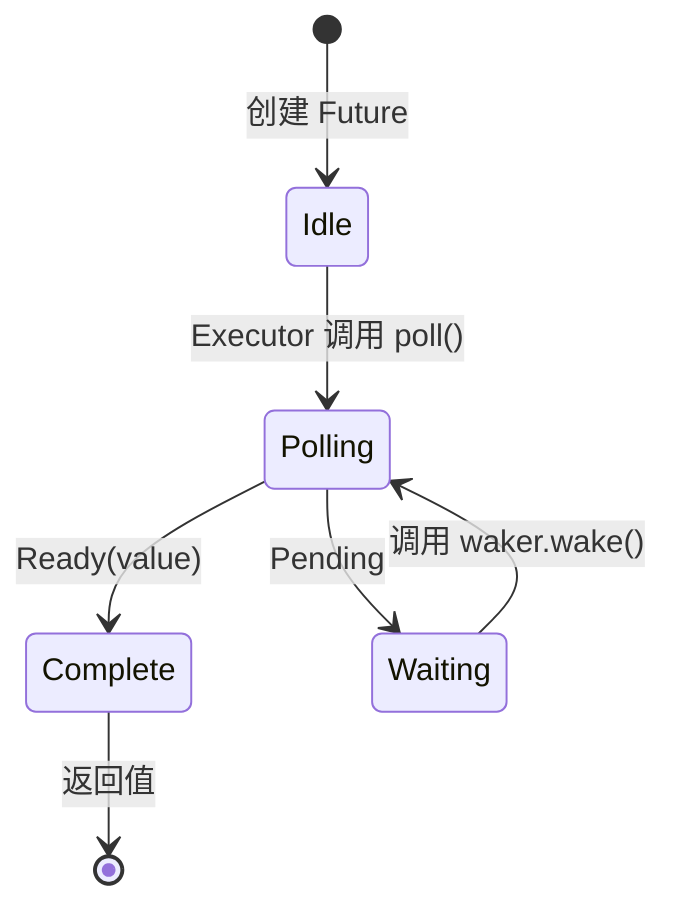

# 3. Poll如何运作🟡

> **您将学到什么：**
> - 执行器的轮询循环：轮询→待处理→唤醒→再次轮询
> - 如何从头开始构建一个最小的执行器
> - 虚假唤醒规则及其重要性
> - 实用函数：`poll_fn()`和`yield_now()`

## 轮询状态机

执行器运行一个循环：轮询Future，如果它是`Pending`，则将其停放直到其Waker触发，然后再次轮询。这与内核处理调度的操作系统线程有根本的不同。



> **重要提示：**当处于*等待*状态时，Future**必须**已注册
> 具有 I/O 源的Waker。没有注册=永远挂起。

### 最小Executor

为了揭开执行器的神秘面纱，让我们构建一个最简单的执行器：

```rust
use std::future::Future;
use std::task::{Context, Poll, RawWaker, RawWakerVTable, Waker};
use std::pin::Pin;

/// 最简单的执行器：忙循环轮询直到 Ready
fn block_on<F: Future>(mut future: F) -> F::Output {
    // 将 Future 固定在栈上
    // SAFETY： `future` 在这一点之后永远不会移动 - 我们只
    // 通过固定参考访问它，直到完成。
    let mut future = unsafe { Pin::new_unchecked(&mut future) };

    // 创建一个无操作Waker（只是不断轮询——低效但简单）
    fn noop_raw_waker() -> RawWaker {
        fn no_op(_: *const ()) {}
        fn clone(_: *const ()) -> RawWaker { noop_raw_waker() }
        let vtable = &RawWakerVTable::new(clone, no_op, no_op, no_op);
        RawWaker::new(std::ptr::null(), vtable)
    }

    // SAFETY： noop_raw_waker() 返回具有正确 vtable 的有效 RawWaker。
    let waker = unsafe { Waker::from_raw(noop_raw_waker()) };
    let mut cx = Context::from_waker(&waker);

    // 忙循环直到Future完成
    loop {
        match future.as_mut().poll(&mut cx) {
            Poll::Ready(value) => return value,
            Poll::Pending => {
                // 真正的执行器会将线程停放在这里
                // 等待 waker.wake()；这里为了演示只做自旋
                std::thread::yield_now();
            }
        }
    }
}

// 用法：
fn main() {
    let result = block_on(async {
        println!("Hello from our mini executor!");
        42
    });
    println!("Got: {result}");
}
```

> **不要在生产中使用它！** 它会忙循环，浪费 CPU。真正的执行器
> (tokio, smol) 使用`epoll`/`kqueue`/`io_uring` 进入睡眠状态，直到 I/O 准备就绪。
> 但这显示了核心思想：执行器只是一个调用`poll()`的循环。

### 唤醒通知

真正的执行器是事件驱动的。当所有的 future 都是 `Pending` 时，执行器就睡觉。Waker是一种中断机制：

```rust
// 真实执行器主循环的概念模型：
fn executor_loop(tasks: &mut TaskQueue) {
    loop {
        // 1. Poll所有已被唤醒的任务
        while let Some(task) = tasks.get_woken_task() {
            match task.poll() {
                Poll::Ready(result) => task.complete(result),
                Poll::Pending => { /* 任务留在队列中，等待唤醒 */ }
            }
        }

        // 2. 睡眠直到有东西唤醒我们（epoll_wait、kevent等）
        //    这里由 mio/polling 负责等待 OS 事件
        tasks.wait_for_events(); // 阻塞直到 I/O 事件或Waker触发
    }
}
```

### 虚假唤醒

即使 Future 的 I/O 尚未准备好，也可能会被轮询。这称为“虚假唤醒”。Future 必须正确处理这个问题：

```rust
impl Future for MyFuture {
    type Output = Data;

    fn poll(self: Pin<&mut Self>, cx: &mut Context<'_>) -> Poll<Data> {
        // ✅ 正确：始终重新检查实际情况
        if let Some(data) = self.try_read_data() {
            Poll::Ready(data)
        } else {
            // 重新注册Waker（可能有changed!）
            self.register_waker(cx.waker());
            Poll::Pending
        }

        // ❌错误：假设轮询意味着数据已准备好
        // let data = self.read_data(); // 可能阻塞或 panic
        // Poll::Ready(data)
    }
}
```

**实施`poll()`的规则**：
1. **永不阻塞** — 如果未准备好，立即返回 `Pending`
2. **始终重新注册 Waker** - 它可能在Poll之间发生了变化
3. **处理虚假唤醒** - 检查实际情况，不要假设已准备就绪
4. **不要在`Ready`**之后进行轮询——行为**未指定**（可能会出现恐慌、返回`Pending`或重复`Ready`）。只有`FusedFuture`保证安全的完成后轮询

<details>
<summary><strong>🏋️ 练习：虚假唤醒安全标志 Future</strong>（点击展开）</summary>

**挑战**：实现一个包含共享 `Arc<AtomicBool>` 标志的 `FlagFuture`。轮询时，它检查标志是否为`true`。如果是这样，则以 `Ready(())` 结束。如果不是，则存储Waker并返回 `Pending`。变化是：Future 必须正确处理**虚假唤醒**——它必须在每次轮询中重新检查标志，永远不要假设标志只是因为被唤醒而被设置。

*提示*：您需要一个 `Arc<Mutex<Option<Waker>>>` （或类似的），以便外部线程可以设置标志并唤醒Future。使用 `poll_fn` 获得简洁的替代参考答案。

<details>
<summary>🔑 参考答案</summary>

```rust
use std::future::Future;
use std::pin::Pin;
use std::sync::{Arc, Mutex};
use std::sync::atomic::{AtomicBool, Ordering};
use std::task::{Context, Poll, Waker};

struct FlagFuture {
    flag: Arc<AtomicBool>,
    waker_slot: Arc<Mutex<Option<Waker>>>,
}

impl FlagFuture {
    fn new(flag: Arc<AtomicBool>, waker_slot: Arc<Mutex<Option<Waker>>>) -> Self {
        FlagFuture { flag, waker_slot }
    }
}

impl Future for FlagFuture {
    type Output = ();

    fn poll(self: Pin<&mut Self>, cx: &mut Context<'_>) -> Poll<Self::Output> {
        // 始终重新检查实际情况——永远不要只相信唤醒
        if self.flag.load(Ordering::Acquire) {
            return Poll::Ready(());
        }

        // 存储/更新Waker以便我们收到通知
        let mut slot = self.waker_slot.lock().unwrap();
        *slot = Some(cx.waker().clone());

        // 存放Waker后重新检查以避免竞争：
        // 该标志可能已在我们第一次检查之间设置
        // 并存放Waker
        if self.flag.load(Ordering::Acquire) {
            Poll::Ready(())
        } else {
            Poll::Pending
        }
    }
}

// 设置方（例如另一个线程或任务）：
fn set_flag(flag: &AtomicBool, waker_slot: &Mutex<Option<Waker>>) {
    flag.store(true, Ordering::Release);
    if let Some(waker) = waker_slot.lock().unwrap().take() {
        waker.wake();
    }
}

// 等价于使用 poll_fn：
// async fn wait_for_flag(flag: Arc<AtomicBool>, waker_slot: Arc<Mutex<Option<Waker>>>) {
//     std::future::poll_fn(|cx| {
//         if flag.load(Ordering::Acquire) {
//             return Poll::Ready(());
//         }
//         *waker_slot.lock().unwrap() = Some(cx.waker().clone());
//         if flag.load(Ordering::Acquire) { Poll::Ready(()) } else { Poll::Pending }
//     }).await
// }
```

**要点**：双重检查模式（检查 → 存储Waker → 再次检查）对于避免条件更改和注册Waker之间的竞争至关重要。这是所有 I/O future 内部使用的真实模式，它说明了处理虚假唤醒的重要性。

</details>
</details>

### 方便的实用程序：`poll_fn`和`yield_now`

标准库和tokio 中的两个实用程序可以避免编写完整的`Future`实现：

```rust
use std::future::poll_fn;
use std::task::Poll;

// poll_fn：从闭包创建一次性 Future
let value = poll_fn(|cx| {
    // 使用 cx.waker() 注册唤醒逻辑，返回 Ready 或 Pending
    Poll::Ready(42)
}).await;

// 实际用途：把基于回调的 API 桥接到 async
async fn read_when_ready(source: &MySource) -> Data {
    poll_fn(|cx| source.poll_read(cx)).await
}
```

```rust
// yield_now：主动把控制权交还给执行器
// 在CPU重的async循环中很有用，以避免其他任务挨饿
async fn cpu_heavy_work(items: &[Item]) {
    for (i, item) in items.iter().enumerate() {
        process(item); // CPU 工作

        // 每 100 个项目，让出让其他任务运行
        if i % 100 == 0 {
            tokio::task::yield_now().await;
        }
    }
}
```

> **何时使用`yield_now()`**：如果你的异步函数CPU在循环中工作
> 没有任何 `.await` 点，它会独占执行器线程。插入
> `yield_now().await` 定期启用协作多任务处理。

> **关键要点 — Poll 的工作原理**
> - 执行器对已唤醒的 Future反复调用`poll()`
> - Future 必须处理**虚假唤醒** - 始终重新检查实际情况
> - `poll_fn()` 让您可以从闭包中创建临时的 future
> - `yield_now()` 是一个针对 CPU 密集型异步代码的协作调度逃生口

> **另请参阅：** [第 2 章 — Future trait](ch02-the-future-trait.md) 了解 trait 定义，[第 5 章 — 状态机揭示](ch05-the-state-machine-reveal.md) 了解编译器生成的内容

***


