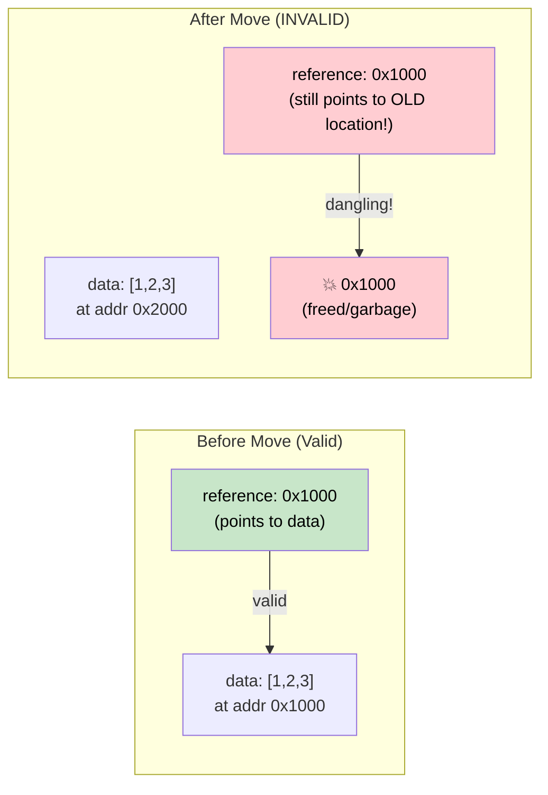

# 4. Pin 和 Unpin 🔴

> **您将学到什么：**
> - 为什么自引用结构在内存中移动时会中断
> - `Pin<P>` 保证什么以及它如何防止移动
> - 三种实用的固定模式：`Box::pin()`、`tokio::pin!()`、`Pin::new()`
> - 当`Unpin`给你一个逃生舱口时

## 为什么Pin存在

这是asyncRust 中最容易混淆的概念。让我们逐步建立直觉。

### 问题：自指结构

当编译器将 `async fn` 转换为状态机时，该状态机可能包含对其自身字段的引用。这会创建一个“自引用结构”——将其移动到内存中将使这些内部引用无效。

```rust
// 编译器生成（简化）的目的：
// async fn example() {
//     let data = vec![1, 2, 3];
//     let reference = &data;       // 指向上面的 data
//     use_ref(reference).await;
// }

// 变成类似这样的东西：
enum ExampleStateMachine {
    State0 {
        data: Vec<i32>,
        // reference: &Vec<i32>,  // 问题：指向上面的 `data`
        //                        // 如果该结构体移动，则指针为dangling!
    },
    State1 {
        data: Vec<i32>,
        reference: *const Vec<i32>, // 指向数据字段的内部指针
    },
    Complete,
}
```



### 自指结构

这不是一个学术问题。每个持有跨 `.await` 点引用的 `async fn` 都会创建一个自引用状态机：

```rust
async fn problematic() {
    let data = String::from("hello");
    let slice = &data[..]; // 切片借用数据
    
    some_io().await; // <-- .await点：状态机同时存储数据和切片
    
    println!("{slice}"); // 在 await 之后使用该引用
}
// 生成的状态机有`data: String`和`slice: &str`
// 其中切片指向数据。移动状态机=悬挂指针。
```

### Pin 实践

`Pin<P>` 是一个包装器，可防止将值移动到指针后面：

```rust
use std::pin::Pin;

let mut data = String::from("hello");

// 固定它，现在不能再移动
let pinned: Pin<&mut String> = Pin::new(&mut data);

// 仍然可以使用它：
println!("{}", pinned.as_ref().get_ref()); // “你好”

// 但我们无法取回 &mut String（这将允许 mem::swap）：
// let mutable: &mut String = Pin::into_inner(pinned); // 仅当 String: Unpin 时才可以
// String 确实是 Unpin，所以这对 String 实际可行。
// 但对于自引用状态机（!Unpin），它被阻止。
```

在实际代码中，您主要在三个地方遇到 Pin：

```rust
// 1. poll()签名——所有Future 均通过Pin轮询
fn poll(self: Pin<&mut Self>, cx: &mut Context<'_>) -> Poll<Output>;

// 2. Box::pin() — 堆分配并固定Future
let future: Pin<Box<dyn Future<Output = i32>>> = Box::pin(async { 42 });

// 3. tokio::pin!() — 将 Future 固定在栈上
tokio::pin!(my_future);
// 现在我的Future：Pin<&mut impl Future>
```

### Unpin 逃生舱口

Rust 中的大多数类型都是 `Unpin` — 它们不包含自引用，因此固定是无操作的。只有编译器生成的状态机（来自`async fn`）是`!Unpin`。

```rust
// 这些都是Unpin——固定它们没有什么特别的：
// i32、String、Vec<T>、HashMap<K,V>、Box<T>、&T、&mut T

// 这些是 !Unpin — 它们必须在投票前固定：
// `async fn`和`async {}`生成的状态机

// 实际意义：
// 如果你手写一个 Future 并且它没有自引用，
// 实现 Unpin 可以让它更容易使用：
impl Unpin for MySimpleFuture {} // “我可以安全移动，相信我”
```

### 快速参考

| 什么 | 什么时候 | 如何 |
|------|------|-----|
| Pin 堆上的Future | 存储在集合中，从函数返回 | `Box::pin(future)` |
| Pin 栈上的Future | 本地使用`select!`或手动轮询 | `std::pin::pin!(future)` 或 `tokio::pin!(future)` |
| 函数签名中的Pin | 接受固定Future | `future: Pin<&mut F>` |
| 需要Unpin | 当您需要在创建后移动Future时 | `F: Future + Unpin` |

<details>
<summary><strong>🏋️练习：Pin和移动</strong>（点击展开）</summary>

**挑战**：以下哪些代码片段可以编译？对于每一个不符合要求的问题，请解释原因并予以解决。

```rust
// 片段 A
let fut = async { 42 };
let pinned = Box::pin(fut);
let moved = pinned; // 移动Box
let result = moved.await;

// 片段 B
let fut = async { 42 };
tokio::pin!(fut);
let moved = fut; // 移动寄托的Future
let result = moved.await;

// 片段 C
use std::pin::Pin;
let mut fut = async { 42 };
let pinned = Pin::new(&mut fut);
```

<details>
<summary>🔑解决方案</summary>

**片段 A**： ✅ **编译。** `Box::pin()` 将Future放在堆上。移动 `Box` 会移动*指针*，而不是Future 本身。Future仍固定在其堆位置。

**代码片段 B**： ✅ **编译。** `tokio::pin!` 将Future固定到栈并将 `fut` 重新绑定为 `Pin<&mut ...>`。 `let moved = fut` 移动 **`Pin` 包装器**（指针），而不是底层的 future - future 保持固定在栈上。这就像`Box::pin`：移动`Box`不会移动堆分配。然而，`fut`会被移动消耗，所以之后你不能使用`fut`——只能使用`moved`：
```rust
let fut = async { 42 };
tokio::pin!(fut);
let moved = fut;        // 移动 Pin<&mut> 包装器 — OK
// fut.await;           // ❌ 错误：fut 已被移动
let result = moved.await; // ✅ 使用移动代替
```

**代码片段 C**：❌ **无法编译。** `Pin::new()` 需要 `T: Unpin`。异步块生成 `!Unpin` 类型。 **修复**：使用`Box::pin()`或`unsafe Pin::new_unchecked()`：
```rust
let fut = async { 42 };
let pinned = Box::pin(fut); // 堆销 — 与 !Unpin 一起使用
```

**要点**：`Box::pin()` 是锁定 `!Unpin` Future 的安全、简单的方法。栈上的 `tokio::pin!()` 引脚 — 您可以移动 `Pin<&mut>` 包装器（它只是一个指针），但底层 future 保持不变。 `Pin::new()` 仅适用于 `Unpin` 类型。

</details>
</details>

> **关键要点 — Pin 和 Unpin**
> - `Pin<P>` 是一个包装器，**防止指针被移动**——对于自引用状态机至关重要
> - `Box::pin()` 是将 Future 固定在堆上的安全、简单的默认值
> - 栈上的 `tokio::pin!()` 引脚 — 您可以移动 `Pin<&mut>` 包装器，但底层的 future 保持不变
> - `Unpin` 是自动trait 选择退出：实现 `Unpin` 的类型即使在固定时也可以移动（大多数类型是 `Unpin`；异步块不是）

> **另请参阅：** [第 2 章 — Future trait](ch02-the-future-trait.md) 代表轮询中的 `Pin<&mut Self>`，[第 5 章 — 状态机揭示](ch05-the-state-machine-reveal.md) 了解为什么异步状态机是自引用的

***


