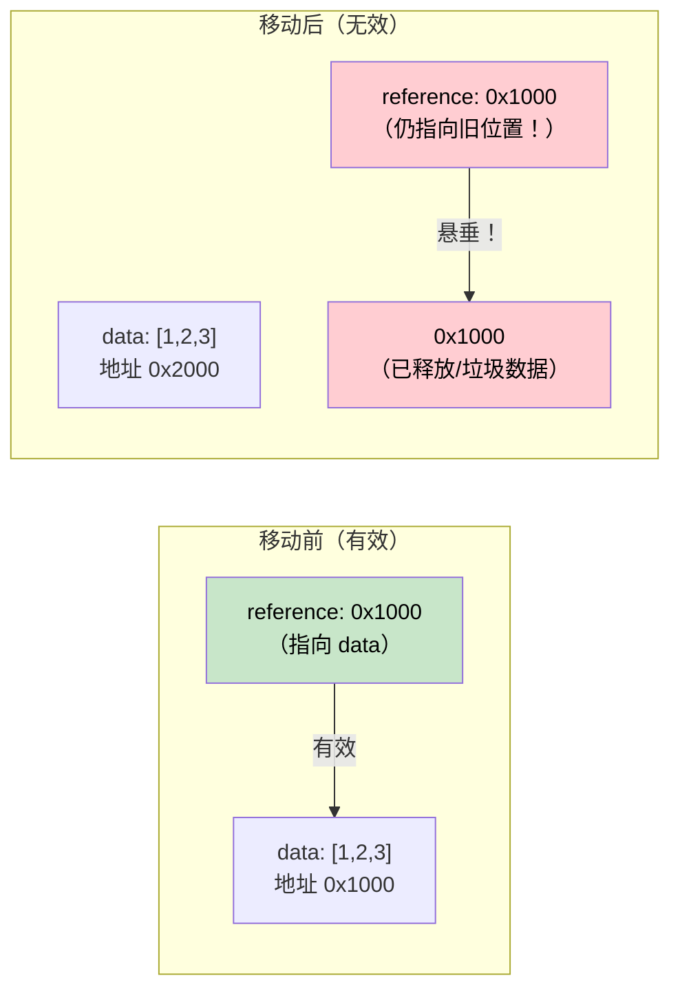

# 4. Pin 和 Unpin

> **你将学到什么：**
> - 为什么自引用结构在内存中移动会失效
> - `Pin<P>` 提供了什么保证，以及它如何阻止移动
> - 三种实用的固定（pinning）模式：`Box::pin()`、`tokio::pin!()`、`Pin::new()`
> - `Unpin` 作为"逃生舱口"的使用场景

## 为什么需要 Pin

这是 async Rust 中最容易令人困惑的概念。让我们逐步建立直觉。

### 问题：自引用结构

当编译器将 `async fn` 转换为状态机（state machine）时，该状态机可能包含指向自身字段的引用。这形成了一个"自引用结构"——在内存中移动它会使这些内部引用失效。

```rust
// ===========================================================================
// 核心概念：编译器将 async fn 脱糖为状态机枚举。每个 .await 点对应一个
// 枚举变体。如果某个变体同时持有数据和对该数据的引用，就形成了自引用结构。
// 问题在于：Rust 的 move 语义是逐字节拷贝（memcpy），移动后引用仍然指向
// 旧的内存地址，导致悬垂指针。
//
// 以下是将
//   async fn example() {
//       let data = vec![1, 2, 3];
//       let reference = &data;       // → 指向 data 的引用
//       use_ref(reference).await;
//   }
// 脱糖后概念上得到的结构：
// ===========================================================================

enum ExampleStateMachine {
    State0 {
        data: Vec<i32>,
        // reference: &Vec<i32>,  // ⚠️ 问题所在：reference 指向 data 字段自身
        //                        // 如果整个 State0 被 move 到新地址，
        //                        // reference 仍然指向旧地址 → 悬垂指针！
    },
    State1 {
        data: Vec<i32>,
        reference: *const Vec<i32>, // 裸指针，存储 data 字段的内部地址
    },
    Complete,
}
```



### 自引用结构的产生

这不是一个学术问题。每一个在 `.await` 点之前持有引用的 `async fn`，都会被编译器生成一个自引用状态机：

```rust
// ===========================================================================
// 核心概念：这段代码展示了典型的"跨越 .await 持有引用"场景。
// data 和 slice 存在于同一个状态机变体中，slice 指向 data 的内部数据。
// 如果该变体被 move，slice 就变成悬垂指针——这正是 Pin 要解决的问题。
// ===========================================================================

async fn problematic() {
    let data = String::from("hello");
    // → 在栈上分配一个 String
    let slice = &data[..]; // → slice: &str，指向 data 内部的字节

    some_io().await; // ⚠️ 关键点：.await 迫使编译器将 data 和 slice
                     //   打包进同一个状态机变体。data 和 slice 必须
                     //   跨 .await 共存，形成自引用。

    println!("{slice}"); // → 在 .await 之后使用 slice。如果状态机
                         //   在 .await 期间被移动，slice 会指向已释放的内存
}

// 编译器生成的状态机同时持有 data: String 和 slice: &str，
// 其中 slice 指向 data 的内部。移动该状态机 = 悬垂指针。
```

### Pin 实战

`Pin<P>` 是一个包装类型，它阻止 `P` 所指向的值被移动：

```rust
// ===========================================================================
// 核心概念：Pin<P> 的工作原理。
// - Pin<&mut T> 意味着"我承诺不通过这个引用来移动 T"
// - Pin::new() 要求 T: Unpin；对于 !Unpin 类型，必须用 unsafe 的 new_unchecked()
// - Pin 不阻止值的所有者移动它——只阻止通过 Pin 包装的指针来移动
// ===========================================================================

use std::pin::Pin;

let mut data = String::from("hello");

// Pin::new(&mut data) → 在栈上固定 String
// ⚠️ 注意：Pin::new() 要求 T: Unpin，String 满足此条件，所以这里可以编译
let pinned: Pin<&mut String> = Pin::new(&mut data);

// → 固定后仍然可以读取（不可变访问不受限制）
println!("{}", pinned.as_ref().get_ref()); // → "hello"
//                                  ^^^^^^^^ as_ref() 得到 Pin<&String>
//                                           get_ref() 取出内部的 &String

// ⚠️ 无法通过 Pin 取回 &mut String——那会允许 mem::swap 等移动操作：
// let mutable: &mut String = Pin::into_inner(pinned); // 仅当 String: Unpin 时可用
//
// String 确实是 Unpin，所以这行代码实际上可以编译。
// 但对于自引用的异步状态机（!Unpin），编译器会阻止此操作。
```

在实际代码中，你主要在三个地方遇到 Pin：

```rust
// ===========================================================================
// 核心概念：三种常见的 Pin 使用模式。
// 1. poll() 签名——Future trait 在设计上就要求 Pin<&mut Self>
// 2. Box::pin()——堆分配 + 固定，适用于需要转移所有权的场景
// 3. tokio::pin!()——栈固定宏，适用于局部使用的 Future
// ===========================================================================

// 1. poll() 签名——所有 Future 都通过 Pin 来轮询
//    self: Pin<&mut Self> 的设计理由：
//    poll() 可能在多次调用之间跨越 .await 点，状态机在此期间
//    必须保持在固定的内存地址，Pin 确保执行器（executor）无法移动它
fn poll(self: Pin<&mut Self>, cx: &mut Context<'_>) -> Poll<Output>;

// 2. Box::pin() → 在堆上分配 Future 并固定它
//    适用场景：需要将 Future 存入集合、从函数返回、或者擦除具体类型
let future: Pin<Box<dyn Future<Output = i32>>> = Box::pin(async { 42 });
//               ^^^ 堆上分配的 trait object，类型擦除但大小固定

// 3. tokio::pin!() → 在栈上固定 Future，无堆分配
//    适用场景：在函数内局部使用 select! 或手动轮询
tokio::pin!(my_future);
// 展开后：my_future 的类型变为 Pin<&mut impl Future>，
// 原始值被固定在当前栈帧中，无法被 move
```

### Unpin：逃生舱口

Rust 中大多数类型都是 `Unpin`——它们不含自引用，因此固定对它们而言是无操作。只有编译器生成的异步状态机（来自 `async fn` 或 `async {}`）才是 `!Unpin`。

```rust
// ===========================================================================
// 核心概念：Unpin 是 Pin 的"反向"trait。
// - 大多数普通类型自动实现 Unpin，因为移动它们不会产生问题
// - Unpin 类型即使被 Pin 包裹后，仍然可以通过 Pin::into_inner() 取回 &mut T
// - 只有自引用类型（异步状态机）才是 !Unpin，必须固定后才能安全轮询
// ===========================================================================

// 这些都是 Unpin 类型——固定它们没有额外效果：
// i32, String, Vec<T>, HashMap<K,V>, Box<T>, &T, &mut T
// 移动这些类型只是简单的 memcpy，不存在内部指针需要维护

// 这些是 !Unpin 类型——必须在轮询前固定：
// - async fn 返回的 Future（编译器生成的状态机）
// - async {} 块（匿名 Future）
// - 任何包含 PhantomPinned 字段的自定义类型

// 实际意义：
// 如果你手写一个 Future，并且它不包含自引用，
// 可以为它实现 Unpin，让使用者更方便（不需要 Box::pin 就能使用）：
impl Unpin for MySimpleFuture {}
// → 安全承诺："我保证这个 Future 没有自引用字段，可以安全移动"
```

### 快速参考

| 需求 | 使用场景 | 操作方法 |
|------|------|-----|
| 在堆上固定 Future | 存入集合、从函数返回、类型擦除 | `Box::pin(future)` |
| 在栈上固定 Future | 本地使用 `select!` 或手动轮询 | `std::pin::pin!(f`)` 或 `tokio::pin!(future)` |
| 函数签名中接受固定 Future | 接收已固定的 Future 参数 | `future: Pin<&mut F>` |
| 需要 Future 可移动 | 需要在创建后移动 Future | `F: Future + Unpin` |

<details>
<summary><strong>练习：Pin 和移动</strong>（点击展开）</summary>

**挑战**：以下哪些代码片段可以编译？对于无法编译的，解释原因并给出修复方案。

```rust
// ===========================================================================
// 练习核心：区分"移动 Future 本体"和"移动指向 Future 的指针包装器"。
// Pin<Box<T>> 和 Pin<&mut T> 本身是普通的指针类型，移动它们不会移动
// 底层的 T——T 仍然固定在原来的内存地址。
// ===========================================================================

// 片段 A
let fut = async { 42 };
let pinned = Box::pin(fut);   // → 在堆上分配并固定，pinned: Pin<Box<impl Future>>
let moved = pinned;           // → 移动的是 Box 指针（8 字节），Future 本体仍在堆上
let result = moved.await;     // → Pin<Box<T>> 实现了 Future，可以直接 .await

// 片段 B
let fut = async { 42 };
tokio::pin!(fut);             // → fut 被重新绑定为 Pin<&mut impl Future>
let moved = fut;              // → 移动的是 Pin<&mut _> 包装器（一个胖指针）
let result = moved.await;     // → 移动后只能通过 moved 访问，原 fut 已被 move

// 片段 C
use std::pin::Pin;
let mut fut = async { 42 };
let pinned = Pin::new(&mut fut); // → Pin::new() 要求 T: Unpin，async 块是 !Unpin
                                 // → 编译失败！
```

<details>
<summary>参考答案</summary>

**片段 A**：编译通过。`Box::pin()` 将 Future 放在堆上。移动 `Box` 只移动了指针（指向堆内存的 8 字节），Future 本身在堆上的位置没有改变——它依然是固定的。

**片段 B**：编译通过。`tokio::pin!` 将 Future 固定在栈上，并将 `fut` 重新绑定为 `Pin<&mut ...>`（一个指针包装器）。`let moved = fut` 移动的是这个 `Pin<&mut>` 包装器，底层的 Future 保持在栈上的原位。这和 `Box::pin` 类似：移动 `Box` 不会移动其堆分配的内容。不过，`fut` 通过 move 被消耗，之后你不能再使用原来的 `fut`——只能使用 `moved`：

```rust
// ===========================================================================
// 关键理解：tokio::pin! 创建的 Pin<&mut ...> 本质上是一个栈指针。
// 移动这个 Pin<&mut> 只是复制了指针值，被指向的 Future 没有移动。
// 但所有权转移了——原变量 fut 失效，只能通过 moved 访问。
// ===========================================================================

let fut = async { 42 };
tokio::pin!(fut);
let moved = fut;             // → 移动 Pin<&mut> 指针包装器（允许）
// fut.await;                // ❌ 错误：fut 已被 move，不再有效
let result = moved.await;    // → 通过 moved 来 .await（正确）
```

**片段 C**：无法编译。`Pin::new()` 的安全版本要求 `T: Unpin`，而异步块生成的是 `!Unpin` 类型。修复方案：使用 `Box::pin()` 或 `unsafe` 的 `Pin::new_unchecked()`：

```rust
// ===========================================================================
// Pin::new() vs Pin::new_unchecked():
// - new() 是安全的，但要求 T: Unpin（对自引用类型不可行）
// - new_unchecked() 绕过检查，调用者需保证不会通过 Pin 移动 T
// - Box::pin() 是最安全、最通用的选择：堆分配 + 固定一步完成
// ===========================================================================

let fut = async { 42 };
let pinned = Box::pin(fut); // → 堆分配 + 固定，与 !Unpin 兼容
```

**要点**：`Box::pin()` 是固定 `!Unpin` Future 的安全、简单的方法。`tokio::pin!()` 在栈上固定——你可以移动 `Pin<&mut>` 包装器（它只是一个指针），但底层的 Future 保持不动。`Pin::new()` 仅适用于 `Unpin` 类型。

</details>
</details>

> **关键要点 -- Pin 和 Unpin**
> - `Pin<P>` 是一个包装器，**阻止通过 P 移动其指向的值**——对自引用状态机至关重要
> - `Box::pin()` 是安全地在堆上固定 Future 的默认首选方案
> - `tokio::pin!()` 在栈上固定——你可以移动 `Pin<&mut>` 包装器（只是一个指针），但底层 Future 不动
> - `Unpin` 是自动 trait 的"选择退出"机制：实现 `Unpin` 的类型即便被固定后也可以安全移动（大多数类型是 `Unpin`，异步块不是）

> **另请参阅：** [第 2 章 -- Future trait](ch02-the-future-trait.md) 了解 poll 签名中的 `Pin<&mut Self>`，[第 5 章 -- 状态机揭秘](ch05-the-state-machine-reveal.md) 了解为何异步状态机是自引用的

***
