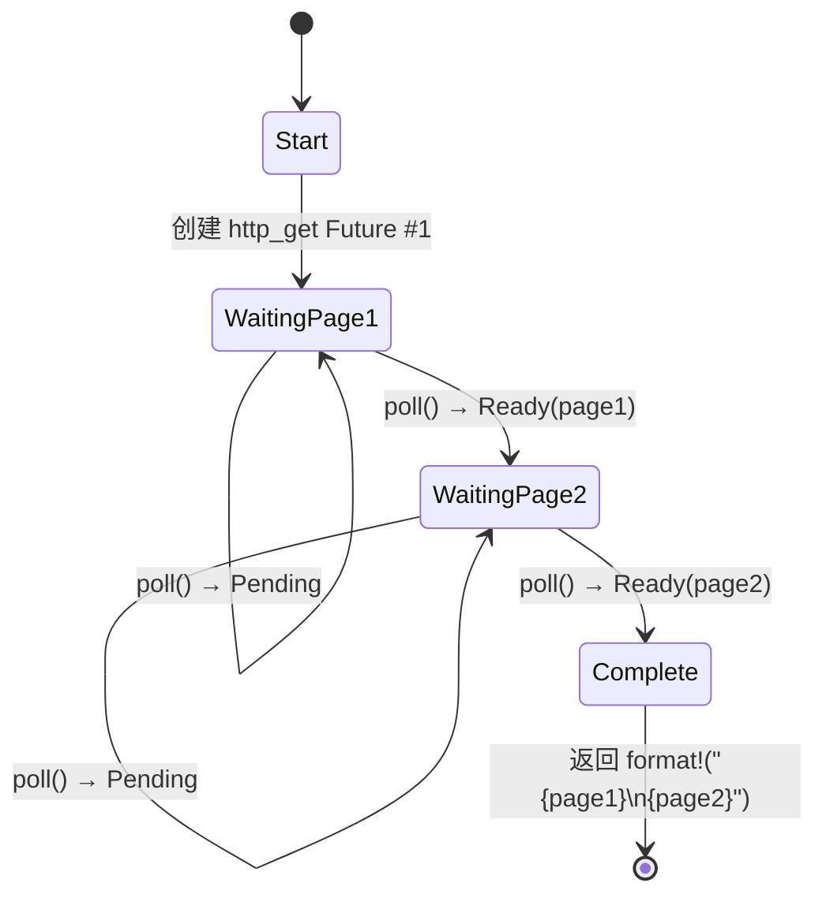

# 5. 状态机揭秘 🟢

> **您将学到什么：**
> - 编译器如何将 `async fn` 转换为枚举状态机
> - 并排比较：源代码与生成的状态
> - 为什么`async fn`中的大栈分配会导致Future 的大小增大
> - 丢弃优化：一旦不再需要，值就会被丢弃

## 编译器实际生成什么

当您编写 `async fn` 时，编译器会将您的顺序代码转换为基于枚举的状态机。理解这种转换是理解 async Rust 的性能特性及其许多怪癖的关键。

### 并排：async fn 与状态机

```rust
// 小白提示：这段代码演示【并排：async fn 与状态机】。先看类型/函数签名，再看 .await、poll、spawn 等关键调用怎样推动异步任务。
// 你写的：
async fn fetch_two_pages() -> String {
    let page1 = http_get("https://example.com/a").await;
    let page2 = http_get("https://example.com/b").await;
    format!("{page1}\n{page2}")
}
```

编译器在概念上生成如下内容：

```rust
// 小白提示：这段代码演示【并排：async fn 与状态机】。先看类型/函数签名，再看 .await、poll、spawn 等关键调用怎样推动异步任务。
enum FetchTwoPagesStateMachine {
    // 状态0：即将调用page1的http_get
    Start,

    // 状态1：等待page1，掌握Future
    WaitingPage1 {
        fut1: HttpGetFuture,
    },

    // 状态2：已获取page1，正在等待page2
    WaitingPage2 {
        page1: String,
        fut2: HttpGetFuture,
    },

    // 终端状态
    Complete,
}

impl Future for FetchTwoPagesStateMachine {
    type Output = String;

    fn poll(mut self: Pin<&mut Self>, cx: &mut Context<'_>) -> Poll<String> {
        loop {
            match self.as_mut().get_mut() {
                Self::Start => {
                    let fut1 = http_get("https://example.com/a");
                    *self.as_mut().get_mut() = Self::WaitingPage1 { fut1 };
                }
                Self::WaitingPage1 { fut1 } => {
                    let page1 = match Pin::new(fut1).poll(cx) {
                        Poll::Ready(v) => v,
                        Poll::Pending => return Poll::Pending,
                    };
                    let fut2 = http_get("https://example.com/b");
                    *self.as_mut().get_mut() = Self::WaitingPage2 { page1, fut2 };
                }
                Self::WaitingPage2 { page1, fut2 } => {
                    let page2 = match Pin::new(fut2).poll(cx) {
                        Poll::Ready(v) => v,
                        Poll::Pending => return Poll::Pending,
                    };
                    let result = format!("{page1}\n{page2}");
                    *self.as_mut().get_mut() = Self::Complete;
                    return Poll::Ready(result);
                }
                Self::Complete => panic!("polled after completion"),
            }
        }
    }
}
```

> **注意**：这种脱糖是*概念性的*。真正的编译器输出使用
> `unsafe` 引脚投影 — 此处显示的 `get_mut()` 调用需要
> `Unpin`，但异步状态机是`!Unpin`。目的是为了说明
> 状态转换，不产生可编译的代码。



> **注明内容：**
> - **WaitingPage1** — 存储 `fut1: HttpGetFuture` （page2 尚未分配）
> - **WaitingPage2** — 存储 `page1: String`、`fut2: HttpGetFuture`（fut1 已被删除）

### 为什么这对性能很重要

**零成本**：状态机是一个栈分配的枚举。将来没有堆分配，没有垃圾收集器，没有装箱 - 除非您明确使用 `Box::pin()`。

**大小**：枚举的大小是其所有变体中的最大值。每个 `.await` 点都会创建一个新变体。这意味着：

```rust
// 小白提示：这段代码演示【为什么这对性能很重要】。先看类型/函数签名，再看 .await、poll、spawn 等关键调用怎样推动异步任务。
async fn small() {
    let a: u8 = 0;
    yield_now().await;
    let b: u8 = 0;
    yield_now().await;
}
// 大小 ≈ max(size_of(u8), size_of(u8)) + 判别式 + Future 尺寸
//      small!

async fn big() {
    let buf: [u8; 1_000_000] = [0; 1_000_000]; // 栈上 1MB！
    some_io().await;
    process(&buf);
}
// 大小 ≈ 1MB + 内部Future大小
// ⚠️ 不要在 async 函数中在栈上分配巨大的缓冲区！
// 请改用 Vec<u8> 或 Box<[u8]>。
```

**删除优化**：当状态机转换时，它会删除不再需要的值。在上面的示例中，当我们从 `WaitingPage1` 转换到 `WaitingPage2` 时，`fut1` 被删除 - 编译器会自动插入删除。

> **实用规则**：`async fn`中的大栈分配会毁掉Future 的
> 尺寸。如果您在异步代码中看到栈溢出，请检查大型数组或
> 深度嵌套的 future。如果需要，使用 `Box::pin()` 堆分配子Future。

### 练习：预测状态机

<details>
<summary>🏋️ 练习（点击展开）</summary>

**挑战**：给定这个异步函数，画出编译器生成的状态机。它有多少个状态（枚举变体）？每个中存储什么值？

```rust
// 小白提示：这段代码演示【练习：预测状态机】。先看类型/函数签名，再看 .await、poll、spawn 等关键调用怎样推动异步任务。
async fn pipeline(url: &str) -> Result<usize, Error> {
    let response = fetch(url).await?;
    let body = response.text().await?;
    let parsed = parse(body).await?;
    Ok(parsed.len())
}
```

<details>
<summary>🔑 参考答案</summary>

五个状态：

1. **开始** — 商店`url`
2. **WaitingFetch** — 存储 `url`，`fetch` Future
3. **WaitingText** — 存储 `response`、`text()` Future
4. **WaitingParse** — 存储 `body`、`parse` Future
5. **完成** — 返回 `Ok(parsed.len())`

每个 `.await` 创建一个屈服点 = 一个新的枚举变体。 `?` 添加提前退出路径，但不添加额外的状态 - 它只是 `Poll::Ready` 值上的 `match`。

</details>
</details>

> **关键要点 — 状态机揭示**
> - `async fn` 编译为枚举，每个 `.await` 点有一个变体
> - Future 的 **尺寸** = 所有变体尺寸的最大值 - 大栈值将其炸毁
> - 编译器在状态转换时自动插入 **drops**
> - 当Future 的大小成为问题时使用`Box::pin()`或堆分配

> **另请参阅：** [第 4 章 — Pin 和 Unpin](ch04-pin-and-unpin.md) 了解为什么生成的枚举需要固定，[第 6 章 — 手工构建 Future](ch06-building-futures-by-hand.md) 自己构建这些状态机

***


