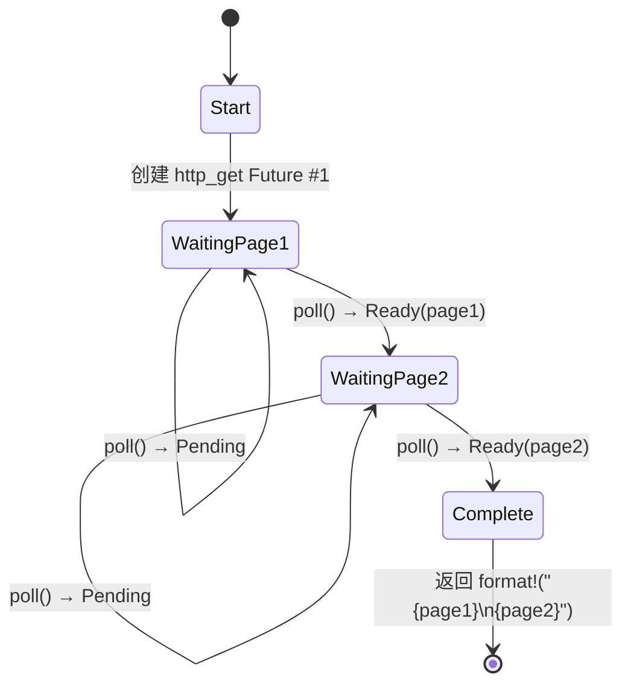

# 5. 状态机（state machine）揭秘

> **你将学到什么：**
> - 编译器如何将 `async fn` 转换为基于枚举的状态机
> - 并排对比：源代码 vs 生成的状态
> - 为什么 `async fn` 中的大栈分配会导致 Future 体积膨胀
> - 丢弃优化：一旦不再需要，值就会被自动丢弃

## 编译器实际生成了什么

当你写 `async fn` 时，编译器会将你顺序编写的代码转换为基于枚举的状态机。理解这一转换是掌握 async Rust 性能特征及其许多"怪癖"的关键。

### 并排对比：async fn vs 状态机

```rust
// ===========================================================================
// 核心概念：顺序编写的 async fn 代码。
// 这段代码在人类看来是线性的：先获取 page1，再获取 page2，最后拼接。
// 但编译器必须处理 .await 可能返回 Poll::Pending 的情况——
// 每次 .await 都是状态机的一个断点。
// ===========================================================================

// 你写的：
async fn fetch_two_pages() -> String {
    // → 返回的 Future 类型是编译器生成的匿名类型
    let page1 = http_get("https://example.com/a").await;
    //            ^^^^^^^^^^^^^^^^^^^^^^^^^^^^^^^^^ 第一次 .await：yield 点 #1
    let page2 = http_get("https://example.com/b").await;
    //            ^^^^^^^^^^^^^^^^^^^^^^^^^^^^^^^^^ 第二次 .await：yield 点 #2
    format!("{page1}\n{page2}")
    // → 最终返回值，此时两个请求都已完成
}
```

编译器在概念上生成的代码如下：

```rust
// ===========================================================================
// 核心概念：编译器脱糖后的状态机结构。
//
// 设计理由：
// 1. 每个 .await 点 = 一个枚举变体。当 poll() 返回 Poll::Pending 时，
//    状态机保持当前变体不变；下次 poll() 进来时，直接从上次的位置继续。
// 2. 状态之间通过分配切换——不是修改字段，而是整体替换 self 为新的变体，
//    这自然地让 Rust 在状态转换时自动调用旧变体的 drop。
// 3. 枚举大小 = max(每个变体的大小) + 判别式字节。大字段在任何一个变体中
//    出现，就会拉高整个枚举的大小。
//
// ⚠️ 注意：此脱糖是概念性的。真正的编译器输出使用 unsafe 的 Pin 投影。
// 这里用 get_mut() 是为了可读性，但异步状态机是 !Unpin，
// 实际代码中无法用安全的 get_mut() 获取 &mut Self。
// ===========================================================================

enum FetchTwoPagesStateMachine {
    // 状态 0：尚未开始，即将创建第一个 http_get Future
    Start,

    // 状态 1：正在等待 page1，持有 Future
    // → 此变体中只有 fut1，page2 还不存在——这是精简的
    WaitingPage1 {
        fut1: HttpGetFuture,    // → 正在执行的 HTTP 请求 Future
    },

    // 状态 2：已获得 page1，正在等待 page2
    // → fut1 已被消费并 drop，page1 被保存，fut2 是新创建的
    WaitingPage2 {
        page1: String,          // → 第一个请求的结果，等待与第二个结果拼接
        fut2: HttpGetFuture,    // → 第二个 HTTP 请求 Future
    },

    // 终端状态：两个请求都已完成
    // → 不再持有任何子 Future，结果已返回
    Complete,
}

impl Future for FetchTwoPagesStateMachine {
    type Output = String;

    fn poll(mut self: Pin<&mut Self>, cx: &mut Context<'_>) -> Poll<String> {
        loop {
            match self.as_mut().get_mut() {
                Self::Start => {
                    // → 创建第一个 Future 并立即切换到 WaitingPage1
                    // 这次 poll() 会继续循环，立即尝试轮询 fut1
                    let fut1 = http_get("https://example.com/a");
                    *self.as_mut().get_mut() = Self::WaitingPage1 { fut1 };
                    // 注意：状态切换后继续循环——这实现了"同一个 poll() 调用中
                    // 尽可能推进"的语义，减少不必要的 Pending 往返
                }
                Self::WaitingPage1 { fut1 } => {
                    // → 轮询子 Future
                    // Pin::new(fut1) 为子 Future 创建 Pin 包装
                    let page1 = match Pin::new(fut1).poll(cx) {
                        Poll::Ready(v) => v,    // → fut1 完成，取出结果
                        Poll::Pending => return Poll::Pending, // → 未完成，向上传递 Pending
                    };
                    // → fut1 已完成并被 drop，创建下一个 Future
                    let fut2 = http_get("https://example.com/b");
                    *self.as_mut().get_mut() = Self::WaitingPage2 { page1, fut2 };
                    // → 继续循环，立即尝试轮询 fut2
                }
                Self::WaitingPage2 { page1, fut2 } => {
                    // → 同样模式：轮询 → 检查结果 → Pending 则返回
                    let page2 = match Pin::new(fut2).poll(cx) {
                        Poll::Ready(v) => v,    // → fut2 完成
                        Poll::Pending => return Poll::Pending,
                    };
                    // → 两个结果都拿到了，拼接并返回
                    let result = format!("{page1}\n{page2}");
                    *self.as_mut().get_mut() = Self::Complete;
                    return Poll::Ready(result);
                    // → 调用者拿到最终结果，状态机生命期结束
                }
                Self::Complete => panic!("polled after completion"),
                // → 规范要求：完成后再被 poll 是调用方的 bug
            }
        }
    }
}
```



> **注释：**
> - **WaitingPage1** — 存储 `fut1: HttpGetFuture`（此时 page2 尚未分配，内存精简）
> - **WaitingPage2** — 存储 `page1: String` 和 `fut2: HttpGetFuture`（fut1 在状态转换时已被自动 drop）

### 这对性能意味着什么

**零成本抽象**：状态机是栈分配的枚举。没有隐式的堆分配，没有垃圾回收，没有装箱——除非你显式使用 `Box::pin()`。

**大小问题**：枚举的大小等于其所有变体中的最大值。每个 `.await` 点创建一个新的变体。这意味着：

```rust
// ===========================================================================
// 核心概念：Future 的大小 = 枚举所有变体中最大的那个 + discriminant 字节。
// 大栈分配在任何一个变体中出现，就会影响整个 Future 的大小。
// 这就是为什么在 async fn 中应该避免大栈数组，改用 Vec 或 Box。
// ===========================================================================

async fn small() {
    let a: u8 = 0;     // → size_of(u8) = 1 字节，很小
    yield_now().await; // → .await 点 #1：此变体只存 a
    let b: u8 = 0;     // → size_of(u8) = 1 字节
    yield_now().await; // → .await 点 #2：此变体只存 b
}
// 大小 ≈ max(size_of(u8), size_of(u8)) + discriminant + 内部 Future 大小
//     ≈ 1 + 1 + ~0 = 非常小！

async fn big() {
    let buf: [u8; 1_000_000] = [0; 1_000_000]; // ⚠️ 栈上分配 1MB！
    some_io().await;                             // → 此 .await 变体持有整个 1MB 数组
    process(&buf);
}
// 大小 ≈ 1MB + 内部 Future 大小
// ⚠️ 警告：大栈数组会让 Future 体积爆炸！
// 修复方案：用 Vec<u8>（24 字节，数据在堆上）或 Box<[u8]> 代替
```

**丢弃优化**：当状态机转换时，它会自动丢弃不再需要的值。在上面的例子中，从 `WaitingPage1` 转换到 `WaitingPage2` 时，`fut1` 被自动丢弃——编译器在状态转换处插入 drop 调用，无需手动管理。

> **实用规则**：`async fn` 中的大栈分配会膨胀 Future 的体积。
> 如果你在异步代码中遇到栈溢出，首先检查是否有大型数组或深度嵌套的 Future。
> 必要时使用 `Box::pin()` 将子 Future 放到堆上。

### 练习：预测状态机

<details>
<summary>练习（点击展开）</summary>

**挑战**：给定这个异步函数，画出编译器生成的状态机。它有多少个状态（枚举变体）？每个变体中存储哪些值？

```rust
// ===========================================================================
// 练习：分析 pipeline 函数的状态机结构。
// 提示：每个 .await 创建一个断点，? 运算符在 Err 时提前退出
// （不增加新状态，只是匹配 Poll::Ready 的值后决定是否提前返回）。
// ===========================================================================

async fn pipeline(url: &str) -> Result<usize, Error> {
    let response = fetch(url).await?;   // → .await #1
    //                               ^ ? 运算符：Err 时立即返回 Err，不进入下一变体
    let body = response.text().await?;  // → .await #2
    //                            ^ ? 运算符：Err 时立即返回 Err
    let parsed = parse(body).await?;    // → .await #3
    //                          ^ ? 运算符：Err 时立即返回 Err
    Ok(parsed.len())                    // → 最终响应
}
```

<details>
<summary>参考答案</summary>

共有五个状态（加上初始状态 Start）：

1. **Start** — 存储 `url: &str`（从参数复制）
2. **WaitingFetch** — 存储 `url` 和 `fetch` 返回的 Future
3. **WaitingText** — 存储 `response`（fetch 的结果）和 `text()` 返回的 Future
4. **WaitingParse** — 存储 `body`（text 的结果）和 `parse` 返回的 Future
5. **Complete** — 返回 `Ok(parsed.len())`

每个 `.await` 创建一个 yield 点 = 一个新的枚举变体。`?` 运算符增加了提前退出路径，但不增加额外状态——它只是对 `Poll::Ready` 的值进行 `match` 判断。

</details>
</details>

> **关键要点 -- 状态机揭秘**
> - `async fn` 编译为一个枚举，每个 `.await` 点对应一个变体
> - Future 的 **体积** = 所有变体大小的最大值——大栈变量会显著膨胀它
> - 编译器在状态转换时自动插入 **drop** 调用
> - 当 Future 体积成为问题时，使用 `Box::pin()` 或堆分配

> **另请参阅：** [第 4 章 -- Pin 和 Unpin](ch04-pin-and-unpin.md) 了解为什么生成的枚举需要固定，[第 6 章 -- 手工构建 Future](ch06-building-futures-by-hand.md) 学习亲手构建这些状态机

***
