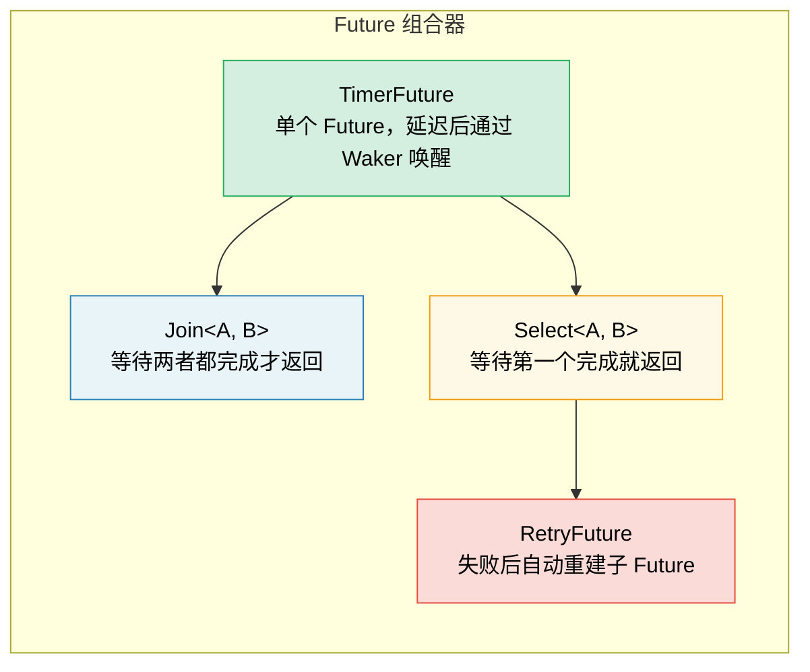

# 6. 手工构建 Future

> **你将学到什么：**
> - 通过基于线程的唤醒机制实现 `TimerFuture`
> - 构建 `Join` 组合器（combinator）：同时运行两个 Future
> - 构建 `Select` 组合器：竞速两个 Future
> - 组合器的组合方式——Future 层层嵌套

## 一个简单的 TimerFuture

现在让我们从头开始构建真实、有用的 Future。这将巩固第 2-5 章的理论。

### TimerFuture：完整示例

```rust
// ===========================================================================
// 核心概念：TimerFuture 演示了一个完整 Future 实现的三要素：
// 1. 状态存储 —— SharedState 保存 completed 标志和 Waker
// 2. poll() 实现 —— 检查状态，Pending 时注册 Waker，Ready 时返回
// 3. Waker 注册 —— 后台线程完成时通过 Waker 通知执行器（executor）重新轮询
//
// 设计理由：
// - Arc<Mutex<>> 让主线程和计时线程安全共享状态
// - Waker 存储在 Option 中，保证只有最后一次 poll 的 Waker 会被唤醒
// - 线程在 wake() 前 take() Waker，避免重复唤醒同一个 Waker
//
// ⚠️ 生产环境注意：每个 TimerFuture 创建一个 OS 线程——适合学习，
// 生产代码应使用 tokio::time::sleep（基于共享的计时器轮，零额外线程）。
// ===========================================================================

use std::future::Future;
use std::pin::Pin;
use std::sync::{Arc, Mutex};
use std::task::{Context, Poll, Waker};
use std::thread;
use std::time::{Duration, Instant};

pub struct TimerFuture {
    shared_state: Arc<Mutex<SharedState>>,
    // → Arc：多个所有者（主 Future + 后台线程）
    // → Mutex：互斥访问（主线程 poll 时读，后台线程完成时写）
}

struct SharedState {
    completed: bool,        // → 计时是否已到
    waker: Option<Waker>,   // → 存储执行器提供的 Waker，完成后用它来唤醒
}

impl TimerFuture {
    pub fn new(duration: Duration) -> Self {
        let shared_state = Arc::new(Mutex::new(SharedState {
            completed: false,   // → 初始：计时未到
            waker: None,        // → 初始：尚无 Waker（poll 时才设置）
        }));

        // → 创建后台线程，在指定时长后将 completed 置为 true
        let thread_shared_state = Arc::clone(&shared_state);
        //                            ^^^^^^^^^ clone Arc：增加引用计数，共享同一个 Mutex
        thread::spawn(move || {
            thread::sleep(duration);   // → 阻塞等待（仅此线程被阻塞）
            let mut state = thread_shared_state.lock().unwrap();
            //                              ^^^^ 获取锁，内部可变性
            state.completed = true;    // → 标记完成

            // → 如果已有 Waker 注册（说明 Future 已被 poll），唤醒执行器
            if let Some(waker) = state.waker.take() {
                //                       ^^^^ take() 取出 Waker 并置 None
                //                       防止重复唤醒同一个 Waker
                waker.wake(); // → 通知执行器：这个 Future 可以重新轮询了
            }
        });

        TimerFuture { shared_state }
    }
}

impl Future for TimerFuture {
    type Output = ();  // → TimerFuture 不产生有意义的值，仅等待

    fn poll(self: Pin<&mut Self>, cx: &mut Context<'_>) -> Poll<()> {
        // → 获取锁，读取共享状态
        let mut state = self.shared_state.lock().unwrap();

        if state.completed {
            // → 计时已到，返回 Ready
            Poll::Ready(())
        } else {
            // → 计时未到，存储 Waker 并返回 Pending
            // ⚠️ 重要：每次都更新 Waker，因为执行器可能在两次 poll 之间
            // 更换了 Waker（例如任务被移动到不同线程）
            state.waker = Some(cx.waker().clone());
            //                      ^^^^^ 从 Context 获取当前 Waker
            //                            ^^^^^ clone 复制 Waker（Waker 内部是 Arc）
            Poll::Pending
            // → 返回 Pending 后，执行器会将此 Future 放入等待队列，
            // 直到后台线程调用 waker.wake() 将其重新加入就绪队列
        }
    }
}

// 用法：
// async fn example() {
//     println!("Starting timer...");
//     TimerFuture::new(Duration::from_secs(2)).await;
//     // → .await 会调用 poll()，第一次返回 Pending，
//     // 2 秒后 Waker 被触发，执行器重新 poll，返回 Ready
//     println!("Timer done!");
// }
```

### Join：同时运行两个 Future

`Join` 同时轮询两个 Future，并在两者都完成时返回结果。这就是 `tokio::join!` 宏的内部原理：

```rust
// ===========================================================================
// 核心概念：Join<A, B> 是一个 Future 组合器——本身是 Future，内部包装了
// 两个子 Future。每次 poll() 同时推进两个子 Future，直到两者都完成。
//
// 设计理由：
// 1. MaybeDone 枚举追踪每个子 Future 的状态（Pending/Done/Taken）
// 2. 手动实现 Unpin——因为我们只和 Unpin 子 Future 配合使用，
//    且不会将 Pin 投影到字段上，这样做是安全的
// 3. get_mut() 依赖 Unpin 实现——如果 Self: Unpin，则 Pin<&mut Self>
//    可以直接安全地通过 get_mut() 拿到 &mut Self
// 4. Taken 状态用于在匹配时安全地取走输出值（mem::replace 而非 move）
// ===========================================================================

use std::future::Future;
use std::pin::Pin;
use std::task::{Context, Poll};

/// 并发轮询两个 Future，在两者都完成时返回它们的输出元组
pub struct Join<A, B>
where
    A: Future,
    B: Future,
{
    a: MaybeDone<A>,   // → 第一个子 Future 的状态追踪器
    b: MaybeDone<B>,   // → 第二个子 Future 的状态追踪器
}

/// 追踪单个子 Future 的三态状态
enum MaybeDone<F: Future> {
    Pending(F),          // → 仍在执行中，持有 Future 本体
    Done(F::Output),     // → 已完成，持有输出值
    Taken,               // → 输出已被取走（用于 mem::replace 的中间状态）
}

// → 手动为 Join 实现 Unpin。由于我们只和 Unpin 子 Future 配合，
// 且不会把 Pin 投射到字段上，这是安全的。
// 有了 Unpin，poll() 中就可以安全地使用 self.get_mut()。
impl<A: Future + Unpin, B: Future + Unpin> Unpin for Join<A, B> {}

impl<A, B> Join<A, B>
where
    A: Future,
    B: Future,
{
    pub fn new(a: A, b: B) -> Self {
        Join {
            a: MaybeDone::Pending(a), // → 初始：两者都处于 Pending 状态
            b: MaybeDone::Pending(b),
        }
    }
}

impl<A, B> Future for Join<A, B>
where
    A: Future + Unpin,
    B: Future + Unpin,
{
    type Output = (A::Output, B::Output);

    fn poll(self: Pin<&mut Self>, cx: &mut Context<'_>) -> Poll<Self::Output> {
        let this = self.get_mut();
        //      ^^^^^^^ 由于 Self: Unpin，可以安全获取 &mut Self
        //              无需 unsafe 的 Pin 投影

        // → 如果 A 尚未完成，轮询 A
        if let MaybeDone::Pending(ref mut fut) = this.a {
            //  ^^^^^^^^^^^^^^^ 模式匹配：仅在 Pending 状态下才匹配
            //                  ref mut fut：获取对内部 Future 的可变引用
            if let Poll::Ready(val) = Pin::new(fut).poll(cx) {
                //  ^^^^^^^^^^^^^^^^^ Pin::new()：为子 Future 创建 Pin 包装
                //  注意：这里要求子 Future: Unpin，所以 Pin::new() 安全
                this.a = MaybeDone::Done(val);
                // → A 完成：将状态从 Pending 切换为 Done，保存结果
            }
        }

        // → 如果 B 尚未完成，轮询 B（逻辑与 A 相同）
        if let MaybeDone::Pending(ref mut fut) = this.b {
            if let Poll::Ready(val) = Pin::new(fut).poll(cx) {
                this.b = MaybeDone::Done(val);
                // → B 完成：切换到 Done 状态
            }
        }

        // → 检查两者是否都已完成
        match (&this.a, &this.b) {
            (MaybeDone::Done(_), MaybeDone::Done(_)) => {
                // → 两者都完成，安全地取出输出值
                // 使用 mem::replace 而非直接 move：因为 match 中只能通过引用访问
                let a_val = match std::mem::replace(&mut this.a, MaybeDone::Taken) {
                    //              ^^^^^^^^^^^^^^^^^ 将 this.a 替换为 Taken，
                    //              同时返回原来的值（所有权的转移）
                    MaybeDone::Done(v) => v,   // → 取出 A 的结果
                    _ => unreachable!(),       // → 已知是 Done，不可能走这里
                };
                let b_val = match std::mem::replace(&mut this.b, MaybeDone::Taken) {
                    MaybeDone::Done(v) => v,   // → 取出 B 的结果
                    _ => unreachable!(),
                };
                Poll::Ready((a_val, b_val))
                // → 返回两个结果的元组
            }
            _ => Poll::Pending, // → 至少一个仍在 Pending，继续等待
        }
    }
}

// 用法（async 块是 !Unpin，所以用 Box::pin 包裹它们以满足 Unpin 约束）：
// let (page1, page2) = Join::new(
//     Box::pin(http_get("https://example.com/a")), // → 堆分配 + 固定
//     Box::pin(http_get("https://example.com/b")), // → 堆分配 + 固定
// ).await;
// → 两个请求同时在同一个线程上交错执行！
```

> **关键洞察**：这里的"并发"指的是*在同一线程上交错的协作式多任务*。
> Join 不生成任何线程——它在同一个 `poll()` 调用中轮询两个 Future。
> 这是协作式并发，不是并行。



### Select：竞速两个 Future

`Select` 在任一 Future 率先完成时返回（另一个被丢弃）：

```rust
// ===========================================================================
// 核心概念：Select<A, B> 在两个子 Future 之间竞速，先完成的胜出。
//
// 设计理由：
// 1. 先轮询 A，再轮询 B——先就绪者胜出
// 2. 返回 Either::Left/Right 让调用者区分胜出方
// 3. 落败方的 Future 被自动 drop（当 Select 自己被 drop 时）
// 4. 这里 A 和 B 直接存储为字段而非 MaybeDone，
//    因为我们只需要知道"谁先完成"，不需要追踪两者的完成状态
//
// ⚠️ 公平性问题：我们的实现总是先轮询 A——如果两者同时就绪，A 总是赢。
// Tokio 的 select! 宏会用随机化轮询顺序来保证公平性。
// ===========================================================================

use std::future::Future;
use std::pin::Pin;
use std::task::{Context, Poll};

/// 区分竞速结果：Left 表示 A 先完成，Right 表示 B 先完成
pub enum Either<A, B> {
    Left(A),    // → A 胜出
    Right(B),   // → B 胜出
}

/// 返回先完成的 Future 的结果，丢弃另一个
pub struct Select<A, B> {
    a: A,   // → Future A（直接存储，不需要 MaybeDone）
    b: B,   // → Future B（直接存储，不需要 MaybeDone）
}

impl<A, B> Select<A, B>
where
    A: Future + Unpin,
    B: Future + Unpin,
{
    pub fn new(a: A, b: B) -> Self {
        Select { a, b }
    }
}

impl<A, B> Future for Select<A, B>
where
    A: Future + Unpin,
    B: Future + Unpin,
{
    type Output = Either<A::Output, B::Output>;

    fn poll(mut self: Pin<&mut Self>, cx: &mut Context<'_>) -> Poll<Self::Output> {
        // → 先轮询 A：如果 A 就绪，立即返回，B 被丢弃
        if let Poll::Ready(val) = Pin::new(&mut self.a).poll(cx) {
            //  ^^^^^^^^^^^^^^^^^ Pin::new() 为子 Future 创建 Pin<&mut A>
            return Poll::Ready(Either::Left(val));
            //     ^^^^^^^^^^ 直接返回——B 不会被进一步轮询，在 Select drop 时自动清理
        }

        // → A 未就绪，轮询 B：如果 B 就绪，返回
        if let Poll::Ready(val) = Pin::new(&mut self.b).poll(cx) {
            return Poll::Ready(Either::Right(val));
            //     ^^^^^^^^^^ B 胜出，A 在 Select drop 时被丢弃
        }

        // → 两者都未就绪，注册 Waker 后返回 Pending
        // cx 中的 Waker 已被子 Future 的 poll 调用注册
        Poll::Pending
    }
}

// 超时使用示例：
// match Select::new(http_get(url), TimerFuture::new(timeout)).await {
//     Either::Left(response) => println!("获取到响应: {}", response),
//     Either::Right(()) => println!("请求超时！"),  // TimerFuture 先完成
// }
```

<details>
<summary><strong>练习：构建 RetryFuture</strong>（点击展开）</summary>

**挑战**：构建一个 `RetryFuture<F, Fut>`，它接受一个闭包 `F: Fn() -> Fut`，在内层 Future 返回 `Err` 时最多重试 N 次。首次成功 (`Ok`) 时返回该结果，全部尝试耗尽后返回最后的 `Err`。

*提示：你需要"正在尝试"和"已耗尽所有尝试"两种状态。*

<details>
<summary>参考答案</summary>

```rust
// ===========================================================================
// 核心概念：RetryFuture 是"组合器的组合器"——它是 Future 状态机（state machine），内部
// 又包含动态创建的子 Future。
//
// 设计要点：
// 1. factory: F 是工厂闭包——每次重试都调用它来创建新的子 Future
// 2. current: Option<Pin<Box<Fut>>> —— 把子 Future 放在堆上，
//    Pin<Box<T>> 总是 Unpin，避免了对子 Future 的 Unpin 约束
// 3. remaining: usize —— 剩余重试次数（首次不算重试）
// 4. last_error: Option<E> —— 缓存最后的错误，避免 move 冲突
//
// ⚠️ 注意：current 使用 Pin<Box<Fut>> 而非直接存储 Fut：
// - 好处：Pin<Box<T>> 始终是 Unpin，RetryFuture 因而也是 Unpin
// - 代价：每次重试有一次堆分配（Box::pin）
// ===========================================================================

use std::future::Future;
use std::pin::Pin;
use std::task::{Context, Poll};

pub struct RetryFuture<F, Fut, T, E>
where
    F: Fn() -> Fut,                          // → 工厂闭包：创建新的子 Future
    Fut: Future<Output = Result<T, E>>,       // → 子 Future：返回 Result
{
    factory: F,                               // → 工厂函数，每次重试时调用
    current: Option<Pin<Box<Fut>>>,           // → 当前正在执行的子 Future
    //              ^^^^^^^^^^^^^^^ Pin<Box<Fut>> 始终是 Unpin（堆分配的值永远不移动）
    remaining: usize,                         // → 剩余的重试次数
    last_error: Option<E>,                    // → 缓存最后一次的错误（用于最终返回）
}

impl<F, Fut, T, E> RetryFuture<F, Fut, T, E>
where
    F: Fn() -> Fut,
    Fut: Future<Output = Result<T, E>>,
{
    pub fn new(max_attempts: usize, factory: F) -> Self {
        let current = Some(Box::pin((factory)()));
        //               ^^^^^^^^ 堆分配 + 固定第一个子 Future
        //                        (factory)() 调用闭包创建 Future
        RetryFuture {
            factory,
            current,
            remaining: max_attempts.saturating_sub(1), // → 首次已创建，剩余 N-1 次
            //                        ^^^^^^^^^^^^^ 防溢出：0-1 会变成 0 而非 panic
            last_error: None,    // → 初始：尚无错误
        }
    }
}

impl<F, Fut, T, E> Future for RetryFuture<F, Fut, T, E>
where
    F: Fn() -> Fut + Unpin,                // → F 需要 Unpin（RetryFuture 自身需要）
    Fut: Future<Output = Result<T, E>>,     // → 不要求 Fut: Unpin！因为用了 Pin<Box<Fut>>
    E: Unpin,                               // → E 需要 Unpin（存储在结构体中）
{
    type Output = Result<T, E>;

    fn poll(mut self: Pin<&mut Self>, cx: &mut Context<'_>) -> Poll<Self::Output> {
        // → Pin<Box<Fut>> 始终是 Unpin，加上 F 和 E 也是 Unpin，
        // 整个 RetryFuture 是 Unpin，可以安全使用 get_mut()
        loop {
            if let Some(ref mut fut) = self.current {
                //  ^^^^^^^^^^^^^^^^^ 如果有正在执行的子 Future
                //  ref mut fut: &mut Pin<Box<Fut>>，对堆上 Future 的可变引用
                match fut.as_mut().poll(cx) {
                    //    ^^^^^^^ as_mut() 将 Pin<Box<Fut>> 转为 Pin<&mut Fut>
                    Poll::Ready(Ok(val)) => return Poll::Ready(Ok(val)),
                    //   → 成功！直接返回 Ok 结果，不再重试

                    Poll::Ready(Err(e)) => {
                        // → 失败：保存错误并检查是否还有重试次数
                        self.last_error = Some(e);
                        if self.remaining > 0 {
                            self.remaining -= 1;       // → 扣减一次
                            self.current = Some(Box::pin((self.factory)()));
                            //               ^^^^^^^^^ 调用工厂创建新的子 Future
                            //                         并立即堆分配 + 固定
                            // → 继续循环，立即轮询新创建的 Future
                            // （同一 poll() 调用中尽可能推进，减少往返）
                        } else {
                            // → 全部耗尽：返回最后的错误
                            return Poll::Ready(Err(self.last_error.take().unwrap()));
                            //                        ^^^^^^^^^^ take() 取出并置 None
                            //                        因为我们要把所有权转移给 Poll::Ready
                        }
                    }
                    Poll::Pending => return Poll::Pending,
                    // → 子 Future 未就绪：向上传递 Pending，等待 Waker 唤醒
                }
            } else {
                // → current 为 None 但还在 poll：异常状态
                return Poll::Ready(Err(self.last_error.take().unwrap()));
            }
        }
    }
}

// 用法：
// let result = RetryFuture::new(3, || async {
//     //                           ^^ 工厂闭包：每次重试都调用
//     http_get("https://flaky-server.com/api").await
// }).await;
// → 最多尝试 3 次（首次 + 2 次重试）
```

**关键要点**：重试 Future 本身就是一个状态机：它保存当前的尝试，在失败时创建新的内层 Future。将内层 Future 包装在 `Pin<Box<Fut>>` 中消除了对 `Fut: Unpin` 的约束——因为 `Pin<Box<T>>` 始终是 `Unpin`，所以结构体在支持任意 Future 类型的同时仍然易于使用。这就是组合器的组合方式——Future 一路嵌套到底。

</details>
</details>

> **关键要点 -- 手工构建 Future**
> - Future 需要三要素：状态存储、`poll()` 实现、Waker 注册
> - `Join` 同时轮询两个子 Future；`Select` 返回率先完成的那一个
> - 组合器本身就是包装其他 Future 的 Future——层层嵌套，直至底层
> - 手工构建 Future 能带来深层理解，但生产环境中应使用 `tokio::join!` / `select!` 等经过验证的宏

> **另请参阅：** [第 2 章 -- Future trait](ch02-the-future-trait.md) 了解 trait 定义，[第 8 章 -- Tokio 深入探讨](ch08-tokio-deep-dive.md) 了解生产级替代方案

***
