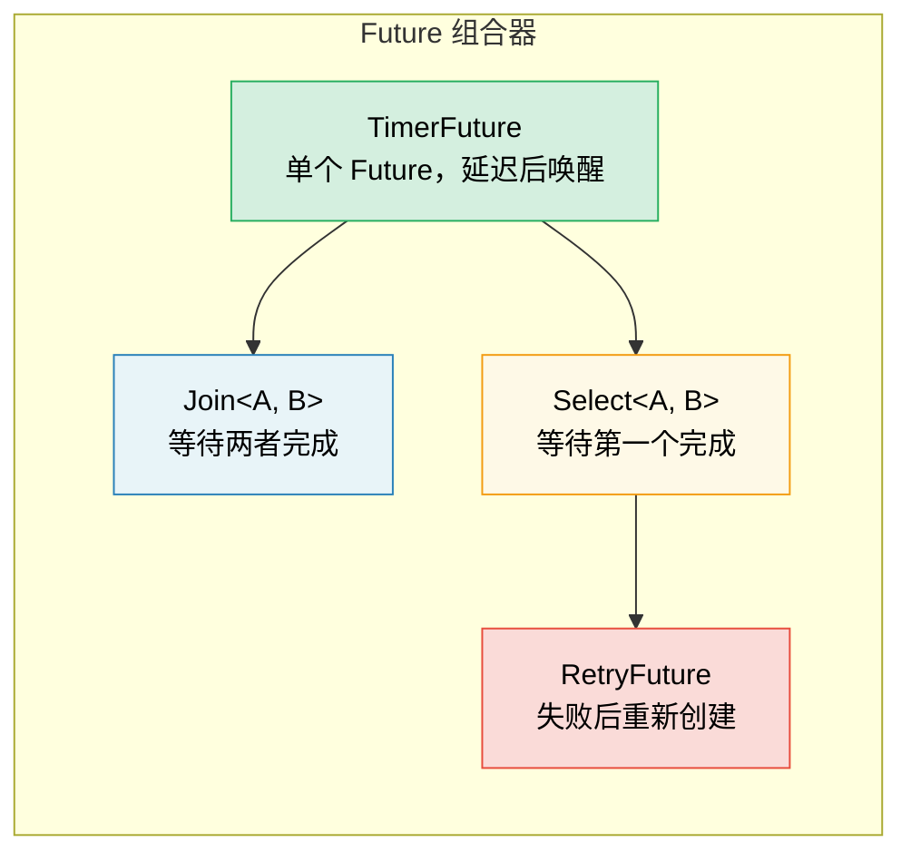

# 6. 手工构建 Future 🟡

> **您将学到什么：**
> - 通过基于线程的唤醒实现`TimerFuture`
> - 构建 `Join` 组合器：同时运行两个 future
> - 构建 `Select` 组合器：竞赛两个Future
> - 组合器如何组成——Future 一路下跌

## 一个简单的计时器Future

现在让我们从头开始构建真实、有用的Future。这巩固了第 2-5 章的理论。

### TimerFuture：一个完整​​的例子

```rust
use std::future::Future;
use std::pin::Pin;
use std::sync::{Arc, Mutex};
use std::task::{Context, Poll, Waker};
use std::thread;
use std::time::{Duration, Instant};

pub struct TimerFuture {
    shared_state: Arc<Mutex<SharedState>>,
}

struct SharedState {
    completed: bool,
    waker: Option<Waker>,
}

impl TimerFuture {
    pub fn new(duration: Duration) -> Self {
        let shared_state = Arc::new(Mutex::new(SharedState {
            completed: false,
            waker: None,
        }));

        // 生成一个后台线程，在指定时长后把 completed 置为 true
        let thread_shared_state = Arc::clone(&shared_state);
        thread::spawn(move || {
            thread::sleep(duration);
            let mut state = thread_shared_state.lock().unwrap();
            state.completed = true;
            if let Some(waker) = state.waker.take() {
                waker.wake(); // 通知执行人
            }
        });

        TimerFuture { shared_state }
    }
}

impl Future for TimerFuture {
    type Output = ();

    fn poll(self: Pin<&mut Self>, cx: &mut Context<'_>) -> Poll<()> {
        let mut state = self.shared_state.lock().unwrap();
        if state.completed {
            Poll::Ready(())
        } else {
            // 存储Waker，以便计时器线程可以唤醒我们
            // 重要：始终更新 Waker，执行器可能
            // 在Poll之间改变了它
            state.waker = Some(cx.waker().clone());
            Poll::Pending
        }
    }
}

// 用法：
// async fn example() {
//     println!("Starting timer...");
//     TimerFuture::new(Duration::from_secs(2)).await;
//     println!("Timer done!");
// }
//
// ⚠️ 这会为每个计时器生成一个 OS 线程 — 非常适合学习，但在
// 生产代码应使用 `tokio::time::sleep`，它由共享计时器支持
// 计时器轮并且需要零额外线程。
```

### Join：同时运行两个 future

`Join` 轮询两个 future，并在 * 两个 * 完成时完成。这就是 `tokio::join!` 的内部工作原理：

```rust
use std::future::Future;
use std::pin::Pin;
use std::task::{Context, Poll};

///// 并发轮询两个 Future，并把两个结果作为元组返回
pub struct Join<A, B>
where
    A: Future,
    B: Future,
{
    a: MaybeDone<A>,
    b: MaybeDone<B>,
}

enum MaybeDone<F: Future> {
    Pending(F),
    Done(F::Output),
    Taken, // 输出已被采取
}

// MaybeDone<F> 存储 F::Output，编译器无法证明
// 即使 F: Unpin 也为 Unpin。因为我们只使用 Join 与 Unpin
// Future；由于我们不会把 Pin 投射到字段，手动实现 Unpin 是安全的
// 这样就能安全地在 poll() 中调用 self.get_mut()。
impl<A: Future + Unpin, B: Future + Unpin> Unpin for Join<A, B> {}

impl<A, B> Join<A, B>
where
    A: Future,
    B: Future,
{
    pub fn new(a: A, b: B) -> Self {
        Join {
            a: MaybeDone::Pending(a),
            b: MaybeDone::Pending(b),
        }
    }
}

impl<A, B> Future for Join<A, B>
where
    A: Future + Unpin,
    B: Future + Unpin,
{
    type Output = (A::Output, B::Output);

    fn poll(self: Pin<&mut Self>, cx: &mut Context<'_>) -> Poll<Self::Output> {
        let this = self.get_mut();

        // 如果 A 尚未完成，则轮询 A
        if let MaybeDone::Pending(ref mut fut) = this.a {
            if let Poll::Ready(val) = Pin::new(fut).poll(cx) {
                this.a = MaybeDone::Done(val);
            }
        }

        // 如果 B 尚未完成，则轮询 B
        if let MaybeDone::Pending(ref mut fut) = this.b {
            if let Poll::Ready(val) = Pin::new(fut).poll(cx) {
                this.b = MaybeDone::Done(val);
            }
        }

        // 两件事都完成了吗？
        match (&this.a, &this.b) {
            (MaybeDone::Done(_), MaybeDone::Done(_)) => {
                // 获取两个输出
                let a_val = match std::mem::replace(&mut this.a, MaybeDone::Taken) {
                    MaybeDone::Done(v) => v,
                    _ => unreachable!(),
                };
                let b_val = match std::mem::replace(&mut this.b, MaybeDone::Taken) {
                    MaybeDone::Done(v) => v,
                    _ => unreachable!(),
                };
                Poll::Ready((a_val, b_val))
            }
            _ => Poll::Pending, // 至少有一项仍待处理
        }
    }
}

// 用法（async块是!Unpin，所以用Box::pin包裹它们）：
// let (page1, page2) = Join::new(
//     Box::pin(http_get("https://example.com/a")),
//     Box::pin(http_get("https://example.com/b")),
// ).await;
// 两个请求都运行concurrently!
```

> **关键见解**：“并发”在这里意味着*在同一线程上交错*。
> Join 不会生成线程——它会在同一个 `poll()` 调用中轮询两个 future。
> 这是合作并发，而不是并行。



### Select：赛跑两个Future

当 *任一* future 首先完成时 `Select` 完成（另一个被丢弃）：

```rust
use std::future::Future;
use std::pin::Pin;
use std::task::{Context, Poll};

pub enum Either<A, B> {
    Left(A),
    Right(B),
}

///// 返回先完成的 Future，并丢弃另一个
pub struct Select<A, B> {
    a: A,
    b: B,
}

impl<A, B> Select<A, B>
where
    A: Future + Unpin,
    B: Future + Unpin,
{
    pub fn new(a: A, b: B) -> Self {
        Select { a, b }
    }
}

impl<A, B> Future for Select<A, B>
where
    A: Future + Unpin,
    B: Future + Unpin,
{
    type Output = Either<A::Output, B::Output>;

    fn poll(mut self: Pin<&mut Self>, cx: &mut Context<'_>) -> Poll<Self::Output> {
        // 先轮询 A
        if let Poll::Ready(val) = Pin::new(&mut self.a).poll(cx) {
            return Poll::Ready(Either::Left(val));
        }

        // 然后轮询B
        if let Poll::Ready(val) = Pin::new(&mut self.b).poll(cx) {
            return Poll::Ready(Either::Right(val));
        }

        Poll::Pending
    }
}

// 超时使用：
// match Select::new(http_get(url), TimerFuture::new(timeout)).await {
//     Either::Left(response) => println!("Got response: {}", response),
//     Either::Right(()) => println!("Request timed out!"),
// }
```

> **公平说明**：我们的`Select`总是先轮询A——如果两者都准备好了，A
> 总是赢。 Tokio 的 `select!` 宏随机化轮询顺序以确保公平。

<details>
<summary><strong>🏋️ 练习：构建 RetryFuture</strong>（点击展开）</summary>

**挑战**：构建一个 `RetryFuture<F, Fut>`，它采用闭包 `F: Fn() -> Fut` 并在内部Future返回 `Err` 时重试最多 N 次。它应该返回第一个 `Ok` 结果或最后一个 `Err`。

*提示*：您需要“正在尝试”和“已用尽所有尝试”的状态。

<details>
<summary>🔑 参考答案</summary>

```rust
use std::future::Future;
use std::pin::Pin;
use std::task::{Context, Poll};

pub struct RetryFuture<F, Fut, T, E>
where
    F: Fn() -> Fut,
    Fut: Future<Output = Result<T, E>>,
{
    factory: F,
    current: Option<Pin<Box<Fut>>>,
    remaining: usize,
    last_error: Option<E>,
}

impl<F, Fut, T, E> RetryFuture<F, Fut, T, E>
where
    F: Fn() -> Fut,
    Fut: Future<Output = Result<T, E>>,
{
    pub fn new(max_attempts: usize, factory: F) -> Self {
        let current = Some(Box::pin((factory)()));
        RetryFuture {
            factory,
            current,
            remaining: max_attempts.saturating_sub(1),
            last_error: None,
        }
    }
}

impl<F, Fut, T, E> Future for RetryFuture<F, Fut, T, E>
where
    F: Fn() -> Fut + Unpin,
    Fut: Future<Output = Result<T, E>>,
    E: Unpin,
{
    type Output = Result<T, E>;

    fn poll(mut self: Pin<&mut Self>, cx: &mut Context<'_>) -> Poll<Self::Output> {
        // Pin<Box<Fut>> 始终是 Unpin，因此当 F 和 E 是时，结构体是 Unpin。
        // 这让我们可以安全地使用get_mut()，而无需任何不安全的代码。
        loop {
            if let Some(ref mut fut) = self.current {
                match fut.as_mut().poll(cx) {
                    Poll::Ready(Ok(val)) => return Poll::Ready(Ok(val)),
                    Poll::Ready(Err(e)) => {
                        self.last_error = Some(e);
                        if self.remaining > 0 {
                            self.remaining -= 1;
                            self.current = Some(Box::pin((self.factory)()));
                            // 立即循环轮询新的 future
                        } else {
                            return Poll::Ready(Err(self.last_error.take().unwrap()));
                        }
                    }
                    Poll::Pending => return Poll::Pending,
                }
            } else {
                return Poll::Ready(Err(self.last_error.take().unwrap()));
            }
        }
    }
}

// 用法：
// let result = RetryFuture::new(3, || async {
//     http_get("https://flaky-server.com/api").await
// }).await;
```

**关键要点**：重试 future 本身就是一个状态机：它保存当前的尝试并在失败时创建新的内部 future。将内部Future包装在 `Pin<Box<Fut>>` 中会删除 `Fut: Unpin` 界限 - 由于 `Pin<Box<T>>` 始终是 `Unpin`，因此该结构在支持任何Future 类型的同时仍然易于使用。这就是组合器的组成方式——Future一直向下。

</details>
</details>

> **关键要点——手工构建 Future**
> - Future 需要三件事：状态、`poll()`实现和Waker 注册
> - `Join` 轮询两个子Future； `Select` 返回先完成的那个
> - 组合器本身就是包裹其他Future 的Future——它是一路向下的海龟
> - 手工构建 future 可以提供深入的洞察，但在生产使用中`tokio::join!`/`select!`

> **另请参阅：** [第 2 章 — Future trait](ch02-the-future-trait.md) 表示 trait 定义，[第 8 章 — Tokio 深入探讨](ch08-tokio-deep-dive.md) 表示生产级等效项

***


