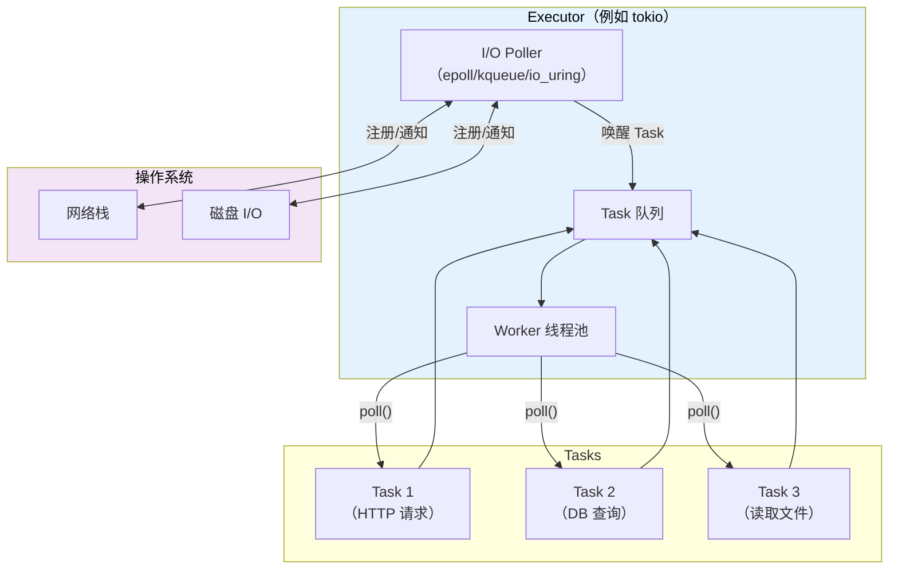
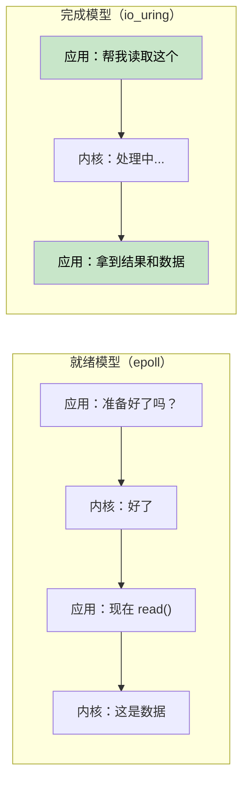
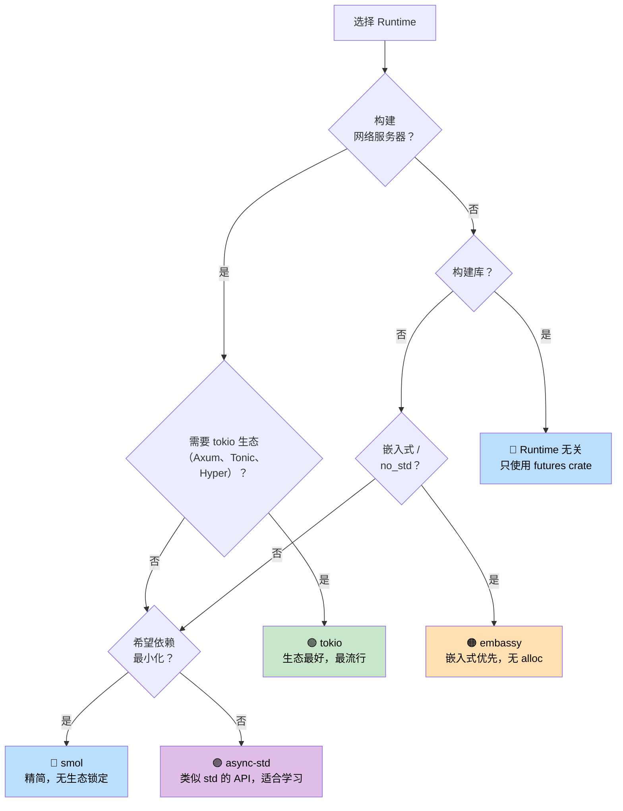

# 7. 执行器和 Runtime 🟡

> **您将学到什么：**
> - 执行器的作用：轮询+高效睡眠
> - 六大Runtime：mio、io_uring、tokio、async-std、smol、embassy
> - 用于选择正确Runtime 之间的决策树
> - 为什么与 Runtime 无关的库设计很重要

## Executor 的作用是什么

执行器有两项工作：
1. **PollFuture**当他们准备好取得进展时
2. **当没有任何 future 准备就绪时，高效睡眠**（使用操作系统 I/O 通知 API）



### mio：基础层

[澪](https://github.com/tokio-rs/mio)（Metal I/O）不是执行器——它是最低级别的跨平台 I/O 通知库。它包装了 `epoll` (Linux)、`kqueue` (macOS/BSD) 和 IOCP (Windows)。

```rust
// 小白提示：这段代码演示【mio：基础层】。先看类型/函数签名，再看 .await、poll、spawn 等关键调用怎样推动异步任务。
// mio 概念用法（简化）：
use mio::{Events, Interest, Poll, Token};
use mio::net::TcpListener;

let mut poll = Poll::new()?;
let mut events = Events::with_capacity(128);

let mut server = TcpListener::bind("0.0.0.0:8080")?;
poll.registry().register(&mut server, Token(0), Interest::READABLE)?;

// 事件循环——阻塞直到有事情发生
loop {
    poll.poll(&mut events, None)?; // 休眠直到I/O事件
    for event in events.iter() {
        match event.token() {
            Token(0) => { /* 服务器有一个新连接 */ }
            _ => { /* 其他I/O准备好 */ }
        }
    }
}
```

大多数开发人员从不直接接触 mio —— tokio 和 smol 构建在它之上。

### io_uring：基于完成的Future

Linux 的 `io_uring`（内核 5.1+）代表了 mio/epoll 使用的基于就绪的 I/O 模型的根本转变：

```text
Readiness-based (epoll / mio / tokio):
  1. Ask: "Is this socket readable?"     → epoll_wait()
  2. Kernel: "Yes, it's ready"           → EPOLLIN event
  3. App:   read(fd, buf)                → might still block briefly!

Completion-based (io_uring):
  1. Submit: "Read from this socket into this buffer"  → SQE
  2. Kernel: does the read asynchronously
  3. App:   gets completed result with data            → CQE
```



**所有权挑战**：io_uring要求内核拥有缓冲区，直到操作完成。这与借用缓冲区的Rust标准`AsyncRead`trait冲突。这就是为什么 `tokio-uring` 具有不同的 I/O trait：

```rust
// 小白提示：这段代码演示【io_uring：基于完成的Future】。先看类型/函数签名，再看 .await、poll、spawn 等关键调用怎样推动异步任务。
// 标准 tokio（基于就绪）会借用缓冲区：
let n = stream.read(&mut buf).await?;  // buf 被借用

// tokio-uring（基于完成）— 取得缓冲区的所有权：
let (result, buf) = stream.read(buf).await;  // buf 被移入，随后返回
let n = result?;
```

```rust
// 小白提示：这段代码演示【io_uring：基于完成的Future】。先看类型/函数签名，再看 .await、poll、spawn 等关键调用怎样推动异步任务。
// Cargo.toml: tokio-uring = "0.5"
// 注意：仅支持 Linux，且需要内核 5.1+

fn main() {
    tokio_uring::start(async {
        let file = tokio_uring::fs::File::open("data.bin").await.unwrap();
        let buf = vec![0u8; 4096];
        let (result, buf) = file.read_at(buf, 0).await;
        let bytes_read = result.unwrap();
        println!("Read {} bytes: {:?}", bytes_read, &buf[..bytes_read]);
    });
}
```

| 方面 | epoll (tokio) | io_uring (tokio-uring) |
|--------|--------------|----------------------|
| **模型** | 准备就绪通知 | 完成通知 |
| **系统调用** | epoll_wait + 读/写 | 批量SQE/CQE环 |
| **缓冲区所有权** | 应用程序保留 (&mut buf) | 所有权转移（移动buf） |
| **平台** | Linux、macOS (kqueue)、Windows (IOCP) | 仅限 Linux 5.1+ |
| **零拷贝** | 否（用户空间副本） | 是（注册缓冲区） |
| **到期** | 生产就绪 | 实验性的 |

> **何时使用 io_uring**：高吞吐量文件 I/O 或网络，其中系统调用开销是瓶颈（数据库、存储引擎、服务于 100k 以上连接的代理）。对于大多数应用，标准 tokio 和 epoll 是正确的选择。

### tokio：包含电池 Runtime

Rust 生态系统中占主导地位的异步Runtime。由 Axum、Hyper、Tonic 和大多数生产 Rust 服务器使用。

```rust
// 小白提示：这段代码演示【tokio：包含电池 Runtime】。先看类型/函数签名，再看 .await、poll、spawn 等关键调用怎样推动异步任务。
// Cargo.toml：
// [依赖项]
// tokio = { version = "1", features = ["full"] }

#[tokio::main]
async fn main() {
    // 使用工作窃取调度程序生成多线程Runtime
    let handle = tokio::spawn(async {
        tokio::time::sleep(std::time::Duration::from_secs(1)).await;
        "done"
    });

    let result = handle.await.unwrap();
    println!("{result}");
}
```

**tokio 功能**：定时器、I/O、TCP/UDP、Unix 套接字、信号处理、同步原语（Mutex、RwLock、Semaphore、通道）、fs、进程、跟踪集成。

### async-std：标准库镜像

使用异步版本镜像 `std` API。不如tokio受欢迎，但对于初学者来说更简单。

```rust
// 小白提示：这段代码演示【async-std：标准库镜像】。先看类型/函数签名，再看 .await、poll、spawn 等关键调用怎样推动异步任务。
// Cargo.toml：
// [依赖项]
// async-std = { version = "1", features = ["attributes"] }

#[async_std::main]
async fn main() {
    use async_std::fs;
    let content = fs::read_to_string("hello.txt").await.unwrap();
    println!("{content}");
}
```

### smol：极简主义Runtime

小型、零依赖异步Runtime。非常适合需要异步而不引入 tokio 的库。

```rust
// 小白提示：这段代码演示【smol：极简主义Runtime】。先看类型/函数签名，再看 .await、poll、spawn 等关键调用怎样推动异步任务。
// Cargo.toml：
// [依赖项]
// smol = "2"

fn main() {
    smol::block_on(async {
        let result = smol::unblock(|| {
            // 在线程池上运行阻塞代码
            std::fs::read_to_string("hello.txt")
        }).await.unwrap();
        println!("{result}");
    });
}
```

### embassy：嵌入式异步 (no_std)

嵌入式系统的异步Runtime。没有堆分配，不需要`std`。

```rust
// 小白提示：这段代码演示【embassy：嵌入式异步 (no_std)】。先看类型/函数签名，再看 .await、poll、spawn 等关键调用怎样推动异步任务。
// 在微控制器（例如 STM32、nRF52、RP2040）上运行
#[embassy_executor::main]
async fn main(spawner: embassy_executor::Spawner) {
    // 使用 async/await 闪烁 LED — 不使用 不需要 RTOS！
    let mut led = Output::new(p.PA5, Level::Low, Speed::Low);
    loop {
        led.set_high();
        Timer::after(Duration::from_millis(500)).await;
        led.set_low();
        Timer::after(Duration::from_millis(500)).await;
    }
}
```

### Runtime 决策树



### Runtime 对照表

| trait | tokio | async-std | smol | embassy |
|---------|-------|-----------|------|---------|
| **生态系统** | 主导的 | 小的 | 最小 | 嵌入式 |
| **多线程** | ✅ 偷工减料 | ✅ | ✅ | ❌（单核） |
| **no_std** | ❌ | ❌ | ❌ | ✅ |
| **定时器** | ✅ 内置 | ✅ 内置 | 通过`async-io` | ✅ 基于 HAL |
| **输入/输出** | ✅ 自己的抽象 | ✅ 标准镜子 | ✅ 通过`async-io` | ✅ HAL 驱动程序 |
| **频道** | ✅ 丰富的套装 | ✅ | 通过`async-channel` | ✅ |
| **学习曲线** | 中等的 | 低的 | 低的 | 高（硬件） |
| **二进制大小** | 大的 | 中等的 | 小的 | 微小的 |

<details>
<summary><strong>🏋️ 练习：Runtime 比较</strong>（点击展开）</summary>

**挑战**：使用三个不同的Runtime（tokio、smol和async-std）编写相同的程序。该计划应该：
1. 获取 URL（使用 sleep 进行模拟）
2. 读取文件（用睡眠模拟）
3. 打印两个结果

此练习演示了 async/await 代码是相同的 - 只是Runtime设置不同。

<details>
<summary>🔑 参考答案</summary>

```rust
// 小白提示：这段代码演示【Runtime 对照表】。先看类型/函数签名，再看 .await、poll、spawn 等关键调用怎样推动异步任务。
// ----- tokio版本-----
// Cargo.toml: tokio = { version = "1", features = ["full"] }
#[tokio::main]
async fn main() {
    let (url_result, file_result) = tokio::join!(
        async {
            tokio::time::sleep(std::time::Duration::from_millis(100)).await;
            "Response from URL"
        },
        async {
            tokio::time::sleep(std::time::Duration::from_millis(50)).await;
            "Contents of file"
        },
    );
    println!("URL: {url_result}, File: {file_result}");
}

// ----- smol版本-----
// Cargo.toml: smol = "2", futures-lite = "2"
fn main() {
    smol::block_on(async {
        let (url_result, file_result) = futures_lite::future::zip(
            async {
                smol::Timer::after(std::time::Duration::from_millis(100)).await;
                "Response from URL"
            },
            async {
                smol::Timer::after(std::time::Duration::from_millis(50)).await;
                "Contents of file"
            },
        ).await;
        println!("URL: {url_result}, File: {file_result}");
    });
}

// ----- async-std 版本 -----
// Cargo.toml: async-std = { version = "1", features = ["attributes"] }
#[async_std::main]
async fn main() {
    let (url_result, file_result) = futures::future::join(
        async {
            async_std::task::sleep(std::time::Duration::from_millis(100)).await;
            "Response from URL"
        },
        async {
            async_std::task::sleep(std::time::Duration::from_millis(50)).await;
            "Contents of file"
        },
    ).await;
    println!("URL: {url_result}, File: {file_result}");
}
```

**关键要点**：异步业务逻辑在Runtime之间是相同的。仅入口点和计时器/IO API 不同。这就是为什么编写与 Runtime 无关的库（仅使用`std::future::Future`）是有价值的。

</details>
</details>

> **关键要点——执行器和 Runtime**
> - 执行器的工作：唤醒时轮询 future，使用操作系统 I/O API 高效睡眠
> - **tokio** 是服务器的默认值； **smol** 最小化占地面积； **embassy** 用于嵌入式
> - 你的业务逻辑应该依赖于`std::future::Future`，而不是特定的Runtime
> - io_uring (Linux 5.1+) 是高性能 I/O 的Future，但生态系统仍处于成熟阶段

> **另请参阅：** [第 8 章 — Tokio 深入探讨](ch08-tokio-deep-dive.md) 了解 tokio 详细信息，[第 9 章 — 当 Tokio 不合适时](ch09-when-tokio-isnt-the-right-fit.md) 了解替代方案

***


