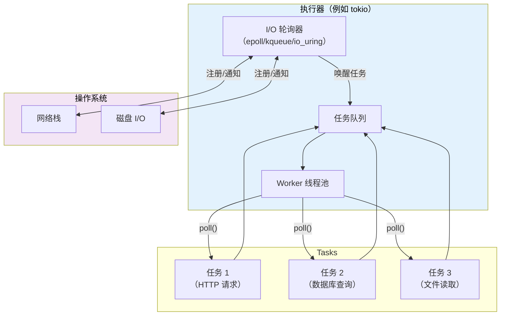
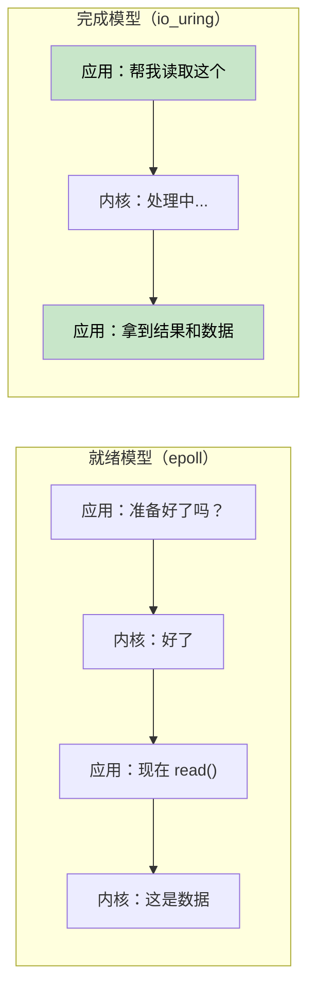

# 7. 执行器（executor）和运行时（runtime）

> **你将学到什么：**
> - 执行器的作用：轮询 + 高效休眠
> - 六大运行时体系：mio、io_uring、tokio、async-std、smol、embassy
> - 如何根据场景选择合适的运行时（决策树）
> - 为什么与运行时无关的库设计很重要

## 执行器是做什么的

执行器有两项核心职责：
1. **当 Future 可以推进时，轮询（poll）它们**
2. **当没有任何 Future 就绪时，高效休眠**（利用操作系统的 I/O 通知 API）



### mio：基础设施层

[mio](https://github.com/tokio-rs/mio)（Metal I/O）本身不是执行器——它是底层跨平台的 I/O 事件通知库。它封装了 Linux 的 `epoll`、macOS/BSD 的 `kqueue` 以及 Windows 的 IOCP。

```rust
// ===========================================================================
// 核心概念：mio 是最低层的 I/O 多路复用抽象。大多数开发者不会直接使用它——
// tokio 和 smol 构建在其之上。理解 mio 有助于理解执行器的底层运作机制。
//
// mio 的核心 API：
// - Poll::new() —— 创建 epoll/kqueue/IOCP 实例
// - poll.registry().register() —— 向内核注册感兴趣的文件描述符和事件类型
// - poll.poll() —— 阻塞等待事件发生（或有超时）
//
// ⚠️ 注意：mio 仅提供事件通知，不涉及 Future/Waker/任务调度——
// 这些由上层框架（tokio/smol）实现。
// ===========================================================================

// mio 概念用法（简化）：
use mio::{Events, Interest, Poll, Token};
use mio::net::TcpListener;

// → 创建 Poll 实例（底层封装 epoll fd / kqueue fd / IOCP 句柄）
let mut poll = Poll::new()?;

// → Events 缓冲区：接收内核返回的就绪事件列表
let mut events = Events::with_capacity(128);
//                               ^^^ 预分配 128 个事件槽位

// → 创建 TCP 监听器，绑定端口
let mut server = TcpListener::bind("0.0.0.0:8080")?;

// → 向 Poll 注册监听 socket，声明关注 READABLE 事件
// Token(0) 是用户自定义的标识符，用于在事件回调中区分不同的注册源
poll.registry().register(&mut server, Token(0), Interest::READABLE)?;

// → 事件循环——这是任何基于 mio 的程序的核心
loop {
    poll.poll(&mut events, None)?; // → 阻塞等待 I/O 事件（None = 无超时，永久等待）
    //                    ^^^^ events 被填充为就绪事件列表

    for event in events.iter() {
        // → 遍历所有就绪事件
        match event.token() {
            Token(0) => { /* → 服务器有新连接到达 */ }
            _ => { /* → 其他已注册的 I/O 源就绪 */ }
        }
    }
}
```

大多数开发者从不直接接触 mio——tokio 和 smol 构建在它之上。

### io_uring：基于完成的 Future

Linux 的 `io_uring`（内核 5.1+）代表了与 mio/epoll 使用的"基于就绪"模型截然不同的 I/O 范式：

```text
基于就绪（epoll / mio / tokio）:
  第 1 步：询问 "这个 socket 可读了吗？"         → epoll_wait()
  第 2 步：内核回答 "是的，就绪了"               → EPOLLIN 事件
  第 3 步：应用调用 read(fd, buf)                → 可能仍有短暂阻塞！

基于完成（io_uring）:
  第 1 步：提交 "从该 socket 读到这个缓冲区"     → SQE（提交队列条目）
  第 2 步：内核异步执行读取
  第 3 步：应用收到已完成的结果和数据             → CQE（完成队列条目）
```



**所有权挑战**：io_uring 要求内核拥有缓冲区直到操作完成。这与 Rust 标准 `AsyncRead` trait（借用缓冲区）冲突。这就是为什么 `tokio-uring` 具有不同的 I/O trait：

```rust
// ===========================================================================
// 核心概念：基于就绪 vs 基于完成的 I/O 模型在 API 层面的差异。
//
// 基于就绪（tokio + epoll）：
// - 缓冲区被借用（&mut buf）——内核不拥有缓冲区
// - 从操作系统到用户空间有一次内存拷贝
// - 与标准 AsyncRead trait 兼容
//
// 基于完成（tokio-uring）：
// - 缓冲区所有权转移给内核（move buf）——操作完成后归还
// - 可以做到零拷贝（通过注册的固定缓冲区）
// - 需要不同的 trait（不兼容标准 AsyncRead）
// ===========================================================================

// 标准 tokio（基于就绪）→ 借用缓冲区：
let n = stream.read(&mut buf).await?;  // → buf 被借用，内核不拥有它

// tokio-uring（基于完成）→ 取得缓冲区所有权：
let (result, buf) = stream.read(buf).await;  // → buf 被 move 进内核，随后归还
//   ^^^^^^  ^^^ 结果和缓冲区一并返回
let n = result?;
```

```rust
// ===========================================================================
// tokio-uring 用法示例。
//
// 关键 API：
// - tokio_uring::start() —— 启动 io_uring 运行时
// - File::read_at(buf, offset) —— 基于完成的文件读取，buf 所有权转移
//
// ⚠️ 平台限制：仅 Linux 5.1+，当前处于实验阶段。
// 适用于：高吞吐量文件 I/O、存储引擎、数据库等场景。
// ===========================================================================

// Cargo.toml: tokio-uring = "0.5"
// ⚠️ 仅支持 Linux，需要内核 5.1+

fn main() {
    tokio_uring::start(async {
        // → 运行时入口：与 #[tokio::main] 类似但使用 io_uring 调度
        let file = tokio_uring::fs::File::open("data.bin").await.unwrap();
        // → 打开文件（基于完成）

        let buf = vec![0u8; 4096];
        // → 分配 4KB 缓冲区

        let (result, buf) = file.read_at(buf, 0).await;
        //   ^^^^^^  ^^^ buf 的所有权经历：创建 → 移入内核 → 操作完成 → 归还
        //   read_at(buf, 0) 将 buf 转移给内核，操作完成后返回

        let bytes_read = result.unwrap();
        println!("读取了 {} 字节: {:?}", bytes_read, &buf[..bytes_read]);
        // → buf 又可以使用了
    });
}
```

| 方面 | epoll (tokio) | io_uring (tokio-uring) |
|--------|--------------|----------------------|
| **模型** | 就绪通知 | 完成通知 |
| **系统调用** | epoll_wait + read/write | 批量提交 SQE / 收割 CQE 环形缓冲区 |
| **缓冲区所有权** | 应用保留 (&mut buf) | 所有权转移（move buf） |
| **平台支持** | Linux、macOS (kqueue)、Windows (IOCP) | 仅 Linux 5.1+ |
| **零拷贝** | 否（用户空间拷贝） | 是（注册的固定缓冲区） |
| **成熟度** | 生产级 | 实验阶段 |

> **何时使用 io_uring**：高吞吐量文件 I/O 或网络场景，其中系统调用开销成为瓶颈（数据库、存储引擎、服务超过 10 万连接的代理）。对于大多数应用，标准 tokio 和 epoll 是正确的选择。

### tokio：一站式运行时

Rust 生态中占主导地位的异步（async）运行时。被 Axum、Hyper、Tonic 和大多数生产级 Rust 服务器使用。

```rust
// ===========================================================================
// tokio 核心特性：
// - 工作窃取（work-stealing）多线程调度器
// - 丰富的 I/O 工具集：TCP/UDP/Unix socket/文件/信号/进程
// - 同步原语：Mutex/RwLock/Semaphore/通道/屏障
// - 计时器：sleep/interval/timeout
// - 跟踪（tracing）集成
//
// #[tokio::main] 宏展开：
// 1. 创建多线程运行时
// 2. 将 async main 包装为任务
// 3. 调用 block_on 直到任务完成
// ===========================================================================

// Cargo.toml：
// [dependencies]
// tokio = { version = "1", features = ["full"] }

#[tokio::main]  // → 属性宏：启动多线程运行时，默认线程数 = CPU 核心数
async fn main() {
    // tokio::spawn → 将 Future 提交到工作窃取线程池
    // 返回 JoinHandle<T>——它本身是一个 Future，.await 可获取计算结果
    let handle = tokio::spawn(async {
        // → 这个 async 块在独立的 worker 线程上运行（可能）
        tokio::time::sleep(std::time::Duration::from_secs(1)).await;
        // → 使用 tokio 的协作式计时器（非 OS 线程 sleep）
        "done"
    });

    let result = handle.await.unwrap();
    // → JoinHandle::await 等待 spawned 任务完成
    println!("{result}");
}
```

**tokio 能力清单**：计时器、I/O、TCP/UDP、Unix 套接字、信号处理、同步原语（Mutex、RwLock、Semaphore、通道）、文件系统、进程管理、tracing 集成。

### async-std：标准库镜像

用异步版本镜像 `std` API。不如 tokio 流行，但对初学者更友好。

```rust
// ===========================================================================
// async-std 的设计理念：
// 尽可能向 std 标准库 API 靠拢，降低学习成本。
// 例如 std::fs::read_to_string 的异步版本就是 async_std::fs::read_to_string。
//
// 适用场景：学习 async Rust 概念，或小型项目不想引入 tokio 庞大依赖。
// ===========================================================================

// Cargo.toml：
// [dependencies]
// async-std = { version = "1", features = ["attributes"] }

#[async_std::main]  // → 属性宏：启动 async-std 运行时
async fn main() {
    use async_std::fs;
    // → 异步文件读取，API 与 std::fs::read_to_string 几乎一致
    let content = fs::read_to_string("hello.txt").await.unwrap();
    println!("{content}");
}
```

### smol：极简运行时

小型、低依赖的异步运行时。非常适合希望在库中引入异步功能但不强依赖 tokio 的场景。

```rust
// ===========================================================================
// smol 的设计理念：
// - 最小化依赖树，编译快
// - 不绑定特定生态系统
// - smol::block_on() 启动临时运行时（适合测试或一次性异步操作）
// - smol::unblock() 将阻塞代码委派给线程池，避免阻塞异步线程
// ===========================================================================

// Cargo.toml：
// [dependencies]
// smol = "2"

fn main() {
    smol::block_on(async {
        // → block_on 创建一个临时运行时，运行单个 Future 直到完成
        let result = smol::unblock(|| {
            // → unblock 将闭包发送到线程池执行
            // 用法：包装同步阻塞代码（如标准库文件 I/O），
            // 使其不会阻塞异步事件循环
            std::fs::read_to_string("hello.txt")
        }).await.unwrap();
        //  ^^^^^ .await 等待线程池返回结果
        println!("{result}");
    });
}
```

### embassy：嵌入式异步 (no_std)

面向嵌入式系统的异步运行时。无堆分配，无需 `std`。

```rust
// ===========================================================================
// embassy 的独特之处：
// - no_std 环境运行（没有操作系统）
// - 无堆分配（不需要 alloc crate）
// - 直接在裸金属硬件上运行——没有 OS 线程，没有内核
// - 用 async/await 替代传统 RTOS 的任务管理
//
// 工作原理：通过中断驱动硬件外设，中断触发 Waker 唤醒相应的 Future。
// 例如：Timer::after() 设置硬件计时器 → 中断触发 → Waker 唤醒 → Future 继续执行。
// ===========================================================================

// → 在微控制器上运行（例如 STM32、nRF52、RP2040）
#[embassy_executor::main]  // → shuttle 宏：初始化 embassy 执行器
async fn main(spawner: embassy_executor::Spawner) {
    // → 使用 async/await 闪烁 LED——不需要 RTOS！
    let mut led = Output::new(p.PA5, Level::Low, Speed::Low);
    //    ^^^^^^^ 硬件外设抽象（GPIO 输出引脚）

    loop {
        led.set_high();
        // → 硬件操作：设置 GPIO 高电平
        Timer::after(Duration::from_millis(500)).await;
        // → 异步等待：设置硬件计时器，期满后中断唤醒
        // 在此期间执行器可以去轮询其他任务
        led.set_low();
        Timer::after(Duration::from_millis(500)).await;
        // → 再次等待 500ms
    }
}
```

### 运行时决策树


### 运行时对比表

| 特性 | tokio | async-std | smol | embassy |
|---------|-------|-----------|------|---------|
| **生态系统** | 主导地位 | 较小 | 极简 | 嵌入式领域 |
| **多线程** | 支持（工作窃取） | 支持 | 支持 | 不支持（单核） |
| **no_std** | 不支持 | 不支持 | 不支持 | 支持 |
| **计时器** | 内置 | 内置 | 通过 `async-io` | 基于 HAL |
| **I/O** | 自有抽象层 | 镜像 std | 通过 `async-io` | HAL 驱动 |
| **通道** | 丰富的套件 | 支持 | 通过 `async-channel` | 支持 |
| **学习曲线** | 中等 | 低 | 低 | 高（硬件知识） |
| **二进制体积** | 较大 | 中等 | 小 | 极小 |

<details>
<summary><strong>练习：运行时对比</strong>（点击展开）</summary>

**挑战**：用三种不同的运行时（tokio、smol 和 async-std）分别编写功能相同的程序。程序需要：
1. 获取 URL（用 sleep 模拟）
2. 读取文件（用 sleep 模拟）
3. 打印两个结果

此练习旨在说明：async/await 的核心业务逻辑是相同的——只有运行时入口和 API 不同。

<details>
<summary>参考答案</summary>

```rust
// ===========================================================================
// 核心演示：同一段异步业务逻辑在三种运行时下的实现。
// 注意：异步代码的主体（async 块内部的逻辑）完全一致，
// 只有入口点（#[tokio::main] vs smol::block_on vs #[async_std::main]）
// 和计时器 API（tokio::time::sleep vs smol::Timer vs async_std::task::sleep）
// 不同。
//
// 关键洞察：这就是"与运行时无关的库设计"的价值所在——
// 如果库只依赖 std::future::Future 和 futures crate，
// 它可以在任何运行时中使用。
// ===========================================================================

// ----- tokio 版本 -----
// Cargo.toml: tokio = { version = "1", features = ["full"] }
#[tokio::main]  // → tokio 运行时入口
async fn main() {
    let (url_result, file_result) = tokio::join!(  // → tokio 的并发 join 宏
        async {
            tokio::time::sleep(std::time::Duration::from_millis(100)).await;
            // ^^^^^^^^^^^^^^^^^^^^ tokio 计时器
            "Response from URL"
        },
        async {
            tokio::time::sleep(std::time::Duration::from_millis(50)).await;
            "Contents of file"
        },
    );
    println!("URL: {url_result}, File: {file_result}");
}

// ----- smol 版本 -----
// Cargo.toml: smol = "2", futures-lite = "2"
fn main() {
    smol::block_on(async {  // → smol 运行时入口（同步函数中启动异步）
        let (url_result, file_result) = futures_lite::future::zip(  // → smol 生态的 zip（类似 join）
            async {
                smol::Timer::after(std::time::Duration::from_millis(100)).await;
                // ^^^^^^^^^^^^^^^ smol 计时器（通过 async-io）
                "Response from URL"
            },
            async {
                smol::Timer::after(std::time::Duration::from_millis(50)).await;
                "Contents of file"
            },
        ).await;
        println!("URL: {url_result}, File: {file_result}");
    });
}

// ----- async-std 版本 -----
// Cargo.toml: async-std = { version = "1", features = ["attributes"] }
#[async_std::main]  // → async-std 运行时入口
async fn main() {
    let (url_result, file_result) = futures::future::join(  // → futures crate 的 join
        async {
            async_std::task::sleep(std::time::Duration::from_millis(100)).await;
            // ^^^^^^^^^^^^^^^^^^ async-std 计时器
            "Response from URL"
        },
        async {
            async_std::task::sleep(std::time::Duration::from_millis(50)).await;
            "Contents of file"
        },
    ).await;
    println!("URL: {url_result}, File: {file_result}");
}
```

**核心洞察**：异步业务逻辑在三种运行时之间完全相同。唯一变化的是入口点函数和计时器/I/O API 调用。这正是"编写与运行时无关的库"（仅依赖 `std::future::Future`）如此有价值的原因。

</details>
</details>

> **关键要点 -- 执行器和运行时**
> - 执行器的职责：在 Future 可推进时轮询它们，使用操作系统 I/O API 实现高效休眠
> - **tokio** 是服务器端首选；**smol** 最小化依赖体积；**embassy** 面向嵌入式
> - 你的业务逻辑应该依赖 `std::future::Future`，而不是特定的运行时
> - io_uring (Linux 5.1+) 是高性能 I/O 的未来方向，但其生态系统仍在成熟中

> **另请参阅：** [第 8 章 -- Tokio 深入探讨](ch08-tokio-deep-dive.md) 了解 tokio 内部细节，[第 9 章 -- 当 Tokio 不合适时](ch09-when-tokio-isnt-the-right-fit.md) 了解替代方案

***
