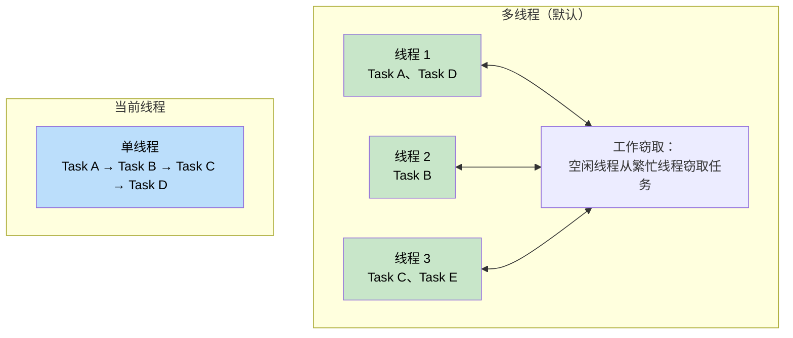
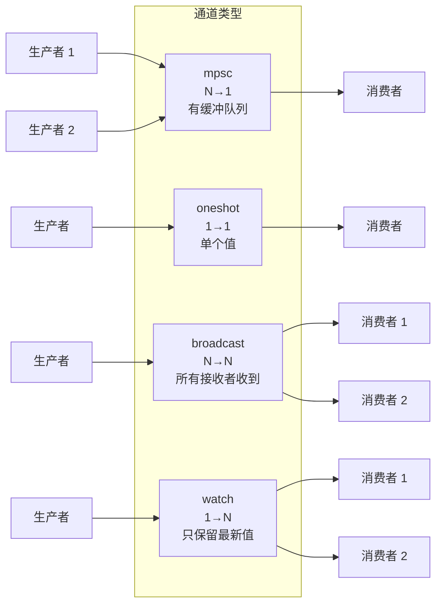
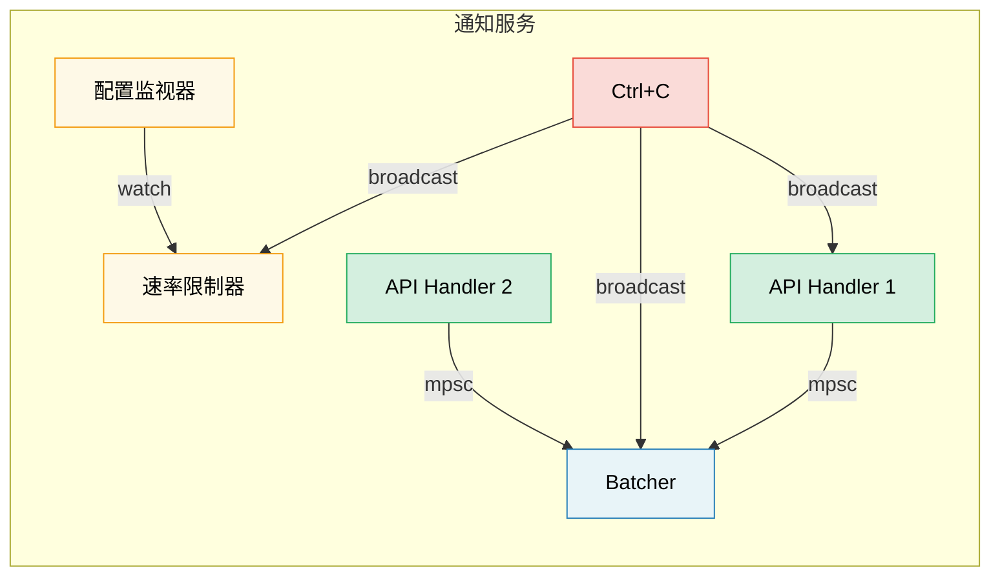

# 8. Tokio 深入探究

> **你将学到什么：**
> - 运行时风格：多线程 vs 当前线程，以及各自适用场景
> - `tokio::spawn`、`'static` 要求与 `JoinHandle`
> - 任务取消语义（cancel-on-drop 的真相）
> - 同步原语：Mutex、RwLock、Semaphore 以及四种通道类型

## 运行时（runtime）风格：多线程 vs 当前线程

Tokio 提供两种运行时配置：

```rust
// ============================================================
// 核心概念：Tokio 运行时风格选择
// ============================================================
// Tokio 支持两种运行时模式，通过 #[tokio::main] 属性配置。
// 关键 API：flavor = "current_thread" 切换单线程模式。
// 设计理由：多线程适合高并发服务端；单线程适合 CLI 工具、
// 测试、或需要 !Send 类型的场景（如 WASM 中的 Rc/RefCell）。
// ============================================================

// --- 多线程运行时（默认）---
// 使用工作窃取线程池，任务可在不同线程之间迁移。
// N 个工作线程 = 默认 CPU 核心数。
// 所有 spawn 的任务必须满足 Send + 'static。
#[tokio::main]
async fn main() {
    // → 任务被调度到线程池中的任意工作线程上执行
}

// --- 当前线程运行时 ---
// 所有任务仅在单一线程上运行，无跨线程迁移。
// 任务不需要 Send，开销更低，适合简单工具或 WASM 环境。
#[tokio::main(flavor = "current_thread")]
async fn main() {
    // → 所有 .await 点仍在同一线程上恢复
}

// --- 手动构建运行时 ---
// 通过 Builder 模式精细控制：线程数、是否启用 I/O/定时器等。
let rt = tokio::runtime::Builder::new_multi_thread()
    .worker_threads(4)       // 显式指定 4 个工作线程
    .enable_all()            // 启用 I/O + 定时器驱动
    .build()
    .unwrap();

// block_on：将当前线程阻塞在异步（async）任务上，直到完成。
// 这是"进入异步世界"的入口——同步代码通过它桥接异步运行时。
rt.block_on(async {
    println!("Running on custom runtime");
});
```



### tokio::spawn 与 'static 要求

`tokio::spawn` 将 future 提交到运行时的任务队列中。由于 spawn 的任务可能在任何时间点被调度到任意工作线程上执行，其生命周期完全独立于 spawn 调用所在的函数调用栈，因此编译器要求 Future 满足 `Send + 'static`：

```rust
// ============================================================
// 核心概念：tokio::spawn 的所有权模型
// ============================================================
// spawn 将 future 的所有权移交给运行时，此后运行时全权负责
// 该 future 的调度与生命周期管理。
// 关键 API：tokio::task::spawn(future) → JoinHandle<T>
// 设计理由：任务可能比 spawn 调用者活得更久（'static 要求），
// 且可能在不同于挂起点的线程上恢复（Send 要求）。
// ============================================================

use tokio::task;

async fn example() {
    let data = String::from("hello");

    // ✅ 正确：使用 async move 将 data 的所有权移入任务
    // → data 由 spawn 的任务独占，满足 'static（无外部借用依赖）
    let handle: JoinHandle<usize> = task::spawn(async move {
        println!("{data}");          // data 已被移入，可直接使用
        data.len()                   // → 返回 usize
    });

    // → JoinHandle 是 Future，await 等待任务完成并获取返回值
    let len = handle.await.unwrap(); // 返回 Ok(usize)
    println!("Length: {len}");
}

async fn problem_illustration() {
    let data = String::from("hello");

    // ❌ 错误：没有 move，闭包借用 &data
    // task::spawn(async {
    //     println!("{data}");
    //     //        ^^^^ 借用了 data，不满足 'static
    //     //             ——编译器无法证明 data 比任务活得更久
    // });

    // ❌ 错误：Rc<i32> 不是 Send
    // let rc = std::rc::Rc::new(42);
    // task::spawn(async move {
    //     println!("{rc}");
    //     //        ^^ Rc 的引用计数非原子操作，
    //     //           不能被安全地跨线程共享
    // });
}

// --- 常见模式：Arc 共享、任务独立拥有副本 ---
// ⚠️ 注意：Arc::clone 只增加引用计数，不会深拷贝底层数据。
// 每个 spawn 的任务获取独立的 Arc 句柄，共享同一份数据。
let shared = Arc::new(config);        // 共享的配置数据

for i in 0..10 {
    let shared = Arc::clone(&shared); // 克隆 Arc 句柄（只增加引用计数）
    tokio::spawn(async move {
        // → 每个任务持有自己的 Arc 句柄，共享同一数据
        process_item(i, &shared).await;
    });
}
```

**为什么需要 `'static`？** spawn 的任务独立于调用栈运行——它可能比创建它的作用域活得更久。编译器无法静态证明任何借用的引用（reference）在任务执行期间始终有效，因此任务必须拥有其用到的所有数据（owned data）。

**为什么需要 `Send`？** 在多线程运行时下，任务可能在不同于它上一次挂起的线程上被唤醒。所有在 `.await` 点之间存活的值都必须能安全地在线程之间传递。

### JoinHandle 与任务取消

```rust
// ============================================================
// 核心概念：JoinHandle 的生命周期控制
// ============================================================
// JoinHandle 是 spawn 的返回值，代表一个后台任务的"遥控器"。
// 关键 API：
//   .await → 等待任务完成，获取 Result<T, JoinError>
//   .abort() → 主动取消任务
// ⚠️ 注意：drop(handle) 不会取消任务！任务会变为"分离"状态继续运行。
// 这与直接 drop 一个 Future 不同——drop Future 确实会取消底层计算。
// 设计理由：Tokio 设计为任务独立于句柄生存，避免意外的级联取消。
// ============================================================

use tokio::task::JoinHandle;
use tokio::time::{sleep, Duration};

async fn cancellation_example() {
    let handle: JoinHandle<String> = tokio::spawn(async {
        sleep(Duration::from_secs(10)).await; // 模拟耗时工作
        "completed".to_string()               // → 任务返回值
    });

    // ⚠️ 注意：drop(handle) 不会取消任务！
    // drop(handle);  // 仅丢弃"遥控器"，任务继续在后台运行

    // 正确方式：显式调用 .abort() 取消任务
    handle.abort();   // → 通知运行时终止该任务

    // 等待已中止的任务会返回 JoinError
    match handle.await {
        Ok(val) => println!("Got: {val}"),
        Err(e) if e.is_cancelled() => println!("Task was cancelled"),
        //                                ↑ is_cancelled() 区分"取消"和"panic"
        Err(e) => println!("Task panicked: {e}"),
    }
}
```

> **重要**：丢弃 `JoinHandle` 不会取消 tokio 中的任务。
> 任务会变为*分离*状态，在后台继续执行。你必须显式调用
> `.abort()` 来取消它。这与直接丢弃 Future 不同，
> 丢弃 Future 确实会取消/销毁底层计算。

### Tokio 同步原语

Tokio 提供异步感知的同步原语。关键原则：**不要在 `.await` 点上持有 `std::sync::Mutex` 的锁守卫**。

```rust
// ============================================================
// 核心概念：异步同步原语 vs 标准库同步原语
// ============================================================
// std::sync::Mutex 的 lock() 会阻塞当前 OS 线程，如果在 async 上下文中
// 持锁跨越 .await 可能导致死锁或线程饥饿。
// tokio::sync::Mutex 的 lock() 返回 Future，只挂起当前任务而非 OS 线程。
//
// 四种通道类型的使用场景：
//   mpsc     → N 个生产者 → 1 个消费者，带背压（backpressure）的有界队列
//   oneshot  → 1 个生产者 → 1 个消费者，单次传递
//   broadcast → N 个生产者 → N 个消费者，每条消息广播给所有接收者
//   watch    → 1 个生产者 → N 个消费者，只保留最新值（配置广播）
// ============================================================

use tokio::sync::{Mutex, RwLock, Semaphore, mpsc, oneshot, broadcast, watch};

// --- Mutex：异步互斥锁 ---
// lock().await 是异步方法，只挂起当前任务，不阻塞 OS 线程。
let data = Arc::new(Mutex::new(vec![1, 2, 3]));
{
    let mut guard = data.lock().await; // → 获取锁，非阻塞式等待
    guard.push(4);                     // 临界区操作
} // guard 在此 drop，锁被释放——后续等待者获得锁

// --- mpsc：多生产者、单消费者 ---
// 有界通道，缓冲区满时 send().await 会挂起生产者（背压）。
let (tx, mut rx) = mpsc::channel::<String>(100); // 缓冲容量 = 100

tokio::spawn(async move {
    tx.send("hello".into()).await.unwrap();
    // → 消息进入缓冲区；若满则异步等待
});

let msg = rx.recv().await.unwrap(); // → 从缓冲区取出一条消息

// --- oneshot：单次传递 ---
// Tx 不持有 await——send 要么成功，要么因 Rx 已关闭而失败。
let (tx, rx) = oneshot::channel::<i32>();
tx.send(42).unwrap();    // 非异步发送，立即完成（或失败）
let val = rx.await.unwrap(); // → 等待接收

// --- broadcast：多生产者、多消费者（广播语义）---
// 每个消息被复制发送给所有订阅者。send 时无订阅者则消息丢弃。
let (tx, _) = broadcast::channel::<String>(100); // 容量 100
let mut rx1 = tx.subscribe(); // 订阅者 1
let mut rx2 = tx.subscribe(); // 订阅者 2
// → rx1.recv().await 和 rx2.recv().await 都会收到同一条消息

// --- watch：单生产者、多消费者（最新值语义）---
// 只保留最新写入的值。旧值被覆盖（消费者错过中间值）。
// 适合配置变更通知场景。
let (tx, rx) = watch::channel(0u64);
tx.send(42).unwrap();              // 更新到 42（旧值 0 被丢弃）
println!("Latest: {}", *rx.borrow()); // → 读取当前最新值（不需要 await）
```

> **注意：** 在这些通道示例中为简洁使用了 `.unwrap()`。
> 在生产代码中，应优雅处理发送/接收错误——`.send()` 失败意味着
> 接收端已被丢弃，`.recv()` 失败意味着通道已被关闭。



## 案例研究：为通知服务选择正确的通道

你正在构建一个通知服务，需求如下：
- 多个 API 处理器产生事件
- 单个后台任务负责批处理和发送
- 配置监视器在运行时更新速率限制
- 关闭信号必须到达所有组件

**分别用什么通道？**

| 需求 | 通道 | 为什么 |
|-------------|---------|-----|
| API 处理器 → 批处理任务 | `mpsc`（有界） | N 个生产者，1 个消费者。有界缓冲提供背压——如果批处理任务跟不上，API 处理器会变慢而不是无限堆积内存（OOM） |
| 配置监视器 → 速率限制器 | `watch` | 只有最新的配置值才重要。多个读取者（每个工作线程）看到当前值即可 |
| 关闭信号 → 所有组件 | `broadcast` | 每个组件必须独立收到关闭通知，不互相干扰 |
| 单次健康检查响应 | `oneshot` | 典型的请求/响应模式——一个值，一次传递 |



<details>
<summary><strong>练习：构建任务池</strong>（点击展开）</summary>

**挑战**：构建一个函数 `run_with_limit`，接受异步闭包列表和并发限制，最多同时执行 N 个任务。使用 `tokio::sync::Semaphore`。

<details>
<summary>参考答案</summary>

```rust
// ============================================================
// 核心概念：Semaphore 实现并发限制
// ============================================================
// Semaphore 是一种计数信号量，acquire() 消耗一个许可，drop 释放许可。
// 当许可耗尽时，后续 acquire() 会异步等待（不阻塞线程）。
// 这是 Tokio 中限制并发的标准方式，比手动管理 JoinSet 更灵活。
// 设计理由：相比于 channel 方式（需要显式的 worker 循环），
// Semaphore 更轻量——每个任务获取许可、执行、释放即可。
// ============================================================

use std::future::Future;
use std::sync::Arc;
use tokio::sync::Semaphore;

// 泛型约束说明：
//   F: FnOnce() -> Fut  → 接受一个返回 Future 的闭包（工厂模式）
//   Fut: Future<Output = T> + Send → 返回的 Future 可跨线程
//   T: Send → 结果类型可跨线程
async fn run_with_limit<F, Fut, T>(tasks: Vec<F>, limit: usize) -> Vec<T>
where
    F: FnOnce() -> Fut + Send + 'static,
    Fut: Future<Output = T> + Send + 'static,
    T: Send + 'static,
{
    let semaphore = Arc::new(Semaphore::new(limit)); // 最多 limit 个并发许可
    let mut handles = Vec::new();

    for task in tasks {
        let permit = Arc::clone(&semaphore); // 每个任务持有 Semaphore 的 Arc 句柄
        let handle = tokio::spawn(async move {
            let _permit = permit.acquire().await.unwrap();
            //           ↑ acquire() 消耗一个许可；若已满则异步等待
            // _permit 是 PermitGuard，在此作用域内持有许可
            task().await
            // → 任务执行完毕，_permit drop，许可自动归还
        });
        handles.push(handle);
    }

    let mut results = Vec::new();
    for handle in handles {
        results.push(handle.await.unwrap()); // 等待所有任务完成，收集结果
    }
    results
}

// 用法示例：
// let urls = vec!["https://a.com", "https://b.com"];
// let tasks: Vec<_> = urls.into_iter().map(|url| {
//     move || async move { fetch(url).await }
//     //  ↑ 闭包将 url 移入，返回一个 Future
// }).collect();
// let results = run_with_limit(tasks, 10).await;
// //  → 最多 10 个 fetch 请求同时进行
```

**要点**：`Semaphore` 是 Tokio 中限制并发的标准方法。每个任务在开始工作前获取许可；当信号量已满时，新任务会异步等待（不阻塞线程），直到有槽位释放。

</details>
</details>

> **关键要点 -- Tokio 深入探究**
> - 对服务器使用 `multi_thread`（默认）；`current_thread` 用于 CLI 工具、测试或 `!Send` 类型
> - `tokio::spawn` 要求 `'static` Future——使用 `Arc` 或通道来共享数据
> - 丢弃 `JoinHandle` **不会**取消任务——显式调用 `.abort()`
> - 根据场景选择同步原语：`Mutex` 用于共享状态，`Semaphore` 用于并发限制，`mpsc`/`oneshot`/`broadcast`/`watch` 用于任务间通信

> **另请参阅：** [第 9 章 -- 当 Tokio 不合适时](ch09-when-tokio-isnt-the-right-fit.md) 了解 spawn 的替代方案，[第 12 章 -- 常见陷阱](ch12-common-pitfalls.md) 了解 MutexGuard 跨越 await 的错误

***

