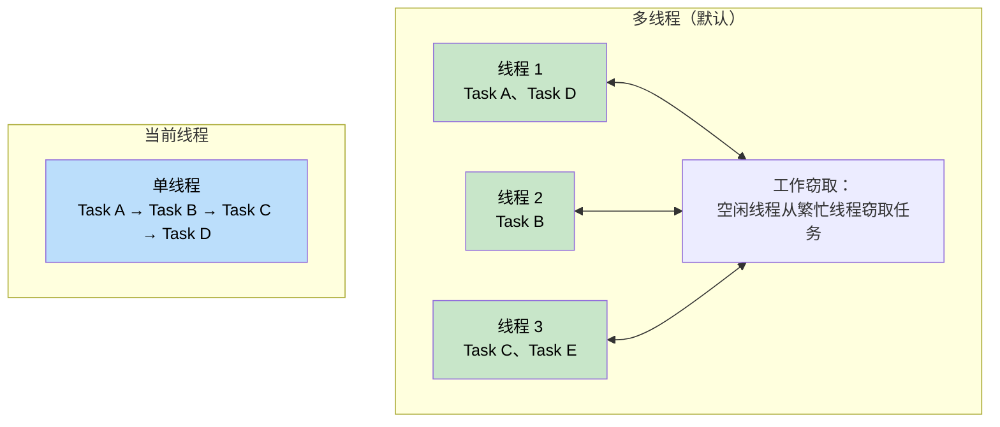
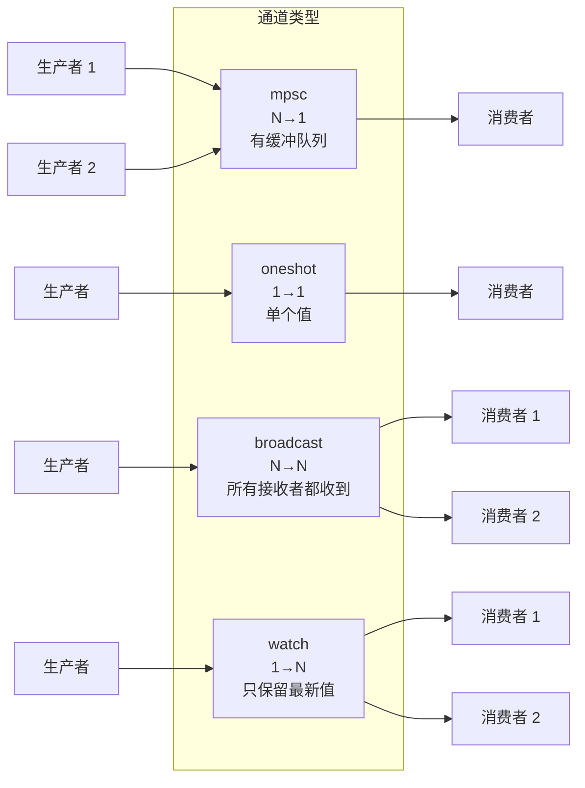
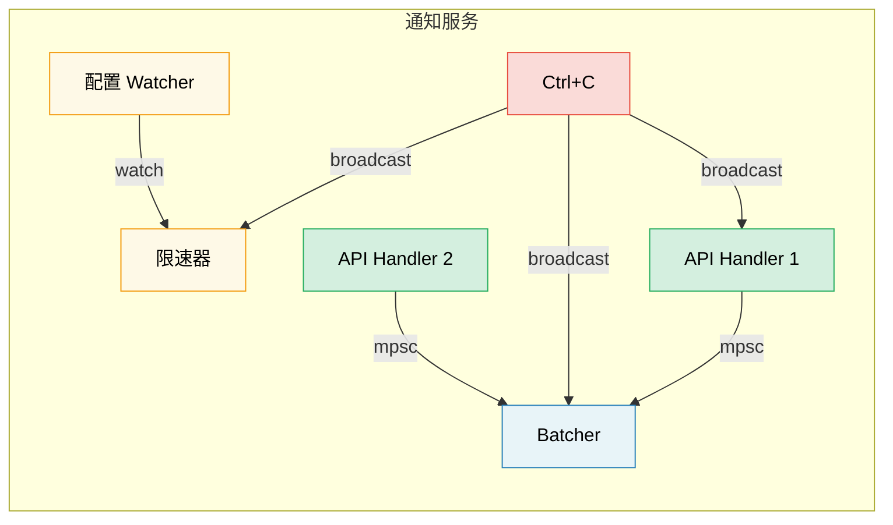

# 8. Tokio 深入探究 🟡

> **您将学到什么：**
> - Runtime 风格：多线程与当前线程以及何时使用每个线程
> - `tokio::spawn`、`'static` 要求和 `JoinHandle`
> - 任务取消语义（cancel-on-drop）
> - Sync原语：Mutex、RwLock、Semaphore以及所有四种通道类型

## Runtime 风格：多线程与当前线程

Tokio提供两种Runtime 配置：

```rust
// 小白提示：这段代码演示【Runtime 风格：多线程与当前线程】。先看类型/函数签名，再看 .await、poll、spawn 等关键调用怎样推动异步任务。
// 多线程（默认为#[tokio::main]）
// 使用工作窃取线程池——任务可以在线程之间移动
#[tokio::main]
async fn main() {
    // N 个工作线程（默认 = CPU 核心数）
    // 任务为 Send + 'static
}

// 当前线程——一切都在一个线程上运行
#[tokio::main(flavor = "current_thread")]
async fn main() {
    // 单线程——任务不需要Send
    // 重量较轻，适合简单工具或WASM
}

// 手动Runtime构建：
let rt = tokio::runtime::Builder::new_multi_thread()
    .worker_threads(4)
    .enable_all()
    .build()
    .unwrap();

rt.block_on(async {
    println!("Running on custom runtime");
});
```



### tokio::spawn 和“静态要求”

`tokio::spawn` 将 future 放入Runtime的任务队列中。因为它可能在*任何*时间在*任何*工作线程上运行，所以Future一定是`Send + 'static`：

```rust
// 小白提示：这段代码演示【tokio::spawn 和“静态要求”】。先看类型/函数签名，再看 .await、poll、spawn 等关键调用怎样推动异步任务。
use tokio::task;

async fn example() {
    let data = String::from("hello");

    // ✅ 有效：将所有权转移到任务中
    let handle = task::spawn(async move {
        println!("{data}");
        data.len()
    });

    let len = handle.await.unwrap();
    println!("Length: {len}");
}

async fn problem() {
    let data = String::from("hello");

    // ❌ 失败：data 是借用值，不满足 'static
    // task::spawn(async {
    //     println!("{data}"); // 借用了 `data`，不是 'static
    // });

    // ❌失败：Rc不是Send
    // let rc = std::rc::Rc::new(42);
    // task::spawn(async move {
    //     println!("{rc}"); // Rc 是 !Send，不能跨线程边界
    // });
}
```

**为什么`'static`？** 生成的任务独立运行 - 它可能比创建它的作用域更长久。编译器无法证明引用将保持有效，因此它需要拥有的数据。

**为什么`Send`？** 任务可能会在与挂起的线程不同的线程上恢复。跨 `.await` 点保存的所有数据必须能够安全地在线程之间发送。

```rust
// 小白提示：这段代码演示【tokio::spawn 和“静态要求”】。先看类型/函数签名，再看 .await、poll、spawn 等关键调用怎样推动异步任务。
// 常见模式：将共享数据克隆到任务中
let shared = Arc::new(config);

for i in 0..10 {
    let shared = Arc::clone(&shared); // 克隆 Arc，而不是数据
    tokio::spawn(async move {
        process_item(i, &shared).await;
    });
}
```

### JoinHandle 和任务取消

```rust
// 小白提示：这段代码演示【JoinHandle 和任务取消】。先看类型/函数签名，再看 .await、poll、spawn 等关键调用怎样推动异步任务。
use tokio::task::JoinHandle;
use tokio::time::{sleep, Duration};

async fn cancellation_example() {
    let handle: JoinHandle<String> = tokio::spawn(async {
        sleep(Duration::from_secs(10)).await;
        "completed".to_string()
    });

    // 通过放下手柄来取消任务？否 — 任务会继续运行！
    // drop(handle)； // 任务在后台继续执行

    // 真正取消任务需要调用 abort()：
    handle.abort();

    // 等待中止的任务返回 JoinError
    match handle.await {
        Ok(val) => println!("Got: {val}"),
        Err(e) if e.is_cancelled() => println!("Task was cancelled"),
        Err(e) => println!("Task panicked: {e}"),
    }
}
```

> **重要**：删除`JoinHandle`不会取消tokio 中的任务。
> 该任务变得*分离*并继续运行。您必须显式调用
> `.abort()` 取消它。这与直接删除 `Future` 不同，
> 这确实取消/删除了底层计算。

### Tokio Sync 原语

Tokio 提供异步感知的同步原语。关键原则：**不要在 `.await` 点上使用 `std::sync::Mutex`**。

```rust
// 小白提示：这段代码演示【Tokio Sync 原语】。先看类型/函数签名，再看 .await、poll、spawn 等关键调用怎样推动异步任务。
use tokio::sync::{Mutex, RwLock, Semaphore, mpsc, oneshot, broadcast, watch};

// --- Mutex ---
// 异步 Mutex：lock() 是 async 方法，不会阻塞 OS 线程
let data = Arc::new(Mutex::new(vec![1, 2, 3]));
{
    let mut guard = data.lock().await; // 非阻塞锁
    guard.push(4);
} // 守卫被撤下——锁被释放

// --- 渠道 ---
// mpsc：多生产者、单消费者
let (tx, mut rx) = mpsc::channel::<String>(100); // 有界缓冲区

tokio::spawn(async move {
    tx.send("hello".into()).await.unwrap();
});

let msg = rx.recv().await.unwrap();

// oneshot：单个值、单消费者
let (tx, rx) = oneshot::channel::<i32>();
tx.send(42).unwrap(); // 不需要await——要么发送要么失败
let val = rx.await.unwrap();

// broadcast：多生产者、多消费者（所有接收者都会收到每条消息）
let (tx, _) = broadcast::channel::<String>(100);
let mut rx1 = tx.subscribe();
let mut rx2 = tx.subscribe();

// watch：单个值、多消费者（只保留最新值）
let (tx, rx) = watch::channel(0u64);
tx.send(42).unwrap();
println!("Latest: {}", *rx.borrow());
```

> **注意：** 在这些通道示例中使用 `.unwrap()` 是为了简洁。
> 在生产中，优雅地处理发送/接收错误 - 失败的 `.send()` 意味着
> 接收器被丢弃，失败的`.recv()`意味着通道被关闭。



## 案例研究：为通知服务选择正确的渠道

您正在构建一个通知服务，其中：
- 多个 API 处理程序生成事件
- 单个后台任务批处理并发送它们
- 配置观察程序在Runtime 更新速率限制
- 关闭信号必须到达所有组件

**分别有哪些频道？**

| 要求 | 渠道 | 为什么 |
|-------------|---------|-----|
| API 处理程序 → 批处理程序 | `mpsc`（有界） | N 个生产者，1 个消费者。受背压限制——如果批处理程序落后，API 处理程序会变慢而不是 OOM |
| 配置观察器 → 速率限制器 | `watch` | 只有最新的配置才重要。多个读者（每个工作人员）看到当前值 |
| 关闭信号 → 所有组件 | `broadcast` | 每个组件必须独立接收关闭通知 |
| 单一健康检查响应 | `oneshot` | 请求/响应模式——一个值，然后完成 |



<details>
<summary><strong>🏋️ 练习：构建任务池</strong>（点击展开）</summary>

**挑战**：构建一个函数`run_with_limit`，接受异步闭包列表和并发限制，最多同时执行 N 个任务。使用`tokio::sync::Semaphore`。

<details>
<summary>🔑 参考答案</summary>

```rust
// 小白提示：这是任务池练习的答案。重点看 channel 负责派发工作，worker 负责并发处理，JoinSet 负责等待任务结束。
use std::future::Future;
use std::sync::Arc;
use tokio::sync::Semaphore;

async fn run_with_limit<F, Fut, T>(tasks: Vec<F>, limit: usize) -> Vec<T>
where
    F: FnOnce() -> Fut + Send + 'static,
    Fut: Future<Output = T> + Send + 'static,
    T: Send + 'static,
{
    let semaphore = Arc::new(Semaphore::new(limit));
    let mut handles = Vec::new();

    for task in tasks {
        let permit = Arc::clone(&semaphore);
        let handle = tokio::spawn(async move {
            let _permit = permit.acquire().await.unwrap();
            // 任务Runtime保留许可，然后删除
            task().await
        });
        handles.push(handle);
    }

    let mut results = Vec::new();
    for handle in handles {
        results.push(handle.await.unwrap());
    }
    results
}

// 用法：
// let tasks: Vec<_> = urls.into_iter().map(|url| {
//     移动|| async 移动 { fetch(url).await }
// }).collect();
// let results = run_with_limit(tasks, 10).await; // 最多 10 个并发
```

**要点**：`Semaphore` 是限制tokio 中并发的标准方法。每项任务在开始工作之前都会获得许可。当信号量已满时，新任务会异步（非阻塞）等待，直到槽打开。

</details>
</details>

> **关键要点 — Tokio 深入探讨**
> - 对服务器使用`multi_thread`（默认）； `current_thread` 用于 CLI 工具、测试或 `!Send` 类型
> - `tokio::spawn`需要`'static`Future——使用`Arc`或通道来共享数据
> - 删除 `JoinHandle` 并不会**取消任务 — 显式调用 `.abort()`
> - 根据需要选择同步原语：`Mutex`用于共享状态，`Semaphore`用于并发限制，`mpsc`/`oneshot`/`broadcast`/`watch`用于通信

> **另请参阅：** [第 9 章 — 当 Tokio 不合适时](ch09-when-tokio-isnt-the-right-fit.md) 用于生成替代方案，[第 12 章 — 常见陷阱](ch12-common-pitfalls.md) 用于 MutexGuard-across-await 错误

***


