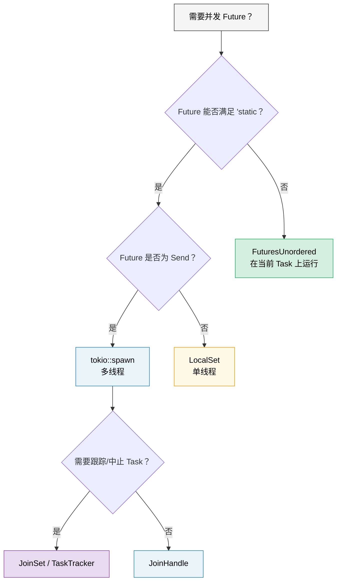

# 9. 当Tokio不合适时🟡

> **您将学到什么：**
> - `'static`问题：当`tokio::spawn`强迫你到处都进入`Arc`时
> - `LocalSet` 代表 `!Send` Future
> - `FuturesUnordered` 用于借用友好的并发（无需生成）
> - `JoinSet` 用于托管任务组
> - 编写与 Runtime 无关的库



## “静态Future”问题

Tokio的`spawn`需要`'static`Future。这意味着您无法在生成的任务中借用本地数据：

```rust
// 小白提示：这段代码演示【“静态Future”问题】。先看类型/函数签名，再看 .await、poll、spawn 等关键调用怎样推动异步任务。
async fn process_items(items: &[String]) {
    // ❌ 不能这样做 — 物品是借来的，不是 'static
    // for item in items {
    //     tokio::spawn(async {
    //         process(item).await；
    //     });
    // }

    // 😐 解决方法 1：克隆所有内容
    for item in items {
        let item = item.clone();
        tokio::spawn(async move {
            process(&item).await;
        });
    }

    // 😐 解决方法 2：使用 Arc
    let items = Arc::new(items.to_vec());
    for i in 0..items.len() {
        let items = Arc::clone(&items);
        tokio::spawn(async move {
            process(&items[i]).await;
        });
    }
}
```

这很烦人！在Go中，你可以只使用闭包来实现`go func() { use(item) }`。在 Rust 中，所有权制度迫使你思考谁拥有什么以及它的寿命有多长。

### `tokio::spawn` 的替代品

并不是每个问题都需要`spawn`。以下是三个工具，分别解决一个问题
*不同*约束：

```rust
// 小白提示：这段代码演示【`tokio::spawn` 的替代品】。先看类型/函数签名，再看 .await、poll、spawn 等关键调用怎样推动异步任务。
// 1. FuturesUnordered — 完全避免'static（不需要 spawn！）
use futures::stream::{FuturesUnordered, StreamExt};

async fn process_items(items: &[String]) {
    let futures: FuturesUnordered<_> = items
        .iter()
        .map(|item| async move {
            // ✅ 可以借用数据；没有 spawn，也就不要求 'static
            process(item).await
        })
        .collect();

    // 推动所有Future完成
    futures.for_each(|result| async move {
        println!("Result: {result:?}");
    }).await;
}

// 2. tokio::task::LocalSet — 在当前线程上运行 !Send futures
//    ⚠️ 仍然需要 'static — 解决 Send，而不是 'static
use tokio::task::LocalSet;

let local_set = LocalSet::new();
local_set.run_until(async {
    tokio::task::spawn_local(async {
        // 这里可以使用 Rc、Cell 等 !Send 类型
        let rc = std::rc::Rc::new(42);
        println!("{rc}");
    }).await.unwrap();
}).await;

// 3. tokio JoinSet (tokio 1.21+) — 托管的衍生任务集
//    ⚠️ 仍然需要 'static + Send — 解决任务*管理*，
//    不是'static问题。对于跟踪、中止和
//    加入动态任务组。
use tokio::task::JoinSet;

async fn with_joinset() {
    let mut set = JoinSet::new();

    for i in 0..10 {
        // i 是 Copy，并被移入闭包；它已经满足 'static。
        // 对于被借用的数据，仍然需要 Arc 或 clone。
        set.spawn(async move {
            tokio::time::sleep(Duration::from_millis(100)).await;
            i * 2
        });
    }

    while let Some(result) = set.join_next().await {
        println!("Task completed: {:?}", result.unwrap());
    }
}
```

> **哪个工具解决哪个问题？**
>
> | 约束你击中 | 工具 | 避免`'static`？ | 避免`Send`？ |
> |---|---|---|---|
> | 不能做Future`'static` | `FuturesUnordered` | ✅ 是的 | ✅ 是的 |
> | Future 是`'static`但是`!Send` | `LocalSet` | ❌ 没有 | ✅ 是的 |
> | 需要跟踪/中止生成的任务 | `JoinSet` | ❌ 没有 | ❌ 没有 |

### 库的轻量级Runtime

如果您正在编写一个库 - 不要强迫用户进入 tokio：

```rust
// 小白提示：这是 FuturesUnordered vs spawn 的对比答案。重点看 FuturesUnordered 不要求 'static，spawn 的任务可能在线程间移动。
// ❌ 不好：图书馆将 tokio 强加给用户
pub async fn my_lib_function() {
    tokio::time::sleep(Duration::from_secs(1)).await;
    // 这样会强迫库用户也使用 tokio
}

// ✅ 好：库与 Runtime 无关
pub async fn my_lib_function() {
    // 只依赖 std::future 和 futures crate 中的类型
    do_computation().await;
}

// ✅ 好：接受 I/O 操作的通用Future
pub async fn fetch_with_retry<F, Fut, T, E>(
    operation: F,
    max_retries: usize,
) -> Result<T, E>
where
    F: Fn() -> Fut,
    Fut: Future<Output = Result<T, E>>,
{
    for attempt in 0..max_retries {
        match operation().await {
            Ok(val) => return Ok(val),
            Err(e) if attempt == max_retries - 1 => return Err(e),
            Err(_) => continue,
        }
    }
    unreachable!()
}
```

> **经验法则**：库应该依赖于 `futures` crate，而不是 `tokio`。
> 应用程序应该依赖于`tokio`（或他们选择的Runtime）。
> 这使得生态系统保持可组合性。

<details>
<summary><strong>🏋️ 练习：FuturesUnordered vs Spawn</strong>（点击展开）</summary>

**挑战**：以两种方式编写相同的函数 - 一次使用 `tokio::spawn`（需要 `'static`），一次使用 `FuturesUnordered`（借用数据）。该函数接收 `&[String]` 并在模拟异步查找后返回每个字符串的长度。

比较：哪种方法需要`.clone()`？哪个可以借用输入切片？

<details>
<summary>🔑 参考答案</summary>

```rust
// 小白提示：这段代码演示【库的轻量级Runtime】。先看类型/函数签名，再看 .await、poll、spawn 等关键调用怎样推动异步任务。
use futures::stream::{FuturesUnordered, StreamExt};
use tokio::time::{sleep, Duration};

// 版本 1：tokio::spawn — 需要 'static，必须克隆
async fn lengths_with_spawn(items: &[String]) -> Vec<usize> {
    let mut handles = Vec::new();
    for item in items {
        let owned = item.clone(); // 必须克隆 — spawn 需要 'static
        handles.push(tokio::spawn(async move {
            sleep(Duration::from_millis(10)).await;
            owned.len()
        }));
    }

    let mut results = Vec::new();
    for handle in handles {
        results.push(handle.await.unwrap());
    }
    results
}

// 版本 2：FuturesUnordered — 借用数据，无需克隆
async fn lengths_without_spawn(items: &[String]) -> Vec<usize> {
    let futures: FuturesUnordered<_> = items
        .iter()
        .map(|item| async move {
            sleep(Duration::from_millis(10)).await;
            item.len() // ✅ 借用物品 — 不需要 clone！
        })
        .collect();

    futures.collect().await
}

#[tokio::test]
async fn test_both_versions() {
    let items = vec!["hello".into(), "world".into(), "rust".into()];

    let v1 = lengths_with_spawn(&items).await;
    // 注意：v1 保留插入顺序（顺序 join）

    let mut v2 = lengths_without_spawn(&items).await;
    v2.sort(); // FuturesUnordered 按完成顺序返回

    assert_eq!(v1, vec![5, 5, 4]);
    assert_eq!(v2, vec![4, 5, 5]);
}
```

**关键要点**：`FuturesUnordered` 通过在当前任务上运行所有 future 来避免 `'static` 要求（无线程迁移）。权衡：所有 future 都共享一项任务——如果一个任务阻塞，其他任务就会停止。使用 `spawn` 进行需要在单独线程上运行的 CPU 密集型工作。

</details>
</details>

> **关键要点 - 当 Tokio 不合适时**
> - `FuturesUnordered` 在当前任务上同时运行 Futures — 无 `'static` 要求
> - `LocalSet` 在单线程执行器上启用 `!Send` futures
> - `JoinSet` (tokio 1.21+) 为托管任务组提供自动清理功能
> - 对于库：仅依赖于`std::future::Future` + `futures` crate，而不直接依赖于tokio

> **另请参阅：** [第 8 章 — Tokio 深入探讨](ch08-tokio-deep-dive.md) 表示何时 Spawn 是正确的工具，[第 11 章 — 流](ch11-streams-and-asynciterator.md) 表示 `buffer_unordered()` 作为另一个并发限制器

***


