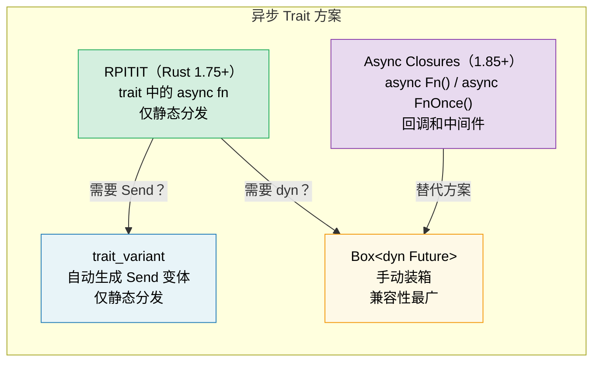

# 10. 异步（async）Trait

> **你将学到什么：**
> - 为什么 trait 中的异步方法历经多年才稳定
> - RPITIT：原生异步 trait 方法（Rust 1.75+）
> - dyn 调度挑战和通过 `trait_variant` 处理 `Send` 约束
> - 异步闭包（Rust 1.85+）：`async Fn()` 与 `async FnOnce()`



## 历史：为什么花了这么长时间

多年以来，trait 中的异步方法是 Rust 社区呼声最高的功能之一。问题在于：

```rust
// ============================================================
// 核心概念：trait 中 async fn 的根本挑战
// ============================================================
// async fn 本质上返回 impl Future<Output = T>，
// 即编译器生成一个匿名的具体 Future 类型（每个函数体一个）。
// 但在 trait 中，impl Trait 在返回位置意味着每个实现者
// 返回不同的具体类型——编译器需要知道返回类型的内存大小，
// 而 trait 方法的动态分发（vtable）无法处理大小不定的返回类型。
// Rust 1.75（2023年12月）通过 RPITIT 在静态分发层面解决了此问题。
// ============================================================

// Rust 1.75 之前不可用，1.75 之后稳定：
trait DataStore {
    async fn get(&self, key: &str) -> Option<String>;
    // 脱糖为：
    // fn get(&self, key: &str) -> impl Future<Output = Option<String>> + '_;
    //                                      ^^^^^^^^^^^^^^^^^^^^^^^^^^^^
    //                                      每个实现者的匿名类型不同
}
```

根本挑战：当 trait 方法返回 `impl Future` 时，每个实现者返回一个*不同的具体类型*。编译器必须知道返回类型的大小才能进行内存布局，但 trait 方法的动态分发（dyn）依赖于 vtable 中的固定函数签名。

### RPITIT：trait 中返回位置的 impl Trait

从 Rust 1.85 开始，trait 中的 async fn 仅在静态分发下可用：

```rust
// ============================================================
// 核心概念：RPITIT（Return Position Impl Trait In Trait）
// ============================================================
// 关键 API：trait 中直接写 async fn，编译器自动脱糖。
// 设计理由：静态分发时编译器在编译期就知道了具体类型，
// 因此可以确定 Future 的大小，生成零开销的调用代码。
// 限制：不能通过 dyn trait object 调用 async fn，
// 因为编译器无法在 vtable 中描述大小不定的返回类型。
// ============================================================

trait DataStore {
    async fn get(&self, key: &str) -> Option<String>;
}

struct InMemoryStore {
    data: std::collections::HashMap<String, String>,
}

impl DataStore for InMemoryStore {
    async fn get(&self, key: &str) -> Option<String> {
        self.data.get(key).cloned() // → 直接操作 HashMap
    }
}

// ✅ 使用泛型（静态分发）：
async fn lookup<S: DataStore>(store: &S, key: &str) {
    // → 编译器在此处生成针对 S 的专用代码（单态化）
    if let Some(val) = store.get(key).await {
        println!("{key} = {val}");
    }
}
```

### dyn 调度与 Send 约束

限制：你不能直接使用 `dyn DataStore`，因为编译器不知道返回的 future 的大小：

```rust
// ============================================================
// 核心概念：dyn 安全性与异步 trait
// ============================================================
// async fn 方法使 trait 自动变为"非 dyn 安全"，
// 因为返回的 impl Future 类型的大小在运行时不可知。
// 解决方案：手动返回 Box<dyn Future>，即在堆上分配，
// 通过虚表调用（两次间接：一次 trait vtable，一次 Future poll）。
// 设计理由：这是类型系统对"不确定大小"的必然要求。
// ============================================================

// ❌ 不工作：
// async fn lookup_dyn(store: &dyn DataStore, key: &str) { ... }
// 错误：trait `DataStore` 不是 dyn-compatible，
//       因为方法 `get` 是 async 的

// ✅ 解决方案：返回 boxed future
trait DynDataStore {
    fn get(&self, key: &str) -> Pin<Box<dyn Future<Output = Option<String>> + Send + '_>>;
    //                         ^^^^^^^^  ^^^^^^^^^^^^^^^^^^^^^^^^^^^^^^^^^^^^^^^^  ^^
    //                         Pin 固定     堆分配的 trait object Future           生命周期
}
```

**Send 问题**：在多线程运行时中，spawn 的任务必须满足 `Send`。但异步 trait 方法不会自动添加 `Send` 约束：

```rust
// ============================================================
// 核心概念：Send 约束与异步 trait
// ============================================================
// trait 中的 async fn 返回的 Future 是否 Send 取决于方法体中
// 是否跨越 .await 使用了 !Send 类型（如 Rc、Cell 等）。
// 编译器不会自动为 trait 方法添加 Send 约束——
// 这意味着实现者可能无意中产生 !Send Future，
// 导致调用者无法在多线程运行时中 spawn 该 Future。
// 设计理由：自动添加 Send 约束会限制 trait 的通用性，
// 让只需要单线程运行的实现者被迫满足不必要的限制。
// ============================================================

trait Worker {
    async fn run(self); // Future 可能是 Send 也可能不是
}

struct MyWorker;

impl Worker for MyWorker {
    async fn run(self) {
        // 使用了 Rc —— !Send 类型
        let rc = std::rc::Rc::new(42);
        some_work().await;          // ⚠️ Rc 跨越 .await 点
        println!("{rc}");
        // → 此方法生成的 Future 是 !Send 的
    }
}

// ❌ 编译失败——Worker::run() 返回的 Future 不满足 Send：
// tokio::spawn(worker.run());
//
// 注意：run(self) 消耗 self，所以不涉及借用问题。
// 这里失败纯粹因为 Rc 导致 Future 不满足 Send。
// 即使没有 Rc，`async fn run(&self)` 也无法 spawn——
// 因为借用 &self 不满足 'static。
```

### trait_variant crate

`trait_variant` crate（来自 Rust 异步工作组）自动生成 `Send` 变体：

```rust
// ============================================================
// 核心概念：trait_variant::make 自动生成 Send 约束版本
// ============================================================
// 关键 API：#[trait_variant::make(SendVariant: Send)]
//   → 原始 trait（不强制 Send）+ 派生 trait（所有方法返回 Send Future）
// 工作原理：属性宏分析 trait 定义，生成第二个 trait，
//   其方法签名中所有 impl Future 都追加 Send 约束。
//   实现者只需实现原始 trait；如果其 Future 天然满足 Send，
//   编译器自动为其实现 Send 变体（零额外代码）。
// ⚠️ 注意：trait_variant 不启用 dyn 调度——
//   生成的 trait 仍使用 impl Future，所以 dyn SendStore 不工作。
// ============================================================

// Cargo.toml: trait-variant = "0.1"

#[trait_variant::make(SendDataStore: Send)]  // 自动生成 SendDataStore trait
trait DataStore {
    async fn get(&self, key: &str) -> Option<String>;
    async fn set(&self, key: &str, value: String);
}

// 现在你有两个 trait：
// - DataStore：未来不约束 Send（单线程场景）
// - SendDataStore：所有 Future 都约束 Send（多线程场景）
// 两者方法相同。实现者只需实现 DataStore；
// 如果你的 Future 是 Send 的，编译器自动为你生成 SendDataStore 的实现。

// 当需要 spawn 任务时，使用 SendDataStore：
async fn spawn_lookup<S: SendDataStore + 'static>(store: Arc<S>) {
    tokio::spawn(async move {
        store.get("key").await;
        // → 编译器确认此 Future 满足 Send + 'static
    });
}

// ⚠️ 注意：trait_variant 不启用 dyn 调度。
// 生成的 trait 仍然使用 `impl Future`，所以 `dyn SendDataStore`
// 不是对象安全的。需要 dyn 调度时，
// 仍需手动返回 Box::pin（参见上面的做法），或使用 `async-trait` crate。
```

### 快速参考：异步 Trait

| 方法 | 静态分发 | 动态分发 | Send | 语法开销 |
|----------|:---:|:---:|:---:|---|
| trait 中原生 `async fn` (RPITIT) | ✅ | ❌ | 隐式 | 无 |
| `trait_variant` | ✅ | ❌ | 显式 | `#[trait_variant::make]` |
| 手动 `Box::pin` | ✅ | ✅ | 显式 | 高 |
| `async-trait` crate | ✅ | ✅ | `#[async_trait]` | 中（过程宏） |

> **建议**：对于新代码（Rust 1.75+），优先使用原生异步 trait。
> 当需要 `Send` 约束以 spawn 任务时，添加 `trait_variant`。
> 对于 `dyn` 分发，使用手动 `Box::pin` 或 `async-trait` crate。
> 原生静态分发的方式是零成本抽象的。

### 异步闭包 (Rust 1.85+)

从 Rust 1.85 开始，`async closures` 稳定可用——能够捕获环境并返回 future 的闭包：

```rust
// ============================================================
// 核心概念：异步闭包替换 Fn() -> impl Future 模式
// ============================================================
// 以前：闭包返回 async {} 块（两层嵌套：闭包 → Future）
// 现在：async || { ... } 直接创建一个异步闭包
// 异步闭包实现新的 AsyncFn/AsyncFnMut/AsyncFnOnce trait，
// 分别对应同步闭包的 Fn/FnMut/FnOnce。
// 设计理由：消除双重嵌套的"返回 future 的闭包"模板代码，
// 让异步回调的签名更简洁自然。
// ============================================================

// 1.85 之前：别扭的解决方案
let urls = vec!["https://a.com", "https://b.com"];
let fetchers: Vec<_> = urls.iter().map(|url| {
    let url = url.to_string();
    // 返回一个"非 async 闭包"，其内部返回 async 块
    // 两层嵌套：|| → async {}
    move || async move { reqwest::get(&url).await }
}).collect();

// 1.85 之后：async 闭包直接工作
let fetchers: Vec<_> = urls.iter().map(|url| {
    async move || { reqwest::get(url).await }
    // ↑ 这是一个 async 闭包 —— 捕获 url，调用时返回 Future
}).collect();
```

异步闭包实现了新的 `AsyncFn`、`AsyncFnMut` 和 `AsyncFnOnce` trait，它们与同步的 `Fn`、`FnMut`、`FnOnce` 对应：

```rust
// ============================================================
// 核心概念：AsyncFn trait 族
// ============================================================
// AsyncFn() → 可以多次调用，不修改环境（只读借用）
// AsyncFnMut() → 可以多次调用，可能修改环境（可变借用）
// AsyncFnOnce() → 只能调用一次（消耗环境）
// 对比旧写法 Fn() -> impl Future<Output = T>：
//   AsyncFn() -> T 更简洁，语义更清晰
// ============================================================

// 接受 async 闭包的泛型函数
async fn retry<F>(max: usize, f: F) -> Result<String, Error>
where
    F: AsyncFn() -> Result<String, Error>, // → 返回 Future 的闭包
{
    for attempt in 0..max {
        match f().await {                   // → 调用闭包，await 其返回的 Future
            Ok(val) => return Ok(val),
            Err(_) if attempt < max - 1 => continue,
            Err(e) => return Err(e),
        }
    }
    unreachable!()
}
```

> **迁移提示**：如果你有使用 `Fn() -> impl Future<Output = T>` 的旧代码，
> 考虑切换到 `AsyncFn() -> T` 以获取更清晰的签名。

<details>
<summary><strong>练习：设计异步服务 Trait</strong>（点击展开）</summary>

**挑战**：设计带有异步 `get` 和 `set` 方法的 `Cache` trait。提供两种实现：`HashMap`（内存）和模拟的 Redis 后端（用 `tokio::time::sleep` 模拟网络延迟）。编写一个对两种实现都适用的泛型函数。

<details>
<summary>参考答案</summary>

```rust
// ============================================================
// 练习：Cache trait — 展示异步 trait 的静态分发能力
// ============================================================
// 同一个 trait，两种实现：
//   MemoryCache → 零延迟，直接操作 HashMap
//   RedisCache  → 模拟网络延迟（sleep）
// cache_demo 是泛型函数，通过静态分发同时支持两者，
// 没有装箱、没有动态分发开销。
// ⚠️ 注意：tokio::sync::Mutex 用于异步上下文，
//    防止在持锁状态下跨越 .await 导致的死锁。
// ============================================================

use std::collections::HashMap;
use std::sync::Arc;
use tokio::sync::Mutex;
use tokio::time::{sleep, Duration};

trait Cache {
    async fn get(&self, key: &str) -> Option<String>;
    async fn set(&self, key: &str, value: String);
}

// --- 内存实现 ---
struct MemoryCache {
    store: Mutex<HashMap<String, String>>,
}

impl MemoryCache {
    fn new() -> Self {
        MemoryCache {
            store: Mutex::new(HashMap::new()),
        }
    }
}

impl Cache for MemoryCache {
    async fn get(&self, key: &str) -> Option<String> {
        self.store.lock().await.get(key).cloned()
        // → 获取锁 → 查找 key → 返回 cloned 值（Option）
    }

    async fn set(&self, key: &str, value: String) {
        self.store.lock().await.insert(key.to_string(), value);
        // → 获取锁 → 插入键值对 → 锁自动释放
    }
}

// --- 模拟 Redis 实现 ---
struct RedisCache {
    store: Mutex<HashMap<String, String>>,
    latency: Duration, // 模拟网络往返时间
}

impl RedisCache {
    fn new(latency_ms: u64) -> Self {
        RedisCache {
            store: Mutex::new(HashMap::new()),
            latency: Duration::from_millis(latency_ms),
        }
    }
}

impl Cache for RedisCache {
    async fn get(&self, key: &str) -> Option<String> {
        sleep(self.latency).await; // ← 模拟网络往返延迟
        self.store.lock().await.get(key).cloned()
    }

    async fn set(&self, key: &str, value: String) {
        sleep(self.latency).await; // ← 模拟网络往返延迟
        self.store.lock().await.insert(key.to_string(), value);
    }
}

// --- 泛型函数：适用于任何 Cache 实现 ---
async fn cache_demo<C: Cache>(cache: &C, label: &str) {
    cache.set("greeting", "Hello, async!".into()).await;
    let val = cache.get("greeting").await;
    println!("[{label}] greeting = {val:?}");
    // → 静态分发：编译器为 MemoryCache 和 RedisCache 各生成一份代码
}

#[tokio::main]
async fn main() {
    let mem = MemoryCache::new();
    cache_demo(&mem, "memory").await;

    let redis = RedisCache::new(50);
    cache_demo(&redis, "redis").await;
}
```

**关键要点**：相同的泛型函数通过静态分发同时适用于两种实现，没有装箱、没有分配开销。如果你需要在多线程运行时中 spawn 这些 future，添加 `trait_variant::make(SendCache: Send)` 以获取 `Send` 约束。对于动态分发，使用手动 `Box::pin` 或 `async-trait` crate。

</details>
</details>

> **关键要点 -- 异步 Trait**
> - 从 Rust 1.75 开始，你可以直接在 trait 中写 `async fn`（不需要 `#[async_trait]` crate）
> - `trait_variant::make` 自动生成用于 spawn 任务的 `Send` 变体（仅限静态分发）
> - 异步闭包 (`async Fn()`) 在 Rust 1.85 中稳定——适用于回调和中间件
> - 对于性能关键代码，优先选择静态分发 (`<S: Service>`) 而非 `dyn`

> **另请参阅：** [第 13 章 -- 生产模式](ch13-production-patterns.md) 了解 Tower 的 `Service` trait，[第 6 章 -- 手工构建 Future](ch06-building-futures-by-hand.md) 了解手动 trait 实现

***

