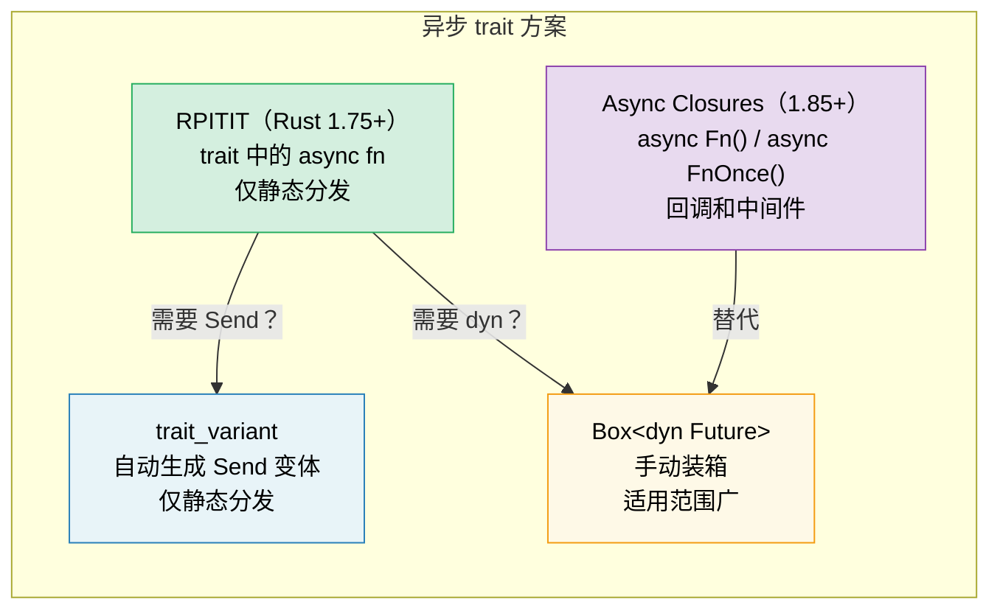

# 10. 异步 trait🟡

> **您将学到什么：**
> - 为什么trait 中的异步方法需要数年时间才能稳定
> - RPITIT：原生异步 trait方法（Rust 1.75+）
> - dyn调度挑战和`Send`通过`trait_variant`边界
> - 异步闭包（Rust 1.85+）：`async Fn()` 和 `async FnOnce()`



## 历史：为什么花了这么长时间

多年来，trait 中的异步方法是 Rust 最受欢迎的功能。问题：

```rust
// 这类写法直到 Rust 1.75（2023 年 12 月）才稳定可用：
trait DataStore {
    async fn get(&self, key: &str) -> Option<String>;
}
// 为什么？因为 async fn 返回 `impl Future<Output = T>`，
// 过去 trait 返回位置中的 `impl Trait` 尚不支持。
```

根本挑战：当 trait 方法返回 `impl Future` 时，每个实现者返回一个*不同的具体类型*。编译器需要知道返回类型的大小，但是 trait 方法是动态调度的。

### RPITIT：返回位置 Impl Trait in Trait

从 Rust 1.75 开始，这仅适用于静态调度：

```rust
trait DataStore {
    async fn get(&self, key: &str) -> Option<String>;
    // 脱糖至：
    // fn get(&self, key: &str) -> impl Future<Output = Option<String>>;
}

struct InMemoryStore {
    data: std::collections::HashMap<String, String>,
}

impl DataStore for InMemoryStore {
    async fn get(&self, key: &str) -> Option<String> {
        self.data.get(key).cloned()
    }
}

// ✅ 使用泛型（静态调度）：
async fn lookup<S: DataStore>(store: &S, key: &str) {
    if let Some(val) = store.get(key).await {
        println!("{key} = {val}");
    }
}
```

### dyn 调度和 Send 边界

限制：你不能直接使用 `dyn DataStore` 因为编译器不知道返回的 future 的大小：

```rust
// ❌ 不起作用：
// async fn lookup_dyn(store: &dyn DataStore, key: &str) { ... }
// Error: the trait `DataStore` is not dyn-compatible because method `get`
//        是 `async`

// ✅ 解决方法：返回一个盒装的 future
trait DynDataStore {
    fn get(&self, key: &str) -> Pin<Box<dyn Future<Output = Option<String>> + Send + '_>>;
}
```

**Send问题**：在多线程 Runtime，生成的任务必须是`Send`。但异步 trait 方法不会自动添加 `Send` 边界：

```rust
trait Worker {
    async fn run(self); // Future 可能是 Send，也可能不是 Send
}

struct MyWorker;

impl Worker for MyWorker {
    async fn run(self) {
        // 如果使用!Send类型，则Future是!Send
        let rc = std::rc::Rc::new(42);
        some_work().await;
        println!("{rc}");
    }
}

// ❌ 这会失败，因为Future是!Send（Rc是!Send）：
// tokio::spawn(worker.run()); // 需要 Send + 'static
//
// 注意：这里使用拥有所有权的 `self`，因为 tokio::spawn 也
// 需要 'static — 借用了 &self 的 Future &self 不能是 'static。
// 即使没有 Rc，`async fn run(&self)` 也无法生成。
```

### trait_variant 箱子

`trait_variant` crate（来自Rust异步工作组）自动生成`Send`变体：

```rust
// Cargo.toml: trait-variant = "0.1"

#[trait_variant::make(SendDataStore: Send)]
trait DataStore {
    async fn get(&self, key: &str) -> Option<String>;
    async fn set(&self, key: &str, value: String);
}

// 现在你有两个特点：
// - DataStore：Future不受 Send 约束
// - SendDataStore：所有Future 都是 Send
// 两者方法相同，实现者实现DataStore
// 如果他们的Future是Send，则免费获得SendDataStore。

// 当您需要 spawn 任务时，请使用 SendDataStore：
async fn spawn_lookup<S: SendDataStore + 'static>(store: Arc<S>) {
    tokio::spawn(async move {
        store.get("key").await;
    });
}

// ⚠️ 注意：trait_variant 不启用 dyn 调度。
// 生成的trait仍然使用`impl Future`，所以`dyn SendDataStore`
// 不是对象安全的。对于dyn调度，仍然需要手动装箱
// （参见上面的 Box::pin 方法），或者使用 `async-trait` crate。
```

### 快速参考：异步 trait

| 方法 | 静态调度 | 动态调度 | Send | 语法开销 |
|----------|:---:|:---:|:---:|---|
| trait 中的原生`async fn` | ✅ | ❌ | 隐含的 | 没有任何 |
| `trait_variant` | ✅ | ❌ | 显式的 | `#[trait_variant::make]` |
| 说明书`Box::pin` | ✅ | ✅ | 显式的 | 高的 |
| `async-trait`箱子 | ✅ | ✅ | `#[async_trait]` | 中（过程宏） |

> **建议**：对于新代码（Rust 1.75+），请使用本机异步 trait。添加
> 当您需要 `Send` 边界来执行生成任务时，`trait_variant`。对于`dyn`
> 调度，使用手册`Box::pin`或`async-trait`板条箱。当地人
> 静态调度的方法是零成本的。

### 异步闭包 (Rust 1.85+)

从 Rust 1.85 开始，`async closures` 是稳定的——捕获其环境并返回 future 的闭包：

```rust
// 1.85 之前：尴尬的解决方法
let urls = vec!["https://a.com", "https://b.com"];
let fetchers: Vec<_> = urls.iter().map(|url| {
    let url = url.to_string();
    // 返回一个非async闭包，该闭包返回一个async块
    move || async move { reqwest::get(&url).await }
}).collect();

// 1.85 之后：async 闭包可以正常工作
let fetchers: Vec<_> = urls.iter().map(|url| {
    async move || { reqwest::get(url).await }
    // ↑ 这是一个 async 闭包 — 捕获 url，返回 Future
}).collect();
```

异步闭包实现了新的 `AsyncFn`、`AsyncFnMut` 和 `AsyncFnOnce` trait，它们镜像 `Fn`、`FnMut`、`FnOnce`：

```rust
// 接受 async 闭包的通用函数
async fn retry<F>(max: usize, f: F) -> Result<String, Error>
where
    F: AsyncFn() -> Result<String, Error>,
{
    for _ in 0..max {
        if let Ok(val) = f().await {
            return Ok(val);
        }
    }
    f().await
}
```

> **迁移提示**：如果您有使用 `Fn() -> impl Future<Output = T>` 的代码，
> 考虑切换到 `AsyncFn() -> T` 以获得更清晰的签名。

<details>
<summary><strong>🏋️ 练习：设计异步服务 trait</strong>（点击展开）</summary>

**挑战**：使用异步 `get` 和 `set` 方法设计 `Cache` trait。实现两次：一次使用 `HashMap`（内存中），一次使用模拟 Redis 后端（使用 `tokio::time::sleep` 模拟网络延迟）。编写一个适用于两者的通用函数。

<details>
<summary>🔑 参考答案</summary>

```rust
use std::collections::HashMap;
use std::sync::Arc;
use tokio::sync::Mutex;
use tokio::time::{sleep, Duration};

trait Cache {
    async fn get(&self, key: &str) -> Option<String>;
    async fn set(&self, key: &str, value: String);
}

// --- 内存中实现 ---
struct MemoryCache {
    store: Mutex<HashMap<String, String>>,
}

impl MemoryCache {
    fn new() -> Self {
        MemoryCache {
            store: Mutex::new(HashMap::new()),
        }
    }
}

impl Cache for MemoryCache {
    async fn get(&self, key: &str) -> Option<String> {
        self.store.lock().await.get(key).cloned()
    }

    async fn set(&self, key: &str, value: String) {
        self.store.lock().await.insert(key.to_string(), value);
    }
}

// --- 模拟Redis实现 ---
struct RedisCache {
    store: Mutex<HashMap<String, String>>,
    latency: Duration,
}

impl RedisCache {
    fn new(latency_ms: u64) -> Self {
        RedisCache {
            store: Mutex::new(HashMap::new()),
            latency: Duration::from_millis(latency_ms),
        }
    }
}

impl Cache for RedisCache {
    async fn get(&self, key: &str) -> Option<String> {
        sleep(self.latency).await; // 模拟网络往返
        self.store.lock().await.get(key).cloned()
    }

    async fn set(&self, key: &str, value: String) {
        sleep(self.latency).await;
        self.store.lock().await.insert(key.to_string(), value);
    }
}

// --- 适用于任何缓存的通用函数 ---
async fn cache_demo<C: Cache>(cache: &C, label: &str) {
    cache.set("greeting", "Hello, a同步的！".into()).await;
    let val = cache.get("greeting").await;
    println!("[{label}] greeting = {val:?}");
}

#[tokio::main]
async fn main() {
    let mem = MemoryCache::new();
    cache_demo(&mem, "memory").await;

    let redis = RedisCache::new(50);
    cache_demo(&redis, "redis").await;
}
```

**关键要点**：相同的通用函数通过静态调度适用于两种实现。没有装箱，没有分配开销。如果您需要在多线程 Runtime生成这些 future，请添加 `trait_variant::make(SendCache: Send)` 以获得 `Send` 边界。对于动态调度，请使用手动 `Box::pin` 或 `async-trait` crate。

</details>
</details>

> **关键要点 — 异步 trait**
> - 从Rust 1.75开始，你可以直接在traits中写入`async fn`（不需要`#[async_trait]` crate）
> - `trait_variant::make` 自动生成用于生成任务的 `Send` 变体（仅限静态调度）
> - 异步闭包 (`async Fn()`) 在 1.85 中稳定 — 用于回调和中间件
> - 对于性能关键型代码，优先选择静态调度 (`<S: Service>`) 而不是`dyn`

> **另请参阅：** [第 13 章 — 生产模式](ch13-production-patterns.md) 用于 Tower 的 `Service` trait，[第 6 章 — 手工构建 Future](ch06-building-futures-by-hand.md) 用于手动 trait 实现

***


