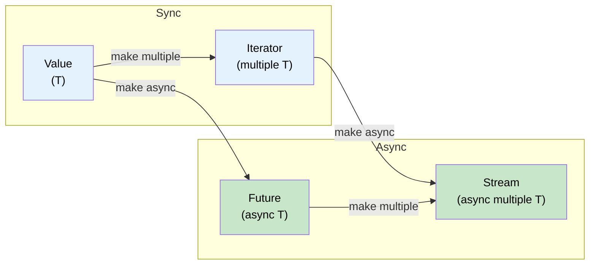

# 11. 流和 AsyncIterator 🟡

> **您将学到什么：**
> - `Stream` trait：多个值的异步迭代
> - 创建流：`stream::iter`、`async_stream`、`unfold`
> - Stream 组合器：`map`、`filter`、`buffer_unordered`、`fold`
> - 异步 I/O 特征：`AsyncRead`、`AsyncWrite`、`AsyncBufRead`

## Stream trait概述

`Stream` 与 `Iterator` 的关系就像 `Future` 与单个值的关系一样 — 它会异步生成多个值：

```rust
// std::iter::Iterator（同步，多个值）
trait Iterator {
    type Item;
    fn next(&mut self) -> Option<Self::Item>;
}

// futures::Stream（异步，多个值）
trait Stream {
    type Item;
    fn poll_next(self: Pin<&mut Self>, cx: &mut Context<'_>) -> Poll<Option<Self::Item>>;
}
```



### 创建流

```rust
use futures::stream::{self, StreamExt};
use tokio::time::{interval, Duration};
use tokio_stream::wrappers::IntervalStream;

// 1.来自迭代器
let s = stream::iter(vec![1, 2, 3]);

// 2. 来自 async 生成器（使用 async_stream crate）
// Cargo.toml: async-stream = "0.3"
use async_stream::stream;

fn countdown(from: u32) -> impl futures::Stream<Item = u32> {
    stream! {
        for i in (0..=from).rev() {
            tokio::time::sleep(Duration::from_millis(500)).await;
            yield i;
        }
    }
}

// 3. 从tokio区间开始
let tick_stream = IntervalStream::new(interval(Duration::from_secs(1)));

// 4. 来自通道接收器 (tokio_stream::wrappers)
let (tx, rx) = tokio::sync::mpsc::channel::<String>(100);
let rx_stream = tokio_stream::wrappers::ReceiverStream::new(rx);

// 5. From展开（从async状态生成）
let s = stream::unfold(0u32, |state| async move {
    if state >= 5 {
        None // Stream 结束
    } else {
        let next = state + 1;
        Some((state, next)) // 生成 `state`，新状态为`next`
    }
});
```

### 消费流

```rust
use futures::stream::{self, StreamExt};

async fn stream_examples() {
    let s = stream::iter(vec![1, 2, 3, 4, 5]);

    // for_each：处理每个元素
    s.for_each(|x| async move {
        println!("{x}");
    }).await;

    // 地图+收集
    let doubled: Vec<i32> = stream::iter(vec![1, 2, 3])
        .map(|x| x * 2)
        .collect()
        .await;

    // 筛选
    let evens: Vec<i32> = stream::iter(1..=10)
        .filter(|x| futures::future::ready(x % 2 == 0))
        .collect()
        .await;

    // buffer_unordered — 同时处理 N 个项目
    let results: Vec<_> = stream::iter(vec!["url1", "url2", "url3"])
        .map(|url| async move {
            // 模拟 HTTP 获取
            tokio::time::sleep(Duration::from_millis(100)).await;
            format!("response from {url}")
        })
        .buffer_unordered(10) // 最多 10 个并发提取
        .collect()
        .await;

    // 拿走、跳过、拉链、链条——就像Iterator一样
    let first_three: Vec<i32> = stream::iter(1..=100)
        .take(3)
        .collect()
        .await;
}
```

### 与 C# IAsyncEnumerable 的比较

| 特征 | Rust`Stream` | C#`IAsyncEnumerable<T>` |
|---------|--------------|--------------------------|
| **句法** | `stream! { yield x; }` | `await foreach` / `yield return` |
| **消除** | 丢弃流 | `CancellationToken` |
| **背压** | 消费者控制Poll率 | 消费者控制`MoveNextAsync` |
| **内置** | 否（需要`futures`板条箱） | 是（自 C# 8.0 起） |
| **组合器** | `.map()`、`.filter()`、`.buffer_unordered()` | LINQ + `System.Linq.Async` |
| **错误处理** | `Stream<Item = Result<T, E>>` | 放入异步迭代器 |

```rust
// Rust：数据库行的 Stream
// 注意：使用 ? 时需要try_stream!（而不是stream!）体内。
// stream! 不会传播错误 — try_stream! 产生 Err(e) 并结束。
fn get_users(db: &Database) -> impl Stream<Item = Result<User, DbError>> + '_ {
    try_stream! {
        let mut cursor = db.query("SELECT * FROM users").await?;
        while let Some(row) = cursor.next().await {
            yield User::from_row(row?);
        }
    }
}

// 消费：
let mut users = pin!(get_users(&db));
while let Some(result) = users.next().await {
    match result {
        Ok(user) => println!("{}", user.name),
        Err(e) => eprintln!("Error: {e}"),
    }
}
```

```csharp
// C# 等价写法：
async IAsyncEnumerable<User> GetUsers() {
    await using var reader = await db.QueryAsync("SELECT * FROM users");
    while (await reader.ReadAsync()) {
        yield return User.FromRow(reader);
    }
}

// 消费：
await foreach (var user in GetUsers()) {
    Console.WriteLine(user.Name);
}
```

<details>
<summary><strong>🏋️ 练习：构建异步统计聚合器</strong>（单击展开）</summary>

**挑战**：给定传感器读数流 `Stream<Item = f64>`，编写一个异步函数来消耗该流并返回 `(count, min, max, average)`。使用 `StreamExt` 组合器——不要只是收集到 Vec 中。

*提示*：使用 `.fold()` 累积流中的状态。

<details>
<summary>🔑解决方案</summary>

```rust
use futures::stream::{self, StreamExt};

#[derive(Debug)]
struct Stats {
    count: usize,
    min: f64,
    max: f64,
    sum: f64,
}

impl Stats {
    fn average(&self) -> f64 {
        if self.count == 0 { 0.0 } else { self.sum / self.count as f64 }
    }
}

async fn compute_stats<S: futures::Stream<Item = f64>>(stream: S) -> Stats {
    stream
        .fold(
            Stats { count: 0, min: f64::INFINITY, max: f64::NEG_INFINITY, sum: 0.0 },
            |mut acc, value| async move {
                acc.count += 1;
                acc.min = acc.min.min(value);
                acc.max = acc.max.max(value);
                acc.sum += value;
                acc
            },
        )
        .await
}

#[tokio::test]
async fn test_stats() {
    let readings = stream::iter(vec![23.5, 24.1, 22.8, 25.0, 23.9]);
    let stats = compute_stats(readings).await;

    assert_eq!(stats.count, 5);
    assert!((stats.min - 22.8).abs() < f64::EPSILON);
    assert!((stats.max - 25.0).abs() < f64::EPSILON);
    assert!((stats.average() - 23.86).abs() < 0.01);
}
```

**关键要点**：Stream像`.fold()`这样的组合器一次处理一个项目，而不收集到内存中——对于处理大型或无界数据流至关重要。

</details>
</details>

### 异步 I/O 特征：AsyncRead、AsyncWrite、AsyncBufRead

正如 `std::io::Read`/`Write` 是同步 I/O 的基础一样，它们的异步对应项也是异步 I/O 的基础。这些特征由 `tokio::io` 提供（或 `futures::io` 对于与Runtime 无关的代码）：

```rust
// tokio::io：std::io trait 的异步版本

/// 从源异步读取字节
pub trait AsyncRead {
    fn poll_read(
        self: Pin<&mut Self>,
        cx: &mut Context<'_>,
        buf: &mut ReadBuf<'_>,  // Tokio 对未初始化内存的安全包装
    ) -> Poll<io::Result<()>>;
}

/// 异步将字节写入接收器
pub trait AsyncWrite {
    fn poll_write(
        self: Pin<&mut Self>,
        cx: &mut Context<'_>,
        buf: &[u8],
    ) -> Poll<io::Result<usize>>;

    fn poll_flush(self: Pin<&mut Self>, cx: &mut Context<'_>) -> Poll<io::Result<()>>;
    fn poll_shutdown(self: Pin<&mut Self>, cx: &mut Context<'_>) -> Poll<io::Result<()>>;
}

/// 带线路支持的缓冲读取
pub trait AsyncBufRead: AsyncRead {
    fn poll_fill_buf(self: Pin<&mut Self>, cx: &mut Context<'_>) -> Poll<io::Result<&[u8]>>;
    fn consume(self: Pin<&mut Self>, amt: usize);
}
```

**在实践中**，你很少直接调用这些 `poll_*` 方法。相反，请使用扩展特征 `AsyncReadExt` 和 `AsyncWriteExt`，它们提供 `.await` 友好的辅助方法：

```rust
use tokio::io::{AsyncReadExt, AsyncWriteExt, AsyncBufReadExt};
use tokio::net::TcpStream;
use tokio::io::BufReader;

async fn io_examples() -> tokio::io::Result<()> {
    let mut stream = TcpStream::connect("127.0.0.1:8080").await?;

    // AsyncWriteExt：write_all、write_u32、write_buf 等
    stream.write_all(b"GET / HTTP/1.0\r\n\r\n").await?;

    // AsyncReadExt：read、read_exact、read_to_end、read_to_string
    let mut response = Vec::new();
    stream.read_to_end(&mut response).await?;

    // AsyncBufReadExt：read_line、lines()、split()
    let file = tokio::fs::File::open("config.txt").await?;
    let reader = BufReader::new(file);
    let mut lines = reader.lines();
    while let Some(line) = lines.next_line().await? {
        println!("{line}");
    }

    Ok(())
}
```

**实现自定义异步 I/O** — 在原始 TCP 上包装协议：

```rust
use tokio::io::{AsyncRead, AsyncWrite, ReadBuf};
use std::pin::Pin;
use std::task::{Context, Poll};

/// 长度前缀协议：[u32 长度][载荷字节]
struct FramedStream<T> {
    inner: T,
}

impl<T: AsyncRead + AsyncReadExt + Unpin> FramedStream<T> {
    /// 读完整一帧
    async fn read_frame(&mut self) -> tokio::io::Result<Vec<u8>>
    {
        // 读取4字节长度前缀
        let len = self.inner.read_u32().await? as usize;

        // 准确读取那么多字节
        let mut payload = vec![0u8; len];
        self.inner.read_exact(&mut payload).await?;
        Ok(payload)
    }
}

impl<T: AsyncWrite + AsyncWriteExt + Unpin> FramedStream<T> {
    /// 写出一完整的框架
    async fn write_frame(&mut self, data: &[u8]) -> tokio::io::Result<()>
    {
        self.inner.write_u32(data.len() as u32).await?;
        self.inner.write_all(data).await?;
        self.inner.flush().await?;
        Ok(())
    }
}
```

| Sync trait | 异步特征 (tokio) | 异步特征（Future） | 延伸trait |
|-----------|--------------------|-----------------------|----------------|
| `std::io::Read` | `tokio::io::AsyncRead` | `futures::io::AsyncRead` | `AsyncReadExt` |
| `std::io::Write` | `tokio::io::AsyncWrite` | `futures::io::AsyncWrite` | `AsyncWriteExt` |
| `std::io::BufRead` | `tokio::io::AsyncBufRead` | `futures::io::AsyncBufRead` | `AsyncBufReadExt` |
| `std::io::Seek` | `tokio::io::AsyncSeek` | `futures::io::AsyncSeek` | `AsyncSeekExt` |

> **tokio 与 futures I/O 特征**：它们相似但不完全相同 — tokio 的 `AsyncRead` 使用 `ReadBuf`（安全处理未初始化的内存），而 `futures::AsyncRead` 使用 `&mut [u8]`。使用`tokio_util::compat`在它们之间进行转换。

> **复制实用程序**：`tokio::io::copy(&mut reader, &mut writer)` 是`std::io::copy` 的异步等效项 — 对于代理服务器或文件传输很有用。 `tokio::io::copy_bidirectional` 同时复制两个方向。

<details>
<summary><strong>🏋️ 练习：构建异步行计数器</strong>（点击展开）</summary>

**挑战**：编写一个异步函数，该函数接受任何 `AsyncBufRead` 源并返回非空行数。它应该适用于文件、TCP 流或任何缓冲读取器。

*提示*：使用 `AsyncBufReadExt::lines()` 并计算`!line.is_empty()` 的行数。

<details>
<summary>🔑解决方案</summary>

```rust
use tokio::io::AsyncBufReadExt;

async fn count_non_empty_lines<R: tokio::io::AsyncBufRead + Unpin>(
    reader: R,
) -> tokio::io::Result<usize> {
    let mut lines = reader.lines();
    let mut count = 0;
    while let Some(line) = lines.next_line().await? {
        if !line.is_empty() {
            count += 1;
        }
    }
    Ok(count)
}

// 适用于任何 AsyncBufRead：
// let file = tokio::io::BufReader::new(tokio::fs::File::open("data.txt").await?);
// let count = count_non_empty_lines(file).await?;
//
// let tcp = tokio::io::BufReader::new(TcpStream::connect("...").await?);
// let count = count_non_empty_lines(tcp).await?;
```

**关键要点**：通过针对 `AsyncBufRead` 而不是具体类型进行编程，您的 I/O 代码可以在文件、套接字、管道甚至内存缓冲区 (`tokio::io::BufReader::new(std::io::Cursor::new(data))`) 之间重用。

</details>
</details>

> **关键要点 — 流和 AsyncIterator**
> - `Stream` 是 `Iterator` 的异步等价物 — 产生 `Poll::Ready(Some(item))` 或 `Poll::Ready(None)`
> - `.buffer_unordered(N)`同时处理N个流项——流的关键并发工具
> - `async_stream::stream!`是创建自定义流的最简单方法（使用`yield`）
> - `AsyncRead`/`AsyncBufRead` 启用跨文件、套接字和管道的通用、可重用 I/O 代码

> **另请参阅：** [第 9 章 — 当 Tokio 不合适时](ch09-when-tokio-isnt-the-right-fit.md) 表示 `FuturesUnordered`（相关模式），[第 13 章 — 生产模式](ch13-production-patterns.md) 表示有界通道的背压

***


