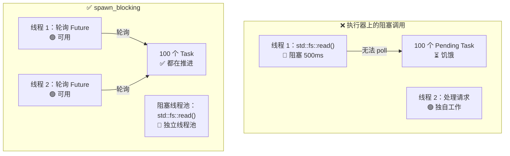

# 12. 常见陷阱

> **你将学到什么：**
> - 9 个常见的异步（async）Rust 错误以及如何修复每一个
> - 为什么阻塞执行器（executor）是头号错误（以及如何用 `spawn_blocking` 修复）
> - 取消风险：当 Future 在等待中被丢弃时会发生什么
> - 调试：`tokio-console`、`tracing`、`#[instrument]`
> - 测试：基于 `#[tokio::test]`、`time::pause()`、trait 的模拟

## 阻塞执行器

异步 Rust 中的头号错误：在异步执行器线程上运行阻塞代码。这会导致其他任务饥饿。

```rust
// ============================================================================
// 核心概念：异步执行器通过在线程上轮询（poll）Future 来推进任务。如果某个
// Future 的 poll 中包含了阻塞式系统调用（如同步文件 I/O），该线程就会被
// 操作系统挂起，执行器无法在该线程上轮询其他任务——所有共线任务全部饿死。
//
// 解决方案有两种：
//   1. spawn_blocking：将阻塞工作卸载到独立的阻塞线程池，主执行器线程不受影响
//   2. 异步替代 API：使用 tokio::fs 等异步版本，内部基于 spawn_blocking 实现
// ============================================================================

// ❌ 错误：阻塞整个执行器线程
// std::fs::read_to_string 是同步阻塞调用，执行器线程在此期间完全卡死
async fn bad_handler() -> String {
    let data = std::fs::read_to_string("big_file.txt").unwrap(); // 会阻塞！
    process(&data)
}

// ✅ 正确：将阻塞工作卸载到专用线程池
// spawn_blocking 在独立的线程池上运行闭包，主执行器线程立即释放去轮询其他任务
async fn good_handler() -> String {
    let data = tokio::task::spawn_blocking(|| {
        // 这个闭包在阻塞线程池上运行，不影响异步执行器
        std::fs::read_to_string("big_file.txt").unwrap()
    })
    .await       // → 等待阻塞线程池返回结果，但执行器线程在此期间可以轮询其他任务
    .unwrap();   // → 展开 JoinError（任务 panic）或 Ok 内的值
    process(&data)
}

// ✅ 同样正确：使用 tokio 的 async fs
// tokio::fs::read_to_string 内部封装了 spawn_blocking，语义等价但更简洁
async fn also_good_handler() -> String {
    let data = tokio::fs::read_to_string("big_file.txt").await.unwrap();
    process(&data)
}
```



### std::thread::sleep 与 tokio::time::sleep

```rust
// ============================================================================
// 核心概念：sleep 看似无害，但实现方式决定了是否阻塞执行器。
//   - std::thread::sleep 调用操作系统级睡眠，整个线程暂停，执行器无法 poll
//   - tokio::time::sleep 返回一个 Future，在 .await 时向执行器注册定时器，
//     然后立即让出线程，执行器可以继续轮询其他任务
// ============================================================================

// ❌ 错误：阻塞执行器线程 5 秒
// 在这 5 秒内，该线程无法轮询任何其他 Future，所有共线任务全部暂停
async fn bad_delay() {
    std::thread::sleep(Duration::from_secs(5)); // 线程无法轮询任何其他内容！
}

// ✅ 正确：让出执行器，其他任务可以运行
// tokio::time::sleep 注册一个定时器后立即返回 Pending，执行器可调度其他任务
// 5 秒后定时器触发，执行器重新 poll 这个 Future，从 .await 之后继续执行
async fn good_delay() {
    tokio::time::sleep(Duration::from_secs(5)).await; // 非阻塞！
}
```

### 在 .await 期间持有 MutexGuard

```rust
// ============================================================================
// 核心概念：std::sync::MutexGuard 在 .await 期间持续占用互斥锁。由于异步任务
// 可能在 .await 处暂停任意长时间（等待 I/O、定时器等），在此期间其他尝试获取
// 同一把锁的任务都会被阻塞——而且阻塞的是执行器线程本身。
//
// 关键区别：
//   - std::sync::Mutex::lock() 是同步阻塞：如果锁被占用，调用线程直接休眠
//   - tokio::sync::Mutex::lock() 是异步的：返回 Future，等待时让出线程
//
// 编译陷阱：这段代码可以编译！std::sync::MutexGuard 是 !Send，但如果直接
// 调用 bad_mutex(...).await（不 spawn），编译器不会检查 Send 约束。
// 只有通过 tokio::spawn(bad_mutex(data)) 才会触发 Send 绑定错误。
// ============================================================================

use std::sync::Mutex; // std Mutex 不感知 async，可能阻塞执行器线程

// ⚠️ 有风险：MutexGuard 跨越 .await 点
async fn bad_mutex(data: &Mutex<Vec<String>>) {
    let mut guard = data.lock().unwrap();  // → 获取锁，当前线程持有 MutexGuard
    guard.push("item".into());
    some_io().await;  // ⚠️ 注意：guard 在此处仍然活跃！锁一直被持有
                      // 如果 some_io() 需要数百毫秒，其他等待这把锁的
                      // 任务全部被阻塞——包括它们在执行器线程上的调度
    guard.push("another".into());
} // guard 在这里才被 Drop，锁最终释放
```

**为什么这通常是一个问题** —— 但并非总是如此：

在 `.await` 期间持有 `std::sync::Mutex` 会在整个 I/O 持续时间内阻塞 **OS 线程**，
阻止执行器在该线程上轮询其他任务。
对于较短的关键区域，这是浪费；对于长 I/O，这是性能陷阱。

**但是**，在某些合法情况下你"必须"跨 `.await` 持有锁——
就像数据库事务在读取和写入之间持有锁一样。
释放并重新获取锁会引入 **TOCTOU（检查时间到使用时间）竞争条件**：
另一个任务可以在两次关键区域之间修改数据。
正确的修复取决于具体用例：

```rust
// ============================================================================
// 方案 1：缩小锁的作用域——适用于两次操作相互独立时
// 在 .await 之前显式 drop guard，让其他任务有机会获取锁
// ⚠️ 有 TOCTOU 风险：另一个任务可能在两次加锁之间修改 Vec
// ============================================================================

async fn scoped_mutex(data: &Mutex<Vec<String>>) {
    {
        let mut guard = data.lock().unwrap();
        guard.push("item".into());
    } // guard 在此处被 Drop——锁释放
    some_io().await; // 锁已释放，其他任务可以正常推进
    {
        let mut guard = data.lock().unwrap();
        guard.push("another".into());
    }
}
// ⚠️ 注意：如果两次 push 必须保持原子性（第二个依赖第一个设置的状态），
//    这种拆分是不安全的——存在 TOCTOU 窗口。

// ============================================================================
// 方案 2：使用 tokio::sync::Mutex——适用于需要跨 .await 的事务语义
// tokio::sync::Mutex::lock() 返回 Future，在等待锁时不阻塞 OS 线程。
// 其 guard 实现了 Send，可以安全地在 .await 期间持有。
// ============================================================================

use tokio::sync::Mutex as AsyncMutex;

async fn async_mutex(data: &AsyncMutex<Vec<String>>) {
    // lock().await 在锁被占用时异步等待，不阻塞执行器线程
    let mut guard = data.lock().await; // 异步锁——不阻塞线程
    guard.push("item".into());
    some_io().await; // ✅ 可以这样做：tokio Mutex guard 是 Send
    guard.push("another".into());
    // guard 始终持有——没有 TOCTOU 竞争，没有线程被阻塞
}
```

> **何时使用哪一种 Mutex**：
> - `std::sync::Mutex`：内部没有 `.await` 的短临界区
> - `tokio::sync::Mutex`：当你需要跨 `.await` 点持有锁时
>   （事务语义，TOCTOU 避免）
> - `parking_lot::Mutex`：直接替换 `std`，更快，更小，仍然不能跨 `.await`
>
> **经验法则**：不要盲目地围绕 `.await` 分割临界区。
> 询问这两半是否真正独立。如果它们不是——如果
> 后半部分取决于前半部分的状态——使用 `tokio::sync::Mutex` 或
> 重新设计数据流。

### 取消风险

丢弃 Future 会取消它——但这可能让系统处于不一致的状态：

```rust
// ============================================================================
// 核心概念：在 Rust 异步中，"取消"意味着 Future 被 Drop，不再被 poll。
// 如果在两个有副作用的异步操作之间取消，第一个操作已生效而第二个未执行，
// 系统进入不一致状态。解决方案：事务（全有或全无）或取消感知流程。
// ============================================================================

// ❌ 危险：取消时资源泄漏
// 如果 Future 在 debit 之后、credit 之前被取消（如 select! 的另一分支就绪），
// 钱已经从 from 账户扣除，但永远不会到达 to 账户——资金凭空消失。
async fn transfer(from: &Account, to: &Account, amount: u64) {
    from.debit(amount).await;  // → 扣款已执行
    // ⚠️ 如果在此处取消……
    to.credit(amount).await;   // → 入账永远不会发生
}

// ✅ 安全：使用数据库事务（全有或全无）
// 事务只有在显式 commit 后才会生效，取消时连接断开即自动回滚
async fn safe_transfer(from: &Account, to: &Account, amount: u64) -> Result<(), Error> {
    let tx = db.begin_transaction().await?;  // → 开始事务
    tx.debit(from, amount).await?;            // → 在事务内扣款（未提交）
    tx.credit(to, amount).await?;             // → 在事务内入账（未提交）
    tx.commit().await?; // → 仅在两次操作都成功后提交，否则自动回滚
    Ok(())
}

// ✅ 同样安全：使用 tokio::select! 配合取消感知
tokio::select! {
    result = transfer(from, to, amount) => {
        // 转账完成——正常路径
    }
    _ = shutdown_signal() => {
        // ⚠️ 注意：不要在转账中途取消——要么让它完成，要么显式回滚
        // select! 会丢弃另一个分支的 Future，但这正是我们要避免的
    }
}
```

### 没有异步 Drop

Rust 的 `Drop` trait 是同步的——你**不能**在 `drop()` 内部 `.await`。这是一个常见的困惑来源：

```rust
// ============================================================================
// 核心概念：Rust 的 Drop trait 的签名是 fn drop(&mut self)，不是 async fn。
// 这源于 Rust 的零成本抽象设计——每个值在离开作用域时自动调用 Drop，
// 如果 Drop 是异步的，编译器需要隐式注入 .await，这在语言层面尚未支持。
//
// 这意味着你不能在 Drop 中执行异步清理（如发送 shutdown 命令到远程服务器）。
// 解决方法是提供显式的 async fn close() 方法，仅在 Drop 中做尽力而为的同步清理。
// ============================================================================

struct DbConnection { /* ... */ }

impl Drop for DbConnection {
    fn drop(&mut self) {
        // ❌ 不能这样做 — drop() 是同步的，.await 只能在 async fn 中使用
        // self.connection.shutdown().await;

        // ✅ 解决方法 1：生成清理任务（即发即弃）
        // 触发异步清理但不等待结果——如果进程即将退出可能来不及完成
        let conn = self.connection.take();
        tokio::spawn(async move {
            let _ = conn.shutdown().await; // 忽略结果：尽力而为的清理
        });

        // ✅ 解决方法 2：使用同步关闭（如果 API 支持）
        // self.connection.blocking_close();
    }
}
```

**最佳实践**：提供显式的 `async fn close(self)` 方法并记录调用者应该使用它。仅将 `Drop` 作为安全网，而不是主要的清理路径。

### select! 公平性与饥饿

```rust
// ============================================================================
// 核心概念：tokio::select! 在多个分支都就绪时伪随机选择一个。如果一个分支
// 几乎总是就绪（如高频消息通道），另一个分支可能长时间得不到 poll 机会——
// 这就是"饥饿"。
//
// 解决方案：
//   1. 使用 biased; 前缀明确优先级顺序（按代码顺序检查分支）
//   2. 分批排空（先处理一批高优先级消息，再检查低优先级）
// ============================================================================

use tokio::sync::mpsc;

// ❌ 不公平：busy_stream 总是获胜，slow_stream 饥饿
async fn unfair(mut fast: mpsc::Receiver<i32>, mut slow: mpsc::Receiver<i32>) {
    loop {
        tokio::select! {
            Some(v) = fast.recv() => println!("fast: {v}"),
            Some(v) = slow.recv() => println!("slow: {v}"),
            // 如果两个通道都就绪，tokio 伪随机选择一个。
            // 但如果 fast 几乎总是有数据，slow 可能永远得不到处理。
        }
    }
}

// ✅ 公平：使用 biased select 明确优先级
// biased; 告诉 select! 按代码顺序（从上到下）检查分支，而非随机选择
async fn fair(mut fast: mpsc::Receiver<i32>, mut slow: mpsc::Receiver<i32>) {
    loop {
        tokio::select! {
            biased; // 始终按顺序检查——明确的优先级语义

            Some(v) = slow.recv() => println!("slow: {v}"),  // 优先级更高！
            Some(v) = fast.recv() => println!("fast: {v}"),   // 仅当 slow 未就绪时才检查
        }
    }
}
```

### 意外顺序执行

```rust
// ============================================================================
// 核心概念：Rust 的 Future 是惰性的——创建时不会立即执行，直到被 .await 或
// 传递给执行器（如 spawn）才会开始推进。因此连续的两个 .await 天然是顺序的。
// 要实现并发，必须让多个 Future 同时被 poll，方法有 join!、select! 或 spawn。
// ============================================================================

// ❌ 顺序：总共需要约 2 秒
// fetch("url_a") 创建的 Future 在第一个 .await 处才开始执行
// 第二个 fetch 必须等第一个完全结束
async fn slow() {
    let a = fetch("url_a").await; // → 开始并等待完整响应（约 1 秒）
    let b = fetch("url_b").await; // → a 完成后才开始（又约 1 秒）
}

// ✅ 并发：总共需要约 1 秒
// tokio::join! 同时 poll 两个 Future，两者并行推进
async fn fast() {
    let (a, b) = tokio::join!(
        fetch("url_a"), // → 两个请求同时发出
        fetch("url_b"), // → 并行等待
    );
}

// ✅ 同样并发：使用 let 绑定 + join!
// 先将 Future 绑定到变量，再一次性 join——Future 在被 poll 前不做事
async fn also_fast() {
    let fut_a = fetch("url_a"); // → 创建 Future（惰性——还没开始）
    let fut_b = fetch("url_b"); // → 创建 Future（惰性——还没开始）
    let (a, b) = tokio::join!(fut_a, fut_b); // → 现在两者同时 poll
}
```

> **陷阱**：`let a = fetch(url).await; let b = fetch(url).await;` 是顺序的！
> 第二个 `.await` 直到第一个完成后才开始。使用 `join!` 或
> `spawn` 来实现并发。

## 案例研究：调试挂起的生产服务

真实场景：服务正常运行 10 分钟，然后停止响应。日志无错误。CPU 为 0%。

**诊断步骤：**

1. **附加 `tokio-console`** — 显示 200 多个任务陷入 `Pending` 状态
2. **检查任务详细信息** — 全都在同一个 `Mutex::lock().await` 上等待
3. **根本原因** — 一个任务将 `std::sync::MutexGuard` 跨过 `.await` 并 panic，导致互斥锁中毒。所有其他任务在 `.lock().unwrap()` 上失败

**修复：**

| 之前（有问题的） | 之后（已修复） |
|-----------------|---------------|
| `std::sync::Mutex` | `tokio::sync::Mutex` |
| `.lock().unwrap()` 跨过 `.await` | `.await` 之前缩小锁作用域 |
| 获取锁没有超时 | `tokio::time::timeout(dur, mutex.lock())` |
| 中毒互斥锁无法恢复 | `tokio::sync::Mutex` 不会中毒 |

**预防清单：**
- [ ] 如果 guard 穿过任何 `.await`，则使用 `tokio::sync::Mutex`
- [ ] 将 `#[tracing::instrument]` 添加到异步函数以进行 span 追踪
- [ ] 在预发布环境运行 `tokio-console` 以尽早捕获挂起的任务
- [ ] 添加健康检查端点以验证任务响应能力

<details>
<summary><strong>练习：发现错误</strong>（点击展开）</summary>

**挑战**：找出此代码中的所有异步陷阱并修复它们。

```rust
// ============================================================================
// 此代码包含 4 个经典陷阱：
//   1. 顺序 .await——每次循环迭代只处理一个 URL
//   2. std::thread::sleep——阻塞执行器线程
//   3. MutexGuard 跨 .await——等待 expensive_parse 时 lock 被持有
//   4. 无并发——应使用 stream 并发处理多个 URL
// ============================================================================

use std::sync::Mutex;

async fn process_requests(urls: Vec<String>) -> Vec<String> {
    let results = Mutex::new(Vec::new());

    for url in &urls {
        let response = reqwest::get(url).await.unwrap().text().await.unwrap();
        std::thread::sleep(std::time::Duration::from_millis(100)); // 速率限制
        let mut guard = results.lock().unwrap();
        guard.push(response);
        expensive_parse(&guard).await; // 解析到目前为止的所有结果
    }

    results.into_inner().unwrap()
}
```

<details>
<summary>参考答案</summary>

**发现的错误：**

1. **顺序获取** — 一次获取一个 URL，而不是并发获取
2. **`std::thread::sleep`** — 阻塞执行器线程
3. **MutexGuard 跨 `.await`** — 当等待 `expensive_parse` 时 `guard` 处于活动状态
4. **无并发** — 应使用 `join!` 或 `FuturesUnordered`

```rust
// ============================================================================
// 修复后的版本：
//   - buffer_unordered(10) 提供有界并发（最多 10 个同时请求）
//   - tokio::time::sleep 不阻塞执行器
//   - 先收集所有结果再解析，完全消除 Mutex 需求
//   - stream::iter 将 Vec 转换为 Stream，map 为每个 URL 创建异步任务
// ============================================================================

use futures::stream::{self, StreamExt};

async fn process_requests(urls: Vec<String>) -> Vec<String> {
    // 修复 1+4：使用 buffer_unordered 并发处理 URL
    // stream::iter 创建惰性 Stream → map 为每个元素创建 Future → buffer_unordered 同时 poll 最多 10 个
    let results: Vec<String> = stream::iter(urls)
        .map(|url| async move {
            let response = reqwest::get(&url).await.unwrap().text().await.unwrap();
            // 修复 2：使用 tokio::time::sleep 代替 std::thread::sleep
            tokio::time::sleep(std::time::Duration::from_millis(100)).await;
            response
        })
        .buffer_unordered(10) // → 最多 10 个并发请求，完成后按完成顺序产出
        .collect()            // → 收集所有结果到 Vec
        .await;

    // 修复 3：先收集再解析，完全不需要 Mutex
    for result in &results {
        expensive_parse(result).await;
    }

    results
}
```

**关键要点**：通常你可以重构异步代码以完全消除互斥锁。使用 stream/join 收集结果，然后进行处理。更简单、更快、无死锁风险。

</details>
</details>

---

### 调试异步代码

异步栈跟踪是出了名的难以阅读——它们显示执行器的轮询循环而非逻辑调用链。以下是必备的调试工具。

#### tokio-console：实时任务检查器

[tokio-console](https://github.com/tokio-rs/console) 为你提供每个衍生任务的类 `htop` 视图：其状态、轮询持续时间、Waker 活动和资源使用情况。

```toml
# Cargo.toml
# ============================================================================
# console-subscriber 通过 tracing 基础设施向 tokio-console 发送任务元数据
# 需要 tokio 启用 "tracing" feature 以暴露内部追踪点
# ============================================================================
[dependencies]
console-subscriber = "0.4"
tokio = { version = "1", features = ["full", "tracing"] }
```

```rust
// ============================================================================
// 在程序入口调用 console_subscriber::init() 替换默认的 tracing subscriber，
// 启动后 tokio-console CLI 工具通过 127.0.0.1:6669 连接并展示实时任务状态
// ============================================================================

#[tokio::main]
async fn main() {
    console_subscriber::init(); // → 替换默认 tracing subscriber 为 console 专用版本
    // ... 你的应用程序的其余部分
}
```

然后在另一个终端中：

```bash
# ⚠️ 注意：需要编译时 cfg 标志才能启用 tokio 内部追踪点
$ RUSTFLAGS="--cfg tokio_unstable" cargo run   # 必须的编译时标志
$ tokio-console                                # 连接到 127.0.0.1:6669
```

#### tracing + #[instrument]：异步结构化日志记录

[`tracing`](https://docs.rs/tracing) crate 理解 `Future` 的生命周期。Span 在 `.await` 点上保持打开状态，即使 OS 线程已切换，也能为你提供逻辑调用栈：

```rust
// ============================================================================
// #[instrument] 为函数自动创建 tracing span，包含函数参数。Span 在
// .await 后仍然存活——不像线程本地存储会在线程切换时丢失上下文。
// skip(db_pool) 排除不实现 Debug 的参数，fields(user_id = %user_id)
// 使用 Display 格式化记录字段值。
// ============================================================================

use tracing::{info, instrument};

#[instrument(skip(db_pool), fields(user_id = %user_id))]
async fn handle_request(user_id: u64, db_pool: &Pool) -> Result<Response> {
    info!("looking up user");
    let user = db_pool.get_user(user_id).await?;  // span 在 .await 期间保持打开
    info!(email = %user.email, "found user");
    let orders = fetch_orders(user_id).await?;     // 仍然是同一个 span
    Ok(build_response(user, orders))
}
```

输出（`tracing_subscriber::fmt::json()`）：

```json
{"timestamp":"...","level":"INFO","span":{"name":"handle_request","user_id":"42"},"message":"looking up user"}
{"timestamp":"...","level":"INFO","span":{"name":"handle_request","user_id":"42"},"fields":{"email":"a@b.com"},"message":"found user"}
```

#### 调试清单

| 症状 | 可能的原因 | 工具 |
|---------|-------------|------|
| 任务永远挂起 | 缺少 `.await` 或 Mutex 死锁 | `tokio-console` 任务视图 |
| 吞吐量低 | 异步线程上有阻塞调用 | `tokio-console` 轮询时间直方图 |
| `Future is not Send` | 非 Send 类型跨 `.await` | 编译错误 + `#[instrument]` 定位 |
| 神秘取消 | 父级 `select!` 丢弃了一个分支 | `tracing` span 生命周期事件 |

> **提示**：启用 `RUSTFLAGS="--cfg tokio_unstable"` 以获取 tokio-console 中的
> 任务级指标。这是一个编译时标志，而不是运行时标志。

### 测试异步代码

异步代码引入了独特的测试挑战——你需要运行时（runtime）、时间控制和测试并发行为的策略。

**基本异步测试** 使用 `#[tokio::test]`：

```rust
// ============================================================================
// #[tokio::test] 为每个测试函数创建一个全新的 tokio 运行时，测试结束后
// 销毁。flavor 参数控制运行时的线程模型。
// 需要在 Cargo.toml 的 [dev-dependencies] 中添加 tokio 并启用 "test-util"。
// ============================================================================

// Cargo.toml
// [dev-dependencies]
// tokio = { version = "1", features = ["full", "test-util"] }

#[tokio::test]
async fn test_basic_async() {
    let result = fetch_data().await;
    assert_eq!(result, "expected");
}

// 单线程测试（对于 !Send 类型很有用）：
// current_thread flavor 使用单一线程运行所有任务，调度是确定性的
#[tokio::test(flavor = "current_thread")]
async fn test_single_threaded() {
    let rc = std::rc::Rc::new(42);  // Rc 是 !Send，在多线程运行时无法 spawn
    let val = async { *rc }.await;
    assert_eq!(val, 42);
}

// 具有显式工作线程数的多线程：
// worker_threads 控制实际运行任务的 OS 线程数量
#[tokio::test(flavor = "multi_thread", worker_threads = 2)]
async fn test_concurrent_behavior() {
    // AtomicU32 是 Send + Sync，可安全跨线程共享
    let counter = std::sync::Arc::new(std::sync::atomic::AtomicU32::new(0));
    let c1 = counter.clone();
    let c2 = counter.clone();
    // join! 并发 poll 两个 spawn 返回的 JoinHandle
    let (a, b) = tokio::join!(
        tokio::spawn(async move { c1.fetch_add(1, std::sync::atomic::Ordering::SeqCst) }),
        tokio::spawn(async move { c2.fetch_add(1, std::sync::atomic::Ordering::SeqCst) }),
    );
    a.unwrap(); // → 展开 JoinError（如果任务 panic）
    b.unwrap();
    assert_eq!(counter.load(std::sync::atomic::Ordering::SeqCst), 2);
}
```

**时间操纵** — 不实际等待即可测试超时：

```rust
// ============================================================================
// time::pause() 冻结真实时间，改为由测试控制虚拟时钟。
// sleep()、timeout()、Interval 等全部使用虚拟时间——调用 sleep(3600s) 立即返回。
// 这使得测试超时、重试、周期任务无需实际等待。
// ============================================================================

use tokio::time::{self, Duration, Instant};

#[tokio::test]
async fn test_timeout_behavior() {
    // pause() 后，所有时间相关操作由测试控制，不再依赖系统时钟
    time::pause();

    let start = Instant::now();
    // 在虚拟时间中"等待"1 小时——实际耗时 0 毫秒
    time::sleep(Duration::from_secs(3600)).await;
    // → 虚拟时间已前进 3600 秒
    assert!(start.elapsed() >= Duration::from_secs(3600));
    // 测试以毫秒为单位运行，而不是 1 小时！
}

#[tokio::test]
async fn test_retry_timing() {
    time::pause();

    // 测试重试逻辑是否等待了预期的持续时间
    let start = Instant::now();
    let result = retry_with_backoff(|| async {
        Err::<(), _>("simulated failure")
    }, 3, Duration::from_secs(1))
    .await;

    assert!(result.is_err());
    // 退避：1s + 2s + 4s = 7s（指数）
    assert!(start.elapsed() >= Duration::from_secs(7));
}

#[tokio::test]
async fn test_deadline_exceeded() {
    time::pause();

    // timeout(dur, fut) 在 dur 之后强制取消 fut，返回 Elapsed 错误
    let result = tokio::time::timeout(
        Duration::from_secs(5),
        async {
            // 模拟慢速操作——需 10 秒但只有 5 秒超时
            time::sleep(Duration::from_secs(10)).await;
            "done"
        }
    ).await;

    assert!(result.is_err()); // → 超时，返回 Err(Elapsed)
}
```

**模拟异步依赖** — 使用 trait 对象或泛型：

```rust
// ============================================================================
// 核心模式：定义异步 trait 来抽象 I/O 依赖，生产代码用真实实现，
// 测试代码用内存模拟。Rust 1.75+ 原生支持 async fn in trait（RPITIT）。
// 测试时无需启动 HTTP 服务器或数据库——MockStorage 在内存中完成一切。
// ============================================================================

// 定义依赖的 trait：
trait Storage {
    async fn get(&self, key: &str) -> Option<String>;
    async fn set(&self, key: &str, value: String);
}

// 生产实现：
struct RedisStorage { /* ... */ }
impl Storage for RedisStorage {
    async fn get(&self, key: &str) -> Option<String> {
        // 真正的 Redis 调用
        todo!()
    }
    async fn set(&self, key: &str, value: String) {
        todo!()
    }
}

// 测试模拟——使用内存 HashMap 替代 Redis：
// ⚠️ 注意：这里用 std::sync::Mutex 是合理的，因为 get/set 中不跨 .await
struct MockStorage {
    data: std::sync::Mutex<std::collections::HashMap<String, String>>,
}

impl MockStorage {
    fn new() -> Self {
        MockStorage { data: std::sync::Mutex::new(std::collections::HashMap::new()) }
    }
}

impl Storage for MockStorage {
    async fn get(&self, key: &str) -> Option<String> {
        self.data.lock().unwrap().get(key).cloned() // 锁在语句末尾即 Drop
    }
    async fn set(&self, key: &str, value: String) {
        self.data.lock().unwrap().insert(key.to_string(), value); // 锁在语句末尾即 Drop
    }
}

// 被测试的函数在 Storage 上是泛型的：
// 不关心 Storage 的具体实现——只依赖 trait 约定
async fn cache_lookup<S: Storage>(store: &S, key: &str) -> String {
    match store.get(key).await {
        Some(val) => val,   // → 缓存命中：直接返回
        None => {
            let val = "computed".to_string();
            store.set(key, val.clone()).await; // → 缓存未命中：计算并存储
            val
        }
    }
}

#[tokio::test]
async fn test_cache_miss_then_hit() {
    let mock = MockStorage::new();

    // 第一次调用：缓存未命中，计算并存储
    let val = cache_lookup(&mock, "key1").await;
    assert_eq!(val, "computed");

    // 第二次调用：命中→返回缓存的值
    let val = cache_lookup(&mock, "key1").await;
    assert_eq!(val, "computed");
    assert!(mock.data.lock().unwrap().contains_key("key1"));
}
```

**测试通道和任务通信**：

```rust
// ============================================================================
// 测试生产者-消费者模式：spawn 一个生产者任务发送数据，主测试函数作为消费者
// 接收。通道关闭由发送端 Drop 触发——tx 离开作用域后 rx.recv() 返回 None。
// ============================================================================

#[tokio::test]
async fn test_producer_consumer() {
    let (tx, mut rx) = tokio::sync::mpsc::channel(10); // 缓冲区容量 10

    tokio::spawn(async move {
        for i in 0..5 {
            tx.send(i).await.unwrap(); // → 发送 0, 1, 2, 3, 4
        }
        // tx 在此处被 Drop——通道关闭，rx.recv() 将收到 None
    });

    let mut received = Vec::new();
    while let Some(val) = rx.recv().await { // → 每次接收一个值
        received.push(val);
    } // 通道关闭，循环结束

    assert_eq!(received, vec![0, 1, 2, 3, 4]);
}
```

| 测试模式 | 何时使用 | 关键工具 |
|-------------|-------------|----------|
| `#[tokio::test]` | 所有异步测试 | `tokio = { features = ["macros", "rt"] }` |
| `time::pause()` | 测试超时、重试、周期任务 | `tokio::time::pause()` |
| trait 模拟 | 无需 I/O 即可测试业务逻辑 | 泛型 `<S: Storage>` |
| `current_thread` flavor | 测试 `!Send` 类型或确定性调度 | `#[tokio::test(flavor = "current_thread")]` |
| `multi_thread` flavor | 测试竞态条件 | `#[tokio::test(flavor = "multi_thread")]` |

> **要点——常见陷阱**
> - 永远不要阻塞执行器 — 使用 `spawn_blocking` 处理 CPU/同步工作
> - 切勿将 `MutexGuard` 跨过 `.await` — 缩小锁作用域或使用 `tokio::sync::Mutex`
> - 取消操作会立即丢弃 Future — 对部分操作使用"取消安全"模式
> - 使用 `tokio-console` 和 `#[tracing::instrument]` 调试异步代码
> - 使用 `#[tokio::test]` 和 `time::pause()` 测试异步代码以确定时序

> **另请参阅：** [第 8 章 — Tokio 深入探讨](ch08-tokio-deep-dive.md) 了解同步原语，[第 13 章 — 生产模式](ch13-production-patterns.md) 了解优雅关机和结构化并发

***
