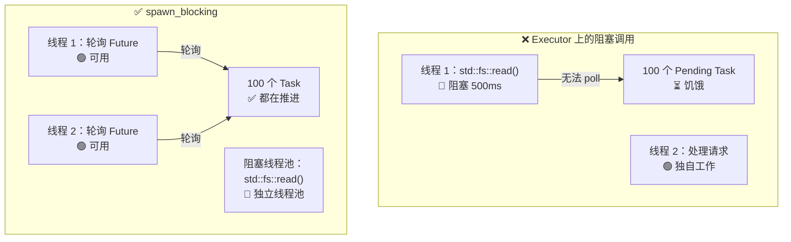

# 12. 常见陷阱🔴

> **您将学到什么：**
> - 9 个常见的异步 Rust 错误以及如何修复每一个错误
> - 为什么阻止执行器是第一大错误（以及如何`spawn_blocking`修复它）
> - 取消风险：当Future在等待中被放弃时会发生什么
> - 调试：`tokio-console`、`tracing`、`#[instrument]`
> - 测试：基于`#[tokio::test]`、`time::pause()`、trait的模拟

## 封锁Executor

异步 Rust 中的#1错误：在异步执行器线程上运行阻塞代码。这会导致其他任务挨饿。

```rust
// ❌错误：阻塞整个执行器线程
async fn bad_handler() -> String {
    let data = std::fs::read_to_string("big_file.txt").unwrap(); // 会阻塞！
    process(&data)
}

// ✅ 正确：将阻塞工作卸载到专用线程池
async fn good_handler() -> String {
    let data = tokio::task::spawn_blocking(|| {
        std::fs::read_to_string("big_file.txt").unwrap()
    }).await.unwrap();
    process(&data)
}

// ✅ 同样正确：使用 tokio 的 async fs
async fn also_good_handler() -> String {
    let data = tokio::fs::read_to_string("big_file.txt").await.unwrap();
    process(&data)
}
```



### std::thread::sleep 与 tokio::time::sleep

```rust
// ❌错误：阻塞执行器线程 5 秒
async fn bad_delay() {
    std::thread::sleep(Duration::from_secs(5)); // 线程无法轮询任何其他内容！
}

// ✅ 正确：屈服于执行器，其他任务可以运行
async fn good_delay() {
    tokio::time::sleep(Duration::from_secs(5)).await; // 非blocking!
}
```

### 按住MutexGuard穿过.await

```rust
use std::sync::Mutex; // std Mutex 不感知 async，可能阻塞 Executor 线程

// ⚠️ 有风险：MutexGuard 横跨.await
async fn bad_mutex(data: &Mutex<Vec<String>>) {
    let mut guard = data.lock().unwrap();
    guard.push("item".into());
    some_io().await; // 守卫在这里——阻止来自locking!的其他线程
    guard.push("another".into());
}
// 注意：这段代码可以编译！std::sync::MutexGuard 是 !Send，但是编译器而已
// 当您将Send传递给需要它的东西时，在Future上强制执行Send
// （例如 tokio::spawn）。直接调用 bad_mutex(...).await 可以正常编译。
// 但是，tokio::spawn(bad_mutex(data)) 将失败并出现 Send 绑定错误。
```

**为什么这通常是一个问题** - 但并非总是如此：

在 `.await` 上持有 `std::sync::Mutex` 会阻塞 **OS 线程**
I/O 的持续时间，防止执行器轮询该 I/O 上的其他任务
线。对于较短的关键部分，这是浪费的；对于长 I/O，它是
性能陷阱。

**但是**，在某些合法情况下，您“必须”持有跨域的锁。
`.await` — 与数据库事务在读取和读取之间持有锁的方式相同
犯罪。删除并重新获取锁会引入 **TOCTOU（检查时间）
到使用时间）竞赛**：另一个任务可以修改你们两个之间的数据
关键部分。正确的修复取决于用例：

```rust
// 选项 1：范围保护——在操作独立时起作用
async fn scoped_mutex(data: &Mutex<Vec<String>>) {
    {
        let mut guard = data.lock().unwrap();
        guard.push("item".into());
    } // 守卫被扔在这里
    some_io().await; // 锁被释放——其他任务可以继续进行
    {
        let mut guard = data.lock().unwrap();
        guard.push("another".into());
    }
}
// ⚠️小心：另一个任务可以锁定+修改两个部分之间的Vec。
//    如果两个推送是独立的，那么这很好，但如果是“另一个”，则错误
//    取决于“item”设置的状态。

// 方案 2：使用 tokio::sync::Mutex，可以跨 .await 持有锁而不阻塞 OS 线程
//           阻塞OS线程。当您需要交易时最好
//           跨 await 点进行读取-修改-写入。
use tokio::sync::Mutex as AsyncMutex;

async fn async_mutex(data: &AsyncMutex<Vec<String>>) {
    let mut guard = data.lock().await; // 异步锁——不阻塞线程
    guard.push("item".into());
    some_io().await; // 可以这样做：tokio Mutex guard 是 Send
    guard.push("another".into());
    // 守卫一直在守卫——没有 TOCTOU 竞赛，没有线程被阻塞。
}
```

> **何时使用哪一种 Mutex**：
> - `std::sync::Mutex`：内部没有`.await`的短临界区
> - `tokio::sync::Mutex`：当你需要跨`.await`点锁定时
> （事务语义，TOCTOU 避免）
> - `parking_lot::Mutex`：直接替换`std`，更快，更小，仍然没有`.await`
>
> **经验法则**：不要盲目地围绕 `.await` 分割关键部分。
> 询问这两半是否真正独立。如果他们不是——如果
> 后半部分取决于前半部分的状态 - 使用 `tokio::sync::Mutex` 或
> 重新设计数据流。

### 取消风险

放弃 future 会取消它——但这可能会让事情处于不一致的状态：

```rust
// ❌危险：取消时资源泄漏
async fn transfer(from: &Account, to: &Account, amount: u64) {
    from.debit(amount).await;  // 如果在这里取消...
    to.credit(amount).await;   // ...钱vanishes!
}

// ✅ 安全：使操作原子化或使用补偿
async fn safe_transfer(from: &Account, to: &Account, amount: u64) -> Result<(), Error> {
    // 使用数据库事务（全有或全无）
    let tx = db.begin_transaction().await?;
    tx.debit(from, amount).await?;
    tx.credit(to, amount).await?;
    tx.commit().await?; // 仅当一切成功时才提交
    Ok(())
}

// ✅ 也安全：使用 tokio::select！有取消意识
tokio::select! {
    result = transfer(from, to, amount) => {
        // 转账完成
    }
    _ = shutdown_signal() => {
        // 不要在传输过程中取消——让它完成
        // 或者：显式回滚
    }
}
```

### 无异步丢弃

Rust 的 `Drop` trait 是同步的 — 你**不能** `.await` 位于 `drop()` 内。这是一个常见的混乱来源：

```rust
struct DbConnection { /* ... */ }

impl Drop for DbConnection {
    fn drop(&mut self) {
        // ❌ 不能这样做 — drop() 是 同步的！
        // self.connection.shutdown().await;

        // ✅ 解决方法 1：生成清理任务（即发即弃）
        let conn = self.connection.take();
        tokio::spawn(async move {
            let _ = conn.shutdown().await;
        });

        // ✅ 解决方法 2：使用同步关闭
        // self.connection.blocking_close();
    }
}
```

**最佳实践**：提供显式的 `async fn close(self)` 方法并记录调用者应该使用它。仅将`Drop`作为安全网，而不是主要的清理路径。

### select！公平与饥饿

```rust
use tokio::sync::mpsc;

// ❌ 不公平：busy_stream 总是获胜，slow_stream 挨饿
async fn unfair(mut fast: mpsc::Receiver<i32>, mut slow: mpsc::Receiver<i32>) {
    loop {
        tokio::select! {
            Some(v) = fast.recv() => println!("fast: {v}"),
            Some(v) = slow.recv() => println!("slow: {v}"),
            // 如果两者都准备好了，tokio随机选择一个。
            // 但如果 `fast` 始终准备就绪，`slow` 很少会被轮询。
        }
    }
}

// ✅ 公平：使用有偏差的select或分批排出
async fn fair(mut fast: mpsc::Receiver<i32>, mut slow: mpsc::Receiver<i32>) {
    loop {
        tokio::select! {
            biased; // 始终按顺序检查——明确的优先级

            Some(v) = slow.recv() => println!("slow: {v}"),  // 优先级更高！
            Some(v) = fast.recv() => println!("fast: {v}"),
        }
    }
}
```

### 意外顺序执行

```rust
// ❌ 顺序：总共需要 2 秒
async fn slow() {
    let a = fetch("url_a").await; // 1秒
    let b = fetch("url_b").await; // 1秒（等待a完成first!）
}

// ✅并发：总共需要 1 秒
async fn fast() {
    let (a, b) = tokio::join!(
        fetch("url_a"), // 两者均立即开始
        fetch("url_b"),
    );
}

// ✅ 同时并发：使用 let + join
async fn also_fast() {
    let fut_a = fetch("url_a"); // 创造Future（懒——还没开始）
    let fut_b = fetch("url_b"); // 创造Future
    let (a, b) = tokio::join!(fut_a, fut_b); // 现在两者同时运行
}
```

> **陷阱**：`let a = fetch(url).await; let b = fetch(url).await;`是连续的！
> 第二个 `.await` 直到第一个完成后才开始。使用 `join!` 或
> `spawn` 用于并发。

## 案例研究：调试挂起的生产服务

真实场景：服务可以正常处理请求 10 分钟，然后停止响应。日志中没有错误。 CPU 为 0%。

**诊断步骤：**

1. **附加 `tokio-console`** — 显示 200 多个任务陷入 `Pending` 状态
2. **检查任务详细信息** — 都在同一个`Mutex::lock().await`等待
3. **根本原因** — 一项任务将 `std::sync::MutexGuard` 跨过 `.await` 并惊慌失措，导致互斥体中毒。所有其他任务现在在 `lock().unwrap()` 上失败

**修复：**

| 之前（破损） | 之后（固定） |
|-----------------|---------------|
| `std::sync::Mutex` | `tokio::sync::Mutex` |
| `.lock().unwrap()`穿过`.await` | `.await`之前范围锁定 |
| 获取锁没有超时 | `tokio::time::timeout(dur, mutex.lock())` |
| 中毒互斥体无法恢复 | `tokio::sync::Mutex` 不会中毒 |

**预防清单：**
- [ ] 如果守卫穿过任何 `.await`，则使用 `tokio::sync::Mutex`
- [ ] 将 `#[tracing::instrument]` 添加到异步函数以进行跨度跟踪
- [ ] 在暂存中运行 `tokio-console` 以尽早捕获挂起的任务
- [ ] 添加健康检查端点以验证任务响应能力

<details>
<summary><strong>🏋️ 练习：发现错误</strong>（点击展开）</summary>

**挑战**：找到此代码中的所有异步陷阱并修复它们。

```rust
use std::sync::Mutex;

async fn process_requests(urls: Vec<String>) -> Vec<String> {
    let results = Mutex::new(Vec::new());
    
    for url in &urls {
        let response = reqwest::get(url).await.unwrap().text().await.unwrap();
        std::thread::sleep(std::time::Duration::from_millis(100)); // 速率限制
        let mut guard = results.lock().unwrap();
        guard.push(response);
        expensive_parse(&guard).await; // 解析到目前为止的所有结果
    }
    
    results.into_inner().unwrap()
}
```

<details>
<summary>🔑 参考答案</summary>

**发现错误：**

1. **顺序获取** — 一次获取一个 URL，而不是同时获取
2. **`std::thread::sleep`** — 阻塞执行器线程
3. **MutexGuard 跨过 `.await`** — 当等待 `expensive_parse` 时，`guard` 处于活动状态
4. **无并发** — 应使用 `join!` 或 `FuturesUnordered`

```rust
use tokio::sync::Mutex;
use std::sync::Arc;
use futures::stream::{self, StreamExt};

async fn process_requests(urls: Vec<String>) -> Vec<String> {
    // 修复 4：与 buffer_unordered 同时处理 URL
    let results: Vec<String> = stream::iter(urls)
        .map(|url| async move {
            let response = reqwest::get(&url).await.unwrap().text().await.unwrap();
            // 修复 2：使用 tokio::time::sleep 代替 std::thread::sleep
            tokio::time::sleep(std::time::Duration::from_millis(100)).await;
            response
        })
        .buffer_unordered(10) // 最多 10 个并发请求
        .collect()
        .await;

    // 修复 3：先收集再解析，这样完全不需要 Mutex
    for result in &results {
        expensive_parse(result).await;
    }

    results
}
```

**关键要点**：通常您可以重构异步代码以完全取消互斥体。使用streams/join收集结果，然后进行处理。更简单、更快、无死锁风险。

</details>
</details>

---

### 调试异步代码

异步栈跟踪是出了名的神秘——它们显示了执行器的轮询循环而不是逻辑调用链。以下是必要的调试工具。

#### tokio-console：实时任务检查器

[tokio-控制台](https://github.com/tokio-rs/console) 为您提供每个衍生任务的类似于 `htop` 的视图：其状态、轮询持续时间、Waker活动和资源使用情况。

```toml
# Cargo.toml
[dependencies]
console-subscriber = "0.4"
tokio = { version = "1", features = ["full", "tracing"] }
```

```rust
#[tokio::main]
async fn main() {
    console_subscriber::init(); // 替换默认的跟踪订阅者
    // ...您的申请的其余部分
}
```

然后在另一个终端中：

```bash
$ RUSTFLAGS="--cfg tokio_unstable" cargo run   # Required compile-time flag
$ tokio-console                                # Connects to 127.0.0.1:6669
```

#### 跟踪 + #[instrument]：异步结构化日志记录

[`tracing`](https://docs.rs/tracing) 板条箱了解 `Future` 生命周期。 Span 在 `.await` 点上保持打开状态，即使操作系统线程已继续运行，也可以为您提供逻辑调用栈：

```rust
use tracing::{info, instrument};

#[instrument(skip(db_pool), fields(user_id = %user_id))]
async fn handle_request(user_id: u64, db_pool: &Pool) -> Result<Response> {
    info!("looking up user");
    let user = db_pool.get_user(user_id).await?;  // 跨度在 .await 范围内保持打开状态
    info!(email = %user.email, "found user");
    let orders = fetch_orders(user_id).await?;     // 仍然相同的跨度
    Ok(build_response(user, orders))
}
```

输出（`tracing_subscriber::fmt::json()`）：

```json
{"timestamp":"...","level":"INFO","span":{"name":"handle_request","user_id":"42"},"message":"looking up user"}
{"timestamp":"...","level":"INFO","span":{"name":"handle_request","user_id":"42"},"fields":{"email":"a@b.com"},"message":"found user"}
```

#### 调试清单

| 症状 | 可能的原因 | 工具 |
|---------|-------------|------|
| 任务永远挂起 | 缺少 `.await` 或陷入僵局 `Mutex` | `tokio-console` 任务视图 |
| 吞吐量低 | 阻塞异步线程上的调用 | `tokio-console` 轮询时间直方图 |
| `Future is not Send` | 非Send型横跨`.await` | 编译错误+`#[instrument]`定位 |
| 神秘取消 | 父级 `select!` 丢弃了一个分支 | `tracing` 跨越生命周期事件 |

> **提示**：启用`RUSTFLAGS="--cfg tokio_unstable"`以获取任务级别指标
> 在 tokio-控制台中。这是一个编译时标志，而不是Runtime标志。

### 测试异步代码

异步代码引入了独特的测试挑战 - 您需要Runtime、时间控制和测试并发行为的策略。

**基本异步测试**与 `#[tokio::test]`：

```rust
// Cargo.toml
// [开发依赖项]
// tokio = { version = "1", features = ["full", "test-util"] }

#[tokio::test]
async fn test_basic_async() {
    let result = fetch_data().await;
    assert_eq!(result, "expected");
}

// 单线程测试（对于!Send类型有用）：
#[tokio::test(flavor = "current_thread")]
async fn test_single_threaded() {
    let rc = std::rc::Rc::new(42);
    let val = async { *rc }.await;
    assert_eq!(val, 42);
}

// 具有显式工作线程数的多线程：
#[tokio::test(flavor = "multi_thread", worker_threads = 2)]
async fn test_concurrent_behavior() {
    // 使用真实并发测试竞争条件
    let counter = std::sync::Arc::new(std::sync::atomic::AtomicU32::new(0));
    let c1 = counter.clone();
    let c2 = counter.clone();
    let (a, b) = tokio::join!(
        tokio::spawn(async move { c1.fetch_add(1, std::sync::atomic::Ordering::SeqCst) }),
        tokio::spawn(async move { c2.fetch_add(1, std::sync::atomic::Ordering::SeqCst) }),
    );
    a.unwrap();
    b.unwrap();
    assert_eq!(counter.load(std::sync::atomic::Ordering::SeqCst), 2);
}
```

**时间操纵** - 测试超时而不实际等待：

```rust
use tokio::time::{self, Duration, Instant};

#[tokio::test]
async fn test_timeout_behavior() {
    // 暂停虚拟时间后，sleep() 会被测试时钟推进，不需要真实等待
    time::pause();

    let start = Instant::now();
    time::sleep(Duration::from_secs(3600)).await; // “等待”1 小时 — 需要 0 毫秒
    assert!(start.elapsed() >= Duration::from_secs(3600));
    // 测试以毫秒为单位运行，而不是 一小时！
}

#[tokio::test]
async fn test_retry_timing() {
    time::pause();

    // 测试我们的重试逻辑是否等待预期的持续时间
    let start = Instant::now();
    let result = retry_with_backoff(|| async {
        Err::<(), _>("simulated failure")
    }, 3, Duration::from_secs(1))
    .await;

    assert!(result.is_err());
    // 1s + 2s + 4s = 7s 的退避（指数）
    assert!(start.elapsed() >= Duration::from_secs(7));
}

#[tokio::test]
async fn test_deadline_exceeded() {
    time::pause();

    let result = tokio::time::timeout(
        Duration::from_secs(5),
        async {
            // 模拟慢速运行
            time::sleep(Duration::from_secs(10)).await;
            "done"
        }
    ).await;

    assert!(result.is_err()); // 超时
}
```

**模拟异步依赖** — 使用 trait 对象或泛型：

```rust
// 定义依赖关系的trait：
trait Storage {
    async fn get(&self, key: &str) -> Option<String>;
    async fn set(&self, key: &str, value: String);
}

// 生产实施：
struct RedisStorage { /* ... */ }
impl Storage for RedisStorage {
    async fn get(&self, key: &str) -> Option<String> {
        // 真正的Redis调用
        todo!()
    }
    async fn set(&self, key: &str, value: String) {
        todo!()
    }
}

// 测试模拟：
struct MockStorage {
    data: std::sync::Mutex<std::collections::HashMap<String, String>>,
}

impl MockStorage {
    fn new() -> Self {
        MockStorage { data: std::sync::Mutex::new(std::collections::HashMap::new()) }
    }
}

impl Storage for MockStorage {
    async fn get(&self, key: &str) -> Option<String> {
        self.data.lock().unwrap().get(key).cloned()
    }
    async fn set(&self, key: &str, value: String) {
        self.data.lock().unwrap().insert(key.to_string(), value);
    }
}

// 测试的功能在存储上是通用的：
async fn cache_lookup<S: Storage>(store: &S, key: &str) -> String {
    match store.get(key).await {
        Some(val) => val,
        None => {
            let val = "computed".to_string();
            store.set(key, val.clone()).await;
            val
        }
    }
}

#[tokio::test]
async fn test_cache_miss_then_hit() {
    let mock = MockStorage::new();

    // 第一次调用：缓存 miss，计算并存储
    let val = cache_lookup(&mock, "key1").await;
    assert_eq!(val, "computed");

    // 第二次调用：命中→返回存储的值
    let val = cache_lookup(&mock, "key1").await;
    assert_eq!(val, "computed");
    assert!(mock.data.lock().unwrap().contains_key("key1"));
}
```

**测试通道和任务通信**：

```rust
#[tokio::test]
async fn test_producer_consumer() {
    let (tx, mut rx) = tokio::sync::mpsc::channel(10);

    tokio::spawn(async move {
        for i in 0..5 {
            tx.send(i).await.unwrap();
        }
        // tx 在这里被丢弃，通道关闭
    });

    let mut received = Vec::new();
    while let Some(val) = rx.recv().await {
        received.push(val);
    }

    assert_eq!(received, vec![0, 1, 2, 3, 4]);
}
```

| 测试图案 | 何时使用 | 关键工具 |
|-------------|-------------|----------|
| `#[tokio::test]` | 所有异步测试 | `tokio = { features = ["macros", "rt"] }` |
| `time::pause()` | 测试超时、重试、周期性任务 | `tokio::time::pause()` |
| trait嘲笑 | 无需 I/O 即可测试业务逻辑 | 通用`<S: Storage>` |
| `current_thread`味道 | 测试 `!Send` 类型或确定性调度 | `#[tokio::test(flavor = "current_thread")]` |
| `multi_thread`味道 | 测试竞争条件 | `#[tokio::test(flavor = "multi_thread")]` |

> **要点 - 常见陷阱**
> - 永远不会阻塞执行器 — 使用 `spawn_blocking` 进行 CPU/同步工作
> - 切勿将 `MutexGuard` 跨过 `.await` — 瞄准镜紧紧锁定或使用 `tokio::sync::Mutex`
> - 取消立即放弃Future——对部分操作使用“取消安全”模式
> - 使用`tokio-console`和`#[tracing::instrument]`调试异步代码
> - 使用 `#[tokio::test]` 和 `time::pause()` 测试异步代码以确定定时

> **另请参阅：** [第 8 章 — Tokio 深入探讨](ch08-tokio-deep-dive.md) 用于同步原语，[第 13 章 — 生产模式](ch13-production-patterns.md) 用于正常关闭和结构化并发

***


