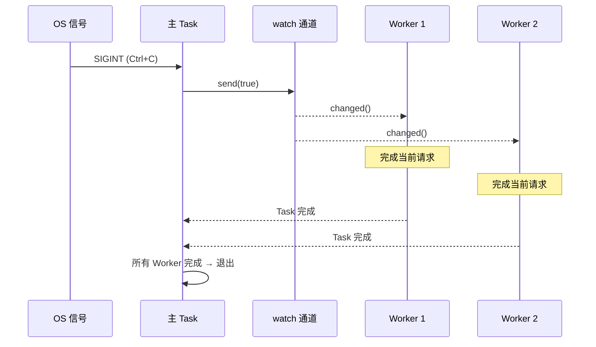

# 13. 生产模式

> **你将学到什么：**
> - 优雅关机（graceful shutdown）：`watch` 通道和 `select!`
> - 背压（backpressure）：有界通道防止 OOM
> - 结构化并发（structured concurrency）：`JoinSet` 和 `TaskTracker`
> - 超时、重试和指数退避
> - 错误处理：`thiserror` vs `anyhow`，双 `?` 模式
> - Tower：axum、tonic、hyper 使用的中间件模式

## 优雅关机

生产服务器必须彻底关闭——完成正在进行的请求、刷新缓冲区、关闭连接：

```rust
// ============================================================================
// 核心架构：watch 通道是一种单生产者多消费者（SPMC）广播原语。
// 每个消费者持有 shutdown_rx.clone()，当主任务发送 shutdown_tx.send(true)
// 时，所有消费者同时收到通知。与 broadcast 不同，watch 只保留最新值，
// 新订阅者只会看到当前状态而非历史值。
//
// 关机流程：Ctrl+C → send(true) → 所有 receiver.changed() 解除阻塞 →
// 停止接受新连接 → 正在进行的请求自行完成 → 超时保护 → 进程退出
// ============================================================================

use tokio::signal;
use tokio::sync::watch;

async fn main_server() {
    // 创建关闭信号通道——初始值为 false（正常运行）
    let (shutdown_tx, shutdown_rx) = watch::channel(false);

    // 启动服务器任务，传入 shutdown_rx 的克隆
    let server_handle = tokio::spawn(run_server(shutdown_rx.clone()));

    // 等待 Ctrl+C（或 SIGTERM）
    signal::ctrl_c().await.expect("Failed to listen for Ctrl+C");
    println!("Shutdown signal received, finishing in-flight requests...");

    // 通知所有任务关闭
    // ⚠️ 注意：生产代码应处理所有接收端已被 Drop 的情况（send 返回 Err）
    shutdown_tx.send(true).unwrap();

    // 等待服务器完成（带 30 秒超时保护）
    // 如果超时，强制退出以避免无限挂起
    match tokio::time::timeout(
        std::time::Duration::from_secs(30),
        server_handle,
    ).await {
        Ok(Ok(())) => println!("Server shut down gracefully"),
        Ok(Err(e)) => eprintln!("Server error: {e}"),
        Err(_) => eprintln!("Server shutdown timed out — forcing exit"),
    }
}

async fn run_server(mut shutdown: watch::Receiver<bool>) {
    loop {
        tokio::select! {
            // 分支 1：接受新连接
            conn = accept_connection() => {
                let shutdown = shutdown.clone(); // → 为每个连接任务克隆 receiver
                tokio::spawn(handle_connection(conn, shutdown)); // → 独立任务处理连接
            }
            // 分支 2：关闭信号到达
            _ = shutdown.changed() => {
                // changed() 在值变化时返回，borrow() 读取当前值
                if *shutdown.borrow() {
                    println!("Stopping accepting new connections");
                    break; // → 退出 loop，不再接受新连接
                }
            }
        }
    }
    // 正在进行的连接将自行完成——它们各自持有 shutdown_rx 克隆
    // 当各自的请求处理完毕后，handle_connection 中的 loop 会 break
}

async fn handle_connection(conn: Connection, mut shutdown: watch::Receiver<bool>) {
    loop {
        tokio::select! {
            // 分支 1：处理下一个请求
            request = conn.next_request() => {
                // 完全处理请求——不在中途放弃
                process_request(request).await;
            }
            // 分支 2：关闭信号
            _ = shutdown.changed() => {
                if *shutdown.borrow() {
                    // 完成当前请求后退出——不丢弃正在处理的请求
                    break;
                }
            }
        }
    }
}
```



### 有界通道的背压

如果生产者比消费者更快，无界通道可能会导致 OOM。在生产中始终使用有界通道：

```rust
// ============================================================================
// 核心概念：mpsc::channel(N) 创建容量为 N 的有界通道。
//   - send().await：缓冲区满时异步等待（产生背压），生产者自动减速
//   - recv().await：缓冲区空时异步等待，消费者无需忙等
//
// 相比之下，unbounded_channel() 的 send() 是同步的——永远成功，不阻塞——
// 导致内存可以无限增长直到 OOM。
// ============================================================================

use tokio::sync::mpsc;

async fn backpressure_example() {
    // 有界通道：最多缓冲 100 个工作项
    // 当 100 个槽位全部被占满时，send().await 会暂停生产者
    let (tx, mut rx) = mpsc::channel::<WorkItem>(100);

    // 生产者：缓冲区满时自然减速
    let producer = tokio::spawn(async move {
        for i in 0..1_000_000 {
            // send() 是 async 的——如果缓冲区满了就在这里等待
            // 这创建了自然的背压机制！
            tx.send(WorkItem { id: i }).await.unwrap();
        }
    });

    // 消费者：按自己的节奏处理元素
    let consumer = tokio::spawn(async move {
        while let Some(item) = rx.recv().await { // → 缓冲区空时等待
            process(item).await; // 处理速度慢也没关系——生产者会自动等待
        }
    });

    let _ = tokio::join!(producer, consumer);
}

// ⚠️ 与无界通道对比——危险：
// let (tx, rx) = mpsc::unbounded_channel(); // 没有背压！
// tx.send(item) 永远立即成功，内存可以无限增长
```

### 结构化并发：JoinSet 和 TaskTracker

`JoinSet` 对相关任务进行分组并确保它们全部完成：

```rust
// ============================================================================
// 核心概念：JoinSet 是一组可动态添加的 spawn 任务集合。
//   - spawn() 添加新任务并返回一个内部 abort handle
//   - join_next() 等待任意一个任务完成（类似 select 但支持动态数量）
//   - 当 JoinSet 被 Drop 时，所有未完成的任务自动 abort
//
// 与传统 spawn 的区别：传统 spawn 返回 JoinHandle 需要手动收集，
// JoinSet 统一管理生命周期——集合 drop 时保证没有任务在后台继续运行。
// ============================================================================

use tokio::task::JoinSet;
use tokio::time::{sleep, Duration};

async fn structured_concurrency() {
    let mut set = JoinSet::new();

    // 批量 spawn 任务——每个任务处理一个 URL
    for url in get_urls() {
        set.spawn(async move {
            fetch_and_process(url).await
        });
    }

    // 收集所有结果（不保证完成顺序）
    // join_next() 返回已完成的任一任务，未完成的继续在后台运行
    let mut results = Vec::new();
    while let Some(result) = set.join_next().await {
        match result {
            Ok(Ok(data)) => results.push(data),    // → 任务成功完成
            Ok(Err(e)) => eprintln!("Task error: {e}"), // → 任务返回 Err
            Err(e) => eprintln!("Task panicked: {e}"),  // → 任务 panic
        }
    }

    // 所有任务在此处均已完成——没有悬而未决的后台工作
    println!("Processed {} items", results.len());
}

// ============================================================================
// TaskTracker (tokio-util 0.7.9+) — 另一种结构化并发工具
// 与 JoinSet 不同：不关心任务返回值，只追踪任务数量和等待全部完成
// close() 后不能再添加新任务，wait() 等待所有已追踪任务完成
// ============================================================================

use tokio_util::task::TaskTracker;

async fn with_tracker() {
    let tracker = TaskTracker::new();

    for i in 0..10 {
        tracker.spawn(async move {
            sleep(Duration::from_millis(100 * i)).await; // 不同任务休眠不同时长
            println!("Task {i} done");
        });
    }

    tracker.close(); // → 不再接受新任务
    tracker.wait().await; // → 等待所有已追踪的任务完成
    println!("All tasks finished");
}
```

### 超时和重试

```rust
// ============================================================================
// 核心概念：外部 API 调用必须有超时保护——永远不要无限等待。
//   - timeout(dur, fut)：dur 后强制取消 fut，返回 Err(Elapsed)
//   - 指数退避重试：每次失败后等待时间翻倍，避免重试风暴
//
// Elapsed 错误包装了原 Future 的取消，内部结果丢失——因此超时和内部
// 错误应分别处理。
// ============================================================================

use tokio::time::{timeout, sleep, Duration};

// 简单的超时包装
async fn with_timeout() -> Result<Response, Error> {
    match timeout(Duration::from_secs(5), fetch_data()).await {
        Ok(Ok(response)) => Ok(response),       // → 在 5 秒内成功返回
        Ok(Err(e)) => Err(Error::Fetch(e)),      // → 内部操作失败（保留原始错误）
        Err(_) => Err(Error::Timeout),            // → 超时，内部结果被丢弃
    }
}

// 指数退避重试——泛型设计支持任意异步操作
// F 是闭包工厂：每次重试都调用 F() 创建新的 Future（因为原 Future 可能已被消费）
async fn retry_with_backoff<F, Fut, T, E>(
    max_attempts: u32,
    base_delay_ms: u64,
    operation: F,
) -> Result<T, E>
where
    F: Fn() -> Fut,                                     // F 返回一个新的 Future
    Fut: std::future::Future<Output = Result<T, E>>,     // Future 的输出是 Result
    E: std::fmt::Display,
{
    let mut delay = Duration::from_millis(base_delay_ms); // 初始延迟

    for attempt in 1..=max_attempts {
        match operation().await {  // → 每次创建新的 Future 并 await
            Ok(result) => return Ok(result), // → 成功，直接返回
            Err(e) => {
                if attempt == max_attempts {
                    eprintln!("Final attempt {attempt} failed: {e}");
                    return Err(e); // → 最后一次尝试也失败，放弃
                }
                eprintln!("Attempt {attempt} failed: {e}, retrying in {delay:?}");
                sleep(delay).await; // → 等待后重试
                delay *= 2;         // → 指数退避：100ms → 200ms → 400ms → ...
            }
        }
    }
    unreachable!() // 编译器需要——上面的循环总会 return 或 continue
}

// 用法示例：
// let result = retry_with_backoff(3, 100, || async {
//     reqwest::get("https://api.example.com/data").await
// }).await?;
```

> **生产技巧——添加抖动**：上面的函数使用纯指数退避，但在
> 生产环境中，许多客户端同时失败会以相同的时间间隔重试（惊群效应）。
> 添加随机*抖动*——例如，`sleep(delay + rand_jitter)`，其中 `rand_jitter` 是
> `0..delay/4`——以分散重试时间。

### 异步代码中的错误处理

异步引入了独特的错误传播挑战——spawn 的任务创建错误边界，超时错误包装内部错误，并且当 Future 跨越任务边界时 `?` 会以不同的方式交互。

**`thiserror` 与 `anyhow`** — 选择正确的工具：

```rust
// ============================================================================
// thiserror：适合库和公共 API 的类型化错误定义。
// #[derive(Error)] 自动生成 Display 和 std::error::Error 实现。
// #[from] 自动生成 From<T> 实现，使 ? 操作符可以自动转换错误类型。
//
// anyhow：适合应用程序和原型的类型擦除错误处理。
// .context() 为错误链添加人类可读的上下文描述，
// 最终错误信息是自上而下的链式描述。
// ============================================================================

// thiserror：为库和公共 API 定义类型化错误
// 每个变体都是明确的——调用者可以匹配特定的错误
use thiserror::Error;

#[derive(Error, Debug)]
enum DiagError {
    #[error("IPMI command failed: {0}")]
    Ipmi(#[from] IpmiError),  // #[from] 使 ? 自动将 IpmiError 转换为 DiagError

    #[error("Sensor {sensor} out of range: {value}°C (max {max}°C)")]
    OverTemp { sensor: String, value: f64, max: f64 },

    #[error("Operation timed out after {0:?}")]
    Timeout(std::time::Duration),

    #[error("Task panicked: {0}")]
    TaskPanic(#[from] tokio::task::JoinError), // spawn 任务 panic 时自动转换
}

// anyhow：适合应用程序和原型快速处理错误
// anyhow::Error 包装任何实现了 std::error::Error 的类型
// .context() 在 ? 传播链上附加人类可读的上文
use anyhow::{Context, Result};

async fn run_diagnostics() -> Result<()> {
    let config = load_config()
        .await
        .context("Failed to load diagnostic config")?;  // → 如果失败：附加"加载配置失败"

    let result = run_gpu_test(&config)
        .await
        .context("GPU diagnostic failed")?;              // → 如果失败：附加"GPU 诊断失败"

    Ok(())
}
// anyhow 的错误链输出："GPU diagnostic failed: IPMI command failed: timeout"
```

| crate | 使用时机 | 错误类型 | 匹配方式 |
|-------|----------|-----------|----------|
| `thiserror` | 库代码、公共 API | `enum MyError { ... }` | `match err { MyError::Timeout => ... }` |
| `anyhow` | 应用程序、CLI 工具、脚本 | `anyhow::Error`（类型擦除） | `err.downcast_ref::<MyError>()` |
| 两者结合 | 库暴露 `thiserror`，应用程序用 `anyhow` 包装 | 两全其美 | 库错误类型化，应用不关心具体类型 |

**双 `?` 模式**与 `tokio::spawn`：

```rust
// ============================================================================
// 核心概念：tokio::spawn 返回 JoinHandle<T>，其中 T 是任务内部返回的类型。
//   - handle.await 返回 Result<T, JoinError>  —— 第一层 Result
//   - 如果 T 本身就是 Result<U, E>           —— 第二层 Result
//   因此 handle.await?? 需要两个 ?：第一个展开 JoinError，第二个展开内部结果。
// ============================================================================

use thiserror::Error;
use tokio::task::JoinError;

#[derive(Error, Debug)]
enum AppError {
    #[error("HTTP error: {0}")]
    Http(#[from] reqwest::Error),

    #[error("Task panicked: {0}")]
    TaskPanic(#[from] JoinError),
}

async fn spawn_with_errors() -> Result<String, AppError> {
    let handle = tokio::spawn(async {
        let resp = reqwest::get("https://example.com").await?; // → ? 传播 reqwest 错误
        Ok::<_, reqwest::Error>(resp.text().await?)            // → 需要类型注解
    });

    // 双 ? 模式：
    //   第一个 ?：展开 JoinError（任务 panic → AppError::TaskPanic）
    //   第二个 ?：展开内部 Result（reqwest 错误 → AppError::Http）
    let result = handle.await??;
    Ok(result)
}
```

**错误边界问题** — `tokio::spawn` 会丢失上下文：

```rust
// ============================================================================
// 当错误跨越 spawn 边界时，调用者只知道"某个生成的任务失败了"——
// 失败任务内部的变量名、调用栈、业务上下文全部丢失。
// 解决方案：在 spawn 边界内部添加 .context()，在外部也为 JoinError 添加。
// ============================================================================

// ❌ 错误上下文在 spawn 边界处丢失：
async fn bad_error_handling() -> Result<()> {
    let handle = tokio::spawn(async {
        some_fallible_work().await  // → 返回 Result<T, SomeError>
    });

    // handle.await 返回 Result<Result<T, SomeError>, JoinError>
    // 如果失败，只能看到 JoinError（panic 信息）或 SomeError（无业务上下文）
    let result = handle.await??;
    Ok(())
}

// ✅ 在 spawn 边界内补充上下文：
async fn good_error_handling() -> Result<()> {
    let handle = tokio::spawn(async {
        some_fallible_work()
            .await
            .context("worker task failed")   // → 穿越 spawn 边界前附加上下文
    });

    let result = handle.await
        .context("worker task panicked")??;  // → 也为 JoinError 附加上下文
    Ok(())
}
```

**超时错误** — 包装与保留：

```rust
// ============================================================================
// timeout() 返回 Result<T, Elapsed>，其中 Elapsed 是 tokio 的超时错误类型。
// 当超时发生时内部 Future 被取消，原错误信息丢失。需要显式地将 Elapsed
// 转换为你自己的错误类型以保留超时语义。
// ============================================================================

use tokio::time::{timeout, Duration};

async fn with_timeout_context() -> Result<String, DiagError> {
    let dur = Duration::from_secs(30);
    match timeout(dur, fetch_sensor_data()).await {
        Ok(Ok(data)) => Ok(data),                   // → 成功：正常返回数据
        Ok(Err(e)) => Err(e),                       // → 内部失败：保留原始错误
        Err(_) => Err(DiagError::Timeout(dur)),      // → 超时：转换为类型化错误
    }
}
```

### Tower：中间件模式

[Tower](https://docs.rs/tower) crate 定义了一个可组合的 `Service` trait——Rust 中异步中间件的骨干（被 `axum`、`tonic`、`hyper` 等框架使用）：

```rust
// ============================================================================
// Service trait 是 Tower 的核心抽象：
//   - poll_ready：检查服务是否可接受新请求（用于背压/限流）
//   - call：处理请求并返回 Future<Output = Result<Response, Error>>
//
// 关键在于 call 返回的 Future 类型是关联类型——每个 Service 可以有自己的
// Future 类型，编译器在编译期单态化，零运行时开销。
// ============================================================================

// Tower 的核心 trait（简化）：
pub trait Service<Request> {
    type Response;
    type Error;
    type Future: Future<Output = Result<Self::Response, Self::Error>>;

    fn poll_ready(&mut self, cx: &mut Context<'_>) -> Poll<Result<(), Self::Error>>;
    fn call(&mut self, req: Request) -> Self::Future;
}
```

中间件包装了 `Service` 以添加横切行为——日志记录、超时、速率限制——而不修改内部逻辑：

```rust
// ============================================================================
// ServiceBuilder 使用洋葱模型组合中间件层：
//   越靠外的 layer 越早处理请求、越晚处理响应。
//   本例中：请求先经过 TimeoutLayer → RateLimitLayer → my_handler
//           响应逆向：my_handler → RateLimitLayer → TimeoutLayer
// ============================================================================

use tower::{ServiceBuilder, timeout::TimeoutLayer, limit::RateLimitLayer};
use std::time::Duration;

let service = ServiceBuilder::new()
    .layer(TimeoutLayer::new(Duration::from_secs(10)))       // 最外层：10 秒超时
    .layer(RateLimitLayer::new(100, Duration::from_secs(1))) // 中间层：每秒 100 请求
    .service(my_handler);                                     // 最内层：你的业务代码
```

**为什么这很重要**：如果你使用过 ASP.NET 中间件或 Express.js 中间件，Tower 就是 Rust 的等价物。这就是生产级 Rust 服务如何在不重复代码的情况下添加横切关注点的方式。

### 练习：使用工作池优雅关机

<details>
<summary>练习（点击展开）</summary>

**挑战**：构建一个任务处理器，具有基于通道的工作队列、N 个工作任务以及按 Ctrl+C 优雅关机。工作人员应在退出前完成正在进行的任务。

<details>
<summary>参考答案</summary>

```rust
// ============================================================================
// 架构设计：
//   1. mpsc channel(100) 作为有界工作队列（带背压）
//   2. watch channel 用于广播关闭信号
//   3. Arc<Mutex<Receiver>> 允许多个 worker 共享同一个接收端
//   4. 每个 worker 在 select! 中同时等待工作项和关闭信号
//
// 关机流程：提交工作 → Ctrl+C → shutdown_tx.send(true) →
// 各 worker 停止接收新工作 → 完成当前工作项 → break → join handles
// ============================================================================

use tokio::sync::{mpsc, watch};
use tokio::time::{sleep, Duration};

struct WorkItem { id: u64, payload: String }

#[tokio::main]
async fn main() {
    // 工作队列：容量 100，提供背压
    let (work_tx, work_rx) = mpsc::channel::<WorkItem>(100);
    // 关闭信号：初始值 false
    let (shutdown_tx, shutdown_rx) = watch::channel(false);
    // 多 worker 共享接收端——用 Arc<Mutex<>> 包装以实现互斥访问
    let work_rx = std::sync::Arc::new(tokio::sync::Mutex::new(work_rx));

    let mut handles = Vec::new();
    for id in 0..4 {  // → 启动 4 个 worker
        let rx = work_rx.clone();           // → Arc clone：共享所有权
        let mut shutdown = shutdown_rx.clone(); // → 每个 worker 独立的 watch receiver
        handles.push(tokio::spawn(async move {
            loop {
                // 在一个作用域内获取锁、等待工作/信号、然后释放锁
                let item = {
                    let mut rx = rx.lock().await; // → 异步获取锁（不阻塞线程）
                    tokio::select! {
                        item = rx.recv() => item,   // → 有新工作到达
                        _ = shutdown.changed() => { // → 关闭信号
                            if *shutdown.borrow() { None } else { continue }
                        }
                    }
                }; // 锁在此处自动释放（guard 离开作用域）
                match item {
                    Some(work) => {
                        println!("Worker {id}: processing {}", work.id);
                        sleep(Duration::from_millis(200)).await; // → 模拟处理
                    }
                    None => break, // → 通道关闭且关闭信号已收到：退出循环
                }
            }
        }));
    }

    // 提交 20 个工作项
    for i in 0..20 {
        let _ = work_tx.send(WorkItem { id: i, payload: format!("task-{i}") }).await;
        sleep(Duration::from_millis(50)).await; // 模拟间歇性提交
    }

    // 收到 Ctrl+C 时：发出关闭信号，等待所有 worker
    tokio::signal::ctrl_c().await.unwrap();
    shutdown_tx.send(true).unwrap();
    for h in handles { let _ = h.await; } // → 等待所有 worker 退出
    println!("Shut down cleanly.");
}
```

</details>
</details>

> **关键要点——生产模式**
> - 使用 `watch` 通道 + `select!` 协调优雅关机
> - 有界通道 (`mpsc::channel(N)`) 提供**背压** —— 缓冲区满时发送者会阻塞
> - `JoinSet` 和 `TaskTracker` 提供**结构化并发**：追踪、终止和等待任务组
> - 始终为网络操作添加超时 — `tokio::time::timeout(dur, fut)`
> - Tower 的 `Service` trait 是生产级 Rust 服务的标准中间件模式

> **另请参阅：** [第 8 章 — Tokio 深入探讨](ch08-tokio-deep-dive.md) 了解通道和同步原语，[第 12 章 — 常见陷阱](ch12-common-pitfalls.md) 了解关机期间的取消风险

***
