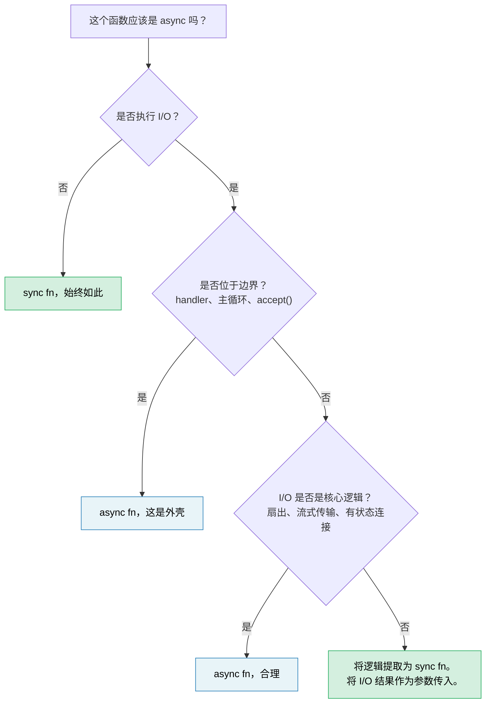

# 14. 异步（async）是一种优化，而不是一种架构

> **你将学到什么：**
> - 为什么异步往往污染整个代码库——以及为什么这是一个设计缺陷，而非特性
> - "同步核心，异步外壳"模式，让大多数代码保持可测试和可调试
> - 如何处理困难情况：*同样*需要 I/O 的逻辑
> - 当 `spawn_blocking` 是解决方法还是症状时
> - 当异步真正属于你的核心逻辑时
> - 为什么同步优先的库比异步优先的库更可组合

你已经花了 13 章学习异步 Rust。这是本书想要告诉你的最重要的事情：**大部分代码不应该是异步的。**

## 函数着色（function coloring）问题

Bob Nystrom 的[《你的函数是什么颜色？》](https://journal.stuffwithstuff.com/2015/02/01/what-color-is-your-function/)指出了核心问题：异步函数可以调用同步函数，但同步函数不能调用异步函数。一旦一个函数变为异步，调用链中其上方的所有内容都必须跟随。

在 Rust 中，这比 C# 或 JavaScript 中**更糟糕**，因为异步不仅影响函数签名，还会影响类型：

| 同步代码 | 异步等效项 | 为什么不一样 |
|---|---|---|
| `fn process(&self)` | `async fn process(&self)` | 调用者也必须是异步的 |
| `&mut T` | `Arc<Mutex<T>>` | spawn 的任务需要 `'static + Send` |
| `std::sync::Mutex` | `tokio::sync::Mutex` | 如果跨 `.await` 需要不同类型 |
| `impl Trait` 返回值 | `impl Future<Output = T> + Send` | 自 RPITIT（Rust 1.75，第 10 章）以来更简单，但仍然着色 |
| `#[test]` | `#[tokio::test]` | 测试需要运行时 |
| 栈跟踪：5 帧 | 栈跟踪：25 帧 | 一半是运行时内部帧 |

每一行都是开发者必须做出、正确执行并维护的决定，而这些都与业务逻辑无关。业界正在远离这一点：Java 的 Project Loom（虚拟线程）和 Go 的 goroutine 都可以让你编写运行时复用线程的同步代码。Rust 选择显式异步来实现零成本控制，但这种控制具有复杂性成本，应有意识地支付，而不是默认接受。

## "但是线程很昂贵"

一个常见的反驳："我们需要异步，因为线程很昂贵。"在大多数团队运作的规模上，这个说法大部分是错误的。

- **栈内存：** 每个 OS 线程保留 8MB 的虚拟地址空间（Linux 默认），但操作系统仅为实际触及的页面提交物理内存——大部分空闲线程只使用 20-80KB 物理内存。
- **上下文切换：** 现代硬件上约为 1-5μs。对于 50 个并发请求，这是噪声。在 100K 次切换/秒的情况下，它才变得可测量。
- **创建成本：** Linux 上每个线程约为 10-30μs。线程池（rayon、`std::thread::scope`）将其摊销为零。

异步获得其复杂性的诚实阈值大约是 **1K-10K 并发的大部分空闲连接**——每个连接的栈成为实际成本的 epoll/io_uring 最佳区域。在此之下，线程池更简单、调试更快、且足够快速。在此之上，异步胜出。大多数服务都低于这个水平。

## 困难的例子：同样需要 I/O 的逻辑

一个简单的纯函数——`fn add(a: i32, b: i32) -> i32`——显然不需要异步。这不是有趣的教训。有趣的情况是，当业务逻辑"似乎"在中间需要 I/O 时：检查库存的验证、查询汇率的定价、查找客户的订单流水线。

考虑订单处理服务。异步无处不在的版本看起来似乎很自然：

### 版本 A：异步贯穿核心

```rust
// ============================================================================
// 版本 A 的问题：validate_items、validate_quantities、calculate_pricing、
// Receipt::new 都是纯函数，它们不需要 I/O。但因为步骤 2（库存查询）和
// 步骤 4（折扣查询）需要 .await，整个 process_order 必须是 async fn，
// 链条上的所有调用者都被"着色"为异步。
//
// 后果：纯函数的单元测试需要 #[tokio::test]，栈跟踪充满运行时帧，
// 这些函数无法在 CLI/WASM/批处理中复用——仅仅因为它们是异步函数。
// ============================================================================

// order.rs — async 贯穿到底

pub async fn process_order(order: Order) -> Result<Receipt, OrderError> {
    // 步骤 1：验证——纯业务规则，无 I/O
    validate_items(&order)?;
    validate_quantities(&order)?;

    // 步骤 2：检查库存 — 需要调用数据库
    let stock = inventory_client.check(&order.items).await?;
    if !stock.all_available() {
        return Err(OrderError::OutOfStock(stock.missing()));
    }

    // 步骤 3：计算定价 — 纯数学，但是是 async 的，因为我们已经在这个上下文里了
    let pricing = calculate_pricing(&order, &stock);

    // 步骤 4：应用折扣 — 需要调用外部服务
    let discount = discount_service.lookup(order.customer_id).await?;
    let final_price = pricing.apply_discount(discount);

    // 步骤 5：格式化收据，纯函数
    Ok(Receipt::new(order, final_price))
}
```

这是*表面上合理*的异步代码。没有 `Arc<Mutex>` 滥用——只是顺序等待。大多数开发者都会这样写然后继续前进。但看看发生了什么：`validate_items`、`validate_quantities`、`calculate_pricing` 和 `Receipt::new` 都是纯函数，它们被拖入异步上下文，仅仅因为步骤 2 和 4 需要 I/O。整个函数必须是异步的，其测试需要运行时，而链上的每个调用者现在都被"着色"了。

### 版本 B：同步核心，异步外壳

另一种选择：将"决定什么"与"如何获取"分开：

```rust
// ============================================================================
// core.rs — 纯业务逻辑模块
// 零 async 依赖，零 tokio 依赖。所有函数接收 I/O 的*结果*作为参数，
// 而不是自己去获取。因此它们是纯函数，可在任何上下文中使用。
// ============================================================================

// core.rs — 纯业务逻辑，零 async，零 tokio 依赖

pub fn validate_order(order: &Order) -> Result<ValidatedOrder, OrderError> {
    validate_items(order)?;
    validate_quantities(order)?;
    Ok(ValidatedOrder::from(order))
}

pub fn check_stock(
    order: &ValidatedOrder,
    stock: &StockResult,
) -> Result<StockedOrder, OrderError> {
    if !stock.all_available() {
        return Err(OrderError::OutOfStock(stock.missing()));
    }
    Ok(StockedOrder::from(order, stock))
}

pub fn finalize(
    order: &StockedOrder,
    discount: Discount,
) -> Receipt {
    let pricing = calculate_pricing(order);
    let final_price = pricing.apply_discount(discount);
    Receipt::new(order, final_price)
}
```

```rust
// ============================================================================
// shell.rs — 轻量异步协调器
// 此模块的唯一职责是：获取数据（I/O） → 调用同步核心（纯逻辑） → 循环。
// 模式：获取 → 决定 → 获取 → 决定 的流水线。
// 每个"决定"步骤都是同步函数，将 I/O 结果作为输入，而非直接获取。
// ============================================================================

// shell.rs — 薄 async 协调器
//
// 注意：网络调用上的 `?` 需要 `impl From<reqwest::Error> for OrderError`
// （或统一的错误枚举）。异步错误处理模式见第 12 章。

use crate::core;

pub async fn process_order(order: Order) -> Result<Receipt, OrderError> {
    // 同步：验证业务规则——由 core 处理
    let validated = core::validate_order(&order)?;

    // 异步：获取库存数据——这是 shell 的职责
    let stock = inventory_client.check(&validated.items).await?;

    // 同步：将库存数据传入核心逻辑——stock 是纯数据输入
    let stocked = core::check_stock(&validated, &stock)?;

    // 异步：获取折扣信息——shell 再次履行 I/O 职责
    let discount = discount_service.lookup(order.customer_id).await?;

    // 同步：组装最终结果——core 完成计算
    Ok(core::finalize(&stocked, discount))
}
```

异步外壳是一个**获取 → 决定 → 获取 → 决定**的流水线。每个"决定"步骤都是一个同步函数，它将 I/O 结果作为输入，而不是直接去获取它。

### 测试差异

同步核心测试每个业务规则，无需运行时或模拟：

```rust
// ============================================================================
// 核心优势：纯业务逻辑的测试完全不需要异步运行时。
// 测试输入由简单的测试夹具函数构造（如 validated_order、stock_result），
// 无需启动 HTTP mock 服务器或数据库。
// ============================================================================

#[test]
fn out_of_stock_rejects_order() {
    let order = validated_order(vec![item("widget", 10)]);  // → 构造测试订单
    let stock = stock_result(vec![("widget", 3)]);           // → 构造库存（仅 3 个可用）

    let result = core::check_stock(&order, &stock);          // → 纯同步调用
    assert_eq!(result.unwrap_err(), OrderError::OutOfStock(vec!["widget"]));
}

#[test]
fn discount_applied_correctly() {
    let order = stocked_order(100_00); // 价格以分为单位（100.00）
    let receipt = core::finalize(&order, Discount::Percent(15));
    assert_eq!(receipt.final_price, 85_00); // → 15% 折扣后应为 85.00
}
```

异步外壳获得更薄的"集成"测试，用于验证接线而非逻辑：

```rust
// ============================================================================
// 集成测试仅验证 shell 的编排流程是否正确——数据是否正确地在模块间传递。
// 业务逻辑的正确性已通过上述同步测试充分证明。
// ============================================================================

#[tokio::test]
async fn process_order_integration() {
    let mock_inventory = mock_service(/* 返回预设库存 */);
    let mock_discounts = mock_service(/* 返回 10% 折扣 */);
    let receipt = process_order(sample_order()).await.unwrap();
    assert!(receipt.final_price > 0);
    // 逻辑正确性已由上述核心测试充分证明
}
```

### 为什么这很重要

| 关注点 | 异步贯穿核心 | 同步核心 + 异步外壳 |
|---|---|---|
| 无需运行时即可测试业务规则 | 否 | **是** |
| 需要 `#[tokio::test]` 的单元测试数量 | 全部 | **仅集成测试** |
| I/O 故障与逻辑错误纠缠在一起 | 是 — 一种 `Result` 类型同时处理两者 | **否** — 同步返回逻辑错误，shell 处理 I/O 错误 |
| `validate_order` 可在 CLI / WASM / 批处理中复用 | 否 — 传递性地引入 tokio | **是** — 纯 `fn` |
| 通过业务逻辑的栈跟踪 | 与运行时帧交错 | **干净的** |
| 后续可将 HTTP 客户端替换为 gRPC | 需要修改核心函数 | **仅修改外壳** |

关键洞察：**步骤 2 和 4 中的 I/O 调用*不需要*处于业务逻辑内部。它们是它的输入。** 同步核心将 `StockResult` 和 `Discount` 作为参数接收。这些值从何而来——HTTP、gRPC、测试夹具、缓存——是外壳关心的问题。

## `spawn_blocking` 的气味

第 12 章介绍了 `spawn_blocking` 作为意外阻塞执行器的修复手段。当你有一个一次性阻塞调用时，这是正确的答案——`std::fs::read`、压缩库、遗留的 FFI 函数。

但如果你发现自己将大段代码包装在 `spawn_blocking` 中：

```rust
// ============================================================================
// 反模式：整个请求处理被包装在 spawn_blocking 中。
// 这意味着 validate、enrich、process、format_response 全部是同步的——
// 它们从一开始就不需要异步。边界被放错了位置。
// ============================================================================

async fn handler(req: Request) -> Response {
    // 如果这是你的代码库，则边界位于错误的位置
    tokio::task::spawn_blocking(move || {
        let validated = validate(&req);       // 同步
        let enriched = enrich(validated);      // 同步
        let result = process(enriched);        // 同步
        let output = format_response(result);  // 同步
        output
    }).await.unwrap()
}
```

……这就是代码库在告诉你：**这个逻辑从一开始就不是异步的。** 你不需要 `spawn_blocking`——你需要一个异步处理程序直接调用的同步模块：

```rust
// ============================================================================
// 正确做法：异步 handler 直接调用同步核心模块。
// 普通业务逻辑以微秒级运行——在异步线程上同步执行完全没问题，
// 不会让执行器饥饿。只有真正重 CPU 的工作才需要 spawn_blocking。
// ============================================================================

async fn handler(req: Request) -> Response {
    // validate → enrich → process → format 全是同步的。
    // 不需要 spawn_blocking——它们快速且 CPU 消耗低。
    let response = my_core::handle(req); // → 同步调用，在执行器线程上直接执行
    response
}
```

为真正繁重的 CPU 工作（解析大负载、图像处理、压缩）保留 `spawn_blocking`，这些工作的耗时确实会让执行器饥饿。对于以微秒级运行的普通业务逻辑，直接同步调用更简单、更正确。

## 库：同步优先，异步包装器可选

对于库作者来说，边界问题更为重要。同步库可以被同步和异步调用者使用：

```rust
// ============================================================================
// 同步库的优势：可以在任何上下文中使用——同步 CLI、异步 handler、
// spawn_blocking 内部——由调用者决定是否卸载到后台线程，而非库强制。
// ============================================================================

// 同步库——随处可用
let report = my_lib::analyze(&data);

// 调用者 A：同步 CLI
fn main() {
    let report = my_lib::analyze(&data);
    println!("{report}");
}

// 调用者 B：异步 handler，正常工作
async fn handler() -> Json<Report> {
    let report = my_lib::analyze(&data); // → 在异步上下文中同步调用——完全没问题
    Json(report)
}

// 调用者 C：重 CPU 分析——调用者决定是否卸载到后台线程
async fn handler_heavy() -> Json<Report> {
    let data = data.clone();
    let report = tokio::task::spawn_blocking(move || {
        my_lib::analyze(&data) // → 调用者自主控制异步边界
    }).await.unwrap();
    Json(report)
}
```

异步库强制*所有*调用者进入运行时：

```rust
// ============================================================================
// 异步库的限制：所有调用者必须处于异步上下文中。
// 同步调用者被迫创建新的 Runtime 并调用 block_on——这是脆弱且容易出错的
// （如果已经在 Runtime 内则会 panic）。
// ============================================================================

// 异步库 — 只能在异步上下文中使用
let report = my_lib::analyze(&data).await; // 调用者必须是 async

// 同步调用者？现在需要 block_on，并且只能祈祷没有嵌套 Runtime
let report = tokio::runtime::Runtime::new().unwrap().block_on(
    my_lib::analyze(&data)
); // 脆弱，如果在已有 Runtime 内会 panic
```

**默认使用同步 API。** 如果你的库进行纯计算、数据转换或解析，没有理由让它异步。如果它执行 I/O，请考虑提供一个同步核心，并在 feature flag 后面提供一个可选的异步便利层——让调用者拥有边界决策权。

## 当异步属于核心时

并不是所有东西都可以干净地分离。在以下情况下，异步属于你的核心逻辑：

- **扇出/扇入本身就是逻辑。** 如果你的业务规则是"同时查询 5 个定价服务并返回最便宜的"，那么并发性*就是*逻辑，而不是管道细节。通过同步 + 线程来强制实现是在用更糟糕的方式重新发明异步。

- **流本身就是逻辑。** 使用背压处理连续事件流——流管理是重要的业务逻辑，而不仅仅是 I/O 包装器。

- **长时间有状态连接。** WebSocket 处理程序、gRPC 双向流和协议状态机的状态转换本质上与 I/O 事件相关。[第 17 章](ch17-capstone-project.md)中的 Capstone 项目（异步聊天服务器）正是这种情况：并发连接、基于房间的扇出和优雅关机从根本上来说是异步工作。

**测试方法：** 如果从函数中删除 `async` 需要用线程、通道或手动轮询来替换它，那么异步就发挥了它应有的作用。如果删除 `async` 仅仅意味着删除关键字而不做其他更改，则它从来不需要异步。

## 决策规则



> **经验法则：** 从同步开始。仅在最外层 I/O 边界添加异步。仅当你能够清楚地阐明*哪些并发 I/O 操作*证明了复杂性税是合理的时，才向内移动异步边界。

---

<details>
<summary><strong>练习：提取同步核心</strong>（点击展开）</summary>

以下 axum 处理程序具有异步污染——业务逻辑与 I/O 混合。将其重构为同步核心模块和薄异步外壳。

```rust
// ============================================================================
// 此代码的问题：3 处 HTTP 调用和业务逻辑（传感器校准、健康分类）混合在
// 一个 async fn 中。导致：
//   1. 测试必须启动 mock HTTP 服务器或用 #[tokio::test]
//   2. 校准数学和阈值逻辑无法在非异步上下文中复用
//   3. 函数过长（30+ 行），职责不清
// ============================================================================

use axum::{Json, extract::Path};

async fn get_device_report(Path(device_id): Path<String>) -> Result<Json<Report>, AppError> {
    // 通过 HTTP 从设备获取原始遥测数据
    let raw = reqwest::get(format!("http://bmc-{device_id}/telemetry"))
        .await?
        .json::<RawTelemetry>()
        .await?;

    // 业务逻辑：将原始传感器读数转换为校准值
    let mut readings = Vec::new();
    for sensor in &raw.sensors {
        let calibrated = (sensor.raw_value as f64) * sensor.scale + sensor.offset;
        if calibrated < sensor.min_valid || calibrated > sensor.max_valid {
            return Err(AppError::SensorOutOfRange {
                name: sensor.name.clone(),
                value: calibrated,
            });
        }
        readings.push(CalibratedReading {
            name: sensor.name.clone(),
            value: calibrated,
            unit: sensor.unit.clone(),
        });
    }

    // 业务逻辑：对设备健康状况进行分类
    let critical_count = readings.iter()
        .filter(|r| r.value > 90.0)
        .count();
    let health = if critical_count > 2 { Health::Critical }
                 else if critical_count > 0 { Health::Warning }
                 else { Health::Ok };

    // 从库存服务获取设备元数据
    let meta = reqwest::get(format!("http://inventory/devices/{device_id}"))
        .await?
        .json::<DeviceMetadata>()
        .await?;

    Ok(Json(Report {
        device_id,
        device_name: meta.name,
        health,
        readings,
        timestamp: chrono::Utc::now(),
    }))
}
```

**你的目标：**

1. 使用同步函数创建 `core.rs`：`calibrate_sensors`、`classify_health` 和 `build_report`
2. 使用一个薄异步处理程序创建 `shell.rs` 来获取数据，然后调用同步核心
3. 为以下内容编写 `#[test]`（而非 `#[tokio::test]`）：传感器超出范围、健康分类阈值和正常报告

**提示：**
- 同步核心应该将 `RawTelemetry` 和 `DeviceMetadata` 作为输入——它永远不应该知道这些数据来自 HTTP。
- 你需要定义构建测试夹具的小型测试辅助函数（例如，`raw_telemetry()`、`sensor()`、`reading()`、`device_meta()`）。从使用情况来看，它们的签名应该很明显。

<details>
<summary>参考答案</summary>

```rust
// ============================================================================
// core.rs — 零异步依赖的纯业务逻辑模块
// calibrate_sensors：将原始传感器读数转换为校准值，含范围验证
// classify_health：基于校准读数的阈值判定设备健康状况
// build_report：组装最终报告结构体（组合前两个函数的结果）
// 全部是普通 fn，可在任何测试/运行时/编译目标中使用
// ============================================================================

// core.rs — 零 async 依赖

pub fn calibrate_sensors(raw: &RawTelemetry) -> Result<Vec<CalibratedReading>, AppError> {
    raw.sensors.iter().map(|sensor| {
        // 校准公式：calibrated = raw * scale + offset
        let calibrated = (sensor.raw_value as f64) * sensor.scale + sensor.offset;
        // 范围验证——超出有效范围即为错误
        if calibrated < sensor.min_valid || calibrated > sensor.max_valid {
            return Err(AppError::SensorOutOfRange {
                name: sensor.name.clone(),
                value: calibrated,
            });
        }
        Ok(CalibratedReading {
            name: sensor.name.clone(),
            value: calibrated,
            unit: sensor.unit.clone(),
        })
    }).collect()
}

pub fn classify_health(readings: &[CalibratedReading]) -> Health {
    let critical_count = readings.iter()
        .filter(|r| r.value > 90.0) // → 统计超过 90.0 的临界读数
        .count();
    if critical_count > 2 { Health::Critical }    // → 超过 2 个临界 = 危急
    else if critical_count > 0 { Health::Warning } // → 有临界但不多 = 警告
    else { Health::Ok }                             // → 无关临界 = 正常
}

pub fn build_report(
    device_id: String,
    readings: Vec<CalibratedReading>,
    meta: &DeviceMetadata,
) -> Report {
    Report {
        device_id,
        device_name: meta.name.clone(),
        health: classify_health(&readings), // → 健康状态由读数动态决定
        readings,
        timestamp: chrono::Utc::now(),
    }
}
```

```rust
// ============================================================================
// shell.rs — 仅保留异步 I/O 边界
// 外壳的唯一职责：发起 HTTP 请求获取数据，然后立即传递给同步核心处理。
// 从原来的 30+ 行混合逻辑 + I/O，缩减为 8 行纯编排。
// ============================================================================

// shell.rs — 仅保留 async 边界

pub async fn get_device_report(
    Path(device_id): Path<String>,
) -> Result<Json<Report>, AppError> {
    // 获取：通过 HTTP 拉取原始遥测数据
    let raw = reqwest::get(format!("http://bmc-{device_id}/telemetry"))
        .await?
        .json::<RawTelemetry>()
        .await?;

    // 决定：交给同步核心处理校准逻辑
    let readings = core::calibrate_sensors(&raw)?;

    // 获取：通过 HTTP 拉取设备元数据
    let meta = reqwest::get(format!("http://inventory/devices/{device_id}"))
        .await?
        .json::<DeviceMetadata>()
        .await?;

    // 决定：交给同步核心组装最终报告
    Ok(Json(core::build_report(device_id, readings, &meta)))
}
```

```rust
// ============================================================================
// core_tests.rs — 无需异步运行时的纯业务逻辑测试
// 测试夹具辅助函数构造所有必要的输入数据，无需任何 I/O。
// 测试以毫秒为单位运行，可并行执行，无网络/运行时依赖。
// ============================================================================

// core_tests.rs — 不需要运行时

// 测试夹具辅助函数——构建没有任何 I/O 的数据结构
fn sensor(name: &str, raw_value: f64, valid_range: std::ops::Range<f64>) -> RawSensor {
    RawSensor {
        name: name.into(),
        raw_value,
        scale: 1.0,
        offset: 0.0,
        min_valid: valid_range.start,
        max_valid: valid_range.end,
        unit: "unit".into(),
    }
}

fn raw_telemetry(sensors: Vec<RawSensor>) -> RawTelemetry {
    RawTelemetry { sensors }
}

fn reading(name: &str, value: f64) -> CalibratedReading {
    CalibratedReading { name: name.into(), value, unit: "unit".into() }
}

fn device_meta(name: &str) -> DeviceMetadata {
    DeviceMetadata { name: name.into() }
}

#[test]
fn sensor_out_of_range_rejected() {
    let raw = raw_telemetry(vec![sensor("gpu_temp", 105.0, 0.0..100.0)]);
    // 105.0 超出 0.0..100.0 的有效范围——应报错
    let result = core::calibrate_sensors(&raw);
    assert!(matches!(result, Err(AppError::SensorOutOfRange { .. })));
}

#[test]
fn health_classification() {
    let readings = vec![
        reading("a", 50.0),  // 正常
        reading("b", 95.0),  // 临界（> 90.0）
        reading("c", 91.0),  // 临界（> 90.0）
        reading("d", 92.0),  // 临界（> 90.0）
    ];
    // 3 个临界读数 > 2 → 应为 Critical
    assert_eq!(core::classify_health(&readings), Health::Critical);
}

#[test]
fn normal_report() {
    let raw = raw_telemetry(vec![sensor("fan_rpm", 3000.0, 0.0..10000.0)]);
    let readings = core::calibrate_sensors(&raw).unwrap();
    let meta = device_meta("gpu-node-42");
    let report = core::build_report("dev-1".into(), readings, &meta);
    assert_eq!(report.health, Health::Ok);    // → 无临界读数 = Ok
    assert_eq!(report.readings.len(), 1);     // → 1 个传感器应有 1 条读数
}
```

**发生了哪些变化：** 异步处理程序从 30 行混合逻辑和 I/O 变成 8 行纯编排。业务规则（校准数学、范围验证、健康阈值）现在使用 `#[test]` 测试，以毫秒为单位运行，对 tokio、reqwest 或任何 HTTP 模拟服务器零依赖。

</details>
</details>

---

> **要点：**
>
> 1. 异步是一种**I/O 复用优化**，而不是一种应用程序架构。大多数业务逻辑是同步的。
> 2. **同步核心，异步外壳：** 将业务规则保留在以 I/O 结果作为参数的纯同步函数中。异步外壳协调获取并调用核心。
> 3. 如果你将大段代码包装在 `spawn_blocking` 中，**边界位于错误的位置**——将逻辑重构为同步模块。
> 4. **库应该默认同步 API。** 异步库强制所有调用者进入运行时；同步库让调用者拥有异步边界决策权。
> 5. 异步在**扇出/扇入、流式传输和有状态连接**中赢得一席之地——在并发*就是*业务逻辑的情况下。
>
> **另请参阅：** [第 12 章 — 常见陷阱](ch12-common-pitfalls.md)（spawn_blocking 作为战术修复）· [第 13 章 — 生产模式](ch13-production-patterns.md)（背压、结构化并发）· [第 17 章 — Capstone：异步聊天服务器](ch17-capstone-project.md)（异步是正确架构的情况）
