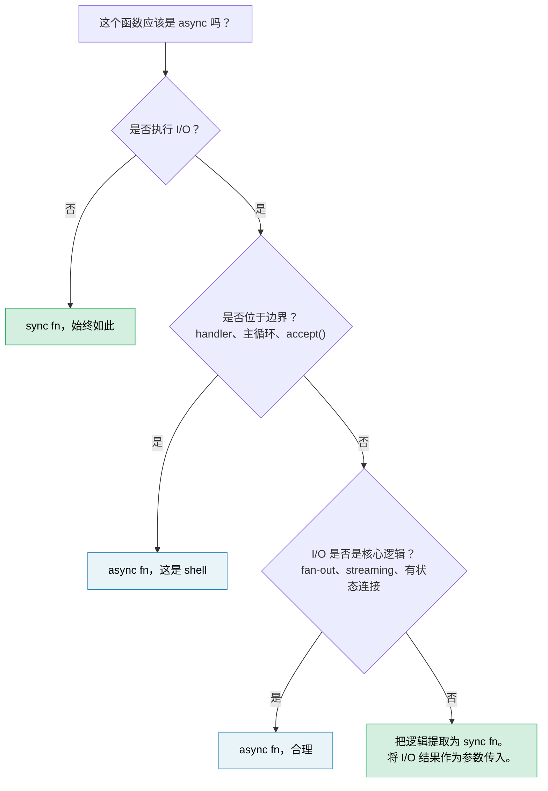

# 14. 异步是一种优化，而不是一种架构 🔴

> **您将学到什么：**
> - 为什么异步往往会污染整个代码库 - 以及为什么这是一个设计缺陷，而不是一个功能
> - “同步核心，异步外壳”模式，用于保持大多数代码可测试和可调试
> - 如何处理困难情况：*也*需要 I/O 的逻辑
> - 当 `spawn_blocking` 是解决方法还是症状时
> - 当异步真正属于你的核心逻辑时
> - 为什么同步优先的库比异步优先的库更可组合

您现在已经花了 13 章学习异步 Rust。这是本书没有告诉您的最重要的事情：**大部分代码不应该是异步的。**

## 函数着色问题

Bob Nystrom 的 [“你的职能是什么颜色？”](https://journal.stuffwithstuff.com/2015/02/01/what-color-is-your-function/) 指出了核心问题：异步函数可以调用同步函数，但同步函数不能调用异步函数。一旦一个函数变为异步，调用链中其上方的所有内容都必须跟随。

在 Rust 中，这比 C# 或 JavaScript 中**更糟糕**，因为异步不仅会感染函数签名，还会感染类型：

| Sync代码 | 异步等效项 | 为什么不一样 |
|---|---|---|
| `fn process(&self)` | `async fn process(&self)` | 调用者也必须是异步的 |
| `&mut T` | `Arc<Mutex<T>>` | 生成的任务需要 `'static + Send` |
| `std::sync::Mutex` | `tokio::sync::Mutex` | 如果跨过 `.await` 则不同类型 |
| `impl Trait`返回 | `impl Future<Output = T> + Send` | 自RPITIT（Rust 1.75，ch10）以来更简单，但仍然是彩色的 |
| `#[test]` | `#[tokio::test]` | 测试需要Runtime |
| 栈跟踪：5 帧 | 栈跟踪：25 帧 | 一半是Runtime 内部 |

每一行都是一个人必须做出、正确执行并维护的决定，而这些都与业务逻辑无关。业界正在远离这一点：Java 的 Project Loom（虚拟线程）和 Go 的 goroutine 都可以让您编写Runtime 复用的同步代码。 Rust 选择显式异步来实现零成本控制，但该控制具有复杂性成本，应有意识地支付，而不是默认情况下。

## “但是线程很昂贵”

自反计数器：“我们需要异步，因为线程很昂贵。”在大多数团队运作的规模上，这大多是错误的。

- **栈内存：** 每个操作系统线程保留 8MB 的虚拟地址空间（Linux 默认），但操作系统仅提交所触及的页面 - 大部分空闲的线程使用 20-80KB 的物理内存。
- **Context 开关：** 现代硬件上约为 1-5μs。对于 50 个并发请求，这是噪音。在 100K 开关/秒的情况下，它是可以测量的。
- **创建成本：** Linux 上每个线程约为 10-30μs。线程池（rayon，`std::thread::scope`）将其摊销为零。

异步获得其复杂性的诚实阈值大约是 **1K-10K 并发大部分空闲连接** - 每个连接栈成为实际成本的 epoll/io_uring 最佳点。在此之下，线程池更简单，调试速度更快，而且足够快。除此之外，异步获胜。大多数服务都低于这个水平。

## 困难的例子：也需要 I/O 的逻辑

一个简单的纯函数 - `fn add(a: i32, b: i32) -> i32` - 显然不需要异步。这不是一个有趣的教训。有趣的情况是，当业务逻辑“似乎”需要中间的 I/O 时：检查库存的验证、查询汇率的定价、查找客户的订单管道。

考虑订单处理服务。异步无处不在的版本看起来很自然：

### 版本 A：通过核心异步

```rust
// order.rs — async 一路向下

pub async fn process_order(order: Order) -> Result<Receipt, OrderError> {
    // 第 1 步：验证——纯业​​务规则，无I/O
    validate_items(&order)?;
    validate_quantities(&order)?;

    // 第 2 步：检查库存 — 需要调用数据库
    let stock = inventory_client.check(&order.items).await?;
    if !stock.all_available() {
        return Err(OrderError::OutOfStock(stock.missing()));
    }

    // 第 3 步：计算定价 — 纯数学，但是async，因为我们已经在这里了
    let pricing = calculate_pricing(&order, &stock);

    // 第 4 步：应用折扣 — 需要拨打外部服务电话
    let discount = discount_service.lookup(order.customer_id).await?;
    let final_price = pricing.apply_discount(discount);

    // 第 5 步：格式化收据，纯函数
    Ok(Receipt::new(order, final_price))
}
```

这是*合理的*异步代码。没有`Arc<Mutex>`滥用——只是顺序等待。大多数开发人员都会这样编写并继续。但看看发生了什么：`validate_items`、`validate_quantities`、`calculate_pricing` 和 `Receipt::new` 都是纯函数，它们被拖入异步上下文，因为步骤 2 和 4 需要 I/O。整个函数必须是异步的，它的测试需要Runtime，并且链上的每个调用者现在都是彩色的。

### 版本 B：Sync 核心，异步 Shell

另一种选择：将“决定什么”与“如何获取”分开：

```rust
// core.rs — 纯业务逻辑，零 async，零 tokio 依赖

pub fn validate_order(order: &Order) -> Result<ValidatedOrder, OrderError> {
    validate_items(order)?;
    validate_quantities(order)?;
    Ok(ValidatedOrder::from(order))
}

pub fn check_stock(
    order: &ValidatedOrder,
    stock: &StockResult,
) -> Result<StockedOrder, OrderError> {
    if !stock.all_available() {
        return Err(OrderError::OutOfStock(stock.missing()));
    }
    Ok(StockedOrder::from(order, stock))
}

pub fn finalize(
    order: &StockedOrder,
    discount: Discount,
) -> Receipt {
    let pricing = calculate_pricing(order);
    let final_price = pricing.apply_discount(discount);
    Receipt::new(order, final_price)
}
```

```rust
// shell.rs — 薄 async 协调器
//
// 注意：网络调用上的 `?` 需要 `impl From<reqwest::Error> for OrderError`
// （或统一的错误枚举）。异步错误处理模式见第 12 章。

use crate::core;

pub async fn process_order(order: Order) -> Result<Receipt, OrderError> {
    // 同步：验证
    let validated = core::validate_order(&order)?;

    // 异步：获取库存（这是 shell 的职责）
    let stock = inventory_client.check(&validated.items).await?;

    // 同步：把业务规则应用到获取的数据上
    let stocked = core::check_stock(&validated, &stock)?;

    // 异步：获取折扣
    let discount = discount_service.lookup(order.customer_id).await?;

    // 同步：收尾
    Ok(core::finalize(&stocked, discount))
}
```

异步 shell 是一个**获取→决定→获取→决定**的管道。每个“决定”步骤都是一个同步函数，它将 I/O 结果作为输入，而不是直接获取它。

### 测试差异

同步核心测试每个业务规则，无需Runtime 或模拟：

```rust
#[test]
fn out_of_stock_rejects_order() {
    let order = validated_order(vec![item("widget", 10)]);
    let stock = stock_result(vec![("widget", 3)]); // 仅 3 个可用

    let result = core::check_stock(&order, &stock);
    assert_eq!(result.unwrap_err(), OrderError::OutOfStock(vec!["widget"]));
}

#[test]
fn discount_applied_correctly() {
    let order = stocked_order(100_00); // 价格以美分为单位
    let receipt = core::finalize(&order, Discount::Percent(15));
    assert_eq!(receipt.final_price, 85_00);
}
```

异步 shell 获得更薄的“集成”测试，用于验证接线，而不是逻辑：

```rust
#[tokio::test]
async fn process_order_integration() {
    let mock_inventory = mock_service(/* 返回库存 */);
    let mock_discounts = mock_service(/* 返回 10% */);
    let receipt = process_order(sample_order()).await.unwrap();
    assert!(receipt.final_price > 0);
    // 逻辑正确性已通过上述核心测试证明
}
```

### 为什么这很重要

| 忧虑 | 通过核心异步 | Sync 核心 + 异步 shell |
|---|---|---|
| 无需Runtime 即可测试业务规则 | 不 | **是的** |
| 需要`#[tokio::test]`的单元测试数量 | 他们全部 | **仅集成测试** |
| I/O 故障与逻辑错误纠缠在一起 | 是的 — 一种 `Result` 类型适用于两者 | **否** — 同步返回逻辑错误，shell 处理 I/O 错误 |
| `validate_order` 可在 CLI / WASM / 批处理中重用 | 否 — 传递性地引入 tokio | **是** — 纯净`fn` |
| 通过业务逻辑进行栈跟踪 | 与 Runtime帧交错 | **干净的** |
| 稍后可以将 HTTP 客户端替换为 gRPC | 需要改变核心功能 | **仅更改外壳** |

关键见解：**步骤 2 和 4 中的 I/O 调用*不需要*位于业务逻辑内部。它们是它的输入。** 同步核心将 `StockResult` 和 `Discount` 作为参数。这些值的来源——HTTP、gRPC、测试装置、缓存——是 shell 关心的问题。

## `spawn_blocking` 气味

第 12 章介绍了 `spawn_blocking` 作为意外阻止执行器的修复。当您有一次性阻塞调用时，这是正确的参考答案 - `std::fs::read`、压缩库、遗留的 FFI 函数。

但如果您发现自己将大段代码包装在 `spawn_blocking` 中：

```rust
async fn handler(req: Request) -> Response {
    // 如果这是您的代码库，则边界位于错误的位置
    tokio::task::spawn_blocking(move || {
        let validated = validate(&req);       // 同步
        let enriched = enrich(validated);      // 同步
        let result = process(enriched);        // 同步
        let output = format_response(result);  // 同步
        output
    }).await.unwrap()
}
```

...这就是代码库告诉您：**这个逻辑从一开始就不是异步的。**您不需要 `spawn_blocking` — 您需要一个异步处理程序直接调用的同步模块：

```rust
async fn handler(req: Request) -> Response {
    // 验证→丰富→处理→格式都是同步的。
    // 不需要 spawn_blocking — 它们速度快且 CPU 轻。
    let response = my_core::handle(req);
    response
}
```

为真正繁重的 CPU 工作（解析大负载、图像处理、压缩）保留 `spawn_blocking`，这些工作的时间成本实际上会让执行器挨饿。对于以微秒级运行的普通业务逻辑，直接同步调用更简单、更正确。

## 库：Sync 首先，异步包装器可选

对于图书馆作者来说，边界问题更为重要。同步和异步调用者都可以使用同步库：

```rust
// 同步库——随处可用
let report = my_lib::analyze(&data);

// 呼叫者 A：同步CLI
fn main() {
    let report = my_lib::analyze(&data);
    println!("{report}");
}

// 呼叫者 B：async 处理程序，工作正常
async fn handler() -> Json<Report> {
    let report = my_lib::analyze(&data); // 在 async 上下文中同步调用 — 很好
    Json(report)
}

// 调用方 C：大量分析 — 调用方决定是否卸载到后台线程
async fn handler_heavy() -> Json<Report> {
    let data = data.clone();
    let report = tokio::task::spawn_blocking(move || {
        my_lib::analyze(&data) // 调用者控制async边界
    }).await.unwrap();
    Json(report)
}
```

异步库强制*所有*调用者进入Runtime：

```rust
// async 库 — 只能在 async 上下文中使用
let report = my_lib::analyze(&data).await; // 呼叫者必须是 async

// 同步调用方？现在需要 block_on，并且只能祈祷没有嵌套 Runtime
let report = tokio::runtime::Runtime::new().unwrap().block_on(
    my_lib::analyze(&data)
); // 脆弱，如果已经在Runtime内，则容易出现恐慌
```

**默认同步 API。** 如果您的库进行纯计算、数据转换或解析，则没有理由让它异步。如果它执行 I/O，请考虑提供一个同步核心，并在功能标志后面提供一个可选的异步便利层 - 让调用者拥有边界决策权。

## 当异步属于核心时

并不是所有的东西都可以干净地分开。在以下情况下，异步属于您的核心逻辑：

- **扇出/扇入是逻辑。** 如果您的业务规则是“同时查询 5 个定价服务并返回最便宜的”，则并发性 *就是* 逻辑，而不是管道。通过同步+线程强制执行此操作正在重新发明更糟糕的异步。

- **流是逻辑。** 使用背压处理连续事件流 — 流管理是重要的业务逻辑，而不仅仅是 I/O 包装器。

- **长期有状态连接。** WebSocket 处理程序、gRPC 双向流和协议状态机的状态转换本质上与 I/O 事件相关。 [第17章](ch17-capstone-project.md) 中的Capstone 项目（异步聊天服务器）正是这种情况：并发连接、基于房间的扇出和优雅关闭从根本上来说是异步工作。

**测试：** 如果从函数中删除 `async` 需要用线程、通道或手动轮询替换它，那么异步就发挥了作用。如果删除 `async` 仅意味着删除关键字而不进行其他更改，则它永远不需要异步。

## 决策规则



> **经验法则：** 开始同步。仅在最外层 I/O 边界添加异步。仅当您能够阐明*哪些并发 I/O 操作*证明复杂性税是合理的时，才将其向内拉。

---

<details>
<summary><strong>🏋️ 练习：提取 Sync 核心</strong>（点击展开）</summary>

以下axum处理程序具有异步污染——业务逻辑与I/O混合。将其重构为同步核心模块和瘦异步外壳。

```rust
use axum::{Json, extract::Path};

async fn get_device_report(Path(device_id): Path<String>) -> Result<Json<Report>, AppError> {
    // 从设备通过 HTTP 从设备获取原始遥测数据
    let raw = reqwest::get(format!("http://bmc-{device_id}/telemetry"))
        .await?
        .json::<RawTelemetry>()
        .await?;

    // 业务逻辑：将原始传感器读数转换为校准值
    let mut readings = Vec::new();
    for sensor in &raw.sensors {
        let calibrated = (sensor.raw_value as f64) * sensor.scale + sensor.offset;
        if calibrated < sensor.min_valid || calibrated > sensor.max_valid {
            return Err(AppError::SensorOutOfRange {
                name: sensor.name.clone(),
                value: calibrated,
            });
        }
        readings.push(CalibratedReading {
            name: sensor.name.clone(),
            value: calibrated,
            unit: sensor.unit.clone(),
        });
    }

    // 业务逻辑：对设备健康状况进行分类
    let critical_count = readings.iter()
        .filter(|r| r.value > 90.0)
        .count();
    let health = if critical_count > 2 { Health::Critical }
                 else if critical_count > 0 { Health::Warning }
                 else { Health::Ok };

    // 从库存服务获取设备元数据
    let meta = reqwest::get(format!("http://inventory/devices/{device_id}"))
        .await?
        .json::<DeviceMetadata>()
        .await?;

    Ok(Json(Report {
        device_id,
        device_name: meta.name,
        health,
        readings,
        timestamp: chrono::Utc::now(),
    }))
}
```

**您的目标：**

1. 使用同步函数创建 `core.rs`：`calibrate_sensors`、`classify_health` 和 `build_report`
2. 使用一个瘦异步处理程序创建 `shell.rs` 来获取，然后调用同步核心
3. 为以下内容写入 `#[test]`（而非 `#[tokio::test]`）：传感器超出范围、健康分类阈值和正常报告

**提示：**
- 同步核心应该将 `RawTelemetry` 和 `DeviceMetadata` 作为输入——它永远不应该知道这些来自 HTTP。
- 您需要定义构建测试装置的小型测试辅助函数（例如，`raw_telemetry()`、`sensor()`、`reading()`、`device_meta()`）。从使用情况来看，他们的签名应该是显而易见的。

<details>
<summary>🔑 参考答案</summary>

```rust
// core.rs — 零 async 依赖

pub fn calibrate_sensors(raw: &RawTelemetry) -> Result<Vec<CalibratedReading>, AppError> {
    raw.sensors.iter().map(|sensor| {
        let calibrated = (sensor.raw_value as f64) * sensor.scale + sensor.offset;
        if calibrated < sensor.min_valid || calibrated > sensor.max_valid {
            return Err(AppError::SensorOutOfRange {
                name: sensor.name.clone(),
                value: calibrated,
            });
        }
        Ok(CalibratedReading {
            name: sensor.name.clone(),
            value: calibrated,
            unit: sensor.unit.clone(),
        })
    }).collect()
}

pub fn classify_health(readings: &[CalibratedReading]) -> Health {
    let critical_count = readings.iter()
        .filter(|r| r.value > 90.0)
        .count();
    if critical_count > 2 { Health::Critical }
    else if critical_count > 0 { Health::Warning }
    else { Health::Ok }
}

pub fn build_report(
    device_id: String,
    readings: Vec<CalibratedReading>,
    meta: &DeviceMetadata,
) -> Report {
    Report {
        device_id,
        device_name: meta.name.clone(),
        health: classify_health(&readings),
        readings,
        timestamp: chrono::Utc::now(),
    }
}
```

```rust
// shell.rs — 仅保留 async 边界

pub async fn get_device_report(
    Path(device_id): Path<String>,
) -> Result<Json<Report>, AppError> {
    let raw = reqwest::get(format!("http://bmc-{device_id}/telemetry"))
        .await?
        .json::<RawTelemetry>()
        .await?;

    let readings = core::calibrate_sensors(&raw)?;

    let meta = reqwest::get(format!("http://inventory/devices/{device_id}"))
        .await?
        .json::<DeviceMetadata>()
        .await?;

    Ok(Json(core::build_report(device_id, readings, &meta)))
}
```

```rust
// core_tests.rs — 不需要 Runtime

// 测试夹具助手——构建没有任何I/O的数据
fn sensor(name: &str, raw_value: f64, valid_range: std::ops::Range<f64>) -> RawSensor {
    RawSensor {
        name: name.into(),
        raw_value,
        scale: 1.0,
        offset: 0.0,
        min_valid: valid_range.start,
        max_valid: valid_range.end,
        unit: "unit".into(),
    }
}

fn raw_telemetry(sensors: Vec<RawSensor>) -> RawTelemetry {
    RawTelemetry { sensors }
}

fn reading(name: &str, value: f64) -> CalibratedReading {
    CalibratedReading { name: name.into(), value, unit: "unit".into() }
}

fn device_meta(name: &str) -> DeviceMetadata {
    DeviceMetadata { name: name.into() }
}

#[test]
fn sensor_out_of_range_rejected() {
    let raw = raw_telemetry(vec![sensor("gpu_temp", 105.0, 0.0..100.0)]);
    let result = core::calibrate_sensors(&raw);
    assert!(matches!(result, Err(AppError::SensorOutOfRange { .. })));
}

#[test]
fn health_classification() {
    let readings = vec![
        reading("a", 50.0),  // 好的
        reading("b", 95.0),  // 批判的
        reading("c", 91.0),  // 批判的
        reading("d", 92.0),  // 批判的
    ];
    assert_eq!(core::classify_health(&readings), Health::Critical);
}

#[test]
fn normal_report() {
    let raw = raw_telemetry(vec![sensor("fan_rpm", 3000.0, 0.0..10000.0)]);
    let readings = core::calibrate_sensors(&raw).unwrap();
    let meta = device_meta("gpu-node-42");
    let report = core::build_report("dev-1".into(), readings, &meta);
    assert_eq!(report.health, Health::Ok);
    assert_eq!(report.readings.len(), 1);
}
```

**发生了什么变化：** 异步处理程序从 30 行混合逻辑和 I/O 变为 8 行纯编排。业务规则（校准数学、范围验证、健康阈值）现在使用 `#[test]` 进行测试，以毫秒为单位运行，并且对 tokio、reqwest 或任何 HTTP 模拟服务器具有零依赖性。

</details>
</details>

---

> **要点：**
>
> 1. 异步是一种**I/O 复用优化**，而不是一种应用程序架构。大多数业务逻辑是同步的。
> 2. **Sync 核心，异步shell：**将业务规则保留在以I/O结果作为参数的纯同步函数中。异步 shell 协调获取并调用核心。
> 3. 如果您将大块包装在 `spawn_blocking` 中，**边界位于错误的位置** — 将逻辑重构为同步模块。
> 4. **库应该默认同步 API。** 异步库强制所有调用者进入Runtime；同步库让调用者拥有异步边界。
> 5. 异步因**扇出/扇入、流式传输和有状态连接**而赢得一席之地——在并发*是*业务逻辑的情况下。
>
> **另请参阅：** [第 12 章 — 常见陷阱](ch12-common-pitfalls.md)（spawn_blocking 作为战术修复）· [Ch13 — 生产模式](ch13-production-patterns.md)（背压、结构化并发）· [Ch17 — Capstone：异步聊天服务器](ch17-capstone-project.md)（异步是正确架构的情况）
