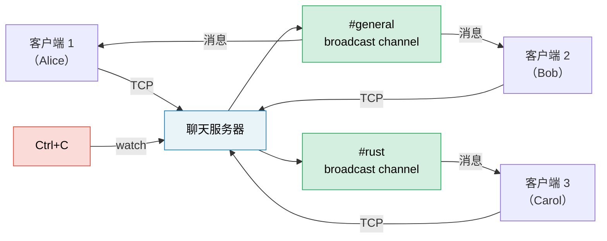

# 顶点项目（capstone project）：异步（async）聊天服务器

本项目将书中所有模式整合到一个完整的、生产级风格的应用程序中。你将使用 tokio、channel、Stream、优雅关闭（graceful shutdown）和正确的错误处理来构建一个**多房间异步聊天服务器**。

**预计时间**：4-6 小时 | **难度**：★★★

> **你将练习的内容：**
> - `tokio::spawn` 和 `'static` 要求（第 8 章）
> - Channel：`mpsc` 用于消息传递，`broadcast` 用于房间广播，`watch` 用于关闭信号（第 8 章）
> - Stream：从 TCP 连接按行读取（第 11 章）
> - 常见陷阱：取消安全、MutexGuard 跨越 `.await`（第 12 章）
> - 生产模式：优雅关闭、背压（backpressure）（第 13 章）
> - 可插拔后端的异步 trait（第 10 章）

## 问题描述

构建一个 TCP 聊天服务器，满足以下需求：

1. **客户端**通过 TCP 连接并指定房间名加入
2. **消息**广播给同一房间的所有客户端
3. **命令**：`/join <room>`、`/nick <name>`、`/rooms`、`/quit`
4. 服务器通过 Ctrl+C 触发优雅关闭——完成传输中的消息后退出



## 架构总览

```
// ============================================================================
// 聊天服务器架构
// ============================================================================
// 核心组件及其职责：
//
//   TcpListener (accept loop)
//     └── 主入口：接受 TCP 连接，为每个连接 spawn 一个客户端任务
//
//   RoomMap: Arc<RwLock<HashMap<String, broadcast::Sender>>>
//     └── 全局房间注册表：每个房间名对应一个 broadcast channel 的发送端
//         RwLock 允许多个客户端并发读取房间列表（/rooms 命令）
//         写锁仅在创建/删除房间时短暂持有
//
//   每个客户端任务内部：
//     ├── TCP reader (BufReader) → 解析命令或广播消息
//     ├── broadcast::Receiver     → 接收所在房间的消息
//     └── tokio::select!          → 同时等待"用户输入"和"房间消息"
//
//   watch::channel<bool>
//     └── 关闭信号广播：Ctrl+C 触发后通知所有客户端任务退出
//
// 数据流：
//   用户输入 → TCP → reader.read_line() → 命令解析
//     ├── /join room  → 更新客户端房间订阅
//     ├── /nick name  → 更新客户端昵称
//     ├── /rooms      → 读 RoomMap 列出活跃房间
//     ├── /quit       → 断开连接
//     └── 其他文本    → 通过 broadcast::Sender 发送到当前房间
//
//   房间消息 → broadcast::Receiver → writer.write_all() → TCP → 所有房间成员
```

## 第 1 步：基本 TCP accept 循环

从接受连接并回显消息的服务器开始：

```rust
// ============================================================================
// 第 1 步：基本 TCP accept 循环 — 架构基础
// ============================================================================
// 这是整个服务器的骨架。一个无限循环接受 TCP 连接，每个连接 spawn 一个
// 独立任务处理。这个模式决定了服务器的并发模型：每个客户端 = 一个 tokio 任务。
//
// 关键 API：
//   TcpListener::bind().await  — 异步绑定端口
//   listener.accept().await    — 等待新连接（无连接时挂起，不占 CPU）
//   tokio::spawn(async move {})— 将连接处理提交到运行时（runtime），实现并发
//   socket.into_split()        — 分离读写半部，避免 &mut 借用冲突
//   BufReader::new(reader)     — 缓冲读取，按行分割数据
//   reader.read_line().await   — 异步读取下一行
//
// 设计考量：
//   - spawn 要求 'static 生命周期，因此所有被捕获的变量必须拥有所有权
//   - async move 将 socket 和 addr 的所有权移入异步块
//   - into_split() 是为了后续 select! 中同时读写而做的准备

use tokio::io::{AsyncBufReadExt, AsyncWriteExt, BufReader};
use tokio::net::TcpListener;

#[tokio::main]
async fn main() -> anyhow::Result<()> {
    let listener = TcpListener::bind("127.0.0.1:8080").await?;
    println!("Chat server listening on :8080");

    loop {
        // accept() 返回 (TcpStream, SocketAddr)
        // Pending 时当前任务挂起，线程可处理其他任务
        let (socket, addr) = listener.accept().await?;
        println!("[{addr}] Connected");

        // spawn 新任务处理此连接
        // 主循环立即回到 accept() 等待下一个连接——不会阻塞
        tokio::spawn(async move {
            // 将 socket 分为独立读/写半部
            // 这是 Rust 所有权模型下的常见模式：避免同时持有 &mut reader 和 &mut writer
            let (reader, mut writer) = socket.into_split();
            let mut reader = BufReader::new(reader);
            let mut line = String::new();

            loop {
                line.clear(); // 复用缓冲区，避免每次迭代分配新 String
                match reader.read_line(&mut line).await {
                    Ok(0) | Err(_) => break, // EOF（对端关闭）或读取错误 → 退出
                    Ok(_) => {
                        // 简单回显：将收到的内容原样写回
                        // let _ = 忽略写入错误（客户端可能已断开）
                        let _ = writer.write_all(line.as_bytes()).await;
                    }
                }
            }
            println!("[{addr}] Disconnected");
        });
    }
}
```

**你的任务**：验证它可以编译并与 `telnet localhost 8080` 一起使用。

## 第 2 步：带有 broadcast channel 的房间状态

每个房间是一个 `broadcast::Sender`。房间中的所有客户端都订阅接收消息。

```rust
// ============================================================================
// 第 2 步：房间状态管理 — 核心数据结构
// ============================================================================
// RoomMap 是整个聊天服务器的共享状态中枢。
//
// 类型解析：
//   HashMap<String, broadcast::Sender<String>>
//     Key: 房间名（如 "#general"）
//     Value: broadcast channel 的发送端
//            clone() Sender 可获得新的发送端，subscribe() 可获得新的接收端
//
//   Arc<RwLock<HashMap<...>>>
//     Arc: 多线程共享所有权（所有客户端任务持有同一 RoomMap 的引用）
//     RwLock: 读写锁
//       - read(): 多个并发读取（/rooms 命令列出所有房间）
//       - write(): 独占写入（创建/删除房间时短暂持有）
//     tokio::sync::RwLock 而非 std 版本，因为锁可能跨越 .await
//
// broadcast::channel(100):
//   缓冲区容量为 100 条消息。
//   当缓冲区满时，最旧的 send() 会阻塞（等待慢消费者赶上）。
//   若消费者滞后超过 100 条，recv() 返回 RecvError::Lagged(n)。

use std::collections::HashMap;
use std::sync::Arc;
use tokio::sync::{broadcast, RwLock};

type RoomMap = Arc<RwLock<HashMap<String, broadcast::Sender<String>>>>;

/// 获取或创建房间的 broadcast::Sender。
/// 如果房间已存在，克隆现有的 Sender；否则创建新 channel。
fn get_or_create_room(
    rooms: &mut HashMap<String, broadcast::Sender<String>>,
    name: &str,
) -> broadcast::Sender<String> {
    rooms
        .entry(name.to_string())
        .or_insert_with(|| {
            // 创建新 broadcast channel，缓冲区 100 条消息
            // tx 可 clone 分发给多个发布者，rx 通过 subscribe() 分发给订阅者
            let (tx, _) = broadcast::channel(100);
            tx
        })
        .clone() // clone Sender：每个调用者获得独立的发送端
}
```

**你的任务**：实现房间状态，使其满足：
- 客户端从 `#general` 开始
- `/join <room>` 切换房间（取消订阅旧房间，订阅新房间）
- 消息广播给发送者当前房间中的所有客户端

<details>
<summary>💡提示 — 客户端任务结构</summary>

每个客户端任务需要两个并发循环：
1. **从 TCP 读取** → 解析命令或广播到房间
2. **从 broadcast::Receiver 读取** → 写入 TCP

使用 `tokio::select!` 同时运行两者：

```rust
// ============================================================================
// 客户端任务内部结构 — select! 双循环模式
// ============================================================================
// 每个客户端任务同时等待两个事件源：
//   分支 1: reader.read_line() → 用户输入到达
//   分支 2: room_rx.recv()     → 房间内其他人发送的消息
//
// select! 的工作方式：
//   - 同时 poll 两个分支的 Future
//   - 任一分支就绪时，执行对应的处理代码
//   - 只有就绪的分支会执行（另一分支被取消/丢弃本次 poll 结果）
//   - 循环回到 select! 顶部，重新等待两个事件
//
// 取消安全注意事项：
//   read_line 是取消安全的——它要么读到完整一行，要么什么都没读
//   recv() 从 broadcast channel 读取也是取消安全的——消息不会丢失
//   （broadcast 会为每个 Receiver 保留独立的消息游标）

loop {
    tokio::select! {
        // 分支 1：用户通过 TCP 发送了一行内容
        result = reader.read_line(&mut line) => {
            match result {
                Ok(0) | Err(_) => break, // 连接断开或读取错误
                Ok(_) => {
                    // 解析命令（/join, /nick, /rooms, /quit）
                    // 或作为普通消息广播到当前房间
                }
            }
        }
        // 分支 2：所在房间的 broadcast channel 收到了新消息
        result = room_rx.recv() => {
            match result {
                Ok(msg) => {
                    // 将房间消息转发给此客户端
                    let _ = writer.write_all(msg.as_bytes()).await;
                }
                Err(_) => break, // broadcast Sender 已全部 drop（房间被销毁）
            }
        }
    }
}
```

</details>

## 第 3 步：命令解析

实现命令协议：

| 命令 | 行为 |
|---------|--------|
| `/join <room>` | 离开当前房间，加入新房间，在两个房间广播通知 |
| `/nick <name>` | 更改显示名称 |
| `/rooms` | 列出所有活跃房间及成员数量 |
| `/quit` | 优雅断开连接 |
| 其他内容 | 作为聊天消息广播 |

**你的任务**：解析输入行中的命令。对于 `/rooms`，你需要从 `RoomMap` 读取——使用 `RwLock::read()` 以避免阻塞其他客户端。

```rust
// ============================================================================
// 命令解析 — 设计考量
// ============================================================================
// 命令解析逻辑（伪代码示例）：
//
// fn handle_input(line: &str, state: &mut ClientState, room_map: &RoomMap) {
//     if line.starts_with('/') {
//         match parse_command(line) {
//             Command::Join(room) => {
//                 // 1. 从旧房间的 broadcast channel 取消订阅
//                 // 2. 获取/创建新房间的 broadcast::Sender
//                 // 3. subscribe() 获得新房间的 Receiver
//                 // 4. 向新旧房间广播 "{nick} has joined/left {room}"
//             }
//             Command::Nick(name) => {
//                 // 验证昵称（非空、长度限制）
//                 // 更新 ClientState 中的昵称
//             }
//             Command::Rooms => {
//                 // room_map.read().await 获取读锁
//                 // 遍历 HashMap，统计每个房间的 receiver_count()
//                 // 将结果格式化后写回客户端
//             }
//             Command::Quit => {
//                 // 发送告别消息到当前房间
//                 // 断开连接
//             }
//         }
//     } else {
//         // 非命令文本：通过 broadcast::Sender::send() 广播到当前房间
//         // 格式："{nick}: {message}"
//     }
// }
//
// 注意事项：
//   - RwLock::read() 允许多个 /rooms 命令并发执行，互不阻塞
//   - broadcast::Sender::send() 是同步的（非异步），因为 broadcast channel
//     的缓冲区管理不需要 async
//   - 切换房间时先订阅新房间，再取消旧房间，避免消息丢失窗口
```

## 第 4 步：优雅关闭

添加 Ctrl+C 处理，使服务器：
1. 停止接受新连接
2. 向所有房间发送"服务器正在关闭……"
3. 等待传输中的消息排空
4. 干净退出

```rust
// ============================================================================
// 第 4 步：优雅关闭 — watch channel 模式
// ============================================================================
// 关闭信号通过 watch::channel 广播给所有并发组件。
//
// 架构角色：
//   shutdown_tx (watch::Sender)   — 唯一写入端，位于主任务中
//   shutdown_rx (watch::Receiver) — 每个客户端任务 clone 一份
//
// 关闭流程：
//   1. Ctrl+C 触发 → tokio::signal::ctrl_c().await 返回
//   2. shutdown_tx.send(true) → 通知所有 shutdown_rx 订阅者
//   3. accept 循环中的 select! 检测到 → break 跳出循环
//   4. 每个客户端任务中的 select! 检测到 shutdown_rx.changed() → 退出
//   5. 主任务 join 所有客户端句柄 → 等待排空
//   6. 主任务 return → 进程退出
//
// 关键设计：
//   - select! 配合 shutdown_rx.changed() 实现了非侵入式关闭通知
//   - 每个组件独立响应关闭信号，无需中央协调
//   - watch 只保留最新值，因此 missed 更新不是问题（只需知道"是否关闭"）

use tokio::sync::watch;

let (shutdown_tx, shutdown_rx) = watch::channel(false);

// 在 accept 循环中：同时等待新连接和关闭信号
loop {
    tokio::select! {
        // 分支 1：新连接到达
        result = listener.accept() => {
            let (socket, addr) = result?;
            // 将 shutdown_rx.clone() 传入客户端任务
            // 每个任务独立订阅关闭通知
        }
        // 分支 2：Ctrl+C 信号
        _ = tokio::signal::ctrl_c() => {
            println!("Shutdown signal received");
            shutdown_tx.send(true)?; // 广播关闭通知
            break;                    // 跳出 accept 循环
        }
    }
}
```

**你的任务**：将 `shutdown_rx.changed()` 添加到每个客户端的 `select!` 循环中，使客户端在收到关闭信号时退出。

## 第 5 步：错误处理与边缘情况

对服务器进行生产级加固：

1. **滞后消费者**：如果慢速客户端错过消息，`broadcast::recv()` 返回 `RecvError::Lagged(n)`。优雅处理（记录日志并继续，不要崩溃）。
2. **昵称验证**：拒绝空昵称或过长的昵称。
3. **背压**：broadcast channel 缓冲区有界（100）。如果客户端无法跟上，它们会收到 `Lagged` 错误。
4. **超时**：断开空闲超过 5 分钟的客户端。

```rust
// ============================================================================
// 第 5 步：生产级错误处理 — 边缘情况与防御性编程
// ============================================================================
// 生产环境中必须处理的几类问题：
//
// 1. broadcast::RecvError::Lagged(n)
//    原因：消费者处理速度慢于生产者，channel 缓冲区溢出，旧消息被丢弃
//    处理：记录日志（包含跳过的消息数 n），继续运行
//    注意：Lagged 后 Receiver 已自动恢复，可以继续接收新消息
//
// 2. 超时断开空闲连接
//    tokio::time::timeout 包装 read_line：
//    - Ok(Ok(line)) → 正常收到数据，处理
//    - Ok(Ok(0))    → EOF，对端正常关闭
//    - Ok(Err(_))   → 读取错误（如连接重置）
//    - Err(_)       → 超时（Elapsed），断开空闲连接
//
// 3. 昵称验证
//    - 拒绝空字符串（无法标识发送者）
//    - 限制长度（如 32 字符，防止 UI 溢出）
//    - 过滤控制字符（防止终端注入）
//
// 4. 背压与 broadcast channel
//    - 缓冲区大小 100 是权衡：太小则频繁 Lagged，太大则内存占用高
//    - 生产环境可根据预期消息速率和客户端处理能力调整

use tokio::time::{timeout, Duration};

// 对读取操作包装超时：
// Duration::from_secs(300) = 5 分钟空闲超时
match timeout(Duration::from_secs(300), reader.read_line(&mut line)).await {
    // Ok(Ok(0)): EOF — 对端正常关闭连接
    // Ok(Err(_)): I/O 错误 — 连接异常
    // Err(_): Elapsed — 超时，客户端空闲过久
    Ok(Ok(0)) | Ok(Err(_)) | Err(_) => break,
    Ok(Ok(_)) => {
        // 正常接收到一行数据，进入命令/消息处理逻辑
    }
}
```

## 第 6 步：集成测试

编写一个启动服务器、连接两个客户端并验证消息传递的测试：

```rust
// ============================================================================
// 第 6 步：集成测试 — 验证端到端行为
// ============================================================================
// 集成测试的设计考量：
//
// 端口选择：
//   "127.0.0.1:0" — 端口 0 让操作系统自动分配可用端口
//   避免测试间的端口冲突，支持并行测试
//
// 测试结构：
//   1. spawn 服务器任务（后台运行）
//   2. 获取服务器实际绑定的端口
//   3. 连接两个客户端
//   4. 客户端 A 发送消息
//   5. 客户端 B 接收并验证内容
//
// 注意事项：
//   - 服务器在后台 spawn，测试结束时自动取消（JoinHandle drop）
//   - 使用 TcpStream 而非 telnet，便于断言验证
//   - 测试应覆盖：消息传递、房间隔离、命令处理、超时断开

#[tokio::test]
async fn two_clients_can_chat() {
    // 在后台启动服务器，端口 0 由 OS 自动分配
    let server = tokio::spawn(run_server("127.0.0.1:0"));

    // 获取实际分配的地址并连接两个客户端
    let mut client1 = TcpStream::connect(addr).await.unwrap();
    let mut client2 = TcpStream::connect(addr).await.unwrap();

    // 客户端 1 发送消息
    client1.write_all(b"Hello from client 1\n").await.unwrap();

    // 客户端 2 应收到消息（同一房间 #general）
    let mut buf = vec![0u8; 1024];
    let n = client2.read(&mut buf).await.unwrap();
    let msg = String::from_utf8_lossy(&buf[..n]);
    assert!(msg.contains("Hello from client 1"));
}
```

## 评估标准

| 标准 | 目标 |
|-----------|--------|
| 并发性 | 多个房间、多个客户端同时在线，互不阻塞 |
| 正确性 | 消息仅发送给同一房间的客户端 |
| 优雅关闭 | Ctrl+C 后排空消息并干净退出 |
| 错误处理 | 处理消费者滞后、断线、超时等异常情况 |
| 代码组织 | 清晰的分离：accept 循环、客户端任务、房间状态 |
| 测试 | 至少 2 个集成测试 |

## 扩展思路

基本聊天服务器跑通后，可以尝试以下增强：

1. **持久历史记录**：存储每个房间最近 N 条消息；新加入者加入时重放历史
2. **WebSocket 支持**：使用 `tokio-tungstenite` 同时接受 TCP 和 WebSocket 客户端
3. **速率限制**：使用 `tokio::time::Interval` 限制每个客户端每秒的消息数
4. **指标监控**：通过 `prometheus` crate 追踪连接客户端数、消息/秒、房间数
5. **TLS 加密**：为加密连接添加 `tokio-rustls`

***
