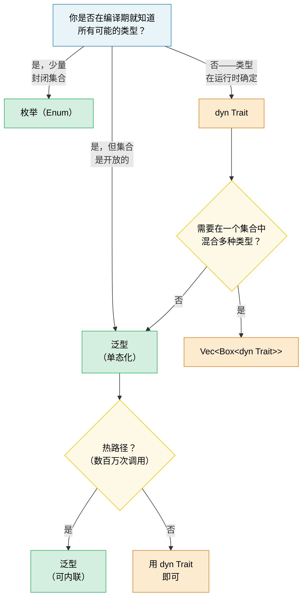

# 1. 泛型——全貌 🟢

> **你将学到：**
> - 单态化（monomorphization）如何实现零开销泛型——以及何时会导致代码膨胀
> - 决策框架：泛型 vs 枚举 vs trait 对象
> - 用于编译期数组大小的 const 泛型，以及用于编译期求值的 `const fn`
> - 何时在冷路径上用动态分发替代静态分发

## 单态化与零开销

Rust 中的泛型是**单态化**的——编译器为每个具体类型生成一份泛型函数的专用副本。这与 Java/C# 正好相反，后者的泛型在运行时会被擦除。

```rust
// ===========================================================================
// 核心概念：单态化（monomorphization）——编译器为每个具体类型生成专用代码。
// T: PartialOrd 约束要求类型支持偏序比较（<、>= 等）。
// ===========================================================================

// → 泛型函数：T 是类型参数，PartialOrd 是 trait 约束
//   签名含义：接收两个相同类型 T 的值，返回其中较大者
fn max_of<T: PartialOrd>(a: T, b: T) -> T {
//     ^^^^^^^^^^^^^^^^
//     类型参数  约束：必须能比较大小（实现 PartialOrd trait）
    if a >= b { a } else { b }
    //    ^^ → PartialOrd::ge(&self, &T) -> bool，要求 a 和 b 同类型
}

fn main() {
    max_of(3_i32, 5_i32);     // 编译器生成 max_of_i32
    // → 此处 T 被推导为 i32，编译器生成一份 max_of::<i32> 的专用副本
    max_of(2.0_f64, 7.0_f64); // 编译器生成 max_of_f64
    // → 此处 T 被推导为 f64，再生成一份 max_of::<f64> 的专用副本
    max_of("a", "z");         // 编译器生成 max_of_str
    // → 此处 T 被推导为 &str，字符串字面量本就是 &'static str
}
```

**编译器实际生成的代码**（概念上）：

```rust
// ===========================================================================
// 核心概念：单态化后，三个独立的函数——没有运行时分发，没有 vtable。
// 注意 max_of_str 需要生命周期参数 'a，而值类型不需要。
// ===========================================================================

// → 泛型已被擦除，T 被替换为具体类型 i32——可直接比较，无需任何间接寻址
fn max_of_i32(a: i32, b: i32) -> i32 { if a >= b { a } else { b } }

// → f64 同理：Copy 类型，返回的是拥有值
fn max_of_f64(a: f64, b: f64) -> f64 { if a >= b { a } else { b } }

// → &str 是引用而非拥有值，编译器必须追踪返回引用的生命周期
//   'a 表示返回值的生命周期"至少"与两个输入参数一样长
fn max_of_str<'a>(a: &'a str, b: &'a str) -> &'a str { if a >= b { a } else { b } }
//          ^^                              ^^    ^^
//          生命周期声明                    输入借用同一生命周期  返回借用同一生命周期
```

> **为什么 `max_of_str` 需要 `<'a>` 而 `max_of_i32` 不需要？** `i32` 和 `f64`
> 是 `Copy` 类型——函数返回的是一个拥有的值。但 `&str` 是一个引用，
> 所以编译器必须知道返回引用的生命周期。`<'a>` 标注表示"返回的 `&str`
> 的生命周期至少与两个输入一样长"。

**优势**：零运行时开销——与手写的专用代码完全相同。优化器可以对每个副本独立地进行内联、向量化和特化。

**与 C++ 的比较**：Rust 泛型的工作方式类似于 C++ 模板，但有一个关键区别——**约束检查发生在定义处，而非实例化处**。在 C++ 中，模板只有在使用特定类型时才会编译，这会导致错误信息深埋在库代码中，晦涩难懂。而在 Rust 中，`T: PartialOrd` 在你定义函数时就会被检查，因此错误能被及早捕获，错误信息也更清晰。

```rust,compile_fail
// ===========================================================================
// 核心概念：Rust 在"定义处"检查约束，而非实例化处。
// 未声明 T: Display，直接调用 println! 会编译失败。
// ===========================================================================

// Rust：在定义处报错——"T 没有实现 Display"
// → T 无任何约束，编译器不知道 T 支持哪些操作
fn broken<T>(val: T) {
    println!("{val}"); // ❌ 错误：T 没有实现 Display
    //       ^^^^^ → {val} 语法要求 val 实现了 std::fmt::Display trait
    //              但 T 没有任何约束，编译器无法保证这一点
}
```

```rust
// ===========================================================================
// 核心概念：添加 T: std::fmt::Display 约束后，编译器在定义处即可验证 println! 合法。
// ===========================================================================

// 修复：添加约束
// → T: std::fmt::Display 表示"任何能被格式化为可读文本的类型"
//   Display trait 提供了 fmt 方法，println! 的 {} 占位符依赖它
fn fixed<T: std::fmt::Display>(val: T) {
    println!("{val}"); // ✅ 现在编译通过——T 保证了 Display 能力
}
```

### 泛型何时有害：代码膨胀

单态化是有代价的——二进制体积。每次唯一的实例化都会复制函数体：

```rust,ignore
// ===========================================================================
// 核心概念：单态化的代价——二进制膨胀。每个不同类型实例化都会复制函数体。
// ===========================================================================

// 这个看起来无害的函数...
// → T: serde::Serialize 是 trait 约束，要求类型可被序列化
fn serialize<T: serde::Serialize>(value: &T) -> Vec<u8> {
    serde_json::to_vec(value).unwrap()
    // → serde_json::to_vec 将任何 Serialize 类型转为 JSON 字节向量
    //   返回 Result<Vec<u8>, Error>，此处用 unwrap 直接取值
}

// ...用于 50 个不同类型 → 二进制中有 50 份副本。
// → 每个具体 T 都生成一份独立的 serialize::<T> 函数
```

**缓解策略**：

```rust,ignore
// ===========================================================================
// 核心概念：两种缓解二进制膨胀的策略——
//   1. outline 模式：将非泛型的公共逻辑提取到单独函数
//   2. 动态分发：用 dyn Trait 替代单态化，共享一份代码
// ===========================================================================

// 1. 提取非泛型的核心部分（"outline" 模式）
// → 泛型壳：只做序列化，把后续逻辑委托给非泛型函数
fn serialize<T: serde::Serialize>(value: &T) -> Result<Vec<u8>, serde_json::Error> {
    // 泛型部分：仅序列化调用
    // → serde_json::to_value 将 T 转为动态的 Value 类型（擦除了泛型）
    let json_value = serde_json::to_value(value)?;
    // 非泛型部分：提取到单独的函数中
    serialize_value(json_value)
    // → 此处跨函数边界，泛型部分只有 to_value 一行会被单态化
}

// → 这个函数签名不含泛型，编译器只生成一份代码
fn serialize_value(value: serde_json::Value) -> Result<Vec<u8>, serde_json::Error> {
    // 这个函数在二进制中只存在一份
    // → serde_json::to_vec 将 Value 序列化为字节——所有调用方共享这一份
    serde_json::to_vec(&value)
}

// 2. 当内联不是关键时，使用 trait 对象（动态分发）
// → &dyn std::fmt::Display 是 trait 对象（胖指针 = data_ptr + vtable_ptr）
//   通过 vtable 间接调用方法，所有类型共享同一份 log_item 代码
fn log_item(item: &dyn std::fmt::Display) {
    // 一份副本——使用 vtable 进行分发
    println!("[LOG] {item}");
    //             ^^^ → 此处通过 vtable 查找 item 的 Display::fmt 实现
}
```

> **经验法则**：在需要内联的热路径上使用泛型。
> 在冷路径上（错误处理、日志、配置）使用 `dyn Trait`，
> 此时 vtable 调用的开销可以忽略不计。

### 泛型 vs 枚举 vs Trait 对象——决策指南

Rust 中有三种方式来处理"不同类型、相同接口"：

| 方式 | 分发 | 确定时机 | 可扩展？ | 开销 |
|----------|----------|----------|-------------|----------|
| **泛型**（`impl Trait` / `<T: Trait>`） | 静态（单态化） | 编译期 | ✅（开放集） | 零——被内联 |
| **枚举** | match 分支 | 编译期 | ❌（封闭集） | 零——无 vtable |
| **Trait 对象**（`dyn Trait`） | 动态（vtable） | 运行时 | ✅（开放集） | vtable 指针 + 间接调用 |

```rust,ignore
// ===========================================================================
// 核心概念：三种"不同类型、相同接口"的处理方式对比——
//   泛型（静态分发）、枚举（穷尽匹配）、trait 对象（动态分发）。
// ===========================================================================

// --- 泛型：开放集合，零开销，编译期 ---
// → <H: Handler> 是泛型约束：H 必须实现 Handler trait
//   单态化后，每个具体 H 类型都生成一份专用副本——可被内联
fn process<H: Handler>(handler: H, request: Request) -> Response {
    handler.handle(request) // 单态化——每个 H 一份副本
    //     → 静态分发：调用点直接跳转到 H::handle，无间接寻址
}

// --- 枚举：封闭集合，零开销，穷尽匹配 ---
enum Shape {
    Circle(f64),
    Rect(f64, f64),
    Triangle(f64, f64, f64),
}

impl Shape {
    // → &self 是方法的接收者借用（self: &Shape）
    fn area(&self) -> f64 {
        match self {
            // → match 对枚举变体进行穷尽匹配，编译器强制覆盖所有分支
            Shape::Circle(r) => std::f64::consts::PI * r * r,
            Shape::Rect(w, h) => w * h,
            Shape::Triangle(a, b, c) => {
                let s = (a + b + c) / 2.0;
                // → sqrt 是 f64 的固有方法（inherent method），求平方根
                (s * (s - a) * (s - b) * (s - c)).sqrt()
            }
        }
    }
}
// 添加新变体会强制更新所有 match 分支——
// 编译器会强制穷尽匹配。适合"我控制所有变体"的场景。

// --- TRAIT 对象：开放集合，运行时开销，可扩展 ---
// → &[Box<dyn std::fmt::Display>] 是 trait 对象切片
//   Box<dyn Display> 是堆分配的胖指针（data_ptr + vtable_ptr）
fn log_all(items: &[Box<dyn std::fmt::Display>]) {
    for item in items {
        println!("{item}"); // vtable 分发
        //     → {item} 通过 vtable 查找 item 的 Display::fmt——间接调用
    }
}
```

**决策流程图**：



### Const 泛型

从 Rust 1.51 开始，你可以用*常量值*而不仅仅是类型来参数化类型和函数：

```rust
// ===========================================================================
// 核心概念：const 泛型——用常量值（而非类型）参数化。
// const ROWS: usize 表示 ROWS 是一个编译期已知的常量，而非运行时变量。
// 这让编译器能在类型层面强制维度正确性。
// ===========================================================================

// 按大小参数化的数组包装类型
// → <const ROWS: usize, const COLS: usize> 是两个 const 泛型参数
//   data 字段是嵌套数组：ROWS 行 × COLS 列的 f64 矩阵
struct Matrix<const ROWS: usize, const COLS: usize> {
    data: [[f64; COLS]; ROWS],
}

// → impl<const ROWS, const COLS> 为所有维度组合实现方法
impl<const ROWS: usize, const COLS: usize> Matrix<ROWS, COLS> {
    // → new() 返回 Self（即 Matrix<ROWS, COLS>），无需写完整类型
    fn new() -> Self {
        // → [[0.0; COLS]; ROWS] 用 const 泛型值初始化数组——编译期已知大小
        Matrix { data: [[0.0; COLS]; ROWS] }
    }

    // → 转置：行列互换。注意返回类型 Matrix<COLS, ROWS>——维度被交换
    fn transpose(&self) -> Matrix<COLS, ROWS> {
        let mut result = Matrix::<COLS, ROWS>::new();
        // → 0..ROWS 是 Range<usize> 迭代器，ROWS 是 const 泛型值
        for r in 0..ROWS {
            for c in 0..COLS {
                result.data[c][r] = self.data[r][c];
                //           ^  ^     ^  ^
                //           转置后列行 原矩阵行列
            }
        }
        result
    }
}

// 编译器强制维度正确性：
// → 三个 const 泛型 M、N、P 约束矩阵乘法维度：a 是 M×N，b 必须是 N×P
fn multiply<const M: usize, const N: usize, const P: usize>(
    a: &Matrix<M, N>,
    b: &Matrix<N, P>, // N 必须匹配！
) -> Matrix<M, P> {
    //                  ^^^^^^^^^^ 返回 M×P——编译器在类型层面验证维度链
    let mut result = Matrix::<M, P>::new();
    for i in 0..M {
        for j in 0..P {
            for k in 0..N {
                result.data[i][j] += a.data[i][k] * b.data[k][j];
            }
        }
    }
    result
}

// 使用：
// → Matrix::<2, 3>::new() 用 turbofish 显式指定 const 泛型值为 2 行 3 列
let a = Matrix::<2, 3>::new(); // 2×3
let b = Matrix::<3, 4>::new(); // 3×4
let c = multiply(&a, &b);      // 2×4 ✅
// → 维度匹配：a 的列数(3) == b 的行数(3)，结果 2×4

// let d = Matrix::<5, 5>::new();
// multiply(&a, &d); // ❌ 编译错误：期望 Matrix<3, _>，得到 Matrix<5, 5>
// → 编译器在类型层面就拒绝了维度不匹配——无需运行时检查
```

> **与 C++ 的比较**：这类似于 C++ 中的 `template<int N>`，但 Rust
> 的 const 泛型会积极地进行类型检查，不会受到 SFINAE 复杂性的困扰。

### Const 函数（const fn）

`const fn` 将函数标记为可在编译期求值——相当于 C++ 的 `constexpr`。
其结果可用于 `const` 和 `static` 上下文中：

```rust
// ===========================================================================
// 核心概念：const fn——可在编译期求值的函数（Rust 的 constexpr）。
// 当结果用在 const/static 上下文时，编译器在编译期完成计算，零运行时开销。
// ===========================================================================

// 基本 const fn——在 const 上下文中使用时于编译期求值
// → const fn 关键字标记此函数符合 const 求值规则（无堆分配、无 I/O 等）
const fn celsius_to_fahrenheit(c: f64) -> f64 {
    c * 9.0 / 5.0 + 32.0
}

// → 在 const 上下文调用——整个表达式在编译期算出 212.0，直接写入二进制
const BOILING_F: f64 = celsius_to_fahrenheit(100.0); // 编译期计算
const FREEZING_F: f64 = celsius_to_fahrenheit(0.0);  // 32.0

// const 构造函数——无需 lazy_static! 即可创建 static！
struct BitMask(u32);

impl BitMask {
    // → const fn new 构造位掩码：1 << bit 生成单 bit 掩码
    const fn new(bit: u32) -> Self {
        BitMask(1 << bit)
    }

    // → const fn or 将两个掩码按位或，返回组合掩码
    const fn or(self, other: BitMask) -> Self {
        BitMask(self.0 | other.0)
    }

    // → const fn contains 检查某 bit 是否被设置——返回 bool
    const fn contains(&self, bit: u32) -> bool {
        self.0 & (1 << bit) != 0
    }
}

// 静态查找表——无运行时开销，无需延迟初始化
// → 这些 const 值在编译期构造，直接嵌入二进制的只读数据段
const GPIO_INPUT:  BitMask = BitMask::new(0);
const GPIO_OUTPUT: BitMask = BitMask::new(1);
const GPIO_IRQ:    BitMask = BitMask::new(2);
const GPIO_IO:     BitMask = GPIO_INPUT.or(GPIO_OUTPUT);
// → 复合掩码在编译期通过 const fn or 计算得出

// 用 const 数组作为寄存器映射：
// → const 块表达式——在编译期执行初始化逻辑（Rust 1.83+ 稳定）
const SENSOR_THRESHOLDS: [u16; 4] = {
    let mut table = [0u16; 4];
    table[0] = 50;   // 警告
    table[1] = 70;   // 高
    table[2] = 85;   // 危险
    table[3] = 100;  // 关机
    table
};
// 整个表存在于二进制中——无堆分配，无运行时初始化。
```

**在 `const fn` 中可以做的事**（截至 Rust 1.79+）：
- 算术、位运算、比较
- `if`/`else`、`match`、`loop`、`while`（控制流）
- 创建和修改局部变量（`let mut`）
- 调用其他 `const fn`
- 引用（`&`、`&mut`——在 const 上下文内）
- `panic!()`（若在编译期触发，会变成编译错误）
- 基本浮点运算（`+`、`-`、`*`、`/`；`sqrt`/`sin` 等复杂运算不符合 const 条件）

**还不能做的事**（暂时）：
- 堆分配（`Box`、`Vec`、`String`）
- trait 方法调用（仅限固有方法）
- I/O 或副作用

```rust
// ===========================================================================
// 核心概念：const fn 中的 panic!——在编译期求值时，panic 会变成编译错误。
// 这是 const 上下文"要么编译期求值，要么硬错误"语义的体现。
// ===========================================================================

// 带 panic 的 const fn——在编译期会变成编译错误：
// → const fn 要求除零等错误在编译期就被捕获
const fn checked_div(a: u32, b: u32) -> u32 {
    if b == 0 {
        panic!("division by zero"); // 如果 b 在 const 期为 0，则为编译错误
        // → panic! 宏在 const 上下文中会中止编译，而非运行时崩溃
    }
    a / b
}

// → 此处在编译期求值：100 / 4 = 25，安全通过
const RESULT: u32 = checked_div(100, 4);  // ✅ 25
// const BAD: u32 = checked_div(100, 0);  // ❌ 编译错误："division by zero"
// → 编译器在编译期执行 checked_div(100, 0) 时触发 panic，直接拒绝编译
```

> **与 C++ 的比较**：`const fn` 就是 Rust 的 `constexpr`。关键区别在于：
> Rust 的版本是可选的，编译器会严格验证是否只使用了 const 兼容的操作。
> 在 C++ 中，`constexpr` 函数可以静默回退到运行时求值——而在 Rust 中，
> `const` 上下文*要求*编译期求值，否则就是硬错误。

> **实用建议**：尽可能将构造函数和简单工具函数标记为 `const fn`——
> 这没有任何成本，还能让调用者在 const 上下文中使用它们。对于硬件诊断
> 代码，`const fn` 非常适合用于寄存器定义、位掩码构建和阈值表。

> **要点总结——泛型**
> - 单态化提供了零开销抽象，但可能导致代码膨胀——在冷路径上使用 `dyn Trait`
> - const 泛型（`[T; N]`）用编译期检查的数组大小取代了 C++ 模板技巧
> - `const fn` 消除了编译期可计算值对 `lazy_static!` 的需求

> **另请参阅：**[第 2 章——深入理解 Trait](ch02-traits-in-depth.md)，了解 trait 约束、关联类型和 trait 对象。[第 4 章——PhantomData](ch04-phantomdata-types-that-carry-no-data.md)，了解零大小的泛型标记。

---

### 练习：带淘汰机制的泛型缓存 ★★（约 30 分钟）

构建一个泛型 `Cache<K, V>` 结构体，存储键值对并支持可配置的最大容量。当容量满时，淘汰最旧的条目（FIFO 先进先出）。要求：

- `fn new(capacity: usize) -> Self`
- `fn insert(&mut self, key: K, value: V)` ——若已满则淘汰最旧的条目
- `fn get(&self, key: &K) -> Option<&V>`
- `fn len(&self) -> usize`
- 约束 `K: Eq + Hash + Clone`

<details>
<summary>🔑 答案</summary>

```rust
// ===========================================================================
// 核心概念：泛型缓存实现，演示 trait 约束组合与泛型数据结构。
// K: Eq + Hash + Clone 是 HashMap 键的标准约束三件套：
//   - Eq：键相等比较（比 PartialEq 更严格，要求自反/对称/传递）
//   - Hash：哈希计算（与 Eq 配合保证正确查找）
//   - Clone：复制键以维护淘汰队列（VecDeque<K>）
// ===========================================================================
use std::collections::{HashMap, VecDeque};
use std::hash::Hash;

// → 泛型结构体：键 K、值 V，外加维护插入顺序的队列和容量上限
struct Cache<K, V> {
    map: HashMap<K, V>,
    order: VecDeque<K>,   // → VecDeque 是双端队列，用于 FIFO 淘汰
    capacity: usize,
}

impl<K: Eq + Hash + Clone, V> Cache<K, V> {
    // → 约束写在 impl 块上：所有方法共享 K: Eq + Hash + Clone
    fn new(capacity: usize) -> Self {
        Cache {
            // → with_capacity 预分配容量，避免运行时重新分配
            map: HashMap::with_capacity(capacity),
            order: VecDeque::with_capacity(capacity),
            capacity,
        }
    }

    fn insert(&mut self, key: K, value: V) {
        if self.capacity == 0 {
            // 无容量！
            return;
        }
        // → contains_key 检查键是否存在（依赖 K: Eq + Hash）
        if self.map.contains_key(&key) {
            self.map.insert(key, value);
            // → HashMap::insert 更新已存在键的值
            return;
        }
        if self.map.len() >= self.capacity {
            // → pop_front 移除队首（最旧的键），实现 FIFO 淘汰
            if let Some(oldest) = self.order.pop_front() {
                self.map.remove(&oldest);
                // → HashMap::remove 按键删除条目，返回 Option<V>
            }
        }
        // → key.clone() 克隆键存入队列（原 key 已被 move 到 map 中）
        //   这就是为何 K: Clone 是必要约束
        self.order.push_back(key.clone());
        self.map.insert(key, value);
    }

    // → get 按引用查找（&self 不可变借用），返回 Option<&V>
    fn get(&self, key: &K) -> Option<&V> {
        self.map.get(key)
        // → HashMap::get 查找键，存在则返回值的引用
    }

    fn len(&self) -> usize {
        self.map.len()
        // → HashMap::len 返回当前条目数
    }
}

fn main() {
    // 测试基本缓存
    // → Cache::new(3) 此处 K 推导为 &str，V 推导为 i32
    let mut cache = Cache::new(3);
    cache.insert("a", 1);
    cache.insert("b", 2);
    cache.insert("c", 3);
    assert_eq!(cache.len(), 3);

    cache.insert("d", 4); // 淘汰 "a"
    // → 容量已满，插入 "d" 触发淘汰最旧的 "a"
    assert_eq!(cache.get(&"a"), None);
    // → "a" 已被淘汰，get 返回 None
    assert_eq!(cache.get(&"d"), Some(&4));

    // 留给读者：`capacity` 属性应该用什么类型，
    // 才能确保无法定义这种无用的缓存？
    let mut empty_cache = Cache::new(0);
    empty_cache.insert("0", 0);
    // → capacity 为 0 时直接 return，任何插入都被拒绝
    assert_eq!(empty_cache.get(&"0"), None);
    assert_eq!(empty_cache.len(), 0);

    println!("Cache works! len = {}", cache.len());
}
```

</details>

***
