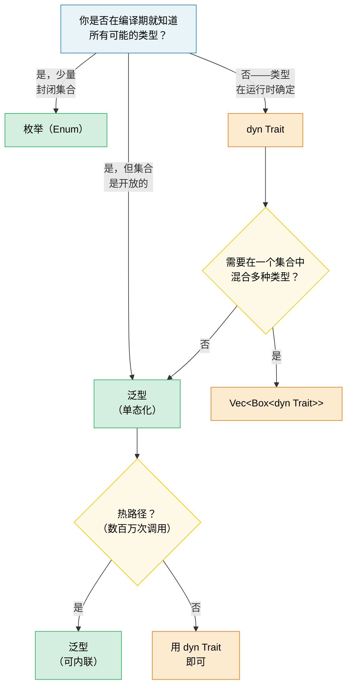

# 1. 泛型——全貌 🟢

> **你将学到：**
> - 单态化（monomorphization）如何实现零开销泛型——以及何时会导致代码膨胀
> - 决策框架：泛型 vs 枚举 vs trait 对象
> - 用于编译期数组大小的 const 泛型，以及用于编译期求值的 `const fn`
> - 何时在冷路径上用动态分发替代静态分发

## 单态化与零开销

Rust 中的泛型是**单态化**的——编译器为每个具体类型生成一份泛型函数的专用副本。这与 Java/C# 正好相反，后者的泛型在运行时会被擦除。

```rust
fn max_of<T: PartialOrd>(a: T, b: T) -> T {
    if a >= b { a } else { b }
}

fn main() {
    max_of(3_i32, 5_i32);     // 编译器生成 max_of_i32
    max_of(2.0_f64, 7.0_f64); // 编译器生成 max_of_f64
    max_of("a", "z");         // 编译器生成 max_of_str
}
```

**编译器实际生成的代码**（概念上）：

```rust
// 三个独立的函数——没有运行时分发，没有 vtable：
fn max_of_i32(a: i32, b: i32) -> i32 { if a >= b { a } else { b } }
fn max_of_f64(a: f64, b: f64) -> f64 { if a >= b { a } else { b } }
fn max_of_str<'a>(a: &'a str, b: &'a str) -> &'a str { if a >= b { a } else { b } }
```

> **为什么 `max_of_str` 需要 `<'a>` 而 `max_of_i32` 不需要？** `i32` 和 `f64`
> 是 `Copy` 类型——函数返回的是一个拥有的值。但 `&str` 是一个引用，
> 所以编译器必须知道返回引用的生命周期。`<'a>` 标注表示"返回的 `&str`
> 的生命周期至少与两个输入一样长"。

**优势**：零运行时开销——与手写的专用代码完全相同。优化器可以对每个副本独立地进行内联、向量化和特化。

**与 C++ 的比较**：Rust 泛型的工作方式类似于 C++ 模板，但有一个关键区别——**约束检查发生在定义处，而非实例化处**。在 C++ 中，模板只有在使用特定类型时才会编译，这会导致错误信息深埋在库代码中，晦涩难懂。而在 Rust 中，`T: PartialOrd` 在你定义函数时就会被检查，因此错误能被及早捕获，错误信息也更清晰。

```rust,compile_fail
// Rust：在定义处报错——"T 没有实现 Display"
fn broken<T>(val: T) {
    println!("{val}"); // ❌ 错误：T 没有实现 Display
}
```

```rust
// 修复：添加约束
fn fixed<T: std::fmt::Display>(val: T) {
    println!("{val}"); // ✅
}
```

### 泛型何时有害：代码膨胀

单态化是有代价的——二进制体积。每次唯一的实例化都会复制函数体：

```rust,ignore
// 这个看起来无害的函数...
fn serialize<T: serde::Serialize>(value: &T) -> Vec<u8> {
    serde_json::to_vec(value).unwrap()
}

// ...用于 50 个不同类型 → 二进制中有 50 份副本。
```

**缓解策略**：

```rust,ignore
// 1. 提取非泛型的核心部分（"outline" 模式）
fn serialize<T: serde::Serialize>(value: &T) -> Result<Vec<u8>, serde_json::Error> {
    // 泛型部分：仅序列化调用
    let json_value = serde_json::to_value(value)?;
    // 非泛型部分：提取到单独的函数中
    serialize_value(json_value)
}

fn serialize_value(value: serde_json::Value) -> Result<Vec<u8>, serde_json::Error> {
    // 这个函数在二进制中只存在一份
    serde_json::to_vec(&value)
}

// 2. 当内联不是关键时，使用 trait 对象（动态分发）
fn log_item(item: &dyn std::fmt::Display) {
    // 一份副本——使用 vtable 进行分发
    println!("[LOG] {item}");
}
```

> **经验法则**：在需要内联的热路径上使用泛型。
> 在冷路径上（错误处理、日志、配置）使用 `dyn Trait`，
> 此时 vtable 调用的开销可以忽略不计。

### 泛型 vs 枚举 vs Trait 对象——决策指南

Rust 中有三种方式来处理"不同类型、相同接口"：

| 方式 | 分发 | 确定时机 | 可扩展？ | 开销 |
|----------|----------|----------|-------------|----------|
| **泛型**（`impl Trait` / `<T: Trait>`） | 静态（单态化） | 编译期 | ✅（开放集） | 零——被内联 |
| **枚举** | match 分支 | 编译期 | ❌（封闭集） | 零——无 vtable |
| **Trait 对象**（`dyn Trait`） | 动态（vtable） | 运行时 | ✅（开放集） | vtable 指针 + 间接调用 |

```rust,ignore
// --- 泛型：开放集合，零开销，编译期 ---
fn process<H: Handler>(handler: H, request: Request) -> Response {
    handler.handle(request) // 单态化——每个 H 一份副本
}

// --- 枚举：封闭集合，零开销，穷尽匹配 ---
enum Shape {
    Circle(f64),
    Rect(f64, f64),
    Triangle(f64, f64, f64),
}

impl Shape {
    fn area(&self) -> f64 {
        match self {
            Shape::Circle(r) => std::f64::consts::PI * r * r,
            Shape::Rect(w, h) => w * h,
            Shape::Triangle(a, b, c) => {
                let s = (a + b + c) / 2.0;
                (s * (s - a) * (s - b) * (s - c)).sqrt()
            }
        }
    }
}
// 添加新变体会强制更新所有 match 分支——
// 编译器会强制穷尽匹配。适合"我控制所有变体"的场景。

// --- TRAIT 对象：开放集合，运行时开销，可扩展 ---
fn log_all(items: &[Box<dyn std::fmt::Display>]) {
    for item in items {
        println!("{item}"); // vtable 分发
    }
}
```

**决策流程图**：



### Const 泛型

从 Rust 1.51 开始，你可以用*常量值*而不仅仅是类型来参数化类型和函数：

```rust
// 按大小参数化的数组包装类型
struct Matrix<const ROWS: usize, const COLS: usize> {
    data: [[f64; COLS]; ROWS],
}

impl<const ROWS: usize, const COLS: usize> Matrix<ROWS, COLS> {
    fn new() -> Self {
        Matrix { data: [[0.0; COLS]; ROWS] }
    }

    fn transpose(&self) -> Matrix<COLS, ROWS> {
        let mut result = Matrix::<COLS, ROWS>::new();
        for r in 0..ROWS {
            for c in 0..COLS {
                result.data[c][r] = self.data[r][c];
            }
        }
        result
    }
}

// 编译器强制维度正确性：
fn multiply<const M: usize, const N: usize, const P: usize>(
    a: &Matrix<M, N>,
    b: &Matrix<N, P>, // N 必须匹配！
) -> Matrix<M, P> {
    let mut result = Matrix::<M, P>::new();
    for i in 0..M {
        for j in 0..P {
            for k in 0..N {
                result.data[i][j] += a.data[i][k] * b.data[k][j];
            }
        }
    }
    result
}

// 使用：
let a = Matrix::<2, 3>::new(); // 2×3
let b = Matrix::<3, 4>::new(); // 3×4
let c = multiply(&a, &b);      // 2×4 ✅

// let d = Matrix::<5, 5>::new();
// multiply(&a, &d); // ❌ 编译错误：期望 Matrix<3, _>，得到 Matrix<5, 5>
```

> **与 C++ 的比较**：这类似于 C++ 中的 `template<int N>`，但 Rust
> 的 const 泛型会积极地进行类型检查，不会受到 SFINAE 复杂性的困扰。

### Const 函数（const fn）

`const fn` 将函数标记为可在编译期求值——相当于 C++ 的 `constexpr`。
其结果可用于 `const` 和 `static` 上下文中：

```rust
// 基本 const fn——在 const 上下文中使用时于编译期求值
const fn celsius_to_fahrenheit(c: f64) -> f64 {
    c * 9.0 / 5.0 + 32.0
}

const BOILING_F: f64 = celsius_to_fahrenheit(100.0); // 编译期计算
const FREEZING_F: f64 = celsius_to_fahrenheit(0.0);  // 32.0

// const 构造函数——无需 lazy_static! 即可创建 static！
struct BitMask(u32);

impl BitMask {
    const fn new(bit: u32) -> Self {
        BitMask(1 << bit)
    }

    const fn or(self, other: BitMask) -> Self {
        BitMask(self.0 | other.0)
    }

    const fn contains(&self, bit: u32) -> bool {
        self.0 & (1 << bit) != 0
    }
}

// 静态查找表——无运行时开销，无需延迟初始化
const GPIO_INPUT:  BitMask = BitMask::new(0);
const GPIO_OUTPUT: BitMask = BitMask::new(1);
const GPIO_IRQ:    BitMask = BitMask::new(2);
const GPIO_IO:     BitMask = GPIO_INPUT.or(GPIO_OUTPUT);

// 用 const 数组作为寄存器映射：
const SENSOR_THRESHOLDS: [u16; 4] = {
    let mut table = [0u16; 4];
    table[0] = 50;   // 警告
    table[1] = 70;   // 高
    table[2] = 85;   // 危险
    table[3] = 100;  // 关机
    table
};
// 整个表存在于二进制中——无堆分配，无运行时初始化。
```

**在 `const fn` 中可以做的事**（截至 Rust 1.79+）：
- 算术、位运算、比较
- `if`/`else`、`match`、`loop`、`while`（控制流）
- 创建和修改局部变量（`let mut`）
- 调用其他 `const fn`
- 引用（`&`、`&mut`——在 const 上下文内）
- `panic!()`（若在编译期触发，会变成编译错误）
- 基本浮点运算（`+`、`-`、`*`、`/`；`sqrt`/`sin` 等复杂运算不符合 const 条件）

**还不能做的事**（暂时）：
- 堆分配（`Box`、`Vec`、`String`）
- trait 方法调用（仅限固有方法）
- I/O 或副作用

```rust
// 带 panic 的 const fn——在编译期会变成编译错误：
const fn checked_div(a: u32, b: u32) -> u32 {
    if b == 0 {
        panic!("division by zero"); // 如果 b 在 const 期为 0，则为编译错误
    }
    a / b
}

const RESULT: u32 = checked_div(100, 4);  // ✅ 25
// const BAD: u32 = checked_div(100, 0);  // ❌ 编译错误："division by zero"
```

> **与 C++ 的比较**：`const fn` 就是 Rust 的 `constexpr`。关键区别在于：
> Rust 的版本是可选的，编译器会严格验证是否只使用了 const 兼容的操作。
> 在 C++ 中，`constexpr` 函数可以静默回退到运行时求值——而在 Rust 中，
> `const` 上下文*要求*编译期求值，否则就是硬错误。

> **实用建议**：尽可能将构造函数和简单工具函数标记为 `const fn`——
> 这没有任何成本，还能让调用者在 const 上下文中使用它们。对于硬件诊断
> 代码，`const fn` 非常适合用于寄存器定义、位掩码构建和阈值表。

> **要点总结——泛型**
> - 单态化提供了零开销抽象，但可能导致代码膨胀——在冷路径上使用 `dyn Trait`
> - const 泛型（`[T; N]`）用编译期检查的数组大小取代了 C++ 模板技巧
> - `const fn` 消除了编译期可计算值对 `lazy_static!` 的需求

> **另请参阅：**[第 2 章——深入理解 Trait](ch02-traits-in-depth.md)，了解 trait 约束、关联类型和 trait 对象。[第 4 章——PhantomData](ch04-phantomdata-types-that-carry-no-data.md)，了解零大小的泛型标记。

---

### 练习：带淘汰机制的泛型缓存 ★★（约 30 分钟）

构建一个泛型 `Cache<K, V>` 结构体，存储键值对并支持可配置的最大容量。当容量满时，淘汰最旧的条目（FIFO 先进先出）。要求：

- `fn new(capacity: usize) -> Self`
- `fn insert(&mut self, key: K, value: V)` ——若已满则淘汰最旧的条目
- `fn get(&self, key: &K) -> Option<&V>`
- `fn len(&self) -> usize`
- 约束 `K: Eq + Hash + Clone`

<details>
<summary>🔑 答案</summary>

```rust
use std::collections::{HashMap, VecDeque};
use std::hash::Hash;

struct Cache<K, V> {
    map: HashMap<K, V>,
    order: VecDeque<K>,
    capacity: usize,
}

impl<K: Eq + Hash + Clone, V> Cache<K, V> {
    fn new(capacity: usize) -> Self {
        Cache {
            map: HashMap::with_capacity(capacity),
            order: VecDeque::with_capacity(capacity),
            capacity,
        }
    }

    fn insert(&mut self, key: K, value: V) {
        if self.capacity == 0 {
            // 无容量！
            return;
        }
        if self.map.contains_key(&key) {
            self.map.insert(key, value);
            return;
        }
        if self.map.len() >= self.capacity {
            if let Some(oldest) = self.order.pop_front() {
                self.map.remove(&oldest);
            }
        }
        self.order.push_back(key.clone());
        self.map.insert(key, value);
    }

    fn get(&self, key: &K) -> Option<&V> {
        self.map.get(key)
    }

    fn len(&self) -> usize {
        self.map.len()
    }
}

fn main() {
    // 测试基本缓存
    let mut cache = Cache::new(3);
    cache.insert("a", 1);
    cache.insert("b", 2);
    cache.insert("c", 3);
    assert_eq!(cache.len(), 3);

    cache.insert("d", 4); // 淘汰 "a"
    assert_eq!(cache.get(&"a"), None);
    assert_eq!(cache.get(&"d"), Some(&4));

    // 留给读者：`capacity` 属性应该用什么类型，
    // 才能确保无法定义这种无用的缓存？
    let mut empty_cache = Cache::new(0);
    empty_cache.insert("0", 0);
    assert_eq!(empty_cache.get(&"0"), None);
    assert_eq!(empty_cache.len(), 0);

    println!("Cache works! len = {}", cache.len());
}
```

</details>

***
