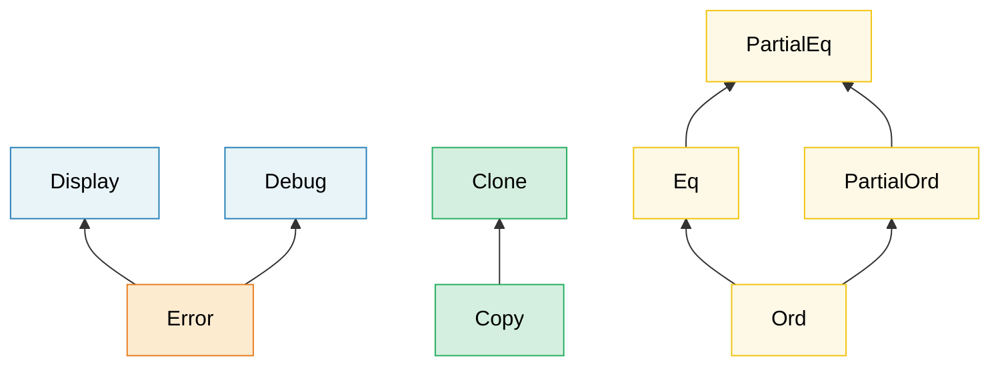

# 2. 深入理解 Trait 🟡

> **你将学到：**
> - 关联类型（associated type）与泛型参数的对比，以及各自的使用时机
> - GAT、泛批实现（blanket impl）、标记 trait（marker trait）以及 trait 对象安全规则
> - vtable 和胖指针（fat pointer）在底层的运作原理
> - 扩展 trait（extension trait）、枚举分派（enum dispatch）和类型化命令模式

## 关联类型 vs 泛型参数

两者都能让 trait 与不同的类型协作，但它们的用途不同：

```rust
// ===========================================================================
// 核心概念：关联类型 vs 泛型参数，两者都能让 trait 与不同类型协作。
// - 关联类型（type Item）：每个实现类型只能有一种关联类型取值
// - 泛型参数（trait Convert<T>）：同一类型可以为多个 T 实现该 trait
// ===========================================================================

// --- 关联类型：每个类型一个实现 ---
trait Iterator {
    type Item; // 关联类型声明——每个迭代器只产生一种 Item
    // → 关联类型不带默认值，实现时必须指定

    // → next 是迭代器的核心方法：&mut self 可变借用，返回 Option<Self::Item>
    fn next(&mut self) -> Option<Self::Item>;
    //     → None 表示迭代结束，Some(x) 表示产出下一个元素
}

// 一个总是产生 i32 的自定义迭代器——没有其他选择
struct Counter { max: i32, current: i32 }

impl Iterator for Counter {
    // → 关联类型在此处被固定为 i32——Counter 只能产生 i32
    type Item = i32; // 每个实现只有一种 Item 类型
    fn next(&mut self) -> Option<i32> {
        if self.current < self.max {
            self.current += 1;
            Some(self.current)
            // → 返回当前计数值（自增后）
        } else {
            None
            // → 计数完成，结束迭代
        }
    }
}

// --- 泛型参数：每个类型可以有多个实现 ---
// → Convert<T> 带泛型参数 T——表示"可转换为目标类型 T"
trait Convert<T> {
    // → &self 不可变借用，返回拥有值 T（按值返回）
    fn convert(&self) -> T;
}

// 单个类型可以为多种目标类型实现 Convert：
// → i32 同时实现 Convert<f64> 和 Convert<String>——泛型参数允许多实现
impl Convert<f64> for i32 {
    fn convert(&self) -> f64 { *self as f64 }
    //                       → as f64 是显式数值类型转换（i32 → f64）
}
impl Convert<String> for i32 {
    fn convert(&self) -> String { self.to_string() }
    // → to_string 来自 ToString trait（见后续泛批实现），将数字转为字符串
}
```

**何时使用哪种**：

| 使用 | 时机 |
|-----|------|
| **关联类型（associated type）** | 每个实现类型恰好只有一种自然的输出/结果。`Iterator::Item`、`Deref::Target`、`Add::Output` |
| **泛型参数（generic parameter）** | 一个类型可以有意义地为多种不同类型实现该 trait。`From<T>`、`AsRef<T>`、`PartialEq<Rhs>` |

**直觉判断**：如果问"这个迭代器的 `Item` 是什么？"是有意义的，就用关联类型。如果问"它能转换为 `f64` 吗？能转换为 `String` 吗？能转换为 `bool` 吗？"是有意义的，就用泛型参数。

```rust
// ===========================================================================
// 核心概念：std::ops::Add trait 同时使用了关联类型和泛型参数。
// - type Output 是关联类型（加法只有一种结果类型）
// - Rhs（右操作数类型）是泛型参数（可为多种 Rhs 实现）
// - Rhs = Self 是默认泛型参数，省略时右操作数默认与左操作数同类型
// ===========================================================================

// 真实案例：std::ops::Add
trait Add<Rhs = Self> {
    // → Rhs = Self 是默认泛型参数：写 Add 不指定时默认 Rhs 为 Self
    type Output; // 关联类型——加法只有一种结果类型
    fn add(self, rhs: Rhs) -> Self::Output;
    // → self 按值消费（移动），rhs 按值接收，返回关联的 Output 类型
}

// Rhs 是泛型参数——你可以将不同类型加到 Meters 上：
struct Meters(f64);
struct Centimeters(f64);

// → impl Add<Meters> for Meters：Meters 与 Meters 相加
impl Add<Meters> for Meters {
    type Output = Meters;  // → 结果也是 Meters
    fn add(self, rhs: Meters) -> Meters { Meters(self.0 + rhs.0) }
}

// → impl Add<Centimeters> for Meters：Meters 也可以与 Centimeters 相加
//   同一类型（Meters）为两个不同 Rhs 实现了 Add——泛型参数的威力
impl Add<Centimeters> for Meters {
    type Output = Meters;
    fn add(self, rhs: Centimeters) -> Meters { Meters(self.0 + rhs.0 / 100.0) }
    //                                            → 厘米转米（÷100）后再加
}
```

### 泛型关联类型（GAT）

从 Rust 1.65 开始，关联类型可以拥有自己的泛型参数。
这使得**借贷迭代器（lending iterator）**成为可能——这种迭代器返回的引用与
迭代器本身绑定，而不是与底层集合绑定：

```rust
// ===========================================================================
// 核心概念：泛型关联类型（GAT）——关联类型可以自带泛型参数（含生命周期）。
// 关键约束 where Self: 'a 表示"借用 Item 的生命周期不超过迭代器本身"。
// 这是借贷迭代器（lending iterator）的基础：每次 next 返回的引用绑定到 &mut self。
// ===========================================================================

// 没有 GATs——无法表达借贷迭代器：
// trait LendingIterator {
//     type Item<'a>;  // ← 在 1.65 之前被拒绝
// }

// 使用 GATs（Rust 1.65+）：
trait LendingIterator {
    // → type Item<'a> 是 GAT：关联类型 Item 带有自己的生命周期参数 'a
    type Item<'a> where Self: 'a;
    //   → where Self: 'a 约束：迭代器存活至少和 Item 的借用一样久

    // → Self::Item<'_> 用匿名生命周期，自动绑定到 &mut self 的借用
    fn next(&mut self) -> Option<Self::Item<'_>>;
    // → 每次 next 返回的引用"借用"了 self——不能同时持有多个返回值
}

// 示例：一个产生重叠窗口的迭代器
// → 'data 是结构体的生命周期参数：WindowIter 借用了外部切片
struct WindowIter<'data> {
    data: &'data [u8],
    pos: usize,
    window_size: usize,
}

impl<'data> LendingIterator for WindowIter<'data> {
    // → 关联类型 Item<'a> 被指定为 &'a [u8]——窗口是切片的借用
    type Item<'a> = &'a [u8] where Self: 'a;

    fn next(&mut self) -> Option<&[u8]> {
        if self.pos + self.window_size <= self.data.len() {
            // → 切片索引语法 [start..end] 返回子切片引用
            let window = &self.data[self.pos..self.pos + self.window_size];
            self.pos += 1;
            Some(window)
            // → 返回的 window 借用自 self.data，绑定到本次 &mut self 调用
        } else {
            None
        }
    }
}
```

> **何时需要 GAT**：借贷迭代器、流式解析器，或者任何关联类型的生命周期
> 依赖于 `&self` 借用的 trait。对于大多数代码，普通的关联类型就足够了。

### 父 trait 与 trait 层次结构

Trait 可以要求其他 trait 作为前提条件，从而形成层次结构：



> 箭头从子 trait 指向父 trait：实现 `Error` 需要 `Display` + `Debug`。

一个 trait 可以要求实现者同时实现其他 trait：

```rust
// ===========================================================================
// 核心概念：父 trait（supertrait）构建 trait 层次结构。
// trait Error: Display + Debug 表示实现 Error 必须先实现 Display 和 Debug。
// trait Entity: Identifiable + Timestamped 用 + 组合多个父 trait。
// ===========================================================================
use std::fmt;

// Display 是 Error 的父 trait
// → : fmt::Display + fmt::Debug 是父 trait 约束——实现 Error 前必须先实现二者
trait Error: fmt::Display + fmt::Debug {
    // → source 是带默认实现的方法：返回错误根源（链式错误的上一环）
    //   &(dyn Error + 'static) 是 trait 对象，'static 保证不借用临时数据
    fn source(&self) -> Option<&(dyn Error + 'static)> { None }
}
// 实现 Error 的任何类型都必须同时实现 Display 和 Debug

// 构建你自己的层次结构：
trait Identifiable {
    fn id(&self) -> u64;
    // → &self 不可变借用，返回 u64 标识符
}

trait Timestamped {
    fn created_at(&self) -> chrono::DateTime<chrono::Utc>;
    // → 返回 chrono crate 的时区感知时间戳（UTC）
}

// Entity 要求两者都有：
// → : Identifiable + Timestamped 声明两个父 trait——实现 Entity 需先实现它们
trait Entity: Identifiable + Timestamped {
    fn is_active(&self) -> bool;
}

// 实现 Entity 会强制你实现全部三个 trait：
struct User { id: u64, name: String, created: chrono::DateTime<chrono::Utc> }

impl Identifiable for User {
    fn id(&self) -> u64 { self.id }
}
impl Timestamped for User {
    fn created_at(&self) -> chrono::DateTime<chrono::Utc> { self.created }
}
// → 必须先实现两个父 trait，否则 impl Entity for User 编译失败
impl Entity for User {
    fn is_active(&self) -> bool { true }
}
```

### 泛批实现（Blanket Implementations）

为满足某个约束的所有类型实现一个 trait：

```rust
// ===========================================================================
// 核心概念：泛批实现（blanket implementation）——为满足约束的所有类型实现 trait。
// impl<T: TraitA> TraitB for T 让任何实现 TraitA 的类型自动获得 TraitB。
// 注意：泛批实现不可逆，会阻止为特定类型写更专门的实现（一致性规则）。
// ===========================================================================

// 标准库的做法：任何实现了 Display 的类型自动获得 ToString
// → impl<T: fmt::Display> ToString for T：T 是泛型，约束为实现 Display 的任意类型
impl<T: fmt::Display> ToString for T {
    fn to_string(&self) -> String {
        format!("{self}")
        // → format! 宏调用 Display::fmt 将 self 格式化为 String
    }
}
// 现在 i32、&str、你的自定义类型——任何有 Display 的类型——都免费获得 to_string()。

// 你自己的泛批实现：
trait Loggable {
    // → trait 方法：&self 不可变借用，无返回值（仅做副作用）
    fn log(&self);
}

// 每个 Debug 类型都自动成为 Loggable：
// → 约束 T: std::fmt::Debug 让所有 Debug 类型免费获得 log 方法
impl<T: std::fmt::Debug> Loggable for T {
    fn log(&self) {
        // → {:?} 占位符使用 Debug trait 的格式化（调试视图）
        eprintln!("[LOG] {self:?}");
        // → eprintln! 宏输出到 stderr（标准错误流），不影响 stdout 管道
    }
}

// 现在任何 Debug 类型都有 .log()：
// 42.log();              // [LOG] 42
// "hello".log();         // [LOG] "hello"
// vec![1, 2, 3].log();   // [LOG] [1, 2, 3]
// → 这些类型都实现了 Debug，因此自动获得 Loggable::log
```

> **注意**：泛批实现功能强大但不可逆——你无法为已被泛批实现覆盖的类型
> 添加更具体的实现（孤儿规则 + 一致性规则）。请谨慎设计。

### 标记 trait（Marker Traits）

没有方法的 trait——它们只是将某个类型标记为具有某种属性：

```rust
// ===========================================================================
// 核心概念：标记 trait（marker trait）——没有方法的 trait，仅用于在类型层面标记属性。
// 配合泛型约束，可在编译期拒绝不符合标记的类型，实现"类型状态"模式。
// ===========================================================================

// 标准库的标记 trait：
// Send    — 可以安全地在线程间转移
// Sync    — 可以安全地在线程间共享（&T）
// Unpin   — 固定后可以安全移动
// Sized   — 编译期已知大小
// Copy    — 可以用 memcpy 复制

// 你自己的标记 trait：
/// 标记：这个传感器已经过出厂校准
// → trait Calibrated {} 空方法体——纯标记，不含任何行为
trait Calibrated {}

struct RawSensor { reading: f64 }
struct CalibratedSensor { reading: f64 }

// → impl Calibrated for CalibratedSensor {} 为特定类型打上标记
impl Calibrated for CalibratedSensor {}

// 只有校准过的传感器才能用于生产环境：
// → <S: Calibrated> 约束：只有标记为 Calibrated 的类型才能传入
fn record_measurement<S: Calibrated>(sensor: &S) {
    // ...
}
// record_measurement(&RawSensor { reading: 0.0 }); // ❌ 编译错误
// → RawSensor 没实现 Calibrated，编译器在调用点就拒绝
// record_measurement(&CalibratedSensor { reading: 0.0 }); // ✅
```

这与第 3 章中的**类型状态（type-state）模式**直接相关。

### Trait 对象安全规则

并非所有 trait 都能用作 `dyn Trait`。一个 trait 只有满足以下条件才是**对象安全（object-safe）**的：

1. **trait 本身没有 `Self: Sized` 约束**
2. **方法没有泛型类型参数**
3. **返回位置不使用 `Self`**（除非通过间接方式如 `Box<Self>`）
4. **没有关联函数**（方法必须有 `&self`、`&mut self` 或 `self`）

```rust
// ===========================================================================
// 核心概念：对象安全（object safety）——只有满足特定规则的 trait 才能用作 dyn Trait。
// 四大规则：无 Self:Sized 约束、无泛型方法、返回位置不用 Self、方法必须有 self 接收者。
// ===========================================================================

// ✅ 对象安全——可以用作 dyn Drawable
trait Drawable {
    // → &self 接收者、无泛型、不返回 Self——满足对象安全所有条件
    fn draw(&self);
    fn bounding_box(&self) -> (f64, f64, f64, f64);
    // → 返回元组 (x, y, width, height)，类型固定，对象安全
}

// → Box<dyn Drawable> 是堆分配的 trait 对象（胖指针），可装入异构集合
let shapes: Vec<Box<dyn Drawable>> = vec![/* ... */]; // ✅ 可用

// ❌ 不对象安全——在返回位置使用了 Self
trait Cloneable {
    fn clone_self(&self) -> Self;
    //                       ^^^^ 运行时无法知道具体大小
    // → 返回 Self：trait 对象不知具体类型，无法确定返回值大小
}
// let items: Vec<Box<dyn Cloneable>> = ...; // ❌ 编译错误

// ❌ 不对象安全——泛型方法
trait Converter {
    fn convert<T>(&self) -> T;
    //        ^^^ vtable 无法包含无限的单态化版本
    // → 泛型方法 <T> 会有无数个单态化版本，vtable 是有限的函数指针表
}

// ❌ 不对象安全——关联函数（没有 self）
trait Factory {
    fn create() -> Self;
    // 没有 &self——如何通过 trait 对象调用这个？
    // → 无 self 接收者：trait 对象需通过 data_ptr 调用方法，无对象即无法分派
}
```

**变通方法**：

```rust
// ===========================================================================
// 核心概念：where Self: Sized 变通——将破坏对象安全的方法排除在 vtable 之外。
// 添加该约束后，trait 整体对象安全，但被排除的方法不能通过 dyn Trait 调用。
// ===========================================================================

// 添加 `where Self: Sized` 将方法排除在 vtable 之外：
trait MyTrait {
    fn regular_method(&self); // 包含在 vtable 中
    // → 普通方法：对象安全，可通过 dyn MyTrait 调用

    // → where Self: Sized：要求 Self 在编译期已知大小
    //   trait 对象（dyn）大小未知，故此方法被排除出 vtable
    fn generic_method<T>(&self) -> T
    where
        Self: Sized; // 从 vtable 中排除——不能通过 dyn MyTrait 调用
}

// 现在 dyn MyTrait 是有效的，但 generic_method 只能在
// 已知具体类型时调用。
// → &dyn MyTrait 可调用 regular_method，但 generic_method 只能用具体类型
```

> **经验法则**：如果你计划使用 `dyn Trait`，请保持方法简单——
> 不要使用泛型、返回类型中不要出现 `Self`、不要用 `Sized` 约束。拿不准时，
> 试试 `let _: Box<dyn YourTrait>;`，让编译器告诉你结果。

### Trait 对象的底层原理——vtable 与胖指针

`&dyn Trait`（或 `Box<dyn Trait>`）是一个**胖指针（fat pointer）**——由两个机器字组成：

```text
┌──────────────────────────────────────────────────┐
│  &dyn Drawable (on 64-bit: 16 bytes total)       │
├──────────────┬───────────────────────────────────┤
│  data_ptr    │  vtable_ptr                       │
│  (8 bytes)   │  (8 bytes)                        │
│  ↓           │  ↓                                │
│  ┌─────────┐ │  ┌──────────────────────────────┐ │
│  │ Circle  │ │  │ vtable for <Circle as        │ │
│  │ {       │ │  │           Drawable>          │ │
│  │  r: 5.0 │ │  │                              │ │
│  │ }       │ │  │  drop_in_place: 0x7f...a0    │ │
│  └─────────┘ │  │  size:           8           │ │
│              │  │  align:          8           │ │
│              │  │  draw:          0x7f...b4    │ │
│              │  │  bounding_box:  0x7f...c8    │ │
│              │  └──────────────────────────────┘ │
└──────────────┴───────────────────────────────────┘
```

**vtable 调用的工作原理**（例如 `shape.draw()`）：

1. 从胖指针（第二个字）中加载 `vtable_ptr`
2. 在 vtable 中索引查找 `draw` 函数指针
3. 调用它，将 `data_ptr` 作为 `self` 参数传入

这与 C++ 虚函数分派的成本类似（每次调用一次指针间接寻址），
但 Rust 将 vtable 指针存储在胖指针中，而不是对象内部——因此栈上的
普通 `Circle` 根本不携带 vtable 指针。

```rust
// ===========================================================================
// 核心概念：trait 对象的动态分发——vtable 查找与胖指针。
// Box<dyn Drawable> = (data_ptr, vtable_ptr)，每次方法调用经 vtable 间接寻址。
// 对比 size_of 展示瘦指针（&Circle = 8B）与胖指针（&dyn = 16B）的差异。
// ===========================================================================
trait Drawable {
    fn draw(&self);
    fn area(&self) -> f64;
}

struct Circle { radius: f64 }

impl Drawable for Circle {
    // → println! 是格式化输出宏，{} 占位符调用 Display
    fn draw(&self) { println!("Drawing circle r={}", self.radius); }
    // → 面积公式 πr²，std::f64::consts::PI 是常量
    fn area(&self) -> f64 { std::f64::consts::PI * self.radius * self.radius }
}

struct Square { side: f64 }

impl Drawable for Square {
    fn draw(&self) { println!("Drawing square s={}", self.side); }
    fn area(&self) -> f64 { self.side * self.side }
}

fn main() {
    // → Box::new 在堆上分配值并返回拥有它的 Box 智能指针
    let shapes: Vec<Box<dyn Drawable>> = vec![
        // → 此处发生了 unsized coercion：Box<Circle> → Box<dyn Drawable>
        //   即从瘦指针转为胖指针（附加 vtable_ptr）
        Box::new(Circle { radius: 5.0 }),
        Box::new(Square { side: 3.0 }),
    ];

    // 每个元素都是一个胖指针：(data_ptr, vtable_ptr)
    // Circle 和 Square 的 vtable 是不同的
    // → &shapes 借用 Vec，迭代器产生 &Box<dyn Drawable>
    for shape in &shapes {
        shape.draw();  // vtable 分派 → Circle::draw 或 Square::draw
        // → draw 经 vtable 间接调用：先查 vtable_ptr 的 draw 函数指针
        // → {:.2} 格式化保留 2 位小数，area 同样经 vtable 分派
        println!("  area = {:.2}", shape.area());
    }

    // 大小比较：
    // → size_of::<T>() 是泛型函数，返回类型 T 的字节数（编译期常量）
    // → ::<...> 是 turbofish 语法，显式指定泛型类型参数
    println!("size_of::<&Circle>()        = {}", size_of::<&Circle>());
    // → 8 字节（一个指针——编译器知道类型）
    // → &Circle 是瘦指针：编译器已知 Circle 大小，无需额外信息
    println!("size_of::<&dyn Drawable>()  = {}", size_of::<&dyn Drawable>());
    // → 16 字节（data_ptr + vtable_ptr）
    // → &dyn Drawable 是胖指针：需 vtable_ptr 才能动态分派
}
```

**性能成本模型**：

| 方面 | 静态分派（`impl Trait` / 泛型） | 动态分派（`dyn Trait`） |
|--------|------------------------------------------|-------------------------------|
| 调用开销 | 零——由 LLVM 内联 | 每次调用一次指针间接寻址 |
| 内联 | ✅ 编译器可内联 | ❌ 不透明的函数指针 |
| 二进制大小 | 更大（每种类型一份副本） | 更小（一个共享函数） |
| 指针大小 | 瘦指针（1 个字） | 胖指针（2 个字） |
| 异构集合 | ❌ | ✅ `Vec<Box<dyn Trait>>` |

> **vtable 开销何时重要**：在紧凑循环中数百万次调用 trait 方法时，
> 间接寻址和无法内联可能造成显著影响（慢 2-10 倍）。对于冷路径、
> 配置或插件架构，`dyn Trait` 的灵活性值得这点小小的开销。

### 高阶 trait 约束（HRTBs）

有时你需要一个能处理*任意*生命周期引用（而非某个特定生命周期）的函数。这就是 `for<'a>` 语法出现的地方：

```rust
// ===========================================================================
// 核心概念：高阶 trait 约束（HRTB）——for<'a> 要求 F 适用于"所有"生命周期。
// 区别：'a 由调用者固定（太严格）vs for<'a> 适用于任意生命周期（灵活）。
// ===========================================================================

// 问题：这个函数需要一个能处理
// 任意生命周期的引用的闭包，而不是某个特定生命周期。

// ❌ 这太严格了——'a 由调用者固定：
// fn apply<'a, F: Fn(&'a str) -> &'a str>(f: F, data: &'a str) -> &'a str
// → 此处 'a 是泛型生命周期参数，调用者选定一个具体 'a——不适用于任意借用

// ✅ HRTB：F 必须适用于所有可能的生命周期：
fn apply<F>(f: F, data: &str) -> &str
where
    // → for<'a> 是高阶约束："对于任意生命周期 'a，F 都满足 Fn(&'a str) -> &'a str"
    //   闭包参数的生命周期无需在定义时固定
    F: for<'a> Fn(&'a str) -> &'a str,
{
    f(data)
    // → f 接收任意生命周期的 &str 并返回同生命周期的 &str
}

fn main() {
    // → |s| s.trim() 是闭包：s.trim() 去除首尾空白，返回借用子串
    let result = apply(|s| s.trim(), "  hello  ");
    println!("{result}"); // "hello"
    // → trim 返回的 &str 借用自输入字面量，生命周期由编译器推断
}
```

**你会在以下场景遇到 HRTB**：
- `Fn(&T) -> &U` trait——在大多数情况下编译器会自动推断 `for<'a>`
- 必须跨不同借用工作的自定义 trait 实现
- 使用 `serde` 反序列化：`for<'de> Deserialize<'de>`

```rust,ignore
// serde 的 DeserializeOwned 定义为：
// trait DeserializeOwned: for<'de> Deserialize<'de> {}
// 含义："可以从任意生命周期的数据中反序列化"
// （即结果不从输入借用）

// → for<'de> Deserialize<'de> 是 HRTB：结果不借用输入数据
//   Deserialize<'de> 表示反序列化结果可能借用 'de 生命周期
//   DeserializeOwned 用 HRTB 断言"结果不依赖输入生命周期"——即拥有所有权
use serde::de::DeserializeOwned;

// → <T: DeserializeOwned> 约束：T 可从任意 JSON 反序列化为拥有值
fn parse_json<T: DeserializeOwned>(input: &str) -> T {
    serde_json::from_str(input).unwrap()
    // → serde_json::from_str 是泛型反序列化函数
    //   返回 Result<T, Error>，unwrap 取出 T（输入 input 借用在此结束）
}
```

> **实用建议**：你很少会自己编写 `for<'a>`。它主要出现在闭包参数的
> trait 约束中，编译器会隐式处理。但在错误信息中认出它
> （"expected a `for<'a> Fn(&'a ...)` bound"）能帮助你理解编译器在要求什么。

### `impl Trait`——参数位置 vs 返回位置

`impl Trait` 出现在两个位置时具有**不同的语义**：

```rust
// ===========================================================================
// 核心概念：impl Trait 在参数位置（APIT）与返回位置（RPIT）语义不同。
// - APIT（fn foo(x: impl T)）：调用者选类型，等价于泛型参数
// - RPIT（fn foo() -> impl T）：被调用者选类型，隐藏具体类型
// ===========================================================================

// --- 参数位置的 impl Trait (APIT) ---
// "调用者选择类型"——泛型参数的语法糖
// → impl Iterator<Item = i32> 是 APIT：调用者传入任意 Item=i32 的迭代器
fn print_all(items: impl Iterator<Item = i32>) {
    // → Iterator<Item = i32> 用关联类型约束限定迭代器产出 i32
    for item in items { println!("{item}"); }
}
// 等价于：
// → 显式泛型写法：与 APIT 完全等价，只是语法更显式
fn print_all_verbose<I: Iterator<Item = i32>>(items: I) {
    for item in items { println!("{item}"); }
}
// 调用者决定：print_all(vec![1,2,3].into_iter())
//             print_all(0..10)

// --- 返回位置的 impl Trait (RPIT) ---
// "被调用者选择类型"——函数挑选一个具体类型
// → -> impl Iterator<Item = i32> 是 RPIT：返回某个具体迭代器，但对外隐藏类型
fn evens(limit: i32) -> impl Iterator<Item = i32> {
    // → filter 接收闭包谓词，保留满足条件的元素，返回 Filter 适配器
    (0..limit).filter(|x| x % 2 == 0)
    // → |x| x % 2 == 0 是闭包：x 是被检查的元素引用
    // 具体类型是 Filter<Range<i32>, Closure>
    // 但调用者只看到"某个 Iterator<Item = i32>"
}
```

**关键区别**：

| | APIT（`fn foo(x: impl T)`） | RPIT（`fn foo() -> impl T`） |
|---|---|---|
| 谁选择类型？ | 调用者 | 被调用者（函数体） |
| 是否单态化？ | 是——每种类型一份副本 | 是——一个具体类型 |
| 能否用 turbofish？ | 不能（`foo::<X>()` 不允许） | 不适用 |
| 等价于 | `fn foo<X: T>(x: X)` | 存在类型 |

#### trait 定义中的 RPIT（RPITIT）

从 Rust 1.75 开始，你可以直接在 trait 定义中使用 `-> impl Trait`：

```rust
// ===========================================================================
// 核心概念：RPITIT（return position impl trait in trait）——trait 定义中的 RPIT。
// 从 Rust 1.75 起，trait 方法可直接声明 -> impl Trait，无需 Box<dyn> 或关联类型。
// 每个实现者返回自己的具体类型，编译器单态化生成专用代码。
// ===========================================================================

trait Container {
    // → -> impl Iterator<Item = &str> 是 RPITIT：每个实现返回自己的迭代器类型
    fn items(&self) -> impl Iterator<Item = &str>;
    //                 ^^^^ Each implementor returns its own concrete type
}

struct CsvRow {
    fields: Vec<String>,
}

impl Container for CsvRow {
    fn items(&self) -> impl Iterator<Item = &str> {
        // → iter() 借用 Vec 产生迭代器，map(String::as_str) 将 &String 转为 &str
        self.fields.iter().map(String::as_str)
        // → String::as_str 是方法引用，提取内部 &str 借用
    }
}

struct FixedFields;

impl Container for FixedFields {
    fn items(&self) -> impl Iterator<Item = &str> {
        // → into_iter() 在数组上产生按值迭代器（产出 &str，因为字面量是 'static）
        ["host", "port", "timeout"].into_iter()
    }
}
```

> **在 Rust 1.75 之前**，你必须在 trait 中使用 `Box<dyn Iterator>` 或
> 关联类型来实现这一点。RPITIT 去除了内存分配。

#### `impl Trait` vs `dyn Trait`——决策指南

```text
Do you know the concrete type at compile time?
├── YES → Use impl Trait or generics (zero cost, inlinable)
└── NO  → Do you need a heterogeneous collection?
     ├── YES → Use dyn Trait (Box<dyn T>, &dyn T)
     └── NO  → Do you need the SAME trait object across an API boundary?
          ├── YES → Use dyn Trait
          └── NO  → Use generics / impl Trait
```

| 特性 | `impl Trait` | `dyn Trait` |
|---------|-------------|------------|
| 分派 | 静态（单态化） | 动态（vtable） |
| 性能 | 最佳——可内联 | 每次调用一次间接寻址 |
| 异构集合 | ❌ | ✅ |
| 每种类型的二进制大小 | 每种一份副本 | 共享代码 |
| trait 必须对象安全？ | 否 | 是 |
| 可用于 trait 定义 | ✅（Rust 1.75+） | 始终可以 |

***

## 使用 `Any` 和 `TypeId` 进行类型擦除

有时你需要存储*未知*类型的值并在之后对其进行向下转型（downcast）——这是一个
从 C 的 `void*` 或 C# 的 `object` 中熟悉的模式。Rust 通过 `std::any::Any` 提供了这一能力：

```rust
// ===========================================================================
// 核心概念：std::any::Any 提供运行时类型擦除与向下转型。
// - &dyn Any 是擦除具体类型的 trait 对象
// - downcast_ref::<T>() 尝试转回具体类型 T，返回 Option<&T>
// - TypeId::of::<T>() 在运行时唯一标识类型，用作 HashMap 的键
// ===========================================================================
use std::any::Any;

// 存储异构值：
// → &dyn Any 是类型擦除后的引用：编译期不知具体类型，仅保留运行时 TypeId
fn log_value(value: &dyn Any) {
    // → downcast_ref::<String>() 尝试转型为 &String
    //   先比对 TypeId，匹配则返回 Some(&String)，否则 None
    if let Some(s) = value.downcast_ref::<String>() {
        println!("String: {s}");
    } else if let Some(n) = value.downcast_ref::<i32>() {
        println!("i32: {n}");
    } else {
        // TypeId 让你在运行时检查类型：
        // → type_id() 返回 std::any::TypeId，{:?} 用 Debug 格式化
        println!("Unknown type: {:?}", value.type_id());
    }
}

// 适用于插件系统、事件总线或 ECS 风格的架构：
// → 用 TypeId 作键的 HashMap：每种类型存一个值，实现"类型映射"
struct AnyMap(std::collections::HashMap<std::any::TypeId, Box<dyn Any + Send>>);

impl AnyMap {
    fn new() -> Self { AnyMap(std::collections::HashMap::new()) }

    // → T: Any + Send + 'static 约束：
    //   Any 提供向下转型、Send 允许跨线程、'static 表示不借用临时数据
    fn insert<T: Any + Send + 'static>(&mut self, value: T) {
        // → TypeId::of::<T>() 是编译期常量函数，返回 T 的唯一类型标识
        // → Box::new(value) 装箱为 trait 对象（erasure）
        self.0.insert(std::any::TypeId::of::<T>(), Box::new(value));
    }

    fn get<T: Any + Send + 'static>(&self) -> Option<&T> {
        // → ? 提前返回 None：HashMap::get 找不到键时返回 None
        self.0.get(&std::any::TypeId::of::<T>())?
            // → downcast_ref()（无类型参数）由返回类型 Option<&T> 自动推断 T
            .downcast_ref()
    }
}

fn main() {
    let mut map = AnyMap::new();
    map.insert(42_i32);
    map.insert(String::from("hello"));
    // → String::from 创建 String，装箱为 Box<dyn Any + Send>

    // → get::<i32>() 用 turbofish 指定要取回的类型
    assert_eq!(map.get::<i32>(), Some(&42));
    // → .map(|s| s.as_str()) 将 Option<&String> 映射为 Option<&str>
    assert_eq!(map.get::<String>().map(|s| s.as_str()), Some("hello"));
    assert_eq!(map.get::<f64>(), None); // Never inserted
    // → 从未插入 f64，TypeId 不匹配，返回 None
}
```

> **何时使用 `Any`**：插件/扩展系统、类型索引映射（`typemap`）、
> 错误向下转型（`anyhow::Error::downcast_ref`）。当类型集合在编译时已知时，
> 优先使用泛型或 trait 对象——`Any` 是最后的手段，
> 它以牺牲编译时安全性来换取灵活性。

***

## 扩展 trait——为你不拥有的类型添加方法

Rust 的孤儿规则（orphan rule）阻止你为外部类型实现外部 trait。
扩展 trait 是标准的变通方法：在你的 crate 中定义一个**新 trait**，其方法
通过泛批实现自动应用于满足约束的任何类型。调用者导入该 trait 后，
新方法就会出现在现有类型上。

这种模式在 Rust 生态系统中无处不在：`itertools::Itertools`、`futures::StreamExt`、
`tokio::io::AsyncReadExt`、`tower::ServiceExt`。

### 问题所在

```rust
// ===========================================================================
// 核心概念：孤儿规则（orphan rule）——不能为外部类型实现外部 trait，
// 也不能为外部类型添加固有方法（inherent impl）。
// 变通方案：定义新 trait（扩展 trait）作为方法的载体。
// ===========================================================================

// We want to add a .mean() method to all iterators that yield f64.
// But Iterator is defined in std and f64 is a primitive — orphan rule prevents:
//
// → impl<I: Iterator<Item = f64>> I 试图为外部类型 I（实现 Iterator 的任意类型）
//   添加固有方法——孤儿规则禁止：I 不是本 crate 定义的
// impl<I: Iterator<Item = f64>> I {   // ❌ 不能为外部类型添加固有方法
//     fn mean(self) -> f64 { ... }
// }
```

### 解决方案：扩展 trait

```rust
// ===========================================================================
// 核心概念：扩展 trait（extension trait）——为外部类型添加方法的标准模式。
// 1. 定义新 trait（本 crate 拥有），方法签名声明在此
// 2. 用泛批实现（impl<I: Iterator> IteratorExt for I）自动应用到所有迭代器
// 3. 调用者导入 trait 后，方法"出现"在已有类型上
// ===========================================================================

/// Extension methods for iterators over numeric values.
// → : Iterator 声明父 trait——实现 IteratorExt 必先实现 Iterator
pub trait IteratorExt: Iterator {
    /// Computes the arithmetic mean. Returns `None` for empty iterators.
    // → where Self: Sized：排除 trait 对象（dyn Iterator 通常非 Sized）
    // → Self::Item: Into<f64>：元素必须能转为 f64（更灵活 than f64 直接）
    fn mean(self) -> Option<f64>
    where
        Self: Sized,
        Self::Item: Into<f64>;
}

// 泛批实现——自动应用于所有迭代器
// → impl<I: Iterator> IteratorExt for I：所有迭代器免费获得 mean
impl<I: Iterator> IteratorExt for I {
    fn mean(self) -> Option<f64>
    where
        Self: Sized,
        Self::Item: Into<f64>,
    {
        let mut sum: f64 = 0.0;
        let mut count: u64 = 0;
        // → for item in self 消费迭代器（self 按值）
        for item in self {
            sum += item.into();
            // → item.into() 调用 Into<f64>，将元素转为 f64 累加
            count += 1;
        }
        // → 空迭代器返回 None，否则返回平均值
        if count == 0 { None } else { Some(sum / count as f64) }
    }
}

// Usage — just import the trait:
// → use crate::IteratorExt; 导入 trait 是让方法"可见"的关键
//   未导入时编译器找不到 mean 方法
use crate::IteratorExt;  // 导入一次，方法就出现在所有迭代器上

// → readings.iter() 产生 &f64，copied() 复制为 f64，mean() 计算平均
fn analyze_temperatures(readings: &[f64]) -> Option<f64> {
    readings.iter().copied().mean()  // .mean() 现在可用了！
    // → copied() 将 Iterator<Item=&f64> 转为 Iterator<Item=f64>
}

fn analyze_sensor_data(data: &[i32]) -> Option<f64> {
    data.iter().copied().mean()  // Works on i32 too (i32: Into<f64>)
    // → i32 实现了 Into<f64>，故 i32 迭代器也可用 mean
}
```

### 真实案例：诊断结果扩展

```rust
// ===========================================================================
// 核心概念：为具体类型（Vec<DiagResult>）定义扩展 trait——领域特定分析方法。
// 直接 impl for Vec<DiagResult>，无需泛批（仅针对此具体集合类型）。
// ===========================================================================
use std::collections::HashMap;

struct DiagResult {
    component: String,
    passed: bool,
    message: String,
}

/// Extension trait for Vec<DiagResult> — adds domain-specific analysis methods.
// → 扩展 trait：方法签名声明在此，针对 Vec<DiagResult> 专用
pub trait DiagResultsExt {
    fn passed_count(&self) -> usize;
    fn failed_count(&self) -> usize;
    fn overall_pass(&self) -> bool;
    // → 返回 HashMap：键是组件名，值是该组件失败结果引用的列表
    fn failures_by_component(&self) -> HashMap<String, Vec<&DiagResult>>;
}

impl DiagResultsExt for Vec<DiagResult> {
    fn passed_count(&self) -> usize {
        // → filter 保留满足谓词的元素，count 消费迭代器并计数
        self.iter().filter(|r| r.passed).count()
        // → |r| r.passed 闭包：r 是 &&DiagResult，自动解引用访问字段
    }

    fn failed_count(&self) -> usize {
        self.iter().filter(|r| !r.passed).count()
    }

    fn overall_pass(&self) -> bool {
        // → all 是短路逻辑：遇到第一个 false 立即返回 false
        self.iter().all(|r| r.passed)
    }

    fn failures_by_component(&self) -> HashMap<String, Vec<&DiagResult>> {
        let mut map = HashMap::new();
        for r in self.iter().filter(|r| !r.passed) {
            // → entry().or_default()：键不存在时插入空 Vec，返回可变 entry
            //   这是 HashMap 的"分组"惯用法
            map.entry(r.component.clone()).or_default().push(r);
            // → push(r) 将失败结果引用存入该组件的列表
        }
        map
    }
}

// Now any Vec<DiagResult> has these methods:
fn report(results: Vec<DiagResult>) {
    if !results.overall_pass() {
        let failures = results.failures_by_component();
        // → 解构迭代：(component, fails) 来自 HashMap 的 (&K, &V)
        for (component, fails) in &failures {
            eprintln!("{component}: {} failures", fails.len());
        }
    }
}
```

### 命名约定

Rust 生态系统使用一致的 `Ext` 后缀：

| crate | 扩展 trait | 扩展的对象 |
|-------|----------------|---------|
| `itertools` | `Itertools` | `Iterator` |
| `futures` | `StreamExt`、`FutureExt` | `Stream`、`Future` |
| `tokio` | `AsyncReadExt`、`AsyncWriteExt` | `AsyncRead`、`AsyncWrite` |
| `tower` | `ServiceExt` | `Service` |
| `bytes` | `BufMut`（部分） | `&mut [u8]` |
| 你的 crate | `DiagResultsExt` | `Vec<DiagResult>` |

### 何时使用

| 场景 | 是否使用扩展 trait？ |
|-----------|:---:|
| 为外部类型添加便捷方法 | ✅ |
| 将领域特定逻辑组织在泛型集合上 | ✅ |
| 方法需要访问私有字段 | ❌（使用包装器/newtype） |
| 方法在逻辑上属于你控制的新类型 | ❌（直接添加到你的类型上） |
| 你希望方法无需导入即可使用 | ❌（仅限固有方法） |

***

## 枚举分派——无需 `dyn` 的静态多态

当你有一个实现某 trait 的**封闭**类型集合时，可以用一个枚举来替代 `dyn Trait`，
其变体持有具体类型。这消除了 vtable 间接寻址和堆分配，
同时保留了相同的调用方接口。

### `dyn Trait` 的问题

```rust
// ===========================================================================
// 核心概念：dyn Trait 方式实现异构集合——可行但有运行时开销。
// Box<dyn Sensor> 每次方法调用经 vtable 间接寻址，且元素在堆上分配。
// 这正是枚举分派要解决的"问题场景"。
// ===========================================================================
trait Sensor {
    // → trait 定义统一接口：read 返回读数，name 返回静态名称
    fn read(&self) -> f64;
    fn name(&self) -> &str;
}

struct Gps { lat: f64, lon: f64 }
struct Thermometer { temp_c: f64 }
struct Accelerometer { g_force: f64 }

impl Sensor for Gps {
    fn read(&self) -> f64 { self.lat }
    // → &str 字面量是 &'static str，生命周期与程序相同
    fn name(&self) -> &str { "GPS" }
}
impl Sensor for Thermometer {
    fn read(&self) -> f64 { self.temp_c }
    fn name(&self) -> &str { "Thermometer" }
}
impl Sensor for Accelerometer {
    fn read(&self) -> f64 { self.g_force }
    fn name(&self) -> &str { "Accelerometer" }
}

// Heterogeneous collection with dyn — works, but has costs:
// → &[Box<dyn Sensor>] 是 trait 对象切片：每个 Box 是胖指针 + 堆分配
fn read_all_dyn(sensors: &[Box<dyn Sensor>]) -> Vec<f64> {
    // → map(|s| s.read())：s 是 &Box<dyn Sensor>，read 经 vtable 分派
    // → collect() 将迭代器收集为 Vec<f64>（堆分配）
    sensors.iter().map(|s| s.read()).collect()
    // 每次 .read() 都经过 vtable 间接寻址
    // 每个 Box 都在堆上分配
}
```

### 枚举分派解决方案

```rust
// ===========================================================================
// 核心概念：枚举分派（enum dispatch）——用枚举替代 trait 对象实现多态。
// 每个 match 分支委派给具体类型的方法，编译器可内联，无 vtable、无堆分配。
// 变体变体持有具体类型，存储内联（连续内存，缓存友好）。
// ===========================================================================

// Replace the trait object with an enum:
enum AnySensor {  // 用枚举替代 trait 对象
    // → 每个变体持有一种具体传感器类型（按值，非 Box）
    Gps(Gps),
    Thermometer(Thermometer),
    Accelerometer(Accelerometer),
}

impl AnySensor {
    fn read(&self) -> f64 {
        // → match 分派：s 是变体内值的引用，调用对应类型的 read
        match self {
            AnySensor::Gps(s) => s.read(),
            AnySensor::Thermometer(s) => s.read(),
            AnySensor::Accelerometer(s) => s.read(),
        }
    }

    fn name(&self) -> &str {
        match self {
            AnySensor::Gps(s) => s.name(),
            AnySensor::Thermometer(s) => s.name(),
            AnySensor::Accelerometer(s) => s.name(),
        }
    }
}

// Now: no heap allocation, no vtable, stored inline
// → &[AnySensor] 是普通切片：元素内联存储，无需 Box 包装
fn read_all(sensors: &[AnySensor]) -> Vec<f64> {
    sensors.iter().map(|s| s.read()).collect()
    // 现在：无堆分配，无 vtable，内联存储
    // 每次 .read() 都是一个 match 分支——编译器可以全部内联
}

fn main() {
    // → vec! 宏构造 Vec，变体构造器包装具体类型
    let sensors = vec![
        AnySensor::Gps(Gps { lat: 47.6, lon: -122.3 }),
        AnySensor::Thermometer(Thermometer { temp_c: 72.5 }),
        AnySensor::Accelerometer(Accelerometer { g_force: 1.02 }),
    ];

    for sensor in &sensors {
        // → name()/read() 经 match 分派，分支预测开销低于 vtable 间接寻址
        println!("{}: {:.2}", sensor.name(), sensor.read());
    }
}
```

### 在枚举上实现 trait

为了互操作性，你可以在枚举本身上实现原始 trait：

```rust
impl Sensor for AnySensor {
    fn read(&self) -> f64 {
        match self {
            AnySensor::Gps(s) => s.read(),
            AnySensor::Thermometer(s) => s.read(),
            AnySensor::Accelerometer(s) => s.read(),
        }
    }

    fn name(&self) -> &str {
        match self {
            AnySensor::Gps(s) => s.name(),
            AnySensor::Thermometer(s) => s.name(),
            AnySensor::Accelerometer(s) => s.name(),
        }
    }
}

// Now AnySensor works anywhere a Sensor is expected via generics:
fn report<S: Sensor>(s: &S) {  // 现在 AnySensor 可以在任何期望 Sensor 的地方通过泛型使用
    println!("{}: {:.2}", s.name(), s.read());
}
```

### 用宏减少样板代码

match 分支的委派是重复的。宏可以消除它：

```rust
// ===========================================================================
// 核心概念：声明宏（macro_rules!）消除枚举分派的重复 match 分支。
// 宏按模式匹配生成代码，在编译期展开，无运行时开销。
// 模式语法：$self:expr 表达式、$method:ident 标识符、$($arg)* 重复参数。
// ===========================================================================
// → macro_rules! 定义声明宏，名字为 dispatch_sensor
macro_rules! dispatch_sensor {
    // → 宏规则：匹配 ($self:expr, $method:ident $(, $arg:expr)*)
    //   $self 是表达式、$method 是标识符、$($arg)* 是零或多个逗号分隔的参数
    ($self:expr, $method:ident $(, $arg:expr)*) => {
        match $self {
            // → $method 变量在此处展开为方法名，$($arg),* 展开为参数列表
            AnySensor::Gps(s) => s.$method($($arg),*),
            AnySensor::Thermometer(s) => s.$method($($arg),*),
            AnySensor::Accelerometer(s) => s.$method($($arg),*),
        }
    };
}

impl Sensor for AnySensor {
    // → 宏调用 dispatch_sensor!(self, read) 展开为完整 match 表达式
    fn read(&self) -> f64     { dispatch_sensor!(self, read) }
    fn name(&self) -> &str    { dispatch_sensor!(self, name) }
}
```

对于更大的项目，`enum_dispatch` crate 可以完全自动化这个过程：

```rust
// ===========================================================================
// 核心概念：enum_dispatch 过程宏——自动生成枚举分派的委派代码。
// #[enum_dispatch] 标注 trait，#[enum_dispatch(Sensor)] 标注枚举，
// 宏自动为每个方法生成 match 委派，无需手写样板。
// ===========================================================================
use enum_dispatch::enum_dispatch;

// → #[enum_dispatch] 属性宏标记 trait：派生自动委派所需信息
#[enum_dispatch]
trait Sensor {
    fn read(&self) -> f64;
    fn name(&self) -> &str;
}

// → #[enum_dispatch(Sensor)] 指明此枚举实现 Sensor 的分派
//   变体名即类型名（无需显式包装），宏生成 impl Sensor for AnySensor
#[enum_dispatch(Sensor)]
enum AnySensor {
    Gps,
    Thermometer,
    Accelerometer,
}
// All delegation code is generated automatically.
// 所有委派代码都自动生成。
```

### `dyn Trait` vs 枚举分派——决策指南

```text
Is the set of types closed (known at compile time)?
├── YES → Prefer enum dispatch (faster, no heap allocation)
│         ├── Few variants (< ~20)?     → Manual enum
│         └── Many variants or growing? → enum_dispatch crate
└── NO  → Must use dyn Trait (plugins, user-provided types)
```

| 属性 | `dyn Trait` | 枚举分派 |
|----------|:-----------:|:-------------:|
| 分派开销 | vtable 间接寻址（约 2ns） | 分支预测（约 0.3ns） |
| 堆分配 | 通常需要（Box） | 无（内联存储） |
| 缓存友好 | 否（指针追逐） | 是（连续存储） |
| 对新类型开放 | ✅（任何人都能实现） | ❌（封闭集合） |
| 代码大小 | 共享 | 每个变体一份副本 |
| trait 必须对象安全 | 是 | 否 |
| 添加变体 | 无需改代码 | 更新枚举 + match 分支 |

### 何时使用枚举分派

| 场景 | 推荐 |
|----------|---------------|
| 诊断测试类型（CPU、GPU、网卡、内存……） | ✅ 枚举分派——封闭集合，编译时已知 |
| 总线协议（SPI、I2C、UART……） | ✅ 枚举分派或 config trait |
| 插件系统（用户在运行时加载 .so） | ❌ 使用 `dyn Trait` |
| 2-3 个变体 | ✅ 手动枚举分派 |
| 10+ 个变体且方法众多 | ✅ `enum_dispatch` crate |
| 性能关键的内部循环 | ✅ 枚举分派（消除 vtable） |

***

## 能力混入——关联类型实现零开销组合

Ruby 开发者用**混入（mixin）**来组合行为——`include SomeModule` 将方法注入到
类中。Rust 的 trait 配合**关联类型 + 默认方法 + 泛批实现**能产生相同的效果，
不同之处在于：

* 一切都在**编译时**解析——没有 method-missing 的意外
* 每个关联类型都是一个**旋钮**，可以改变默认方法产生的内容
* 编译器对每种组合进行**单态化**——零 vtable 开销

### 问题：横切总线依赖

硬件诊断例程共享一些通用操作——读取 IPMI 传感器、切换 GPIO 电源轨、
通过 SPI 采样温度——但不同的诊断需要不同的组合。Rust 中不存在继承层次结构。
将每个总线句柄作为函数参数传递会创建笨重的签名。我们需要一种方式来按需
**混入**总线能力。

### 第 1 步——定义"原料"trait

每个原料通过一个关联类型提供一种硬件能力：

```rust
// ===========================================================================
// 核心概念：能力混入的"原料"trait——每个原料用关联类型暴露一种硬件能力。
// 分两层：
//   1. 能力 trait（SpiBus/I2cBus/...）：定义硬件操作接口
//   2. 容器 trait（HasSpi/HasI2c/...）：用关联类型暴露能力，作为混入的"原料"
// 关联类型约束（type Spi: SpiBus）限定能力类型必须实现对应接口。
// ===========================================================================
use std::io;

// ── Bus abstractions (traits the hardware team provides) ──────────
// → SpiBus 定义 SPI 总线接口：&self 不可变借用（设备句柄通常内部可变）
pub trait SpiBus {
    // → tx 是发送缓冲、rx 是接收缓冲，全双工传输，返回 io::Result 标记 I/O 错误
    fn spi_transfer(&self, tx: &[u8], rx: &mut [u8]) -> io::Result<()>;
}

pub trait I2cBus {
    // → addr 是从设备地址、reg 是寄存器地址、buf 是读/写缓冲
    fn i2c_read(&self, addr: u8, reg: u8, buf: &mut [u8]) -> io::Result<()>;
    fn i2c_write(&self, addr: u8, reg: u8, data: &[u8]) -> io::Result<()>;
}

pub trait GpioPin {
    // → set_high/set_low 控制引脚电平，read_level 读取输入电平
    fn set_high(&self) -> io::Result<()>;
    fn set_low(&self) -> io::Result<()>;
    fn read_level(&self) -> io::Result<bool>;
}

pub trait IpmiBmc {
    // → raw_command 发送原始 IPMI 命令，net_fn 网络功能码、cmd 命令码
    fn raw_command(&self, net_fn: u8, cmd: u8, data: &[u8]) -> io::Result<Vec<u8>>;
    // → read_sensor 读传感器值，返回 f64
    fn read_sensor(&self, sensor_id: u8) -> io::Result<f64>;
}

// ── Ingredient traits — one per bus, carries an associated type ───
// → HasSpi 是"原料"trait：关联类型 type Spi: SpiBus 暴露 SPI 能力
//   spi() 访问器返回能力引用，混入方法通过它访问硬件
pub trait HasSpi {
    type Spi: SpiBus;
    // → 关联类型约束：Spi 必须实现 SpiBus——编译期保证类型安全
    fn spi(&self) -> &Self::Spi;
}

pub trait HasI2c {
    type I2c: I2cBus;
    fn i2c(&self) -> &Self::I2c;
}

pub trait HasGpio {
    type Gpio: GpioPin;
    fn gpio(&self) -> &Self::Gpio;
}

pub trait HasIpmi {
    type Ipmi: IpmiBmc;
    fn ipmi(&self) -> &Self::Ipmi;
}
```

每个原料都是小巧、通用且可独立测试的。

### 第 2 步——定义"混入"trait

混入 trait 将其所需的原料声明为父 trait，然后通过**默认实现**提供
其所有方法——实现者免费获得这些方法：

```rust
// ===========================================================================
// 核心概念：混入（mixin）trait——通过父 trait 声明原料需求，用默认方法体提供行为。
// 实现者只需提供原料（实现 HasX），即可"免费"获得混入的所有方法（无样板）。
// : HasI2c + HasGpio 声明父 trait，方法体通过 self.i2c()/self.gpio() 访问原料。
// ===========================================================================

/// Mixin: fan diagnostics — needs I2C (tachometer) + GPIO (PWM enable)
// → 父 trait 声明原料需求：风扇诊断需要 I2C（读转速）+ GPIO（PWM 使能）
pub trait FanDiagMixin: HasI2c + HasGpio {
    /// Read fan RPM from the tachometer IC over I2C.
    // → 默认方法体：实现 HasI2c 的类型直接获得此方法，无需自己实现
    fn read_fan_rpm(&self, fan_id: u8) -> io::Result<u32> {
        let mut buf = [0u8; 2];
        // → self.i2c() 通过原料 trait 获取 I2C 句柄引用
        // → ? 提前传播错误：i2c_read 返回 Err 时直接 return
        self.i2c().i2c_read(0x48 + fan_id, 0x00, &mut buf)?;
        // → u16::from_be_bytes 将 2 字节大端序转为 u16，×60 转 RPM
        Ok(u16::from_be_bytes(buf) as u32 * 60) // tach counts → RPM
    }

    /// Enable or disable the fan PWM output via GPIO.
    fn set_fan_pwm(&self, enable: bool) -> io::Result<()> {
        // → self.gpio() 获取 GPIO 原料，根据 enable 置高/低电平
        if enable { self.gpio().set_high() }
        else      { self.gpio().set_low() }
    }

    /// Full fan health check — read RPM + verify within threshold.
    fn check_fan_health(&self, fan_id: u8, min_rpm: u32) -> io::Result<bool> {
        let rpm = self.read_fan_rpm(fan_id)?;
        // → 复用自身方法 read_fan_rpm（混入方法间可互相调用）
        Ok(rpm >= min_rpm)
    }
}

/// Mixin: temperature monitoring — needs SPI (thermocouple ADC) + IPMI (BMC sensors)
pub trait TempMonitorMixin: HasSpi + HasIpmi {
    /// Read a thermocouple via the SPI ADC (e.g. MAX31855).
    fn read_thermocouple(&self) -> io::Result<f64> {
        let mut rx = [0u8; 4];
        self.spi().spi_transfer(&[0x00; 4], &mut rx)?;
        // → >> 18 算术右移：取 MAX31855 的 14 位有符号温度数据
        let raw = i32::from_be_bytes(rx) >> 18; // 14-bit signed
        // → ×0.25：MAX31855 分辨率为 0.25°C/LSB
        Ok(raw as f64 * 0.25)
    }

    /// Read a BMC-managed temperature sensor via IPMI.
    fn read_bmc_temp(&self, sensor_id: u8) -> io::Result<f64> {
        // → self.ipmi() 获取 IPMI 原料，委托 read_sensor
        self.ipmi().read_sensor(sensor_id)
    }

    /// Cross-validate: thermocouple vs BMC must agree within delta.
    fn validate_temps(&self, sensor_id: u8, max_delta: f64) -> io::Result<bool> {
        let tc = self.read_thermocouple()?;
        let bmc = self.read_bmc_temp(sensor_id)?;
        // → .abs() 求绝对值，校验两个温度源差值是否在容差内
        Ok((tc - bmc).abs() <= max_delta)
    }
}

/// Mixin: power sequencing — needs GPIO (rail enable) + IPMI (event logging)
pub trait PowerSeqMixin: HasGpio + HasIpmi {
    /// Assert the power-good GPIO and verify via IPMI sensor.
    fn enable_power_rail(&self, sensor_id: u8) -> io::Result<bool> {
        self.gpio().set_high()?;
        // → thread::sleep 阻塞当前线程 50ms 等待电压稳定
        std::thread::sleep(std::time::Duration::from_millis(50));
        // → Duration::from_millis 构造时间间隔
        let voltage = self.ipmi().read_sensor(sensor_id)?;
        Ok(voltage > 0.8) // above 80% nominal = good
    }

    /// De-assert power and log shutdown via IPMI OEM command.
    fn disable_power_rail(&self) -> io::Result<()> {
        self.gpio().set_low()?;
        // Log OEM "power rail disabled" event to BMC
        // → raw_command 发送 OEM 命令 0x2E/0x01 记录事件到 BMC
        self.ipmi().raw_command(0x2E, 0x01, &[0x00, 0x01])?;
        Ok(())
    }
}
```

### 第 3 步——泛批实现使其成为真正的"混入"

神奇的一行——提供原料，即可获得方法：

```rust
// ===========================================================================
// 核心概念：泛批实现让混入成为"真混入"——空 impl 体（{}）自动注入默认方法。
// impl<T: HasI2c + HasGpio> FanDiagMixin for T {} 的 {} 表示使用默认方法体。
// 满足原料约束的任意类型 T 自动获得混入方法，无需任何样板。
// ===========================================================================

// → 空实现体 {}：不覆盖任何方法，直接使用 trait 中的默认方法体
// 约束 T: HasI2c + HasGpio 保证 self.i2c()/self.gpio() 在默认方法中可用
impl<T: HasI2c + HasGpio>  FanDiagMixin    for T {}
impl<T: HasSpi  + HasIpmi>  TempMonitorMixin for T {}
impl<T: HasGpio + HasIpmi>  PowerSeqMixin   for T {}
```

任何实现了正确原料 trait 的结构体**自动**获得所有混入方法——
没有样板代码、没有转发、没有继承。

### 第 4 步——组装生产环境

```rust
// ===========================================================================
// 核心概念：组装生产平台——具体总线实现 + DiagPlatform 聚合四总线。
// DiagPlatform 实现 HasSpi/HasI2c/HasGpio/HasIpmi 四个原料 trait，
// 经泛批实现自动获得所有混入方法。调用方代码无任何样板。
// ===========================================================================

// ── Concrete bus implementations (Linux platform) ────────────────
struct LinuxSpi  { dev: String }
struct LinuxI2c  { dev: String }
struct SysfsGpio { pin: u32 }
struct IpmiTool  { timeout_secs: u32 }

// → 为具体类型实现能力 trait（_tx/_rx 前缀下划线表示参数未使用）
impl SpiBus for LinuxSpi {
    fn spi_transfer(&self, _tx: &[u8], _rx: &mut [u8]) -> io::Result<()> {
        // spidev ioctl — omitted for brevity
        Ok(())
    }
}
impl I2cBus for LinuxI2c {
    fn i2c_read(&self, _addr: u8, _reg: u8, _buf: &mut [u8]) -> io::Result<()> {
        // i2c-dev ioctl — omitted for brevity
        Ok(())
    }
    fn i2c_write(&self, _addr: u8, _reg: u8, _data: &[u8]) -> io::Result<()> { Ok(()) }
}
impl GpioPin for SysfsGpio {
    fn set_high(&self) -> io::Result<()>  { /* /sys/class/gpio */ Ok(()) }
    fn set_low(&self) -> io::Result<()>   { Ok(()) }
    fn read_level(&self) -> io::Result<bool> { Ok(true) }
}
impl IpmiBmc for IpmiTool {
    fn raw_command(&self, _nf: u8, _cmd: u8, _data: &[u8]) -> io::Result<Vec<u8>> {
        // shells out to ipmitool — omitted for brevity
        Ok(vec![])
    }
    fn read_sensor(&self, _id: u8) -> io::Result<f64> { Ok(25.0) }
}

// ── Production platform — all four buses ─────────────────────────
// → DiagPlatform 聚合四种总线句柄，作为生产环境硬件抽象
struct DiagPlatform {
    spi:  LinuxSpi,
    i2c:  LinuxI2c,
    gpio: SysfsGpio,
    ipmi: IpmiTool,
}

// → 实现四个原料 trait：关联类型指向具体总线，访问器返回字段引用
//   这是单行 impl 惯用法：类型别名 + 访问器写在一行
impl HasSpi  for DiagPlatform { type Spi  = LinuxSpi;  fn spi(&self)  -> &LinuxSpi  { &self.spi  } }
impl HasI2c  for DiagPlatform { type I2c  = LinuxI2c;  fn i2c(&self)  -> &LinuxI2c  { &self.i2c  } }
impl HasGpio for DiagPlatform { type Gpio = SysfsGpio; fn gpio(&self) -> &SysfsGpio { &self.gpio } }
impl HasIpmi for DiagPlatform { type Ipmi = IpmiTool;  fn ipmi(&self) -> &IpmiTool  { &self.ipmi } }

// DiagPlatform now has ALL mixin methods:
fn production_diagnostics(platform: &DiagPlatform) -> io::Result<()> {
    // → 这些方法来自不同混入，但 DiagPlatform 经泛批实现全部获得
    let rpm = platform.read_fan_rpm(0)?;       // from FanDiagMixin
    let tc  = platform.read_thermocouple()?;   // from TempMonitorMixin
    let ok  = platform.enable_power_rail(42)?;  // from PowerSeqMixin
    println!("Fan: {rpm} RPM, Temp: {tc}°C, Power: {ok}");
    Ok(())
}
```

### 第 5 步——使用模拟对象测试（无需硬件）

```rust
// ===========================================================================
// 核心概念：用部分原料结构体测试混入——无需完整硬件平台。
// Mock 类型用 Cell 实现内部可变性（&self 下可改值），模拟硬件行为。
// FanTestRig 只实现 HasI2c + HasGpio，自动获得 FanDiagMixin 但无法获得 TempMonitorMixin。
// ===========================================================================
// → #[cfg(test)] 属性：此模块仅在 cargo test 时编译
#[cfg(test)]
mod tests {
    // → use super::* 导入父模块（外层 trait/struct）的所有公开项
    use super::*;
    use std::cell::Cell;

    // → Cell<T> 提供内部可变性：&self 下也能 set/get——适合 Copy 类型
    struct MockSpi  { temp: Cell<f64> }
    struct MockI2c  { rpm: Cell<u32> }
    struct MockGpio { level: Cell<bool> }
    struct MockIpmi { sensor_val: Cell<f64> }

    impl SpiBus for MockSpi {
        fn spi_transfer(&self, _tx: &[u8], rx: &mut [u8]) -> io::Result<()> {
            // Encode mock temp as MAX31855 format
            // → self.temp.get() 读取 Cell 中的模拟温度值
            let raw = ((self.temp.get() / 0.25) as i32) << 18;
            // → copy_from_slice 将字节复制到 rx 缓冲（长度必须匹配）
            rx.copy_from_slice(&raw.to_be_bytes());
            Ok(())
        }
    }
    impl I2cBus for MockI2c {
        fn i2c_read(&self, _addr: u8, _reg: u8, buf: &mut [u8]) -> io::Result<()> {
            // → 模拟转速：RPM 转 tach 计数（÷60），编码为大端 u16
            let tach = (self.rpm.get() / 60) as u16;
            buf.copy_from_slice(&tach.to_be_bytes());
            Ok(())
        }
        fn i2c_write(&self, _: u8, _: u8, _: &[u8]) -> io::Result<()> { Ok(()) }
    }
    impl GpioPin for MockGpio {
        fn set_high(&self)  -> io::Result<()>   { self.level.set(true);  Ok(()) }
        fn set_low(&self)   -> io::Result<()>   { self.level.set(false); Ok(()) }
        fn read_level(&self) -> io::Result<bool> { Ok(self.level.get()) }
    }
    impl IpmiBmc for MockIpmi {
        fn raw_command(&self, _: u8, _: u8, _: &[u8]) -> io::Result<Vec<u8>> { Ok(vec![]) }
        fn read_sensor(&self, _: u8) -> io::Result<f64> { Ok(self.sensor_val.get()) }
    }

    // ── Partial platform: only fan-related buses ─────────────────
    // → 部分原料：只提供风扇测试所需的 I2C + GPIO
    struct FanTestRig {
        i2c:  MockI2c,
        gpio: MockGpio,
    }
    impl HasI2c  for FanTestRig { type I2c  = MockI2c;  fn i2c(&self)  -> &MockI2c  { &self.i2c  } }
    impl HasGpio for FanTestRig { type Gpio = MockGpio; fn gpio(&self) -> &MockGpio { &self.gpio } }
    // FanTestRig gets FanDiagMixin but NOT TempMonitorMixin or PowerSeqMixin
    // → 仅实现 HasI2c + HasGpio → 自动获得 FanDiagMixin，但编译器拒绝 TempMonitorMixin 方法

    // → #[test] 属性标记测试函数，cargo test 自动发现并运行
    #[test]
    fn fan_health_check_passes_above_threshold() {
        // → Cell::new 创建初始值
        let rig = FanTestRig {
            i2c:  MockI2c  { rpm: Cell::new(6000) },
            gpio: MockGpio { level: Cell::new(false) },
        };
        // → assert! 宏：条件为 false 时 panic，unwrap 取出 Result 中的值
        assert!(rig.check_fan_health(0, 4000).unwrap());
    }

    #[test]
    fn fan_health_check_fails_below_threshold() {
        let rig = FanTestRig {
            i2c:  MockI2c  { rpm: Cell::new(2000) },
            gpio: MockGpio { level: Cell::new(false) },
        };
        // → assert!(!...) 断言取反——转速低于阈值应返回 false
        assert!(!rig.check_fan_health(0, 4000).unwrap());
    }
}
```

注意 `FanTestRig` 只实现了 `HasI2c + HasGpio`——它自动获得 `FanDiagMixin`，
但编译器**拒绝** `rig.read_thermocouple()`，因为 `HasSpi` 未被满足。
这就是在编译时强制执行的混入作用域控制。

### 条件方法——超越 Ruby 的能力

为单个默认方法添加 `where` 约束。该方法只在关联类型满足
额外约束时才**存在**：

```rust
// ===========================================================================
// 核心概念：条件方法——用 where 子句约束单个默认方法的存在性。
// 仅当关联类型满足额外约束（如 Self::Spi: DmaCapable）时，该方法才"存在"。
// 否则是编译错误（而非运行时崩溃）——编译期的"respond_to?"检查。
// ===========================================================================

/// Marker trait for DMA-capable SPI controllers
// → 子 trait：DmaCapable 要求先实现 SpiBus，扩展 DMA 传输能力
pub trait DmaCapable: SpiBus {
    fn dma_transfer(&self, tx: &[u8], rx: &mut [u8]) -> io::Result<()>;
}

/// Marker trait for interrupt-capable GPIO pins
pub trait InterruptCapable: GpioPin {
    fn wait_for_edge(&self, timeout_ms: u32) -> io::Result<bool>;
}

pub trait AdvancedDiagMixin: HasSpi + HasGpio {
    // Always available
    fn basic_probe(&self) -> io::Result<bool> {
        let mut rx = [0u8; 1];
        self.spi().spi_transfer(&[0xFF], &mut rx)?;
        Ok(rx[0] != 0x00)
    }

    // Only exists when the SPI controller supports DMA
    // → where Self::Spi: DmaCapable：此方法仅在 Spi 实现了 DmaCapable 时存在
    //   若平台的 Spi 不支持 DMA，调用 bulk_sensor_read 是编译错误
    fn bulk_sensor_read(&self, buf: &mut [u8]) -> io::Result<()>
    where
        Self::Spi: DmaCapable,
    {
        // → vec![0x00; buf.len()] 创建长度与 buf 相同的全零 Vec
        self.spi().dma_transfer(&vec![0x00; buf.len()], buf)
    }

    // Only exists when the GPIO pin supports interrupts
    // → where Self::Gpio: InterruptCapable：仅在 Gpio 支持中断时存在
    fn wait_for_fault_signal(&self, timeout_ms: u32) -> io::Result<bool>
    where
        Self::Gpio: InterruptCapable,
    {
        self.gpio().wait_for_edge(timeout_ms)
    }
}

// → 泛批实现让任何 HasSpi + HasGpio 类型获得 AdvancedDiagMixin
impl<T: HasSpi + HasGpio> AdvancedDiagMixin for T {}
```

如果你的平台 SPI 不支持 DMA，调用 `bulk_sensor_read()` 是一个
**编译错误**，而不是运行时崩溃。Ruby 的 `respond_to?` 检查是最接近的
等价物——但它发生在部署时，而不是编译时。

### 可组合性：堆叠混入

多个混入可以共享同一个原料——没有菱形继承问题：

```text
┌─────────────┐    ┌───────────┐    ┌──────────────┐
│ FanDiagMixin│    │TempMonitor│    │ PowerSeqMixin│
│  (I2C+GPIO) │    │ (SPI+IPMI)│    │  (GPIO+IPMI) │
└──────┬──────┘    └─────┬─────┘    └──────┬───────┘
       │                 │                 │
       │   ┌─────────────┴─────────────┐   │
       └──►│      DiagPlatform         │◄──┘
           │ HasSpi+HasI2c+HasGpio     │
           │        +HasIpmi           │
           └───────────────────────────┘
```

`DiagPlatform` 只实现**一次** `HasGpio`，而 `FanDiagMixin` 和
`PowerSeqMixin` 都使用同一个 `self.gpio()`。在 Ruby 中，这会是两个模块
都调用 `self.gpio_pin`——但如果它们期望不同的引脚编号，你会在运行时
发现冲突。在 Rust 中，你可以在类型层面消除歧义。

### 对比：Ruby 混入 vs Rust 能力混入

| 维度 | Ruby 混入 | Rust 能力混入 |
|-----------|-------------|------------------------|
| 分派 | 运行时（方法表查找） | 编译时（单态化） |
| 安全组合 | MRO 线性化隐藏冲突 | 编译器拒绝歧义 |
| 条件方法 | 运行时 `respond_to?` | 编译时 `where` 约束 |
| 开销 | 方法分派 + GC | 零开销（内联） |
| 可测试性 | 通过元编程 stub/mock | 泛型化的模拟类型 |
| 添加新总线 | 运行时 `include` | 添加原料 trait，重新编译 |
| 运行时灵活性 | `extend`、`prepend`、开放类 | 无（完全静态） |

### 何时使用能力混入

| 场景 | 是否使用混入？ |
|----------|:-----------:|
| 多个诊断共享总线读取逻辑 | ✅ |
| 测试框架需要不同的总线子集 | ✅（部分原料结构体） |
| 方法仅对特定总线能力有效（DMA、IRQ） | ✅（条件 `where` 约束） |
| 你需要运行时模块加载（插件） | ❌（使用 `dyn Trait` 或枚举分派） |
| 单个结构体只有一条总线——无需共享 | ❌（保持简单） |
| 跨 crate 的原料有一致性问题 | ⚠️（使用 newtype 包装器） |

> **关键要点——能力混入**
>
> 1. **原料 trait（ingredient trait）** = 关联类型 + 访问器方法（如 `HasSpi`）
> 2. **混入 trait（mixin trait）** = 对原料的父 trait 约束 + 默认方法体
> 3. **泛批实现（blanket impl）** = `impl<T: HasX + HasY> Mixin for T {}`——自动注入方法
> 4. **条件方法** = 在单个默认方法上使用 `where Self::Spi: DmaCapable`
> 5. **部分平台** = 只实现所需原料的测试结构体
> 6. **无运行时开销**——编译器为每种平台类型生成专用代码

***

## 类型化命令——GADT 风格的返回类型安全

在 Haskell 中，**广义代数数据类型（GADT）**允许数据类型的每个构造器细化
类型参数——因此 `Expr Int` 和 `Expr Bool` 由类型检查器强制保证。
Rust 没有直接的 GADT 语法，但**带有关联类型的 trait**实现了相同的保证：
命令类型**决定**响应类型，混淆它们是编译错误。

这种模式对于硬件诊断特别强大，因为 IPMI 命令、寄存器读取和传感器查询
各自返回不同的物理量，绝不应该混淆。

### 问题：无类型的 `Vec<u8>` 泥潭

大多数 C/C++ IPMI 协议栈——以及简单的 Rust 移植版——到处使用原始字节：

```rust
// ===========================================================================
// 核心概念：反模式——所有读数都是 f64/u32，编译器无法区分温度、RPM、电压。
// 这导致 4 类 bug（解析错误、单位混淆）在编译期全部通过，只能运行时暴露。
// 这正是类型化命令（newtype + 关联类型）要解决的问题。
// ===========================================================================
use std::io;

struct BmcConnectionUntyped { timeout_secs: u32 }

impl BmcConnectionUntyped {
    // → raw_command 返回 Vec<u8>——调用方需自行解析字节布局
    fn raw_command(&self, net_fn: u8, cmd: u8, data: &[u8]) -> io::Result<Vec<u8>> {
        // ... shells out to ipmitool ...
        Ok(vec![0x00, 0x19, 0x00]) // stub
    }
}

fn diagnose_thermal_untyped(bmc: &BmcConnectionUntyped) -> io::Result<()> {
    // 读取 CPU 温度——传感器 ID 0x20
    let raw = bmc.raw_command(0x04, 0x2D, &[0x20])?;
    // → raw[0] as f64：将字节硬转为 f64——但布局假设散落在每个调用点
    let cpu_temp = raw[0] as f64;  // 🤞 祈祷第 0 字节是读数

    // 读取风扇转速——传感器 ID 0x30
    let raw = bmc.raw_command(0x04, 0x2D, &[0x30])?;
    let fan_rpm = raw[0] as u32;  // 🐛 BUG：风扇转速是 2 字节小端

    // 读取入口电压——传感器 ID 0x40
    let raw = bmc.raw_command(0x04, 0x2D, &[0x40])?;
    let voltage = raw[0] as f64;  // 🐛 BUG：需要除以 1000

    // 🐛 将 °C 与 RPM 比较——能编译，但毫无意义
    // → 都是 f64，编译器无从知晓单位不同——类型安全的盲区
    if cpu_temp > fan_rpm as f64 {
        println!("uh oh");
    }

    // 🐛 将电压传给温度函数——编译没问题
    // → 参数都是 f64，函数签名无法约束单位
    log_temp_untyped(voltage);
    log_volts_untyped(cpu_temp);

    Ok(())
}

fn log_temp_untyped(t: f64)  { println!("Temp: {t}°C"); }
fn log_volts_untyped(v: f64) { println!("Voltage: {v}V"); }
```

**每个读数都是 `f64`**——编译器不知道一个是温度、另一个是 RPM、又一个
是电压。四个不同的 bug 编译时没有任何警告：

| # | Bug | 后果 | 何时发现 |
|---|-----|-------------|------------|
| 1 | 风扇 RPM 解析为 1 字节而非 2 字节 | 读到 25 RPM 而非 6400 | 生产环境，凌晨 3 点风扇故障告警洪流 |
| 2 | 电压未除以 1000 | 12000V 而非 12.0V | 阈值检查标记每个电源 |
| 3 | 将 °C 与 RPM 比较 | 无意义的布尔值 | 可能永远不会 |
| 4 | 电压传给 `log_temp_untyped()` | 日志中静默数据损坏 | 6 个月后查看历史记录 |

### 解决方案：通过关联类型实现类型化命令

#### 第 1 步——领域 newtype

```rust
// ===========================================================================
// 核心概念：领域 newtype——为物理量创建独立类型，防止单位混淆。
// #[derive(...)] 自动派生常用 trait。newtype 零开销（编译期擦除为内部类型）。
// 让 Celsius、Rpm、Volts 成为不同类型，比较时编译器拒绝。
// ===========================================================================

// → #[derive(...)] 让编译器自动实现这些 trait
//   Debug：调试输出 {:?}、Clone/Copy：可复制、PartialEq/PartialOrd：可比较大小
#[derive(Debug, Clone, Copy, PartialEq, PartialOrd)]
struct Celsius(f64);

#[derive(Debug, Clone, Copy, PartialEq, PartialOrd)]
struct Rpm(u32);

#[derive(Debug, Clone, Copy, PartialEq, PartialOrd)]
struct Volts(f64);

#[derive(Debug, Clone, Copy, PartialEq, PartialOrd)]
struct Watts(f64);
// → Celsius(f64) 是元组结构体：每个 newtype 都是独立类型
//   Celsius > Rpm 是编译错误（不同类型），而 f64 > f64 不是
```

#### 第 2 步——命令 trait（GADT 的等价物）

关联类型 `Response` 是关键——它将每个命令绑定到其返回类型：

```rust
// ===========================================================================
// 核心概念：命令 trait（IpmiCmd）——GADT 的 Rust 等价物。
// 关联类型 type Response 是关键：它将每个命令绑定到唯一的返回类型。
// execute() 返回 C::Response，编译器据此保证类型安全。
// 解析逻辑封装在 parse_response 中——每个命令只写一次。
// ===========================================================================
trait IpmiCmd {
    /// The GADT "index" — determines what execute() returns.
    // → 关联类型：每个命令实现确定自己的 Response 类型（如 Celsius、Rpm）
    //   这是"GADT index"——命令类型决定返回类型
    type Response;

    // → net_fn 返回 IPMI 网络功能码（&self 借用，返回 u8）
    fn net_fn(&self) -> u8;
    // → cmd_byte 返回 IPMI 命令字节
    fn cmd_byte(&self) -> u8;
    // → payload 返回命令负载（拥有 Vec，按值返回）
    fn payload(&self) -> Vec<u8>;

    /// Parsing is encapsulated HERE — each command knows its own byte layout.
    // → parse_response 解析原始字节为 Self::Response——解析逻辑集中在此
    fn parse_response(&self, raw: &[u8]) -> io::Result<Self::Response>;
    // → 返回 io::Result<Self::Response>：错误经 ? 传播，成功返回领域类型
}
```

#### 第 3 步——每个命令一个结构体，解析只写一次

```rust
// ===========================================================================
// 核心概念：每个命令一个结构体——解析逻辑编写并测试一次。
// 关联类型 type Response 将命令与返回类型绑定，execute() 返回对应领域 newtype。
// 字节布局假设集中在此，而非散落在每个调用点。
// ===========================================================================
struct ReadTemp { sensor_id: u8 }
impl IpmiCmd for ReadTemp {
    // → type Response = Celsius：声明此命令返回温度
    type Response = Celsius;  // ← "this command returns a temperature"
    fn net_fn(&self) -> u8 { 0x04 }
    fn cmd_byte(&self) -> u8 { 0x2D }
    // → vec![self.sensor_id] 构造单字节负载
    fn payload(&self) -> Vec<u8> { vec![self.sensor_id] }
    fn parse_response(&self, raw: &[u8]) -> io::Result<Celsius> {
        // → raw[0] as i8 as f64：先转有符号字节（IPMI 温度是有符号），再转 f64
        // 按 IPMI SDR 的有符号字节——编写一次，测试一次
        Ok(Celsius(raw[0] as i8 as f64))
    }
}

struct ReadFanSpeed { fan_id: u8 }
impl IpmiCmd for ReadFanSpeed {
    type Response = Rpm;     // ← "this command returns RPM"
    fn net_fn(&self) -> u8 { 0x04 }
    fn cmd_byte(&self) -> u8 { 0x2D }
    fn payload(&self) -> Vec<u8> { vec![self.fan_id] }
    fn parse_response(&self, raw: &[u8]) -> io::Result<Rpm> {
        // → u16::from_le_bytes 将 2 字节小端序解析为 u16（修正了无类型版的 bug）
        // 2 字节小端——正确的布局，编码一次
        Ok(Rpm(u16::from_le_bytes([raw[0], raw[1]]) as u32))
    }
}

struct ReadVoltage { rail: u8 }
impl IpmiCmd for ReadVoltage {
    type Response = Volts;   // ← "this command returns voltage"
    fn net_fn(&self) -> u8 { 0x04 }
    fn cmd_byte(&self) -> u8 { 0x2D }
    fn payload(&self) -> Vec<u8> { vec![self.rail] }
    fn parse_response(&self, raw: &[u8]) -> io::Result<Volts> {
        // → /1000.0 毫伏转伏特（修正了无类型版的 bug）
        // 毫伏 → 伏特，始终正确
        Ok(Volts(u16::from_le_bytes([raw[0], raw[1]]) as f64 / 1000.0))
    }
}

struct ReadFru { fru_id: u8 }
impl IpmiCmd for ReadFru {
    // → type Response = String：FRU 数据是文本（如板卡序列号）
    type Response = String;
    fn net_fn(&self) -> u8 { 0x0A }
    fn cmd_byte(&self) -> u8 { 0x11 }
    // → 多字节负载：fru_id + 偏移 + 长度
    fn payload(&self) -> Vec<u8> { vec![self.fru_id, 0x00, 0x00, 0xFF] }
    fn parse_response(&self, raw: &[u8]) -> io::Result<String> {
        // → String::from_utf8_lossy 容错地将字节转为字符串（非法 UTF-8 用 � 替代）
        Ok(String::from_utf8_lossy(raw).to_string())
    }
}
```

#### 第 4 步——执行器（零 `dyn`，单态化）

```rust
// ===========================================================================
// 核心概念：类型化执行器——execute 泛型化于任何 IpmiCmd，返回 C::Response。
// 编译器为每个命令类型单态化一份 execute（零 dyn，零运行时开销）。
// 返回类型 C::Response 由命令类型决定，调用方无需手动转型。
// ===========================================================================
struct BmcConnection { timeout_secs: u32 }

impl BmcConnection {
    /// Generic over any command — compiler generates one version per command type.
    // → <C: IpmiCmd> 约束：C 是任意实现 IpmiCmd 的命令类型
    // → 返回 C::Response：关联类型让返回类型随命令类型变化
    fn execute<C: IpmiCmd>(&self, cmd: &C) -> io::Result<C::Response> {
        // → cmd.net_fn()/cmd_byte()/payload() 从命令对象提取协议字段
        let raw = self.raw_send(cmd.net_fn(), cmd.cmd_byte(), &cmd.payload())?;
        // → 委托解析给命令对象自身——封装字节布局知识
        cmd.parse_response(&raw)
    }

    fn raw_send(&self, _nf: u8, _cmd: u8, _data: &[u8]) -> io::Result<Vec<u8>> {
        Ok(vec![0x19, 0x00]) // stub — real impl calls ipmitool
    }
}
```

#### 第 5 步——调用方代码：四个 bug 全部变成编译错误

```rust
// ===========================================================================
// 核心概念：调用方代码——四个 bug 全部变成编译错误。
// bmc.execute 返回的领域 newtype 由编译器强制，单位混淆在编译期被拒。
// 类型标注（: Celsius）让意图自文档化，IDE 补全更精确。
// ===========================================================================
fn diagnose_thermal(bmc: &BmcConnection) -> io::Result<()> {
    // → bmc.execute 返回 C::Response：ReadTemp → Celsius，类型由命令决定
    // → 类型标注 : Celsius 显式声明意图（也可省略，编译器能推断）
    let cpu_temp: Celsius = bmc.execute(&ReadTemp { sensor_id: 0x20 })?;
    let fan_rpm:  Rpm     = bmc.execute(&ReadFanSpeed { fan_id: 0x30 })?;
    let voltage:  Volts   = bmc.execute(&ReadVoltage { rail: 0x40 })?;

    // Bug #1 — 不可能：解析逻辑在 ReadFanSpeed::parse_response 中
    // Bug #2 — 不可能：缩放逻辑在 ReadVoltage::parse_response 中

    // Bug #3 — 编译错误：
    // → Celsius > Rpm 不可能：PartialOrd 仅在同类型间定义
    // if cpu_temp > fan_rpm { }
    //    ^^^^^^^^   ^^^^^^^
    //    Celsius    Rpm      → "mismatched types"（类型不匹配）❌

    // Bug #4 — 编译错误：
    // → log_temperature 期望 Celsius，传入 Volts 类型不匹配
    // log_temperature(voltage);
    //                 ^^^^^^^  Volts，期望 Celsius ❌

    // 只有正确的比较才能编译：
    // → Celsius > Celsius：同类型比较，PartialOrd 生效
    if cpu_temp > Celsius(85.0) {
        // → {:?} 用 Debug trait 格式化（newtype 派生了 Debug）
        println!("CPU overheating: {:?}", cpu_temp);
    }
    if fan_rpm < Rpm(4000) {
        println!("Fan too slow: {:?}", fan_rpm);
    }

    Ok(())
}

// → 函数签名用领域类型约束参数——编译器保证传入正确单位
fn log_temperature(t: Celsius) { println!("Temp: {:?}", t); }
fn log_voltage(v: Volts)       { println!("Voltage: {:?}", v); }
```

### 用于诊断脚本的宏 DSL

对于运行大量命令的大型诊断例程，宏能提供简洁的声明式语法，
同时保持完全的类型安全：

```rust
// ===========================================================================
// 核心概念：宏 DSL——声明式语法运行多条命令，返回元组保持完全类型安全。
// 宏在编译期展开为元组字面量，每个元素类型由对应命令的 Response 决定。
// 交换命令顺序会改变元组类型，解构在编译期失败（而非运行时）。
// ===========================================================================

/// Execute a series of typed IPMI commands, returning a tuple of results.
/// Each element of the tuple has the command's own Response type.
// → macro_rules! 定义宏，模式匹配语法：$bmc:expr 表达式、$($cmd:expr),+ 一个或多个
macro_rules! diag_script {
    // → 模式：($bmc:expr; $($cmd:expr),+ $(,)?)
    //   $bmc 是执行器、$($cmd),+ 是逗号分隔的命令列表、$(,)? 可选尾逗号
    ($bmc:expr; $($cmd:expr),+ $(,)?) => {{
        // → {{ }} 是块表达式：宏展开为单个值
        // → $($bmc.execute(&$cmd)?,)+ 重复展开，每个命令调用 execute
        ( $( $bmc.execute(&$cmd)?, )+ )
        // → 最终形成元组 (Celsius, Rpm, Volts, String)
    }};
}

fn full_pre_flight(bmc: &BmcConnection) -> io::Result<()> {
    // Expands to: (Celsius, Rpm, Volts, String) — every type tracked
    // → 解构元组：temp 是 Celsius、rpm 是 Rpm……类型由编译器推断
    let (temp, rpm, volts, board_pn) = diag_script!(bmc;
        ReadTemp     { sensor_id: 0x20 },
        ReadFanSpeed { fan_id:    0x30 },
        ReadVoltage  { rail:      0x40 },
        ReadFru      { fru_id:    0x00 },
    );

    println!("Board: {:?}", board_pn);
    println!("CPU: {:?}, Fan: {:?}, 12V: {:?}", temp, rpm, volts);

    // Type-safe threshold checks:
    // → assert! 第二参数是失败消息——同类型比较保证有意义
    assert!(temp  < Celsius(95.0), "CPU too hot");
    assert!(rpm   > Rpm(3000),     "Fan too slow");
    assert!(volts > Volts(11.4),   "12V rail sagging");

    Ok(())
}
```

这个宏只是语法糖——元组类型 `(Celsius, Rpm, Volts, String)` 完全由
编译器推断。交换两个命令，解构会在编译时失败，而不是在运行时。

### 异构命令列表的枚举分派

当你需要一个混合命令的 `Vec`（例如从 JSON 加载的可配置脚本）时，
使用枚举分派来保持无 `dyn`：

```rust
// ===========================================================================
// 核心概念：异构命令列表的枚举分派——保持无 dyn 的运行时灵活性。
// AnyCmd 枚举封装不同命令，execute 经 match 委派给 bmc.execute。
// 丢失逐元素类型跟踪（统一变 AnyReading），但解析仍封装在各 IpmiCmd 中。
// ===========================================================================
enum AnyReading {
    // → 统一返回类型枚举：不同命令结果包装为同一枚举变体
    Temp(Celsius),
    Rpm(Rpm),
    Volt(Volts),
    Text(String),
}

enum AnyCmd {
    // → 命令枚举：每个变体持有一种命令类型（按值，非 Box）
    Temp(ReadTemp),
    Fan(ReadFanSpeed),
    Voltage(ReadVoltage),
    Fru(ReadFru),
}

impl AnyCmd {
    // → execute 返回 AnyReading（统一类型），内部 bmc.execute 仍返回具体类型
    fn execute(&self, bmc: &BmcConnection) -> io::Result<AnyReading> {
        // → match 分派：c 是命令内值，bmc.execute(c) 返回具体 Response
        //   再包装为 AnyReading 的对应变体
        match self {
            AnyCmd::Temp(c)    => Ok(AnyReading::Temp(bmc.execute(c)?)),
            AnyCmd::Fan(c)     => Ok(AnyReading::Rpm(bmc.execute(c)?)),
            AnyCmd::Voltage(c) => Ok(AnyReading::Volt(bmc.execute(c)?)),
            AnyCmd::Fru(c)     => Ok(AnyReading::Text(bmc.execute(c)?)),
        }
    }
}

/// Dynamic diagnostic script — commands loaded at runtime
// → script: &[AnyCmd] 是命令切片，可从 JSON 等运行时加载
fn run_script(bmc: &BmcConnection, script: &[AnyCmd]) -> io::Result<Vec<AnyReading>> {
    // → map(|cmd| cmd.execute(bmc)) 对每条命令执行，collect 收集为 Vec
    script.iter().map(|cmd| cmd.execute(bmc)).collect()
}
```

你失去了逐元素的类型跟踪（一切都变成 `AnyReading`），但获得了
运行时灵活性——而且解析仍然封装在每个 `IpmiCmd` 实现中。

### 测试类型化命令

```rust
// ===========================================================================
// 核心概念：测试类型化命令——每个命令的 parse_response 独立测试。
// StubBmc 用 HashMap 模拟 BMC 响应，复用命令自身的 parse_response 验证解析。
// 规范变更只需更新一个 parse_response，测试即捕获回归。
// ===========================================================================
// → #[cfg(test)] 仅测试时编译
#[cfg(test)]
mod tests {
    use super::*;

    struct StubBmc {
        // → HashMap<u8, Vec<u8>>：以传感器 ID 为键存储模拟字节响应
        responses: std::collections::HashMap<u8, Vec<u8>>,
    }

    impl StubBmc {
        // → execute 泛型化于 IpmiCmd，复用真实命令的 parse_response
        fn execute<C: IpmiCmd>(&self, cmd: &C) -> io::Result<C::Response> {
            let key = cmd.payload()[0]; // sensor ID as key
            // → .ok_or_else 闭包：Option 转 Result，None 时构造 NotFound 错误
            let raw = self.responses.get(&key)
                .ok_or_else(|| io::Error::new(io::ErrorKind::NotFound, "no stub"))?;
            // → 委托解析给命令自身——这正是"封装"的体现
            cmd.parse_response(raw)
        }
    }

    #[test]
    fn read_temp_parses_signed_byte() {
        // → [].into() 将数组转为 HashMap（FromIterator 推断）
        let bmc = StubBmc {
            responses: [( 0x20, vec![0xE7] )].into() // -25 as i8 = 0xE7
        };
        // → unwrap 取出 Result 中的 Celsius（测试中断言成功）
        let temp = bmc.execute(&ReadTemp { sensor_id: 0x20 }).unwrap();
        assert_eq!(temp, Celsius(-25.0));
    }

    #[test]
    fn read_fan_parses_two_byte_le() {
        let bmc = StubBmc {
            responses: [( 0x30, vec![0x00, 0x19] )].into() // 0x1900 = 6400
        };
        let rpm = bmc.execute(&ReadFanSpeed { fan_id: 0x30 }).unwrap();
        assert_eq!(rpm, Rpm(6400));
    }

    #[test]
    fn read_voltage_scales_millivolts() {
        let bmc = StubBmc {
            responses: [( 0x40, vec![0xE8, 0x2E] )].into() // 0x2EE8 = 12008 mV
        };
        let v = bmc.execute(&ReadVoltage { rail: 0x40 }).unwrap();
        // → v.0 访问元组结构体 Volts 的第一个字段（f64）
        // → 浮点比较用容差（< 0.001）而非精确相等
        assert!((v.0 - 12.008).abs() < 0.001);
    }
}
```

每个命令的解析都独立测试。如果 `ReadFanSpeed` 在新的 IPMI 规范版本中
从 2 字节 LE 变为 4 字节 BE，你只需更新**一个** `parse_response`，
测试就能捕获回归。

### 这如何映射到 Haskell GADT

```text
Haskell GADT                         Rust Equivalent
────────────────                     ───────────────────────
data Cmd a where                     trait IpmiCmd {
  ReadTemp :: SensorId -> Cmd Temp       type Response;
  ReadFan  :: FanId    -> Cmd Rpm        ...
                                     }

eval :: Cmd a -> IO a                fn execute<C: IpmiCmd>(&self, cmd: &C)
                                         -> io::Result<C::Response>

Type refinement in case branches     Monomorphisation: compiler generates
                                     execute::<ReadTemp>() → returns Celsius
                                     execute::<ReadFanSpeed>() → returns Rpm
```

两者都保证：**命令决定返回类型**。Rust 通过泛型单态化而非类型层面的
case 分析来实现这一点——同样的安全性，零运行时开销。

### 改造前后对比

| 维度 | 无类型（`Vec<u8>`） | 类型化命令 |
|-----------|:---:|:---:|
| 每个传感器代码行数 | 约 3 行（在每个调用点重复） | 约 15 行（编写并测试一次） |
| 解析错误可能性 | 每个调用点 | 在一个 `parse_response` 实现中 |
| 单位混淆 bug | 无限 | 零（编译错误） |
| 添加新传感器 | 修改 N 个文件，复制粘贴解析 | 添加 1 个结构体 + 1 个实现 |
| 运行时开销 | — | 相同（单态化） |
| IDE 自动补全 | 到处都是 `f64` | `Celsius`、`Rpm`、`Volts`——自文档化 |
| 代码审查负担 | 必须验证每个原始字节解析 | 每个传感器验证一个 `parse_response` |
| 宏 DSL | 不适用 | `diag_script!(bmc; ReadTemp{..}, ReadFan{..})` → `(Celsius, Rpm)` |
| 动态脚本 | 手动分派 | `AnyCmd` 枚举——仍然无 `dyn` |

### 何时使用类型化命令

| 场景 | 推荐 |
|----------|:--------------:|
| 具有不同物理单位的 IPMI 传感器读取 | ✅ 类型化命令 |
| 具有不同宽度字段的寄存器映射 | ✅ 类型化命令 |
| 网络协议消息（请求 → 响应） | ✅ 类型化命令 |
| 单一命令类型且只有一种返回格式 | ❌ 杀鸡用牛刀——直接返回类型即可 |
| 原型设计/探索未知设备 | ❌ 先用原始字节，之后再类型化 |
| 命令在编译时未知的插件系统 | ⚠️ 使用 `AnyCmd` 枚举分派 |

> **关键要点——Trait**
> - 关联类型 = 每种类型一个实现；泛型参数 = 每种类型多个实现
> - GAT 解锁了借贷迭代器和 trait 中的 async 模式
> - 封闭集合使用枚举分派（快速）；开放集合使用 `dyn Trait`（灵活）
> - `Any` + `TypeId` 是编译时类型未知时的逃生舱

> **另请参阅：**[第 1 章——泛型](ch01-generics-the-full-picture.md)了解单态化以及泛型何时导致代码膨胀。[第 3 章——newtype 与类型状态](ch03-the-newtype-and-type-state-patterns.md)了解如何将 trait 与 config trait 模式配合使用。

---

### 练习：带关联类型的 Repository ★★★（约 40 分钟）

设计一个 `Repository` trait，带有关联的 `Error`、`Id` 和 `Item` 类型。为内存存储实现它，并演示编译时类型安全。

<details>
<summary>🔑 答案</summary>

```rust
// ===========================================================================
// 核心概念：带关联类型的 Repository trait——演示 trait 抽象数据存储。
// 三个关联类型（Item/Id/Error）让实现自定义数据模型、键类型和错误类型。
// 泛型函数 create_and_fetch 约束 R: Repository，跨任意实现复用逻辑。
// ===========================================================================
use std::collections::HashMap;

trait Repository {
    // → 三个关联类型：每个实现确定 Item（存什么）、Id（用什么键）、Error（什么错）
    type Item;
    type Id;
    type Error;

    // → get 返回 Option<&Self::Item>：可能存在/不存在，借用而非拥有
    fn get(&self, id: &Self::Id) -> Result<Option<&Self::Item>, Self::Error>;
    // → insert 按值接收 item（消费），返回分配的新 Id
    fn insert(&mut self, item: Self::Item) -> Result<Self::Id, Self::Error>;
    // → delete 返回 bool：是否确实删除了（true）或键不存在（false）
    fn delete(&mut self, id: &Self::Id) -> Result<bool, Self::Error>;
}

#[derive(Debug, Clone)]
struct User {
    name: String,
    email: String,
}

struct InMemoryUserRepo {
    data: HashMap<u64, User>,
    next_id: u64,
}

impl InMemoryUserRepo {
    fn new() -> Self {
        // → HashMap::new() 创建空映射，next_id 从 1 开始自增
        InMemoryUserRepo { data: HashMap::new(), next_id: 1 }
    }
}

impl Repository for InMemoryUserRepo {
    type Item = User;   // → 此仓库存储 User
    type Id = u64;       // → 用 u64 作主键
    type Error = std::convert::Infallible;
    // → Infallible 表示"不可能出错"——内存操作永不失败

    fn get(&self, id: &u64) -> Result<Option<&User>, Self::Error> {
        // → Ok 包裹：Infallible 永不触发 Err 分支
        // → self.data.get(id) 返回 Option<&User>（HashMap 查找）
        Ok(self.data.get(id))
    }

    fn insert(&mut self, item: User) -> Result<u64, Self::Error> {
        let id = self.next_id;
        self.next_id += 1;
        // → HashMap::insert 按键插入，覆盖已有值
        self.data.insert(id, item);
        Ok(id)
    }

    fn delete(&mut self, id: &u64) -> Result<bool, Self::Error> {
        // → remove 返回 Option<User>，is_some() 转 bool（是否删除了）
        Ok(self.data.remove(id).is_some())
    }
}

// → <R: Repository> 泛型化于任意仓库实现
// → where 子句约束关联类型：Item/Id 必须实现 Debug（用于 println! {:?}）
fn create_and_fetch<R: Repository>(repo: &mut R, item: R::Item) -> Result<(), R::Error>
where
    R::Item: std::fmt::Debug,
    R::Id: std::fmt::Debug,
{
    let id = repo.insert(item)?;
    println!("Inserted with id: {id:?}");
    let retrieved = repo.get(&id)?;
    println!("Retrieved: {retrieved:?}");
    Ok(())
}

fn main() {
    let mut repo = InMemoryUserRepo::new();
    create_and_fetch(&mut repo, User {
        // → .into() 将 &str 转为 String（From<&str> for String）
        name: "Alice".into(),
        email: "alice@example.com".into(),
    }).unwrap();
    // → unwrap：Infallible 保证永不出错，可安全 unwrap
}
```

</details>

***
