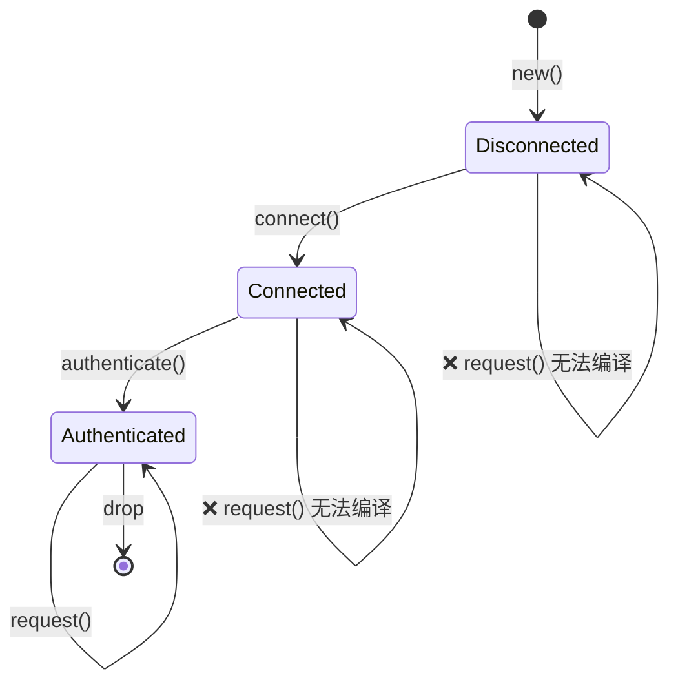
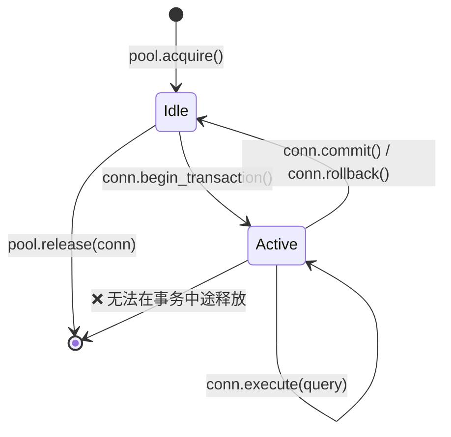
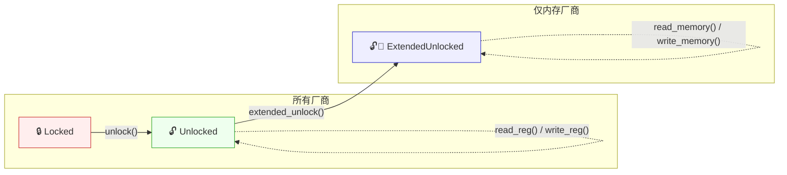
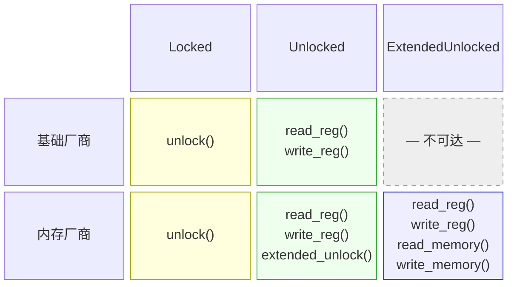

# 3. Newtype 模式与类型状态（Type-State）模式 🟡

> **你将学到：**
> - Newtype 模式：零成本的编译期类型安全
> - 类型状态模式：让非法的状态转换无法表达
> - 结合类型状态的 Builder 模式：编译期强制构造顺序
> - Config trait 模式：驯服泛型参数爆炸

## Newtype：零成本的类型安全

Newtype 模式将一个已有类型包裹在单字段元组结构体（tuple struct）中，从而创建一个独特的类型，且运行时零开销：

```rust
// ============================================================
// Newtype 模式基础：用单字段元组结构体创建独特的类型
// ============================================================
// 核心概念：newtype 把一个已有类型包裹进元组结构体（tuple struct），
// 产生一个全新的、独特的类型。由于新类型与内部类型在类型系统中完全不同，
// 编译器能在编译期捕获参数顺序错乱等 bug，且运行时零开销
// （元组结构体在内存布局上与内部类型完全一致）。

// 没有 newtype —— 很容易混淆：
// ↓ 两个参数都是 u32，两个参数都是 String，类型系统无法区分它们
fn create_user(name: String, email: String, age: u32, employee_id: u32) { }
// create_user(name, email, age, id);  —— 但如果调换 age 和 id 呢？
// create_user(name, email, id, age);  —— 能正常编译，但是个 BUG

// 使用 newtype —— 编译器能捕获错误：
// ↓ 每个结构体都是独一无二的类型，即使内部类型相同
struct UserName(String);   // → 元组结构体：字段通过 .0 访问，零运行时开销
struct Email(String);
struct Age(u32);
struct EmployeeId(u32);

// ↓ 现在每个参数都有独特的类型，编译器强制参数顺序正确
fn create_user(name: UserName, email: Email, age: Age, id: EmployeeId) { }
// create_user(name, email, EmployeeId(42), Age(30));
// ❌ 编译错误：期望 Age，却得到 EmployeeId
```

### 为 Newtype 实现 `impl Deref` —— 威力与陷阱

为 newtype 实现 `Deref` 可以让它自动强制转换（coerce）为内部类型的引用，从而让你"免费"获得内部类型的所有方法：

```rust
// ============================================================
// 为 Newtype 实现 Deref trait —— 自动解引用与能力继承
// ============================================================
// 核心概念：Deref trait（std::ops::Deref）定义了"解引用强制转换"
// （deref coercion）。实现 Deref 后，当方法在 Email 上找不到时，
// 编译器会自动调用 deref() 拿到 &str，再在 &str 上查找方法。
//
// 这让 newtype "免费"获得内部类型的所有方法，但代价是抽象边界被削弱——
// 内部类型的每个方法都变得可调用，即使你不想暴露它们。

use std::ops::Deref;  // → 引入 Deref trait，它含一个必须实现的 deref 方法

struct Email(String);

impl Email {
    // ↓ 构造函数：接收 &str，返回 Result<Self, &str>
    //   Ok 包装一个验证通过的 Email，Err 返回错误信息
    fn new(raw: &str) -> Result<Self, &'static str> {
        // ↓ str::contains 检查是否包含子串，返回 bool
        if raw.contains('@') {
            // ↓ raw.to_string() 将 &str 转换为堆分配的 String
            //   Email(raw.to_string()) 构造元组结构体实例
            Ok(Email(raw.to_string()))
        } else {
            Err("invalid email: missing @")
        }
    }
}

// ↓ impl Deref for Email：为 Email 实现解引用 trait
//   关联类型 Target = str 表示解引用后的目标类型是 str（而非 String）
impl Deref for Email {
    type Target = str;
    // ↓ deref(&self) -> &str：返回内部 str 的引用
    //   &self.0 访问元组结构体的第 0 个字段（一个 String），
    //   再对其取引用得到 &String，自动解引用为 &str
    fn deref(&self) -> &str { &self.0 }
}

// 现在 Email 会自动解引用为 &str：
// ↓ Result::unwrap() 取出 Ok 中的值，若是 Err 则 panic
let email = Email::new("user@example.com").unwrap();
// ↓ email.len() 在 Email 上找不到此方法 → 解引用为 &str → 调用 str::len()
// → str::len() 返回字节数（usize），此处通过 Deref 强制转换间接调用
println!("Length: {}", email.len()); // 通过 Deref 调用 str::len
```

这很方便——但它实际上在你的 newtype 抽象边界上**凿了一个洞**，因为目标类型上的*每一个*方法都会在你的包装类型上变得可调用。

#### 何时适合使用 `Deref`

| 场景 | 示例 | 为什么没问题 |
|----------|---------|---------------|
| 智能指针包装器 | `Box<T>`、`Arc<T>`、`MutexGuard<T>` | 包装器的全部目的就是表现得像 `T` |
| 透明的"薄"包装器 | `String` → `str`、`PathBuf` → `Path`、`Vec<T>` → `[T]` | 包装器本身就是目标类型的超集 |
| 你的 newtype 确实就是内部类型 | `struct Hostname(String)`，且你总是想要完整的字符串操作 | 限制 API 不会带来任何价值 |

#### 何时 `Deref` 是反模式

| 场景 | 问题 |
|----------|---------|
| **带不变式的领域类型** | `Email` 解引用为 `&str`，因此调用者可以调用 `.split_at()`、`.trim()` 等——这些方法都不能保持"必须包含 @"的不变式。如果有人存储了被 trim 的 `&str` 并重新构造，不变式就丢失了。 |
| **你希望限制 API 的类型** | `struct Password(String)` 加上 `Deref<Target = str>` 会泄漏 `.as_bytes()`、`.chars()`、`Debug` 输出——恰好是你想要隐藏的东西。 |
| **虚假的继承** | 使用 `Deref` 让 `ManagerWidget` 自动解引用为 `Widget` 来模拟 OOP 继承。这是明确不推荐的做法——参见 Rust API 指南（C-DEREF）。 |

> **经验法则**：如果你的 newtype 的存在是为了*增加类型安全*或*限制 API*，就不要实现 `Deref`。如果它的存在是为了在保留内部类型完整表面的同时*增加能力*（比如智能指针），那么 `Deref` 是正确的选择。

#### `DerefMut` —— 风险加倍

如果你还实现了 `DerefMut`，调用者可以直接*修改*内部值，绕过你在构造函数中的任何验证：

```rust
// ============================================================
// DerefMut —— 风险加倍，允许调用者修改内部值
// ============================================================
// 核心概念：DerefMut（std::ops::DerefMut）是 Deref 的可变版本。
// 实现它后，调用者可以直接获取内部值的 &mut 引用，从而绕过构造函数中的
// 所有验证逻辑，写入任意（可能非法的）值。

use std::ops::{Deref, DerefMut};  // → 同时引入只读与可变解引用 trait

struct PortNumber(u16);

impl Deref for PortNumber {
    type Target = u16;
    // ↓ deref 返回只读引用，允许读取内部值
    fn deref(&self) -> &u16 { &self.0 }
}

impl DerefMut for PortNumber {
    // ↓ deref_mut 返回可变引用 &mut u16，允许调用者直接改写内部值
    //   返回 &mut self.0 —— 等同于获取内部字段的完全可变访问
    fn deref_mut(&mut self) -> &mut u16 { &mut self.0 }
}

let mut port = PortNumber(443);
// ↓ *port = 0 通过 deref_mut 拿到 &mut u16，然后解引用赋值为 0
// ⚠️ 这绕过了所有校验——如果 PortNumber 有"必须 > 0"的不变式，此刻已被破坏
// → 编译器对此毫无察觉，因为类型系统无法感知你的领域不变式
*port = 0; // 绕过了所有校验 —— 现在是一个无效端口
```

只有当内部类型没有需要保护的不变式时，才实现 `DerefMut`。

#### 更推荐显式委托

当你只想要内部类型的*部分*方法时，请显式委托：

```rust
// ============================================================
// 显式委托（explicit delegation）—— 比 Deref 更安全的替代方案
// ============================================================
// 核心概念：与其实现 Deref 让所有方法都泄漏出去，不如手动为 newtype 实现
// 你真正想暴露的那些方法。每个方法内部调用内部类型的对应方法（委托）。
// 这样你精确控制 API 表面——未实现的方法根本不可调用。

struct Email(String);

impl Email {
    // ↓ 构造函数：验证后创建实例，Result<Self, &str>
    fn new(raw: &str) -> Result<Self, &'static str> {
        if raw.contains('@') { Ok(Email(raw.to_string())) }
        else { Err("missing @") }
    }

    // 只暴露有意义的方法：
    // ↓ as_str 返回内部 str 的引用，调用者只能读取，无法修改
    pub fn as_str(&self) -> &str { &self.0 }
    // ↓ len 委托给 str::len，返回字节数 usize
    pub fn len(&self) -> usize { self.0.len() }
    // ↓ domain 提取 '@' 之后的部分
    //   str::split('@') 返回迭代器，nth(1) 取第二个元素
    //   unwrap_or("") —— 不存在时返回空串，避免 panic
    pub fn domain(&self) -> &str {
        self.0.split('@').nth(1).unwrap_or("")
    }
    // .split_at()、.trim()、.replace() —— 未暴露，因此不可调用
    // 这保护了 Email 的不变式（必须包含 @）
}
```

#### Clippy 与生态系统

- **`clippy::wrong_self_convention`** 可能会在 `Deref` 强制转换导致方法解析出人意料时触发（例如 `is_empty()` 解析到内部类型的版本，而不是你想要覆盖的版本）。
- **Rust API 指南**（C-DEREF）指出：*"只有智能指针才应该实现 `Deref`。"* 将此视为强有力的默认规则；只有在有充分理由时才偏离它。
- 如果你需要 trait 兼容性（例如将 `Email` 传给期望 `&str` 的函数），考虑实现 `AsRef<str>` 和 `Borrow<str>` 作为替代——它们是显式转换，不会有自动强制转换的意外。

#### 决策矩阵

```text
你是否希望内部类型的所有方法都可调用？
  ├─ 是 → 你的类型是否维护不变式或限制 API？
  │    ├─ 否  → impl Deref ✅  (智能指针 / 透明包装器)
  │    └─ 是 → 不要 impl Deref ❌ (不变式会泄漏)
  └─ 否  → 不要 impl Deref ❌  (改用 AsRef / 显式委托)
```

### 类型状态：编译期协议强制

类型状态（type-state）模式利用类型系统来强制操作按正确顺序发生。非法状态变得**无法表达**。



> 每次转换都*消费* `self` 并返回一个新类型——编译器强制执行有效的顺序。

```rust
// ============================================================
// 类型状态模式（Type-State Pattern）—— 用类型系统强制状态机顺序
// ============================================================
// 核心概念：把"状态"编码进类型参数，每个状态只在自己的 impl 块里暴露
// 合法的方法。状态转换通过"消费 self 并返回新类型"实现——旧状态被 move
// 掉，无法再使用。非法状态转换直接变成编译错误，零运行时开销。
//
// 关键机制：
//   1. PhantomData<State> —— 零大小标记，携带状态信息但不占内存
//   2. 状态类型（Disconnected/Connected/Authenticated）—— 零大小标记类型
//   3. 条件 impl 块 —— 只在特定状态参数化时才暴露方法
//   4. 消费 self 的转换 —— fn connect(self) -> Connection<Connected>

// 问题：一个网络连接必须按以下顺序：
// 1. 创建
// 2. 建立连接
// 3. 完成认证
// 4. 然后才能用于请求
// 在 authenticate() 之前调用 request() 应当是编译错误。

// --- 类型状态标记（零大小类型） ---
// ↓ 这些结构体没有字段（单元结构体），编译期存在、运行时消失（零大小）
struct Disconnected;
struct Connected;
struct Authenticated;

// --- 按状态参数化的 Connection ---
// ↓ <State> 是泛型类型参数，代表连接的当前状态
//   _state: PhantomData<State> —— PhantomData 零大小，仅用于让编译器
//   知道此结构体"关联"了 State 类型（用于变型与 drop 检查），不占内存
struct Connection<State> {
    address: String,
    _state: std::marker::PhantomData<State>,
}

// 只有 Disconnected 连接才能 connect：
// ↓ impl Connection<Disconnected>：这个 impl 块只在状态为 Disconnected 时生效
//   即 new() 和 connect() 只有在 Connection<Disconnected> 上才存在
impl Connection<Disconnected> {
    // ↓ new 构造函数：接收地址，返回 Connection<Disconnected>
    fn new(address: &str) -> Self {
        Connection {
            address: address.to_string(),
            // ↓ PhantomData 是零大小单元结构体，用单元值 () 初始化（写法惯用）
            _state: std::marker::PhantomData,
        }
    }

    // ↓ connect 消费 self（按值接收），返回 Connection<Connected>
    //   消费 self 意味着旧的 Disconnected 连接被 move，无法再次使用
    fn connect(self) -> Connection<Connected> {
        println!("Connecting to {}...", self.address);
        Connection {
            address: self.address,
            _state: std::marker::PhantomData,
        }
    }
}

// 只有 Connected 连接才能 authenticate：
impl Connection<Connected> {
    // ↓ authenticate(self, token) -> Connection<Authenticated>
    //   同样消费 self，推进状态机到认证完成
    fn authenticate(self, _token: &str) -> Connection<Authenticated> {
        println!("Authenticating...");
        Connection {
            address: self.address,
            _state: std::marker::PhantomData,
        }
    }
}

// 只有 Authenticated 连接才能发起请求：
impl Connection<Authenticated> {
    // ↓ request(&self, path) -> String：注意这里是 &self（借用），不消费 self
    //   因为 Authenticated 是终态，可以多次调用 request
    fn request(&self, path: &str) -> String {
        // ↓ format! 宏格式化字符串，返回新的 String
        format!("GET {} from {}", path, self.address)
    }
}

fn main() {
    // ↓ Connection::new 推断返回 Connection<Disconnected>
    let conn = Connection::new("api.example.com");
    // conn.request("/data"); // ❌ 编译错误：Connection<Disconnected> 上没有方法 `request`

    // ↓ connect() 消费 conn，返回 Connection<Connected>，重新绑定到 conn
    let conn = conn.connect();
    // conn.request("/data"); // ❌ 编译错误：Connection<Connected> 上没有方法 `request`

    // ↓ authenticate() 再消费，推进到 Connection<Authenticated>
    let conn = conn.authenticate("secret-token");
    let response = conn.request("/data"); // ✅ 只有认证后才有效
    println!("{response}");
}
```

> **核心洞见**：每次状态转换都*消费* `self` 并返回一个新类型。
> 转换后你无法使用旧状态——编译器会强制执行这一点。
> 零运行时开销——`PhantomData` 是零大小的，状态在编译期被擦除。

**与 C++/C# 对比**：在 C++ 或 C# 中，你会用运行时检查（`if (!authenticated) throw ...`）来强制执行这一点。Rust 的类型状态模式将这些检查移到编译期——非法状态在类型系统中根本无法表达。

### 结合类型状态的 Builder 模式

一个实际应用——一个强制要求必填字段的构建器：

```rust
// ============================================================
// 结合类型状态的 Builder 模式 —— 编译期强制必填字段顺序
// ============================================================
// 核心概念：用类型状态编码"还缺哪些字段"。每个必填字段的 setter 方法
// 被放在特定的 impl 块里，调用它后状态类型改变，从而解锁下一个字段。
// build() 只在 Ready 状态下存在——跳过任何必填字段都无法编译。

use std::marker::PhantomData;

// 必填字段的标记类型
// ↓ 这些都是零大小标记类型，代表"当前配置处于哪个阶段"
struct NeedsName;
struct NeedsPort;
struct Ready;

// ↓ <State> 泛型参数代表当前构建阶段
struct ServerConfig<State> {
    name: Option<String>,        // → Option<T> 表示字段可能尚未提供
    port: Option<u16>,
    max_connections: usize, // 可选，有默认值
    _state: PhantomData<State>,
}

// ↓ 在 NeedsName 阶段：只有 new() 和 name() 可用
impl ServerConfig<NeedsName> {
    fn new() -> Self {
        ServerConfig {
            name: None,
            port: None,
            max_connections: 100,  // → 默认值
            _state: PhantomData,
        }
    }

    // ↓ name(self, name) -> ServerConfig<NeedsPort>
    //   提供 name 后状态推进到 NeedsPort，解锁 port() 方法
    fn name(self, name: &str) -> ServerConfig<NeedsPort> {
        ServerConfig {
            name: Some(name.to_string()),
            port: self.port,
            max_connections: self.max_connections,
            _state: PhantomData,
        }
    }
}

// ↓ 在 NeedsPort 阶段：只有 port() 可用
impl ServerConfig<NeedsPort> {
    // ↓ port(self, port) -> ServerConfig<Ready>
    //   提供 port 后进入 Ready，解锁 build()
    fn port(self, port: u16) -> ServerConfig<Ready> {
        ServerConfig {
            name: self.name,
            port: Some(port),
            max_connections: self.max_connections,
            _state: PhantomData,
        }
    }
}

// ↓ 在 Ready 阶段：可选字段 setter 和 build() 都可用
impl ServerConfig<Ready> {
    // ↓ max_connections(mut self, n) -> Self：接收 mut self，原地修改后返回
    //   返回 Self（仍是 Ready），所以可链式调用
    fn max_connections(mut self, n: usize) -> Self {
        self.max_connections = n;
        self
    }

    // ↓ build(self) -> Server：消费配置，产出最终产品
    //   unwrap() 取出 Option 中的值——此处安全，因为只有 Ready 状态才能到达此处
    fn build(self) -> Server {
        Server {
            name: self.name.unwrap(),
            port: self.port.unwrap(),
            max_connections: self.max_connections,
        }
    }
}

struct Server {
    name: String,
    port: u16,
    max_connections: usize,
}

fn main() {
    // 必须先提供 name，再提供 port，然后才能 build：
    // ↓ 链式调用：new() → NeedsName，name() → NeedsPort，port() → Ready
    let server = ServerConfig::new()
        .name("my-server")
        .port(8080)
        .max_connections(500)
        .build();

    // ServerConfig::new().port(8080); // ❌ 编译错误：NeedsName 上没有方法 `port`
    // ServerConfig::new().name("x").build(); // ❌ 编译错误：NeedsPort 上没有方法 `build`
}
```

***

## 案例研究：类型安全的连接池

真实系统需要连接池，其中连接会在明确定义的状态之间流转。以下是类型状态模式如何在一个生产级连接池中强制正确性：



```rust
// ============================================================
// 案例研究：类型安全的连接池 —— 防止事务中途归还连接
// ============================================================
// 核心概念：连接池中的连接在 Idle / InTransaction 两种状态间流转。
// 类型状态模式保证：只有 Idle 连接才能被归还给连接池——
// 在事务中途归还连接会导致数据库锁泄漏，这是生产环境中的严重 bug。
// 编译器通过类型检查把它变成不可能发生的事。

use std::marker::PhantomData;

// 状态
struct Idle;          // → 连接空闲，可被归还或开启事务
struct InTransaction; // → 连接正在事务中，不可归还

// ↓ 泛型参数 State 编码连接的当前状态
struct PooledConnection<State> {
    id: u32,
    _state: PhantomData<State>,
}

struct Pool {
    next_id: u32,
}

impl Pool {
    fn new() -> Self { Pool { next_id: 0 } }

    // ↓ acquire(&mut self) -> PooledConnection<Idle>
    //   借用可变 self 生成新 id，返回一个 Idle 状态的连接
    fn acquire(&mut self) -> PooledConnection<Idle> {
        self.next_id += 1;
        println!("[pool] Acquired connection #{}", self.next_id);
        PooledConnection { id: self.next_id, _state: PhantomData }
    }

    // 只有 Idle 连接才能被释放 —— 防止事务中途泄漏
    // ↓ release(&self, conn: PooledConnection<Idle>)
    //   参数类型必须是 PooledConnection<Idle>，接受按值传递（连接被消费/释放）
    //   如果传入 InTransaction，类型不匹配，编译失败
    fn release(&self, conn: PooledConnection<Idle>) {
        println!("[pool] Released connection #{}", conn.id);
    }
}

// ↓ Idle 连接只能 begin_transaction
impl PooledConnection<Idle> {
    // ↓ begin_transaction(self) -> PooledConnection<InTransaction>
    //   消费 self，推进到事务状态
    fn begin_transaction(self) -> PooledConnection<InTransaction> {
        println!("[conn #{}] BEGIN", self.id);
        PooledConnection { id: self.id, _state: PhantomData }
    }
}

// ↓ InTransaction 连接可以 execute / commit / rollback
impl PooledConnection<InTransaction> {
    // ↓ execute(&self, query)：借用 self，不改变状态，可多次调用
    fn execute(&self, query: &str) {
        println!("[conn #{}] EXEC: {}", self.id, query);
    }

    // ↓ commit(self) -> PooledConnection<Idle>：消费 self，提交事务，回到空闲
    fn commit(self) -> PooledConnection<Idle> {
        println!("[conn #{}] COMMIT", self.id);
        PooledConnection { id: self.id, _state: PhantomData }
    }

    // ↓ rollback(self) -> PooledConnection<Idle>：消费 self，回滚事务，回到空闲
    fn rollback(self) -> PooledConnection<Idle> {
        println!("[conn #{}] ROLLBACK", self.id);
        PooledConnection { id: self.id, _state: PhantomData }
    }
}

fn main() {
    let mut pool = Pool::new();

    // ↓ acquire 返回 Idle 连接
    let conn = pool.acquire();
    // ↓ begin_transaction 消费 Idle 连接，返回 InTransaction 连接
    let conn = conn.begin_transaction();
    // ↓ execute 借用 InTransaction 连接（&self），不改变状态
    conn.execute("INSERT INTO users VALUES ('Alice')");
    conn.execute("INSERT INTO orders VALUES (1, 42)");
    // ↓ commit 消费 InTransaction 连接，提交后回到 Idle
    let conn = conn.commit(); // 回到 Idle
    // ↓ release 只接受 Idle 连接——此处 conn 是 Idle，类型匹配 ✅
    pool.release(conn);       // ✅ 只对 Idle 连接有效

    // pool.release(conn_active); // ❌ 编译错误：无法释放 InTransaction
}
```

**为什么这在生产中很重要**：一个在事务中途泄漏的连接会无限期地持有数据库锁。类型状态模式让这变得不可能——你简直无法在事务提交或回滚之前将连接归还给连接池。

***

## Config Trait 模式 —— 驯服泛型参数爆炸

### 问题所在

当一个结构体承担更多职责，且每个职责都由一个带 trait 约束的泛型支撑时，类型签名会变得难以管理：

```rust
// ============================================================
// 问题：泛型参数爆炸（Generic Parameter Explosion）
// ============================================================
// 核心概念：当结构体的每个组件都用一个独立的泛型参数表示时，
// 每新增一个组件类型就要加一个泛型参数。这些参数会在所有 impl 块、
// 函数签名和调用点重复出现，导致难以维护。

// ↓ 每个 trait 定义一种总线协议的接口
//   fn spi_transfer(&self, tx: &[u8], rx: &mut [u8]) -> Result<(), BusError>
//   —— &self 表示只读借用（读取设备状态），返回 Result 标记成功/失败
trait SpiBus   { fn spi_transfer(&self, tx: &[u8], rx: &mut [u8]) -> Result<(), BusError>; }
trait ComPort  { fn com_send(&self, data: &[u8]) -> Result<usize, BusError>; }
trait I3cBus   { fn i3c_read(&self, addr: u8, buf: &mut [u8]) -> Result<(), BusError>; }
trait SmBus    { fn smbus_read_byte(&self, addr: u8, cmd: u8) -> Result<u8, BusError>; }
trait GpioBus  { fn gpio_set(&self, pin: u32, high: bool); }

// ❌ 每新增一个总线 trait 都会多出一个泛型参数
// ↓ S: SpiBus 表示 S 必须实现 SpiBus trait（trait 约束/bound）
//   5 个参数意味着每次引用都要写全 DiagController<S, C, I, M, G>
struct DiagController<S: SpiBus, C: ComPort, I: I3cBus, M: SmBus, G: GpioBus> {
    spi: S,
    com: C,
    i3c: I,
    smbus: M,
    gpio: G,
}
// impl 块、函数签名和调用方都要重复完整的参数列表。
// 新增第 6 个总线意味着要修改每一处 DiagController<S, C, I, M, G>。
```

这通常被称为**"泛型参数爆炸"（generic parameter explosion）**。它在 `impl` 块、函数参数和下游消费者之间不断累积——每一处都必须重复完整的参数列表。

### 解决方案：Config Trait

将所有关联类型打包到一个 trait 中。这样，无论结构体包含多少个组件类型，它都只有**一个**泛型参数：

```rust
// ============================================================
// 解决方案：Config Trait —— 把所有组件类型打包进关联类型
// ============================================================
// 核心概念：定义一个 Config trait，为每个组件声明一个关联类型
// （associated type）。结构体只需一个泛型参数 Cfg: BoardConfig，
// 通过 Cfg::Spi、Cfg::Com 访问具体类型。新增组件只需给 Config trait
// 加一个关联类型，下游签名完全不用改。

#[derive(Debug)]
// ↓ #[derive(Debug)] 自动派生 Debug trait，让枚举可用 {:?} 格式化打印
enum BusError {
    Timeout,
    NakReceived,
    HardwareFault(String),
}

// --- 总线 trait（不变） ---
trait SpiBus {
    // ↓ &self 只读借用设备；tx 是发送缓冲，rx 是接收缓冲
    //   返回 Result<(), BusError> —— 成功为 ()，失败为错误类型
    fn spi_transfer(&self, tx: &[u8], rx: &mut [u8]) -> Result<(), BusError>;
    fn spi_write(&self, data: &[u8]) -> Result<(), BusError>;
}

trait ComPort {
    fn com_send(&self, data: &[u8]) -> Result<usize, BusError>;
    fn com_recv(&self, buf: &mut [u8], timeout_ms: u32) -> Result<usize, BusError>;
}

trait I3cBus {
    fn i3c_read(&self, addr: u8, buf: &mut [u8]) -> Result<(), BusError>;
    fn i3c_write(&self, addr: u8, data: &[u8]) -> Result<(), BusError>;
}

// --- Config trait：每个组件对应一个关联类型 ---
// ↓ 关联类型（associated type）：用 type 关键字声明，必须满足冒号后的 trait 约束
//   type Spi: SpiBus 表示"配置必须指定一个实现了 SpiBus 的类型作为 Spi"
trait BoardConfig {
    type Spi: SpiBus;   // → 此配置使用的 SPI 驱动类型
    type Com: ComPort;  // → 使用的串口驱动类型
    type I3c: I3cBus;   // → 使用的 I3C 驱动类型
}

// --- DiagController 恰好只有一个泛型参数 ---
// ↓ Cfg: BoardConfig 是唯一的泛型参数
//   通过 Cfg::Spi / Cfg::Com / Cfg::I3c 访问关联类型（即具体驱动类型）
struct DiagController<Cfg: BoardConfig> {
    spi: Cfg::Spi,
    com: Cfg::Com,
    i3c: Cfg::I3c,
}
```

`DiagController<Cfg>` 永远不会再增加泛型参数。
增加第 4 个总线意味着向 `BoardConfig` 添加一个关联类型，以及向 `DiagController` 添加一个字段——不需要修改下游签名。

### 实现控制器

```rust
// ============================================================
// 实现 DiagController —— 诊断控制器的具体方法
// ============================================================
// 核心概念：impl<Cfg: BoardConfig> 表示"对所有实现了 BoardConfig 的类型 Cfg"
// 都实现这些方法。方法内部通过 Cfg::Spi 等关联类型调用底层总线驱动的
// 具体 trait 方法。由于是静态分发（单态化），运行时零开销。

// ↓ impl<Cfg: BoardConfig> —— 泛型 impl 块，对所有满足约束的 Cfg 通用
impl<Cfg: BoardConfig> DiagController<Cfg> {
    // ↓ new 构造函数，参数类型来自关联类型
    fn new(spi: Cfg::Spi, com: Cfg::Com, i3c: Cfg::I3c) -> Self {
        DiagController { spi, com, i3c }
    }

    // ↓ read_flash_id(&self) -> Result<u32, BusError>
    //   通过 SPI 总线读取闪存芯片的 JEDEC ID
    fn read_flash_id(&self) -> Result<u32, BusError> {
        let cmd = [0x9F]; // JEDEC 读取 ID 命令字节
        let mut id = [0u8; 4]; // → 接收缓冲区，4 字节
        // ↓ ? 运算符：若 spi_transfer 返回 Err，立即从本函数返回该错误
        //   spi_transfer 通过 trait 方法分派到具体的 Cfg::Spi 驱动
        self.spi.spi_transfer(&cmd, &mut id)?;
        // ↓ u32::from_be_bytes(id) 将 4 字节大端序数组转成 u32
        Ok(u32::from_be_bytes(id))
    }

    fn send_bmc_command(&self, cmd: &[u8]) -> Result<Vec<u8>, BusError> {
        self.com.com_send(cmd)?;
        let mut resp = vec![0u8; 256]; // → vec! 宏创建堆分配的 Vec
        // ↓ com_recv 返回实际读取的字节数 usize
        let n = self.com.com_recv(&mut resp, 1000)?;
        resp.truncate(n); // → Vec::truncate 截断到前 n 个字节
        Ok(resp)
    }

    fn read_sensor_temp(&self, sensor_addr: u8) -> Result<i16, BusError> {
        let mut buf = [0u8; 2];
        self.i3c.i3c_read(sensor_addr, &mut buf)?;
        // ↓ i16::from_be_bytes 将 2 字节大端序转为 i16（有符号整数，表示温度）
        Ok(i16::from_be_bytes(buf))
    }

    fn run_full_diag(&self) -> Result<DiagReport, BusError> {
        let flash_id = self.read_flash_id()?;
        let bmc_resp = self.send_bmc_command(b"VERSION\n")?;
        let cpu_temp = self.read_sensor_temp(0x48)?;
        let gpu_temp = self.read_sensor_temp(0x49)?;

        Ok(DiagReport {
            flash_id,
            // ↓ String::from_utf8_lossy 将字节切片转为 String，无效 UTF-8 用替代字符
            bmc_version: String::from_utf8_lossy(&bmc_resp).to_string(),
            cpu_temp_c: cpu_temp,
            gpu_temp_c: gpu_temp,
        })
    }
}

#[derive(Debug)]
struct DiagReport {
    flash_id: u32,
    bmc_version: String,
    cpu_temp_c: i16,
    gpu_temp_c: i16,
}
```

### 生产环境接线

一个 `impl BoardConfig` 选择具体的硬件驱动：

```rust
// ============================================================
// 生产环境接线：为真实硬件实现 Config
// ============================================================
// 核心概念：定义具体的驱动结构体，为它们实现总线 trait，然后在一个
// 单元结构体 ProductionBoard 上实现 BoardConfig，把所有关联类型绑定到
// 具体驱动。这是类型解析的集中点——所有具体类型在此"组装"。

struct PlatformSpi  { dev: String, speed_hz: u32 }
struct UartCom      { dev: String, baud: u32 }
struct LinuxI3c     { dev: String }

impl SpiBus for PlatformSpi {
    fn spi_transfer(&self, tx: &[u8], rx: &mut [u8]) -> Result<(), BusError> {
        // 生产环境中使用 ioctl(SPI_IOC_MESSAGE)
        // ↓ copy_from_slice 把源切片复制到目标切片（长度必须相等）
        rx[0..4].copy_from_slice(&[0xEF, 0x40, 0x18, 0x00]);
        Ok(())
    }
    fn spi_write(&self, _data: &[u8]) -> Result<(), BusError> { Ok(()) }
}

impl ComPort for UartCom {
    fn com_send(&self, _data: &[u8]) -> Result<usize, BusError> { Ok(0) }
    fn com_recv(&self, buf: &mut [u8], _timeout: u32) -> Result<usize, BusError> {
        // ↓ b"BMC..." 是字节字符串字面量（&[u8; N]）
        let resp = b"BMC v2.4.1\n";
        buf[..resp.len()].copy_from_slice(resp);
        Ok(resp.len())
    }
}

impl I3cBus for LinuxI3c {
    fn i3c_read(&self, _addr: u8, buf: &mut [u8]) -> Result<(), BusError> {
        buf[0] = 0x00; buf[1] = 0x2D; // 45°C（0x002D 大端 = 45）
        Ok(())
    }
    fn i3c_write(&self, _addr: u8, _data: &[u8]) -> Result<(), BusError> { Ok(()) }
}

// ✅ 一个结构体，一个 impl —— 所有具体类型都在此解析
// ↓ ProductionBoard 是单元结构体（无字段），仅用作 BoardConfig 的类型标签
struct ProductionBoard;
// ↓ impl BoardConfig for ProductionBoard：在此指定关联类型的具体绑定
//   type Spi = PlatformSpi 把 BoardConfig 的 Spi 关联到具体驱动
impl BoardConfig for ProductionBoard {
    type Spi = PlatformSpi;
    type Com = UartCom;
    type I3c = LinuxI3c;
}

fn main() {
    // ↓ DiagController::<ProductionBoard>::new 显式指定泛型参数（turbofish 语法 ::<>）
    //   .into() 利用 Into trait 自动转换类型（此处 &str → String）
    let ctrl = DiagController::<ProductionBoard>::new(
        PlatformSpi { dev: "/dev/spidev0.0".into(), speed_hz: 10_000_000 },
        UartCom     { dev: "/dev/ttyS0".into(),     baud: 115200 },
        LinuxI3c    { dev: "/dev/i3c-0".into() },
    );
    // ↓ run_full_diag 返回 Result，unwrap 取出 Ok 值（失败则 panic）
    let report = ctrl.run_full_diag().unwrap();
    // ↓ {report:#?} 使用 Debug 的"美化"格式，带换行缩进
    println!("{report:#?}");
}
```

### 使用 Mock 进行测试接线

通过定义一个不同的 `BoardConfig`，你可以替换整个硬件层：

```rust
// ============================================================
// 测试接线：用 Mock 实现替换整个硬件层
// ============================================================
// 核心概念：定义一套 Mock 驱动，它们实现相同的总线 trait 但返回预设数据。
// 再定义一个 TestBoard 实现 BoardConfig 绑定到这些 Mock。
// 测试时 DiagController<TestBoard> 就用 Mock 驱动——完全脱离真实硬件。
// 零条件编译（无需 #[cfg] 包裹实现代码）。

struct MockSpi  { flash_id: [u8; 4] }
struct MockCom  { response: Vec<u8> }
// ↓ HashMap<u8, i16>：键是传感器地址，值是对应温度
struct MockI3c  { temps: std::collections::HashMap<u8, i16> }

impl SpiBus for MockSpi {
    fn spi_transfer(&self, _tx: &[u8], rx: &mut [u8]) -> Result<(), BusError> {
        rx[..4].copy_from_slice(&self.flash_id);
        Ok(())
    }
    fn spi_write(&self, _data: &[u8]) -> Result<(), BusError> { Ok(()) }
}

impl ComPort for MockCom {
    fn com_send(&self, _data: &[u8]) -> Result<usize, BusError> { Ok(0) }
    fn com_recv(&self, buf: &mut [u8], _timeout: u32) -> Result<usize, BusError> {
        // ↓ .min() 取两个长度的较小值，避免缓冲区溢出
        let n = self.response.len().min(buf.len());
        buf[..n].copy_from_slice(&self.response[..n]);
        Ok(n)
    }
}

impl I3cBus for MockI3c {
    fn i3c_read(&self, addr: u8, buf: &mut [u8]) -> Result<(), BusError> {
        // ↓ HashMap::get(&addr) 返回 Option<&i16>
        //   .copied() 把 Option<&i16> 转为 Option<i16>
        //   .unwrap_or(0) 在 None 时返回默认值 0
        let temp = self.temps.get(&addr).copied().unwrap_or(0);
        // ↓ i16::to_be_bytes() 转成 2 字节大端序数组
        buf[..2].copy_from_slice(&temp.to_be_bytes());
        Ok(())
    }
    fn i3c_write(&self, _addr: u8, _data: &[u8]) -> Result<(), BusError> { Ok(()) }
}

// ↓ TestBoard 绑定到 Mock 驱动——与 ProductionBoard 平行的另一套配置
struct TestBoard;
impl BoardConfig for TestBoard {
    type Spi = MockSpi;
    type Com = MockCom;
    type I3c = MockI3c;
}

// ↓ #[cfg(test)] 表示此模块仅在测试构建时编译
#[cfg(test)]
mod tests {
    // ↓ use super::* 引入父模块的所有公开项
    use super::*;

    fn make_test_controller() -> DiagController<TestBoard> {
        let mut temps = std::collections::HashMap::new();
        temps.insert(0x48, 45i16);
        temps.insert(0x49, 72i16);

        DiagController::<TestBoard>::new(
            MockSpi  { flash_id: [0xEF, 0x40, 0x18, 0x00] },
            // ↓ .to_vec() 把字节切片转为 Vec<u8>
            MockCom  { response: b"BMC v2.4.1\n".to_vec() },
            MockI3c  { temps },
        )
    }

    // ↓ #[test] 标记为测试函数，cargo test 会自动运行
    #[test]
    fn test_flash_id() {
        let ctrl = make_test_controller();
        // ↓ assert_eq! 断言两个值相等，不等则 panic 并打印两者
        assert_eq!(ctrl.read_flash_id().unwrap(), 0xEF401800);
    }

    #[test]
    fn test_sensor_temps() {
        let ctrl = make_test_controller();
        assert_eq!(ctrl.read_sensor_temp(0x48).unwrap(), 45);
        assert_eq!(ctrl.read_sensor_temp(0x49).unwrap(), 72);
    }

    #[test]
    fn test_full_diag() {
        let ctrl = make_test_controller();
        let report = ctrl.run_full_diag().unwrap();
        assert_eq!(report.flash_id, 0xEF401800);
        assert_eq!(report.cpu_temp_c, 45);
        assert_eq!(report.gpu_temp_c, 72);
        // ↓ str::contains 检查是否包含子串，返回 bool
        assert!(report.bmc_version.contains("2.4.1"));
    }
}
```

### 之后添加新总线

当你需要第 4 个总线时，只有两处需要修改——`BoardConfig` 和 `DiagController`。
**不需要修改下游签名。** 泛型参数数量保持为 1：

```rust
// ============================================================
// 扩展：新增一个总线只需三处修改，泛型参数仍是 1 个
// ============================================================
// 核心概念：Config Trait 模式的扩展性——新增组件只需：
//   1. 给 BoardConfig 加一个关联类型
//   2. 给 DiagController 加一个字段
//   3. 在每个配置实现里提供具体类型
// 泛型参数数量永远保持为 1，下游签名完全不变。

// ↓ 新增的总线 trait
//   fn smbus_read_byte(&self, addr, cmd) -> Result<u8, BusError>
trait SmBus {
    fn smbus_read_byte(&self, addr: u8, cmd: u8) -> Result<u8, BusError>;
}

// 1. 新增一个关联类型：
trait BoardConfig {
    type Spi: SpiBus;
    type Com: ComPort;
    type I3c: I3cBus;
    type Smb: SmBus;     // ← 新增，约束为必须实现 SmBus
}

// 2. 新增一个字段：
struct DiagController<Cfg: BoardConfig> {
    spi: Cfg::Spi,
    com: Cfg::Com,
    i3c: Cfg::I3c,
    smb: Cfg::Smb,       // ← 新增，类型来自关联类型
}

// 3. 在每个 config impl 中提供具体类型：
impl BoardConfig for ProductionBoard {
    type Spi = PlatformSpi;
    type Com = UartCom;
    type I3c = LinuxI3c;
    type Smb = LinuxSmbus; // ← 新增，绑定到具体驱动
}
```

### 何时使用此模式

| 场景 | 使用 Config Trait？ | 替代方案 |
|-----------|:-:|---|
| 结构体上有 3 个以上带 trait 约束的泛型 | ✅ 是 | — |
| 需要替换整个硬件/平台层 | ✅ 是 | — |
| 只有 1-2 个泛型 | ❌ 杀鸡用牛刀 | 直接使用泛型 |
| 需要运行时多态 | ❌ | `dyn Trait` 对象 |
| 开放式插件系统 | ❌ | Type-map / `Any` |
| 组件 trait 形成自然分组（主板、平台） | ✅ 是 | — |

### 关键特性

- **永远只有一个泛型参数** —— `DiagController<Cfg>` 永远不会增加更多的 `<A, B, C, ...>`
- **完全静态分发** —— 没有 vtable，没有 `dyn`，没有为 trait 对象分配堆内存
- **干净的测试替换** —— 用 mock 实现定义 `TestBoard`，零条件编译
- **编译期安全** —— 忘记一个关联类型 → 编译错误，而非运行时崩溃
- **久经考验** —— 这是 Substrate/Polkadot 的 frame 系统使用的模式，通过单个 `Config` trait 管理 20 多个关联类型

> **核心要点 —— Newtype 与类型状态**
> - Newtype 以零运行时成本提供编译期类型安全
> - 类型状态让非法的状态转换成为编译错误，而非运行时 bug
> - Config trait 驯服大型系统中的泛型参数爆炸

> **参见：** [第 4 章 —— PhantomData](ch04-phantomdata-types-that-carry-no-data.md) 了解为类型状态提供支持的零大小标记。[第 2 章 —— Traits 深入](ch02-traits-in-depth.md) 了解 Config trait 模式中使用的关联类型。

---

## 案例研究：双轴类型状态 —— 厂商 × 协议状态

上面的模式一次只处理一个轴：类型状态强制执行*协议顺序*，trait 抽象处理*多个厂商*。真实系统通常需要**两者同时**：一个包装器 `Handle<Vendor, State>`，其可用方法取决于*插入的是哪个厂商***以及** *句柄处于哪个状态*。

本节展示**双轴条件 `impl`** 模式——其中 `impl` 块同时受到厂商 trait 约束和状态标记 trait 的门控。

### 二维问题

考虑一个调试探针接口（JTAG/SWD）。多个厂商制造探针，每个探针在寄存器可访问之前必须先解锁。一些厂商还额外支持直接内存读取——但必须在配置了内存访问端口的*扩展解锁*之后：



**能力矩阵**——哪些方法存在于哪些（厂商, 状态）组合——是二维的：



挑战在于：**完全在编译期**表达这个矩阵，使用静态分发，使得在基础探针上调用 `extended_unlock()` 或在已解锁但未扩展的句柄上调用 `read_memory()` 成为编译错误。

### 解决方案：带标记 trait 的 `Jtag<V, S>`

**第 1 步 —— 状态令牌与能力标记：**

```rust,ignore
// ============================================================
// 第 1 步：状态令牌与能力标记 trait
// ============================================================
// 核心概念：用零大小的单元结构体表示状态，再用空的标记 trait
// （marker trait，无方法体）给这些状态"打标签"，表示它们拥有哪些能力。
// 标记 trait 让条件 impl 块可以按"能力"而非"具体状态"来约束。

use std::marker::PhantomData;

// 零大小的状态令牌 —— 无运行时开销
struct Locked;
struct Unlocked;
struct ExtendedUnlocked;

// 标记 trait 表达每个状态拥有哪些能力
// ↓ HasRegAccess 是空 trait（无方法），仅用作"类型标签"
//   impl HasRegAccess for X 表示"X 状态拥有寄存器访问能力"
trait HasRegAccess {}
impl HasRegAccess for Unlocked {}
impl HasRegAccess for ExtendedUnlocked {}

// ↓ HasMemAccess 同理，但只有 ExtendedUnlocked 实现
trait HasMemAccess {}
impl HasMemAccess for ExtendedUnlocked {}
```

> **为什么用标记 trait，而不仅仅是具体状态？**
> 写 `impl<V, S: HasRegAccess> Jtag<V, S>` 意味着 `read_reg()` 在*任何*有寄存器访问权限的状态中都有效——今天这是 `Unlocked` 和 `ExtendedUnlocked`，但如果你明天添加了 `DebugHalted`，只需加一行：
> `impl HasRegAccess for DebugHalted {}`。每个寄存器函数自动就能配合它工作——零代码修改。

**第 2 步 —— 厂商 trait（原始操作）：**

```rust,ignore
// ============================================================
// 第 2 步：厂商 trait —— 定义原始硬件操作
// ============================================================
// 核心概念：把厂商差异隔离在"原始操作"层（raw_* 方法）。
// 包装器 Jtag<V, S> 只调用这些 raw_* 方法，不直接触碰硬件。
// JtagMemoryVendor 是 JtagVendor 的超 trait（subtrait），代表能力扩展。

// 每个探针厂商都实现这些
// ↓ raw_unlock(&mut self)：接收可变借用，执行解锁序列，返回 ()
//   raw_read_reg(&self, addr) -> u32：读取寄存器，返回值
trait JtagVendor {
    fn raw_unlock(&mut self);
    fn raw_read_reg(&self, addr: u32) -> u32;
    fn raw_write_reg(&mut self, addr: u32, val: u32);
}

// 支持内存访问的厂商额外实现这个超 trait
// ↓ JtagMemoryVendor: JtagVendor 表示前者是后者的子 trait
//   实现 JtagMemoryVendor 必须同时实现 JtagVendor（超 trait 要求）
trait JtagMemoryVendor: JtagVendor {
    fn raw_extended_unlock(&mut self);
    fn raw_read_memory(&self, addr: u64, buf: &mut [u8]);
    fn raw_write_memory(&mut self, addr: u64, data: &[u8]);
}
```

**第 3 步 —— 带条件 `impl` 块的包装器：**

```rust,ignore
// ============================================================
// 第 3 步：包装器 Jtag<V, S> —— 条件 impl 块编码能力矩阵
// ============================================================
// 核心概念：每个 impl 块的泛型约束不同，代表能力矩阵的一个"单元格"。
// 当且仅当厂商和状态都满足约束时，对应方法才存在。
// V 是厂商泛型，S 是状态泛型（默认 Locked）。

// ↓ <V, S = Locked>：S 的默认类型是 Locked，所以 Jtag<V> 等价于 Jtag<V, Locked>
struct Jtag<V, S = Locked> {
    vendor: V,
    _state: PhantomData<S>,
}

// 构造 —— 总是从 Locked 开始
// ↓ impl<V: JtagVendor> Jtag<V, Locked>：仅对 Locked 状态生效
impl<V: JtagVendor> Jtag<V, Locked> {
    // ↓ new(vendor: V) -> Self：接收厂商实例，返回 Locked 状态的句柄
    fn new(vendor: V) -> Self {
        Jtag { vendor, _state: PhantomData }
    }

    // ↓ unlock(mut self) -> Jtag<V, Unlocked>
    //   接收 mut self（需要可变访问 vendor），消费后返回 Unlocked 状态
    fn unlock(mut self) -> Jtag<V, Unlocked> {
        self.vendor.raw_unlock(); // → 委托给厂商的原始解锁操作
        Jtag { vendor: self.vendor, _state: PhantomData }
    }
}

// 寄存器 I/O —— 任意厂商，任意实现了 HasRegAccess 的状态
// ↓ <V: JtagVendor, S: HasRegAccess>：厂商和状态双重约束
//   只要状态有寄存器访问能力，read_reg/write_reg 就可用
impl<V: JtagVendor, S: HasRegAccess> Jtag<V, S> {
    fn read_reg(&self, addr: u32) -> u32 {
        self.vendor.raw_read_reg(addr)
    }
    fn write_reg(&mut self, addr: u32, val: u32) {
        self.vendor.raw_write_reg(addr, val);
    }
}

// 扩展解锁 —— 仅内存厂商，仅从 Unlocked 出发
// ↓ <V: JtagMemoryVendor>：只有内存厂商才有这个方法
//   <..., Unlocked>：只有从 Unlocked 状态出发才能扩展解锁
impl<V: JtagMemoryVendor> Jtag<V, Unlocked> {
    fn extended_unlock(mut self) -> Jtag<V, ExtendedUnlocked> {
        self.vendor.raw_extended_unlock();
        Jtag { vendor: self.vendor, _state: PhantomData }
    }
}

// 内存 I/O —— 仅内存厂商，仅 ExtendedUnlocked
// ↓ <V: JtagMemoryVendor, S: HasMemAccess>：双重门控
//   只有内存厂商且处于有内存访问权限的状态时才可用
impl<V: JtagMemoryVendor, S: HasMemAccess> Jtag<V, S> {
    fn read_memory(&self, addr: u64, buf: &mut [u8]) {
        self.vendor.raw_read_memory(addr, buf);
    }
    fn write_memory(&mut self, addr: u64, data: &[u8]) {
        self.vendor.raw_write_memory(addr, data);
    }
}
```

每个 `impl` 块编码了能力矩阵的一个单元格（或一行）。
编译器强制执行整个矩阵——任何地方都没有运行时检查。

### 厂商实现

添加一个厂商意味着在**一个结构体**上实现原始方法——没有按状态的结构体复制，没有委托样板代码：

```rust,ignore
// ============================================================
// 厂商实现：为具体硬件实现原始操作
// ============================================================
// 核心概念：每个厂商在一个结构体上实现 JtagVendor（及可选的 JtagMemoryVendor）。
// 不需要按状态复制结构体，也不需要委托样板代码——状态维度由 PhantomData 处理。

// 厂商 A：基础探针 —— 仅支持寄存器访问
struct BasicProbe { port: u16 }

impl JtagVendor for BasicProbe {
    fn raw_unlock(&mut self)                    { /* TAP 复位序列 */ }
    fn raw_read_reg(&self, addr: u32) -> u32    { /* DR 扫描 */  0 }
    fn raw_write_reg(&mut self, addr: u32, val: u32) { /* DR 扫描 */ }
}
// BasicProbe 没有实现 JtagMemoryVendor。
// 在 Jtag<BasicProbe, _> 上调用 extended_unlock() 无法编译。

// 厂商 B：全功能探针 —— 寄存器 + 内存
// ↓ DapProbe 同时实现 JtagVendor 和 JtagMemoryVendor，获得完整能力
struct DapProbe { serial: String }

impl JtagVendor for DapProbe {
    fn raw_unlock(&mut self)                    { /* SWD 切换，读取 DPIDR */ }
    fn raw_read_reg(&self, addr: u32) -> u32    { /* AP 寄存器读取 */ 0 }
    fn raw_write_reg(&mut self, addr: u32, val: u32) { /* AP 寄存器写入 */ }
}

// ↓ 实现 JtagMemoryVendor 需要先满足超 trait JtagVendor 的约束
impl JtagMemoryVendor for DapProbe {
    fn raw_extended_unlock(&mut self)           { /* 选择 MEM-AP，上电 */ }
    fn raw_read_memory(&self, addr: u64, buf: &mut [u8])  { /* MEM-AP 读取 */ }
    fn raw_write_memory(&mut self, addr: u64, data: &[u8]) { /* MEM-AP 写入 */ }
}
```

### 编译器阻止了什么

| 尝试 | 错误 | 原因 |
|---------|-------|-----|
| `Jtag<_, Locked>::read_reg()` | no method `read_reg` | `Locked` 没有实现 `HasRegAccess` |
| `Jtag<BasicProbe, _>::extended_unlock()` | no method `extended_unlock` | `BasicProbe` 没有实现 `JtagMemoryVendor` |
| `Jtag<_, Unlocked>::read_memory()` | no method `read_memory` | `Unlocked` 没有实现 `HasMemAccess` |
| 调用 `unlock()` 两次 | value used after move | `unlock()` 消费了 `self` |

所有四个错误都在**编译期**被捕获。没有 panic，没有 `Option`，没有运行时状态枚举。

### 编写泛型函数

函数只绑定它们关心的轴：

```rust,ignore
// ============================================================
// 编写泛型函数 —— 函数签名只绑定它关心的轴
// ============================================================
// 核心概念：泛型函数的 trait 约束决定了它能接受哪些（厂商, 状态）组合。
// 约束越宽，函数越通用；约束越窄，能力越受限。
// 这也是标记 trait 的价值——按"能力"约束而非硬编码具体状态。

/// 适用于任意厂商、任意拥有寄存器访问权限的状态。
// ↓ <V: JtagVendor, S: HasRegAccess>：只要厂商是 JtagVendor 且状态有寄存器访问权即可
//   不关心具体是 Unlocked 还是 ExtendedUnlocked
fn read_idcode<V: JtagVendor, S: HasRegAccess>(jtag: &Jtag<V, S>) -> u32 {
    jtag.read_reg(0x00)
}

/// 仅对处于 ExtendedUnlocked 状态的内存厂商可编译。
// ↓ <V: JtagMemoryVendor, S: HasMemAccess>：双重约束更严格
//   只有内存厂商且内存访问状态才能调用 read_memory
fn dump_firmware<V: JtagMemoryVendor, S: HasMemAccess>(jtag: &Jtag<V, S>) {
    let mut buf = [0u8; 256];
    jtag.read_memory(0x0800_0000, &mut buf);
}
```

`read_idcode` 不关心你是在 `Unlocked` 还是 `ExtendedUnlocked` 状态——
它只要求 `HasRegAccess`。这就是标记 trait 相比在签名中硬编码特定状态的优势所在。

### 相同模式，不同领域：存储后端

双轴技术并非硬件专用。以下是用于某些后端支持事务的存储层的相同结构：

```rust,ignore
// ============================================================
// 相同模式不同领域：带事务的存储后端
// ============================================================
// 核心概念：双轴模式不限于硬件。这里是存储后端——"谁提供它"（后端厂商）
// 和"它处于什么状态"（Closed/Open/InTransaction）两个轴。
// 纯文件后端只实现 StorageBackend，begin() 无法编译；
// 数据库后端额外实现 TransactionalBackend，事务循环就可用。

// 状态
struct Closed;
struct Open;
struct InTransaction;

// ↓ HasReadWrite 标记 trait：Open 和 InTransaction 都拥有读写能力
trait HasReadWrite {}
impl HasReadWrite for Open {}
impl HasReadWrite for InTransaction {}

// 厂商 trait
// ↓ raw_read 返回 Option<Vec<u8>> —— Some 表示找到值，None 表示键不存在
trait StorageBackend {
    fn raw_open(&mut self);
    fn raw_read(&self, key: &[u8]) -> Option<Vec<u8>>;
    fn raw_write(&mut self, key: &[u8], value: &[u8]);
}

// ↓ TransactionalBackend 是 StorageBackend 的子 trait，扩展事务能力
trait TransactionalBackend: StorageBackend {
    fn raw_begin(&mut self);
    fn raw_commit(&mut self);
    fn raw_rollback(&mut self);
}

// 包装器
// ↓ <B, S = Closed>：B 是后端厂商，S 是状态（默认 Closed）
struct Store<B, S = Closed> { backend: B, _s: PhantomData<S> }

impl<B: StorageBackend> Store<B, Closed> {
    fn open(mut self) -> Store<B, Open> { self.backend.raw_open(); /* ... */ todo!() }
}
impl<B: StorageBackend, S: HasReadWrite> Store<B, S> {
    fn read(&self, key: &[u8]) -> Option<Vec<u8>>  { self.backend.raw_read(key) }
    fn write(&mut self, key: &[u8], val: &[u8])    { self.backend.raw_write(key, val) }
}
impl<B: TransactionalBackend> Store<B, Open> {
    fn begin(mut self) -> Store<B, InTransaction>   { /* ... */ todo!() }
}
impl<B: TransactionalBackend> Store<B, InTransaction> {
    fn commit(mut self) -> Store<B, Open>           { /* ... */ todo!() }
    fn rollback(mut self) -> Store<B, Open>         { /* ... */ todo!() }
}
```

一个纯文件后端只实现 `StorageBackend`——`begin()` 无法编译。一个数据库后端额外实现 `TransactionalBackend`——完整的 `Open → InTransaction → Open` 循环就变得可用。

### 何时使用此模式

| 信号 | 为什么双轴适合 |
|--------|--------------------|
| 两个独立的轴："谁提供它"和"它处于什么状态" | `impl` 块矩阵直接编码了两者 |
| 某些提供者有严格更多的能力 | 超 trait（`MemoryVendor: Vendor`）+ 条件 `impl` |
| 误用状态或能力是安全/正确性 bug | 编译期预防 > 运行时检查 |
| 你想要静态分发（无 vtable） | `PhantomData` + 泛型 = 零成本 |

| 信号 | 考虑更简单的方案 |
|--------|---------------------------|
| 只有一个轴变化（状态或厂商，而非两者） | 单轴类型状态或普通 trait 对象 |
| 三个或更多独立轴 | 上面的 Config Trait 模式将轴打包成关联类型 |
| 运行时多态可接受 | `enum` 状态 + `dyn` 分发更简单 |

> **当两个轴变成三个或更多时：**
> 如果你发现自己在写 `Handle<V, S, D, T>` —— 厂商、状态、调试级别、传输方式——
> 泛型参数列表在告诉你一些东西。考虑将*厂商*轴折叠进一个关联类型的 config trait
> （本章前面的 [Config Trait 模式](#config-trait-pattern--taming-generic-parameter-explosion)），
> 只保留*状态*轴作为泛型参数：`Handle<Cfg, S>`。Config trait 将 `type Vendor`、`type Transport` 等打包进一个参数，
> 而状态轴保留其编译期转换保证。这是一种自然演进，而非重写——你将与厂商相关的类型
> 提升到 `Cfg` 中，保持类型状态机制不变。

> **核心要点：** 双轴模式是类型状态与基于 trait 的抽象的交集。每个 `impl` 块映射到
> （厂商 × 状态）矩阵的一个单元格。编译器强制执行整个矩阵——没有运行时状态检查，
> 没有不可能状态的 panic，零成本。

---

### 练习：类型安全的状态机 ★★（约 30 分钟）

使用类型状态模式构建一个交通灯状态机。灯必须按 `Red → Green → Yellow → Red` 转换，且不允许其他顺序。

<details>
<summary>🔑 答案</summary>

```rust
// ============================================================
// 练习答案：类型安全的交通灯状态机
// ============================================================
// 核心概念：用类型状态强制 Red → Green → Yellow → Red 的循环。
// 每次转换消费 self 并返回新类型，非法转换无法编译。

use std::marker::PhantomData;

struct Red;
struct Green;
struct Yellow;

// ↓ 泛型参数 State 编码当前灯色，PhantomData 零大小
struct TrafficLight<State> {
    _state: PhantomData<State>,
}

// ↓ Red 状态只能 new 和 go（转绿灯）
impl TrafficLight<Red> {
    fn new() -> Self {
        println!("🔴 Red — STOP");
        TrafficLight { _state: PhantomData }
    }

    // ↓ go(self) -> TrafficLight<Green>：消费 Red，返回 Green
    fn go(self) -> TrafficLight<Green> {
        println!("🟢 Green — GO");
        TrafficLight { _state: PhantomData }
    }
}

// ↓ Green 状态只能 caution（转黄灯）
impl TrafficLight<Green> {
    fn caution(self) -> TrafficLight<Yellow> {
        println!("🟡 Yellow — CAUTION");
        TrafficLight { _state: PhantomData }
    }
}

// ↓ Yellow 状态只能 stop（转红灯）
impl TrafficLight<Yellow> {
    fn stop(self) -> TrafficLight<Red> {
        println!("🔴 Red — STOP");
        TrafficLight { _state: PhantomData }
    }
}

fn main() {
    let light = TrafficLight::new(); // 红灯
    let light = light.go();          // 绿灯
    let light = light.caution();     // 黄灯
    let _light = light.stop();       // 红灯

    // light.caution(); // ❌ 编译错误：Red 上没有方法 `caution`
    // TrafficLight::new().stop(); // ❌ 编译错误：Red 上没有方法 `stop`
}
```

**核心要点**：非法转换是编译错误，而非运行时 panic。

</details>

***
