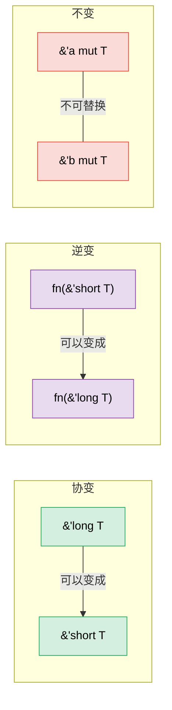

# 4. PhantomData——不携带数据的类型 🔴

> **你将学到：**
> - 为什么 `PhantomData<T>` 会存在，以及它解决的三个问题
> - 用于编译期作用域强制的生命周期标记（lifetime branding）
> - 用于维度安全运算的计量单位模式（unit-of-measure pattern）
> - 变型（协变 covariance、逆变 contravariance、不变 invariant）以及 PhantomData 如何控制它

## PhantomData 解决了什么问题

`PhantomData<T>` 是一个零大小类型，它告诉编译器"这个结构体在逻辑上与 `T` 相关联，尽管它并不包含一个 `T`"。它会影响变型、drop 检查以及 auto trait 的推断——而且不占用任何内存。

```rust
// ============================================================
// PhantomData 的核心作用：告诉编译器类型的逻辑关联
// ============================================================
// 核心概念：PhantomData<T> 是零大小类型，本身不存储数据，但让编译器
// "以为"你的结构体关联了 T。这会影响：
//   1. 变型（variance）——能否用子类型替换
//   2. drop 检查——析构时是否会访问 T
//   3. auto trait（如 Send/Sync）的自动推导

use std::marker::PhantomData;

// 没有 PhantomData 时：
struct Slice<'a, T> {
    ptr: *const T,
    len: usize,
    // 问题：编译器不知道这个结构体从 'a 借用
    // 也不知道它与 T 关联（用于 drop 检查）
}

// 有 PhantomData 时：
// ↓ 'a 是生命周期参数，T 是类型参数
struct Slice<'a, T> {
    ptr: *const T,
    len: usize,
    // ↓ PhantomData<&'a T> 让编译器知道结构体借用了 'a 生命周期的 T
    //   _marker 字段在运行时占 0 字节
    _marker: PhantomData<&'a T>,
    // 现在编译器知道：
    // 1. 这个结构体以生命周期 'a 借用数据
    // 2. 它对 'a 协变（生命周期可以缩短）
    // 3. drop 检查会考虑 T
}
```

**PhantomData 的三大职责**：

| 职责 | 示例 | 作用 |
|-----|---------|-------------|
| **生命周期绑定** | `PhantomData<&'a T>` | 结构体被视为借用了 `'a` |
| **所有权模拟** | `PhantomData<T>` | drop 检查假定结构体拥有一个 `T` |
| **变型控制** | `PhantomData<fn(T)>` | 使结构体对 `T` 逆变 |

### 生命周期标记

使用 `PhantomData` 来防止不同"会话"或"上下文"中的值被混用：

```rust
// ============================================================
// 生命周期标记（Lifetime Branding）—— 防止跨上下文混用值
// ============================================================
// 核心概念：用 PhantomData<&'arena ()> 给句柄打上"出生地"标记。
// 不同 arena 产生的句柄携带不同的生命周期，编译器据此阻止把 A arena
// 的句柄传给 B arena。这种技术也叫"branding"（品牌标记）。

use std::cell::RefCell;  // → RefCell 提供内部可变性（运行时借用检查）
use std::marker::PhantomData;

/// 一个仅在特定 arena 生命周期内有效的句柄
// ↓ 'arena 生命周期参数把句柄绑定到创建它的 Arena
struct ArenaHandle<'arena> {
    index: usize,
    // ↓ PhantomData<&'arena ()> 是零大小标记，() 没有数据
    //   但 'arena 让编译器知道此句柄借用了创建它的 arena 的生命周期
    _brand: PhantomData<&'arena ()>,
}

struct Arena {
    // ↓ RefCell<Vec<String>> 允许在 &self（不可变借用）下修改内部 Vec
    data: RefCell<Vec<String>>,
}

impl Arena {
    fn new() -> Self {
        Arena { data: RefCell::new(Vec::new()) }
    }

    /// 分配一个字符串并返回带标记的句柄
    // ↓ 返回类型 ArenaHandle<'_> —— 生命周期绑定到 &self
    //   '_ 让编译器自动推断返回句柄的生命周期与 arena 一致
    fn alloc(&self, value: String) -> ArenaHandle<'_> {
        // ↓ borrow_mut() 获取可变借用（运行时检查，panic 若冲突）
        let mut data = self.data.borrow_mut();
        let index = data.len();
        // ↓ Vec::push 在末尾添加元素
        data.push(value);
        ArenaHandle { index, _brand: PhantomData }
    }

    /// 通过句柄查找——只接受来自本 arena 的句柄
    // ↓ get<'a>(&'a self, handle: ArenaHandle<'a>)
    //   handle 和 self 必须有相同的生命周期 'a——
    //   这迫使 handle 来自同一个 arena（生命周期绑定的类型安全）
    fn get<'a>(&'a self, handle: ArenaHandle<'a>) -> String {
        let data = self.data.borrow();
        // ↓ data[handle.index] 索引访问，.clone() 克隆 String（因为要返回所有权）
        data[handle.index].clone()
    }
}

fn main() {
    let arena1 = Arena::new();
    let handle1 = arena1.alloc("hello".to_string());

    // 不能将 handle1 用于不同的 arena——生命周期不匹配
    // let arena2 = Arena::new();
    // arena2.get(handle1); // ❌ 生命周期不匹配

    println!("{}", arena1.get(handle1)); // ✅
}
```

### 计量单位模式

在编译期防止不兼容单位的混用，且零运行时开销：

```rust
// ============================================================
// 计量单位模式（Unit-of-Measure）—— 编译期单位安全
// ============================================================
// 核心概念：用零大小的标记类型表示物理单位（Meters、Seconds），
// 用 PhantomData 把单位绑定到数值上。不同单位的值类型不同，
// 编译器据此阻止"Meters + Seconds"这种无意义运算。
// 运行时零开销——PhantomData 不占内存，Quantity<Meters> 与 f64 布局一致。

use std::marker::PhantomData;
use std::ops::{Add, Mul};  // → Add、Mul 是运算符重载 trait（对应 + *）

// 单位标记类型（零大小）
struct Meters;
struct Seconds;
struct MetersPerSecond;

// ↓ #[derive] 自动派生多个 trait：
//   Debug（{:?} 打印）、Clone（.clone()）、Copy（按值复制而非移动）
#[derive(Debug, Clone, Copy)]
struct Quantity<Unit> {
    value: f64,
    _unit: PhantomData<Unit>,  // → 零大小标记，携带单位信息
}

// ↓ impl<U> Quantity<U>：对所有单位 U 通用的方法
impl<U> Quantity<U> {
    // ↓ new(value: f64) -> Self：构造带单位的量
    fn new(value: f64) -> Self {
        Quantity { value, _unit: PhantomData }
    }
}

// 只能添加相同单位：
// ↓ impl<U> Add for Quantity<U>：为相同单位的 Quantity 实现 + 运算
//   Add trait 要求实现 add 方法并指定关联类型 Output
impl<U> Add for Quantity<U> {
    type Output = Quantity<U>;  // → 相同单位相加，结果还是同一单位
    fn add(self, rhs: Self) -> Self::Output {
        Quantity::new(self.value + rhs.value)
    }
}

// Meters / Seconds = MetersPerSecond（自定义 trait）
// ↓ impl std::ops::Div<Quantity<Seconds>> for Quantity<Meters>
//   这是针对"具体单位组合"的特化实现——只允许 Meters 除以 Seconds
impl std::ops::Div<Quantity<Seconds>> for Quantity<Meters> {
    type Output = Quantity<MetersPerSecond>;  // → 结果单位是 MetersPerSecond
    fn div(self, rhs: Quantity<Seconds>) -> Quantity<MetersPerSecond> {
        Quantity::new(self.value / rhs.value)
    }
}

fn main() {
    // ↓ Quantity::<Meters>::new 使用 turbofish 显式指定单位类型
    let dist = Quantity::<Meters>::new(100.0);
    let time = Quantity::<Seconds>::new(9.58);
    let speed = dist / time; // Quantity<MetersPerSecond>
    // ↓ {:.2} 格式化 f64 保留 2 位小数
    println!("Speed: {:.2} m/s", speed.value); // 10.44 m/s

    // let nonsense = dist + time; // ❌ 编译错误：不能把 Meters + Seconds 相加
}
```

> **这纯粹是类型系统的魔法**——`PhantomData<Meters>` 是零大小的，
> 因此 `Quantity<Meters>` 的内存布局与 `f64` 相同。运行时没有任何包装开销，
> 但编译期却拥有完整的单位安全性。

### PhantomData 与 Drop 检查

当编译器检查一个结构体的析构函数是否会访问已失效的数据时，它会使用 `PhantomData` 来做决策：

```rust
// ============================================================
// PhantomData 与 Drop 检查 —— 控制析构器的假设
// ============================================================
// 核心概念：编译器在检查析构顺序是否安全（drop check）时，会参考
// PhantomData 的类型参数。PhantomData<T> 让编译器假设结构体可能拥有 T，
// 从而要求 T 比结构体活得久；PhantomData<*const T> 则更宽松。

use std::marker::PhantomData;

// PhantomData<T> —— 编译器假设我们可能会 drop 一个 T
// 这意味着 T 必须比我们的结构体活得久
// ↓ _marker: PhantomData<T> 表示"逻辑上拥有一个 T"
//   即使 ptr 是 *const T（裸指针，本身不带生命周期），
//   PhantomData<T> 让 drop 检查认为此结构体持有 T 的所有权
struct OwningSemantic<T> {
    ptr: *const T,
    _marker: PhantomData<T>,  // "我在逻辑上拥有一个 T"
}

// PhantomData<*const T> —— 编译器假设我们不拥有 T
// 更宽松——T 不需要比我们活得久
// ↓ PhantomData<*const T> 不包含 T 的所有权信息（裸指针对 drop 检查是中性的）
//   所以编译器不要求 T 比结构体活得久
struct NonOwningSemantic<T> {
    ptr: *const T,
    _marker: PhantomData<*const T>,  // "我只是指向 T"
}
```

**实用规则**：在包装裸指针时，请谨慎选择 PhantomData：
- 编写一个拥有数据的容器？ → `PhantomData<T>`
- 编写一个视图/引用类型？ → `PhantomData<&'a T>` 或 `PhantomData<*const T>`

### 变型——为什么 PhantomData 的类型参数很重要

**变型（variance）**决定了一个泛型类型能否被替换为子类型或父类型（在 Rust 中，"子类型"意味着"具有更长的生命周期"）。变型搞错会导致要么好的代码被拒绝，要么不健全的代码被接受。



#### 三种变型

| 变型 | 含义 | "我可以替换……" | Rust 示例 |
|----------|---------|---------------------|--------------|
| **协变** | 子类型正向传递 | 期望 `'short` 处用 `'long` ✅ | `&'a T`、`Vec<T>`、`Box<T>` |
| **逆变** | 子类型反向传递 | 期望 `'long` 处用 `'short` ✅ | `fn(T)`（参数位置） |
| **不变** | 不允许替换 | 两个方向都不行 ✅ | `&mut T`、`Cell<T>`、`UnsafeCell<T>` |

#### 为什么 `&'a T` 对 `'a` 协变

```rust
// ============================================================
// 协变示例：&'a T 对 'a 协变
// ============================================================
// 核心概念：协变允许用"更长的生命周期"替换"更短的生命周期"。
// &'long str 可以用在期望 &'short str 的地方——因为活得更久的引用
// 一定满足活得更短的需求。这是安全的。

// ↓ print_str(s: &str) 参数是任意生命周期的字符串切片引用
fn print_str(s: &str) {
    println!("{s}");
}

fn main() {
    // ↓ String::from 在堆上分配字符串，owned 获得所有权
    let owned = String::from("hello");
    // owned 存活整个函数周期（'long）
    // print_str 期望 &'_ str（'short —— 仅用于调用）
    // ↓ &owned 创建 &String，自动解引用强制转换为 &str
    print_str(&owned); // ✅ 协变：'long → 'short 是安全的
    // 更长的引用总是可以用于需要更短引用的地方。
}
```

#### 为什么 `&mut T` 对 `T` 不变

```rust
// ============================================================
// 不变性示例：&mut T 对 T 不变（防止悬垂引用）
// ============================================================
// 核心概念：如果 &mut T 对 T 协变，就能把 &'short str 写入 &'static str
// 的位置，等原引用出去后变成悬垂指针。不变性（invariance）阻止这种替换，
// 保证 &'static str 和 &'a str 在可变时不能互换。

// 如果 &mut T 对 T 协变，这段代码就能编译：
// ↓ s: &mut &'static str 是一个指向 &'static str 的可变引用
//   意味着通过 *s 可以改写这个位置存储的引用
fn evil(s: &mut &'static str) {
    // 我们可以把一个更短生命周期的 &str 写入 &'static str 的位置！
    let local = String::from("temporary");
    // ↓ *s = &local 把 &local（生命周期仅限本函数）赋给 *s
    //   如果允许，调用方拿到的 &'static str 会指向已销毁的 local —— 悬垂引用！
    // *s = &local; // ← 会创建悬垂的 &'static str
}

// 不变性阻止了这种情况：可变时 &'static str ≠ &'a str。
// 编译器完全拒绝这种替换。
```

#### PhantomData 如何控制变型

`PhantomData<X>` 赋予你的结构体**与 `X` 相同的变型**：

```rust
// ============================================================
// PhantomData 如何控制变型
// ============================================================
// 核心概念：PhantomData<X> 让你的结构体继承 X 的变型规则。
// 通过选择不同的 PhantomData 类型参数，可以精确控制结构体对 T 和 'a 的变型，
// 从而在编译期保证内存安全。

use std::marker::PhantomData;

// 对 'a 协变——Ref<'long> 可以用作 Ref<'short>
// ↓ PhantomData<&'a T>：&'a T 对 'a 协变、对 T 协变
//   所以 Ref 也对 'a 和 T 都协变
struct Ref<'a, T> {
    ptr: *const T,
    _marker: PhantomData<&'a T>,  // 对 'a 协变，对 T 协变
}

// 对 T 不变——防止 T 的生命周期被不健全地缩短
// ↓ PhantomData<&'a mut T>：&'a mut T 对 'a 协变、对 T 不变
//   所以 MutRef 对 T 不变（可变引用必须保持精确类型）
struct MutRef<'a, T> {
    ptr: *mut T,
    _marker: PhantomData<&'a mut T>,  // 对 'a 协变，对 T 不变
}

// 对 T 逆变——适用于回调容器
// ↓ PhantomData<fn(T)>：fn(T) 中 T 出现在参数位置，所以对 T 逆变
//   CallbackSlot<Short> 可以转为 CallbackSlot<Long>（反向）
struct CallbackSlot<T> {
    _marker: PhantomData<fn(T)>,  // 对 T 逆变
}
```

**PhantomData 变型速查表**：

| PhantomData 类型 | 对 `T` 的变型 | 对 `'a` 的变型 | 使用场景 |
|------------------|--------------------|--------------------|-----------|
| `PhantomData<T>` | 协变 | — | 你在逻辑上拥有一个 `T` |
| `PhantomData<&'a T>` | 协变 | 协变 | 你以生命周期 `'a` 借用一个 `T` |
| `PhantomData<&'a mut T>` | **不变** | 协变 | 你可变地借用 `T` |
| `PhantomData<*const T>` | 协变 | — | 指向 `T` 的非拥有型指针 |
| `PhantomData<*mut T>` | **不变** | — | 非拥有型可变指针 |
| `PhantomData<fn(T)>` | **逆变** | — | `T` 出现在参数位置 |
| `PhantomData<fn() -> T>` | 协变 | — | `T` 出现在返回位置 |
| `PhantomData<fn(T) -> T>` | **不变** | — | `T` 同时出现在两个位置会相互抵消 |

#### 实战示例：为什么这很重要

```rust
// ============================================================
// 实战示例：会话令牌的变型选择
// ============================================================
// 核心概念：选择正确的 PhantomData 变型直接影响 API 的人体工程学。
// 用 PhantomData<&'a ()>（协变）让调用方能自然缩短生命周期；
// 若误用 PhantomData<fn(&'a ())>（逆变），会导致合法代码被拒绝。

use std::marker::PhantomData;

// 一个用会话生命周期标记值的令牌。
// 必须对 'a 协变——否则调用方无法缩短
// 将其传递给需要更短借用的函数时的生命周期。
struct SessionToken<'a> {
    id: u64,
    // ↓ PhantomData<&'a ()>：对 'a 协变，允许把 SessionToken<'long> 当作 SessionToken<'short>
    _brand: PhantomData<&'a ()>,  // ✅ 协变——调用方可以缩短 'a
    // _brand: PhantomData<fn(&'a ())>,  // ❌ 逆变——破坏人体工程学
    // _brand: PhantomData<&'a mut ()>;  // 对 'a 仍然协变（对 T 不变，但 T 固定为 ()）
}

// ↓ use_token(token: &SessionToken<'_>)：接受任意生命周期的借用
//   SessionToken<'_> 的 '_ 由调用方推断
fn use_token(token: &SessionToken<'_>) {
    println!("Using token {}", token.id);
}

fn main() {
    // ↓ 构造 SessionToken，生命周期 'a 推断为 token 变量的生命周期
    let token = SessionToken { id: 42, _brand: PhantomData };
    use_token(&token); // ✅ 有效，因为 SessionToken 对 'a 协变
}
```

> **决策规则**：从 `PhantomData<&'a T>`（协变）开始。只有当你的抽象
> 向外提供对 `T` 的可变访问时，才切换为 `PhantomData<&'a mut T>`（不变）。
> 几乎不要使用 `PhantomData<fn(T)>`（逆变）——它仅对回调存储场景是正确的。

> **要点总结——PhantomData**
> - `PhantomData<T>` 携带类型/生命周期信息，且无运行时开销
> - 用于生命周期标记、变型控制以及计量单位模式
> - drop 检查：`PhantomData<T>` 告诉编译器你的类型在逻辑上拥有一个 `T`

> **另请参阅：**[第 3 章——Newtype 与类型状态](ch03-the-newtype-and-type-state-patterns.md)，了解使用 PhantomData 的类型状态模式。[第 11 章——Unsafe Rust](ch12-unsafe-rust-controlled-danger.md)，了解 PhantomData 如何与裸指针交互。

---

### 练习：基于 PhantomData 的计量单位 ★★（约 30 分钟）

扩展计量单位模式以支持：
- `Meters`、`Seconds`、`Kilograms`
- 相同单位的加法
- 乘法：`Meters * Meters = SquareMeters`
- 除法：`Meters / Seconds = MetersPerSecond`

<details>
<summary>🔑 答案</summary>

```rust
// ============================================================
// 练习答案：扩展的计量单位模式
// ============================================================
// 核心概念：为每种单位定义零大小标记类型，通过运算符重载 trait
// （Add、Mul、Div）实现类型安全的物理量运算。乘法产生新单位（面积），
// 除法产生复合单位（速度），编译期全部检查，运行时零开销。

use std::marker::PhantomData;
use std::ops::{Add, Mul, Div};  // → 加法、乘法、除法运算符 trait

// ↓ 每个单位都是零大小标记类型，#[derive(Clone, Copy)] 派生复制语义
#[derive(Clone, Copy)]
struct Meters;
#[derive(Clone, Copy)]
struct Seconds;
#[derive(Clone, Copy)]
struct Kilograms;
#[derive(Clone, Copy)]
struct SquareMeters;
#[derive(Clone, Copy)]
struct MetersPerSecond;

#[derive(Debug, Clone, Copy)]
struct Qty<U> {
    value: f64,
    _unit: PhantomData<U>,
}

impl<U> Qty<U> {
    fn new(v: f64) -> Self { Qty { value: v, _unit: PhantomData } }
}

// ↓ impl<U> Add for Qty<U>：相同单位才能相加，结果保持原单位
impl<U> Add for Qty<U> {
    type Output = Qty<U>;
    fn add(self, rhs: Self) -> Self::Output { Qty::new(self.value + rhs.value) }
}

// ↓ impl Mul<Qty<Meters>> for Qty<Meters>：特化实现，Meters × Meters = SquareMeters
//   type Output = Qty<SquareMeters> 表示结果单位是平方米
impl Mul<Qty<Meters>> for Qty<Meters> {
    type Output = Qty<SquareMeters>;
    fn mul(self, rhs: Qty<Meters>) -> Qty<SquareMeters> {
        Qty::new(self.value * rhs.value)
    }
}

impl Div<Qty<Seconds>> for Qty<Meters> {
    type Output = Qty<MetersPerSecond>;
    fn div(self, rhs: Qty<Seconds>) -> Qty<MetersPerSecond> {
        Qty::new(self.value / rhs.value)
    }
}

fn main() {
    // ↓ Qty::<Meters>::new turbofish 指定单位类型
    let width = Qty::<Meters>::new(5.0);
    let height = Qty::<Meters>::new(3.0);
    // ↓ width * height 调用上面的特化 Mul 实现，结果类型是 Qty<SquareMeters>
    let area = width * height; // Qty<SquareMeters>
    println!("Area: {:.1} m²", area.value);

    let dist = Qty::<Meters>::new(100.0);
    let time = Qty::<Seconds>::new(9.58);
    // ↓ dist / time 调用特化 Div 实现，结果类型是 Qty<MetersPerSecond>
    let speed = dist / time;
    println!("Speed: {:.2} m/s", speed.value);

    // ↓ width + height 相同单位相加，类型匹配 ✅
    let sum = width + height; // 相同单位 ✅
    println!("Sum: {:.1} m", sum.value);

    // let bad = width + time; // ❌ 编译错误：不能把 Meters + Seconds 相加
}
```

</details>

***
