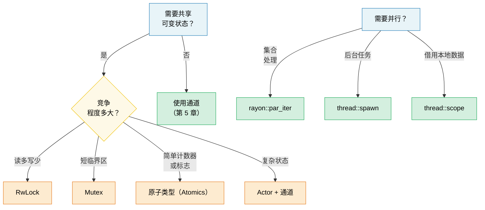

# 6. 并发 vs 并行 vs 线程 🟡

> **你将学到：**
> - 并发（concurrency）与并行（parallelism）的精确区别
> - OS 线程、作用域线程（scoped threads）和用于数据并行的 rayon
> - 共享状态原语：Arc、Mutex、RwLock、原子类型（Atomics）、Condvar
> - 使用 OnceLock/LazyLock 进行延迟初始化以及无锁模式

## 术语：并发 ≠ 并行

这些术语经常被混淆。以下是精确的区别：

| | 并发（Concurrency） | 并行（Parallelism） |
|---|---|---|
| **定义** | 管理可以取得进展的多个任务 | 同时执行多个任务 |
| **硬件要求** | 单核即可 | 需要多核 |
| **类比** | 一个厨师做多道菜（在它们之间切换） | 多个厨师，每人做一道菜 |
| **Rust 工具** | `async/await`、通道、`select!` | `rayon`、`thread::spawn`、`par_iter()` |

```text
并发（单核）：                        并行（多核）：

任务 A: ██░░██░░██                    任务 A: ██████████
任务 B: ░░██░░██░░                    任务 B: ██████████
─────────────────→ 时间               ─────────────────→ 时间
（在一个核心上交替执行）               （在两个核心上同时执行）
```

### std::thread —— OS 线程

Rust 线程与 OS 线程是 1:1 映射的。每个线程都有自己的栈（通常为 2-8 MB）：

```rust
// ===========================================================
// thread::spawn：生成一个 OS 线程并行执行
// ===========================================================
// Rust 线程与 OS 线程 1:1 映射，每个线程有独立栈（通常 2-8 MB）。
// 闭包必须满足 Send + 'static + FnOnce 三个约束。

use std::thread;
use std::time::Duration;

fn main() {
    // ↓ thread::spawn 在新 OS 线程中运行闭包，立即返回 JoinHandle
    // → 签名：pub fn spawn<F, T>(f: F) -> JoinHandle<T>
    //   约束：F: FnOnce() -> T + Send + 'static
    //     Send       → 闭包捕获的所有变量可跨线程转移
    //     'static    → 不能借用调用者的栈数据（必须拥有或 move）
    //     FnOnce     → 被调用一次，可获取捕获变量所有权
    let handle = thread::spawn(|| {
        for i in 0..5 {
            println!("spawned thread: {i}");
            // ↓ sleep 让当前线程休眠指定时长
            // → 签名：pub fn sleep(dur: Duration)
            thread::sleep(Duration::from_millis(100));
        }
        42 // 闭包返回值，成为 JoinHandle<T> 中的 T
    });

    // 同时在主线程上工作
    for i in 0..3 {
        println!("main thread: {i}");
        thread::sleep(Duration::from_millis(150));
    }

    // ↓ join() 阻塞当前线程直到该线程结束，并取回返回值
    // → 签名：pub fn join(self) -> Result<T, Box<dyn Any + Send + 'static>>
    //   Ok(T)  → 线程正常结束
    //   Err(_) → 线程 panic，payload 在此；unwrap 会再次 panic
    let result = handle.join().unwrap(); // 如果线程 panic 则 unwrap 也会 panic
    println!("Thread returned: {result}");
}
```

**Thread::spawn 的类型要求**：

```rust
// ===========================================================
// thread::spawn 的三个类型约束解析
// ===========================================================
// 闭包必须满足：Send + 'static + FnOnce
//   Send     → 捕获的变量可以安全地转移到另一个线程
//   'static  → 闭包不能借用调用作用域中的数据（否则父作用域结束后悬垂）
//   FnOnce   → 闭包被调用一次，可获取捕获变量的所有权

let data = vec![1, 2, 3];

// ❌ 借用了 data —— 不满足 'static（线程可能比这个栈帧活得更久）
// thread::spawn(|| println!("{data:?}"));

// ↓ ✅ move 关键字强制闭包获取 data 的所有权（满足 'static）
// → move 闭包把捕获从"借用"变为"转移所有权"
thread::spawn(move || println!("{data:?}"));
// data 在这里不再可访问 —— 所有权已转移到线程闭包中
```

### 作用域线程（std::thread::scope）

从 Rust 1.63 开始，作用域线程解决了 `'static` 要求——线程可以借用父作用域中的数据：

```rust
// ===========================================================
// thread::scope：作用域线程 —— 可以借用栈数据
// ===========================================================
// 从 Rust 1.63 起，作用域线程突破了 'static 限制：
//   1. scope 块内的线程可以借用父作用域的局部变量
//   2. scope 块结束时，编译器保证所有子线程已 join
//   3. 因此借用的数据在子线程访问期间一定有效

use std::thread;

fn main() {
    let mut data = vec![1, 2, 3, 4, 5];

    // ↓ thread::scope 接受一个闭包，参数 s: &Scope 用于 spawn 作用域线程
    // → scope 返回闭包的返回值；关键保证：返回前所有子线程必已完成
    thread::scope(|s| {
        // ↓ s.spawn 借用 data 的共享引用 &Vec<i32>
        // → 编译器检查：多个共享借用同时存在是合法的
        s.spawn(|| {
            let sum: i32 = data.iter().sum();
            println!("Sum: {sum}");
        });

        // 线程 2：也借用共享引用（多个读者可以）
        s.spawn(|| {
            // ↓ iter().max() 返回 Option<&i32>，unwrap 取出引用
            let max = data.iter().max().unwrap();
            println!("Max: {max}");
        });

        // ❌ 当存在共享借用时不能可变借用：
        // s.spawn(|| data.push(6));
    });
    // ↑ 所有作用域线程在此处 join —— 保证在作用域返回之前完成

    // 现在可以安全修改了 —— 所有线程都已结束
    data.push(6);
    println!("Updated: {data:?}");
}
```

> **这意义重大**：在作用域线程之前，你必须对所有东西 `Arc::clone()`
> 来与线程共享。现在你可以直接借用，编译器会证明所有线程在数据离开作用域之前都已结束。

### rayon —— 数据并行

`rayon` 提供并行迭代器，自动将工作分配到线程池上：

```rust,ignore
// ===========================================================
// rayon：数据并行 —— 把迭代器自动分发到线程池
// ===========================================================
// rayon 维护一个全局线程池，par_iter() 把工作切分给多个 worker。
// 只需把 .iter() 换成 .par_iter()，其余链式调用不变。

// Cargo.toml: rayon = "1"
use rayon::prelude::*;

fn main() {
    let data: Vec<u64> = (0..1_000_000).collect();

    // 顺序执行：
    let sum_seq: u64 = data.iter().map(|x| x * x).sum();

    // ↓ par_iter() 创建并行迭代器，自动分块并行处理
    // → 签名：fn par_iter(&self) -> ParallelIterator
    //   map/filter/sum 等组合子都有并行版本
    let sum_par: u64 = data.par_iter().map(|x| x * x).sum();

    assert_eq!(sum_seq, sum_par);

    // ↓ par_sort() 并行原地排序（需 &mut）
    // → 比 sort() 在大数组上更快
    let mut numbers = vec![5, 2, 8, 1, 9, 3];
    numbers.par_sort();

    // 用 map/filter/collect 进行并行处理：
    let results: Vec<_> = data
        .par_iter()
        .filter(|&&x| x % 2 == 0)
        .map(|&x| expensive_computation(x))
        // ↓ collect 在并行迭代器上会并发归约，结果顺序与原迭代器一致
        .collect();
}

fn expensive_computation(x: u64) -> u64 {
    // 模拟 CPU 密集型计算
    // ↓ fold 在迭代器上累积，类似 reduce
    (0..1000).fold(x, |acc, _| acc.wrapping_mul(7).wrapping_add(13))
}
```

**何时使用 rayon vs 线程**：

| 使用 | 何时 |
|-----|------|
| `rayon::par_iter()` | 并行处理集合（map、filter、reduce） |
| `thread::spawn` | 长时间运行的后台任务、I/O 工作线程 |
| `thread::scope` | 借用本地数据的短生命周期并行任务 |
| `async` + `tokio` | I/O 密集型并发（网络、文件 I/O） |

### 共享状态：Arc、Mutex、RwLock、原子类型

当线程需要共享可变状态时，Rust 提供了安全的抽象：

> **注意：** 在这些示例中，`.lock()`、`.read()` 和 `.write()` 上的 `.unwrap()` 是为了简洁。
> 这些调用只有在另一个线程持有锁时 panic（"锁中毒"，poisoning）才会失败。生产代码应决定是从中毒锁中恢复还是传播错误。

```rust
// ===========================================================
// 共享状态原语：Arc + Mutex + RwLock + 原子类型
// ===========================================================
// 三层组合，按需选择：
//   Arc<T>      → 共享所有权（多线程持有同一堆数据）
//   Mutex<T>    → 独占访问（一次一个线程，可变）
//   RwLock<T>   → 共享读 / 独占写（读多写少）
//   AtomicXxx   → 硬件原子操作（无锁，适合简单值）

use std::sync::{Arc, Mutex, RwLock};
use std::sync::atomic::{AtomicU64, Ordering};
use std::thread;

// --- Arc<Mutex<T>>：共享 + 独占访问 ---
fn mutex_example() {
    // ↓ Arc::new 在堆上分配 T，返回 Arc<T>（原子引用计数）
    // → Mutex::new(0u64) 创建互斥锁，内部值 0
    // → 组合 Arc<Mutex<u64>> 实现多线程共享可变
    let counter = Arc::new(Mutex::new(0u64));
    let mut handles = vec![];

    for _ in 0..10 {
        // ↓ Arc::clone 增加引用计数（原子操作，线程安全），返回新 Arc
        // → 不是深拷贝，仅复制堆指针 + 计数器 +1
        let counter = Arc::clone(&counter);
        handles.push(thread::spawn(move || {
            for _ in 0..1000 {
                // ↓ lock() 获取互斥锁，返回 MutexGuard（RAII）
                // → 签名：fn lock(&self) -> LockResult<MutexGuard<'_, T>>
                //   阻塞直到拿到锁；guard drop 时自动解锁
                // → unwrap 处理"锁中毒"（持锁线程 panic 导致锁状态损坏）
                let mut guard = counter.lock().unwrap();
                // ↓ *guard 解引用得到 &mut T，可直接修改内部值
                *guard += 1;
            } // guard 被丢弃 → 锁释放
        }));
    }

    for h in handles { h.join().unwrap(); }
    // ↓ lock().unwrap() 返回的 guard 可直接用于打印（实现了 Display via Deref）
    println!("Counter: {}", counter.lock().unwrap()); // 10000
}

// --- Arc<RwLock<T>>：多个读者 或 一个写者 ---
fn rwlock_example() {
    // ↓ RwLock 支持多个并发读者，或一个独占写者
    let config = Arc::new(RwLock::new(String::from("initial")));

    // 多个读者 —— 互不阻塞（并发 read）
    let readers: Vec<_> = (0..5).map(|id| {
        let config = Arc::clone(&config);
        thread::spawn(move || {
            // ↓ read() 获取共享读锁，返回 RwLockReadGuard
            // → 多个 read() 可同时成功；但会阻塞 write()
            let guard = config.read().unwrap();
            println!("Reader {id}: {guard}");
        })
    }).collect();

    // 写者 —— 阻塞并等待所有读者完成
    {
        // ↓ write() 获取独占写锁，返回 RwLockWriteGuard
        // → 必须等所有读者释放读锁后才成功
        let mut guard = config.write().unwrap();
        *guard = "updated".to_string();
    } // ← guard drop 时释放写锁

    for r in readers { r.join().unwrap(); }
}

// --- 原子类型：用于简单值的无锁操作 ---
fn atomic_example() {
    // ↓ AtomicU64::new 创建一个可原子读写的 u64
    let counter = Arc::new(AtomicU64::new(0));
    let mut handles = vec![];

    for _ in 0..10 {
        let counter = Arc::clone(&counter);
        handles.push(thread::spawn(move || {
            for _ in 0..1000 {
                // ↓ fetch_add 原子地"读取并加"，返回旧值
                // → 签名：fn fetch_add(&self, val: u64, order: Ordering) -> u64
                // → Ordering::Relaxed：只保证原子性，不保证与其他变量的顺序
                //   适用于计数器（只关心最终值，不关心中间顺序）
                counter.fetch_add(1, Ordering::Relaxed);
                // 无锁，无 mutex —— 硬件原子指令（CAS）
            }
        }));
    }

    for h in handles { h.join().unwrap(); }
    // ↓ load 原子读取当前值
    // → Ordering::Relaxed 适用于此场景
    println!("Atomic counter: {}", counter.load(Ordering::Relaxed)); // 10000
}
```

### 快速对比

| 原语 | 使用场景 | 成本 | 竞争 |
|-----------|----------|------|------------|
| `Mutex<T>` | 短临界区 | 加锁 + 解锁 | 线程排队等待 |
| `RwLock<T>` | 读多写少 | 读写锁 | 读者并发，写者独占 |
| `AtomicU64` 等 | 计数器、标志 | 硬件 CAS | 无锁——无需等待 |
| 通道 | 消息传递 | 队列操作 | 生产者/消费者解耦 |

### 条件变量（Condvar）

`Condvar` 让一个线程**等待**，直到另一个线程发出信号表示某个条件为真，而无需忙等待（busy-loop）。它总是与 `Mutex` 配对使用：

```rust
// ===========================================================
// Condvar（条件变量）：让线程等待某个条件成立，避免忙等待
// ===========================================================
// Condvar 必须与 Mutex 配对使用。经典流程：
//   等待方：锁 → 条件不满足 → wait(原子的解锁+休眠) → 被唤醒 → 重新加锁 → 重检
//   通知方：锁 → 修改条件 → notify_one/all → 唤醒等待方

use std::sync::{Arc, Mutex, Condvar};
use std::thread;

// ↓ 把 Mutex 和 Condvar 打包成一个 Arc 元组，便于跨线程共享
let pair = Arc::new((Mutex::new(false), Condvar::new()));
let pair2 = Arc::clone(&pair);

// 生成的线程：等待直到 ready == true
let handle = thread::spawn(move || {
    // ↓ 解构：lock 是 Mutex，cvar 是 Condvar
    // → &*pair2 解引用 Arc 得到元组引用
    let (lock, cvar) = &*pair2;
    let mut ready = lock.lock().unwrap();
    // ↓ 用 while 循环重检条件 —— 防御虚假唤醒
    while !*ready {
        // ↓ cvar.wait(guard) 是关键：它"原子地"释放锁并休眠
        // → 签名：fn wait<'a, T>(&self, guard: MutexGuard<'a, T>) -> LockResult<MutexGuard<'a, T>>
        //   1. 释放 mutex（让通知方能加锁）
        //   2. 阻塞当前线程（不占 CPU）
        //   3. 被 notify 唤醒后重新加锁
        //   4. 返回新的 guard（赋值回 ready）
        ready = cvar.wait(ready).unwrap(); // 原子地解锁 + 休眠
    }
    println!("Worker: condition met, proceeding");
});

// 主线程：设置 ready = true，然后发信号
{
    let (lock, cvar) = &*pair;
    let mut ready = lock.lock().unwrap();
    *ready = true;
    // ↓ notify_one 唤醒一个等待线程；notify_all 唤醒所有
    // → 必须在持锁期间或刚释放锁后调用，否则可能丢失唤醒
    cvar.notify_one(); // 唤醒一个等待线程（多个用 notify_all）
}
handle.join().unwrap();
```

> **模式**：在 `wait()` 返回后，始终在 `while` 循环中重新检查条件——
> 操作系统允许虚假唤醒（spurious wakeups）。

### 延迟初始化：OnceLock 和 LazyLock

在 Rust 1.80 之前，初始化需要运行时计算（例如解析配置、编译正则表达式）的全局静态变量需要 `lazy_static!` 宏或 `once_cell` crate。标准库现在提供了两种原生类型来覆盖这些用例：

```rust
// ===========================================================
// 延迟初始化：OnceLock 与 LazyLock（标准库原生，替代 lazy_static!）
// ===========================================================
// 两者都保证初始化只发生一次，且线程安全：
//   OnceLock  → 在调用处用 get_or_init 按需初始化（依赖运行时参数时用）
//   LazyLock  → 在定义处用闭包初始化（自包含逻辑时用，1.80+）

use std::sync::{OnceLock, LazyLock};
use std::collections::HashMap;

// ↓ OnceLock::new() 创建一个"空"的延迟初始化容器
// → const fn，可用于 static
static CONFIG: OnceLock<HashMap<String, String>> = OnceLock::new();

fn get_config() -> &'static HashMap<String, String> {
    // ↓ get_or_init 首次调用时运行闭包并存储结果；后续调用直接返回引用
    // → 签名：fn get_or_init<F>(&self, f: F) -> &T where F: FnOnce() -> T
    //   返回 &'static T（因为 OnceLock 是 static）
    //   线程安全：内部用原子操作保证只初始化一次
    CONFIG.get_or_init(|| {
        // 开销大：读取并解析配置文件 —— 只发生一次。
        let mut m = HashMap::new();
        // ↓ HashMap::insert 插入键值对，返回旧值（Option<V>）
        m.insert("log_level".into(), "info".into());
        m
    })
}

// ↓ LazyLock::new 接受闭包，在首次解引用/Deref 时执行初始化
// → 等价于 lazy_static! 但无需宏，无需外部依赖
// → 实现 Deref，访问时透明触发初始化
static REGEX: LazyLock<regex::Regex> = LazyLock::new(|| {
    // ↓ Regex::new 编译正则表达式（开销大）
    regex::Regex::new(r"^[a-zA-Z0-9_]+$").unwrap()
});

fn is_valid_identifier(s: &str) -> bool {
    // ↓ 首次访问 REGEX 触发 LazyLock 初始化；后续访问复用已编译的正则
    // → is_match 返回 bool，表示是否匹配
    REGEX.is_match(s) // 首次调用编译正则；后续调用复用。
}
```

| 类型 | 稳定版本 | 初始化时机 | 适用场景 |
|------|-----------|-------------|----------|
| `OnceLock<T>` | Rust 1.70 | 调用处（`get_or_init`） | 初始化依赖运行时参数 |
| `LazyLock<T>` | Rust 1.80 | 定义处（闭包） | 初始化是自包含的 |
| `lazy_static!` | — | 定义处（宏） | 1.80 之前的代码库（建议迁移） |
| `const fn` + `static` | 一直可用 | 编译期 | 值可在编译期计算 |

> **迁移提示**：将 `lazy_static! { static ref X: T = expr; }` 替换为
> `static X: LazyLock<T> = LazyLock::new(|| expr);` —— 语义相同，无需宏，
> 无外部依赖。

### 无锁模式

对于高性能代码，可以完全避免锁：

```rust
// ===========================================================
// 无锁模式（教学用，生产环境请用经过验证的 crate）
// ===========================================================
// 包含三种模式：
//   1. SpinLock —— 自旋锁（基于 CAS 的 AtomicBool）
//   2. 无锁 SPSC 队列（略）
//   3. SeqLock —— 序列计数器，实现无等待读取

use std::sync::atomic::{AtomicBool, AtomicUsize, Ordering};
use std::sync::Arc;

// 模式 1：自旋锁（教学用途 —— 优先使用 std::sync::Mutex）
// ⚠️ 警告：这仅是教学示例。真正的自旋锁需要：
//   - RAII guard（这样持有锁时 panic 不会永久死锁）
//   - 公平性保证（这在竞争下会饥饿）
//   - 退避策略（指数退避、让出 CPU 给 OS）
// 生产环境请使用 std::sync::Mutex 或 parking_lot::Mutex。
struct SpinLock {
    // ↓ AtomicBool 可跨线程原子读写的 bool
    locked: AtomicBool,
}

impl SpinLock {
    fn new() -> Self { SpinLock { locked: AtomicBool::new(false) } }

    fn lock(&self) {
        // ↓ 自旋循环：不断尝试 CAS 直到成功
        while self.locked
            // ↓ compare_exchange_weak 尝试原子地"比较并交换"
            // → 签名：fn compare_exchange_weak(&self, current: bool, new: bool, success: Ordering, failure: Ordering) -> Result<bool, bool>
            //   若当前值 == current，则写入 new 并返回 Ok(旧值)；否则返回 Err(实际值)
            //   weak 版本可能"假失败"（值其实匹配但返回 Err），适合循环场景，性能更好
            // → Ordering::Acquire（成功时）：保证后续读取读到最新数据
            // → Ordering::Relaxed（失败时）：失败不需要任何同步
            .compare_exchange_weak(false, true, Ordering::Acquire, Ordering::Relaxed)
            .is_err()
        {
            // ↓ spin_loop 发出 CPU 提示（如 pause 指令），降低功耗、减少竞争
            // → 比空转 while 循环更高效
            std::hint::spin_loop(); // CPU 提示：我们正在自旋
        }
    }

    fn unlock(&self) {
        // ↓ store 原子写入值
        // → Ordering::Release：确保此前的写入对下一个 Acquire 可见
        //   配合 lock 中的 Acquire，构成 release-acquire 同步
        self.locked.store(false, Ordering::Release);
    }
}

// 模式 2：无锁 SPSC（单生产者，单消费者）
// 生产环境使用 crossbeam::queue::ArrayQueue 或类似实现
// 自己手写仅供学习。

// 模式 3：用于无等待读取的序列计数器
// ⚠️ 最适合单个机器字大小的类型（u64、f64）；更宽的 T 读取时可能撕裂。
struct SeqLock<T: Copy> {
    seq: AtomicUsize,
    // ↓ UnsafeCell 是内部可变性的底层原语
    // → 它告诉编译器"即使 &self，此字段也可能被改变"
    //   因此编译器不会对它的访问做优化假设
    // → 不安全：需手动保证并发安全
    data: std::cell::UnsafeCell<T>,
}

// ↓ unsafe impl Sync：声明此类型可在线程间共享引用
// → T: Copy + Send 是我们给出的安全保证
unsafe impl<T: Copy + Send> Sync for SeqLock<T> {}

impl<T: Copy> SeqLock<T> {
    fn new(val: T) -> Self {
        SeqLock {
            seq: AtomicUsize::new(0),
            data: std::cell::UnsafeCell::new(val),
        }
    }

    fn read(&self) -> T {
        loop {
            // ↓ load 原子读取序列号
            // → Acquire：确保后续数据读取在 seq 读取之后
            let s1 = self.seq.load(Ordering::Acquire);
            // ↓ 奇数表示写者正在写 —— 重试
            if s1 & 1 != 0 { continue; } // 写者正在进行，重试

            // SAFETY（安全说明）：我们使用 ptr::read_volatile 来防止编译器
            // 重排或缓存读取。SeqLock 协议（读取后检查 s1 == s2）
            // 确保如果有写者活动我们会重试。
            // 这镜像了 C 的 SeqLock 模式，其中数据读取必须使用
            // volatile/relaxed 语义以避免并发下的撕裂。
            // ↓ read_volatile 强制执行实际内存读取，禁止优化
            // → get() 返回 *mut T，转为 *const T 后读取
            let value = unsafe { core::ptr::read_volatile(self.data.get() as *const T) };

            // Acquire 屏障：确保上面的数据读取在
            // 我们重新检查序列计数器之前被排序。
            // ↓ fence 建立内存屏障，防止重排
            std::sync::atomic::fence(Ordering::Acquire);
            // ↓ Relaxed：只需读到最新值，不需要额外顺序保证
            let s2 = self.seq.load(Ordering::Relaxed);

            if s1 == s2 { return value; } // 序列号未变 → 无写者介入，读取有效
            // 否则重试（序列号变了，说明有写者，数据可能撕裂）
        }
    }

    /// # 安全契约
    /// 同一时间只有一个线程可以调用 `write()`。如果需要多个写者，
    /// 请将 `write()` 调用包装在外部 `Mutex` 中。
    fn write(&self, val: T) {
        // 递增为奇数（表示写入正在进行）。
        // AcqRel：Acquire 侧防止后续的数据写入
        // 被重排到此递增之前（读者必须先看到奇数才能观察到部分写入）。
        // Release 侧对于单写者技术上来说不是必需的，
        // 但无害且保持一致。
        // ↓ fetch_add 原子加法，返回旧值
        // → 0→1（偶数变奇数，标记写入开始）
        // → AcqRel = Acquire + Release，双向屏障
        self.seq.fetch_add(1, Ordering::AcqRel);
        // SAFETY（安全说明）：单写者不变量由调用者维护（见上面的文档）。
        // UnsafeCell 允许内部可变性；序列计数器保护读者。
        // ↓ 通过 get() 获取 *mut T 并写入（不安全：绕过借用检查）
        unsafe { *self.data.get() = val; }
        // 递增为偶数（表示写入完成）。
        // Release：确保数据写入在读者看到偶数序列之前可见。
        // ↓ 1→2（奇数变偶数，标记写入完成）
        // → Release：数据写入必须在 seq 更新之前完成
        self.seq.fetch_add(1, Ordering::Release);
    }
}
```

> **⚠️ Rust 内存模型警告**：`write()` 中通过 `UnsafeCell` 的非原子写入
> 与 `read()` 中的非原子 `ptr::read_volatile` 并发，在 Rust 抽象机下技术上是数据竞争——
> 即使 SeqLock 协议确保读者总是会在过时数据上重试。这镜像了
> C 内核的 SeqLock 模式，在实践中对于能放入单个机器字（例如 `u64`）的类型 `T`
> 在所有现代硬件上都是可靠的。对于更宽的类型，
> 考虑为数据字段使用 `AtomicU64` 或将访问包装在 `Mutex` 中。
> 参见 [Rust unsafe 代码指南](https://rust-lang.github.io/unsafe-code-guidelines/)
> 了解关于 `UnsafeCell` 并发的演进情况。

> **实用建议**：无锁代码很难写对。除非性能分析显示锁竞争是你的瓶颈，否则使用 `Mutex` 或
> `RwLock`。当你确实需要无锁时，优先使用经过验证的 crate（`crossbeam`、`arc-swap`、`dashmap`），
> 而非自己手写。

> **核心要点 —— 并发**
> - 作用域线程（`thread::scope`）让你无需 `Arc` 即可借用栈数据
> - `rayon::par_iter()` 用一个方法调用就能并行化迭代器
> - 使用 `OnceLock`/`LazyLock` 替代 `lazy_static!`；在求助于原子类型之前先使用 `Mutex`
> - 无锁代码很难写对——优先使用经过验证的 crate，而非手写实现

> **参见：** [第 5 章 —— 通道](ch05-channels-and-message-passing.md) 了解消息传递并发。[第 8 章 —— 智能指针](ch09-smart-pointers-and-interior-mutability.md) 了解 Arc/Rc 的细节。



---

### 练习：使用作用域线程的并行 Map ★★（约 25 分钟）

编写一个函数 `parallel_map<T, R>(data: &[T], f: fn(&T) -> R, num_threads: usize) -> Vec<R>`，将 `data` 拆分为 `num_threads` 个块，每个块在一个作用域线程中处理。不要使用 `rayon`——使用 `std::thread::scope`。

<details>
<summary>🔑 答案</summary>

```rust
// ===========================================================
// parallel_map：用作用域线程并行处理分块数据
// ===========================================================
// 思路：把 data 切成 num_threads 块，每块交给一个作用域线程，
//   借用（而非转移）原始切片，处理完后汇总。

// ↓ 泛型约束解析：
//   T: Sync → data: &[T] 可被多线程并发共享引用（scope 线程借用它）
//   R: Send → 每个 chunk 的结果 Vec<R> 可转移回主线程
fn parallel_map<T: Sync, R: Send>(data: &[T], f: fn(&T) -> R, num_threads: usize) -> Vec<R> {
    // ↓ 向上取整计算每块大小：避免最后一块为空或过大
    let chunk_size = (data.len() + num_threads - 1) / num_threads;
    // ↓ with_capacity 预分配容量，避免反复扩容
    let mut results = Vec::with_capacity(data.len());

    std::thread::scope(|s| {
        let mut handles = Vec::new();
        // ↓ chunks(n) 把切片分成若干长度为 n 的连续块（最后一块可能更短）
        for chunk in data.chunks(chunk_size) {
            // ↓ s.spawn 作用域线程，闭包 move 捕获 chunk（一个 &[T] 引用）
            // → 由于是 scope 线程，借用 data 是合法的
            handles.push(s.spawn(move || {
                // ↓ chunk.iter().map(f) 对每元素应用 f，collect 收集成 Vec
                chunk.iter().map(f).collect::<Vec<_>>()
            }));
        }
        // ↓ join 所有线程并按顺序合并结果
        for h in handles {
            // ↓ extend 把一个 Vec 的元素追加到 results
            results.extend(h.join().unwrap());
        }
    });

    results
}

fn main() {
    let data: Vec<u64> = (1..=20).collect();
    let squares = parallel_map(&data, |x| x * x, 4);
    assert_eq!(squares, (1..=20).map(|x: u64| x * x).collect::<Vec<_>>());
    println!("Parallel squares: {squares:?}");
}
```

</details>

***
