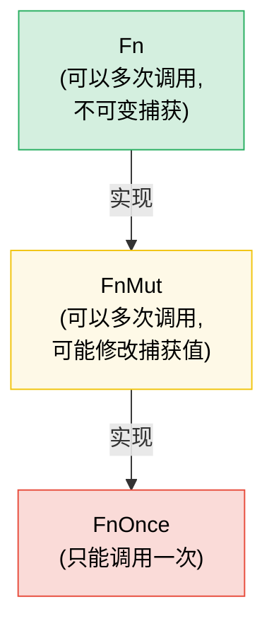

# 7. 闭包与高阶函数 🟢

> **你将学到：**
> - 三个闭包 trait（`Fn`、`FnMut`、`FnOnce`）以及捕获机制如何工作
> - 将闭包作为参数传递以及从函数中返回闭包
> - 组合子链与迭代器适配器，实现函数式风格的编程
> - 使用合适的 trait 约束设计你自己的高阶 API

## Fn、FnMut、FnOnce — 闭包 Trait

Rust 中的每个闭包都会实现三个 trait 中的一个或多个，具体取决于它捕获变量的方式：

```rust
// ===========================================================
// 三种闭包 trait 的捕获方式对比
// ===========================================================
// 闭包如何捕获环境变量决定了它实现哪个 trait：
//   FnOnce → 获取所有权（move 并消耗），只能调用一次
//   FnMut  → 可变借用 &mut，可多次调用，能修改捕获值
//   Fn     → 不可变借用 &，可多次调用，可并发调用
// 层级：Fn ⊂ FnMut ⊂ FnOnce

// --- FnOnce：消耗捕获的值（只能调用一次）---
let name = String::from("Alice");
// ↓ move 关键字强制闭包获取 name 的所有权
// → 闭包被调用时会消耗 name（drop），因此只能调用一次
let greet = move || {
    println!("Hello, {name}!"); // 获取 `name` 的所有权
    drop(name); // name 被消耗
};
greet(); // ✅ 第一次调用
// greet(); // ❌ 不能再次调用 —— `name` 已被消耗

// --- FnMut：可变地借用捕获的值（可以多次调用）---
let mut count = 0;
// ↓ 这里没用 move —— 闭包可变借用外部的 count（&mut count）
// → 因此该闭包实现 FnMut，可多次调用（每次需独占访问）
let mut increment = || {
    count += 1; // 可变借用 `count`
};
increment(); // count == 1
increment(); // count == 2

// --- Fn：不可变地借用捕获的值（可以多次调用，包括并发调用）---
let prefix = "Result";
// ↓ 闭包不可变借用 prefix（&str），不修改它
// → 实现 Fn，可并发调用（线程安全）
let display = |x: i32| {
    println!("{prefix}: {x}"); // 不可变借用 `prefix`
};
display(1);
display(2);
```

**层级关系**：`Fn` : `FnMut` : `FnOnce` — 每一个都是下一个的子 trait：

```text
FnOnce  ← 所有闭包都至少能被调用一次
 ↑
FnMut   ← 可以重复调用（可能修改状态）
 ↑
Fn      ← 可以重复且并发地调用（不修改状态）
```

如果一个闭包实现了 `Fn`，那么它也实现了 `FnMut` 和 `FnOnce`。

### 闭包作为参数和返回值

```rust
// ===========================================================
// 闭包作为参数与返回值：静态分发 vs 动态分发
// ===========================================================
// 关键选择：
//   impl Fn(...)   → 静态分发（单态化），零开销，编译期生成专用代码
//   &dyn Fn(...)   → 动态分发（trait 对象），有虚函数开销，但可存入集合
//   Box<dyn Fn>    → 动态分发 + 堆分配，可用于返回值或存储

// --- 参数 ---

// ↓ 静态分发（单态化 —— 最快）
// → 泛型 F: Fn(i32) -> i32 在编译期为每种闭包类型生成专用版本
// → 约束 F: Fn(i32) -> i32 表示：F 是一个接收 i32 返回 i32 且不可变捕获的闭包
// → 调用 f(f(x)) 直接内联，零运行时开销
fn apply_twice<F: Fn(i32) -> i32>(f: F, x: i32) -> i32 {
    f(f(x))
}

// 也可以用 impl Trait 写（语法糖，等价于上面）：
// → impl Trait 在参数位置 = 泛型约束的简写
fn apply_twice_v2(f: impl Fn(i32) -> i32, x: i32) -> i32 {
    f(f(x))
}

// ↓ 动态分发（trait 对象 —— 灵活，有轻微开销）
// → &dyn Fn 是胖指针（数据指针 + 虚函数表指针），通过虚函数调用
// → 适合需要异构闭包（不同类型但同一 trait）的场景
fn apply_dyn(f: &dyn Fn(i32) -> i32, x: i32) -> i32 {
    f(x)
}

// --- 返回值 ---

// ↓ 不能直接按值返回闭包（它们是匿名类型），需要装箱：
// → Box::new 在堆上分配，返回 Box<dyn Fn> 拥有所有权的 trait 对象
// → Box<dyn Fn(i32) -> i32> 表示：堆上的、动态分发的、可调用对象
// → move 闭包捕获 n 的所有权（否则 n 离开作用域后悬垂）
fn make_adder(n: i32) -> Box<dyn Fn(i32) -> i32> {
    Box::new(move |x| x + n)
}

// ↓ 用 impl Trait（更简单，单态化，但不能动态分发）：
// → 返回 impl Trait 表示"返回某种实现了该 trait 的类型"
// → 编译期确定具体类型，但调用方不需要知道具体类型
fn make_adder_v2(n: i32) -> impl Fn(i32) -> i32 {
    move |x| x + n
}

fn main() {
    let double = |x: i32| x * 2;
    // ↓ apply_twice(double, 3) = double(double(3)) = double(6) = 12
    println!("{}", apply_twice(double, 3)); // 12

    let add5 = make_adder(5);
    // ↓ add5(10) = 10 + 5 = 15
    println!("{}", add5(10)); // 15
}
```

### 组合子链与迭代器适配器

高阶函数在与迭代器配合使用时大放异彩——这是地道的 Rust 写法：

```rust
// ===========================================================
// 命令式 vs 函数式：组合子链是地道的 Rust 写法
// ===========================================================
// 迭代器适配器（filter/map）是惰性的：调用时不执行，
// 直到 collect 触发整个链条，LLVM 会将其优化为紧凑循环。

// C 风格循环（命令式）：
let data = vec![1, 2, 3, 4, 5, 6, 7, 8, 9, 10];
let mut result = Vec::new();
for x in &data {
    if x % 2 == 0 {
        result.push(x * x);
    }
}

// 地道的 Rust 写法（函数式组合子链）：
let result: Vec<i32> = data.iter()
    // ↓ filter 接收谓词闭包，保留返回 true 的元素
    // → 闭包签名：impl FnMut(&Self::Item) -> bool
    //   这里 Item = &i32，所以参数是 &&i32，用 |&&x| 模式解构两层引用
    .filter(|&&x| x % 2 == 0)
    // ↓ map 对每个元素应用转换闭包
    // → 闭包签名：impl FnMut(Self::Item) -> B
    //   |&x| 解构 &i32 得到 i32（值拷贝）
    .map(|&x| x * x)
    // ↓ collect 消费迭代器，收集进集合
    // → 由于声明了 Vec<i32>，类型推断决定 collect 的目标类型
    //   触发整个惰性链条的实际执行
    .collect();

// 性能相同 —— 迭代器是惰性的，由 LLVM 优化
assert_eq!(result, vec![4, 16, 36, 64, 100]);
```

**常用组合子速查表**：

| 组合子 | 功能 | 示例 |
|-----------|-------------|---------|
| `.map(f)` | 转换每个元素 | `.map(\|x\| x * 2)` |
| `.filter(p)` | 保留谓词为真的元素 | `.filter(\|x\| x > &5)` |
| `.filter_map(f)` | 一步完成映射和过滤（返回 `Option`） | `.filter_map(\|x\| x.parse().ok())` |
| `.flat_map(f)` | 映射后扁平化嵌套迭代器 | `.flat_map(\|s\| s.chars())` |
| `.fold(init, f)` | 归约为单个值（类似 C# 中的 `Aggregate`） | `.fold(0, \|acc, x\| acc + x)` |
| `.any(p)` / `.all(p)` | 短路布尔检查 | `.any(\|x\| x > 100)` |
| `.enumerate()` | 添加索引 | `.enumerate().map(\|(i, x)\| ...)` |
| `.zip(other)` | 与另一个迭代器配对 | `.zip(labels.iter())` |
| `.take(n)` / `.skip(n)` | 取前 N 个 / 跳过 N 个元素 | `.take(10)` |
| `.chain(other)` | 连接两个迭代器 | `.chain(extra.iter())` |
| `.peekable()` | 向前查看而不消耗 | `.peek()` |
| `.collect()` | 收集到集合中 | `.collect::<Vec<_>>()` |

### 实现你自己的高阶 API

设计接受闭包的 API 来实现定制化：

```rust
// ===========================================================
// 高阶 API 示例：可配置策略的 retry 函数
// ===========================================================
// 设计要点：把"何时重试"的决策权交给调用方（通过 should_retry 闭包），
//   而非硬编码在 retry 内部。这是策略模式的 Rust 写法。

/// 以可配置的策略重试一个操作
// ↓ 泛型参数解析：
//   T, E   → 成功值类型和错误类型
//   F      → 操作闭包，FnMut() -> Result<T, E>（可重复调用，可能修改状态）
//   S      → 策略闭包，FnMut(&E, usize) -> bool（决定是否重试）
// → mut operation: F —— operation 可变，因为 FnMut 调用需要 &mut self
fn retry<T, E, F, S>(
    mut operation: F,
    mut should_retry: S,
    max_attempts: usize,
) -> Result<T, E>
where
    F: FnMut() -> Result<T, E>,
    S: FnMut(&E, usize) -> bool, // (错误, 尝试次数) → 是否再试一次？
{
    for attempt in 1..=max_attempts {
        // ↓ operation() 调用 FnMut 闭包，执行操作
        match operation() {
            Ok(val) => return Ok(val), // → 成功，立即返回
            // ↓ Err(e) if guard —— 带条件的错误分支
            //   只有"还能重试"且"策略允许重试"时才 continue
            Err(e) if attempt < max_attempts && should_retry(&e, attempt) => {
                continue;
            }
            Err(e) => return Err(e), // → 已用尽次数或策略拒绝重试，返回错误
        }
    }
    // ↓ unreachable! 标记不可达代码（理论上循环内的 return 必然触发）
    unreachable!()
}

// 用法 —— 调用方控制重试逻辑：
```

```rust
# fn connect_to_database() -> Result<(), String> { Ok(()) }
# fn http_get(_url: &str) -> Result<String, String> { Ok(String::new()) }
# trait TransientError { fn is_transient(&self) -> bool; }
# impl TransientError for String { fn is_transient(&self) -> bool { true } }
# let url = "http://example.com";
// ↓ 用法 1：闭包作为操作 + 策略传入
// → || connect_to_database() 是一个无参闭包，返回 Result
// → |err, attempt| 是策略闭包，接收 (&E, usize) 返回 bool
let result = retry(
    || connect_to_database(),
    |err, attempt| {
        // ↓ eprintln! 打印到 stderr（不影响 stdout 的正常输出）
        eprintln!("Attempt {attempt} failed: {err}");
        true // 总是重试
    },
    3,
);

// 用法 —— 仅重试特定错误：
let result = retry(
    || http_get(url),
    // ↓ 策略：只有 is_transient() 为真的错误才重试
    // → _ 忽略 attempt 参数（此策略不关心尝试次数）
    |err, _| err.is_transient(), // 仅重试瞬时错误
    5,
);
```

### `with` 模式 — 括号式资源访问

有时你需要保证某个资源在一次操作期间处于特定状态，并在操作结束后恢复——无论调用方的代码如何退出（提前返回、`?`、panic）。与其直接暴露资源并寄希望于调用方记得设置和清理，不如**通过闭包将资源借出**：

```text
set up → call closure with resource → tear down
```

调用方永远不需要接触设置或清理逻辑。他们不会忘记，也不会出错，并且无法在闭包作用域之外持有该资源。

#### 示例：GPIO 引脚方向

一个 GPIO 控制器管理着支持双向 I/O 的引脚。有些调用方需要将引脚配置为输入，另一些需要配置为输出。控制器没有暴露原始的引脚访问并信任调用方会正确设置方向，而是提供了 `with_pin_input` 和 `with_pin_output`：

```rust
// ===========================================================
// with 模式：括号式资源访问 —— 设置 → 回调 → 清理
// ===========================================================
// 核心价值：
//   1. 调用方永远不直接接触设置/清理逻辑，不可能忘记或误用
//   2. 资源句柄（GpioPin）的生命周期绑定到闭包，无法逃逸
//   3. 借用检查器在编译期强制保证"回调期间句柄有效"

/// GPIO 引脚方向 —— 不公开，调用方永远不会直接设置它。
#[derive(Debug, Clone, Copy, PartialEq)]
enum Direction { In, Out }

/// 借给闭包的 GPIO 引脚句柄。不能被存储或克隆 ——
/// 它仅在回调期间存在。
// ↓ 生命周期 'a 绑定到 GpioController —— 防止句柄逃逸出回调
//   _controller: &'a GpioController 持有控制器引用，确保句柄不能比控制器活得更久
pub struct GpioPin<'a> {
    pin_number: u8,
    _controller: &'a GpioController,
}

// ↓ impl GpioPin<'_> —— 匿名生命周期，表示"任意生命周期"
impl GpioPin<'_> {
    pub fn read(&self) -> bool {
        // 从硬件寄存器读取引脚电平
        println!("  reading pin {}", self.pin_number);
        true // 桩实现
    }

    pub fn write(&self, high: bool) {
        // 通过硬件寄存器驱动引脚电平
        println!("  writing pin {} = {high}", self.pin_number);
    }
}

pub struct GpioController {
    // ↓ Cell<Option<Direction>> 提供内部可变性（&self 即可修改）
    // → Cell 用于单线程场景（Copy 类型），通过 get/set 替换值
    current_direction: std::cell::Cell<Option<Direction>>,
}

impl GpioController {
    pub fn new() -> Self {
        GpioController {
            current_direction: std::cell::Cell::new(None),
        }
    }

    /// 将引脚配置为输入，运行闭包，然后恢复状态。
    /// 调用方收到一个仅在回调期间存活的 `GpioPin`。
    // ↓ 泛型 R 是回调的返回值类型；f: impl FnMut(&GpioPin) -> R
    // → 使用 impl FnMut：允许调用方传入会修改捕获变量的闭包（最灵活）
    pub fn with_pin_input<R>(
        &self,
        pin: u8,
        mut f: impl FnMut(&GpioPin<'_>) -> R,
    ) -> R {
        // ↓ get() 读取当前方向（Cell 的读取，返回 Option<Direction>）
        let prev = self.current_direction.get();
        self.set_direction(pin, Direction::In);
        // ↓ 构造一个临时句柄，生命周期绑定到 &self
        let handle = GpioPin { pin_number: pin, _controller: self };
        // ↓ 调用闭包，传入句柄引用 —— 这是"括号"的中间部分
        let result = f(&handle);
        // 恢复之前的方向（或保持不变 —— 策略选择）
        // ↓ 无论闭包是否 panic，这里都会执行（panic 时由 unwind 自动清理）
        //   这是 with 模式保证清理的关键
        if let Some(dir) = prev {
            self.set_direction(pin, dir);
        }
        // ↓ 返回闭包的结果 —— with 模式是透明的
        result
    }

    /// 将引脚配置为输出，运行闭包，然后恢复状态。
    pub fn with_pin_output<R>(
        &self,
        pin: u8,
        mut f: impl FnMut(&GpioPin<'_>) -> R,
    ) -> R {
        let prev = self.current_direction.get();
        self.set_direction(pin, Direction::Out);
        let handle = GpioPin { pin_number: pin, _controller: self };
        let result = f(&handle);
        if let Some(dir) = prev {
            self.set_direction(pin, dir);
        }
        result
    }

    fn set_direction(&self, pin: u8, dir: Direction) {
        println!("  [hw] pin {pin} → {dir:?}");
        // ↓ set() 替换 Cell 内部的值（Cell 的内部可变性）
        self.current_direction.set(Some(dir));
    }
}

fn main() {
    let gpio = GpioController::new();

    // 调用方 1：需要输入 —— 不知道也不关心方向如何管理
    // ↓ with_pin_input(引脚号, 闭包)：自动处理方向设置与恢复
    let level = gpio.with_pin_input(4, |pin| {
        pin.read()
    });
    println!("Pin 4 level: {level}");

    // 调用方 2：需要输出 —— 相同的 API 形式，不同的保证
    gpio.with_pin_output(4, |pin| {
        pin.write(true);
        // 做更多工作...
        pin.write(false);
    });

    // 不能在闭包之外使用引脚句柄：
    // let escaped_pin = gpio.with_pin_input(4, |pin| pin);
    // ❌ 错误：借用的值生命周期不够长
    // → 编译器拒绝：pin 的生命周期绑定到闭包作用域，无法返回它
}
```

**`with` 模式所保证的：**
- 方向**总是在**调用方代码运行**之前设置好**
- 方向**总是在之后恢复**，即使闭包提前返回
- `GpioPin` 句柄**无法逃逸**出闭包——借用检查器通过与控制器引用绑定的生命周期来强制执行这一点
- 调用方永远不会导入 `Direction`，也永远不会调用 `set_direction`——这个 API 是不可能被误用的

#### 该模式出现的地方

`with` 模式贯穿了 Rust 的标准库和生态系统：

| API | 设置 | 回调 | 清理 |
|-----|-------|----------|----------|
| `std::thread::scope` | 创建作用域 | `\|s\| { s.spawn(...) }` | 等待所有线程结束 |
| `Mutex::lock` | 获取锁 | 使用 `MutexGuard`（RAII，不是闭包，但理念相同） | drop 时释放 |
| `tempfile::tempdir` | 创建临时目录 | 使用路径 | drop 时删除 |
| `std::io::BufWriter::new` | 缓冲写入 | 写入操作 | drop 时刷新 |
| GPIO `with_pin_*`（上文） | 设置方向 | 使用引脚句柄 | 恢复方向 |

基于闭包的变体在以下情况最为适用：
- **设置和清理是成对出现的**，忘记任何一个都是 bug
- **资源不应比操作存活更久**——借用检查器会自然地强制执行这一点
- **存在多种配置**（`with_pin_input` 对比 `with_pin_output`）——每个 `with_*` 方法封装了一种不同的设置，而无需向调用方暴露配置细节

> **`with` 对比 RAII（Drop）：** 两者都保证清理。当调用方需要在多个语句和函数调用中持有资源时，使用 RAII / `Drop`。当操作是**括号式**的——一次设置、一块工作、一次清理——并且你不希望调用方能够破坏这个括号结构时，使用 `with`。

> **API 设计中的 FnMut 对比 Fn**：默认使用 `FnMut` 作为约束——它是最灵活的（调用方可以传入 `Fn` 或 `FnMut` 闭包）。只有当你需要并发调用闭包（例如从多个线程）时，才要求使用 `Fn`。只有当你恰好调用它一次时，才要求使用 `FnOnce`。

> **关键要点 — 闭包**
> - `Fn` 借用，`FnMut` 可变借用，`FnOnce` 消耗——接受你的 API 所需的最弱约束
> - 参数中使用 `impl Fn`，存储时用 `Box<dyn Fn>`，返回值中使用 `impl Fn`（如果需要动态分发则用 `Box<dyn Fn>`）
> - 组合子链（`map`、`filter`、`and_then`）组合清晰，并内联为紧凑的循环
> - `with` 模式（通过闭包进行括号式访问）保证设置/清理的配对执行并防止资源逃逸——当调用方不应管理配置生命周期时使用它

> **另请参阅：**[第 2 章 — Trait 深入](ch02-traits-in-depth.md) 了解 `Fn`/`FnMut`/`FnOnce` 与 trait 对象的关系。[第 8 章 — 函数式对比命令式](ch08-functional-vs-imperative-when-elegance-wins.md) 了解何时选择组合子而非循环。[第 15 章 — API 设计](ch15-crate-architecture-and-api-design.md) 了解符合人体工程学的参数模式。



> 每个 `Fn` 也是 `FnMut`，每个 `FnMut` 也是 `FnOnce`。默认接受 `FnMut`——它是对调用方最灵活的约束。

---

### 练习：高阶组合子管道 ★★（约 25 分钟）

创建一个 `Pipeline` 结构体来链式组合各种转换。它应该支持 `.pipe(f)` 来添加转换，以及 `.execute(input)` 来运行整个链。

<details>
<summary>🔑 解答</summary>

```rust
// ===========================================================
// Pipeline：用 Box<dyn Fn> 存储异构闭包链，实现可组合的转换管道
// ===========================================================
// 设计要点：
//   1. transforms: Vec<Box<dyn Fn(T) -> T>> 存储不同类型但同 trait 的闭包
//   2. pipe 采用建造者模式（返回 self）支持链式调用
//   3. execute 用 fold 依次应用所有转换

struct Pipeline<T> {
    // ↓ Vec<Box<dyn Fn(T) -> T>> —— 拥有所有权的、动态分发的闭包集合
    // → Box<dyn Fn> 必须的：不同闭包类型不同，只能用 trait 对象统一存储
    transforms: Vec<Box<dyn Fn(T) -> T>>,
}

// ↓ T: 'static —— Box<dyn Fn> 中的闭包不能借用非静态数据
impl<T: 'static> Pipeline<T> {
    fn new() -> Self {
        Pipeline { transforms: Vec::new() }
    }

    // ↓ pipe 采用建造者模式：消费 self，push 转换，返回 self
    // → f: impl Fn(T) -> T + 'static —— 接受任何满足约束的闭包
    // → Box::new(f) 将其装箱为 trait 对象存入 Vec
    // → 返回 Self 实现链式调用：.pipe(a).pipe(b).pipe(c)
    fn pipe(mut self, f: impl Fn(T) -> T + 'static) -> Self {
        self.transforms.push(Box::new(f));
        self
    }

    // ↓ execute 消费 self，执行整个管道
    fn execute(self, input: T) -> T {
        // ↓ into_iter() 消费 Vec，产出每个 Box<dyn Fn>
        // ↓ fold(init, f) 归约：以 input 为初始值，依次应用每个转换
        // → 签名：fn fold<B, F>(self, init: B, f: F) -> B
        //   f: FnMut(B, Self::Item) -> B —— 这里 B=T, Item=Box<dyn Fn(T)->T>
        // → |val, f| f(val)：用转换 f 处理当前值 val，得到下一个值
        self.transforms.into_iter().fold(input, |val, f| f(val))
    }
}

fn main() {
    let result = Pipeline::new()
        .pipe(|s: String| s.trim().to_string()) // → 去除首尾空白
        .pipe(|s| s.to_uppercase())              // → 转大写
        .pipe(|s| format!(">>> {s} <<<"))        // → 包装格式
        .execute("  hello world  ".to_string());

    println!("{result}"); // >>> HELLO WORLD <<<

    let result = Pipeline::new()
        .pipe(|x: i32| x * 2)   // → 5*2 = 10
        .pipe(|x| x + 10)        // → 10+10 = 20
        .pipe(|x| x * x)         // → 20*20 = 400
        .execute(5);

    println!("{result}"); // (5*2 + 10)^2 = 400
}
```

</details>

***
