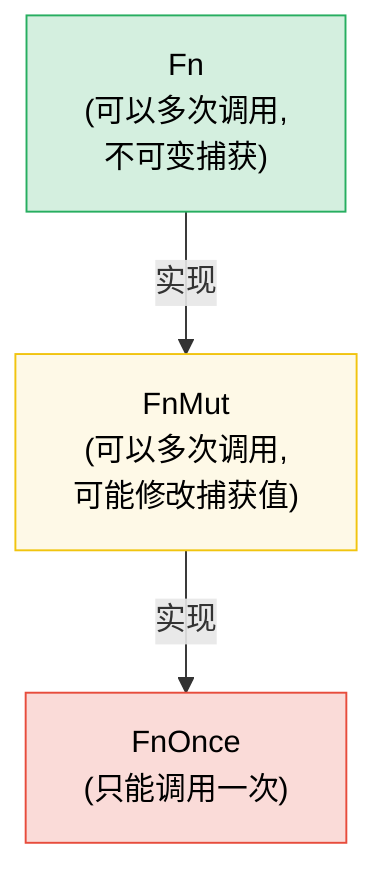

# 7. 闭包与高阶函数 🟢

> **你将学到：**
> - 三个闭包 trait（`Fn`、`FnMut`、`FnOnce`）以及捕获机制如何工作
> - 将闭包作为参数传递以及从函数中返回闭包
> - 组合子链与迭代器适配器，实现函数式风格的编程
> - 使用合适的 trait 约束设计你自己的高阶 API

## Fn、FnMut、FnOnce — 闭包 Trait

Rust 中的每个闭包都会实现三个 trait 中的一个或多个，具体取决于它捕获变量的方式：

```rust
// FnOnce — 消耗捕获的值（只能调用一次）
let name = String::from("Alice");
let greet = move || {
    println!("Hello, {name}!"); // 获取 `name` 的所有权
    drop(name); // name 被消耗
};
greet(); // ✅ 第一次调用
// greet(); // ❌ 不能再次调用 —— `name` 已被消耗

// FnMut — 可变地借用捕获的值（可以多次调用）
let mut count = 0;
let mut increment = || {
    count += 1; // 可变借用 `count`
};
increment(); // count == 1
increment(); // count == 2

// Fn — 不可变地借用捕获的值（可以多次调用，包括并发调用）
let prefix = "Result";
let display = |x: i32| {
    println!("{prefix}: {x}"); // 不可变借用 `prefix`
};
display(1);
display(2);
```

**层级关系**：`Fn` : `FnMut` : `FnOnce` — 每一个都是下一个的子 trait：

```text
FnOnce  ← 所有闭包都至少能被调用一次
 ↑
FnMut   ← 可以重复调用（可能修改状态）
 ↑
Fn      ← 可以重复且并发地调用（不修改状态）
```

如果一个闭包实现了 `Fn`，那么它也实现了 `FnMut` 和 `FnOnce`。

### 闭包作为参数和返回值

```rust
// --- 参数 ---

// 静态分发（单态化——最快）
fn apply_twice<F: Fn(i32) -> i32>(f: F, x: i32) -> i32 {
    f(f(x))
}

// 也可以用 impl Trait 写：
fn apply_twice_v2(f: impl Fn(i32) -> i32, x: i32) -> i32 {
    f(f(x))
}

// 动态分发（trait 对象——灵活，有轻微开销）
fn apply_dyn(f: &dyn Fn(i32) -> i32, x: i32) -> i32 {
    f(x)
}

// --- 返回值 ---

// 不能直接按值返回闭包（它们是匿名类型），需要装箱：
fn make_adder(n: i32) -> Box<dyn Fn(i32) -> i32> {
    Box::new(move |x| x + n)
}

// 用 impl Trait（更简单，单态化，但不能动态分发）：
fn make_adder_v2(n: i32) -> impl Fn(i32) -> i32 {
    move |x| x + n
}

fn main() {
    let double = |x: i32| x * 2;
    println!("{}", apply_twice(double, 3)); // 12

    let add5 = make_adder(5);
    println!("{}", add5(10)); // 15
}
```

### 组合子链与迭代器适配器

高阶函数在与迭代器配合使用时大放异彩——这是地道的 Rust 写法：

```rust
// C 风格循环（命令式）：
let data = vec![1, 2, 3, 4, 5, 6, 7, 8, 9, 10];
let mut result = Vec::new();
for x in &data {
    if x % 2 == 0 {
        result.push(x * x);
    }
}

// 地道的 Rust 写法（函数式组合子链）：
let result: Vec<i32> = data.iter()
    .filter(|&&x| x % 2 == 0)
    .map(|&x| x * x)
    .collect();

// 性能相同——迭代器是惰性的，由 LLVM 优化
assert_eq!(result, vec![4, 16, 36, 64, 100]);
```

**常用组合子速查表**：

| 组合子 | 功能 | 示例 |
|-----------|-------------|---------|
| `.map(f)` | 转换每个元素 | `.map(\|x\| x * 2)` |
| `.filter(p)` | 保留谓词为真的元素 | `.filter(\|x\| x > &5)` |
| `.filter_map(f)` | 一步完成映射和过滤（返回 `Option`） | `.filter_map(\|x\| x.parse().ok())` |
| `.flat_map(f)` | 映射后扁平化嵌套迭代器 | `.flat_map(\|s\| s.chars())` |
| `.fold(init, f)` | 归约为单个值（类似 C# 中的 `Aggregate`） | `.fold(0, \|acc, x\| acc + x)` |
| `.any(p)` / `.all(p)` | 短路布尔检查 | `.any(\|x\| x > 100)` |
| `.enumerate()` | 添加索引 | `.enumerate().map(\|(i, x)\| ...)` |
| `.zip(other)` | 与另一个迭代器配对 | `.zip(labels.iter())` |
| `.take(n)` / `.skip(n)` | 取前 N 个 / 跳过 N 个元素 | `.take(10)` |
| `.chain(other)` | 连接两个迭代器 | `.chain(extra.iter())` |
| `.peekable()` | 向前查看而不消耗 | `.peek()` |
| `.collect()` | 收集到集合中 | `.collect::<Vec<_>>()` |

### 实现你自己的高阶 API

设计接受闭包的 API 来实现定制化：

```rust
/// 以可配置的策略重试一个操作
fn retry<T, E, F, S>(
    mut operation: F,
    mut should_retry: S,
    max_attempts: usize,
) -> Result<T, E>
where
    F: FnMut() -> Result<T, E>,
    S: FnMut(&E, usize) -> bool, // (错误, 尝试次数) → 是否再试一次？
{
    for attempt in 1..=max_attempts {
        match operation() {
            Ok(val) => return Ok(val),
            Err(e) if attempt < max_attempts && should_retry(&e, attempt) => {
                continue;
            }
            Err(e) => return Err(e),
        }
    }
    unreachable!()
}

// 用法——调用方控制重试逻辑：
```

```rust
# fn connect_to_database() -> Result<(), String> { Ok(()) }
# fn http_get(_url: &str) -> Result<String, String> { Ok(String::new()) }
# trait TransientError { fn is_transient(&self) -> bool; }
# impl TransientError for String { fn is_transient(&self) -> bool { true } }
# let url = "http://example.com";
let result = retry(
    || connect_to_database(),
    |err, attempt| {
        eprintln!("Attempt {attempt} failed: {err}");
        true // 总是重试
    },
    3,
);

// 用法——仅重试特定错误：
let result = retry(
    || http_get(url),
    |err, _| err.is_transient(), // 仅重试瞬时错误
    5,
);
```

### `with` 模式 — 括号式资源访问

有时你需要保证某个资源在一次操作期间处于特定状态，并在操作结束后恢复——无论调用方的代码如何退出（提前返回、`?`、panic）。与其直接暴露资源并寄希望于调用方记得设置和清理，不如**通过闭包将资源借出**：

```text
set up → call closure with resource → tear down
```

调用方永远不需要接触设置或清理逻辑。他们不会忘记，也不会出错，并且无法在闭包作用域之外持有该资源。

#### 示例：GPIO 引脚方向

一个 GPIO 控制器管理着支持双向 I/O 的引脚。有些调用方需要将引脚配置为输入，另一些需要配置为输出。控制器没有暴露原始的引脚访问并信任调用方会正确设置方向，而是提供了 `with_pin_input` 和 `with_pin_output`：

```rust
/// GPIO 引脚方向——不公开，调用方永远不会直接设置它。
#[derive(Debug, Clone, Copy, PartialEq)]
enum Direction { In, Out }

/// 借给闭包的 GPIO 引脚句柄。不能被存储或克隆——
/// 它仅在回调期间存在。
pub struct GpioPin<'a> {
    pin_number: u8,
    _controller: &'a GpioController,
}

impl GpioPin<'_> {
    pub fn read(&self) -> bool {
        // 从硬件寄存器读取引脚电平
        println!("  reading pin {}", self.pin_number);
        true // 桩实现
    }

    pub fn write(&self, high: bool) {
        // 通过硬件寄存器驱动引脚电平
        println!("  writing pin {} = {high}", self.pin_number);
    }
}

pub struct GpioController {
    current_direction: std::cell::Cell<Option<Direction>>,
}

impl GpioController {
    pub fn new() -> Self {
        GpioController {
            current_direction: std::cell::Cell::new(None),
        }
    }

    /// 将引脚配置为输入，运行闭包，然后恢复状态。
    /// 调用方收到一个仅在回调期间存活的 `GpioPin`。
    pub fn with_pin_input<R>(
        &self,
        pin: u8,
        mut f: impl FnMut(&GpioPin<'_>) -> R,
    ) -> R {
        let prev = self.current_direction.get();
        self.set_direction(pin, Direction::In);
        let handle = GpioPin { pin_number: pin, _controller: self };
        let result = f(&handle);
        // 恢复之前的方向（或保持不变——策略选择）
        if let Some(dir) = prev {
            self.set_direction(pin, dir);
        }
        result
    }

    /// 将引脚配置为输出，运行闭包，然后恢复状态。
    pub fn with_pin_output<R>(
        &self,
        pin: u8,
        mut f: impl FnMut(&GpioPin<'_>) -> R,
    ) -> R {
        let prev = self.current_direction.get();
        self.set_direction(pin, Direction::Out);
        let handle = GpioPin { pin_number: pin, _controller: self };
        let result = f(&handle);
        if let Some(dir) = prev {
            self.set_direction(pin, dir);
        }
        result
    }

    fn set_direction(&self, pin: u8, dir: Direction) {
        println!("  [hw] pin {pin} → {dir:?}");
        self.current_direction.set(Some(dir));
    }
}

fn main() {
    let gpio = GpioController::new();

    // 调用方 1：需要输入——不知道也不关心方向如何管理
    let level = gpio.with_pin_input(4, |pin| {
        pin.read()
    });
    println!("Pin 4 level: {level}");

    // 调用方 2：需要输出——相同的 API 形式，不同的保证
    gpio.with_pin_output(4, |pin| {
        pin.write(true);
        // 做更多工作...
        pin.write(false);
    });

    // 不能在闭包之外使用引脚句柄：
    // let escaped_pin = gpio.with_pin_input(4, |pin| pin);
    // ❌ 错误：借用的值生命周期不够长
}
```

**`with` 模式所保证的：**
- 方向**总是在**调用方代码运行**之前设置好**
- 方向**总是在之后恢复**，即使闭包提前返回
- `GpioPin` 句柄**无法逃逸**出闭包——借用检查器通过与控制器引用绑定的生命周期来强制执行这一点
- 调用方永远不会导入 `Direction`，也永远不会调用 `set_direction`——这个 API 是不可能被误用的

#### 该模式出现的地方

`with` 模式贯穿了 Rust 的标准库和生态系统：

| API | 设置 | 回调 | 清理 |
|-----|-------|----------|----------|
| `std::thread::scope` | 创建作用域 | `\|s\| { s.spawn(...) }` | 等待所有线程结束 |
| `Mutex::lock` | 获取锁 | 使用 `MutexGuard`（RAII，不是闭包，但理念相同） | drop 时释放 |
| `tempfile::tempdir` | 创建临时目录 | 使用路径 | drop 时删除 |
| `std::io::BufWriter::new` | 缓冲写入 | 写入操作 | drop 时刷新 |
| GPIO `with_pin_*`（上文） | 设置方向 | 使用引脚句柄 | 恢复方向 |

基于闭包的变体在以下情况最为适用：
- **设置和清理是成对出现的**，忘记任何一个都是 bug
- **资源不应比操作存活更久**——借用检查器会自然地强制执行这一点
- **存在多种配置**（`with_pin_input` 对比 `with_pin_output`）——每个 `with_*` 方法封装了一种不同的设置，而无需向调用方暴露配置细节

> **`with` 对比 RAII（Drop）：** 两者都保证清理。当调用方需要在多个语句和函数调用中持有资源时，使用 RAII / `Drop`。当操作是**括号式**的——一次设置、一块工作、一次清理——并且你不希望调用方能够破坏这个括号结构时，使用 `with`。

> **API 设计中的 FnMut 对比 Fn**：默认使用 `FnMut` 作为约束——它是最灵活的（调用方可以传入 `Fn` 或 `FnMut` 闭包）。只有当你需要并发调用闭包（例如从多个线程）时，才要求使用 `Fn`。只有当你恰好调用它一次时，才要求使用 `FnOnce`。

> **关键要点 — 闭包**
> - `Fn` 借用，`FnMut` 可变借用，`FnOnce` 消耗——接受你的 API 所需的最弱约束
> - 参数中使用 `impl Fn`，存储时用 `Box<dyn Fn>`，返回值中使用 `impl Fn`（如果需要动态分发则用 `Box<dyn Fn>`）
> - 组合子链（`map`、`filter`、`and_then`）组合清晰，并内联为紧凑的循环
> - `with` 模式（通过闭包进行括号式访问）保证设置/清理的配对执行并防止资源逃逸——当调用方不应管理配置生命周期时使用它

> **另请参阅：**[第 2 章 — Trait 深入](ch02-traits-in-depth.md) 了解 `Fn`/`FnMut`/`FnOnce` 与 trait 对象的关系。[第 8 章 — 函数式对比命令式](ch08-functional-vs-imperative-when-elegance-wins.md) 了解何时选择组合子而非循环。[第 15 章 — API 设计](ch15-crate-architecture-and-api-design.md) 了解符合人体工程学的参数模式。



> 每个 `Fn` 也是 `FnMut`，每个 `FnMut` 也是 `FnOnce`。默认接受 `FnMut`——它是对调用方最灵活的约束。

---

### 练习：高阶组合子管道 ★★（约 25 分钟）

创建一个 `Pipeline` 结构体来链式组合各种转换。它应该支持 `.pipe(f)` 来添加转换，以及 `.execute(input)` 来运行整个链。

<details>
<summary>🔑 解答</summary>

```rust
struct Pipeline<T> {
    transforms: Vec<Box<dyn Fn(T) -> T>>,
}

impl<T: 'static> Pipeline<T> {
    fn new() -> Self {
        Pipeline { transforms: Vec::new() }
    }

    fn pipe(mut self, f: impl Fn(T) -> T + 'static) -> Self {
        self.transforms.push(Box::new(f));
        self
    }

    fn execute(self, input: T) -> T {
        self.transforms.into_iter().fold(input, |val, f| f(val))
    }
}

fn main() {
    let result = Pipeline::new()
        .pipe(|s: String| s.trim().to_string())
        .pipe(|s| s.to_uppercase())
        .pipe(|s| format!(">>> {s} <<<"))
        .execute("  hello world  ".to_string());

    println!("{result}"); // >>> HELLO WORLD <<<

    let result = Pipeline::new()
        .pipe(|x: i32| x * 2)
        .pipe(|x| x + 10)
        .pipe(|x| x * x)
        .execute(5);

    println!("{result}"); // (5*2 + 10)^2 = 400
}
```

</details>

***
