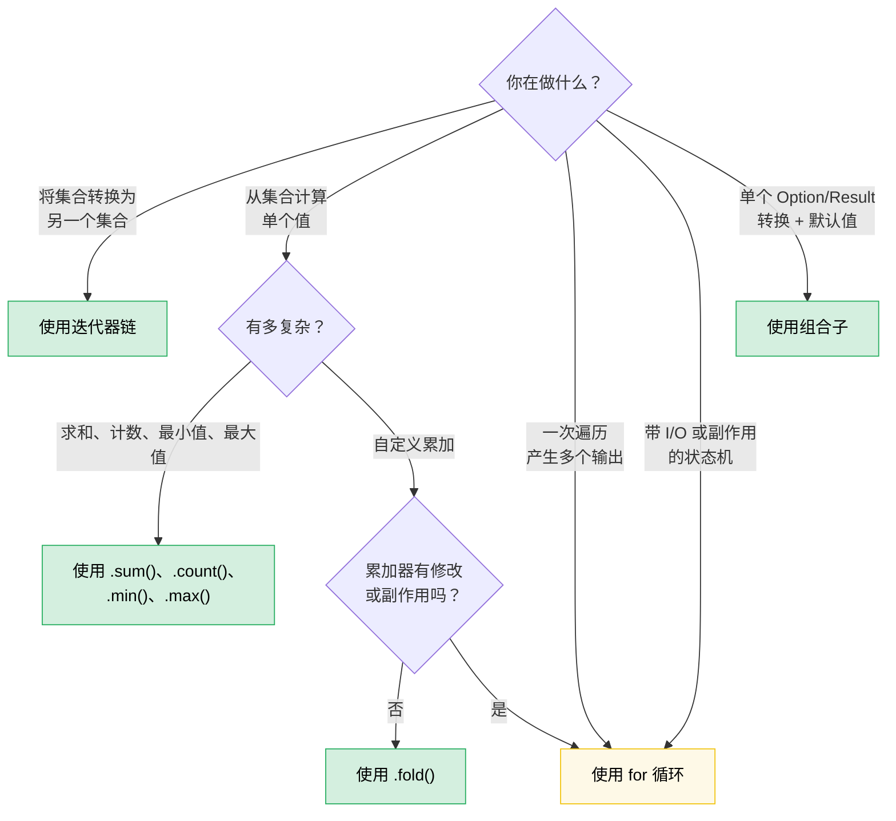

# 8. 函数式对比命令式：优雅何时胜出（何时又不胜出）

> **难度：**🟡 中级 | **时间：**2–3 小时 | **前置条件：**[第 7 章 — 闭包](ch07-closures-and-higher-order-functions.md)

Rust 让你在函数式和命令式风格之间获得了真正的对等。不像 Haskell（强制函数式）或 C（默认命令式），Rust 允许你自由选择——而正确的选择取决于你要表达的内容。本章将培养你做出明智选择的判断力。

**核心原则：**当你*通过管道转换数据*时，函数式风格大放异彩。当你*管理带副作用的状态转换*时，命令式风格大放异彩。大多数真实代码两者兼有，而技巧在于知道边界划在哪里。

---

## 8.1 你不知道自己想要的组合子

许多 Rust 开发者会这样写：

```rust
let value = if let Some(x) = maybe_config() {
    x
} else {
    default_config()
};
process(value);
```

而他们其实可以写成这样：

```rust
process(maybe_config().unwrap_or_else(default_config));
```

或者这个常见模式：

```rust
let display_name = if let Some(name) = user.nickname() {
    name.to_uppercase()
} else {
    "ANONYMOUS".to_string()
};
```

其实可以这样写：

```rust
let display_name = user.nickname()
    .map(|n| n.to_uppercase())
    .unwrap_or_else(|| "ANONYMOUS".to_string());
```

函数式版本不仅更短——它告诉你*发生了什么*（转换，然后取默认值），而不需要你去追踪控制流。`if let` 版本需要你阅读两个分支才能弄清楚两条路径最终到达同一个地方。

### Option 组合子家族

心智模型是这样的：`Option<T>` 是一个包含一个元素或为空的集合。`Option` 上的每个组合子都对应一种集合操作。

| 你写的... | 替代的... | 它所表达的 |
|---|---|---|
| `opt.unwrap_or(default)` | `if let Some(x) = opt { x } else { default }` | "用这个值，否则回退" |
| `opt.unwrap_or_else(\|\| expensive())` | `if let Some(x) = opt { x } else { expensive() }` | 同上，但默认值是惰性求值的 |
| `opt.map(f)` | `match opt { Some(x) => Some(f(x)), None => None }` | "转换内部值，传播缺失" |
| `opt.and_then(f)` | `match opt { Some(x) => f(x), None => None }` | "链式串联可能失败的操作"（flatmap） |
| `opt.filter(\|x\| pred(x))` | `match opt { Some(x) if pred(&x) => Some(x), _ => None }` | "仅当通过时保留" |
| `opt.zip(other)` | `if let (Some(a), Some(b)) = (opt, other) { Some((a,b)) } else { None }` | "要么都有，要么都没有" |
| `opt.or(fallback)` | `if opt.is_some() { opt } else { fallback }` | "第一个可用的" |
| `opt.or_else(\|\| try_another())` | `if opt.is_some() { opt } else { try_another() }` | "按顺序尝试备选方案" |
| `opt.map_or(default, f)` | `if let Some(x) = opt { f(x) } else { default }` | "转换或默认值"——一行搞定 |
| `opt.map_or_else(default_fn, f)` | `if let Some(x) = opt { f(x) } else { default_fn() }` | 同上，两边都是闭包 |
| `opt?` | `match opt { Some(x) => x, None => return None }` | "将缺失向上传播" |

### Result 组合子家族

同样的模式适用于 `Result<T, E>`：

| 你写的... | 替代的... | 它所表达的 |
|---|---|---|
| `res.map(f)` | `match res { Ok(x) => Ok(f(x)), Err(e) => Err(e) }` | 转换成功路径 |
| `res.map_err(f)` | `match res { Ok(x) => Ok(x), Err(e) => Err(f(e)) }` | 转换错误 |
| `res.and_then(f)` | `match res { Ok(x) => f(x), Err(e) => Err(e) }` | 链式串联可能失败的操作 |
| `res.unwrap_or_else(\|e\| default(e))` | `match res { Ok(x) => x, Err(e) => default(e) }` | 从错误中恢复 |
| `res.ok()` | `match res { Ok(x) => Some(x), Err(_) => None }` | "我不关心错误" |
| `res?` | `match res { Ok(x) => x, Err(e) => return Err(e.into()) }` | 将错误向上传播 |

### 何时 `if let` 更好

组合子在以下情况下会输：

- **你需要在 `Some` 分支中使用多条语句。**一个包含 5 行代码的 map 闭包比一个包含 5 行代码的 `if let` 更糟。
- **控制流本身就是重点。**`if let Some(connection) = pool.try_get() { /* use it */ } else { /* log, retry, alert */ }`——这两个分支是真正不同的代码路径，而不是转换或取默认值。
- **副作用占主导。**如果两个分支都进行 I/O 且有不同的错误处理，组合子版本会掩盖重要的差异。

**经验法则：**如果 `else` 分支产生与 `Some` 分支*相同的类型*，且函数体都是简短的表达式，就使用组合子。如果分支做的是根本不同的事情，就使用 `if let` 或 `match`。

---

## 8.2 布尔组合子：`.then()` 和 `.then_some()`

另一个比想象中更常见的模式：

```rust
let label = if is_admin {
    Some("ADMIN")
} else {
    None
};
```

Rust 1.62+ 让你可以这样写：

```rust
let label = is_admin.then_some("ADMIN");
```

或者使用计算值：

```rust
let permissions = is_admin.then(|| compute_admin_permissions());
```

这在链式调用中特别强大：

```rust
// 命令式
let mut tags = Vec::new();
if user.is_admin { tags.push("admin"); }
if user.is_verified { tags.push("verified"); }
if user.score > 100 { tags.push("power-user"); }

// 函数式
let tags: Vec<&str> = [
    user.is_admin.then_some("admin"),
    user.is_verified.then_some("verified"),
    (user.score > 100).then_some("power-user"),
]
.into_iter()
.flatten()
.collect();
```

函数式版本让模式变得明确："从条件元素构建列表"。命令式版本需要你阅读每个 `if` 来确认它们都在做同样的事（推送一个标签）。

---

## 8.3 迭代器链对比循环：决策框架

第 7 章展示了机制。本节培养判断力。

### 迭代器何时胜出

**数据管道**——通过一系列步骤转换集合：

```rust
// 命令式：8 行，2 个可变变量
let mut results = Vec::new();
for item in inventory {
    if item.category == Category::Server {
        if let Some(temp) = item.last_temperature() {
            if temp > 80.0 {
                results.push((item.id, temp));
            }
        }
    }
}

// 函数式：6 行，0 个可变变量，一条管道
let results: Vec<_> = inventory.iter()
    .filter(|item| item.category == Category::Server)
    .filter_map(|item| item.last_temperature().map(|t| (item.id, t)))
    .filter(|(_, temp)| *temp > 80.0)
    .collect();
```

函数式版本胜出，因为：
- 每个过滤器都可以独立阅读
- 没有 `mut`——数据单向流动
- 你可以添加/删除/重新排列管道阶段，而无需重构
- LLVM 将迭代器适配器内联为与循环相同的机器码

**聚合**——从集合计算单个值：

```rust
// 命令式
let mut total_power = 0.0;
let mut count = 0;
for server in fleet {
    total_power += server.power_draw();
    count += 1;
}
let avg = total_power / count as f64;

// 函数式
let (total_power, count) = fleet.iter()
    .map(|s| s.power_draw())
    .fold((0.0, 0usize), |(sum, n), p| (sum + p, n + 1));
let avg = total_power / count as f64;
```

如果你只需要求和，还可以更简单：

```rust
let total: f64 = fleet.iter().map(|s| s.power_draw()).sum();
```

### 循环何时胜出

**带复杂状态的提前退出：**

```rust
// 这段代码清晰直接
let mut best_candidate = None;
for server in fleet {
    let score = evaluate(server);
    if score > threshold {
        if server.is_available() {
            best_candidate = Some(server);
            break; // 找到了——立即停止
        }
    }
}

// 函数式版本则很牵强
let best_candidate = fleet.iter()
    .filter(|s| evaluate(s) > threshold)
    .find(|s| s.is_available());
```

等等——那个函数式版本其实也挺清晰的。让我们试一个它真正输掉的例子：

**同时构建多个输出：**

```rust
// 命令式：清晰，每个分支做不同的事
let mut warnings = Vec::new();
let mut errors = Vec::new();
let mut stats = Stats::default();

for event in log_stream {
    match event.severity {
        Severity::Warn => {
            warnings.push(event.clone());
            stats.warn_count += 1;
        }
        Severity::Error => {
            errors.push(event.clone());
            stats.error_count += 1;
            if event.is_critical() {
                alert_oncall(&event);
            }
        }
        _ => stats.other_count += 1,
    }
}

// 函数式版本：牵强、别扭，没人想读这样的代码
let (warnings, errors, stats) = log_stream.iter().fold(
    (Vec::new(), Vec::new(), Stats::default()),
    |(mut w, mut e, mut s), event| {
        match event.severity {
            Severity::Warn => { w.push(event.clone()); s.warn_count += 1; }
            Severity::Error => {
                e.push(event.clone()); s.error_count += 1;
                if event.is_critical() { alert_oncall(event); }
            }
            _ => s.other_count += 1,
        }
        (w, e, s)
    },
);
```

fold 版本*更长*、*更难阅读*，而且无论如何都有可变性（解构出来的 `mut` 累加器）。循环胜出，因为：
- 多个输出并行构建
- 副作用（告警）混入逻辑中
- 分支体是语句，而非表达式

**带 I/O 的状态机：**

```rust
// 一个读取 token 的解析器——循环本身就是算法
let mut state = ParseState::Start;
loop {
    let token = lexer.next_token()?;
    state = match state {
        ParseState::Start => match token {
            Token::Keyword(k) => ParseState::GotKeyword(k),
            Token::Eof => break,
            _ => return Err(ParseError::UnexpectedToken(token)),
        },
        ParseState::GotKeyword(k) => match token {
            Token::Ident(name) => ParseState::GotName(k, name),
            _ => return Err(ParseError::ExpectedIdentifier),
        },
        // ...more states
    };
}
```

没有任何函数式等价物更清晰。带有 `match state` 的循环是状态机的自然表达。

### 决策流程图



### 侧边栏：作用域化可变性——内部命令式，外部函数式

Rust 的代码块是表达式。这让你可以将可变性限制在构建阶段，并将结果绑定为不可变：

```rust
use rand::random;

let samples = {
    let mut buf = Vec::with_capacity(10);
    while buf.len() < 10 {
        let reading: f64 = random();
        buf.push(reading);
        if random::<u8>() % 3 == 0 { break; } // 随机提前停止
    }
    buf
};
// samples 是不可变的——包含 1 到 10 个元素
```

内部的 `buf` 仅在块内可变。一旦块产出值，外部的绑定 `samples` 就不可变了，编译器会拒绝任何后续的 `samples.push(...)`。

**为什么不用迭代器链？**你可能会尝试：

```rust
let samples: Vec<f64> = std::iter::from_fn(|| Some(random()))
    .take(10)
    .take_while(|_| random::<u8>() % 3 != 0)
    .collect();
```

但 `take_while` 会*排除*未通过谓词的元素，产生零到十个元素，而不是命令式版本保证的至少一个元素。你可以用 `scan` 或 `chain` 来变通，但命令式版本更清晰。

**作用域化可变性真正胜出的场景：**

| 场景 | 迭代器为何力不从心 |
|---|---|
| **排序后冻结**（`sort_unstable()` + `dedup()`） | 两者都返回 `()`——没有可链式调用的输出（itertools 提供了 `.sorted().dedup()`，如果可用的话） |
| **有状态的终止**（在与数据无关的条件下停止） | `take_while` 会丢弃边界元素 |
| **多步结构体填充**（从不同来源逐字段填充） | 没有自然的单一管道 |

**诚实的校准：**对于大多数集合构建任务，迭代器链或 [itertools](https://docs.rs/itertools) 是首选。当构建逻辑包含分支、提前退出或不适合单一管道的原地修改时，才使用作用域化可变性。该模式的真正价值在于教会我们*可变性的作用域可以比变量的生命周期更小*——这是一个让从 C++、C# 和 Python 转来的开发者感到惊讶的 Rust 基本原则。

---

## 8.4 `?` 运算符：函数式与命令式的交汇点

`?` 运算符是 Rust 对两种风格最优雅的综合。它本质上是 `.and_then()` 与提前返回的结合：

```rust
// 这条 and_then 链...
fn load_config() -> Result<Config, Error> {
    read_file("config.toml")
        .and_then(|contents| parse_toml(&contents))
        .and_then(|table| validate_config(table))
        .and_then(|valid| Config::from_validated(valid))
}

// ...完全等价于这样写
fn load_config() -> Result<Config, Error> {
    let contents = read_file("config.toml")?;
    let table = parse_toml(&contents)?;
    let valid = validate_config(table)?;
    Config::from_validated(valid)
}
```

两者在精神上都是函数式的（它们自动传播错误），但 `?` 版本为你提供了命名的中间变量，这在以下情况下很重要：

- 你稍后需要再次使用 `contents`
- 你想为每一步添加 `.context("while parsing config")?`
- 你在调试时想检查中间值

**反模式：**当 `?` 可用时使用长长的 `.and_then()` 链。如果链中的每个闭包都是 `|x| next_step(x)`，你就重新发明了 `?`，却没有了可读性。

**当 `.and_then()` 确实比 `?` 更好时：**

```rust
// 在 Option 内部转换，不使用提前返回
let port: Option<u16> = config.get("port")
    .and_then(|v| v.parse::<u16>().ok())
    .filter(|&p| p > 0 && p < 65535);
```

这里你不能使用 `?`，因为没有可以返回的外层函数——你是在构建一个 `Option`，而不是在传播它。

---

## 8.5 集合构建：`collect()` 对比 push 循环

`collect()` 比大多数开发者意识到的更强大：

### 收集到 Result

```rust
// 命令式：解析列表，遇到第一个错误即失败
let mut numbers = Vec::new();
for s in input_strings {
    let n: i64 = s.parse().map_err(|_| Error::BadInput(s.clone()))?;
    numbers.push(n);
}

// 函数式：收集到 Result<Vec<_>, _>
let numbers: Vec<i64> = input_strings.iter()
    .map(|s| s.parse::<i64>().map_err(|_| Error::BadInput(s.clone())))
    .collect::<Result<_, _>>()?;
```

`collect::<Result<Vec<_>, _>>()` 这个技巧之所以有效，是因为 `Result` 实现了 `FromIterator`。它会在第一个 `Err` 处短路，就像带 `?` 的循环一样。

### 收集到 HashMap

```rust
// 命令式
let mut index = HashMap::new();
for server in fleet {
    index.insert(server.id.clone(), server);
}

// 函数式
let index: HashMap<_, _> = fleet.into_iter()
    .map(|s| (s.id.clone(), s))
    .collect();
```

### 收集到 String

```rust
// 命令式
let mut csv = String::new();
for (i, field) in fields.iter().enumerate() {
    if i > 0 { csv.push(','); }
    csv.push_str(field);
}

// 函数式
let csv = fields.join(",");

// 或者更复杂的格式化：
let csv: String = fields.iter()
    .map(|f| format!("\"{f}\""))
    .collect::<Vec<_>>()
    .join(",");
```

### 循环版本何时胜出

`collect()` 会分配一个新集合。如果你是*原地修改*，循环既更清晰又更高效：

```rust
// 原地修改——没有更好的函数式等价物
for server in &mut fleet {
    if server.needs_refresh() {
        server.refresh_telemetry()?;
    }
}
```

函数式版本需要 `.iter_mut().for_each(|s| { ... })`，那不过是一个多了些语法的循环。

---

## 8.6 模式匹配作为函数分发

Rust 的 `match` 是一个函数式构造，但大多数开发者以命令式的方式使用它。以下是函数式的视角：

### match 作为查找表

```rust
// 命令式思维："逐个检查每种情况"
fn status_message(code: StatusCode) -> &'static str {
    if code == StatusCode::OK { "Success" }
    else if code == StatusCode::NOT_FOUND { "Not found" }
    else if code == StatusCode::INTERNAL { "Server error" }
    else { "Unknown" }
}

// 函数式思维："从定义域映射到值域"
fn status_message(code: StatusCode) -> &'static str {
    match code {
        StatusCode::OK => "Success",
        StatusCode::NOT_FOUND => "Not found",
        StatusCode::INTERNAL => "Server error",
        _ => "Unknown",
    }
}
```

`match` 版本不仅仅是风格问题——编译器会验证穷尽性。添加一个新的变体，每个没有处理它的 `match` 都会变成编译错误。而 `if/else` 链会静默地落入默认分支。

### match + 解构作为管道

```rust
// 解析命令——每个分支提取并转换
fn execute(cmd: Command) -> Result<Response, Error> {
    match cmd {
        Command::Get { key } => db.get(&key).map(Response::Value),
        Command::Set { key, value } => db.set(key, value).map(|_| Response::Ok),
        Command::Delete { key } => db.delete(&key).map(|_| Response::Ok),
        Command::Batch(cmds) => cmds.into_iter()
            .map(execute)
            .collect::<Result<Vec<_>, _>>()
            .map(Response::Batch),
    }
}
```

每个分支都是一个返回相同类型的表达式。这就是将模式匹配作为函数分发——`match` 的分支本质上是一个以枚举变体为索引的函数表。

---

## 8.7 在自定义类型上链式调用方法

函数式风格不仅限于标准库类型。构建器模式和流式 API 本质上就是伪装的函数式编程：

```rust
// 这是一条在你自定义类型上的组合子链
let query = QueryBuilder::new("servers")
    .filter("status", Eq, "active")
    .filter("rack", In, &["A1", "A2", "B1"])
    .order_by("temperature", Desc)
    .limit(50)
    .build();
```

**关键洞见：**如果你的类型有接受 `self` 并返回 `Self`（或转换后的类型）的方法，你就构建了一个组合子。同样的函数式/命令式判断也适用：

```rust
// 好：可链式调用，因为每一步都是简单的转换
let config = Config::default()
    .with_timeout(Duration::from_secs(30))
    .with_retries(3)
    .with_tls(true);

// 坏：可链式调用，但链做了太多不相关的事
let result = processor
    .load_data(path)?       // I/O
    .validate()             // 纯转换
    .transform(rule_set)    // 纯转换
    .save_to_disk(output)?  // I/O
    .notify_downstream()?;  // 副作用

// 更好：将纯管道与 I/O 首尾分离
let data = load_data(path)?;
let processed = data.validate().transform(rule_set);
save_to_disk(output, &processed)?;
notify_downstream()?;
```

当链混入了纯转换和 I/O 时，它就会失败。读者无法分辨哪些调用可能失败、哪些有副作用，以及真正的数据转换发生在哪里。

---

## 8.8 性能：它们是一样的

一个常见的误解："函数式风格因为所有的闭包和分配而更慢。"

在 Rust 中，**迭代器链编译为与手写循环相同的机器码。**LLVM 会内联闭包调用，消除迭代器适配器结构体，并经常产生相同的汇编代码。这被称为*零成本抽象*，它不是理想——而是经过验证的。

```rust
// 这些在 release 构建中会产生相同的汇编代码：

// 函数式
let sum: i64 = (0..1000).filter(|n| n % 2 == 0).map(|n| n * n).sum();

// 命令式
let mut sum: i64 = 0;
for n in 0..1000 {
    if n % 2 == 0 {
        sum += n * n;
    }
}
```

**唯一的例外：**`.collect()` 会分配内存。如果你在链式调用 `.map().collect().iter().map().collect()` 并产生中间集合，你就在为循环版本避免的内存分配买单。解决方法是：通过直接链式调用适配器来消除中间的 collect，或者如果你出于其他原因需要中间集合，就使用循环。

---

## 8.9 品味测试：转换目录

以下是针对最常见的"我写了 6 行但其实可以一行搞定"模式的参考表：

| 命令式模式 | 函数式等价物 | 何时优先使用函数式 |
|---|---|---|
| `if let Some(x) = opt { f(x) } else { default }` | `opt.map_or(default, f)` | 两边都是简短表达式时 |
| `if let Some(x) = opt { Some(g(x)) } else { None }` | `opt.map(g)` | 总是——这正是 `map` 的用途 |
| `if condition { Some(x) } else { None }` | `condition.then_some(x)` | 总是 |
| `if condition { Some(compute()) } else { None }` | `condition.then(compute)` | 总是 |
| `match opt { Some(x) if pred(x) => Some(x), _ => None }` | `opt.filter(pred)` | 总是 |
| `for x in iter { if pred(x) { result.push(f(x)); } }` | `iter.filter(pred).map(f).collect()` | 当管道可以在一屏内阅读完时 |
| `if a.is_some() && b.is_some() { Some((a?, b?)) }` | `a.zip(b)` | 总是——`.zip()` 正是这个意思 |
| `match (a, b) { (Some(x), Some(y)) => x + y, _ => 0 }` | `a.zip(b).map(\|(x,y)\| x + y).unwrap_or(0)` | 视情况而定——取决于复杂度 |
| `iter.map(f).collect::<Vec<_>>()[0]` | `iter.map(f).next().unwrap()` | 不要为了一个元素分配 Vec |
| `let mut v = vec; v.sort(); v` | `{ let mut v = vec; v.sort(); v }` | Rust 标准库没有 `.sorted()`（使用 itertools） |

---

## 8.10 反模式

### 过度函数化：没人能看懂的 5 层深链

```rust
// 这不是优雅。这是个谜题。
let result = data.iter()
    .filter_map(|x| x.metadata.as_ref())
    .flat_map(|m| m.tags.iter())
    .filter(|t| t.starts_with("env:"))
    .map(|t| t.strip_prefix("env:").unwrap())
    .filter(|env| allowed_envs.contains(env))
    .map(|env| env.to_uppercase())
    .collect::<HashSet<_>>()
    .into_iter()
    .sorted()
    .collect::<Vec<_>>();
```

当一个链超过约 4 个适配器时，用命名的中间变量将其拆分，或提取一个辅助函数：

```rust
let env_tags = data.iter()
    .filter_map(|x| x.metadata.as_ref())
    .flat_map(|m| m.tags.iter());

let allowed: Vec<_> = env_tags
    .filter_map(|t| t.strip_prefix("env:"))
    .filter(|env| allowed_envs.contains(env))
    .map(|env| env.to_uppercase())
    .sorted()
    .collect();
```

### 函数化不足：Rust 已有对应词汇的 C 风格循环

```rust
// 这其实只是 .any()
let mut found = false;
for item in &list {
    if item.is_expired() {
        found = true;
        break;
    }
}

// 改成这样
let found = list.iter().any(|item| item.is_expired());
```

```rust
// 这其实只是 .find()
let mut target = None;
for server in &fleet {
    if server.id == target_id {
        target = Some(server);
        break;
    }
}

// 改成这样
let target = fleet.iter().find(|s| s.id == target_id);
```

```rust
// 这其实只是 .all()
let mut all_healthy = true;
for server in &fleet {
    if !server.is_healthy() {
        all_healthy = false;
        break;
    }
}

// 改成这样
let all_healthy = fleet.iter().all(|s| s.is_healthy());
```

标准库提供这些方法是有原因的。学习这些词汇，模式就会变得显而易见。

---

## 关键要点

> - **Option 和 Result 是单元素集合。**它们的组合子（`.map()`、`.and_then()`、`.unwrap_or_else()`、`.filter()`、`.zip()`）替代了大多数 `if let` / `match` 样板代码。
> - **使用 `bool::then_some()`**——它在所有情况下都替代了 `if cond { Some(x) } else { None }`。
> - **迭代器链在数据管道中胜出**——filter/map/collect 没有可变状态。它们编译为与循环相同的机器码。
> - **循环在多输出状态机中胜出**——当你构建多个集合、在分支中进行 I/O 或管理状态转换时。
> - **`?` 运算符是两全其美**——函数式的错误传播加上命令式的可读性。
> - **在约 4 个适配器处断开链**——使用命名中间变量提高可读性。过度函数化与函数化不足一样糟糕。
> - **学习标准库词汇**——`.any()`、`.all()`、`.find()`、`.position()`、`.sum()`、`.min_by_key()`——每一个都用一个表达意图的调用替代了多行循环。

> **另请参阅：**[第 7 章](ch07-closures-and-higher-order-functions.md) 了解闭包机制和 `Fn` trait 层级。[第 10 章](ch10-error-handling-patterns.md) 了解错误组合子模式。[第 15 章](ch15-crate-architecture-and-api-design.md) 了解流式 API 设计。

---

### 练习：将命令式重构为函数式 ★★（约 30 分钟）

将以下函数从命令式重构为函数式风格。然后找出函数式版本*更差*的一个地方并解释原因。

```rust
fn summarize_fleet(fleet: &[Server]) -> FleetSummary {
    let mut healthy = Vec::new();
    let mut degraded = Vec::new();
    let mut failed = Vec::new();
    let mut total_power = 0.0;
    let mut max_temp = f64::NEG_INFINITY;

    for server in fleet {
        match server.health_status() {
            Health::Healthy => healthy.push(server.id.clone()),
            Health::Degraded(reason) => degraded.push((server.id.clone(), reason)),
            Health::Failed(err) => failed.push((server.id.clone(), err)),
        }
        total_power += server.power_draw();
        if server.max_temperature() > max_temp {
            max_temp = server.max_temperature();
        }
    }

    FleetSummary {
        healthy,
        degraded,
        failed,
        avg_power: total_power / fleet.len() as f64,
        max_temp,
    }
}
```

<details>
<summary>🔑 解答</summary>

`total_power` 和 `max_temp` 是干净的函数式重写：

```rust
fn summarize_fleet(fleet: &[Server]) -> FleetSummary {
    let avg_power: f64 = fleet.iter().map(|s| s.power_draw()).sum::<f64>()
        / fleet.len() as f64;

    let max_temp = fleet.iter()
        .map(|s| s.max_temperature())
        .fold(f64::NEG_INFINITY, f64::max);

    // 但三分区用循环更好。
    // 函数式版本要么需要三次单独遍历，
    // 要么需要一个带三个可变累加器的别扭 fold。
    let mut healthy = Vec::new();
    let mut degraded = Vec::new();
    let mut failed = Vec::new();

    for server in fleet {
        match server.health_status() {
            Health::Healthy => healthy.push(server.id.clone()),
            Health::Degraded(reason) => degraded.push((server.id.clone(), reason)),
            Health::Failed(err) => failed.push((server.id.clone(), err)),
        }
    }

    FleetSummary { healthy, degraded, failed, avg_power, max_temp }
}
```

**为什么循环对于三分区更好：**函数式版本要么需要三次 `.filter().collect()` 遍历（3 倍迭代），要么需要一个带有三个 `mut Vec` 累加器在元组中的 `.fold()`——那不过是把循环用更差的语法重写了一遍。命令式的单次遍历循环更清晰、更高效，也更容易扩展。

</details>

***
