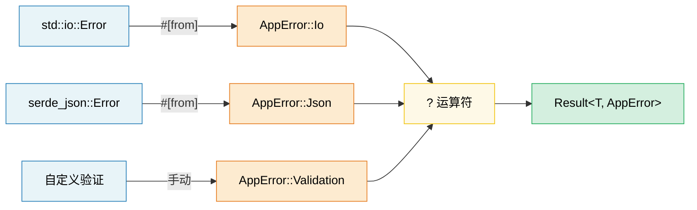

# 10. 错误处理模式 🟢

> **你将学到：**
> - 何时使用 `thiserror`（库）vs `anyhow`（应用程序）
> - 使用 `#[from]` 和 `.context()` 包装器的错误转换链
> - `?` 运算符如何脱糖（desugar）以及如何在 `main()` 中工作
> - 何时该 panic vs 返回错误，以及 FFI 边界处的 `catch_unwind`

## thiserror vs anyhow —— 库 vs 应用程序

Rust 的错误处理围绕 `Result<T, E>` 类型展开。有两个 crate 占据主导地位：

```rust,ignore
// ============================================================
// thiserror（库） vs anyhow（应用程序）—— 错误处理两种范式对比
// ============================================================
// thiserror：通过派生宏生成 Error + Display + From 实现，错误类型具体可匹配
// anyhow：动态错误类型，适合只需"传播错误"的顶层代码

// --- thiserror：用于库 ---
// 通过派生宏生成 Display、Error 和 From 实现
use thiserror::Error;

#[derive(Error, Debug)]
// → thiserror::Error 派生宏：自动实现 std::error::Error + Display
pub enum DatabaseError {
    #[error("connection failed: {0}")]
    // → #[error("...")]：为该变体生成 Display 实现，{0} 引用第一个字段
    ConnectionFailed(String),

    #[error("query error: {source}")]
    QueryError {
        #[source]
        source: sqlx::Error,
        // → #[source]：标记错误来源，构成错误因果链（source() 方法）
    },

    #[error("record not found: table={table} id={id}")]
    NotFound { table: String, id: u64 },
    // → 命名字段可用 {field} 在格式串中引用

    #[error(transparent)] // 将 Display 委托给内部错误
    Io(#[from] std::io::Error), // 自动生成 From<io::Error>
    // → #[from]：自动生成 From<io::Error> 实现，使 ? 运算符能自动转换
    //   #[error(transparent)]：Display 直接委托给内部错误
}

// --- anyhow：用于应用程序 ---
// 动态错误类型——适合顶层代码，只需让错误传播即可
use anyhow::{Context, Result, bail, ensure};
// → anyhow::Result<T> = Result<T, anyhow::Error>：错误类型擦除为 trait object

fn read_config(path: &str) -> Result<Config> {
    let content = std::fs::read_to_string(path)
        .with_context(|| format!("failed to read config from {path}"))?;
        // → with_context<F>(self, f) -> Result<T, ContextedError>
        //   仅在 Err 时惰性求值闭包，附加上下文信息

    let config: Config = serde_json::from_str(&content)
        .context("failed to parse config JSON")?;
        // → context(self, what) -> Result<T>：附加静态上下文

    ensure!(config.port > 0, "port must be positive, got {}", config.port);
    // → ensure!：条件为假时返回 Err（anyhow 宏，类似 assert! 但返回而非 panic）

    Ok(config)
}

fn main() -> Result<()> {
    // → main() -> Result<()>：Rust 允许 main 返回 Result，Err 时打印并退出码 1
    let config = read_config("server.toml")?;

    if config.name.is_empty() {
        bail!("server name cannot be empty"); // 立即返回 Err
        // → bail!(msg)：宏，立即从函数返回 anyhow::Error
    }

    Ok(())
}
```

**何时使用哪个**：

| | `thiserror` | `anyhow` |
|---|---|---|
| **用于** | 库、共享 crate | 应用程序、二进制文件 |
| **错误类型** | 具体的枚举——调用者可以模式匹配 | `anyhow::Error` —— 不透明的 |
| **工作量** | 定义你自己的错误枚举 | 直接使用 `Result<T>` |
| **向下转型** | 不需要——模式匹配 | `error.downcast_ref::<MyError>()` |

### 错误转换链（#[from]）

```rust,ignore
// === 错误转换链：#[from] 自动生成 From 实现 ===
use thiserror::Error;

#[derive(Error, Debug)]
enum AppError {
    #[error("I/O error: {0}")]
    Io(#[from] std::io::Error),
    // → #[from] 生成：impl From<std::io::Error> for AppError
    //   使 ? 能将 io::Error 自动转为 AppError::Io

    #[error("JSON error: {0}")]
    Json(#[from] serde_json::Error),

    #[error("HTTP error: {0}")]
    Http(#[from] reqwest::Error),
}

// 现在 ? 会自动转换：
fn fetch_and_parse(url: &str) -> Result<Config, AppError> {
    let body = reqwest::blocking::get(url)?.text()?;  // reqwest::Error → AppError::Http
    // → ? 运算符：Err(e) 时调用 From::from(e) 自动转换错误类型
    //   .text()：响应体转为 String（也可能返回 reqwest::Error）
    let config: Config = serde_json::from_str(&body)?; // serde_json::Error → AppError::Json
    Ok(config)
}
```

### 上下文与错误包装

在不丢失原始错误的情况下添加人类可读的上下文：

```rust,ignore
// === 上下文包装：在传播错误时叠加人类可读信息 ===
use anyhow::{Context, Result};

fn process_file(path: &str) -> Result<Data> {
    let content = std::fs::read_to_string(path)
        .with_context(|| format!("failed to read {path}"))?;
        // → with_context：闭包惰性求值（仅 Err 时执行），适合高开销上下文

    let data = parse_content(&content)
        .with_context(|| format!("failed to parse {path}"))?;

    validate(&data)
        .context("validation failed")?;
        // → context：接收静态字符串（或 Display 值），非惰性

    Ok(data)
}

// 错误输出：
// Error: validation failed
//
// Caused by:
//    0: failed to parse config.json
//    1: expected ',' at line 5 column 12
```

### 深入理解 ? 运算符

`?` 是 `match` + `From` 转换 + 提前返回的语法糖：

```rust
// === ? 运算符脱糖：match + From 转换 + 提前返回 ===
// 这段代码：
let value = operation()?;

// 脱糖为：
let value = match operation() {
    Ok(v) => v,
    Err(e) => return Err(From::from(e)),
    //                  ^^^^^^^^^^^^^^
    //                  通过 From trait 自动转换错误类型
};
// → 适用条件：外层函数返回类型为 Result<T, F>，且存在 From<E> for F
```

**`?` 也适用于 `Option`**（在返回 `Option` 的函数中）：

```rust
fn find_user_email(users: &[User], name: &str) -> Option<String> {
    let user = users.iter().find(|u| u.name == name)?; // 未找到则返回 None
    // → Iterator::find 返回 Option<&User>；? 在 Option 上：None 则提前 return None
    let email = user.email.as_ref()?; // email 为 None 时返回 None
    // → Option::as_ref(&self) -> Option<&T>：从 &Option<T> 得到 Option<&T>
    Some(email.to_uppercase())
}
```

### Panic、catch_unwind 与何时终止程序

```rust
// === panic vs catch_unwind：bug 与预期错误的边界 ===
// panic：用于 BUG，而非预期错误
fn get_element(data: &[i32], index: usize) -> &i32 {
    // 如果这里 panic，那是编程错误（bug）。
    // 不要"处理"它——修复调用方。
    &data[index]
    // → 索引越界时 panic（slice 的 Index 实现）
}

// catch_unwind：用于边界（FFI、线程池）
use std::panic;

let result = panic::catch_unwind(|| {
    // → catch_unwind<F, R>(f: F) -> Result<R, Box<dyn Any>>
    //   捕获闭包中的 panic，转为 Result 返回（不展开调用栈）
    //   要求闭包捕获为 &mut 或无捕获（满足 UnwindSafe）
    risky_operation()
});

match result {
    Ok(value) => println!("Success: {value:?}"),
    Err(_) => eprintln!("Operation panicked — continuing safely"),
}

// 何时使用哪种：
// - Result<T, E> → 预期失败（文件未找到、网络超时）
// - panic!()     → 编程 bug（索引越界、不变量被违反）
// - process::abort() → 不可恢复状态（安全违规、数据损坏）
```

> **与 C++ 对比**：`Result<T, E>` 替代了预期错误的异常。
> `panic!()` 类似于 `assert()` 或 `std::terminate()` ——它是用于 bug 的，
> 而非控制流。Rust 的 `?` 运算符让错误传播像异常一样符合人体工程学，
> 却没有不可预测的控制流。

> **核心要点 —— 错误处理**
> - 库：使用 `thiserror` 提供结构化的错误枚举；应用程序：使用 `anyhow` 进行符合人体工程学的错误传播
> - `#[from]` 自动生成 `From` 实现；`.context()` 添加人类可读的包装
> - `?` 脱糖为 `From::from()` + 提前返回；在返回 `Result` 的 `main()` 中也可工作

> **参见：** [第 14 章 —— API 设计](ch15-crate-architecture-and-api-design.md) 了解"解析而非验证"模式。[第 11 章 —— 序列化](ch11-serialization-zero-copy-and-binary-data.md) 了解 serde 错误处理。



---

### 练习：使用 thiserror 的错误层级 ★★（约 30 分钟）

为一个文件处理应用程序设计错误类型层级，该程序可能在 I/O、解析（JSON 和 CSV）以及验证阶段失败。使用 `thiserror` 并演示 `?` 传播。

<details>
<summary>🔑 答案</summary>

```rust,ignore
use thiserror::Error;

#[derive(Error, Debug)]
pub enum AppError {
    #[error("I/O error: {0}")]
    Io(#[from] std::io::Error),

    #[error("JSON parse error: {0}")]
    Json(#[from] serde_json::Error),

    #[error("CSV error at line {line}: {message}")]
    Csv { line: usize, message: String },

    #[error("validation error: {field} — {reason}")]
    Validation { field: String, reason: String },
}

fn read_file(path: &str) -> Result<String, AppError> {
    // → std::fs::read_to_string -> Result<String, io::Error>
    //   ? 通过 #[from] 生成的 From<io::Error> 转为 AppError::Io
    Ok(std::fs::read_to_string(path)?) // io::Error → AppError::Io 通过 #[from]
}

fn parse_json(content: &str) -> Result<serde_json::Value, AppError> {
    // → serde_json::from_str -> Result<Value, serde_json::Error>
    Ok(serde_json::from_str(content)?) // serde_json::Error → AppError::Json
}

fn validate_name(value: &serde_json::Value) -> Result<String, AppError> {
    let name = value.get("name")
        // → serde_json::Value::get(&self, key) -> Option<&Value>：按键取值
        .and_then(|v| v.as_str())
        // → Option::and_then：None => None，Some(x) => f(x)
        //   Value::as_str(&self) -> Option<&str>：非字符串则 None
        .ok_or_else(|| AppError::Validation {
            // → Option::ok_or_else<E, F>(self, err: F) -> Result<T, E>
            //   None => Err(err())，惰性构造错误
            field: "name".into(),
            reason: "must be a non-null string".into(),
        })?;

    if name.is_empty() {
        return Err(AppError::Validation {
            field: "name".into(),
            reason: "must not be empty".into(),
        });
    }

    Ok(name.to_string())
}

fn process_file(path: &str) -> Result<String, AppError> {
    let content = read_file(path)?;
    let json = parse_json(&content)?;
    let name = validate_name(&json)?;
    Ok(name)
}

fn main() {
    match process_file("config.json") {
        Ok(name) => println!("Name: {name}"),
        Err(e) => eprintln!("Error: {e}"),
    }
}
```

</details>

***
