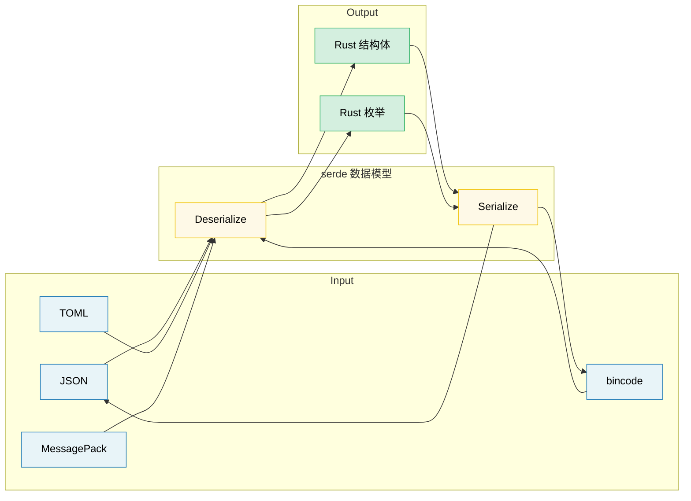

# 11. 序列化、零拷贝与二进制数据 🟡

> **你将学到：**
> - serde 基础：派生宏（derive macros）、属性与枚举表示
> - 面向高性能读密集型工作负载的零拷贝反序列化
> - serde 格式生态（JSON、TOML、bincode、MessagePack）
> - 使用 `repr(C)`、zerocopy 和 `bytes::Bytes` 处理二进制数据

## serde 基础

`serde`（SERialize/DEserialize，即序列化/反序列化）是 Rust 通用的序列化框架。
它将**数据模型**（你的结构体）与**格式**（JSON、TOML、二进制）分离：

```rust,ignore
// ============================================================
// serde 基础：派生宏如何将数据模型与格式解耦
// ============================================================
// 核心概念：serde 的设计哲学是"数据模型 ↔ 格式"分离。
//   - Serialize / Deserialize 是派生宏（derive macros），编译期自动生成代码
//   - 你的结构体只需派生一次，即可与数十种格式互转
//   - #[serde(...)] 属性对生成过程做细粒度控制

// ↓ 导入两个派生宏 trait —— 它们是 marker，真正的逻辑由派生宏生成的代码提供
use serde::{Serialize, Deserialize};
//   ^^^^^^^^^ → Serialize：pub fn serialize<S: Serializer>(&self, serializer: S)
//   ^^^^^^^^^^^ → Deserialize<'de>：对应 pub fn deserialize<D: Deserializer>(...) -> Result<Self>

// ↓ #[derive(Serialize, Deserialize)] 展开后会为 ServerConfig 生成
//   impl Serialize for ServerConfig 和 impl<'de> Deserialize<'de> for ServerConfig
#[derive(Debug, Serialize, Deserialize)]
struct ServerConfig {
    name: String,
    port: u16,
    // ↓ 字段属性：反序列化时若该字段缺失，使用 Default::default() 填充
    #[serde(default)]                    // → 等价于 #[serde(default = "Default::default")]
    max_connections: usize,              // → usize 的 default 是 0
    // ↓ 序列化时跳过条件：若值为 None 则不写入 JSON 输出
    #[serde(skip_serializing_if = "Option::is_none")]
    tls_cert_path: Option<String>,       // → Option::is_none 是一个函数指针，签名为 fn(&Option<T>) -> bool
}

fn main() -> Result<(), Box<dyn std::error::Error>> {
    // ↓ Box<dyn std::error::Error> 是任意错误类型的逃逸口
    //   动态分发（dyn）允许 main 返回不同类型的 Err
    // 从 JSON 反序列化：
    let json_input = r#"{
        "name": "hw-diag",
        "port": 8080
    }"#;
    // → serde_json::from_str 签名：fn from_str<'de, T: Deserialize<'de>>(s: &'de str) -> Result<T, Error>
    //   返回 Result<ServerConfig, serde_json::Error>，? 运算符在 Err 时提前返回
    let config: ServerConfig = serde_json::from_str(json_input)?;
    println!("{config:?}");
    // ServerConfig { name: "hw-diag", port: 8080, max_connections: 0, tls_cert_path: None }
    //                                                                                      ^^^
    //                           max_connections 因 #[serde(default)] 缺失时填 0；tls_cert_path 缺失时为 None

    // 序列化为 JSON：
    // → to_string_pretty 签名：fn to_string_pretty<T: Serialize>(value: &T) -> Result<String, Error>
    //   返回带缩进换行的"美化"JSON 字符串（对比 to_string 则是紧凑单行）
    let output = serde_json::to_string_pretty(&config)?;
    println!("{output}");

    // 同一结构体，不同格式——无需修改代码：
    let toml_input = r#"
        name = "hw-diag"
        port = 8080
    "#;
    // → toml::from_str 复用相同的 Deserialize 实现 —— 这正是"数据模型与格式解耦"的威力
    let config: ServerConfig = toml::from_str(toml_input)?;
    println!("{config:?}");

    Ok(())
}
```

> **关键洞察**：你的结构体只需派生一次 `Serialize` 和 `Deserialize`。
> 之后它就能与*所有*兼容 serde 的格式配合使用——JSON、TOML、YAML、
> bincode、MessagePack、CBOR、postcard 等数十种格式。

### 常用 serde 属性

serde 通过字段级和容器级属性对序列化提供细粒度控制：

```rust,ignore
// ============================================================
// 常用 serde 属性速览：容器级 vs 字段级
// ============================================================
// serde 属性分为两类：
//   - 容器属性（写在 struct/enum 上方的 #[serde(...)]）：影响整个类型
//   - 字段属性（写在各字段上方的 #[serde(...)]）：只影响单个字段
// 这些属性在派生宏展开时被读取，用于指导生成代码的细节。

use serde::{Serialize, Deserialize};

// --- 容器属性（作用于 struct/enum） ---
#[derive(Serialize, Deserialize)]
// ↓ rename_all：批量重命名所有字段以匹配目标命名规范
//   camelCase → test_name 序列化为 "testName"
//   其他可选：snake_case、SCREAMING_SNAKE_CASE、PascalCase、kebab-case
#[serde(rename_all = "camelCase")]       // → JSON 约定：field_name → fieldName
// ↓ deny_unknown_fields：反序列化时若遇到结构体未定义的键，直接报错
//   默认行为是静默忽略未知字段——开启此项可做严格校验
#[serde(deny_unknown_fields)]            // → 拒绝多余键——严格解析
struct DiagResult {
    test_name: String,                   // → 序列化为 "testName"
    pass_count: u32,                     // → 序列化为 "passCount"
    fail_count: u32,                     // → 序列化为 "failCount"
}

// --- 字段属性 ---
#[derive(Serialize, Deserialize)]
struct Sensor {
    // ↓ rename：仅覆盖此字段的序列化名称（不影响其他字段）
    #[serde(rename = "sensor_id")]       // → 覆盖序列化时的字段名
    id: u64,

    // ↓ default（无参数）：该字段在输入缺失时使用 Default::default()
    #[serde(default)]                    // → 输入缺失时使用 Default
    enabled: bool,                       // → bool 的 default 是 false

    // ↓ default = "fn"：指定自定义函数提供默认值（签名 fn() -> T）
    #[serde(default = "default_threshold")]
    threshold: f64,                      // → 缺失时调用 default_threshold() 得到 1.0

    // ↓ skip：双向跳过——既不序列化也不反序列化此字段
    //   反序列化时使用 Default 填充，常用于缓存、运行时状态
    #[serde(skip)]                       // → 永不序列化或反序列化
    cached_value: Option<f64>,

    // ↓ skip_serializing_if = "fn"：仅控制序列化，传入函数 fn(&T) -> bool
    //   Vec::is_empty 在向量为空时返回 true，从而跳过空 tags 字段
    #[serde(skip_serializing_if = "Vec::is_empty")]
    tags: Vec<String>,

    // ↓ flatten：把嵌套结构体的字段"内联"到外层
    //   即把 metadata 的字段直接平铺到 Sensor 的 JSON 中，而非嵌套一层
    #[serde(flatten)]                    // → 内联嵌套结构体字段
    metadata: Metadata,

    // ↓ with = "module"：指定一个模块，它需提供 serialize/deserialize 函数
    //   模块需实现：pub fn serialize(&self, S) / pub fn deserialize(D)
    #[serde(with = "hex_bytes")]         // → 自定义序列化/反序列化模块
    raw_data: Vec<u8>,                   // → 用十六进制字符串表示字节序列
}

fn default_threshold() -> f64 { 1.0 }    // → 自定义默认值函数：返回 f64

#[derive(Serialize, Deserialize)]
struct Metadata {
    vendor: String,
    model: String,
}
// 使用 #[serde(flatten)] 后，JSON 如下：
// { "sensor_id": 1, "vendor": "Intel", "model": "X200", ... }
// 而非：{ "sensor_id": 1, "metadata": { "vendor": "Intel", ... } }
```

**最常用属性速查表**：

| 属性 | 级别 | 效果 |
|-----------|-------|--------|
| `rename_all = "camelCase"` | 容器 | 将所有字段重命名为 camelCase/snake_case/SCREAMING_SNAKE_CASE |
| `deny_unknown_fields` | 容器 | 遇到意外键时报错（严格模式） |
| `default` | 字段 | 字段缺失时使用 `Default::default()` |
| `rename = "..."` | 字段 | 自定义序列化名称 |
| `skip` | 字段 | 完全排除在序列化/反序列化之外 |
| `skip_serializing_if = "fn"` | 字段 | 条件性排除（如 `Option::is_none`） |
| `flatten` | 字段 | 内联嵌套结构体的字段 |
| `with = "module"` | 字段 | 使用自定义序列化/反序列化函数 |
| `alias = "..."` | 字段 | 反序列化时接受备选名称 |
| `deserialize_with = "fn"` | 字段 | 仅使用自定义反序列化函数 |
| `untagged` | 枚举 | 按顺序尝试每个变体（输出中无判别标记） |

### 枚举表示

serde 为 JSON 等格式的枚举提供了四种表示方式：

```rust,ignore
// ============================================================
// serde 枚举表示：JSON 等格式中枚举的四种序列化形态
// ============================================================
// 同一个 enum 可以有四种不同的 JSON 形态，由 #[serde(...)] 控制。
// 选择依据：可读性、跨语言兼容性、数据能否凭形状区分。

use serde::{Serialize, Deserialize};

// 1. 外部标记（默认）：
// ↓ 不加属性时，serde 用变体名作为 JSON 的键，数据放在值中
//   单元变体 → 字符串；结构体变体 → {变体名: {字段...}}；元组变体 → {变体名: [值]}
#[derive(Serialize, Deserialize)]
enum Command {
    Reboot,                               // → 单元变体：无关联数据
    RunDiag { test_name: String, timeout_secs: u64 },  // → 结构体变体：具名字段
    SetFanSpeed(u8),                      // → 元组变体：匿名位置数据
}
// "Reboot"                                          → Command::Reboot
// {"RunDiag": {"test_name": "gpu", "timeout_secs": 60}}  → Command::RunDiag { ... }

// 2. 内部标记 —— #[serde(tag = "type")]：
// ↓ 在变体内部插入一个判别字段（这里是 "type"），值为变体名
//   优点：JSON 扁平可读，符合 Go/Python/TS 联合类型惯例
#[derive(Serialize, Deserialize)]
#[serde(tag = "type")]                    // → 内部标记：用 "type" 字段标识变体
enum Event {
    Start { timestamp: u64 },
    Error { code: i32, message: String },
    End   { timestamp: u64, success: bool },
}
// {"type": "Start", "timestamp": 1706000000}
// {"type": "Error", "code": 42, "message": "timeout"}

// 3. 相邻标记 —— #[serde(tag = "t", content = "c")]：
// ↓ 用两个独立字段：一个放变体名，另一个放数据
//   介于外部标记和内部标记之间，结构清晰
#[derive(Serialize, Deserialize)]
#[serde(tag = "t", content = "c")]        // → 相邻标记："t" 标识变体，"c" 承载数据
enum Payload {
    Text(String),
    Binary(Vec<u8>),
}
// {"t": "Text", "c": "hello"}
// {"t": "Binary", "c": [0, 1, 2]}

// 4. 无标记 —— #[serde(untagged)]：
// ↓ 完全省略判别字段，serde 按变体声明顺序逐一尝试反序列化
//   仅当类型可凭"形状"区分时才安全
#[derive(Serialize, Deserialize)]
#[serde(untagged)]                        // → 无标记：按序尝试匹配变体
enum StringOrNumber {
    Str(String),                          // → 字符串先尝试
    Num(f64),                             // → 若非字符串再尝试数字
}
// "hello" → StringOrNumber::Str("hello")
// 42.0    → StringOrNumber::Num(42.0)
// ⚠️ 按顺序尝试——第一个匹配的变体胜出
```

> **如何选择表示方式**：对大多数 JSON API 使用内部标记（`tag = "type"`）——
> 它可读性最好，且符合 Go、Python 和 TypeScript 的惯例。仅当类型仅凭形状
> 就能区分（即"联合"类型）时才使用 untagged。

### 零拷贝反序列化

serde 可以在反序列化时不分配新的字符串——直接从输入缓冲区借用。这是高性能解析的关键：

```rust,ignore
// ============================================================
// 零拷贝反序列化：借用型字段如何避免内存分配
// ============================================================
// 核心区别：String（拥有）vs &'a str（借用）。
//   - 拥有型：每个字段从输入字节拷贝出独立堆分配
//   - 借用型：字段直接指向输入缓冲区内部，零拷贝、零分配
// 借用型要求输入缓冲区的生命周期 ≥ 结构体的生命周期。

use serde::Deserialize;

// --- 拥有型（会分配） ---
// 每个 String 字段从输入中拷贝字节到新的堆分配中。
#[derive(Deserialize)]
struct OwnedRecord {
    name: String,           // → 分配一个新 String，拷贝输入字节
    value: String,          // → 再分配一个 String
}

// --- 零拷贝（借用） ---
// &'de str 字段直接从输入借用——零分配。
// ↓ 生命周期 'a：表示 name/value 借用的数据来自某外部输入，结构体不能活过该输入
#[derive(Deserialize)]
struct BorrowedRecord<'a> {
    name: &'a str,          // → 指向输入缓冲区，不分配（生命周期 'a 与输入绑定）
    value: &'a str,         // → 指向输入缓冲区，不分配
}

fn main() {
    let input = r#"{"name": "cpu_temp", "value": "72.5"}"#;

    // 拥有型：分配两个 String 对象
    let owned: OwnedRecord = serde_json::from_str(input).unwrap();

    // 零拷贝：`name` 和 `value` 指向 `input`——无分配
    let borrowed: BorrowedRecord = serde_json::from_str(input).unwrap();

    // 输出受生命周期约束：borrowed 不能比 input 活得更久
    println!("{}: {}", borrowed.name, borrowed.value);
}
```

**理解生命周期**：

```rust,ignore
// ============================================================
// 生命周期与 Deserialize：DeserializeOwned vs Deserialize<'a>
// ============================================================
// 这是零拷贝的核心难点。serde 用两个 trait 表达"是否允许借用"：
//   - Deserialize<'a>：可以从 'a 生命周期的数据借用（更高效，但有约束）
//   - DeserializeOwned：等价于 for<'de> Deserialize<'de>，要求完全拥有数据（无约束）

// Deserialize<'de>——结构体可以从生命周期为 'de 的数据借用：
//   struct BorrowedRecord<'a> where 'a == 'de
//   仅当输入缓冲区存活足够久时才有效

// DeserializeOwned——结构体拥有所有数据，无借用：
//   trait DeserializeOwned: for<'de> Deserialize<'de> {}
//   适用于任何输入生命周期（结构体是独立的）

// ↓ DeserializeOwned 是一个 marker trait，定义在 serde::de 中
//   它没有方法，只是"对任意生命周期都实现 Deserialize"的简写
use serde::de::DeserializeOwned;

// 此函数要求拥有型类型——输入可以是临时的
// ↓ 泛型约束 T: DeserializeOwned 等价于 T: for<'de> Deserialize<'de>
//   表示 T 不允许从输入借用，因此 input 可以是短命的临时变量
fn parse_owned<T: DeserializeOwned>(input: &str) -> T {
    serde_json::from_str(input).unwrap()
}

// 此函数允许借用——更高效但限制生命周期
// ↓ 泛型约束 T: Deserialize<'a> 允许 T 含 &'a str 等借用字段
//   'a 与 input 的生命周期绑定：返回的 T 不能活过 input
fn parse_borrowed<'a, T: Deserialize<'a>>(input: &'a str) -> T {
    serde_json::from_str(input).unwrap()
}
```

**何时使用零拷贝**：
- 解析只需要少量字段的大文件
- 高吞吐管道（网络数据包、日志行）
- 输入缓冲区本身存活时间足够长时（如内存映射文件）

**何时不使用零拷贝**：
- 输入是临时的（会被复用的网络读取缓冲区）
- 你需要在输入生命周期之外存储结果
- 字段需要转换（转义处理、标准化）

> **实用技巧**：`Cow<'a, str>` 能让你兼得两者——可能时借用，必要时分配
> （例如当 JSON 转义序列需要反转义时）。serde 原生支持 Cow。

### 格式生态

| 格式 | Crate | 人类可读 | 大小 | 速度 | 使用场景 |
|--------|-------|:--------------:|:----:|:-----:|----------|
| JSON | `serde_json` | ✅ | 大 | 良好 | 配置文件、REST API、日志 |
| TOML | `toml` | ✅ | 中 | 良好 | 配置文件（Cargo.toml 风格） |
| YAML | `serde_yaml` | ✅ | 中 | 良好 | 配置文件（复杂嵌套） |
| bincode | `bincode` | ❌ | 小 | 快 | IPC、缓存、Rust 间通信 |
| postcard | `postcard` | ❌ | 极小 | 很快 | 嵌入式系统、`no_std` |
| MessagePack | `rmp-serde` | ❌ | 小 | 快 | 跨语言二进制协议 |
| CBOR | `ciborium` | ❌ | 小 | 快 | 物联网、受限环境 |

```rust
// ============================================================
// serde 格式生态：同一结构体，多种格式互转
// ============================================================
// serde 的核心价值：派生一次 Serialize/Deserialize，即可与数十种格式互转。
// 下面展示同一 DiagConfig 结构体序列化为 JSON 和 bincode 两种格式。

// ↓ 通过 serde::Serialize / serde::Deserialize 全路径派生
//   （也可写成 use serde::{Serialize, Deserialize}）
#[derive(serde::Serialize, serde::Deserialize, Debug)]
struct DiagConfig {
    name: String,
    tests: Vec<String>,
    timeout_secs: u64,
}

let config = DiagConfig {
    name: "accel_diag".into(),           // → String::from(&str) 的简写（Into 自动转换）
    tests: vec!["memory".into(), "compute".into()],
    timeout_secs: 300,
};

// JSON:   {"name":"accel_diag","tests":["memory","compute"],"timeout_secs":300}
// → to_string 签名：fn to_string<T: Serialize>(value: &T) -> Result<String, Error>
//   生成紧凑单行 JSON（无缩进）；to_string_pretty 则生成带缩进版本
let json = serde_json::to_string(&config).unwrap();       // 67 字节

// bincode：紧凑二进制——约 40 字节，无字段名
// → bincode::serialize 签名：fn serialize<T: Serialize>(t: &T) -> Result<Vec<u8>, Error>
//   二进制格式省略字段名，仅存值，体积小、速度快，但不可读
let bin = bincode::serialize(&config).unwrap();            // 小得多

// postcard：更小，变长整数编码——适合嵌入式
// → postcard::to_allocvec 签名：fn to_allocvec<T: Serialize>(value: &T) -> Result<Vec<u8>, Error>
//   no_std 友好，使用变长编码进一步压缩整数
// let post = postcard::to_allocvec(&config).unwrap();
```

> **如何选择格式**：
> - 人类编辑的配置文件 → TOML 或 JSON
> - Rust 间 IPC/缓存 → bincode（快速、紧凑，但不跨语言）
> - 跨语言二进制 → MessagePack 或 CBOR
> - 嵌入式 / `no_std` → postcard

### 二进制数据与 repr(C)

对于硬件诊断，解析二进制协议数据很常见。Rust 提供了安全、零拷贝处理二进制数据的工具：

```rust
// ============================================================
// 二进制数据解析：repr(C) 布局与字节序感知
// ============================================================
// 核心概念：解析二进制协议（如 IPMI、PCIe）需要可预测的内存布局。
//   - #[repr(C)]：强制 C 内存布局（字段按声明顺序 + C 填充规则）
//   - 默认 Rust 布局可被编译器重排，不可用于二进制映射
//   - #[repr(C, packed)]：去除所有填充，对齐为 1（硬件协议常见）

// --- #[repr(C)]：可预测的内存布局 ---
// 确保字段按声明顺序排列，并遵循 C 的填充规则。
// 对于匹配硬件寄存器布局和协议头至关重要。

// ↓ #[repr(C)] 告诉编译器：不要重排字段，按 C 规则填充
//   每个 u8 占 1 字节且对齐 1，整体连续无间隙
#[repr(C)]
#[derive(Debug, Clone, Copy)]
struct IpmiHeader {
    rs_addr: u8,
    net_fn_lun: u8,
    checksum: u8,
    rq_addr: u8,
    rq_seq_lun: u8,
    cmd: u8,
}

// --- 手动反序列化的安全二进制解析 ---
impl IpmiHeader {
    // ↓ 从字节切片构造 header，返回 Option（长度不足时返回 None）
    //   签名：fn from_bytes(data: &[u8]) -> Option<Self>
    fn from_bytes(data: &[u8]) -> Option<Self> {
        // ↓ size_of::<Self>() 是 std::mem::size_of，返回类型字节数（此处为 6）
        //   它是 const fn，可在编译期求值
        if data.len() < size_of::<Self>() {
            return None;
        }
        Some(IpmiHeader {
            rs_addr:     data[0],
            net_fn_lun:  data[1],
            checksum:    data[2],
            rq_addr:     data[3],
            rq_seq_lun:  data[4],
            cmd:         data[5],
        })
    }

    // ↓ 位运算：net_fn_lun 的高 6 位是功能码，低 2 位是 LUN
    fn net_fn(&self) -> u8 { self.net_fn_lun >> 2 }   // → 右移 2 位取出功能码
    fn lun(&self)    -> u8 { self.net_fn_lun & 0x03 } // → 与 0b11 掩码取出低 2 位 LUN
}

// --- 字节序感知解析 ---
// ↓ from_le_bytes 签名：fn from_le_bytes(bytes: [u8; 2]) -> u16
//   将 2 字节按小端序组合成 u16（低字节在前）
fn read_u16_le(data: &[u8], offset: usize) -> u16 {
    u16::from_le_bytes([data[offset], data[offset + 1]])
}

// ↓ from_be_bytes 签名：fn from_be_bytes(bytes: [u8; 4]) -> u32
//   将 4 字节按大端序组合成 u32（高字节在前，网络字节序）
fn read_u32_be(data: &[u8], offset: usize) -> u32 {
    u32::from_be_bytes([
        data[offset], data[offset + 1],
        data[offset + 2], data[offset + 3],
    ])
}

// --- #[repr(C, packed)]：移除填充（对齐 = 1） ---
// ↓ packed 移除所有填充，字段紧密相邻，对齐为 1
//   适用于精确匹配硬件协议头（如 PCIe 能力寄存器）
#[repr(C, packed)]
#[derive(Debug, Clone, Copy)]
struct PcieCapabilityHeader {
    cap_id: u8,        // 能力 ID
    next_cap: u8,      // 指向下一个能力的指针
    cap_reg: u16,      // 能力专属寄存器
}
// ⚠️ packed 结构体：取 &field 会产生未对齐引用——UB。
// 始终将字段拷贝出来：let id = header.cap_id;  // OK（Copy）
// 切勿：let r = &header.cap_reg;               // 若未对齐则为 UB
```

### zerocopy 与 bytemuck——安全的转换

与其使用 `unsafe` 的 transmute，不如使用能在编译期验证布局安全性的 crate：

```rust
// ============================================================
// zerocopy 与 bytemuck：编译期验证的安全二进制转换
// ============================================================
// 这两个 crate 提供了替代 unsafe transmute 的安全方案。
//   - zerocopy：派生宏在编译期检查类型布局安全，零拷贝转换 &字节 ↔ &T
//   - bytemuck：基于 Pod（Plain Old Data）trait，所有位模式均有效才能转换

// --- zerocopy：编译期检查的零拷贝转换 ---
// Cargo.toml: zerocopy = { version = "0.8", features = ["derive"] }

// ↓ 四个派生宏各司其职：
//   FromBytes：允许从任意字节构造（要求所有位模式有效）
//   IntoBytes：允许转换为字节序列
//   KnownLayout：编译期验证内存布局可预测
//   Immutable：类型不含内部可变性
use zerocopy::{FromBytes, IntoBytes, KnownLayout, Immutable};

#[derive(FromBytes, IntoBytes, KnownLayout, Immutable, Debug)]
#[repr(C)]
struct SensorReading {
    sensor_id: u16,
    flags: u8,
    _reserved: u8,
    value: u32,     // 定点数：实际值 = value / 1000.0
}

// ↓ 返回指向输入切片内部的引用——零拷贝
//   签名：fn parse_sensor(raw: &[u8]) -> Option<&SensorReading>
fn parse_sensor(raw: &[u8]) -> Option<&SensorReading> {
    // 安全零拷贝：在编译期验证对齐和大小
    // ↓ ref_from_bytes 签名：fn ref_from_bytes(bytes: &[u8]) -> Result<&Self, ConvertError>
    //   它会检查：字节数是否足够、对齐是否满足 T 要求
    //   .ok() 把 Result 转 Option
    SensorReading::ref_from_bytes(raw).ok()
    // 返回指向 raw 内部的 &SensorReading——无拷贝、无分配
}

// --- bytemuck：简单、久经考验 ---
// Cargo.toml: bytemuck = { version = "1", features = ["derive"] }

// ↓ Pod（Plain Old Data）：标记所有位模式都有效的类型（类似 C 的 POD）
//   Zeroable：允许全零字节模式（构造零值）
use bytemuck::{Pod, Zeroable};

#[derive(Pod, Zeroable, Clone, Copy, Debug)]
#[repr(C)]
struct GpuRegister {
    address: u32,
    value: u32,
}

// ↓ 把字节切片重解释为 GpuRegister 切片——零拷贝
//   签名：fn cast_slice<T: Pod>(input: &[u8]) -> &[T]
fn cast_registers(data: &[u8]) -> &[GpuRegister] {
    // 安全转换：Pod 保证所有位模式均有效
    bytemuck::cast_slice(data)
}
```

**如何选择**：

| 方法 | 安全性 | 开销 | 适用场景 |
|----------|:------:|:--------:|----------|
| 手动逐字段解析 | ✅ 安全 | 复制字段 | 小型结构体、复杂布局 |
| `zerocopy` | ✅ 安全 | 零拷贝 | 大型缓冲区、大量读取、编译期检查 |
| `bytemuck` | ✅ 安全 | 零拷贝 | 简单的 `Pod` 类型、切片转换 |
| `unsafe { transmute() }` | ❌ 不安全 | 零拷贝 | 最后手段——应用代码中应避免 |

### bytes::Bytes——引用计数缓冲区

`bytes` crate（被 tokio、hyper、tonic 使用）提供具有引用计数的零拷贝字节缓冲区——`Bytes` 之于 `Vec<u8>`，就像 `Arc<[u8]>` 之于拥有所有权的切片：

```rust
// ============================================================
// bytes::Bytes：引用计数的零拷贝缓冲区
// ============================================================
// Bytes 之于 Vec<u8>，就像 Arc<[u8]> 之于拥有所有权的切片。
//   - clone 是 O(1)（仅递增引用计数，非深拷贝）
//   - slice 返回共享底层缓冲区的子视图（零拷贝）
//   - 内置 Send + Sync，可跨线程共享
// 被 tokio、hyper、tonic、axum 使用。

// ↓ 四个核心类型：
//   Bytes：不可变、引用计数的字节缓冲区
//   BytesMut：可变缓冲区，用于构建数据
//   Buf：读取 trait（提供 get_u8/get_u16 等方法）
//   BufMut：写入 trait（提供 put_u8/put_u16 等方法）
use bytes::{Bytes, BytesMut, Buf, BufMut};

fn main() {
    // --- BytesMut：用于构建数据的可变缓冲区 ---
    // ↓ with_capacity 签名：fn with_capacity(capacity: usize) -> BytesMut
    //   预分配 1024 字节容量，避免后续写入时频繁扩容
    let mut buf = BytesMut::with_capacity(1024);
    // ↓ BufMut::put_u8 签名：fn put_u8(&mut self, n: u8)
    //   写入单个字节（大端序，单字节无字节序问题）
    buf.put_u8(0x01);                    // 写入一个字节
    // ↓ BufMut::put_u16 签名：fn put_u16(&mut self, n: u16)
    //   默认大端序（网络字节序）写入 2 字节
    buf.put_u16(0x1234);                 // 写入 u16（大端序）
    // ↓ put_slice 签名：fn put_slice(&mut self, src: &[u8])
    buf.put_slice(b"hello");             // 写入原始字节
    // ↓ put 接收任何实现 Buf 的类型，这里传入字节切片的引用
    buf.put(&b"world"[..]);              // 从切片写入

    // 冻结为不可变 Bytes（零开销）：
    // ↓ freeze 签名：fn freeze(self) -> Bytes
    //   消耗 BytesMut 转为 Bytes，内部可能共享底层分配（零拷贝）
    let data: Bytes = buf.freeze();

    // --- Bytes：不可变、引用计数、可克隆 ---
    // ↓ clone 只递增引用计数，O(1)——这是 Bytes 的核心优势
    let data2 = data.clone();            // 廉价：递增引用计数，非深拷贝
    // ↓ slice 签名：fn slice(&self, range: impl RangeBounds<usize>) -> Bytes
    //   返回共享底层缓冲区的子 Bytes，零拷贝
    let slice = data.slice(3..8);        // 零拷贝子切片（共享缓冲区）

    // 使用 Buf trait 从 Bytes 读取：
    let mut reader = &data[..];
    // ↓ Buf::get_u8 签名：fn get_u8(&mut self) -> u8
    //   消耗并返回 1 字节，推进内部游标
    let byte = reader.get_u8();          // 0x01
    // ↓ Buf::get_u16 签名：fn get_u16(&mut self) -> u16
    //   消耗并返回 2 字节（大端序），推进游标 2 字节
    let short = reader.get_u16();        // 0x1234

    // 无拷贝分割：
    // ↓ from_static 签名：fn from_static(bytes: &'static [u8]) -> Bytes
    //   从静态字面量创建 Bytes，零分配（直接引用静态数据）
    let mut original = Bytes::from_static(b"HEADER\x00PAYLOAD");
    // ↓ split_to 签名：fn split_to(&mut self, at: usize) -> Bytes
    //   将 [0, at) 部分拆分为新 Bytes，原对象保留剩余部分——零拷贝
    let header = original.split_to(6);   // header = "HEADER", original = "\x00PAYLOAD"

    println!("header: {:?}", &header[..]);
    println!("payload: {:?}", &original[1..]);
}
```

**`bytes` 与 `Vec<u8>` 对比**：

| 特性 | `Vec<u8>` | `Bytes` |
|---------|-----------|---------|
| clone 开销 | O(n) 深拷贝 | O(1) 引用计数递增 |
| 子切片 | 带生命周期借用 | 拥有所有权，引用计数跟踪 |
| 线程安全 | 非 `Sync`（需要 `Arc`） | 内置 `Send + Sync` |
| 可变性 | 直接 `&mut` | 先分割为 `BytesMut` |
| 生态 | 标准库 | tokio、hyper、tonic、axum |

> **何时使用 bytes**：网络协议、数据包解析，以及任何你需要接收一个缓冲区并将其
> 分割成由不同组件或线程处理的各个部分的场景。零拷贝分割是其杀手级特性。

> **关键要点——序列化与二进制数据**
> - serde 的派生宏处理了 90% 的情况；其余的用属性（`rename`、`skip`、`default`）解决
> - 零拷贝反序列化（结构体中使用 `&'a str`）避免了读密集型工作负载的内存分配
> - 使用 `repr(C)` + `zerocopy`/`bytemuck` 处理硬件寄存器布局；使用 `bytes::Bytes` 处理引用计数缓冲区

> **另请参阅：**[第 9 章——错误处理](ch10-error-handling-patterns.md)了解如何将 serde 错误与 `thiserror` 结合使用。[第 11 章——Unsafe](ch12-unsafe-rust-controlled-danger.md)了解 `repr(C)` 和 FFI 数据布局。



---

### 练习：自定义 serde 反序列化 ★★★（约 45 分钟）

设计一个 `HumanDuration` 包装类型，使用自定义 serde 反序列化器从 `"30s"`、`"5m"`、`"2h"` 等人类可读字符串中反序列化。它还应能序列化回相同的格式。

<details>
<summary>🔑 解答</summary>

```rust,ignore
// ============================================================
// 自定义 serde 反序列化器：手动实现 Serialize/Deserialize
// ============================================================
// 当派生宏不够用时，可以手动实现两个 trait。
// 这是 serde 的高级用法，用于：
//   - 自定义格式的字符串 ↔ 类型转换（如 "30s" ↔ Duration）
//   - 需要校验逻辑的字段
//   - 包装类型（newtype）的自定义行为

// ↓ 导入核心 trait：
//   Serialize：手动实现序列化逻辑
//   Deserialize：手动实现反序列化逻辑
//   Serializer / Deserializer：由格式 crate（serde_json 等）提供的"写入器/读取器"
use serde::{Deserialize, Deserializer, Serialize, Serializer};
use std::fmt;

// ↓ newtype 模式：HumanDuration 包装 std::time::Duration
//   继承 Duration 的字段，但赋予自定义序列化行为
#[derive(Debug, Clone, PartialEq)]
struct HumanDuration(std::time::Duration);

impl HumanDuration {
    // ↓ 从字符串解析，返回 Result<Self, String>
    //   签名：fn from_str(s: &str) -> Result<Self, String>
    fn from_str(s: &str) -> Result<Self, String> {
        let s = s.trim();
        if s.is_empty() { return Err("empty duration string".into()); }

        // ↓ find 接收闭包 |c: char| -> bool，返回第一个匹配的字节位置
        //   这里找到第一个非数字字符（即单位字母的开始）
        // ↓ split_at 在指定字节位置把字符串切成前后两半
        let (num_str, suffix) = s.split_at(
            s.find(|c: char| !c.is_ascii_digit()).unwrap_or(s.len())
        );
        // ↓ str::parse 签名：fn parse<F: FromStr>(&self) -> Result<F, F::Err>
        //   这里解析为 u64；失败时用 map_err 把 ParseIntError 转成 String
        let value: u64 = num_str.parse()
            .map_err(|_| format!("invalid number: {num_str}"))?;

        // ↓ match 后缀选择对应的 Duration 构造函数
        let duration = match suffix {
            // ↓ Duration::from_secs 签名：fn from_secs(secs: u64) -> Duration
            "s" | "sec"  => std::time::Duration::from_secs(value),
            "m" | "min"  => std::time::Duration::from_secs(value * 60),
            "h" | "hr"   => std::time::Duration::from_secs(value * 3600),
            // ↓ Duration::from_millis 签名：fn from_millis(millis: u64) -> Duration
            "ms"         => std::time::Duration::from_millis(value),
            other        => return Err(format!("unknown suffix: {other}")),
        };
        Ok(HumanDuration(duration))
    }
}

// ↓ 实现 Display trait，让 HumanDuration 可被 to_string() 格式化
//   这是序列化回字符串的基础
impl fmt::Display for HumanDuration {
    fn fmt(&self, f: &mut fmt::Formatter<'_>) -> fmt::Result {
        // ↓ as_secs 签名：fn as_secs(&self) -> u64，返回总秒数
        let secs = self.0.as_secs();
        if secs == 0 {
            // ↓ as_millis 签名：fn as_millis(&self) -> u128，返回总毫秒数
            write!(f, "{}ms", self.0.as_millis())
        } else if secs % 3600 == 0 {
            write!(f, "{}h", secs / 3600)
        } else if secs % 60 == 0 {
            write!(f, "{}m", secs / 60)
        } else {
            write!(f, "{}s", secs)
        }
    }
}

// ↓ 手动实现 Serialize：把 HumanDuration 序列化为 JSON 字符串
//   泛型 S: Serializer 表示任意格式序列化器（JSON/TOML/bincode...）
//   约束让函数对任何 Serializer 都可用
impl Serialize for HumanDuration {
    // ↓ serialize 签名：fn serialize<S: Serializer>(&self, serializer: S) -> Result<S::Ok, S::Error>
    //   S::Ok / S::Error 是关联类型，由具体 Serializer 决定
    fn serialize<S: Serializer>(&self, serializer: S) -> Result<S::Ok, S::Error> {
        // ↓ Serializer::serialize_str 签名：fn serialize_str(self, v: &str) -> Result<Self::Ok, Self::Error>
        //   把值作为字符串写入输出
        serializer.serialize_str(&self.to_string())
    }
}

// ↓ 手动实现 Deserialize<'de>：从 JSON 字符串反序列化为 HumanDuration
//   'de 生命周期贯穿输入数据——这里我们读取字符串后立即解析，所以用 String（拥有型）
impl<'de> Deserialize<'de> for HumanDuration {
    // ↓ deserialize 签名：fn deserialize<D: Deserializer<'de>>(deserializer: D) -> Result<Self, D::Error>
    fn deserialize<D: Deserializer<'de>>(deserializer: D) -> Result<Self, D::Error> {
        // ↓ 借用 serde 为 String 生成的 Deserialize 实现来读取字符串
        //   String::deserialize 签名：fn deserialize<D>(deserializer: D) -> Result<String, D::Error>
        let s = String::deserialize(deserializer)?;
        // ↓ map_err 把我们的 String 错误转换为 serde 的 D::Error
        //   serde::de::Error::custom 签名：fn custom<T: Display>(msg: T) -> Error，接受任意可显示内容
        HumanDuration::from_str(&s).map_err(serde::de::Error::custom)
    }
}

#[derive(Debug, Deserialize, Serialize)]
struct Config {
    timeout: HumanDuration,           // → 字段自动使用上面手动实现的序列化逻辑
    retry_interval: HumanDuration,
}

fn main() {
    let json = r#"{ "timeout": "30s", "retry_interval": "5m" }"#;
    // ↓ 触发自定义 Deserialize，将 "30s"/"5m" 解析为 Duration
    let config: Config = serde_json::from_str(json).unwrap();

    assert_eq!(config.timeout.0, std::time::Duration::from_secs(30));
    assert_eq!(config.retry_interval.0, std::time::Duration::from_secs(300));

    // ↓ 触发自定义 Serialize，把 Duration 转回 "30s"/"5m" 字符串
    let serialized = serde_json::to_string(&config).unwrap();
    assert!(serialized.contains("30s"));
    println!("Config: {serialized}");
}
```

</details>

***
