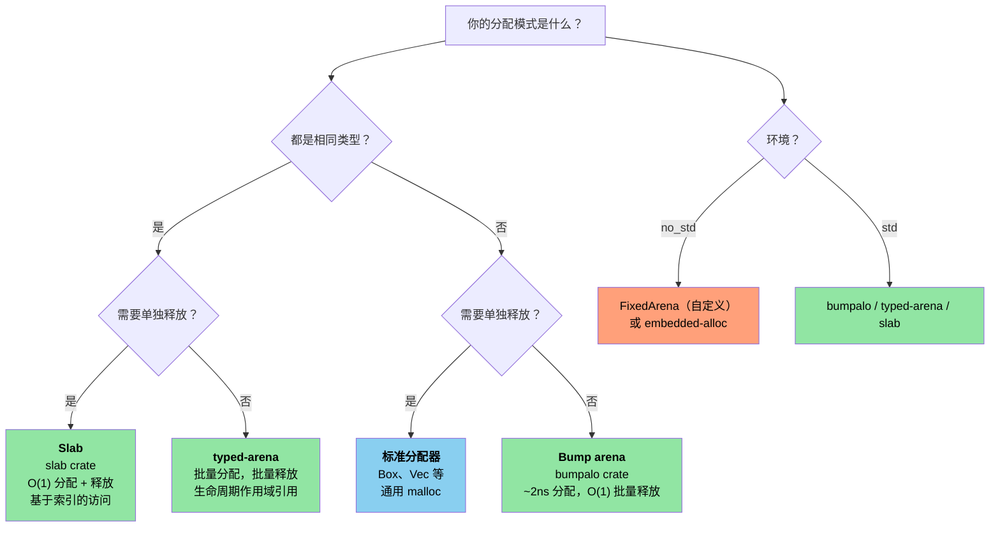

# 12. Unsafe Rust——可控的危险 🔴

> **你将学到：**
> - 五种 unsafe 超能力及各自的使用时机
> - 编写健全的抽象：安全的 API，unsafe 的内部实现
> - 从 Rust 调用 C 的 FFI 模式（以及反向调用）
> - 常见的未定义行为（UB）陷阱与 arena/slab 分配器模式

## 五种 Unsafe 超能力

`unsafe` 解锁了编译器无法验证的五种操作：

```rust
// ============================================================
// 五种 Unsafe 超能力：编译器无法验证的操作
// ============================================================
// unsafe 块解锁 5 类操作，其他 Rust 规则仍然适用（借用检查、类型系统等）：
//   1. 解引用裸指针（*const T / *mut T）
//   2. 调用 unsafe 函数（包括 FFI）
//   3. 访问/修改可变静态变量（static mut）
//   4. 实现 unsafe trait
//   5. 访问 union 字段
// SAFETY: 下面逐一解释每项操作。
unsafe {
    // 1. 解引用裸指针
    // ↓ *const i32 是不可变裸指针类型，指向 i32
    //   它没有生命周期约束、不做空指针检查、不追踪所有权
    let ptr: *const i32 = &42;          // → 从引用自动 coerce 为裸指针
    let value = *ptr; // 可能是悬垂/空指针
    //                ^ 解引用裸指针是 unsafe 操作——编译器无法验证其有效性

    // 2. 调用 unsafe 函数
    // ↓ Layout 描述一块内存的大小和对齐要求
    //   Layout::new::<T>() 签名：fn new() -> Layout，返回适合 T 的布局（const fn）
    let layout = std::alloc::Layout::new::<u64>();
    // ↓ alloc::alloc 签名：unsafe fn alloc(layout: Layout) -> *mut u8
    //   分配未初始化内存，返回裸指针（可能为 null 表示分配失败）
    let mem = std::alloc::alloc(layout);

    // 3. 访问可变静态变量
    // ↓ static mut 是可变的全局变量，多线程访问需 unsafe
    static mut COUNTER: u32 = 0;
    COUNTER += 1; // 多线程访问时会产生数据竞争
    //             ^^^^ 因为编译器无法保证无数据竞争，必须置于 unsafe 中

    // 4. 实现 unsafe trait
    // unsafe impl Send for MyType {}

    // 5. 访问 union 的字段
    // union IntOrFloat { i: i32, f: f32 }
    // let u = IntOrFloat { i: 42 };
    // let f = u.f; // 重新解释位模式——可能是垃圾值
}
```

> **关键原则**：`unsafe` 不会关闭借用检查器或类型系统。
> 它只解锁这五种特定能力。所有其他 Rust 规则仍然适用。

### 编写健全的抽象

`unsafe` 的目的是围绕 unsafe 操作构建**安全的抽象**：

```rust
// ============================================================
// 健全的抽象：StackBuf——unsafe 封装在安全 API 内部
// ============================================================
// 设计哲学：公共 API 全部安全，unsafe 只出现在内部最小作用域。
//   - 使用 MaybeUninit<T> 表示"可能未初始化"的内存
//   - 用 len 字段跟踪已初始化前缀 [0, len)
//   - Drop 时只清理已初始化部分，避免 UB
// 这是 Vec 等容器的内部实现模式。

/// 一个固定容量的栈分配缓冲区。
/// 所有公共方法都是安全的——unsafe 被封装在内部。
pub struct StackBuf<T, const N: usize> {
    // ↓ MaybeUninit<T>：绕过"必须初始化"的规则
    //   它与 T 布局相同，但读取前必须保证已初始化
    //   读取未初始化的 MaybeUninit 是 UB
    data: [std::mem::MaybeUninit<T>; N],
    len: usize,
}

impl<T, const N: usize> StackBuf<T, N> {
    pub fn new() -> Self {
        StackBuf {
            // 每个元素各自是 MaybeUninit——不需要 unsafe。
            // `const { ... }` 块（Rust 1.79+）允许我们将非 Copy
            // 的常量表达式重复 N 次。
            // ↓ MaybeUninit::uninit 签名：fn uninit() -> MaybeUninit<T>
            //   返回未初始化的 MaybeUninit（不触发 UB，因为还没读取）
            data: [const { std::mem::MaybeUninit::uninit() }; N],
            len: 0,
        }
    }

    // ↓ push 签名：fn push(&mut self, value: T) -> Result<(), T>
    //   满时返回 Err(value)——把值"退还"给调用者，无所有权丢失
    pub fn push(&mut self, value: T) -> Result<(), T> {
        if self.len >= N {
            return Err(value); // 缓冲区已满——将值返回给调用者
        }
        // SAFETY: len < N，因此 data[len] 在边界内。
        // 我们向 MaybeUninit 槽位写入一个有效的 T。
        // ↓ MaybeUninit::new 签名：fn new(val: T) -> MaybeUninit<T>
        //   用 value 构造已初始化的 MaybeUninit
        self.data[self.len] = std::mem::MaybeUninit::new(value);
        self.len += 1;
        Ok(())
    }

    // ↓ get 签名：fn get(&self, index: usize) -> Option<&T>
    //   返回对元素的借用引用，越界返回 None
    pub fn get(&self, index: usize) -> Option<&T> {
        if index < self.len {
            // SAFETY: index < len，且 data[0..len] 全部已初始化。
            // ↓ assume_init_ref 签名：unsafe fn assume_init_ref(&self) -> &T
            //   断言此 MaybeUninit 已初始化，返回 &T（unsafe 因为编译器无法验证）
            Some(unsafe { self.data[index].assume_init_ref() })
        } else {
            None
        }
    }
}

// ↓ Drop trait 签名：fn drop(&mut self)
//   当 StackBuf 离开作用域时自动调用，清理资源
impl<T, const N: usize> Drop for StackBuf<T, N> {
    fn drop(&mut self) {
        // SAFETY: data[0..len] 已初始化——正确地逐个 drop。
        for i in 0..self.len {
            // ↓ assume_init_drop 签名：unsafe fn assume_init_drop(&mut self)
            //   原地丢弃已初始化的值（in-place drop），避免 move 出来
            //   对于有析构的类型（如 String）必须调用以避免内存泄漏
            unsafe { self.data[i].assume_init_drop(); }
        }
    }
}
```

**健全 unsafe 代码的三条规则**：
1. **文档化不变量**——每条 `// SAFETY:` 注释解释为什么操作是有效的
2. **封装**——unsafe 位于安全的 API 内部；用户无法触发 UB
3. **最小化**——只有尽可能小的代码块是 `unsafe` 的

### FFI 模式：从 Rust 调用 C

```rust
// ============================================================
// FFI 模式：Rust 与 C 互操作
// ============================================================
// FFI（Foreign Function Interface）的关键要素：
//   - extern "C"：声明 C ABI 函数（调用约定、名称修饰遵循 C 规则）
//   - #[no_mangle]：禁用名称修饰，导出可被 C 链接的符号
//   - 裸指针 *const T / *mut T 对应 C 的 const T* / T*
//   - CString / CStr 处理以 null 结尾的 C 字符串

// 声明 C 函数签名：
// ↓ extern "C" 块声明外部 C 函数，"C" 指定调用约定（参数传递/栈清理规则）
//   块内的函数是 unsafe 的（编译器无法验证签名正确性）
extern "C" {
    // ↓ 签名对应 C 的 size_t strlen(const char* s)
    //   *const c_char 对应 C 的 const char*
    fn strlen(s: *const std::ffi::c_char) -> usize;
    // ↓ 可变参数函数：... 对应 C 的 printf(const char* fmt, ...)
    fn printf(format: *const std::ffi::c_char, ...) -> std::ffi::c_int;
}

// 安全封装：
// ↓ safe_strlen 签名：fn safe_strlen(s: &str) -> usize
//   把 unsafe 的 FFI 调用包裹在安全 API 中
fn safe_strlen(s: &str) -> usize {
    // ↓ CString::new 签名：fn new(t: impl Into<Vec<u8>>) -> Result<CString, NulError>
    //   创建以 null 结尾的 C 字符串；输入含 \0 字节则失败
    let c_string = std::ffi::CString::new(s).expect("string contains null byte");
    // SAFETY: c_string 是有效的以 null 结尾的字符串，在调用期间保持存活。
    // ↓ as_ptr 签名：fn as_ptr(&self) -> *const c_char
    //   返回指向内部 null 结尾字符串的裸指针
    unsafe { strlen(c_string.as_ptr()) }
}

// 从 C 调用 Rust（导出函数）：
// ↓ #[no_mangle] 禁用 Rust 的名称修饰，让 C 链接器能按符号名找到此函数
//   pub extern "C"：用 C ABI 导出，签名可被 C 端识别
#[no_mangle]
pub extern "C" fn rust_add(a: i32, b: i32) -> i32 {
    a + b
}
```

**常见的 FFI 类型**：

| Rust | C | 说明 |
|------|---|-------|
| `i32` / `u32` | `int32_t` / `uint32_t` | 固定宽度，安全 |
| `*const T` / `*mut T` | `const T*` / `T*` | 裸指针 |
| `std::ffi::CStr` | `const char*`（借用） | 以 null 结尾，借用 |
| `std::ffi::CString` | `char*`（拥有） | 以 null 结尾，拥有 |
| `std::ffi::c_void` | `void` | 不透明指针目标 |
| `Option<fn(...)>` | 可空函数指针 | `None` = NULL |

### 常见的未定义行为（UB）陷阱

| 陷阱 | 示例 | 为何是 UB |
|---------|---------|------------|
| 空指针解引用 | `*std::ptr::null::<i32>()` | 解引用空指针始终是 UB |
| 悬垂指针 | `drop()` 后解引用 | 内存可能已被复用 |
| 数据竞争 | 两个线程写入 `static mut` | 未同步的并发写入 |
| 错误的 `assume_init` | `MaybeUninit::<String>::uninit().assume_init()` | 读取未初始化内存。**注意**：`[const { MaybeUninit::uninit() }; N]`（Rust 1.79+）是创建 `MaybeUninit` 数组的安全方式——不需要 `unsafe` 或 `assume_init`（参见上文的 `StackBuf::new()`）。 |
| 别名违规 | 为同一数据创建两个 `&mut` | 违反 Rust 的别名模型 |
| 无效的枚举值 | `std::mem::transmute::<u8, bool>(2)` | `bool` 只能是 0 或 1 |

> **生产环境何时使用 `unsafe`**：
> - FFI 边界（调用 C/C++ 代码）
> - 性能关键的内部循环（避免边界检查）
> - 构建原语（`Vec`、`HashMap`——它们内部使用 unsafe）
> - 应用逻辑中能避免就避免

### 自定义分配器——Arena 与 Slab 模式

在 C 中，你会为特定的分配模式编写自定义 `malloc()` 替代品——一次性释放所有内容的 arena 分配器、用于固定大小对象的 slab 分配器，或用于高吞吐系统的池分配器。Rust 通过 `GlobalAlloc` trait 和分配器 crate 提供了相同的能力，并增加了生命周期作用域的 arena 这一优势，能够**在编译期防止 use-after-free**。

#### Arena 分配器——批量分配，批量释放

Arena 通过向前推进指针来分配。单个对象无法被释放——整个 arena 一次性释放。这非常适合请求作用域或帧作用域的分配：

```rust
// ============================================================
// Arena 分配器：批量分配、批量释放
// ============================================================
// bumpalo::Bump 通过"向前推进指针"分配内存，速度极快（~2ns）。
//   - alloc 返回带 arena 生命周期的引用
//   - 无法单独释放对象，整个 arena 一次性释放
//   - 编译期作用域保证：arena 引用不会逃逸其生命周期（无 use-after-free）

use bumpalo::Bump;

fn process_sensor_frame(raw_data: &[u8]) {
    // 为这一帧的分配创建一个 arena
    // ↓ Bump::new 签名：fn new() -> Bump
    //   创建空 arena（首次 alloc 时分配底层内存块）
    let arena = Bump::new();

    // 在 arena 中分配对象——每个约 2ns（仅推进指针）
    // ↓ Bump::alloc 签名：fn alloc<T>(&self, val: T) -> &mut T
    //   把 val 移入 arena 内存，返回指向它的可变引用
    //   引用生命周期绑定到 arena——arena drop 后引用失效
    let header = arena.alloc(parse_header(raw_data));
    // ↓ alloc_slice_fill_default 签名：fn alloc_slice_fill_default<T: Default>(&self, len: usize) -> &mut [T]
    //   分配长度为 len 的切片，每个元素用 Default::default() 填充
    let readings: &mut [f32] = arena.alloc_slice_fill_default(header.sensor_count);

    // ↓ chunks(4) 把切片按每 4 字节一组迭代；enumerate 提供索引
    for (i, chunk) in raw_data[header.payload_offset..].chunks(4).enumerate() {
        if i < readings.len() {
            // ↓ try_into 尝试把 &[u8] 转成 [u8; 4]，长度不符时返回 Err
            //   f32::from_le_bytes 把 4 字节按小端序组合成 f32
            readings[i] = f32::from_le_bytes(chunk.try_into().unwrap());
        }
    }

    // 使用 readings...
    // ↓ iter() 产生 &f32 引用迭代器；sum::<f32>() 对所有元素求和
    let avg = readings.iter().sum::<f32>() / readings.len() as f32;
    println!("Frame avg: {avg:.2}");

    // `arena` 在此处 drop——所有分配在 O(1) 内一次性释放
    // 无逐对象析构开销，无内存碎片
}
# fn parse_header(_: &[u8]) -> Header { Header { sensor_count: 4, payload_offset: 8 } }
# struct Header { sensor_count: usize, payload_offset: usize }
```

**Arena 与标准分配器对比**：

| 方面 | `Vec::new()` / `Box::new()` | `Bump` arena |
|--------|---------------------------|--------------|
| 分配速度 | ~25ns（malloc） | ~2ns（指针推进） |
| 释放速度 | 逐对象析构 | O(1) 批量释放 |
| 内存碎片 | 有（长时间运行的进程） | arena 内无碎片 |
| 生命周期安全 | 堆——在 `Drop` 时释放 | Arena 引用——编译期作用域 |
| 使用场景 | 通用 | 请求/帧/批处理 |

#### `typed-arena`——类型安全的 Arena

当所有 arena 对象类型相同时，`typed-arena` 提供了更简洁的 API，返回带有 arena 生命周期的引用：

```rust
// ============================================================
// typed-arena：类型安全的 Arena（单类型）
// ============================================================
// 当 arena 只分配单一类型时，typed-arena 提供更简洁的 API。
//   - 返回带 arena 生命周期的引用，编译期防止逃逸
//   - 适合构建 AST、图等自引用数据结构

use typed_arena::Arena;

// ↓ 生命周期 'a 贯穿节点和子节点引用，保证树结构的所有引用同寿
struct AstNode<'a> {
    value: i32,
    children: Vec<&'a AstNode<'a>>,      // → 子节点引用同一 arena 内的节点
}

fn build_tree() {
    // ↓ Arena::new 签名：fn new() -> Arena<T>
    //   创建空 arena，专用于 AstNode 类型
    let arena: Arena<AstNode<'_>> = Arena::new();

    // 分配节点——返回与 arena 生命周期绑定的 &AstNode
    // ↓ typed_arena::Arena::alloc 签名：fn alloc(&self, value: T) -> &mut T
    //   返回值的生命周期绑定到 arena，arena drop 后引用失效
    let root = arena.alloc(AstNode { value: 1, children: vec![] });
    let left = arena.alloc(AstNode { value: 2, children: vec![] });
    let right = arena.alloc(AstNode { value: 3, children: vec![] });

    // 构建树——只要 `arena` 存活，所有引用都有效
    // （对于真正可变的树，可变性访问需要内部可变性）

    println!("Root: {}, Left: {}, Right: {}", root.value, left.value, right.value);

    // `arena` 在此处 drop——所有节点一次性释放
}
```

#### Slab 分配器——固定大小对象池

Slab 分配器预分配一个固定大小槽位的池。对象被单独分配和归还，但所有槽位大小相同——消除了内存碎片并实现了 O(1) 的分配/释放：

```rust
// ============================================================
// Slab 分配器：固定大小对象池
// ============================================================
// slab::Slab 预分配固定大小槽位池，基于索引访问。
//   - insert 返回 key（usize 索引），O(1) 分配
//   - get/get_mut 通过 key 访问，O(1)
//   - remove 归还槽位，下次 insert 复用——无内存碎片
// 类似内核的 kmem_cache，但类型安全。

use slab::Slab;

struct Connection {
    id: u64,
    buffer: [u8; 1024],
    active: bool,
}

fn connection_pool_example() {
    // 为连接预分配一个 slab
    // ↓ Slab::with_capacity 签名：fn with_capacity(capacity: usize) -> Slab<T>
    //   预分配 capacity 个槽位，避免运行时扩容
    let mut connections: Slab<Connection> = Slab::with_capacity(256);

    // insert 返回一个 key（usize 索引）—— O(1)
    // ↓ Slab::insert 签名：fn insert(&mut self, val: T) -> usize
    //   插入值并返回其 key（槽位索引）
    let key1 = connections.insert(Connection {
        id: 1001,
        buffer: [0; 1024],
        active: true,
    });

    let key2 = connections.insert(Connection {
        id: 1002,
        buffer: [0; 1024],
        active: true,
    });

    // 通过 key 访问—— O(1)
    // ↓ get_mut 签名：fn get_mut(&self, key: usize) -> Option<&mut T>
    //   返回可变引用，key 无效时返回 None
    if let Some(conn) = connections.get_mut(key1) {
        // ↓ copy_from_slice 签名：fn copy_from_slice(&mut self, src: &[u8])
        //   要求源和目标长度相同，逐字节拷贝
        conn.buffer[0..5].copy_from_slice(b"hello");
    }

    // remove 返回值—— O(1)，槽位被下次 insert 复用
    // ↓ Slab::remove 签名：fn remove(&mut self, key: usize) -> T
    //   移除并返回值，标记槽位为空闲
    let removed = connections.remove(key2);
    assert_eq!(removed.id, 1002);

    // 下次 insert 复用已释放的槽位——无内存碎片
    let key3 = connections.insert(Connection {
        id: 1003,
        buffer: [0; 1024],
        active: true,
    });
    assert_eq!(key3, key2); // 复用了同一个槽位！
}
```

#### 实现最小化 Arena（用于 `no_std`）

对于无法引入 `bumpalo` 的裸机环境，以下是一个基于 `unsafe` 构建的最小化 arena：

```rust
// ============================================================
// 最小化 Arena：no_std 环境下的手写 bump 分配器
// ============================================================
// 这个示例展示了 arena 分配器的底层实现原理。
//   - 用 UnsafeCell 提供"通过 &self 修改内部"的能力（内部可变性）
//   - 用 Cell 存储可变游标（offset）
//   - 用裸指针 + ptr::write 完成实际分配
// ⚠️ 这是教学示例，生产环境请用 bumpalo。

// ↓ cfg_attr：条件编译属性。not(test) 且非测试时启用 no_std（不链接 std）
#![cfg_attr(not(test), no_std)]

// ↓ Layout 描述内存布局（大小 + 对齐），用于分配器
use core::alloc::Layout;
// ↓ Cell：单线程内部可变性（Copy 类型，如 usize）
//   UnsafeCell：内部可变性的原语（通过 &self 获取 *mut T 的唯一合法途径）
use core::cell::{Cell, UnsafeCell};

/// 一个由固定大小字节数组支持的简单 bump 分配器。
/// 非线程安全——在多线程环境中应使用每核独立实例或加锁。
///
/// **重要**：与 `bumpalo` 一样，该 arena 在 drop 时不会调用
/// 已分配项的析构函数。实现了 `Drop` 的类型会泄漏其资源
/// （文件句柄、套接字等）。仅分配没有有意义 `Drop` 实现的类型，
/// 或者在 arena 释放前手动 drop 它们。
pub struct FixedArena<const N: usize> {
    // 此处必须使用 UnsafeCell：我们通过 &self 来修改 buf。
    // 没有 UnsafeCell，将 &self.buf 转换为 *mut u8 将是 UB
    // （违反 Rust 的别名模型——共享引用意味着不可变）。
    // ↓ UnsafeCell<[u8; N]>：编译器知道此内存可能被别名修改
    buf: UnsafeCell<[u8; N]>,
    // ↓ Cell<usize>：用 set/get 修改游标，无需 &mut self
    offset: Cell<usize>, // 为 &self 分配提供内部可变性
}

impl<const N: usize> FixedArena<N> {
    // ↓ const fn：可在编译期/const 上下文调用
    pub const fn new() -> Self {
        FixedArena {
            // ↓ UnsafeCell::new 签名：fn new(value: T) -> UnsafeCell<T>
            buf: UnsafeCell::new([0; N]),
            // ↓ Cell::new 签名：fn new(value: T) -> Cell<T>
            offset: Cell::new(0),
        }
    }

    /// 在 arena 中分配一个 `T`。空间不足时返回 `None`。
    // ↓ 泛型 fn alloc<T>：可分配任意类型 T
    //   签名：fn alloc<T>(&self, value: T) -> Option<&mut T>
    //   返回的引用生命周期绑定到 &self
    pub fn alloc<T>(&self, value: T) -> Option<&mut T> {
        // ↓ Layout::new::<T> 签名：fn new() -> Layout（const fn）
        //   返回适合 T 的大小和对齐
        let layout = Layout::new::<T>();
        // ↓ Cell::get 签名：fn get(&self) -> T（要求 T: Copy）
        //   读取当前游标位置
        let current = self.offset.get();

        // 对齐向上取整
        // ↓ 位运算：把 current 向上对齐到 layout.align() 的倍数
        //   原理：(x + a - 1) & !(a - 1)，其中 a 是 2 的幂
        let aligned = (current + layout.align() - 1) & !(layout.align() - 1);
        let new_offset = aligned + layout.size();

        if new_offset > N {
            return None; // Arena 已满
        }

        // ↓ Cell::set 签名：fn set(&self, val: T)
        //   更新游标到新位置
        self.offset.set(new_offset);

        // SAFETY:
        // - `aligned` 在 `buf` 边界内（上面已检查）
        // - 对齐正确（按 T 的要求对齐）
        // - 无别名：每次 alloc 返回唯一的、不重叠的区域
        // - UnsafeCell 授权通过 &self 进行修改
        // - arena 的生命周期长于返回的引用（调用者须保证）
        let ptr = unsafe {
            // ↓ UnsafeCell::get 签名：fn get(&self) -> *mut T
            //   返回内部数据的裸指针（这是内部可变性的入口）
            let base = (self.buf.get() as *mut u8).add(aligned);
            //      ^^^^                             ^^^
            //      转为字节指针                    ptr::add 按字节偏移（指针运算）
            let typed = base as *mut T;     // → 重解释为 T 指针
            // ↓ ptr::write 签名：unsafe fn write<T>(dst: *mut T, src: T)
            //   把 value 写入未初始化内存，不读取旧值（不会 double-drop）
            typed.write(value);
            &mut *typed                    // → 转换裸指针为可变引用
        };

        Some(ptr)
    }

    /// 重置 arena——使所有先前的分配失效。
    ///
    /// # Safety
    /// 调用者必须确保不存在对 arena 已分配数据的引用。
    // ↓ unsafe fn：调用者需保证安全契约（无悬挂引用）
    pub unsafe fn reset(&self) {
        self.offset.set(0);
    }

    pub fn used(&self) -> usize {
        self.offset.get()
    }

    pub fn remaining(&self) -> usize {
        N - self.offset.get()
    }
}
```

#### 选择分配器策略

> **注意**：下图使用 Mermaid 语法。它在 GitHub 和支持 Mermaid 的工具中渲染
> （带 `mermaid` 插件的 mdBook、带 Mermaid 扩展的 VS Code）。在纯 Markdown 查看器中，
> 你会看到原始源码。



| C 模式 | Rust 等价物 | 关键优势 |
|-----------|----------------|---------------|
| 自定义 `malloc()` 池 | `#[global_allocator]` 实现 | 类型安全、可调试 |
| `obstack`（GNU） | `bumpalo::Bump` | 生命周期作用域、无 use-after-free |
| 内核 slab（`kmem_cache`） | `slab::Slab<T>` | 类型安全、基于索引 |
| 栈分配临时缓冲区 | `FixedArena<N>`（上文） | 无堆、可 `const` 构造 |
| `alloca()` | `[T; N]` 或 `SmallVec` | 编译期确定大小、无 UB |

> **交叉引用**：关于裸机分配器设置（`embedded-alloc` 的 `#[global_allocator]`），
> 请参阅《面向 C 程序员的 Rust 培训》第 15.1 章"全局分配器设置"，该章涵盖了
> 嵌入式特定的引导启动。

> **关键要点——Unsafe Rust**
> - 文档化不变量（`SAFETY:` 注释），封装在安全 API 之后，最小化 unsafe 作用域
> - `[const { MaybeUninit::uninit() }; N]`（Rust 1.79+）取代了旧的 `assume_init` 反模式
> - FFI 需要 `extern "C"`、`#[repr(C)]` 以及仔细的空指针/生命周期处理
> - Arena 和 slab 分配器以通用灵活性换取分配速度

> **另请参阅：**[第 4 章——PhantomData](ch04-phantomdata-types-that-carry-no-data.md)了解变体（variance）和 drop 检查与 unsafe 代码的交互。[第 8 章——智能指针](ch09-smart-pointers-and-interior-mutability.md)了解 Pin 和自引用类型。

---

### 练习：围绕 Unsafe 的安全封装 ★★★（约 45 分钟）

编写一个 `FixedVec<T, const N: usize>`——固定容量、栈分配的向量。
要求：
- `push(&mut self, value: T) -> Result<(), T>` 在满时返回 `Err(value)`
- `pop(&mut self) -> Option<T>` 返回并移除最后一个元素
- `as_slice(&self) -> &[T]` 借用已初始化的元素
- 所有公共方法必须是安全的；所有 unsafe 必须封装并带有 `SAFETY:` 注释
- `Drop` 必须清理已初始化的元素

<details>
<summary>🔑 解答</summary>

```rust
// ============================================================
// 练习解答：FixedVec——栈分配的固定容量向量
// ============================================================
// 这是 Vec 的简化版，演示 MaybeUninit + unsafe 的标准模式：
//   - data 数组用 MaybeUninit 表示"部分初始化"
//   - len 跟踪已初始化前缀 [0, len)
//   - push 写入新元素，pop 读出并转移所有权
//   - as_slice 用 from_raw_parts 把 MaybeUninit 切片重解释为 T 切片
//   - Drop 逐个清理已初始化元素

use std::mem::MaybeUninit;

pub struct FixedVec<T, const N: usize> {
    data: [MaybeUninit<T>; N],           // → 每个槽位可能未初始化
    len: usize,
}

impl<T, const N: usize> FixedVec<T, N> {
    pub fn new() -> Self {
        FixedVec {
            // ↓ [const { MaybeUninit::uninit() }; N]（Rust 1.79+）
            //   安全地创建 N 个未初始化的 MaybeUninit，无需 unsafe
            data: [const { MaybeUninit::uninit() }; N],
            len: 0,
        }
    }

    pub fn push(&mut self, value: T) -> Result<(), T> {
        if self.len >= N { return Err(value); }
        // SAFETY: len < N，因此 data[len] 在边界内。
        // ↓ MaybeUninit::new 签名：fn new(val: T) -> MaybeUninit<T>
        //   用 value 构造已初始化的槽位
        self.data[self.len] = MaybeUninit::new(value);
        self.len += 1;
        Ok(())
    }

    pub fn pop(&mut self) -> Option<T> {
        if self.len == 0 { return None; }
        self.len -= 1;
        // SAFETY: data[len] 已初始化（递减前 len > 0）。
        // ↓ assume_init_read 签名：unsafe fn assume_init_read(&self) -> T
        //   读取并 move 出值（不置空），调用者负责不再重复读取该槽位
        //   与 assume_init_ref（返回引用）不同，这里转移所有权
        Some(unsafe { self.data[self.len].assume_init_read() })
    }

    pub fn as_slice(&self) -> &[T] {
        // SAFETY: data[0..len] 全部已初始化，且 MaybeUninit<T>
        // 与 T 具有相同的内存布局。
        // ↓ slice::from_raw_parts 签名：unsafe fn from_raw_parts<T>(data: *const T, len: usize) -> &'static [T]
        //   从裸指针 + 长度构造切片（unsafe：需保证指针有效、长度正确、数据已初始化）
        // ↓ as_ptr 返回 MaybeUninit<T> 指针，as *const T 重解释（布局相同，合法）
        unsafe { std::slice::from_raw_parts(self.data.as_ptr() as *const T, self.len) }
    }

    pub fn len(&self) -> usize { self.len }
    pub fn is_empty(&self) -> bool { self.len == 0 }
}

// ↓ Drop：清理已初始化的元素，避免资源泄漏（如 String 的堆内存）
impl<T, const N: usize> Drop for FixedVec<T, N> {
    fn drop(&mut self) {
        // SAFETY: data[0..len] 已初始化——逐个 drop。
        for i in 0..self.len {
            // ↓ assume_init_drop 签名：unsafe fn assume_init_drop(&mut self)
            //   原地丢弃已初始化值，避免 move 出来的开销
            unsafe { self.data[i].assume_init_drop(); }
        }
    }
}

fn main() {
    let mut v = FixedVec::<String, 4>::new();
    // ↓ String::from(&str) 的简写（Into 自动转换）
    v.push("hello".into()).unwrap();
    v.push("world".into()).unwrap();
    assert_eq!(v.as_slice(), &["hello", "world"]);
    // ↓ pop 返回 Some(String)，转移所有权
    assert_eq!(v.pop(), Some("world".into()));
    assert_eq!(v.len(), 1);
}
```

</details>

***
