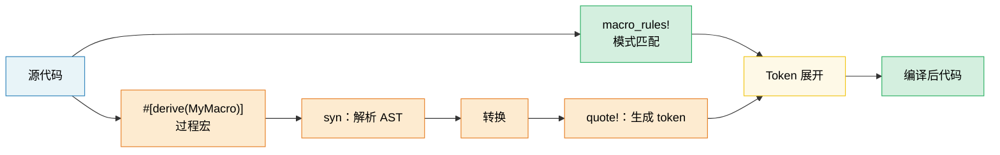

# 13. 宏——编写代码的代码 🟡

> **你将学到：**
> - 声明式宏（`macro_rules!`），包括模式匹配与重复
> - 宏与泛型/trait 相比，何时是正确的工具
> - 过程宏（procedural macros）：派生宏、属性宏和函数式宏
> - 使用 `syn` 和 `quote` 编写自定义派生宏

## 声明式宏（macro_rules!）

宏在语法上进行模式匹配，并在编译期展开为代码：

```rust
// ============================================================
// 声明式宏入门：hashmap! 宏的剖析
// ============================================================
// macro_rules! 定义一个"模式匹配 + 展开"的宏。
//   - 宏在编译期展开，操作的是 token（语法树片段），不是运行时值
//   - 模式按顺序匹配，第一个匹配成功的规则生效
//   - $name 绑定语法片段，$name:类型 指定片段类型

// 一个简单的创建 HashMap 的宏
// ↓ macro_rules! 是定义声明式宏的关键字，hashmap 是宏名
macro_rules! hashmap {
    // ↓ 匹配臂：（模式）=> { 展开体 }
    //   $( ... ),*  → 重复匹配，以逗号分隔，零次或多次
    //   $key:expr   → 绑定一个表达式（expr 片段类型）到 $key
    //   $value:expr → 绑定一个表达式到 $value
    //   $(,)?       → 允许可选的尾随逗号
    ( $( $key:expr => $value:expr ),* $(,)? ) => {
        {
            let mut map = std::collections::HashMap::new();
            // ↓ $( ... )* → 对匹配到的每个 $key/$value 重复展开此语句
            //   map.insert($key, $value); 会重复 N 次
            $( map.insert($key, $value); )*
            map        // → 块表达式的值：返回构造好的 map
        }
    };
}

let scores = hashmap! {
    "Alice" => 95,
    "Bob" => 87,
    "Carol" => 92,
};
// 展开为：
// let mut map = HashMap::new();
// map.insert("Alice", 95);
// map.insert("Bob", 87);
// map.insert("Carol", 92);
// map
```

**宏片段类型**：

| 片段 | 匹配 | 示例 |
|----------|---------|---------|
| `$x:expr` | 任意表达式 | `42`, `a + b`, `foo()` |
| `$x:ty` | 一个类型 | `i32`, `Vec<String>` |
| `$x:ident` | 一个标识符 | `my_var`, `Config` |
| `$x:pat` | 一个模式 | `Some(x)`, `_` |
| `$x:stmt` | 一条语句 | `let x = 5;` |
| `$x:tt` | 单个 token 树 | 任何内容（最灵活） |
| `$x:literal` | 一个字面量 | `42`, `"hello"`, `true` |

**重复**：`$( ... ),*` 表示"零个或多个，以逗号分隔"

```rust
// ============================================================
// 重复展开进阶：用宏批量生成测试函数
// ============================================================
// 这个宏把"测试名: 输入 => 期望"的声明式描述，展开成多个 #[test] 函数。
//   - $name:ident 绑定标识符（这里是函数名）
//   - 每个匹配项展开成一个独立的 test 函数

// 自动生成测试函数
macro_rules! test_cases {
    // ↓ 模式：$name:ident 绑定函数名标识符，$input/$expected 绑定表达式
    //   ident 片段类型匹配标识符（如 test_hello），不能匹配路径如 std::io
    ( $( $name:ident: $input:expr => $expected:expr ),* $(,)? ) => {
        // ↓ $( ... )* 对每个匹配项重复展开整个 #[test] fn 块
        $(
            // ↓ #[test] 是属性宏，标记此函数为测试用例
            #[test]
            // ↓ $name 在此处插值为函数名（如 test_hello）
            fn $name() {
                // ↓ assert_eq! 宏签名：assert_eq!(left, right)，断言两值相等
                //   $input 和 $expected 在此处插值
                assert_eq!(process($input), $expected);
            }
        )*
    };
}

test_cases! {
    test_empty: "" => "",
    test_hello: "hello" => "HELLO",
    test_trim: "  spaces  " => "SPACES",
}
// 生成三个独立的 #[test] 函数
```

### 何时（不）使用宏

**在以下情况使用宏**：
- 减少 trait/泛型无法处理的样板代码（可变参数、DRY 测试生成）
- 创建 DSL（`html!`、`sql!`、`vec!`）
- 条件代码生成（`cfg!`、`compile_error!`）

**在以下情况不要使用宏**：
- 函数或泛型就能工作时（宏更难调试，自动补全也不起作用）
- 你需要在宏内部进行类型检查（宏操作的是 token，而非类型）
- 模式只用一两次（不值得付出抽象成本）

```rust
// ❌ 不必要的宏——函数就够了：
// ↓ 这个宏只是把 $x 翻倍，完全可以用普通函数替代
//   宏的缺点：难调试、IDE 补全差、错误信息晦涩
macro_rules! double {
    ($x:expr) => { $x * 2 };        // → 单个表达式片段，展开为乘法
}

// ✅ 直接用函数即可：
// ↓ 普通函数：类型安全、可调试、可被 IDE 理解
//   签名：fn double(x: i32) -> i32
fn double(x: i32) -> i32 { x * 2 }

// ✅ 好的宏用法——可变参数，无法用函数实现：
// ↓ println! 必须是宏，因为：
//   1. 参数数量可变（函数的参数数量固定）
//   2. 格式串在编译期做类型检查（宏能访问 token）
//   3. $($arg:tt)* 匹配任意数量的 token 树
macro_rules! println {
    ($($arg:tt)*) => { /* format string + args */ };
}
```

### 过程宏概述

过程宏是转换 token 流的 Rust 函数。它们需要一个单独的 crate，并设置 `proc-macro = true`：

```rust
// ============================================================
// 过程宏概述：派生宏、属性宏、函数式宏
// ============================================================
// 过程宏（procedural macros）是接收 TokenStream、返回 TokenStream 的 Rust 函数。
// 它们运行在编译期，能任意变换代码。必须在独立 crate（proc-macro = true）中定义。

// 三种过程宏：

// 1. 派生宏 — #[derive(MyTrait)]
// 从结构体定义生成 trait 实现
// ↓ #[derive(...)] 接收多个派生宏，依次为 Config 生成对应 impl
//   Debug/Clone 来自 std；Serialize/Deserialize 来自 serde
#[derive(Debug, Clone, Serialize, Deserialize)]
struct Config {
    name: String,
    port: u16,
}

// 2. 属性宏 — #[my_attribute]
// 转换被标注的条目
// ↓ #[route(...)] 是属性宏，接收参数并改写被标注的 async fn
//   典型用途：web 框架的路由注册（actix/axum 风格）
#[route(GET, "/api/users")]
async fn list_users() -> Json<Vec<User>> { /* ... */ }

// 3. 函数式宏 — my_macro!(...)
// 自定义语法
// ↓ sql!(...) 是函数式宏，接收自定义 SQL 语法（非 Rust 语法）
//   可以在编译期解析 SQL 并生成类型安全的查询代码
let query = sql!(SELECT * FROM users WHERE id = ?);
```

### 派生宏实践

最常见的 proc 宏类型。以下是 `#[derive(Debug)]` 在概念上是如何工作的：

```rust
// ============================================================
// 派生宏的工作原理：#[derive(Debug)] 生成了什么
// ============================================================
// 派生宏读取结构体定义，自动生成 trait 实现。
// 下面展示 #[derive(Debug)] 概念上的展开结果。

// 输入（你的结构体）：
// ↓ #[derive(Debug)] 让编译器为 Point 调用 Debug 派生宏
#[derive(Debug)]
struct Point {
    x: f64,
    y: f64,
}

// 派生宏生成：
// ↓ 为 Point 实现 std::fmt::Debug trait
//   Debug trait 签名：fn fmt(&self, f: &mut Formatter<'_>) -> Result
//   f 是格式化输出器，返回 fmt::Result 表示成功/失败
impl std::fmt::Debug for Point {
    fn fmt(&self, f: &mut std::fmt::Formatter<'_>) -> std::fmt::Result {
        // ↓ debug_struct 返回一个 DebugStruct 构建器，用于输出 "Name { field: value, ... }" 格式
        f.debug_struct("Point")
            // ↓ field 签名：fn field(&mut self, name: &str, value: &dyn Debug) -> &mut Self
            //   链式调用，逐个添加字段
            .field("x", &self.x)
            .field("y", &self.y)
            // ↓ finish 完成构建并写出结尾的 "}"
            .finish()
    }
}
```

**常用的派生宏**：

| 派生 | Crate | 生成内容 |
|--------|-------|-------------------|
| `Debug` | std | `fmt::Debug` 实现（调试打印） |
| `Clone`、`Copy` | std | 值复制 |
| `PartialEq`、`Eq` | std | 相等性比较 |
| `Hash` | std | 用于 HashMap 键的哈希 |
| `Serialize`、`Deserialize` | serde | JSON/YAML 等编码 |
| `Error` | thiserror | `std::error::Error` + `Display` |
| `Parser` | `clap` | CLI 参数解析 |
| `Builder` | derive_builder | 构建器模式 |

> **实用建议**：大胆使用派生宏——它们消除了容易出错的样板代码。编写自己的
> proc 宏是一个高级主题；在构建自定义宏之前，先使用现有的（`serde`、
> `thiserror`、`clap`）。

### 宏的卫生性与 `$crate`

**卫生性（Hygiene）**意味着宏内部创建的标识符不会与调用者作用域中的标识符冲突。Rust 的 `macro_rules!` 是*部分*卫生的：

```rust
// ============================================================
// 宏的卫生性（Hygiene）：宏内标识符不会污染调用者作用域
// ============================================================
// "卫生"意味着宏内部 let 绑定的变量与调用者作用域的同名变量是不同的。
// 这避免了意外的变量捕获/冲突，是 Rust 宏的安全特性。

// ↓ make_var! 内部定义的 'x' 与调用处的 'x' 处于不同的"卫生上下文"
macro_rules! make_var {
    () => {
        let x = 42; // 这个 'x' 在宏的作用域中
    };
}

fn main() {
    let x = 10;
    // ↓ 宏展开引入的 x 是"卫生的"——与外面的 x = 10 是两个不同的绑定
    make_var!();   // 创建了一个不同的 'x'（卫生的）
    // ↓ 这里引用的是 main 中定义的 x = 10，而非宏内的 x = 42
    println!("{x}"); // 打印 10，而非 42——宏的 x 不会泄漏
}
```

**`$crate`**：在库中编写宏时，使用 `$crate` 引用你自己的 crate——无论用户如何导入你的 crate，它都能正确解析：

```rust
// ============================================================
// $crate：卫生地引用宏所在的 crate
// ============================================================
// $crate 是一个特殊元变量，展开为宏定义所在的 crate 路径。
// 即使用户在 Cargo.toml 中用 package = "..." 重命名了 crate，
// $crate 仍能正确解析，避免硬编码 crate 名导致的链接失败。

// 在 my_diagnostics crate 中：

// ↓ 普通函数，供宏调用
pub fn log_result(msg: &str) {
    println!("[diag] {msg}");
}

// ↓ #[macro_export] 把宏导出到 crate 根，使其可被外部 use
//   宏在导出后，$crate 才有意义（指向此 crate）
#[macro_export]
macro_rules! diag_log {
    // ↓ $($arg:tt)* 匹配任意数量的 token 树（"接受一切"模式）
    ($($arg:tt)*) => {
        // ✅ $crate 总是解析为 my_diagnostics，即使用户
        // 在 Cargo.toml 中重命名了该 crate
        // ↓ $crate::log_result 在用户 crate 中展开为 my_diagnostics::log_result
        //   format!($($arg)*) 把 token 展开为格式化字符串（类似 println! 的参数）
        $crate::log_result(&format!($($arg)*))
    };
}

// ❌ 不使用 $crate：
// my_diagnostics::log_result(...)  ← 在用户如下配置时会失效：
//   [dependencies]
//   diag = { package = "my_diagnostics", version = "1" }
```

> **规则**：在 `#[macro_export]` 宏中始终使用 `$crate::`。永远不要直接使用
> 你的 crate 名称。

### 递归宏与 `tt` 消化

递归宏一次处理一个 token——这种技术称为 **`tt` 消化**（token-tree munching）：

```rust
// ============================================================
// 递归宏与 tt 消化（token-tree munching）
// ============================================================
// "tt 消化"是一种递归宏技术：每次调用消费一个 token，把剩余的传给自己。
//   - 基本情况：没有剩余 token，返回终止值
//   - 递归情况：消费 head，把 tail 递归传给同一宏
// 编译器会展开多层递归，直到基本情况。

// 统计传递给宏的表达式数量
macro_rules! count {
    // ↓ 基本情况：空输入，展开为字面量 0usize
    () => { 0usize };
    // ↓ 递归情况：$head 绑定第一个表达式，$tail 绑定剩余（可能为空）
    //   $head:expr 匹配一个表达式；$(, $tail:expr)* 匹配后续逗号分隔的表达式
    ($head:expr $(, $tail:expr)* $(,)?) => {
        // ↓ 1usize + count!(剩余) —— 递归调用自己
        //   $($tail),* 把 tail 重新组装成逗号分隔列表传给 count!
        1usize + count!($($tail),*)
    };
}

fn main() {
    // ↓ count!("a","b","c","d") 展开为 1 + (1 + (1 + (1 + 0))) = 4
    let n = count!("a", "b", "c", "d");
    assert_eq!(n, 4);

    // 也可以在编译期使用：
    // ↓ const 求值：宏展开发生在编译期，结果可用于 const 上下文
    const N: usize = count!(1, 2, 3);
    assert_eq!(N, 3);
}
```

```rust
// ============================================================
// tt 消化进阶：构建嵌套元组
// ============================================================
// 这个宏用 tt 消化把多个表达式组装成嵌套元组。
//   - 注意用 ),+ （至少一个）而非 ),*（零个或多个），确保至少两个元素才递归
//   - 单元素时走基本情况，构造单元素元组 (x,)

// 从表达式列表构建异构元组：
macro_rules! tuple_from {
    // ↓ 基本情况：单个表达式（可选尾随逗号），展开为单元素元组
    //   ($single,) 的小括号是元组语法，尾随逗号区分单元素元组与括号表达式
    ($single:expr $(,)?) => { ($single,) };
    // ↓ 递归情况：$head + 至少一个 $tail（,+ 表示一次或多次）
    //   把 head 放在元组首位，tail 递归构造为嵌套元组
    ($head:expr, $($tail:expr),+ $(,)?) => {
        // ↓ 递归：tail 部分再次传入 tuple_from!
        ($head, tuple_from!($($tail),+))
    };
}

let t = tuple_from!(1, "hello", 3.14, true);
// 展开为：(1, ("hello", (3.14, (true,))))
```

**片段说明符的细微之处**：

| 片段 | 注意事项 |
|----------|--------|
| `$x:expr` | 贪婪解析——`1 + 2` 是一个表达式，不是三个 token |
| `$x:ty` | 贪婪解析——`Vec<String>` 是一个类型；后面不能跟 `+` 或 `<` |
| `$x:tt` | 精确匹配一个 token 树——最灵活，检查最少 |
| `$x:ident` | 仅匹配普通标识符——不能是 `std::io` 这样的路径 |
| `$x:pat` | 在 Rust 2021 中，匹配 `A \| B` 模式；对单一模式使用 `$x:pat_param` |

> **何时使用 `tt`**：当你需要将 token 转发给另一个宏而不受解析器约束时。
> `$($args:tt)*` 是"接受一切"的模式（被 `println!`、`format!`、`vec!` 使用）。

### 使用 `syn` 和 `quote` 编写派生宏

派生宏位于单独的 crate（`proc-macro = true`）中，使用 `syn`（解析 Rust）和 `quote`（生成 Rust）来转换 token 流：

```toml
# my_derive/Cargo.toml
[lib]
proc-macro = true

[dependencies]
syn = { version = "2", features = ["full"] }
quote = "1"
proc-macro2 = "1"
```

```rust
// my_derive/src/lib.rs
// ============================================================
// 手写派生宏：用 syn 解析、quote 生成
// ============================================================
// 派生宏的标准工作流程：
//   TokenStream（原始 token）→ syn::parse（AST）→ 检查/转换 → quote!（生成 token）→ TokenStream（返回）
//   - syn：把 Rust 源码解析为可遍历的 AST（如 DeriveInput）
//   - quote!：用模板语法生成 Rust 代码 token，#var 做插值
//   - proc_macro：编译器提供的 TokenStream 类型接口

// ↓ TokenStream 是过程宏的输入/输出类型（编译器提供的 token 序列）
use proc_macro::TokenStream;
// ↓ quote! 宏：把模板代码转为 TokenStream，#var 插值变量
use quote::quote;
// ↓ parse_macro_input! 宏：把 TokenStream 解析为指定的 syn 类型
//   DeriveInput：派生宏输入的 AST（包含 struct/enum 的完整信息）
use syn::{parse_macro_input, DeriveInput};

/// 派生宏，生成一个返回结构体名称和字段名的 `describe()` 方法
// ↓ #[proc_macro_derive(Describe)] 标记此函数为派生宏
//   #[derive(Describe)] 会调用 derive_describe
//   函数签名固定：fn derive_describe(input: TokenStream) -> TokenStream
#[proc_macro_derive(Describe)]
pub fn derive_describe(input: TokenStream) -> TokenStream {
    // ↓ parse_macro_input!(input as DeriveInput) 把 token 流解析为 DeriveInput
    //   解析失败时自动返回编译错误（宏内部帮您处理 Err）
    let input = parse_macro_input!(input as DeriveInput);
    // ↓ input.ident 是结构体/枚举的名字（如 Point），类型是 syn::Ident
    let name = &input.ident;
    // ↓ Ident::to_string 把标识符转为字符串（如 "Point"）
    let name_str = name.to_string();

    // 提取字段名（仅适用于具名字段的结构体）
    // ↓ input.data 是枚举 Data（Struct/Enum/Union），用 match 区分
    let fields = match &input.data {
        syn::Data::Struct(data) => {
            // ↓ data.fields.iter() 遍历字段；filter_map 跳过 None（元组字段无 ident）
            data.fields.iter()
                // ↓ f.ident 是 Option<Ident>，元组结构体字段为 None
                .filter_map(|f| f.ident.as_ref())
                // ↓ id.to_string() 把字段标识符转为字符串
                .map(|id| id.to_string())
                // ↓ collect::<Vec<_>> 收集为字符串向量
                .collect::<Vec<_>>()
        }
        _ => vec![],   // → 枚举/union 无具名字段，返回空
    };

    // ↓ Vec::join 用 ", " 连接所有字段名
    let field_list = fields.join(", ");

    // ↓ quote! { ... } 生成 TokenStream，#name/#name_str/#field_list 是插值变量
    //   插值的变量需实现 ToTokens（syn 类型都实现了）
    let expanded = quote! {
        // ↓ #name 在此处插值为结构体名（Ident），生成 impl Point { ... }
        impl #name {
            pub fn describe() -> String {
                // ↓ #name_str/#field_list 插值为字符串字面量
                //   quote! 会自动把它们作为 &str 转为字符串字面量 token
                format!("{} {{ {} }}", #name_str, #field_list)
            }
        }
    };

    // ↓ TokenStream::from 把 proc_macro2::TokenStream 转为编译器的 TokenStream
    //   返回给编译器，作为派生宏的展开结果
    TokenStream::from(expanded)
}
```

```rust
// 在应用 crate 中：
// ↓ use my_derive::Describe 导入我们写的派生宏 trait
use my_derive::Describe;

// ↓ #[derive(Describe)] 触发 derive_describe 函数，为 SensorReading 生成 describe() 方法
#[derive(Describe)]
struct SensorReading {
    sensor_id: u16,
    value: f64,
    timestamp: u64,
}

fn main() {
    // ↓ SensorReading::describe() 是派生宏生成的关联函数（无 self 参数）
    //   返回 String，格式为 "结构体名 { 字段1, 字段2, ... }"
    println!("{}", SensorReading::describe());
    // "SensorReading { sensor_id, value, timestamp }"
}
```

**工作流程**：`TokenStream`（原始 token）→ `syn::parse`（AST）→
检查/转换 → `quote!`（生成 token）→ `TokenStream`（返回编译器）。

| Crate | 角色 | 关键类型 |
|-------|------|-----------|
| `proc-macro` | 编译器接口 | `TokenStream` |
| `syn` | 将 Rust 源码解析为 AST | `DeriveInput`、`ItemFn`、`Type` |
| `quote` | 从模板生成 Rust token | `quote!{}`、`#variable` 插值 |
| `proc-macro2` | syn/quote 与 proc-macro 之间的桥梁 | `TokenStream`、`Span` |

> **实用技巧**：在编写自己的宏之前，先研究像 `thiserror` 或 `derive_more` 这样
> 简单的派生宏源码。`cargo expand` 命令（通过 `cargo-expand`）能展示任何宏展开后的
> 结果——对调试极有帮助。

> **关键要点——宏**
> - 简单代码生成用 `macro_rules!`；复杂的派生用 proc 宏（`syn` + `quote`）
> - 尽可能优先使用泛型/trait 而非宏——宏更难调试和维护
> - `$crate` 确保卫生性；`tt` 消化实现递归模式匹配

> **另请参阅：**[第 2 章——Trait](ch02-traits-in-depth.md)了解 trait/泛型何时优于宏。[第 13 章——测试](ch14-testing-and-benchmarking-patterns.md)了解如何测试宏生成的代码。



---

### 练习：声明式宏——`map!` ★（约 15 分钟）

编写一个 `map!` 宏，从键值对创建 `HashMap`：

```rust,ignore
let m = map! {
    "host" => "localhost",
    "port" => "8080",
};
assert_eq!(m.get("host"), Some(&"localhost"));
```

要求：支持尾随逗号和空调用 `map!{}`。

<details>
<summary>🔑 解答</summary>

```rust
// ============================================================
// 练习解答：map! 宏——从键值对创建 HashMap
// ============================================================
// 这个宏演示两个匹配臂：
//   - 空调用 () 返回空 HashMap
//   - 非空输入用 ),+ （至少一个键值对）匹配
// 双花括号 {{ }} 确保展开结果是一个块表达式。

macro_rules! map {
    // ↓ 基本情况：空调用 map!{}，直接返回空 HashMap
    //   HashMap::new 签名：fn new() -> HashMap<K, V>
    () => { std::collections::HashMap::new() };
    // ↓ 非空情况：至少一个键值对（,+ 表示一次或多次）
    //   {{ }} 外层花括号是宏语法，内层 {{ }} 让展开体成为块表达式
    ( $( $key:expr => $val:expr ),+ $(,)? ) => {{
        let mut m = std::collections::HashMap::new();
        // ↓ $( ... )+ 对每个键值对重复展开 insert 调用
        //   HashMap::insert 签名：fn insert(&mut self, k: K, v: V) -> Option<V>
        $( m.insert($key, $val); )+
        m       // → 块表达式返回构造好的 HashMap
    }};
}

fn main() {
    let config = map! {
        "host" => "localhost",
        "port" => "8080",
        "timeout" => "30",
    };
    // ↓ HashMap::len 签名：fn len(&self) -> usize，返回键值对数量
    assert_eq!(config.len(), 3);
    // ↓ config["host"] 用 Index 索引，返回 &V；键不存在时 panic
    assert_eq!(config["host"], "localhost");

    let empty: std::collections::HashMap<String, String> = map!();
    // ↓ is_empty 签名：fn is_empty(&self) -> bool
    assert!(empty.is_empty());

    let scores = map! { 1 => 100, 2 => 200 };
    assert_eq!(scores[&1], 100);
}
```

</details>

***
